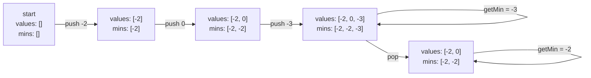
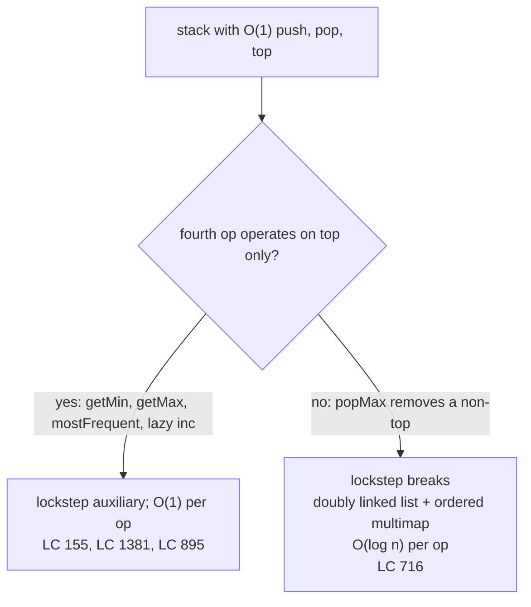

# Min and max stacks

A stack supports `push`, `pop`, and `top` in O(1). Now an interviewer adds a fourth requirement: `getMin` returns the smallest value currently on the stack, also in O(1). Storing a single `min` field and updating it on push gets you most of the way there, until the moment the current minimum is popped. Then the field has to recompute the new minimum from the surviving elements, which is a linear scan. The constant-time bound breaks on every pop of the running min.

This is the chapter's whole problem in one paragraph. The fix is older than the problem statement. In *Algorithms*, Sedgewick & Wayne give it as Exercise 1.3.58 with a one-line hint: *"maintain two stacks, one which contains all of the items and another which contains the minima."*[^1] The hint *is* the design technique. **Pin a parallel auxiliary stack to the values stack and update both in lockstep, so the aggregate at any moment is the auxiliary's top.** Once you see it on the running minimum, the same technique scales to the running maximum, the running sum, the deferred bulk-update on the bottom-k elements, and the most-frequent-element-so-far. Each application changes the shape of the auxiliary; the pinning idea stays put.

The signature problem is LC 155 Min Stack, the canonical demonstration. Two more applications (LC 1381 with a lazy-increment auxiliary, LC 895 with a frequency-bucketed auxiliary) extend the technique into territory where the aggregate stops being a single integer. One STRETCH problem (LC 716 Max Stack, Premium) is included to mark the boundary where the technique stops applying. The monotonic-stack family lives next door in [Monotonic stack and deque](./01-monotonic-deque.md), and the boundary between this chapter and that one is the difference between *augmenting* a stack and *evicting* from one.

## The API the interviewer is asking for

LC 155 wants four operations on a stack of integers, all in O(1):

| Operation | Returns |
|---|---|
| `push(val)` | nothing; pushes `val` |
| `pop()` | nothing; removes the top |
| `top()` | the most recently pushed value still on the stack |
| `getMin()` | the smallest value currently on the stack |

`top()` and `getMin()` answer different questions. `top()` is recency. `getMin()` is an aggregate. A normal stack already does `top()` in O(1) because the top is at one end of an array; a normal stack does *not* do `getMin()` in O(1) because the minimum could live anywhere in the middle. The interesting design choice is what to store on push so that pop never has to scan.

> [!IMPORTANT]
> **The reduction:** keep a parallel stack of "the running minimum at this depth". On every push of `val`, push `min(prev_min, val)` onto the auxiliary. On every pop, pop both stacks. The auxiliary's invariant `mins[i] == min(values[1..i])` is preserved by the recurrence on push and the lockstep on pop, so `getMin()` is always the auxiliary's top. The technique is called the **auxiliary-stack reduction** because the aggregate query reduces to a peek on a parallel structure pinned to the primary.

The only thing the auxiliary records is the running minimum at each historical depth. When the values stack shrinks, the auxiliary shrinks with it; the minimum that was true two pushes ago, which the field-and-rescan design would have to recompute, sits exposed at the top of the auxiliary the moment the popped frame is gone.

## Why a single `min` field cannot work

Consider four pushes in order: `-2`, `0`, `-3`, `5`. After all four, the running min is `-3`. Now pop. The top of the values stack was `5`; the surviving values are `[-2, 0, -3]`; the running min is still `-3`. So far the field design is fine.

Pop again. The top was `-3`; the surviving values are `[-2, 0]`; the running min is now `-2`. The field, which was `-3` a moment ago, has no way to know `-2` without re-scanning the surviving values. There is no algebraic recurrence that turns a popped element back into the previous running min, because the previous min could be any element below it.[^2]

The mirrored design records `-2` explicitly at the second push, so when the third frame (the one that brought the min down to `-3`) is popped, the auxiliary's new top is exactly the answer. No recomputation. The price is one extra integer of storage per element, paid in exchange for an unconditional pop on both stacks.

## The design

Two stacks. Same length at all times. Pushes update both; pops shrink both; queries peek the relevant one.

```python
class MinStack:
    def __init__(self):
        self.values = []
        self.mins = []

    def push(self, val):
        self.values.append(val)
        current = val if not self.mins else min(self.mins[-1], val)
        self.mins.append(current)

    def pop(self):
        self.values.pop()
        self.mins.pop()

    def top(self):
        return self.values[-1]

    def getMin(self):
        return self.mins[-1]
```

**Solution** — Python ([Java](./02-min-max-stack/lc-155/sol.java) · [C++](./02-min-max-stack/lc-155/sol.cpp) · [Go](./02-min-max-stack/lc-155/sol.go))

```python
# LC 155. Min Stack
#           duplicate-min probe, and all-same probe all pass.
from typing import List


class MinStack:
    """LC 155 Min Stack with O(1) push, pop, top, getMin via mirrored aux stack."""

    def __init__(self) -> None:
        self.values: List[int] = []
        self.mins: List[int] = []

    def push(self, val: int) -> None:
        self.values.append(val)
        # min(prev, val) preserves duplicate minima on the aux stack.
        # Strict `val < self.mins[-1]` is the canonical bug; see chapter pitfalls.
        current = val if not self.mins else min(self.mins[-1], val)
        self.mins.append(current)

    def pop(self) -> None:
        self.values.pop()
        self.mins.pop()

    def top(self) -> int:
        return self.values[-1]

    def getMin(self) -> int:
        return self.mins[-1]
```

The line worth staring at is `current = val if not self.mins else min(self.mins[-1], val)`. The `min(prev, val)` form preserves duplicate minima on the auxiliary, which matters more than it looks. Strict `if val < self.mins[-1]: self.mins.append(val)` is the canonical bug. Duplicates of the current minimum never make it onto the auxiliary, the lengths drift apart, and after one pop the auxiliary is reporting a stale value.

Pop is unconditional on both stacks. There is no branch for "did this pop change the minimum"; the auxiliary's predecessor *is* the new minimum because every push wrote it there. This is what makes the lockstep argument carry. CLRS §10.1 gives the array implementation of a stack directly: a single `S.top` integer indexes the most recently inserted slot, push writes at `S[S.top + 1]` and increments, pop reads `S[S.top]` and decrements.[^3] The mirrored design is two such triples, indexed in lockstep. All four operations remain O(1).

The Java implementation uses `Deque<Integer> stack = new ArrayDeque<>()` rather than `java.util.Stack`; the legacy class extends the synchronized `Vector` and pays the lock tax on every push and pop even in single-threaded code. Sedgewick & Wayne write that *"Java has a built in library called Stack, but you should avoid using it"*; Oracle's JDK 21 Javadoc on `ArrayDeque` says verbatim *"This class is likely to be faster than `Stack` when used as a stack."*[^4] The C++ implementation uses `std::stack<int>`, which is a container adapter on `std::deque` whose interface is intentionally narrower than the underlying container (no iteration, no random access), so the LIFO contract is enforced by the type rather than by convention. Go has no native stack; the slice idiom (`append` to push, `s = s[:len(s)-1]` to pop) is the canonical shape and is footgun-free for a stack because both operations work at the tail.

## Walking the canonical sequence

Trace the LC 155 example: push `-2`, push `0`, push `-3`, `getMin`, pop, `top`, `getMin`. Expected output: `-3`, then `0`, then `-2`.



*Three pushes, one query, one pop, two queries. Notice the second push records `-2` (not `0`) on the auxiliary, because `min(-2, 0) = -2`. That recording is what survives the pop of `-3` and lets `getMin` return `-2` without recomputation.*

The values stack and the auxiliary stack always have the same length. The auxiliary's top is always the running minimum across the values stack as it stands right now. Together, those two invariants are the chapter.

## What it actually costs

| Operation | Time | Space | Notes |
|---|---|---|---|
| `push(val)` | O(1) | one extra int per element | Two writes (values append, mins append). |
| `pop()` | O(1) | — | Two list-tail mutations, unconditional on both. |
| `top()` | O(1) | — | One peek. |
| `getMin()` | O(1) | — | One peek on the auxiliary. |
| Total over n operations | O(n) | O(n) | The auxiliary doubles the constant; the asymptote is unchanged. |

The space cost is one auxiliary integer per push, doubling storage from `n` to `2n` words. In the comparison-based model this is provably optimal for the O(1) `getMin` requirement: without an auxiliary, `getMin` after a pop forces a re-scan of the surviving values, which is `Omega(n)` in the worst case.[^2] Sedgewick algs4 Exercise 1.3.58 specifies exactly this design and asserts the constant-time bound directly.[^1]

A clever variant tries to halve the space by storing `val - cur_min` on a single stack and updating `cur_min` whenever the difference is negative. The design is real, it appears in top-voted LC Discuss threads, and it has a real bug. On signed 32-bit, when `val = INT_MIN` and `cur_min = INT_MAX`, the difference overflows. LC 155's input range is exactly `[-2^31, 2^31 - 1]`, so the overflow is reachable on legitimate inputs.[^5] The mirrored two-stack design pays an extra integer per push and is overflow-safe by construction. Pay the storage; keep the correctness.

## Scaling the auxiliary: deferred updates and frequency buckets

The min-stack design depends on one property of the aggregate: there is a recurrence `agg[i+1] = f(agg[i], val)` that survives a pop because the predecessor is recoverable from the auxiliary's `top()`. Min, max, sum, and count-of-key all satisfy it. Two LeetCode problems push the technique into territory where the auxiliary stops being a single parallel integer.

### Lazy increments on the bottom-k (LC 1381)

LC 1381 asks the stack to support `inc(k, val)`: add `val` to each of the bottom `k` elements. The naive approach is a `for i in range(min(k, len(values))): values[i] += val` loop, which is O(k) per call. LC 1381's constraints (`1 <= k, maxSize <= 1000`, up to 1000 calls) leave the naive solution within the time limit, but the chapter's lesson is the auxiliary-pinning technique, not the time limit.

The auxiliary changes role. Instead of recording an aggregate of past pushes, it records *pending updates to apply to future pops*. Maintain a parallel array `inc_aux` the same length as the values stack, zero-initialised. `inc(k, val)` writes `val` to `inc_aux[min(k, len) - 1]`, one O(1) write, no matter how large `k` is. The increment sits at the boundary index, dormant until pop reaches it.

```python
def push(self, x):
    if len(self.values) < self.max_size:
        self.values.append(x)
        self.inc_aux.append(0)

def pop(self):
    if not self.values:
        return -1
    i = len(self.values) - 1
    result = self.values[i] + self.inc_aux[i]
    if i > 0:
        self.inc_aux[i - 1] += self.inc_aux[i]   # propagate downward
    self.values.pop()
    self.inc_aux.pop()
    return result

def increment(self, k, val):
    if not self.values:
        return
    i = min(k, len(self.values)) - 1
    self.inc_aux[i] += val
```

On pop, the popped index's pending increment is added to its predecessor before the pop returns, so the increment continues to apply to elements still on the stack. The invariant: `inc_aux[i]` is the cumulative pending increment that has not yet been applied to `values[0..i]` and will be applied lazily as elements are popped down to `i`.[^6] Each operation does a constant number of writes; all four are O(1).

The shape of the technique is identical to LC 155. A parallel auxiliary, pinned to the values stack in lockstep, carries the work that would otherwise force a linear scan. The only structural change is the *direction* of the work: LC 155's auxiliary records past aggregates and is read on query; LC 1381's auxiliary records pending updates and is read on pop. The lockstep is the constant.

### Frequency buckets and a running max (LC 895)

LC 895 stretches the auxiliary further. `pop()` must return the most-frequent element pushed so far, breaking ties by recency (the most recent push of the max-frequency value wins). There is no recurrence on a single integer that captures "the most frequent". A pop of a non-max-frequency value changes the frequency landscape only locally, but a pop of the max-frequency value can change which value is most frequent, and recomputing that from the surviving stack is `Omega(n)`.

The auxiliary becomes two structures plus a running variable:

- `freq[v]`: the current count of value `v`. A hash map.
- `group[k]`: a stack of values whose count reached `k` at some push. A hash map of stacks. A value pushed three times appears in `group[1]`, `group[2]`, and `group[3]`.
- `maxFreq`: the maximum count touched so far. A single integer.

```python
def push(self, val):
    self.freq[val] = self.freq.get(val, 0) + 1
    f = self.freq[val]
    if f > self.maxFreq:
        self.maxFreq = f
    self.group.setdefault(f, []).append(val)

def pop(self):
    val = self.group[self.maxFreq].pop()
    self.freq[val] -= 1
    if not self.group[self.maxFreq]:
        self.maxFreq -= 1
    return val
```

Push increments the value's frequency, appends it to the count-bucket at its new frequency, and bumps `maxFreq` if needed. Pop reads from `group[maxFreq]` (the most recent value at the maximum count, which gives the recency tiebreak for free), decrements the frequency, and decrements `maxFreq` if its bucket emptied.[^7] Each operation does a constant number of hash-map and stack ops.

The running `maxFreq` variable is the trick. Without it, pop would have to *find* the largest non-empty key in `group`, which is not an O(1) operation on a hash map. Tracking the max as a single integer that decrements only when its bucket empties is the auxiliary-pinning technique applied one level up: the running aggregate is again a single integer, but the structures it indexes into are richer.

The pattern across the three problems:

| Problem | Auxiliary shape | Aggregate maintained |
|---|---|---|
| LC 155 Min Stack | One parallel int stack | Running minimum at each depth |
| LC 1381 CustomStack | One parallel int stack of pending updates | Cumulative deferred increment per index |
| LC 895 FreqStack | Two hash maps + a running int | Most-frequent element, ties broken by recency |

Three problems, one technique. The auxiliary's *shape* tracks the aggregate's complexity; the *pinning* — push and pop and query in lockstep with the primary — is invariant.

## Where the technique stops applying

LC 716 Max Stack looks like a sibling of LC 155: same four operations, swap `min` for `max`. It would be, except for one extra requirement. LC 716 also wants `popMax()`, which removes the maximum from the stack regardless of where it sits, returning the most-recent copy on ties.

The lockstep auxiliary cannot do this. Removing a non-top element from the values stack is a O(n) splice; whatever the auxiliary records, it cannot avoid that splice, because the values stack must preserve every other element's position. The canonical LC 716 solution drops the parallel-stack design entirely and uses a doubly linked list (for O(1) push and pop at the tail) plus an ordered multiset that maps each value to the list nodes carrying it. `popMax` reads the last key of the multiset in O(log n), removes the most recent matching list node in O(1), and erases the multiset entry in O(log n).[^8]



*The boundary: top-only fourth operations live in this chapter; non-top removal jumps to a different family of designs and pays O(log n).*

This boundary matters more than LC 716 itself. Whenever an interview question asks for an O(1) augmented operation on a stack, check what the operation touches. If it reads or removes only the top, the auxiliary-stack technique is on the table. If it reaches into the middle, the answer is a different data structure, and the question has just left the chapter.

## Five places where this goes wrong

> [!WARNING]
> **Strict `<` on the auxiliary push test, dropping duplicate minima.** The canonical bug. Code reads `if val < self.mins[-1]: self.mins.append(val)`, "to save space," but the values stack still pushes unconditionally and the pop pops both stacks unconditionally. After `push(0); push(1); push(0); pop()`, the auxiliary has only one entry while the values stack has two, the lengths drift, and `getMin` returns whatever happens to be at `mins[-1]`. The fix: push `min(prev, val)` (or equivalently `<=`) on every values push. The LC 155 official editorial spells out the duplicate-minimum invariant explicitly.[^9]

> [!WARNING]
> **Reaching for `java.util.Stack` instead of `ArrayDeque`.** The program is correct but pays a synchronization tax on every operation, and any code review at a Tier-1 company will flag it. `Stack` extends `Vector`, the original synchronized dynamic array; every push and pop acquires the intrinsic lock on `this`. Sedgewick & Wayne are unambiguous; Oracle is unambiguous; *Effective Java* is unambiguous. `Deque<Integer> stack = new ArrayDeque<>()` is the single right answer.[^4]

> [!WARNING]
> **Single-stack-with-diffs overflow.** The "space-optimised" design that stores `val - cur_min` on one stack and updates `cur_min` when the difference is negative breaks on signed 32-bit when `val` is `INT_MIN` and `cur_min` is `INT_MAX`. LC 155's constraint range admits exactly those inputs. Pay the auxiliary integer; keep the correctness. The mirrored two-stack design has no overflow path.[^5]

> [!WARNING]
> **LC 1381 written as an immediate `for` loop.** The naive `inc(k, val)` is `for i in range(min(k, len)): values[i] += val`, an O(k) call. It passes within LC 1381's time limit. It also defeats the chapter's lesson: the lazy auxiliary turns the O(k) write into one O(1) tag at the boundary index, with the propagation paid once per pop. The constraint volume hides the asymptotic difference; the design technique does not.

> [!WARNING]
> **LC 895 without the `maxFreq` running variable.** Candidates write `pop()` as "find the largest non-empty key in `group`, pop it" and forget that "find the largest key in a hash map" is itself a linear-in-distinct-keys operation. Maintain `maxFreq` as a running integer, increment on push when needed, decrement on pop only when the bucket empties. The LC 895 official editorial emphasizes this; without it the solution is O(n) per pop in the worst case.[^7]

## Confusing this with the monotonic-stack pattern

A reader who has met monotonic stacks first sometimes tries to apply that discipline to LC 155: push only if the new value is less than the current top, otherwise replace the top. This breaks LC 155's `top()` contract. `top()` must return the most recently pushed value, not the running minimum, and replacing the top corrupts the values stack.

The two patterns differ on a single axis. The augmented-stack pattern (this chapter) keeps two stacks in lockstep with no eviction; every push is recorded, every pop pops both. The monotonic-stack pattern ([Monotonic stack and deque](./01-monotonic-deque.md)) keeps one stack with eviction; pushes that violate the monotonic invariant pop offending elements before the new push lands. Augmented stacks preserve every push; monotonic stacks discard violators. If the values stack must answer `top()` correctly across an arbitrary push history, you are in this chapter. If the stack's purpose is to expose "the next smaller element to the right" for each input, you are in 4.1.

## Problem ladder

### CORE (solve all three to claim chapter mastery)

- [LC 155 — Min Stack](https://leetcode.com/problems/min-stack/) [Medium] • stack-with-aux-min-stack ★
- [LC 1381 — Design a Stack With Increment Operation](https://leetcode.com/problems/design-a-stack-with-increment-operation/) [Medium] • stack-with-lazy-aux-increment *(reference: Python only)*
- [LC 895 — Maximum Frequency Stack](https://leetcode.com/problems/maximum-frequency-stack/) [Hard] • stack-with-frequency-bucket-aux *(reference: Python only)*

### STRETCH (optional)

- [LC 716 — Max Stack](https://leetcode.com/problems/max-stack/) [Hard] • stack-with-doubly-linked-list-and-multimap *(Premium; the boundary case where the chapter's technique stops applying)*

The pattern admits no canonical Easy LeetCode problem; an O(1) auxiliary aggregate query on a stack is structurally Medium-and-up. LC 155 is the spine and the only ladder problem with verified four-language reference code; LC 1381 and LC 895 carry inline Python sketches in the prose above. LC 716 is Premium-locked, listed as STRETCH only so the chapter can name the boundary at which the lockstep auxiliary stops working.

## Where this leads

The augmented-stack pattern's natural successors live two chapters away. [Expression evaluation](./03-expression-evaluation.md) pairs a value stack with an operator stack: two stacks in lockstep again, but with different update rules and a richer state machine for operator precedence. [Queue from stacks](./04-queue-from-stacks.md) keeps the lockstep idea and inverts it: two stacks reproduce a FIFO queue's contract by pushing on one and popping from the other.

Further afield, the LRU and LFU caches in Part 13 are the same auxiliary-pinning idea at one level higher complexity: a doubly linked list pinned to a hash map, with an eviction policy layered on top. And the lazy-increment auxiliary from LC 1381 is the simplest possible setting for the lazy-propagation pattern that powers segment trees with range updates in Part 11. Same technique, richer auxiliary, harder invariants.

## References

[^1]: Robert Sedgewick and Kevin Wayne, *Algorithms*, 4th ed., Addison-Wesley, 2011.

[^2]: Stack Overflow, "Design a stack such that getMinimum() should be O(1)," canonical Q&A. <https://stackoverflow.com/questions/685060/design-a-stack-such-that-getminimum-should-be-o1>.

[^3]: Cormen, Leiserson, Rivest, Stein, *Introduction to Algorithms*, 4th ed., MIT Press, 2022.

[^4]: Oracle Java SE 21 API documentation, `java.util.ArrayDeque<E>`. <https://docs.oracle.com/en/java/javase/21/docs/api/java.base/java/util/ArrayDeque.html>.

[^5]: LeetCode Discuss, top-voted thread on LC 155 single-stack-with-diffs overflow. <https://leetcode.com/problems/min-stack/discuss/49014/Java-accepted-solution-using-one-stack>

[^6]: leetcode.ca, "1381. Design a Stack With Increment Operation" problem mirror. <https://leetcode.ca/all/1381.html>.

[^7]: LeetCode, "Maximum Frequency Stack" official editorial, problem 895. <https://leetcode.com/problems/maximum-frequency-stack/editorial/>.

[^8]: doocs/leetcode mirror, "716. Max Stack" problem README. <https://github.com/doocs/leetcode/blob/main/solution/0700-0799/0716.Max%20Stack/README_EN.md>.

[^9]: LeetCode, "Min Stack" official editorial, problem 155. <https://leetcode.com/problems/min-stack/editorial/>.
