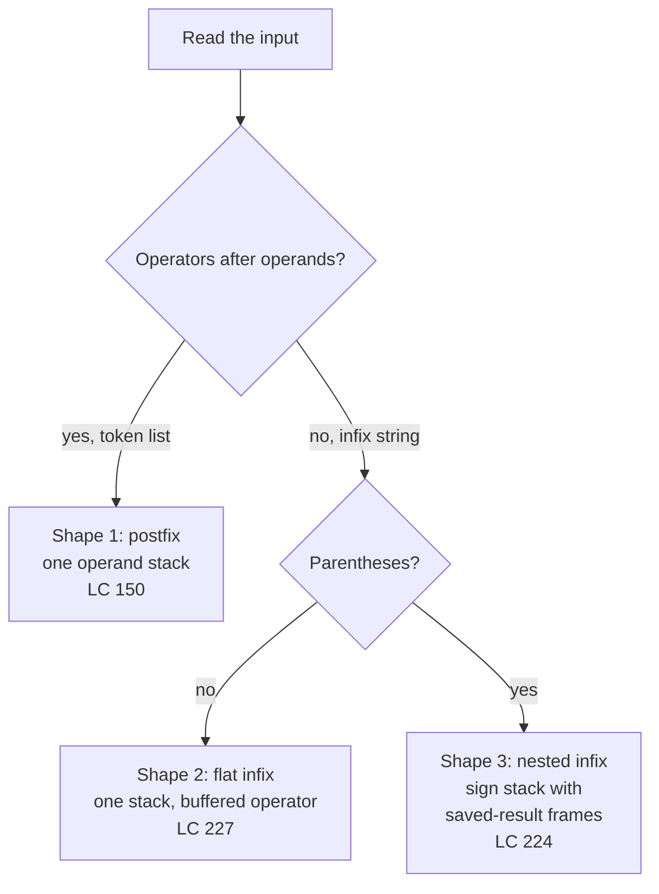

# Expression evaluation and parsing

`(1+(4+5+2)-3)+(6+8)` is the first example LeetCode 224 hands you. The string is sixteen characters long, the answer is 23, and the obvious way to compute it (read left to right, add as you go) gives 23 by accident. Try the next example, `- (3 + (4 + 5))`. Left-to-right scan returns 12. Correct answer: -12.

Once parentheses or operator precedence enter the picture, the order in which characters arrive stops matching the order in which the arithmetic should happen. Read `3 + 5 * 2` left to right and you must still compute the multiply first. Read `1 - (4 + 5)` and the `-` has to wait for two more characters before its right operand even exists. Some work has to be **suspended**, held somewhere, and resumed when the rest of its inputs show up.

The "somewhere" is a stack. That single observation is the chapter.

## Three input shapes you will meet

The chapter teaches one mental model, the operator-precedence parser realised as a stack machine, through three input shapes that look different at a glance and use the same machinery underneath. Read the input. The shape tells you the algorithm.

**Shape 1: postfix.** The operator follows its operands. `["2","1","+","3","*"]` means `(2+1)*3`. Handed to you as a list of tokens, never as a string with parentheses.

**Shape 2: flat infix with precedence.** A string like `"3+5*2"`. No parentheses; mixed operators that bind with different strengths. Left-to-right scan order disagrees with the order you should evaluate.

**Shape 3: infix with parentheses.** A string like `"(1+(4+5+2)-3)+(6+8)"` or `"- (3 + (4 + 5))"`. Now you have to suspend whole sub-expressions until the closing paren arrives.

Postfix is the easiest. Parens are the hardest. The chapter walks them in that order: LeetCode 150 first (Shape 1), then LeetCode 227 (Shape 2), then LeetCode 224 (Shape 3). Each one extends the previous shape's stack discipline by exactly one idea.



*The decision tree the chapter installs: classify the input first, then the algorithm picks itself.*

## Why a stack is the right shape

Reach back to [Stacks and the call stack analogy](../part-1-linear-data-structures/05-stacks.md) for a moment. A stack is the data structure of *suspended work*: you push a thing when you can't finish it yet, pop it when its time comes. Knuth set this framing in [TAOCP Volume 1, §2.2.1](https://www-cs-faculty.stanford.edu/~knuth/taocp.html) ("Stacks, Queues, and Deques") as the substrate for what he called Information Structures.[^1]

Expression parsing is the canonical use case. When you read `3 + 5 *`, the `+` cannot fire yet. Its right operand isn't fully known until you find out whether the `5` is the right operand of `+` or the left operand of `*`. The parser pushes the partial work and returns to it later. Postfix sidesteps the suspense by writing operators *after* their operands; the operands are already present when the operator is read. Infix forces you to suspend.

There's a second reason the stack is the right shape: it's the same shape recursion has, just made explicit. When you write a recursive parser whose grammar has `expr → term (('+'|'-') term)*` and `term → factor (('*'|'/') factor)*`, the call stack records exactly which sub-expression is in flight. Replace the call stack with an array, and you get the iterative versions this chapter ships. The recursion in [Part 7](../part-7-recursion-and-backtracking/) and the iterative parsers here are two encodings of the same machine.[^2]

## Shape 1: LeetCode 150, postfix

Input: a token list where every operator follows its two operands. Algorithm: one stack, scan once.

```python
def eval_rpn(tokens):
    stack = []
    for t in tokens:
        if t in ("+", "-", "*", "/") and len(t) == 1:
            b = stack.pop()
            a = stack.pop()
            if t == "+":
                stack.append(a + b)
            elif t == "-":
                stack.append(a - b)
            elif t == "*":
                stack.append(a * b)
            else:
                stack.append(int(a / b))
        else:
            stack.append(int(t))
    return stack[0]
```

**Solution** — Python ([Java](./03-expression-evaluation/lc-150/sol.java) · [C++](./03-expression-evaluation/lc-150/sol.cpp) · [Go](./03-expression-evaluation/lc-150/sol.go))

```python
# LC 150. Evaluate Reverse Polish Notation
from typing import List


def eval_rpn(tokens: List[str]) -> int:
    """Single-stack postfix evaluator. Truncate-toward-zero on division."""
    stack: List[int] = []
    for t in tokens:
        if t in ("+", "-", "*", "/") and len(t) == 1:
            b = stack.pop()
            a = stack.pop()
            if t == "+":
                stack.append(a + b)
            elif t == "-":
                stack.append(a - b)
            elif t == "*":
                stack.append(a * b)
            else:
                # int(a / b) truncates toward zero; a // b would floor and break
                # 7 / -3 (LC expects -2; floor would give -3).
                stack.append(int(a / b))
        else:
            # Operand: handles negative literals like "-11" since the operator
            # branch above requires len(t) == 1.
            stack.append(int(t))
    return stack[0]
```

The whole algorithm: numbers go on the stack, operators consume the two most recent numbers and replace them with the result. Trace `["2","1","+","3","*"]` and you'll see why it works. Push 2. Push 1. Read `+`: pop 1, pop 2, push 3. Push 3. Read `*`: pop 3, pop 3, push 9. Stack holds 9. Done. The reduction is so clean you can almost feel why HP shipped the [HP-35 in 1972](https://www.hpmuseum.org/hp35.htm) with [Reverse Polish Notation](https://en.wikipedia.org/wiki/Reverse_Polish_notation) entry. No parens, no precedence rules, no editorial decisions about evaluation order; the order of typing *is* the order of evaluation.[^3]

> [!WARNING]
> **Python's `//` is floor division, not truncate-toward-zero.** LeetCode 150 explicitly says "Division between two integers should truncate toward zero." For `7 / -3`, that's -2. Python's `7 // -3` floors and gives -3. The fix is `int(a / b)`, which converts to float, divides, and `int()` truncates toward zero. The float intermediate has no precision loss inside LC 150's 32-bit operand range. Java, C++, and Go default `/` operator already truncates toward zero, so they need no special handling. PEP 238 separated true division from floor division in Python 3 specifically to make the difference visible at the source level.[^4]

A second pitfall hiding in the operand parser: the token `"-11"` is a negative integer literal, not the operator `-` followed by `11`. The check `if t in ("+", "-", "*", "/")` would correctly return False for `"-11"` (set membership is exact equality), but the variant `if "-" in t` is *substring* membership and matches `"-11"` as well as `"-"`. Always test exact tokens; the `len(t) == 1` guard in the code above is defensive belt-and-suspenders.

## Shape 2: LeetCode 227, flat infix with precedence

Input: a string like `"3+5/2"`. Operators are mixed precedence; no parentheses; whitespace allowed.

The naive instinct is a single accumulator that applies operators in scan order: read 3, see `+`, read 5, accumulate to 8, see `/`, read 2, accumulate to 4. That returns 4. The correct answer is 5 (3 + 5/2, integer-truncated). Left-to-right is wrong because `*` and `/` bind tighter than `+` and `-`.

The fix is one stack and one buffered operator. Here's the invariant: as you scan, you remember the *previous* operator in a variable `op`, and you buffer the digits of the current number in `num`. When you read the next operator (or hit end of string), `op` tells you what to do with `num`:

- `+`: push `num`.
- `-`: push `-num`.
- `*`: pop the top, multiply by `num`, push back.
- `/`: pop the top, integer-divide by `num`, push back.

After the scan, sum the stack. The `+` and `-` cases are *deferred*: they push signed operands and let the final sum resolve them. The `*` and `/` cases are *eager*: they apply immediately, consuming and replacing the top of the stack. That is what gives `*` and `/` their higher binding strength. They fire before they can be overruled.

```python
def calculate(s):
    stack = []
    num = 0
    op = "+"  # virtual leading operator
    n = len(s)
    for i, ch in enumerate(s):
        if ch.isdigit():
            num = num * 10 + (ord(ch) - ord("0"))
        if (not ch.isdigit() and ch != " ") or i == n - 1:
            if op == "+":
                stack.append(num)
            elif op == "-":
                stack.append(-num)
            elif op == "*":
                stack.append(stack.pop() * num)
            else:  # /
                top = stack.pop()
                stack.append(int(top / num))
            num = 0
            op = ch
    return sum(stack)
```

**Solution** — Python ([Java](./03-expression-evaluation/lc-227/sol.java) · [C++](./03-expression-evaluation/lc-227/sol.cpp) · [Go](./03-expression-evaluation/lc-227/sol.go))

```python
# LC 227. Basic Calculator II
from typing import List


def calculate(s: str) -> int:
    """One-stack precedence-by-deferral evaluator.

    Defer + and - by pushing signed operands; apply * and / immediately by
    replacing the top of the stack. Final answer is sum(stack).
    """
    stack: List[int] = []
    num = 0
    op = "+"  # virtual leading operator
    n = len(s)
    for i, ch in enumerate(s):
        if ch.isdigit():
            num = num * 10 + (ord(ch) - ord("0"))
        if (not ch.isdigit() and ch != " ") or i == n - 1:
            if op == "+":
                stack.append(num)
            elif op == "-":
                stack.append(-num)
            elif op == "*":
                stack.append(stack.pop() * num)
            else:  # '/'
                top = stack.pop()
                # int(top / num) truncates toward zero; // would floor.
                stack.append(int(top / num))
            num = 0
            op = ch
    return sum(stack)
```

Trace `"3+5/2"` to convince yourself. The virtual leading `+` lets the first number flush cleanly: at i=1 the `+` is read, `op` is `+`, push 3. Buffer becomes 5. At i=3 the `/` is read, `op` is `+`, push 5. Buffer becomes 2. At i=4 (last char) the loop also flushes: `op` is `/`, pop 5, push `int(5/2) = 2`. Stack holds `[3, 2]`. Sum is 5.

Two details earn the buffered-operator design. First, the multi-digit number rule: `"12+34"` must be 46, not 1+2+3+4. The `num = num * 10 + digit` accumulator gathers digits until a non-digit closes the number. Second, the per-character `if (not ch.isdigit() ...) or i == n-1` flush condition handles end-of-string without a special case: when the loop's last character is a digit, the second clause forces a flush of the buffered number with the buffered operator.

> [!IMPORTANT]
> The textbook way to handle Shape 2 is the [shunting-yard algorithm](https://en.wikipedia.org/wiki/Shunting_yard_algorithm), which Edsger Dijkstra published in 1961 inside the Stichting Mathematisch Centrum report MR 34/61, *ALGOL 60 Translation*, as an unnamed subroutine in his X1 ALGOL 60 translator.[^5] Shunting-yard uses two stacks: an output queue for postfix tokens and an operator stack for pending operators, popping the operator stack whenever the incoming operator has lower-or-equal precedence (left-associative). It works. It's also longer than the one-stack version above, because it does a *conversion* to postfix before evaluating. The one-stack lazy-push collapses the conversion into the evaluation: the `op` buffer is the operator stack, restricted to one slot because flat infix with hard-coded precedence never needs more.

## Shape 3: LeetCode 224, parens and unary minus

Input: a string with `+`, `-`, parentheses, and possibly a leading or post-paren `-` that means unary negation. No `*` or `/` (that's LC 772, which is paywalled).

The parens are the new thing. When you read `(`, the work in front of you isn't done. You have a partial result and a pending sign that *applies to the entire upcoming sub-expression*, and you need to put both aside until the matching `)` arrives, evaluate the inside in a fresh frame, then come back and combine.

The shape that works: a stack of `(saved_result, saved_sign)` pairs. On `(`, push both, then reset to a fresh frame (`result = 0, sign = +1`). On `)`, fold the inside back: `result = saved_result + saved_sign * result`. Between parens, `+` and `-` accumulate into `result` while updating `sign`; numbers go through a `num` accumulator the same way LC 227 did.

```python
def calculate(s):
    stack = []
    result = 0
    num = 0
    sign = 1
    for ch in s:
        if ch.isdigit():
            num = num * 10 + (ord(ch) - ord("0"))
        elif ch == "+":
            result += sign * num
            num = 0
            sign = 1
        elif ch == "-":
            result += sign * num
            num = 0
            sign = -1
        elif ch == "(":
            stack.append(result)
            stack.append(sign)
            result = 0
            sign = 1
        elif ch == ")":
            result += sign * num
            num = 0
            result *= stack.pop()  # the saved sign
            result += stack.pop()  # the saved running result
    result += sign * num
    return result
```

**Solution** — Python ([Java](./03-expression-evaluation/lc-224/sol.java) · [C++](./03-expression-evaluation/lc-224/sol.cpp) · [Go](./03-expression-evaluation/lc-224/sol.go))

```python
# LC 224. Basic Calculator
from typing import List


def calculate(s: str) -> int:
    """Sign-stack iterative evaluator for +/- with parentheses and unary minus.

    On '(', push (saved_result, saved_sign) and reset to a fresh frame.
    On ')', fold the inner result back: result = saved_result + saved_sign * result.
    """
    stack: List[int] = []
    result = 0
    num = 0
    sign = 1  # +1 or -1
    for ch in s:
        if ch.isdigit():
            num = num * 10 + (ord(ch) - ord("0"))
        elif ch == "+":
            result += sign * num
            num = 0
            sign = 1
        elif ch == "-":
            result += sign * num
            num = 0
            sign = -1
        elif ch == "(":
            stack.append(result)
            stack.append(sign)
            result = 0
            sign = 1
        elif ch == ")":
            result += sign * num
            num = 0
            result *= stack.pop()  # the saved sign
            result += stack.pop()  # the saved running result
        # whitespace: skip
    result += sign * num
    return result
```

Walk `"- (3 + (4 + 5))"` carefully. The leading `-` sets `sign = -1` (the binary-minus branch runs, but `result` and `num` are both 0, so the only surviving effect is the sign update). The `(` pushes `(0, -1)` and resets to a fresh frame. Inside the outer parens: read 3, then `+` flushes 3 into the inner result and resets sign to 1. Buffer 4. Read `(`, push `(3, 1)`, reset. Inside: 4, then `+`, then 5. The closing `)` flushes 5 into the innermost result (now 9), pops the saved `1` and multiplies (9 stays 9), pops the saved 3 and adds (12). Now we're back at the outer parens with `result = 12`. The closing `)` pops the original `-1` and multiplies (-12), pops the original 0 and adds (-12). Answer: -12.

The unary minus handling is the elegant part. The same code path runs for binary `-` and unary `-`. The reason it works: at start of input or immediately after `(`, `result` is 0 and `num` is 0, so the `result += sign * num` step in the `-` branch is a no-op. Only the `sign := -1` update survives, which is exactly what unary minus should do.[^6]

The chapter's signature problem is LC 224 because it asks the most of the pattern: precedence (one level, parens vs not), state suspension across nested groups, and unary operators. If you can write this iteratively, recursive descent (Shape 3 with `*` and `/` added back) is a small extension. The call stack does the work the explicit `(saved_result, saved_sign)` stack does here.

## What it actually costs

| Variant | Time | Space | Why |
|---|---|---|---|
| Postfix (LC 150) | O(n) | O(n) | Each token: one push or one pop+pop+push. |
| Lazy-push infix (LC 227) | O(n) | O(n) | Each character: one push at most; the final `sum` is O(stack size) ≤ O(n). |
| Sign-stack with parens (LC 224) | O(n) | O(d), d = nesting depth | Each `(` pushes two ints; matched `)` pops them. d ≤ n. |
| Recursive descent | O(n) time, O(d) recursion depth | O(n) | One linear pass per [LL(1) predictive parser](https://en.wikipedia.org/wiki/Recursive_descent_parser); depth = parse-tree depth.[^2] |

The amortisation argument is the same for all four. Each input character is read once. Each operand is pushed at most once and popped at most once. Each operator is consumed at most once. Push and pop are O(1) on a contiguous-array stack.[^1] Total work is linear; total space is bounded by maximum simultaneous stack depth, which for arithmetic is parenthesis nesting depth in the worst case.

A small warning about LC 224's stack depth in Python: the iterative shape uses an explicit list, which is fine. The recursive-descent alternative for the same problem would use Python's call stack, capped by default at 1000 frames. LeetCode's `s.length ≤ 3 × 10^4` allows nesting depth up to ~15,000, which is well above the default. If you write a recursive parser in Python, raise the limit once at module top: `sys.setrecursionlimit(10**6)`. Java, C++, and Go aren't affected at LC scale. Java's `-Xss` gives ~10^4 frames in practice, C++ on Linux/macOS main thread has ~10^5, and Go's goroutine stack auto-grows.

## Pitfalls that bite

> [!WARNING]
> **Operator precedence ignored on flat infix.** Returning 16 for `"3+5*2"` (because you applied `+` first) is the canonical LC 227 first-attempt bug. The fix is the buffered-operator pattern above: defer `+` and `-`, eagerly apply `*` and `/`. If you find yourself reaching for two stacks (operands + operators), step back. For the four arithmetic operators with hardcoded precedence, one stack and one `op` variable is enough. The two-stack shunting-yard is correct, just longer.

> [!WARNING]
> **Unary minus dropped across parens.** `"-(3+4)"` returns 7 instead of -7 if the parser treats the leading `-` as a no-op or as a binary operator that needs a left operand. The sign-stack shape gets this right by accident: the `-` branch updates `sign := -1` even when `result` and `num` are zero, and the next `(` captures that sign in the saved frame. Test your LC 224 solution on `"- (3 + (4 + 5))"` before submitting; this case is in the hidden test set, not the visible examples.

> [!WARNING]
> **Multi-digit numbers split into individual digits.** `"12+34"` returning 10 instead of 46 means the parser pushed each digit as a separate operand. Always accumulate: `num = num * 10 + (ch - '0')` while the character is a digit; flush `num` only when a non-digit non-whitespace character arrives or the input ends.

## Problem ladder

### CORE (solve all three to claim chapter mastery)

- [LC 150 — Evaluate Reverse Polish Notation](https://leetcode.com/problems/evaluate-reverse-polish-notation/) [Medium] • stack-postfix-evaluation
- [LC 227 — Basic Calculator II](https://leetcode.com/problems/basic-calculator-ii/) [Medium] • stack-precedence-deferral
- [LC 224 — Basic Calculator](https://leetcode.com/problems/basic-calculator/) [Hard] • stack-sign-state ★

### STRETCH (optional)

- [LC 394 — Decode String](https://leetcode.com/problems/decode-string/) [Medium] • stack-recursive-on-stack
- [LC 1106 — Parsing A Boolean Expression](https://leetcode.com/problems/parsing-a-boolean-expression/) [Hard] • recursive-descent

There is no Easy in the CORE set. The simplest stack-based parser problem, LC 20 Valid Parentheses, is a degenerate parser without operator semantics and lives in [Stacks and the call stack analogy](../part-1-linear-data-structures/05-stacks.md), not here. LC 224 is the chapter's star (★) because it's where the three Shapes' patterns converge. LC 772 Basic Calculator III is the natural extension (parens plus all four operators) but is paywalled on LeetCode; the free-alternative path is to solve LC 224 and LC 227 and fuse them mechanically.

LC 394 and LC 1106 are the chapter's payoff. LC 394 swaps arithmetic for string repetition: `"3[a2[c]]" → "accaccacc"`. The shape is the same as LC 224 (push state on the opening bracket, fold back on the closing one), except now the state is `(count, partial_string)` instead of `(saved_result, saved_sign)`. That's the moment you realise this chapter isn't really about calculators. LC 1106 generalises further to N-ary boolean operators, which is where iterative shapes start straining and recursive descent is the cleaner answer; that's the bridge to [Part 7](../part-7-recursion-and-backtracking/) and to grammar-driven parsing later in the curriculum.

## Where this leads

The next chapter, [Queue from stacks](./04-queue-from-stacks.md), reuses the two-stack composition mental model in a different setting: two stacks chained together to simulate a queue. Same physical primitive, different invariant.

Further out, [Part 7 Recursion and backtracking](../part-7-recursion-and-backtracking/) revisits this chapter's machinery with the call stack as the explicit operator stack. Once you've internalised why LC 224's iterative sign-stack works, the recursive-descent variant of the same parser is a five-minute exercise. Each grammar nonterminal becomes a function; the function call boundary is what was a `(` push; the function return is what was a `)` pop; recursion is the mechanism. The Dragon Book canonises this in §4.4.[^2]

## References

[^1]: Donald E. Knuth, *The Art of Computer Programming*, Volume 1: *Fundamental Algorithms*, 3rd ed., Addison-Wesley, 1997, §2.2.1 "Stacks, Queues, and Deques," pp.

[^2]: Alfred V. Aho, Monica S. Lam, Ravi Sethi, and Jeffrey D. Ullman, *Compilers: Principles, Techniques, and Tools*, 2nd ed. (the Dragon Book), Pearson, 2007, §4.4 "Top-Down Parsing," pp.

[^3]: *HP-35 Operating Manual*, Hewlett-Packard, 1972; HP Computer Museum collection at <https://www.hpmuseum.org/hp35.htm>.

[^4]: Guido van Rossum and Moshe Zadka, "PEP 238: Changing the Division Operator," March 2001, <https://peps.python.org/pep-0238/>

[^5]: Edsger W. The original report describing what is now called the [shunting-yard algorithm](https://en.wikipedia.org/wiki/Shunting_yard_algorithm)

[^6]: LeetCode community top-voted solution thread for LC 224, sign-stack iterative shape, <https://leetcode.com/problems/basic-calculator/solutions/>.
