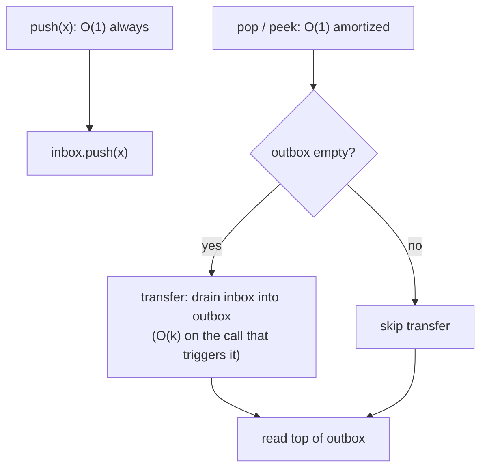

# Queue from stacks

A LIFO stack and a FIFO queue look like opposites. Push and pop on a stack always touch the top; enqueue and dequeue on a queue touch opposite ends. So the question LC 232 asks should sound impossible at first read: *implement a queue where the only primitives you may use are stack operations*. No `popleft`, no `dequeue`, no doubly-linked list, no random access. Just `push`, `pop`, `peek`, `isEmpty` on stacks. The interview rubric then quietly adds that all four queue operations should run in O(1) amortized, which makes the impossible-sounding problem sound twice as impossible.

The trick is that LIFO inverted twice is FIFO. Put incoming elements on one stack. When something asks for the FIFO front, dump that whole stack onto a second stack. The order reverses, and the bottom of the first becomes the top of the second. Read the front off the second stack from then on. The dump is expensive in the moment, but each element pays for its own dump exactly once across its lifetime in the queue, so the cost averages out to a constant. That averaging is the chapter. Robert Tarjan's 1985 paper *Amortized Computational Complexity* is where the accounting framework was formalized; the queue-from-two-stacks construction is its showpiece exercise, and it's the question every interviewer asking LC 232 expects you to walk through verbally.[^1]

## The API you owe the caller

Before any code, fix the contract. LC 232's spec gives you a class `MyQueue` with four methods:[^2]

| Method | Returns | Effect |
|---|---|---|
| `push(int x)` | nothing | adds `x` to the back of the queue |
| `pop()` | the front element | removes and returns the front |
| `peek()` | the front element | returns the front without removing |
| `empty()` | `bool` | true iff no elements are in the queue |

The constraint is on the implementation, not the interface. Inside the class you may only call `push`, `peek`, `pop`, `size`, and `is_empty` on stacks you own. You may keep as much state as you want; the spec doesn't bound auxiliary memory. So the question is shaped: what auxiliary state, manipulated through a stack-only interface, lets the four methods above run in amortized O(1)?

## The two-stack composition

Keep two stacks. Call them `inbox` and `outbox`.



*The composition. Push always lands on inbox. Pop and peek read from outbox; when outbox is empty, the transfer drains inbox in full so the bottom of inbox becomes the top of outbox, which is the FIFO front.*

The invariant is short enough to memorize. **At any moment, the queue's contents from front to back are `outbox` read top-down, followed by `inbox` read bottom-up.** Equivalently: the FIFO front sits at the top of `outbox` whenever outbox is non-empty, and the FIFO back sits at the top of `inbox`. Transfer happens only when outbox is empty *and* the caller asks for the front; when it does, it drains inbox completely and never touches outbox after it's started serving.

```python
class MyQueue:
    def __init__(self):
        self.inbox = []
        self.outbox = []

    def push(self, x):
        self.inbox.append(x)        # O(1) always

    def _transfer(self):
        while self.inbox:
            self.outbox.append(self.inbox.pop())

    def pop(self):
        if not self.outbox:
            self._transfer()
        return self.outbox.pop()    # O(1) amortized

    def peek(self):
        if not self.outbox:
            self._transfer()
        return self.outbox[-1]      # O(1) amortized

    def empty(self):
        return not self.inbox and not self.outbox
```

**Solution** — Python ([Java](./04-queue-from-stacks/lc-232/sol.java) · [C++](./04-queue-from-stacks/lc-232/sol.cpp) · [Go](./04-queue-from-stacks/lc-232/sol.go))

```python
# LC 232. Implement Queue using Stacks
from typing import List


class MyQueue:
    """LC 232. FIFO via two LIFO stacks (inbox/outbox), amortized O(1) per op.

    Push always lands on inbox. Pop and peek always read from outbox; when
    outbox is empty they drain inbox into it once, reversing the order so
    the bottom of inbox becomes the top of outbox -- the FIFO front.
    """

    def __init__(self) -> None:
        self.inbox: List[int] = []
        self.outbox: List[int] = []

    def push(self, x: int) -> None:
        self.inbox.append(x)  # O(1) always

    def _transfer(self) -> None:
        # Drain inbox into outbox; only invoked when outbox is empty so the
        # combined "outbox.reversed ++ inbox" FIFO order is preserved.
        while self.inbox:
            self.outbox.append(self.inbox.pop())

    def pop(self) -> int:
        if not self.outbox:
            self._transfer()
        return self.outbox.pop()  # O(1) amortized

    def peek(self) -> int:
        if not self.outbox:
            self._transfer()
        return self.outbox[-1]  # O(1) amortized

    def empty(self) -> bool:
        return not self.inbox and not self.outbox
```

Three small things in the code do real work.

`_transfer` is private and is invoked from inside `pop` and `peek`. It is *not* invoked from `push`. That distinction is the entire amortized-cost argument; we'll come back to it. Get it backwards (eagerly transferring on every push so outbox is always FIFO-ordered) and the design degenerates to O(n²) total over n operations. The most common LC 232 wrong answer is exactly this eager variant.

`peek` mutates the inbox/outbox split even though the queue's observable contents do not change. In C++, the `peek()` method cannot be marked `const`, because the call may run `transfer()` which writes to both stacks. Treating `peek` as a pure read is a correctness bug in this design; the user-visible read is pure, but the implementation-internal read is not.

`empty` checks both stacks. After several pops, outbox can be empty while inbox still holds the queue's contents; an `empty` that only checked outbox would lie. The two-stack split is internal bookkeeping; the queue's emptiness is the conjunction.

## Amortized O(1) per dequeue

This is the chapter's load-bearing claim, and the one the interviewer is waiting for you to derive verbally. There are three textbook ways to do the derivation, all from Tarjan's 1985 paper: the **aggregate method**, the **accounting method**, and the **potential method**.[^1] All three reach the same answer; the aggregate method is the one most readers find easiest to internalize first.

### The aggregate argument

Pick any sequence of `n` user operations: pushes, pops, peeks, in any order. Trace what happens to a single element from the moment it enters the queue to the moment it leaves.

It gets pushed onto inbox once: that's one stack op.

If a pop or peek catches it on inbox during a transfer, it gets popped off inbox once and pushed onto outbox once: two more stack ops, but only if a transfer fires before the user's `pop` would otherwise have removed it. Some elements never live to see a transfer (the user pops them before any transfer is triggered, which can't happen in this design because pop reads outbox; every popped element does pass through outbox).

It gets popped off outbox once when the user finally dequeues it: one more stack op.

Total per element across its lifetime in the queue: at most **four stack ops**. One on the user push, two on the transfer, one on the user pop. (Peek is the same as pop minus the final outbox-pop: at most three for a peek-not-popped element.)

Across `n` user operations, the total stack work is bounded by `4n`. Each individual stack operation is O(1) on a dynamic-array-backed stack: that's the result CLRS §10.1 establishes for `PUSH` and `POP` on the array implementation, and §17.4 amortizes the doubling cost so even resizing pushes are amortized O(1).[^3] Total cost: O(n) for the whole sequence. Amortized cost per user operation: O(1). The worst case on any single call is O(k) where k is the size of inbox at the moment a transfer fires, but that single expensive call is paid for by the cheap pushes that came before it.

> [!IMPORTANT]
> The verbal answer the LC 232 interviewer is listening for: *"each operation is O(1) amortized; the worst case on a single pop is O(n) when a transfer fires; over n operations the total work is bounded by 4n stack operations because each element is pushed onto inbox once, transferred at most once, and popped from outbox once."* Rehearse this sentence verbatim. It is the one LC 232 phone-screen answer that tells the interviewer you understand amortization.

### The accounting argument

Charge each user `push` two credits, each user `pop` two credits, each user `peek` one credit. One credit pays the cost of the immediate stack op (the inbox push, or the outbox pop, or the outbox peek). The second push-credit is *deposited on the element itself*. It sits there, prepaid, waiting for the future transfer.

When a transfer eventually fires for that element, it costs two stack ops: one inbox-pop, one outbox-push. Both are paid for by the deposited credits the element carried with it from the original push call. The transfer does not borrow credits from the user operation that triggered it; the trigger only pays for itself.[^4]

Sum credits charged across n user operations: at most 2n. Sum credits actually consumed: at most 2n (no element is transferred more than once, and the unmatched deposit just stays on elements still in the queue). The credit balance never goes negative, which is the formal condition for the accounting method. Amortized cost: at most 2 credits per user operation, which is O(1).

The accounting derivation is more mechanical than the aggregate derivation, but it gives the same answer and surfaces a nice mental model: every push you do is silently prepaying for the transfer that will eventually move that element to outbox. The widget below renders the credit balance as a small badge alongside each stack frame so you can watch the deposits pile up on pushes and cash out at the moment of transfer.

## Worked example: LC 232 on the canonical sequence

Trace `push(1), push(2), peek, pop, empty`. Inbox and outbox are written bottom-to-top throughout.

Initial state: `inbox = []`, `outbox = []`.

`push(1)`: append 1 to inbox. Inbox is now `[1]`. Credit balance: 1 (one credit deposited on element 1).

`push(2)`: append 2 to inbox. Inbox is now `[1, 2]`. Credit balance: 2.

`peek`: outbox is empty, so the transfer fires. Pop 2 from inbox and push it onto outbox; pop 1 from inbox and push it onto outbox. Inbox is now empty; outbox is `[2, 1]` from bottom to top. The deposited credits paid for the four stack ops. The top of outbox is 1, which is the FIFO front. **Return 1.**

`pop`: outbox is non-empty, so no transfer. Pop the top of outbox, which is 1. Outbox is now `[2]`. **Return 1.**

`empty`: inbox is empty, outbox is `[2]`. **Return false.**

Six steps in total: one init, two pushes, one transfer-fused-with-peek, one cheap pop, one query. The widget animates each step with the inbox/outbox state and the credit-balance badge alongside.

> **Interactive widget:** [Amortized queue via two stacks (LC 232)](../widgets/w-12-amortized-queue-via-stacks.yml) (panel `default`) — rendered on the website; the YAML spec describes the keyframes.

*Static fallback: across the six steps, inbox transitions through `[]`, `[1]`, `[1, 2]`, `[]`, `[]`, `[]`; outbox transitions through `[]`, `[]`, `[]`, `[2, 1]`, `[2]`, `[2]`; the credit balance climbs to 2, collapses to 0 on the transfer, and stays at 0 thereafter.*

## What it actually costs

| Operation | Time | Space | Notes |
|---|---|---|---|
| `push(x)` | O(1) worst-case | O(n) total | Always one inbox push. |
| `pop()` | O(1) amortized, O(n) worst-case | O(n) total | Worst case fires when inbox holds n elements and outbox just emptied. |
| `peek()` | O(1) amortized, O(n) worst-case | O(n) total | Same trigger condition as pop. |
| `empty()` | O(1) | O(1) | Two emptiness checks; never triggers a transfer. |

The amortized bound holds regardless of how the user interleaves pushes and pops. Alternating `push, pop, push, pop, ...` is the workload that maximizes transfer-trigger frequency: each pop fires a one-element transfer. Each pop's amortized cost is still O(1) because the matching push deposited the credit that paid for that one-element transfer. The aggregate argument above does not depend on workload shape; the `4n` ceiling is universal.

> [!NOTE]
> The single-call worst case matters for real systems even though it doesn't change the amortized bound. A queue with bounded latency requirements (a real-time scheduler, a hard-deadline UI thread) cannot use this design unmodified, because one pop call may stall for O(n). The fix is a different data structure entirely (a circular buffer, or a deque with worst-case-O(1) operations), not a tweak to the two-stack design. Interviewers occasionally ask "how would you make this worst-case O(1)?" as a follow-up; the right answer is "I wouldn't; I'd switch to a different structure," not "I'd amortize harder."

## The inverse: stack from queues (LC 225)

The mirror question, *implement a stack using only queue primitives*, sounds like the same problem ran backwards. It mostly is, with one structural twist that is the whole reason the chapter mentions both. The lazy-transfer trick that makes LC 232 amortized O(1) on every operation has no LC 225 analogue.

Here's why. In LC 232, transfer reverses order: pop from the top of inbox, push onto outbox, the bottom of inbox becomes the top of outbox. Two reversals compose to identity, so LIFO inverted twice gives FIFO. In LC 225, the candidate operation is an inversion of FIFO, but FIFO followed by FIFO doesn't reverse anything; it just preserves the original order. There is no analogous lazy-transfer that, when run, magically rearranges queue contents into LIFO order. You have to pay for the reversal explicitly, on every operation.

The canonical compact answer uses one queue and rotates on every push:

```python
from collections import deque

class MyStack:
    def __init__(self):
        self.q = deque()

    def push(self, x):
        self.q.append(x)
        # Rotate so the just-pushed element lands at the front.
        for _ in range(len(self.q) - 1):
            self.q.append(self.q.popleft())

    def pop(self):
        return self.q.popleft()  # O(1)

    def top(self):
        return self.q[0]         # O(1)

    def empty(self):
        return not self.q
```

Push enqueues `x` at the back, then rotates the queue `size - 1` times so `x` lands at the front. The rotation costs `size - 1` enqueue/dequeue pairs, which is O(n) per push. Pop and top are O(1) reads of the front. The two-queue variant trades one extra queue's worth of storage for cheap push and O(n) pop; the math doesn't get better, just shifts which end is expensive.[^5]

> [!IMPORTANT]
> When the LC 232 amortized argument is asked at LC 225 in the same loop, the right answer is *"this construction is structurally asymmetric: I can pick which side pays the linear cost (push or pop), but I can't make both sides amortized O(1) because the lazy-transfer trick from LC 232 has no FIFO dual."* Interviewers who ask both problems in sequence are usually testing whether you noticed the asymmetry.

## Where the design breaks

> [!WARNING]
> **Eager transfer on every push.** The most common LC 232 wrong answer pushes onto inbox and then immediately drains inbox into outbox so that outbox is always FIFO-ordered and pop is always O(1). The amortization fails because the inbox-to-outbox transfer happens on every push, not once per element. An adversarial workload of `n` pushes interleaved with `n` pops runs at O(n²) total cost. The lazy invariant, *"transfer only when outbox is empty AND a serve-side op is requested"*, is the entire amortized-cost trick. Without it, the two-stack queue is strictly worse than a single stack with a rotating pointer.

> [!WARNING]
> **C++ `peek` marked `const`.** Because `peek()` may invoke `transfer()`, which writes to both stacks, marking it `const` in C++ produces a compile error. The reference implementation deliberately omits the qualifier. Resist the instinct to add it back: the queue's observable state is unchanged by peek, but the implementation's internal split is not, and the two are different things. The same applies to `pop()`, which obviously mutates outbox but also mutates inbox during transfer.

> [!WARNING]
> **Java `Stack` instead of `ArrayDeque`.** `java.util.Stack` extends `Vector`, so every `push` and `pop` acquires the intrinsic monitor on `this`, even in single-threaded code. Sedgewick & Wayne's algs4 §1.3 is unambiguous: "Java has a built in library called Stack, but you should avoid using it." Oracle's own JDK 21 Javadoc on `ArrayDeque` reads: "This class is likely to be faster than `Stack` when used as a stack."[^6] The right idiom is `Deque<Integer> inbox = new ArrayDeque<>()`, with `push`, `pop`, `peek` operating at the head end. Any LC 232 submission that uses `Stack` will pass the LC harness but fail a Tier-1 code review on the syntax check alone.

> [!WARNING]
> **Confusing amortized O(1) with worst-case O(1).** Mid-interview, the candidate claims LC 232 is "O(1) per operation" and the interviewer asks "what's the worst-case cost of a single pop?" Anything other than "O(n) when a transfer fires; O(1) amortized over the operation sequence" loses the point. Memorizing "O(1)" without the qualifier is the highest-frequency LC 232 stumble. Rehearse the full sentence; reach for it whenever the interviewer pauses after the bound.

## Problem ladder

### CORE (solve both to claim chapter mastery)

- [LC 232 — Implement Queue using Stacks](https://leetcode.com/problems/implement-queue-using-stacks/) [Easy] • queue-via-two-stacks ★
- [LC 225 — Implement Stack using Queues](https://leetcode.com/problems/implement-stack-using-queues/) [Easy] • stack-via-two-queues *(reference: Python only)*

LC 232 is the chapter's signature problem (★) and the one the worked example and widget animate. LC 225 is the inversion that surfaces the structural asymmetry between LIFO-from-FIFO and FIFO-from-LIFO; it earns CORE because the asymmetry itself is the lesson, not because the rotation code is hard. The pattern admits no canonical Hard problem at the time of writing. The natural Hard candidates (LC 1172 Dinner Plate Stacks; LC 1670 Design Front Middle Back Queue) are owned by other chapters, and there is no Hard LC problem about constructing one ADT from another's primitives under the chapter's framing. The frontmatter carries `ladder_curation_flag: no-hard-canonical` accordingly.

For the deque-shaped extension where push and pop happen at front, middle, and back, see [Queues, deques, and circular buffers](../part-1-linear-data-structures/06-queues-deques.md), which owns LC 1670. For the bounded-capacity ring-buffer FIFO that contrasts amortized-O(1) with worst-case-O(1), see [Dynamic array internals](../part-1-linear-data-structures/01-dynamic-array-internals.md), which owns LC 622.

## Where this leads

The two-structures-pinned-together composition recurs at higher difficulty in [Min and max stacks](./02-min-max-stack.md), where one stack is augmented with an auxiliary stack tracking running aggregates, and at the top of the design ladder in Part 13 with LRU and LFU caches, where a doubly linked list pinned to a hash map produces O(1) `get` and `put` plus eviction. The amortization framework from this chapter (count operations per element across the whole lifetime, divide by the operation count, get the amortized bound) is the same tool that proves the bounds for splay trees, dynamic-table doubling, and Union-Find with path compression. Tarjan's 1985 paper introduced all of those analyses in the same five-page section; this chapter is one of its smallest exercises, and the easiest place to first internalize the technique.[^1]

## References

[^1]: Robert E. Tarjan, "Amortized Computational Complexity," *SIAM Journal on Algebraic and Discrete Methods*, Vol. 6, No. 2, April 1985, pp. 306-318. <https://doi.org/10.1137/0606031>.

[^2]: LeetCode problem 232, "Implement Queue using Stacks." <https://leetcode.com/problems/implement-queue-using-stacks/>.

[^3]: Cormen, Leiserson, Rivest, Stein, *Introduction to Algorithms*, 4th ed., MIT Press, 2022.

[^4]: Gayle Laakmann McDowell, *Cracking the Coding Interview*, 6th ed., CareerCup, 2015.

[^5]: LeetCode problem 225, "Implement Stack using Queues." <https://leetcode.com/problems/implement-stack-using-queues/>.

[^6]: Oracle Java SE 21 API documentation, `java.util.ArrayDeque<E>`. <https://docs.oracle.com/en/java/javase/21/docs/api/java.base/java/util/ArrayDeque.html>
