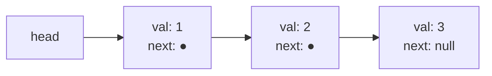

# Linked list fundamentals: sentinels, pointer rewiring, doubly-linked design

Open `java.util.LinkedList` in OpenJDK and look at the `linkBefore` method. It carries a special case: *if the predecessor is null, this is the first node, so update the head reference; otherwise, splice the new node into the chain*. CLRS §10.2 shows you can delete that special case for free. Insert one fake node before the real head, treat its `next` as the head, and the predecessor is never null. The rewire becomes two assignments. The `if (f == null)` branch vanishes.

That fake node is the sentinel, and the technique generalises beyond linked lists to any data structure whose code branches on "am I at the boundary?" Most of Part 5 stands on it. Reversal in chapter 5.1, group reversal in chapter 5.2, the merge builder in chapter 5.4, the LRU cache's doubly-linked spine in chapter 5.5: every one of those algorithms reads more cleanly because the sentinel is doing the case-work the code would otherwise have to. The chapter you are reading is the one that pays for it once.[^1]

The contract is small. A node holds a value and a pointer to the next node. A list is a chain of nodes ending in null. An empty list is a list with no real nodes, and in the sentinel design it is a single dummy node whose `next` is null. Five public operations: read by index, insert at the head, insert at the tail, insert at an arbitrary index, delete at an arbitrary index. The signature problem is *Design Linked List* on LeetCode (LC 707), and solving it cleanly is the proof that you have internalised what this chapter teaches.

## What a linked list is

A node is a value packaged with a pointer:

```python
@dataclass
class ListNode:
    val: int
    next: Optional["ListNode"] = None
```

That's the whole structural definition. A list is a chain: `head -> node -> node -> ... -> null`. Reading the chain is a `while curr != null` loop. There is no index, no `arr[i]`, no contiguous block of memory. To find the third element, you walk from the head, three pointer dereferences in.



*Three nodes, three heap allocations, three pointers between them. Random access is O(n); insertion in the middle, given the predecessor, is O(1). Arrays make the opposite trade.*

The trade is the reason linked lists exist. A dynamic array (the [Dynamic array internals](../part-1-linear-data-structures/01-dynamic-array-internals.md) chapter) gives you O(1) random access by indexing into a contiguous buffer, and pays for it with O(n) inserts in the middle: every element to the right has to shift one slot. A linked list inverts that bargain. There is no buffer to shift, so middle inserts and middle deletes are O(1) once you have a pointer at the predecessor. There is no contiguous layout, so reading the k-th element costs k dereferences, and each dereference, in the worst case, fetches a cache line that has nothing to do with the previous one.[^2]

That cache penalty is real. CLRS §10.2 frames the comparison in algorithmic terms; the engineering reality is that in a `std::vector<int>` with 8-byte ints, sixteen consecutive elements share a 64-byte cache line, so iterating costs roughly one fetch per sixteen reads. In a `std::list<int>`, every node is its own heap allocation, the nodes scatter across the heap, and iterating costs roughly one fetch per read. On the workloads where both representations are correct, the array beats the linked list by a factor of ten to twenty in practice.[^3]

So when does the linked list win? When the operations are *splice in the middle*, *splice out from the middle*, or *splice two lists together at the ends*, all of them given a pointer that is already at the right place. The LRU cache (chapter 5.5) is the canonical case: it has to evict the least-recently-used entry in O(1) and promote a touched entry to the front in O(1), and a hash map points directly at the relevant node so neither operation needs to walk anything. The linked list is the only data structure that makes both moves O(1) without amortization.

## The four pointer primitives

Every operation in this chapter is one of four shapes. Walk a `prev` pointer to position k, then do one of:

- **Insert after `prev`**: `node.next = prev.next; prev.next = node;`
- **Delete the node after `prev`**: `prev.next = prev.next.next;`
- **Read by walking `curr` from the head**: `for k steps: curr = curr.next;`
- **Append at the tail**: walk `prev` to the last node, then insert after.

The two-line insert is the entire mechanic, and the order of the two lines matters. Snapshot the forward link first; mutate the predecessor's `next` second. Reverse the order and the second line reads from a pointer the first line just clobbered, the new node points at itself, and the rest of the list orphans. We come back to this in pitfalls.

The delete is one line because the unlinked node walks itself out of the chain: setting `prev.next = prev.next.next` skips the old `prev.next` entirely. In a garbage-collected language the orphaned node disappears at the next GC pass. In C++ you capture the pointer first and `delete victim;` after the rewire; the destructor walks the chain on object teardown for the same reason.

What these four primitives have in common is the predecessor pointer. Insert needs `prev` because the new node has to splice in *after* something. Delete needs `prev` because removing a node mutates the upstream `next`, not the node itself. Read needs `curr` only, but the index walker that produces `curr` is the same loop as the one that produces `prev`, off by one step.

The annoying case is when `prev` would be null, the case where the operation is at the head. Without a sentinel, the code has to special-case it. *If we are inserting at the head, set `head = node` and link `node.next` to the old `head`. Otherwise walk `prev` and do the normal rewire.* Two paths, two correctness arguments, two places for an off-by-one to hide. OpenJDK's `LinkedList` carries this branch; it has to, because Java's standard library predates the convention of storing the sentinel inside the data structure.[^1]

## The sentinel: one node that erases the head case

Allocate one extra node, owned by the data structure, and put it before the real head. Call it `dummy`. Its `next` points at the first real element when one exists, and at null when the list is empty. The `val` field is unused.

```python
class MyLinkedList:
    def __init__(self) -> None:
        self.dummy: ListNode = ListNode(0)
        self.length: int = 0
```

Now `prev = dummy` is a valid starting state for every indexed operation. Insert at index 0 is `prev = dummy`; insert at index k is `prev = dummy` followed by k advances. The body of the operation is the same in both cases. The empty-list invariant, the list has no real nodes, is `dummy.next == null`, and the rewire `prev.next = node` works on it without inspection.[^1]

> [!IMPORTANT]
> **The sentinel is not a hack. It is the design.** Whenever the natural code path branches on "is this the head?", reach for it. The same idea, one extra slot at a boundary so the boundary case stops being special, shows up in the LRU cache's two doubly-linked sentinels (head and tail), in the per-group local dummy that chapter 5.2 uses for K-group reversal, and in the `dummy.next` pattern that chapter 5.4 uses to build a merged list. CLRS §10.2 introduces the technique under the heading *Sentinels* and observes that the use of a sentinel is effective whenever boundary conditions are causing complication.[^1]

There is a tax. The sentinel is one extra allocation per list, and every traversal starts from `dummy` rather than from the first real node. On a 64-bit JVM, that is 32 to 40 bytes per list and one extra dereference per indexed operation.[^4] The tax is small enough that production-quality data structures pay it routinely; the sentinel-free design is faster only when you measure micro-benchmarks on lists shorter than ten elements, and at that size you should be using an array anyway.

The half-sentinel form this chapter teaches puts the dummy before the head only. There is no tail sentinel and no separate tail pointer. That means `addAtTail` walks the whole chain. The full doubly-linked form with two sentinels (head and tail) gives you O(1) tail operations at the cost of doubling the per-node pointer overhead and complicating every rewire to four assignments instead of two. Chapter 5.5 introduces it because the LRU cache demands O(1) tail eviction; this chapter does not, because the half-sentinel form is the cleaner pedagogy and LC 707's contract treats indexed operations as primary.

## Designing the list: LC 707

Five operations, one data structure. The contract: `get(i)` returns the value at index `i` or `-1` if `i` is out of range; `addAtHead(v)` and `addAtTail(v)` are convenience wrappers; `addAtIndex(i, v)` inserts a new node so that the new node's index becomes `i`; `deleteAtIndex(i)` removes the node at index `i`. Insert allows `i == length` (the append target); delete does not (there is no node at position `length`). Negative indices and out-of-range indices are silent no-ops on mutators and return `-1` on `get`.[^5]

Every method body collapses to "walk `prev` to position `i - 1` (the sentinel covers `i == 0`), then do the canonical rewire."

```python
class MyLinkedList:
    def __init__(self) -> None:
        self.dummy: ListNode = ListNode(0)
        self.length: int = 0

    def get(self, index: int) -> int:
        if index < 0 or index >= self.length:
            return -1
        curr = self.dummy.next
        for _ in range(index):
            curr = curr.next
        return curr.val

    def addAtIndex(self, index: int, val: int) -> None:
        if index < 0 or index > self.length:
            return
        prev = self.dummy
        for _ in range(index):
            prev = prev.next
        node = ListNode(val, prev.next)
        prev.next = node
        self.length += 1

    def deleteAtIndex(self, index: int) -> None:
        if index < 0 or index >= self.length:
            return
        prev = self.dummy
        for _ in range(index):
            prev = prev.next
        prev.next = prev.next.next
        self.length -= 1
```

**Solution** — Python ([Java](./00-linked-list-fundamentals/lc-707/sol.java) · [C++](./00-linked-list-fundamentals/lc-707/sol.cpp) · [Go](./00-linked-list-fundamentals/lc-707/sol.go))

```python
# LC 707. Design Linked List
"""LC 707 Design Linked List, sentinel-driven singly linked list.

The dummy head removes the head-vs-mid case split: every insert and
delete points at a non-null predecessor `prev`, so the wiring is the
same at index 0 and at index k.
"""

from dataclasses import dataclass
from typing import Optional


@dataclass
class ListNode:
    val: int
    next: Optional["ListNode"] = None


class MyLinkedList:
    def __init__(self) -> None:
        self.dummy: ListNode = ListNode(0)
        self.length: int = 0

    def get(self, index: int) -> int:
        if index < 0 or index >= self.length:
            return -1
        curr = self.dummy.next
        for _ in range(index):
            curr = curr.next  # type: ignore[union-attr]
        return curr.val  # type: ignore[union-attr]

    def addAtHead(self, val: int) -> None:
        self.addAtIndex(0, val)

    def addAtTail(self, val: int) -> None:
        self.addAtIndex(self.length, val)

    def addAtIndex(self, index: int, val: int) -> None:
        if index < 0 or index > self.length:
            return
        prev = self.dummy
        for _ in range(index):
            prev = prev.next  # type: ignore[assignment]
        node = ListNode(val, prev.next)
        prev.next = node
        self.length += 1

    def deleteAtIndex(self, index: int) -> None:
        if index < 0 or index >= self.length:
            return
        prev = self.dummy
        for _ in range(index):
            prev = prev.next  # type: ignore[assignment]
        prev.next = prev.next.next  # type: ignore[union-attr]
        self.length -= 1
```

The two-line insert and the one-line delete are the only mutations. Everything else is index walking. The `length` field is the source of truth for index validity. Drift between `length` and the actual chain length causes silent wrong answers, and the reference puts every counter update on the same line-level scope as the rewire so a code reviewer sees both changes in a three-line diff.

Trace the LC 707 operation sequence on a fresh list:

1. `addAtHead(1)` routes to `addAtIndex(0, 1)`. `prev = dummy`. Allocate node 1; rewire; length = 1. Chain: `dummy -> 1`.
2. `addAtTail(3)` routes to `addAtIndex(1, 3)`. Walk `prev` once to node 1. Allocate node 3; rewire; length = 2. Chain: `dummy -> 1 -> 3`.
3. `addAtIndex(1, 2)`. `prev = dummy`; advance once to node 1. Allocate node 2 with `next = node 3`; rewire `prev.next = node 2`; length = 3. Chain: `dummy -> 1 -> 2 -> 3`.
4. `get(1)` returns 2.
5. `deleteAtIndex(1)`. `prev = dummy`; advance once to node 1. Capture `victim = node 2`; rewire `prev.next = victim.next`; length = 2. Chain: `dummy -> 1 -> 3`.
6. `get(1)` returns 3.

> **Interactive widget:** [Linked list pointer rewiring](../widgets/w-13-linked-list-pointer-rewiring.yml) (panel `panel-a`) — rendered on the website; the YAML spec describes the keyframes.

*Static fallback: the widget's four key frames render the empty sentinel state, the chain after both head and tail inserts, the chain immediately after the mid-insert with node 2 spliced between nodes 1 and 3, and the chain after the mid-delete reverts to `dummy -> 1 -> 3`.*

The thing the trace makes visible is that step 1 (head-insert) and step 3 (mid-insert) are the *same operation*. Same predecessor type (the sentinel for one, a real node for the other, but both non-null). Same two-line rewire. Same length update. The reader who watches steps 1 and 3 happen one after the other has internalised the chapter.

## A second shape: the dummy-head builder

The sentinel has a second life beyond owning a list's head. *Add Two Numbers* (LC 2) hands you two linked lists of digits in reverse order and asks you to return their sum as a linked list.[^6] You don't know how long the answer is until you have walked both inputs, and you cannot append to a chain in O(1) without a tail pointer. The fix is the same trick: allocate a dummy locally, walk a tail pointer, append unconditionally, return `dummy.next`.

```python
def addTwoNumbers(l1, l2):
    dummy = ListNode()
    tail = dummy
    carry = 0
    while l1 is not None or l2 is not None or carry:
        v1 = l1.val if l1 is not None else 0
        v2 = l2.val if l2 is not None else 0
        carry, digit = divmod(v1 + v2 + carry, 10)
        tail.next = ListNode(digit)
        tail = tail.next
        if l1 is not None:
            l1 = l1.next
        if l2 is not None:
            l2 = l2.next
    return dummy.next
```

**Solution** — Python ([Java](./00-linked-list-fundamentals/lc-2/sol.java) · [C++](./00-linked-list-fundamentals/lc-2/sol.cpp) · [Go](./00-linked-list-fundamentals/lc-2/sol.go))

```python
# LC 2. Add Two Numbers
"""Synchronized two-list walk with carry propagation. The dummy head
lets every iteration append unconditionally; `return dummy.next` skips
the sentinel."""

from dataclasses import dataclass
from typing import Optional


@dataclass
class ListNode:
    val: int = 0
    next: Optional["ListNode"] = None


class Solution:
    def addTwoNumbers(
        self,
        l1: Optional[ListNode],
        l2: Optional[ListNode],
    ) -> Optional[ListNode]:
        dummy = ListNode()
        tail = dummy
        carry = 0
        while l1 is not None or l2 is not None or carry:
            v1 = l1.val if l1 is not None else 0
            v2 = l2.val if l2 is not None else 0
            total = v1 + v2 + carry
            carry, digit = divmod(total, 10)
            tail.next = ListNode(digit)
            tail = tail.next
            if l1 is not None:
                l1 = l1.next
            if l2 is not None:
                l2 = l2.next
        return dummy.next
```

Two things to notice. The loop guard is `l1 != null OR l2 != null OR carry`: the carry is part of the termination condition because adding `[5]` and `[5]` produces `[0, 1]` with a carry that survives both inputs running out. And the return is `dummy.next`, not `dummy`. Return the dummy itself and the result list starts with a spurious `0` followed by the real digits. The naming is what enforces the discipline: call the local `dummy` (not `head`) and `return dummy.next` reads as *skip the sentinel; return the real head*. The merge builder in [Merge two/k sorted lists](./04-merging-linked-lists.md) and the heap-driven k-way merge in [Heaps](../part-6-trees-heaps/04-heaps-priority-queues.md) reuse this pattern.

A linked list that actually feels like a one-way iterator, read each value and do something with it, is *Convert Binary Number in a Linked List to Integer* (LC 1290). Each node holds a 0 or 1; the list is the binary representation MSB-first; the answer is the integer.[^7] Single pass:

```python
def getDecimalValue(head):
    result = 0
    curr = head
    while curr is not None:
        result = (result << 1) | curr.val
        curr = curr.next
    return result
```

**Solution** — Python ([Java](./00-linked-list-fundamentals/lc-1290/sol.java) · [C++](./00-linked-list-fundamentals/lc-1290/sol.cpp) · [Go](./00-linked-list-fundamentals/lc-1290/sol.go))

```python
# LC 1290. Convert Binary Number in a Linked List to Integer
"""Single-pass walk with a running accumulator. Each node holds 0 or 1;
shift the result left and OR in the current bit.
"""

from dataclasses import dataclass
from typing import Optional


@dataclass
class ListNode:
    val: int
    next: Optional["ListNode"] = None


class Solution:
    def getDecimalValue(self, head: Optional[ListNode]) -> int:
        result = 0
        curr = head
        while curr is not None:
            result = (result << 1) | curr.val
            curr = curr.next
        return result
```

The `while curr != null` loop is the most common shape in Part 5. Every chapter from 5.1 onward starts a function with it. The line `result = (result << 1) | curr.val` is the only arithmetic; everything else is the walk.

## What it actually costs

Index-walking dominates everything. Every method that takes an `index` argument runs in time proportional to the index, because the walker has to traverse `index` nodes to reach the predecessor.

| Operation | Time worst-case | Time best-case | Space |
|---|---|---|---|
| `get(i)` | O(i) | O(1) at i = 0 | O(1) |
| `addAtHead(v)` | O(1) | O(1) | O(1) |
| `addAtTail(v)` | O(n) | O(n) | O(1) |
| `addAtIndex(i, v)` | O(i) | O(1) at i = 0 | O(1) |
| `deleteAtIndex(i)` | O(i) | O(1) at i = 0 | O(1) |
| Whole structure | n/a | n/a | O(n) |

The half-sentinel design (sentinel before the head, no tail pointer) is what makes head insertions and head deletions O(1): the case split is gone, but there is no separate tail pointer, so tail operations pay an O(n) walk. CLRS §10.2 proves the bounds: LIST-INSERT and LIST-DELETE each do a constant number of pointer rewires after the search step, so the search step dominates.[^1] The textbook upgrade that takes `addAtTail` to O(1) is to add a tail pointer; chapter 5.5 reintroduces it because the LRU cache demands O(1) tail eviction without ever indexing.

The space bound is `n + 1` heap nodes (the `n` real nodes plus the sentinel) plus a constant for the length counter. Per-node space is dominated by the pointer field. On a 64-bit JVM with compressed object pointers, a `ListNode` with one int and one reference consumes 32 to 40 bytes per node, three to four times what a `int[]` would for the same payload.[^4] Python with a `dataclass`-decorated node consumes around 56 bytes per instance. C++ with a plain `struct ListNode { int val; ListNode* next; }` is 16 bytes. Go's struct of `int` plus pointer is also 16 bytes. The constants matter when you are deciding between a linked list and an array; once you have decided, they are noise.

## When the design changes

Three variants of this chapter's idiom show up later in Part 5 and beyond. The first two reuse what you just learned; the third is the no-sentinel form OpenJDK ships, which the chapter cites as the worked counter-example.

**The full doubly-linked sentinel design (chapter 5.5).** Two sentinels, `head` and `tail`. Every node carries both `prev` and `next`. Insertion is four assignments instead of two: `node.prev = head; node.next = head.next; head.next.prev = node; head.next = node`. Deletion is two: `node.prev.next = node.next; node.next.prev = node.prev`. The four-assignment insert is harder to internalise than the two-assignment one; chapter 5.5 has the LRU cache to motivate the cost. You don't pay it without a reason.

**The no-sentinel singly linked list (OpenJDK style).** A nullable `first` and `last` reference instead of a sentinel. The `addAtIndex(0, ...)` path branches: `if (length == 0) head = node; else { node.next = head; head = node; }`. The case split is small, but it accumulates across every mutator and every reviewer has to re-derive the boundary correctness. OpenJDK's `java.util.LinkedList` ships this design, and pays for it with `if (f == null)` branches inside `linkFirst`, `linkLast`, and `unlink`.[^1] If you find yourself writing twice as many lines as the sentinel reference above, this is the design you accidentally landed on.

**The circular linked list (referenced, not taught here).** The tail's `next` points at a real node rather than at null. Iteration uses `curr != head_after_one_loop` instead of `curr != null`. The Josephus problem and round-robin schedulers are the natural consumers; the algorithmic problem of recognising a cycle is owned by [Cycle detection](./03-cycle-detection.md), where Floyd's tortoise-and-hare pointer arithmetic does the work in O(1) extra space.

Skip lists and unrolled linked lists are real data structures that show up in Redis sorted sets and a few specialised engines.[^8] They fit in chapter 11 alongside the other probabilistic structures; this chapter mentions them so you know they exist.

## Where readers go wrong

> [!WARNING]
> **Snapshotting `prev.next` *after* the mutation.** Write the rewire in the wrong order, `prev.next = node; node.next = prev.next;`, and the second line reads from a pointer the first line just clobbered. `node.next` becomes `node` itself. The new node is a one-element ring; the rest of the list is orphaned; the LC harness times out with stack-overflow style failures. The right shape is *always* `node.next = prev.next; prev.next = node;`: snapshot first, mutate second. The half-sentinel design does not protect against this; it is a universal singly-linked-list pitfall and the recurring framing in [Reversal patterns](./01-reversal-patterns.md).

> [!WARNING]
> **Updating the chain but not the length counter.** The rewire is the visible part of the operation; `length += 1` and `length -= 1` are bookkeeping that does not show up in the "what does the code do" mental model. Skip them and subsequent `get` calls walk past the end of the list (NPE in Java/C++; silent wrong answers in Python where `None.next` raises only on access). Treat `length` as part of the data structure invariant: every method that mutates the chain mutates `length` in the same statement-level scope.

> [!WARNING]
> **Asymmetric bounds on insert vs delete.** Insert allows `index == length` (append); delete does not (there is no node at position `length`). Use `index >= length` on insert and you reject the tail append; use `index > length` on delete and you accept an out-of-range delete that NPEs on the rewire. The reference puts the asymmetric guard as the first line of each method so it is impossible to read the body without seeing it. CLRS §10.2 LIST-INSERT and LIST-DELETE pseudocode use the same asymmetric check.[^1]

> [!WARNING]
> **Returning `dummy` instead of `dummy.next` in builder functions.** In *Add Two Numbers* and every dummy-head builder, the result is `dummy.next`. The dummy is the most recently named local at the end of the function and `return dummy` is the natural reflex; the bug surfaces as a result list that starts with a spurious leading zero. Naming the local `dummy` rather than `head` is what enforces the discipline.

> [!WARNING]
> **Value receivers on Go methods that mutate.** `func (l MyLinkedList) AddAtHead(val int)` (value receiver) mutates a local copy and returns; the original `MyLinkedList` is unchanged. Subsequent `Get` calls report `-1` even though `AddAtHead` was called. Any method that mutates the data structure must take a pointer receiver (`*MyLinkedList`). The Go vet tool catches this in normal code; the LC judge environment is silent because the judge calls every method through a pointer.[^9]

## Problem ladder

### CORE (solve all three to claim chapter mastery)

- [LC 1290 — Convert Binary Number in a Linked List to Integer](https://leetcode.com/problems/convert-binary-number-in-a-linked-list-to-integer/) [Easy] • linked-list-traversal
- [LC 707 — Design Linked List](https://leetcode.com/problems/design-linked-list/) [Medium] • linked-list-sentinel ★
- [LC 2 — Add Two Numbers](https://leetcode.com/problems/add-two-numbers/) [Medium] • linked-list-traversal-with-carry

### STRETCH (optional)

- [LC 138 — Copy List with Random Pointer](https://leetcode.com/problems/copy-list-with-random-pointer/) [Medium] • linked-list-deep-copy
- [LC 1019 — Next Greater Node In Linked List](https://leetcode.com/problems/next-greater-node-in-linked-list/) [Medium] • linked-list-as-iterator

> [!NOTE]
> **No Hard band on this ladder.** The only canonical Hard linked-list-design problem in the LC catalogue is [LC 432 — All O\`one Data Structure](https://leetcode.com/problems/all-oone-data-structure/), which is Premium-locked and cannot be CORE per the chapter-ladder rules. The natural Hard linked-list extensions live elsewhere: [LC 25 — Reverse Nodes in K-Group](https://leetcode.com/problems/reverse-nodes-in-k-group/) belongs to [Reverse in groups of K](./02-reverse-in-groups-k.md), [LC 23 — Merge K Sorted Lists](https://leetcode.com/problems/merge-k-sorted-lists/) belongs to [Heaps](../part-6-trees-heaps/04-heaps-priority-queues.md), and [LC 146 — LRU Cache](https://leetcode.com/problems/lru-cache/) belongs to [LRU cache](./05-lru-cache.md).

## Where this leads

[Reversal patterns](./01-reversal-patterns.md) reuses the `ListNode` definition and the snapshot-first rule; the prev/curr/next three-pointer rewire is the same shape, applied to every node in turn instead of one node at a time. [Cycle detection](./03-cycle-detection.md) drops the sentinel because Floyd's tortoise-and-hare reasons about the original successor function. [Merge two/k sorted lists](./04-merging-linked-lists.md) keeps the dummy-head builder pattern from *Add Two Numbers* and uses it as the merge primitive. And [LRU cache](./05-lru-cache.md) introduces the doubly-linked sentinel design that this chapter only references: two sentinels, four-assignment inserts, O(1) at both ends. Same node type, four different disciplines.

## References

[^1]: Cormen, Leiserson, Rivest, Stein, *Introduction to Algorithms*, 4th ed., MIT Press, 2022. The OpenJDK `java.util.LinkedList<E>` source ([github.com/openjdk/jdk](https://github.com/openjdk/jdk/blob/master/src/java.base/share/classes/java/util/LinkedList.java))

[^2]: Robert Sedgewick and Kevin Wayne, *Algorithms*, 4th ed., Addison-Wesley, 2011.

[^3]: Ulrich Drepper, "What Every Programmer Should Know About Memory," 2007 ([akkadia.org/drepper/cpumemory.pdf](https://www.akkadia.org/drepper/cpumemory.pdf)

[^4]: Aleksey Shipilev, "Compressed References (32-bit Object Pointers in 64-bit JVM)," [shipilev.net/jvm/objects-inside-out](https://shipilev.net/jvm/objects-inside-out/)

[^5]: LeetCode 707, "Design Linked List," [leetcode.com/problems/design-linked-list](https://leetcode.com/problems/design-linked-list/).

[^6]: LeetCode 2, "Add Two Numbers," [leetcode.com/problems/add-two-numbers](https://leetcode.com/problems/add-two-numbers/)

[^7]: LeetCode 1290, "Convert Binary Number in a Linked List to Integer," [leetcode.com/problems/convert-binary-number-in-a-linked-list-to-integer](https://leetcode.com/problems/convert-binary-number-in-a-linked-list-to-integer/).

[^8]: William Pugh, "Skip Lists: A Probabilistic Alternative to Balanced Trees," CACM 33(6), June 1990, pp. 668-676. Pugh's original skip-list paper at [15721.courses.cs.cmu.edu](https://15721.courses.cs.cmu.edu/spring2018/papers/08-oltpindexes1/pugh-skiplists-cacm1990.pdf).

[^9]: Go documentation, "Effective Go," [go.dev/doc/effective_go#pointers_vs_values](https://go.dev/doc/effective_go#pointers_vs_values)
