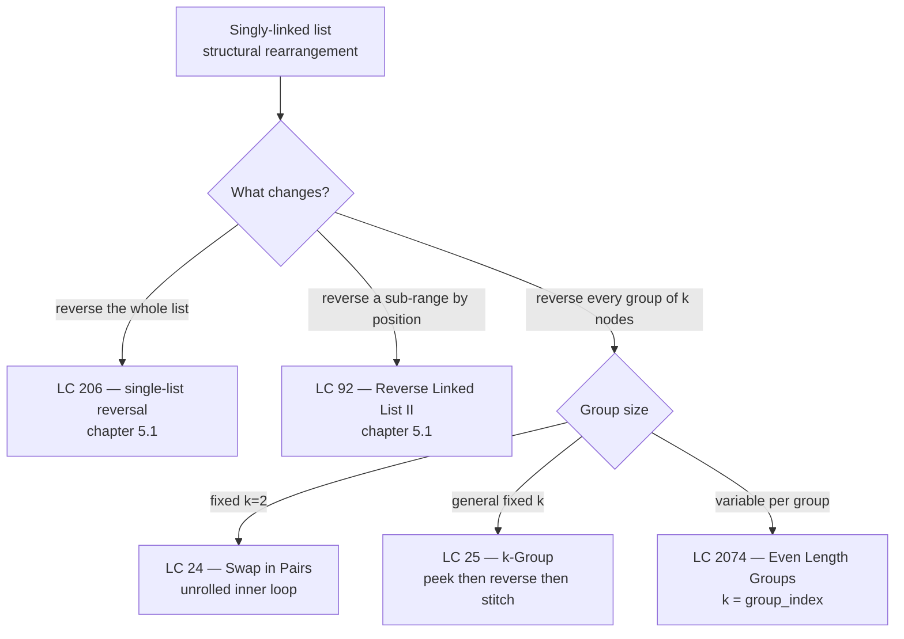

# Reverse in groups of k

LC 25 is the hardest linked-list problem in the standard interview canon. Given `1 -> 2 -> 3 -> 4 -> 5` and `k = 2`, return `2 -> 1 -> 4 -> 3 -> 5`. The trailing `5` stays put because the run is shorter than k. With `k = 3` the same input becomes `3 -> 2 -> 1 -> 4 -> 5`. The follow-up — *"can you do it in O(1) extra memory?"* — is what gives the problem its Hard rating; with recursion off the table, every approach that almost works has a subtle bug at the seam between groups.

The chapter's claim is that LC 25 is three small mechanical phases stacked on top of [Reversal patterns](./01-reversal-patterns.md). You already know how to reverse a singly-linked list with prev/curr/next. You already know why a dummy sentinel pins a stable handle on the head, courtesy of [Linked lists: singly, doubly, sentinels](./00-linked-list-fundamentals.md). The new piece is the cross-boundary pointer arithmetic between an already-reversed prefix and an about-to-be-reversed group. Get the order of three lines wrong and the list either truncates, cycles, or silently leaves you a wrong answer.

## Why "just reverse, then check" silently corrupts the list

Coming off LC 206, the muscle memory is to start reversing immediately. It looks fine on small inputs. Here is the wrong move, written out:

```python
# WRONG: reverse-then-check. Corrupts the trailing partial group.
def reverse_k_group_wrong(head, k):
    dummy = ListNode(0, head)
    group_prev = dummy
    while group_prev.next is not None:
        # Reverse up to k nodes. Stop early if the list ends.
        prev = None
        curr = group_prev.next
        original_head = curr
        count = 0
        while curr is not None and count < k:
            nxt = curr.next
            curr.next = prev
            prev = curr
            curr = nxt
            count += 1
        # Now reattach. But what if count < k? We've already reversed.
        group_prev.next = prev
        original_head.next = curr
        group_prev = original_head
    return dummy.next
```

Run it on `1 -> 2 -> 3 -> 4 -> 5` with `k = 3`. The first group has three nodes; it reverses cleanly to `3 -> 2 -> 1 -> ...`. The second group has only two nodes (`4 -> 5`), but the inner loop happily reverses what it finds, so they flip to `5 -> 4`. The final list is `3 -> 2 -> 1 -> 5 -> 4`. Wrong answer. LC 25's contract says left-out nodes "should remain as is."[^1] The two lines that flipped 4 and 5 broke that contract.

The bug is structural, not arithmetic. The algorithm committed to a reversal before knowing whether the group was full. Once the inner loop runs, you cannot un-rewire the pointers without walking the suffix again — and at that point you have spent O(k) work fixing the bug instead of O(k) work checking the precondition.

The fix is one sentence: count k ahead first, *then* reverse. The peek-ahead is cheap (it touches no `next` pointer) and decisive (it tells you exactly whether to enter the reversal phase). The whole chapter follows from that decision.

## The pattern

Three phases on every group, in order. **Peek**: walk k steps forward from the node before the current group; if you fall off the end, you are done — leave the suffix alone and return. **Reverse**: with the full group confirmed, run prev/curr/next over the k nodes, but seed `prev` to the node *after* the group rather than to `None`, so the rightmost node of the reversed range points into the unprocessed suffix the moment it is rewired. **Stitch**: splice the previously-processed prefix to the new group head, advance the cursor to the new group tail, and repeat.

The dummy node from chapter 5.0 is what makes this uniform from the very first group. Without it, the first group's reversal would need a special branch that updates `head` directly instead of `group_prev.next`, and the chapter would have to spend prose on that branch instead of on the seam mechanics.[^2]

```python
def reverse_k_group(head, k):
    dummy = ListNode(0, head)
    group_prev = dummy

    while True:
        kth = _kth_after(group_prev, k)
        if kth is None:
            break                       # suffix is shorter than k; leave it
        group_next = kth.next

        # Inner reversal: prev seeded with group_next so the new tail's
        # next pointer lands on the unprocessed suffix automatically.
        prev = group_next
        curr = group_prev.next
        while curr is not group_next:
            nxt = curr.next
            curr.next = prev
            prev = curr
            curr = nxt

        # Re-stitch: original group head is now the group tail.
        new_group_tail = group_prev.next
        group_prev.next = kth
        group_prev = new_group_tail

    return dummy.next


def _kth_after(node, k):
    curr = node
    while curr is not None and k > 0:
        curr = curr.next
        k -= 1
    return curr
```

**Solution** — Python ([Java](./02-reverse-in-groups-k/lc-25/sol.java) · [C++](./02-reverse-in-groups-k/lc-25/sol.cpp) · [Go](./02-reverse-in-groups-k/lc-25/sol.go))

```python
# LC 25. Reverse Nodes in k-Group
from typing import Optional


class ListNode:
    def __init__(self, val: int = 0, nxt: "Optional[ListNode]" = None) -> None:
        self.val = val
        self.next = nxt


def reverse_k_group(head: Optional[ListNode], k: int) -> Optional[ListNode]:
    """LC 25: reverse the linked list in groups of k; trailing run < k stays as-is.

    Iterative, O(n) time, O(1) extra space. The dummy sentinel pins a stable
    handle on the result so the very first group reverses without a special case.
    group_prev is the node directly before the current group; _kth_after peeks
    ahead k nodes to confirm a full group exists before any pointer rewiring;
    if it returns None the suffix is shorter than k and the loop exits.
    """
    dummy = ListNode(0, head)
    group_prev = dummy

    while True:
        kth = _kth_after(group_prev, k)
        if kth is None:
            break
        group_next = kth.next

        prev: Optional[ListNode] = group_next
        curr: Optional[ListNode] = group_prev.next
        while curr is not group_next:
            nxt = curr.next
            curr.next = prev
            prev = curr
            curr = nxt

        new_group_tail = group_prev.next
        group_prev.next = kth
        group_prev = new_group_tail

    return dummy.next


def _kth_after(node: ListNode, k: int) -> Optional[ListNode]:
    """Return the k-th node strictly after `node`, or None if fewer than k nodes exist."""
    curr: Optional[ListNode] = node
    while curr is not None and k > 0:
        curr = curr.next
        k -= 1
    return curr
```

The line order in the stitch phase is non-negotiable. `new_group_tail = group_prev.next` has to be saved *before* `group_prev.next = kth`, because the splice overwrites the very pointer the next line reads. Swap those two and `group_prev` advances to the new group head, not the new group tail, and the next iteration's seam splices into the wrong place.

### The three phases as primitives

| Phase | Reads | Writes | What it returns |
|---|---|---|---|
| **Peek** (`_kth_after`) | k `next` pointers | nothing | `kth` node, or `None` on under-run |
| **Reverse** (inner loop) | k `next` pointers | k `next` pointers | the new group head (in `prev`) |
| **Stitch** | 1 pointer (`group_prev.next`) | 2 pointers (the splice + the cursor advance) | nothing |

Total work per group: 2k pointer reads, k+2 pointer writes. Across `floor(n/k)` full groups plus one peek-failure, the algorithm touches each `next` pointer at most twice and writes at most n. Time is O(n); space is O(1) regardless of n or k.[^3]

## Locating this pattern



*Five sub-patterns the chapter and its prerequisites teach. Pick the dialect, then fill the three phases.*

## Worked example: LC 25 on `1 -> 2 -> 3 -> 4 -> 5` with k = 2

The widget below animates twenty-five steps on the canonical input. Watch one full peek-reverse-stitch cycle, then the second cycle, then the peek-ahead failure that terminates the loop. Two slides carry the lesson: step 7, where the seam re-stitches `dummy.next = 2`, and step 21, where the cursor walks off the end and the algorithm leaves node 5 alone.

> **Interactive widget:** [Linked list pointer rewiring](../widgets/w-13-linked-list-pointer-rewiring.yml) (panel `panel-c`) — rendered on the website; the YAML spec describes the keyframes.

*Twenty-five-step trace. Phases: init (step 0), first peek-ahead (1-3), first reversal (4-6), first stitch (7-9), second peek-ahead (10-12), second reversal (13-15), second stitch (16-18), final peek-failure (19-22), terminate (23-24). The trailing node 5 is dimmed in step 22 to mark it as untouched.*

The phase-by-phase walk in prose, only on the moments that earn the words. **Step 0:** dummy points at 1; group_prev is dummy. **Steps 1-3:** peek-ahead from dummy walks two nodes and lands on node 2. Full group confirmed. **Steps 4-6:** prev seeds at node 3 (the `group_next`), curr seeds at node 1, two iterations rewire `1.next = 3` and then `2.next = 1`. **Step 7 is the seam.** Splice `dummy.next = 2`. The original group head (node 1) is now the group tail; advance group_prev there. List so far: `dummy -> 2 -> 1 -> 3 -> 4 -> 5`. **Steps 10-18:** the same three-phase cycle on the second group, ending at `dummy -> 2 -> 1 -> 4 -> 3 -> 5`. **Steps 19-21:** third peek-ahead. Cursor advances to node 5, then to `null`. Only one node remained, less than k=2. The algorithm exits the loop without rewiring anything. Node 5 stays where it was.

If the trace clicks but the line `prev = group_next` does not, run the widget once more on the second group only and watch step 13. After two iterations, the new group tail (node 3) has a `next` pointer that points at node 5 — *automatically*. Nothing in the inner loop wrote that pointer; it inherited from the seed value. Seeding `prev = None` instead would have left node 3 dangling at `null`, and the suffix would be lost. This is why the inner loop is *not* a verbatim copy of LC 206's loop, and why this chapter cannot collapse into 5.1.

## What it actually costs

| Variant | Time | Space | Notes |
|---|---|---|---|
| Iterative (the canonical form) | O(n) | O(1) | Each `next` pointer is read at most twice and written at most once. |
| Recursive | O(n) | O(n/k) | Stack frame per group. Fails the LC 25 follow-up; risks stack overflow at n = 5000, k = 1.[^3] |
| LC 24 (k=2 unrolled) | O(n) | O(1) | Inner loop runs exactly once per group; can be written as three explicit assignments. |
| LC 92 (sub-range by position) | O(n) | O(1) | One group, located by index rather than by group order. |

The honest framing on the recursive form: it is six lines of Python, and an interviewer who has not asked the O(1) follow-up will accept it. The moment they ask, the iterative form is the only answer. The LC 25 problem itself states the follow-up explicitly, which is what locks the iterative form as canonical here.[^1]

The iterative form's O(1) bound is established by CLRS §10.2's general result on linked-list traversal: each `LIST-INSERT` and `LIST-DELETE` runs in O(1), so a sequence of n such operations is O(n) regardless of how the operations are interleaved.[^4] Knuth TAOCP Volume 1 §2.2.3 gives the foundational pointer-manipulation algebra this depends on; the chapter inherits both results.[^5]

## When the pattern bends

### LC 24: k = 2 unrolled

When k is fixed at 2, the inner reversal runs exactly once per group. The whole inner loop collapses into three explicit assignments — no `prev`, `curr`, `nxt` bookkeeping needed:

```python
# k = 2 special case (LC 24). Three pointer writes per group, no inner loop.
def swap_pairs(head):
    dummy = ListNode(0, head)
    group_prev = dummy
    while group_prev.next and group_prev.next.next:
        a = group_prev.next
        b = a.next
        a.next = b.next       # a points past the pair
        b.next = a            # b points back at a (the swap)
        group_prev.next = b   # splice the pair in
        group_prev = a        # advance to the new group tail
    return dummy.next
```

Same dummy, same seam. The three lines `a.next = b.next; b.next = a; group_prev.next = b` are the unrolled form of the general inner loop running once. Most interview prep introduces LC 24 before LC 25 for exactly this reason: the choreography is visible without the loop hiding it.

### LC 92: sub-range reversal by position

LC 92 reverses the nodes between positions `left` and `right` in a single pass. There is exactly one group, and its boundaries are given by index rather than by group number. The peek-ahead phase becomes "walk to position `left - 1` to set `group_prev`, then walk `right - left + 1` more nodes to find `kth`." The reversal and stitch phases are identical.[^2]

### Recursive k-group: shorter, but loses the follow-up

```python
# Recursive form. O(n) time, O(n/k) space (recursion stack).
# Fails the LC 25 O(1) extra-memory follow-up.
def reverse_k_group_recursive(head, k):
    kth = _kth_after_head(head, k - 1)
    if kth is None:
        return head
    rest = reverse_k_group_recursive(kth.next, k)
    # Reverse the first k nodes of the current scope.
    prev = rest
    curr = head
    for _ in range(k):
        nxt = curr.next
        curr.next = prev
        prev = curr
        curr = nxt
    return prev
```

Six lines of business logic, no dummy, no seam. Beautiful. Also wrong for the interview that asked the follow-up. Worth knowing because it shows up in NeetCode and AlgoMaster editorials.

## Three pitfalls that bite

> [!WARNING]
> **Reversing before confirming a full group exists.** This is the highest-leverage bug in the chapter. On `1 -> 2 -> 3 -> 4 -> 5` with k=3, an implementation that reverses while counting produces `3 -> 2 -> 1 -> 5 -> 4` — a wrong answer that flips the partial trailing group anyway. The fix is to complete the entire k-step peek-ahead before any pointer is rewired. The peek-ahead is O(k) and touches no `next` pointer, so it is cheap insurance. The reference implementation enforces the order: `_kth_after` returns or fails *before* the inner reversal loop starts.[^2]

> [!WARNING]
> **Initialising `prev = None` instead of `prev = group_next`.** Carrying the LC 206 reversal template over verbatim breaks here. In single-list reversal, `prev = None` is correct because the new tail genuinely has no successor. Inside k-group, the new tail does have a successor: the start of the unprocessed suffix. Seed `prev = None` and the rightmost node of the reversed range ends up with `next = None`, truncating the suffix. The bug is silent on small inputs where the truncated suffix happens to be empty; it shows up on `n > k`. An equivalent fix is to seed `prev = None`, run the reversal, then explicitly write `original_group_head.next = group_next` after the inner loop.[^2]

> [!WARNING]
> **Saving `new_group_tail` after the splice instead of before.** The line order in the stitch phase is `new_group_tail = group_prev.next; group_prev.next = kth; group_prev = new_group_tail`. Swap the first two lines and `new_group_tail` reads the post-splice value (which is `kth`, the new group head), so `group_prev` advances to the new head instead of the new tail. The next iteration then peeks ahead from the wrong node, which produces either a missed seam or a cycle depending on input shape. The reference implementation's three lines are a contract; the order is what makes them work.[^2]

## Problem ladder

### CORE (solve all three to claim chapter mastery)

- [LC 24 — Swap Nodes in Pairs](https://leetcode.com/problems/swap-nodes-in-pairs/) [Medium] • k-group-reversal-fixed-pair
- [LC 25 — Reverse Nodes in k-Group](https://leetcode.com/problems/reverse-nodes-in-k-group/) [Hard] • k-group-reversal-iterative-with-peek-ahead ★
- [LC 1721 — Swapping Nodes in a Linked List](https://leetcode.com/problems/swapping-nodes-in-a-linked-list/) [Medium] • linked-list-fast-pointer-kth-from-anchor

### STRETCH (optional)

- [LC 2074 — Reverse Nodes in Even Length Groups](https://leetcode.com/problems/reverse-nodes-in-even-length-groups/) [Medium] • k-group-reversal-variable-window
- [LC 92 — Reverse Linked List II](https://leetcode.com/problems/reverse-linked-list-ii/) [Medium] • sub-range-reversal-by-position

LC 25 is the chapter's signature problem and the canonical O(1)-space target. There is no Easy CORE here because the full peek-then-reverse-then-stitch mechanic has no canonical Easy LC; LC 206 (which exercises only the inner reversal phase) is owned by [Reversal patterns](./01-reversal-patterns.md).

## Where this leads

The next chapter is [Cycle detection](./03-cycle-detection.md), which uses Floyd's tortoise-and-hare on a different pointer pattern (two pointers walking at different speeds, no rewiring). The seam-management skill from this chapter resurfaces in [Merging linked lists](./04-merging-linked-lists.md), where two seams instead of one have to be stitched per merge step, and again in [LRU cache](./05-lru-cache.md), where doubly-linked-list rewiring at both the head and tail generalizes the seam idea to two seams per operation.

## References

[^1]: LeetCode, "25. Reverse Nodes in k-Group" (Hard). <https://leetcode.com/problems/reverse-nodes-in-k-group/>.

[^2]: NeetCode, "25. Reverse Nodes In K Group — Explanation". <https://www.neetcode.io/solutions/reverse-nodes-in-k-group>.

[^3]: AlgoMonster, "25. Reverse Nodes in k-Group" — "Time and Space Complexity" section. <https://algo.monster/liteproblems/25>.

[^4]: Cormen, Leiserson, Rivest, Stein, *Introduction to Algorithms*, 4th ed., MIT Press, 2022, §10.2 "Linked lists".

[^5]: Knuth, *The Art of Computer Programming*, Volume 1: *Fundamental Algorithms*, 3rd ed., Addison-Wesley, 1997, §2.2.3 "Linked Allocation".
