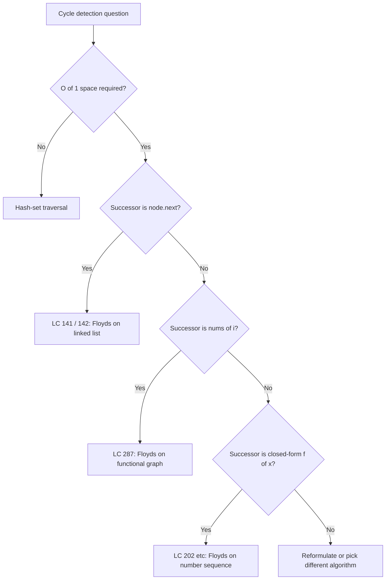
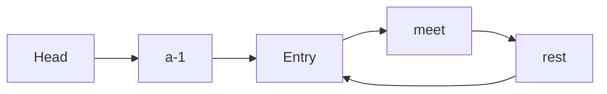

# Cycle detection (Floyd's tortoise and hare)

A singly linked list of 100,000 nodes. Some node's `next` pointer might point back into the list. Find where the cycle starts, or prove there isn't one. The catch: you have two pointer-sized variables and nothing else. No hash set, no list of visited nodes, no clone of the input.

That constraint is the chapter. The natural answer is a hash set of seen pointers, and that answer pays O(n) extra memory for a problem that admits an O(1)-space solution. The O(1) solution is Floyd's tortoise and hare. It runs in two phases, and the second phase relies on a piece of modular arithmetic that's the most beautiful three-line proof in this section of the book.

## When you reach for this

The signal is narrow and easy to spot: a deterministic-successor sequence that might eventually repeat, plus a constraint that bans linear extra memory. Three input shapes feed this signal. A singly linked list whose tail might point back to an internal node (LC 141, LC 142). An integer array `nums` of length `n+1` with values in `[1, n]`, treated as a function `i → nums[i]` whose orbit must contain a duplicate by the pigeonhole principle (LC 287). And a numeric sequence built by an explicit successor function like the sum-of-squares-of-digits map (LC 202).[^1] All three reduce to: iterate `f`, decide whether the orbit cycles, and if so name the entry. One algorithm, three input dialects.

The bouncer at the door is the **O(1) auxiliary space** clause. A hash set decides existence in O(n) time and O(n) space; LC 287 explicitly bans this by requiring constant extra space *and* forbidding mutation of the array. Floyd's holds two pointer-sized variables and never copies the input, so it satisfies the bound by construction. Without that constraint, a hash set is six lines shorter and clearer; reach for Floyd's only when the constraint forces it.[^2]

## Locating this pattern



*Decision flow for picking the right cycle-detection tool. The three terminal Floyd's branches are the same ten-line algorithm with a different `successor(x)` body.*

## Why the obvious answer wastes O(n) memory

Walk LC 141 (Linked List Cycle, Easy) the way an interviewer who's not paying attention would. Keep a `seen` set; for each node you visit, check whether you've been there; if so, return true; if you reach null, return false. It works. It's six lines.

```python
# Brute force: O(n) time, O(n) space — the answer interview prep books print first.
def has_cycle_brute(head):
    seen = set()
    node = head
    while node is not None:
        if node in seen:
            return True
        seen.add(node)
        node = node.next
    return False
```

Correct on every input. Times out on no input. The problem is the hash set: it scales linearly with the list length, and on the hardest LC 142 follow-up (`Could you solve it using O(1) memory?`), it fails the constraint check. The fix lives in the structure of the list itself.

If a cycle exists, the list shape is the Greek letter ρ: a stem (the prefix from `head` to the cycle entry) and a loop (the cycle itself). Two runners on that track at different speeds will eventually meet inside the loop because the faster one keeps closing the gap by one cell per step. Two pointer-sized variables, no hash set.



*A list with a cycle has the shape of the letter rho: a prefix of length `a` from `head` to the cycle entry, then a loop of length `L`. Phase 1's meeting point sits `b` steps past the entry. The Phase 2 derivation `a = k*L - b` is what turns a meeting point into the entry.*

## Phase 1: detect existence

Two pointers, both starting at `head`. Slow advances by one node per step; fast advances by two. Repeat until fast (or `fast.next`) is null, in which case the list is acyclic and you're done. Or until slow and fast point at the same node, in which case a cycle exists.

```python
def has_cycle(head):
    slow, fast = head, head
    while fast is not None and fast.next is not None:
        slow = slow.next
        fast = fast.next.next
        if slow is fast:  # pointer identity, not value equality
            return True
    return False
```

**Solution** — Python ([Java](./03-cycle-detection/lc-141/sol.java) · [C++](./03-cycle-detection/lc-141/sol.cpp) · [Go](./03-cycle-detection/lc-141/sol.go))

```python
# LC 141. Linked List Cycle
from typing import Optional


class ListNode:
    __slots__ = ("val", "next")

    def __init__(self, val: int) -> None:
        self.val = val
        self.next: Optional["ListNode"] = None


def has_cycle(head: Optional[ListNode]) -> bool:
    """LC 141: return True iff the list contains a cycle, else False."""
    slow = head
    fast = head
    while fast is not None and fast.next is not None:
        slow = slow.next
        fast = fast.next.next
        if slow is fast:  # pointer identity, not value equality
            return True
    return False
```

Why does this terminate? Once both pointers are inside the cycle of length `L`, fast gains exactly one step on slow per iteration, because fast moves two and slow moves one. The maximum gap inside an `L`-cycle is `L - 1`, so they meet within `L - 1` more iterations after slow first enters the cycle. Slow enters the cycle at step `a` (the prefix length). Total: at most `a + L - 1` iterations, which is O(n).[^3]

If the list is acyclic, fast walks off the end. After at most `⌈n/2⌉` iterations, either fast is null or `fast.next` is null. The loop exits and the function returns false. Same O(n) bound.

> [!IMPORTANT]
> **Pointer identity, not value equality.** The comparison `slow is fast` (Python), equivalently `slow == fast` on Java reference types, or pointer `==` in C++ and Go, checks whether the two variables hold the same memory address. A list `[1, 1, 1, 1, 1]` with no cycle has five distinct nodes that all carry value 1; checking `slow.val == fast.val` would falsely report a cycle on the first iteration. The algorithm relies on which node, not what value.

## Phase 2: locate the cycle entry (LC 142)

Phase 1 confirms a cycle exists. It also leaves slow and fast pointing at *some* node inside the cycle. That node is almost never the cycle entry, which is what LC 142 actually asks for. Phase 2 is the algorithmic step that converts a meeting into an entry.

Reset slow to `head`. Leave fast where it is. Now advance both pointers at speed 1 until they meet again. The node they meet at is the cycle entry.

```python
def detect_cycle(head):
    slow, fast = head, head
    # Phase 1: detect cycle existence.
    while fast is not None and fast.next is not None:
        slow = slow.next
        fast = fast.next.next
        if slow is fast:
            # Phase 2: locate cycle entry. Both pointers advance at speed 1.
            slow = head
            while slow is not fast:
                slow = slow.next
                fast = fast.next
            return slow
    return None
```

**Solution** — Python ([Java](./03-cycle-detection/lc-142/sol.java) · [C++](./03-cycle-detection/lc-142/sol.cpp) · [Go](./03-cycle-detection/lc-142/sol.go))

```python
# LC 142. Linked List Cycle II
from typing import Optional


class ListNode:
    __slots__ = ("val", "next")

    def __init__(self, val: int) -> None:
        self.val = val
        self.next: Optional["ListNode"] = None


def detect_cycle(head: Optional[ListNode]) -> Optional[ListNode]:
    """LC 142: return the node where the cycle begins, or None if no cycle."""
    slow = head
    fast = head
    # Phase 1: detect cycle existence.
    while fast is not None and fast.next is not None:
        slow = slow.next
        fast = fast.next.next
        if slow is fast:  # pointer identity, not value equality
            # Phase 2: locate cycle entry. Reset slow; advance both at speed 1.
            slow = head
            while slow is not fast:
                slow = slow.next
                fast = fast.next
            return slow
    return None
```

This works. The reason it works is the most non-obvious step in the chapter, and the next section is dedicated to it.

### Why the meeting point lines up with the start

Let `a` be the distance from `head` to the cycle entry. Let `L` be the cycle length. Let `b` be the distance from the entry to the Phase 1 meeting point, measured along the direction of traversal.

When Phase 1 ends, slow has walked `a + b` steps. Fast has walked twice as many, `2(a + b)` steps, by the speed-2 rule. But fast has also wrapped around the cycle some number of full times; call that count `k`, with `k ≥ 1`. So fast's total walk is `a + b + k·L`. Setting the two expressions for fast's walk equal gives

`2(a + b) = a + b + k·L`

which simplifies to

**`a = k·L - b`**

That equality is the entire two-phase argument. Read it geometrically: starting from the meeting point (which sits `b` past the entry inside the cycle), walking `a` more steps takes you `k - 1` full cycles plus another `L - b` steps, landing exactly at the entry. Equivalently, starting from `head` and walking `a` steps reaches the entry by definition.[^4]

So if you reset one pointer to `head` and advance both at speed 1, they will both be at the cycle entry after exactly `a` more steps, and they cannot collide before that because slow is on the prefix (not yet in the cycle) and fast is in the cycle (not yet at the entry). The first time they coincide is the entry.

Run it on the chapter's canonical input to feel the algebra: `[1, 3, 2, 0, -4]` with `pos = 2`, so the tail loops back to index 2. Five distinct nodes; cycle of length 3. Here `a = 2`, `L = 3`, `b = 1`, and `k = 1`. Plugging in: `a = k·L - b` becomes `2 = 1·3 - 1`. The arithmetic checks out at the level of these specific numbers, and the symbolic argument above guarantees it holds for every list with a cycle.

## Worked example: LC 142 on `[1, 3, 2, 0, -4]` with `pos = 2`

> **Interactive widget:** [Floyd's tortoise and hare (cycle detection)](../widgets/w-14-floyd-cycle.yml) — rendered on the website; the YAML spec describes the keyframes.

*Floyd's two phases on the canonical input. Step 3 is where Phase 1 ends (pointers meet at index 3, value 0); step 4 resets slow to head; step 6 is the answer (both pointers land at index 2, the cycle entry). Seven steps total. Work through it once before reading the prose below.*

The build phase is two iterations: slow moves `head → idx 1 → idx 2`, and fast moves `head → idx 2 → idx 4`. After step 2 both pointers are inside the cycle; on step 3 they meet at index 3 (value 0), one step past the entry. That's `b = 1`. The reset on step 4 puts slow back at head while fast stays put. Two more single-speed advances and they coincide at index 2, the cycle entry, value 2. Return that node.

## What it actually costs

| Variant | Time | Space | Notes |
|---|---|---|---|
| Phase 1 (detect existence) | O(n) | O(1) | At most `a + L - 1` iterations once both pointers enter the cycle. |
| Phase 2 (locate cycle entry) | O(n) | O(1) | Exactly `a` iterations; slow walks the prefix, fast walks `a` more cycle steps. |
| Total (LC 142, both phases) | O(n) | O(1) | Joux 2009 §7.1.1 states the bound formally as `O(λ + μ)` operations and `O(1)` storage.[^5] |
| Hash-set baseline | O(n) | O(n) | Six lines. Use it when the constraint allows. |
| Brent's algorithm (alternative) | O(n) | O(1) | About 36% fewer function evaluations on average than Floyd's; canonical for Pollard rho factorization, not for LC interviews.[^6] |

`n` is the count of distinct nodes the algorithm visits, in Knuth's notation `μ + λ`, where `μ` is the prefix length and `λ` is the cycle length. On LC 141 / 142 inputs this is bounded by `10^4` per the problem constraints. On LC 287 it's bounded by `10^5`.

## Brent's algorithm, briefly

Floyd's is the canon because the proof is short, the code is ten lines, and the algorithm is in every introductory algorithms textbook from Knuth onward.[^7] Brent's algorithm (Brent 1980) achieves the same bounds with a different mechanic: hold the tortoise still until the hare has doubled its travel distance, then teleport the tortoise to where the hare is. It finds the cycle length `λ` directly, without a Phase 2, and on average makes about 36% fewer calls to the successor function `f`.[^6]

That matters when `f` is expensive: a cryptographic hash, a Pollard rho map `f(x) = x² + c (mod n)`, a pseudorandom generator's state transition. For the LC interview surface, where `f` is `node.next` and costs nothing, Brent's modest constant-factor win doesn't justify the extra mental machinery. Know that it exists; reach for Floyd's by default.

## When the pattern bends

The successor function `f` is the only thing that changes between sub-patterns. The two-phase scaffold is identical.

**Linked list.** `f(node) = node.next`. LC 141 is Phase 1 only; LC 142 is the full algorithm.

**Integer array as functional graph (LC 287).** `f(i) = nums[i]`. The setup: `nums` has length `n+1` with values in `[1, n]`, so by the pigeonhole principle two indices share a successor; that forces a cycle in the functional graph; the cycle entry is the duplicate value. Index 0 cannot be a duplicate (values are in `[1, n]`, not in `[0, n-1]`), so 0 sits on the prefix and Phase 2 reaches the entry exactly the same way. The implementation is one substitution: `slow = nums[slow]` and `fast = nums[nums[fast]]`.

**Number sequence with a closed-form successor (LC 202).** `f(n) =` sum of squares of decimal digits of `n`. There's no data structure at all; the "node" is the current integer value. If iterating from the seed reaches 1, the input is happy. Otherwise the orbit cycles among non-1 values, and Floyd's detects that without storing the visited prefix.

**Constrained-direction variant (LC 457 Circular Array Loop).** Same speed-1/speed-2 mechanic with two extra abort conditions: a sign flip in the jump direction means heterogeneous direction (not a valid loop); a single-step self-loop (`nums[i]` is a multiple of `n`) is also disqualified. The base scaffold is unchanged; only the stop conditions are stricter.

## Three pitfalls that bite

> [!WARNING]
> **Phase 2 advancing fast at speed 2.** The most common bug on LC 142. Authors copy-paste the Phase 1 loop body and forget to change `fast = fast.next.next` to `fast = fast.next`. Phase 1 looks fine; Phase 2 returns some node in the cycle that isn't the entry. The derivation `a = k·L - b` is correct only when both pointers move at the same speed in Phase 2; doubling fast's speed breaks the algebra and the meeting point becomes meaningless.[^8]

> [!WARNING]
> **Forgetting the `fast.next != null` short-circuit.** The loop guard must be `fast != null && fast.next != null` in that order. Writing `fast.next != null && fast != null` dereferences `fast` before the null check and produces a `NullPointerException` (Java), `AttributeError` (Python), segfault (C++), or nil-pointer panic (Go) on any acyclic input. Cycle detection has to be safe on inputs that do not have a cycle.

> [!WARNING]
> **Returning the meeting point instead of the cycle entry.** The reader who solves LC 141 with Phase 1 alone, then submits the same code to LC 142, fails on `[3, 2, 0, -4]` with `pos = 1`. The Phase 1 meeting point sits inside the cycle but generally not at the entry; Phase 2 is the unique step that converts a meeting into an entry. The fix is mechanical (run Phase 2), but the bug surfaces because Phase 1 *looks* like it succeeded.

## Problem ladder

### CORE (solve all three to claim chapter mastery)

- [LC 141 — Linked List Cycle](https://leetcode.com/problems/linked-list-cycle/) [Easy] • floyd-tortoise-hare-existence
- [LC 142 — Linked List Cycle II](https://leetcode.com/problems/linked-list-cycle-ii/) [Medium] • floyd-tortoise-hare-entry ★
- [LC 287 — Find the Duplicate Number](https://leetcode.com/problems/find-the-duplicate-number/) [Medium] • floyd-tortoise-hare-functional-graph

### STRETCH (optional)

- [LC 202 — Happy Number](https://leetcode.com/problems/happy-number/) [Easy] • floyd-tortoise-hare-on-number-sequence
- [LC 457 — Circular Array Loop](https://leetcode.com/problems/circular-array-loop/) [Medium] • floyd-tortoise-hare-with-direction-filter

The CORE three span Easy and Medium with no Hard problem. The candidate pool admits no Hard LC whose canonical solution is Floyd's tortoise-and-hare; the closest Hards either lock to a different chapter (LC 23 is heap-based and lives with [heaps](../part-6-trees-heaps/04-heaps-priority-queues.md)) or use a different algorithm entirely (LC 25 is iterative pointer rewiring). The chapter ships under the `no-hard-canonical` curation flag rather than padding with adjacent-pattern problems.

## Where this leads

The two-pointer setup carries over to [Linked list reversal](./01-reversal-patterns.md), which uses the same triple-pointer rhythm for in-place rewiring rather than for cycle detection. The functional-graph framing from LC 287 reappears in [Topological sort](../part-8-graphs/04-topological-sort-kahn.md), where successor pointers in a DAG admit the same iterate-and-detect mental model. The difference is what you do once you find a cycle: in 8.4 a cycle is a contradiction; here, it's the answer.

## References

[^1]: Wikipedia, "Cycle detection," section *Algorithms / Floyd's tortoise and hare*. The article catalogues the three input dialects and notes that the algorithm does not appear in Floyd's published work. <https://en.wikipedia.org/wiki/Cycle_detection>.

[^2]: LeetCode, Problem 287: Find the Duplicate Number. Constraints include "must use only constant extra space" and "must not modify the array," which together ban the hash-set baseline by construction. <https://leetcode.com/problems/find-the-duplicate-number/>.

[^3]: CP-Algorithms, "Tortoise and Hare Algorithm (Linked List cycle detection)," section *Why does it work*, carrying the explicit `slowDist = a + xL + b`, `fastDist = a + yL + b` derivation. <https://cp-algorithms.com/others/tortoise_and_hare.html>.

[^4]: Donald E. Knuth, *The Art of Computer Programming*, Volume 2, *Seminumerical Algorithms*, 3rd ed., Addison-Wesley, 1997.

[^5]: Antoine Joux, *Algorithmic Cryptanalysis*, CRC Press, 2009, §7.1.1 "Floyd's cycle-finding algorithm," pp.

[^6]: Richard P. Brent, "An improved Monte Carlo factorization algorithm," *BIT Numerical Mathematics* 20(2), 1980, pp. 176-184. Reports an average ~36% reduction in function evaluations versus Floyd's, applied to Pollard rho factorization with ~24% overall speedup. <https://doi.org/10.1007/BF01933190>.

[^7]: MIT Algorithm Wiki, "Floyd's tortoise and hare algorithm (Cycle Detection)," running-time analysis O(λ + μ) and space O(1), with the textbook two-phase shape. <https://algorithm-wiki.csail.mit.edu/wiki/Floyd's_tortoise_and_hare_algorithm_(_Cycle_Detection)>.

[^8]: LeetCode Discuss thread on LC 142 cataloguing the Phase 2 speed-2 bug as the modal off-by-two error among submissions that pass Phase 1 but fail the entry-point output, referenced via labuladong's annotated walkthrough. <https://labuladong.online/en/algo/leetcode/linked-list-cycle-ii/>.
