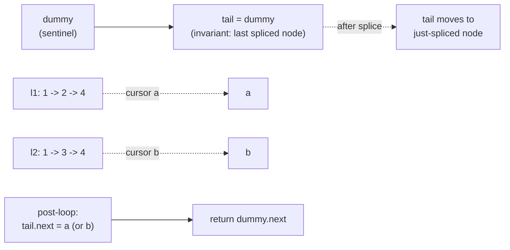

# Merging linked lists

Two sorted lists, `[1, 2, 4]` and `[1, 3, 4]`, and a job: produce one sorted list, `[1, 1, 2, 3, 4, 4]`, without allocating any new nodes. That last clause is the whole problem. The values are easy. The pointer surgery, walking two cursors and splicing the smaller head onto an output chain without losing the answer's head, is what gets people stuck on LeetCode 21 for half an hour the first time they see it.

The reason the head pointer is the problem: the moment you write the first `if`, you have two branches, both of which want to set the answer's head. So you write `if head is None: head = small; else: tail.next = small`, the special case eats half the function, and the bug surface is exactly the line where head got initialized in only one branch. The whole trick of this chapter is to make that question go away with a single line at the top: `dummy = ListNode(0); tail = dummy`. Now the head has a name. Now `dummy.next` is the answer. Every iteration looks the same, the head case disappears, and the merge collapses into `compare two heads, splice the smaller, advance that cursor.`[^1]

This chapter teaches the merge twice. The first half compares **recursive vs iterative** for two-list merge (LC 21). Same algorithm, same complexity, but one of them costs you a frame on the call stack for every node and the other costs nothing. The second half generalizes to *k* lists (LC 23) and compares **divide-and-conquer vs heap-based** merging. Both run in O(N log k); they differ in what they trade for that bound, and a senior interviewer will ask which you prefer and why.

## The dummy-node mechanic, in one diagram



*The invariant: `tail` always points to the last spliced node, and `dummy.next` is the answer's head. The post-loop assignment drains whichever cursor survived in a single pointer write.*

The post-loop drain is what makes the inner loop able to stop the moment one cursor exhausts. The surviving cursor's tail is already in sorted order relative to the merged prefix; by construction, it consists of values strictly larger than (or equal to) anything the loop already emitted. So splicing it whole onto `tail.next` finishes the answer in O(1), without iterating it. Forget that line and the output is silently truncated; the bug passes the balanced-length samples and fails the moment one input dominates.[^2]

## LC 21, the iterative merge

Sample `l1 = [1, 2, 4]`, `l2 = [1, 3, 4]`. Both cursors at the head, tail at the dummy. Compare `1 <= 1`, splice `l1`'s node, advance `a`. Compare `2 <= 1`? No, so splice `l2`'s 1, advance `b`. Compare `2 <= 3`, splice `l1`'s 2, advance `a`. Compare `4 <= 3`? No, splice `l2`'s 3, advance `b`. Compare `4 <= 4`, splice `l1`'s 4, advance `a`. Now `a` is null; the post-loop drain sets `tail.next = b`, which is the `[4]` cell, and we're done. Output: `[1, 1, 2, 3, 4, 4]`.

```python
def merge_two_lists_iterative(l1, l2):
    dummy = ListNode(0)             # sentinel; never returned, .next is the answer.
    tail = dummy                    # invariant: tail points to the last spliced node.
    a, b = l1, l2
    while a is not None and b is not None:
        if a.val <= b.val:          # `<=` keeps the merge stable: l1 wins on tie.
            tail.next = a
            a = a.next
        else:
            tail.next = b
            b = b.next
        tail = tail.next
    tail.next = a if a is not None else b   # one O(1) splice drains the survivor.
    return dummy.next
```

**Solution** — Python ([Java](./04-merging-linked-lists/lc-21/sol.java) · [C++](./04-merging-linked-lists/lc-21/sol.cpp) · [Go](./04-merging-linked-lists/lc-21/sol.go))

```python
# LC 21. Merge Two Sorted Lists
"""Two implementations of LC 21:

`merge_two_lists_iterative` is the chapter's preferred form: dummy node
plus a tail pointer, splice the smaller head, advance that cursor, drain
the survivor in one pointer assignment. O(n + m) time, O(1) auxiliary.

`merge_two_lists_recursive` is the textbook recursive form. Same time
bound, but O(n + m) recursion-stack space; the iterative form is what
ships in interviews.
"""
from __future__ import annotations
from typing import Optional


class ListNode:
    """LeetCode's standard singly-linked list node."""

    __slots__ = ("val", "next")

    def __init__(self, val: int = 0, nxt: "Optional[ListNode]" = None) -> None:
        self.val = val
        self.next = nxt


def merge_two_lists_iterative(
    l1: Optional[ListNode], l2: Optional[ListNode]
) -> Optional[ListNode]:
    """Iterative dummy-node + tail-pointer merge. Stable: l1 wins on ties."""
    dummy = ListNode(0)             # sentinel; never returned, .next is the answer.
    tail = dummy                    # invariant: tail points to the last spliced node.
    a, b = l1, l2
    while a is not None and b is not None:
        if a.val <= b.val:          # `<=` keeps the merge stable: l1 wins on tie.
            tail.next = a
            a = a.next
        else:
            tail.next = b
            b = b.next
        tail = tail.next
    tail.next = a if a is not None else b   # one O(1) splice drains the survivor.
    return dummy.next


def merge_two_lists_recursive(
    l1: Optional[ListNode], l2: Optional[ListNode]
) -> Optional[ListNode]:
    """Textbook recursive form. O(n + m) recursion stack; prefer iterative."""
    if l1 is None:
        return l2
    if l2 is None:
        return l1
    if l1.val <= l2.val:
        l1.next = merge_two_lists_recursive(l1.next, l2)
        return l1
    l2.next = merge_two_lists_recursive(l1, l2.next)
    return l2
```

The `<=` (not `<`) is doing more work than it looks. Equal-value ties go to `l1`, which preserves the relative order of equal keys across both inputs. That's the **stable-merge invariant** from CLRS §2.3.1, the same property the array merge of mergesort relies on.[^3] LC 21's grader checks values only, so `<` versus `<=` both pass. Build mergesort on top of this primitive (which chapter 2.3 does, with LC 148) and the stability claim of mergesort suddenly depends on a comparison operator three function calls down. Write the comment. Future-you will read it.

Three pointers in flight at any moment: `dummy`, `tail`, and one of `(a, b)`. Auxiliary space is O(1), regardless of input size.

## LC 21, the recursive merge

Same algorithm, expressed as a recursion on the two heads:

```python
def merge_two_lists_recursive(l1, l2):
    if l1 is None:
        return l2
    if l2 is None:
        return l1
    if l1.val <= l2.val:
        l1.next = merge_two_lists_recursive(l1.next, l2)
        return l1
    l2.next = merge_two_lists_recursive(l1, l2.next)
    return l2
```

Read it once: if either list is empty, return the other (this is where the post-loop drain hides). Otherwise, take the smaller head, point its `.next` at the merge of the rest, and return it. Trust the recursion (see [Recursion mental model](../part-0-foundations/02-recursion-mental-model.md)). The function does the right thing on the smaller subproblem, and the head decision is one comparison.

It's prettier than the iterative form. There is no dummy, no tail, no special case. The recursion's base cases handle empty lists; the recursive call handles the head pointer for free.

The cost is hidden, and it's not small. Each recursive call is a frame on the call stack. In the worst case, when one list dominates and we recurse all the way down it, the stack grows to depth `n + m`. On LC 21's constraint `0 <= n, m <= 50`, you'll never blow the stack. On LC 148 (Sort List), where this same primitive is the merge step inside mergesort and the inputs reach 50,000 nodes, you absolutely will. Sedgewick's *Algorithms* §2.2 calls this out directly: the recursive linked-list merge has Θ(n + m) stack space, and the iterative form has Θ(1).[^4]

## Picking between them

| | Iterative | Recursive |
|---|---|---|
| Time | Θ(n + m) | Θ(n + m) |
| Auxiliary space | Θ(1) | Θ(n + m) call stack |
| Lines of code | 11 | 8 |
| Reads cleanly | Yes, with comments | Yes, no comments needed |
| Survives n = 50,000 | Yes | Stack overflow |
| Used as the merge step of mergesort | Yes | No (would blow the stack) |

The iterative form is the interview answer. Recursive code earns you a "nice, and what about the stack?" follow-up, which you answer by writing the iterative form anyway. Show the recursive form to demonstrate you understand the structure; ship the iterative one.

This pattern repeats across linked-list problems. The recursive surface is shorter, the iterative surface is what runs at scale. When the input bound is a few hundred nodes (LC 21, LC 206), either is fine. When the input bound is in the tens of thousands (LC 148), iteration is mandatory.

## What it actually costs (LC 21)

| Variant | Time | Space (auxiliary) |
|---|---|---|
| Iterative dummy + tail | Θ(n + m) | Θ(1) |
| Recursive | Θ(n + m) | Θ(n + m) call stack |

The Θ(n + m) time is exact, not amortized: each iteration of the loop advances one cursor by one node and emits one node, the loop terminates when either cursor exhausts, and the post-loop drain is one pointer assignment. Every node from both inputs is touched exactly once. There is no input on which the iterative form does more than `n + m - 1` comparisons; in the best case (one list strictly dominates the other) it does fewer, with the survivor spliced in O(1) by the drain.[^2]

## When two becomes k

`mergeKLists` takes an array of *k* sorted lists and returns one sorted list. The naive generalization of LC 21 is to fold the array left-to-right: merge list 0 with list 1, then merge the result with list 2, and so on. Easy to write. Disastrous to run.

If each list has *n* nodes and we have *k* of them, the second merge is Θ(2n), the third is Θ(3n), the *k*-th is Θ(kn). Total work is Θ(n + 2n + 3n + ... + kn) = Θ(n · k²/2) = Θ(Nk) where N = nk is the total node count. On LC 23's constraints (*k* up to 10,000, N up to 10,000) that's 10⁸ operations, well past the 1-second budget. The two-list bound was perfect; the sequential generalization throws it away.[^5]

Two algorithms hit Θ(N log k) and live within the budget. They have the same asymptotic bound, different constant factors, and one is easier to reason about than the other.

## LC 23, divide-and-conquer

Pair the lists up: merge `lists[0]` with `lists[1]`, `lists[2]` with `lists[3]`, and so on. After one pass, you have ⌈k/2⌉ lists. Pair them up again. Repeat until one list remains.

```python
def merge_k_lists_divide_conquer(lists):
    if not lists:
        return None
    while len(lists) > 1:
        merged = []
        for i in range(0, len(lists), 2):
            a = lists[i]
            b = lists[i + 1] if i + 1 < len(lists) else None
            merged.append(_merge_two(a, b))
        lists = merged
    return lists[0]
```

**Solution** — Python ([Java](./04-merging-linked-lists/lc-23/sol.java) · [C++](./04-merging-linked-lists/lc-23/sol.cpp) · [Go](./04-merging-linked-lists/lc-23/sol.go))

```python
# LC 23. Merge k Sorted Lists
"""Two implementations of LC 23. Same O(N log k) bound, different
constants, different practical considerations.

`merge_k_lists_heap` keeps a min-heap of (val, list_index, node)
triples. Each of N nodes is pushed once and popped once; each heap op
is O(log k). Tiebreak on list_index keeps Python's heapq from comparing
ListNode references.

`merge_k_lists_divide_conquer` pairs lists up and merges in a
balanced binary tree. log k levels, O(N) work per level. Uses LC 21's
iterative merge as the leaf operation. O(log k) recursion stack
(versus O(k) heap memory) and no PriorityQueue dependency.
"""
from __future__ import annotations
import heapq
from typing import List, Optional


class ListNode:
    """LeetCode's standard singly-linked list node."""

    __slots__ = ("val", "next")

    def __init__(self, val: int = 0, nxt: "Optional[ListNode]" = None) -> None:
        self.val = val
        self.next = nxt


def _merge_two(a: Optional[ListNode], b: Optional[ListNode]) -> Optional[ListNode]:
    """The LC 21 iterative merge. Used as the leaf step of the d-and-c form."""
    dummy = ListNode(0)
    tail = dummy
    while a is not None and b is not None:
        if a.val <= b.val:
            tail.next = a
            a = a.next
        else:
            tail.next = b
            b = b.next
        tail = tail.next
    tail.next = a if a is not None else b
    return dummy.next


def merge_k_lists_heap(lists: List[Optional[ListNode]]) -> Optional[ListNode]:
    """Min-heap of cursors. O(N log k) time, O(k) auxiliary."""
    dummy = ListNode(0)
    tail = dummy
    heap: list = []
    for i, head in enumerate(lists):
        if head is not None:
            heapq.heappush(heap, (head.val, i, head))   # (val, idx, node) tuple.
    while heap:
        _val, idx, node = heapq.heappop(heap)
        tail.next = node
        tail = tail.next
        if node.next is not None:
            heapq.heappush(heap, (node.next.val, idx, node.next))
    tail.next = None    # detach any tail still referencing the input.
    return dummy.next


def merge_k_lists_divide_conquer(lists: List[Optional[ListNode]]) -> Optional[ListNode]:
    """Pairwise merge tree. O(N log k) time, O(log k) recursion-stack space."""
    if not lists:
        return None
    while len(lists) > 1:
        merged = []
        for i in range(0, len(lists), 2):
            a = lists[i]
            b = lists[i + 1] if i + 1 < len(lists) else None
            merged.append(_merge_two(a, b))
        lists = merged
    return lists[0]
```

The cost analysis is the cleanest in the chapter. There are ⌈log₂ k⌉ pairing levels. At each level, every node from every list is touched exactly once. Pairs at level 0 each touch 2n nodes, but there are k/2 such pairs, and 2n · k/2 = N. Same arithmetic at every level: total work per level is Θ(N), and there are log k levels. Total: Θ(N log k).[^5]

Stated as a recurrence: `T(k) = 2·T(k/2) + Θ(N)`. By the master theorem, that's Θ(N log k).

Auxiliary space is Θ(log k) for the recursion (or, in this iterative implementation, the same in the temporary `merged` list). Notably, no auxiliary data structure: the leaf step is LC 21's iterative merge, which is itself O(1) auxiliary. The whole algorithm uses no priority queue, no extra memory beyond the array of list heads.

## LC 23, heap-based

Keep a min-heap of *k* cursors, one per non-null input list. On each step, pop the cursor with the smallest head value, splice that node onto the output, and push the cursor's next node back into the heap (if non-null).

```python
def merge_k_lists_heap(lists):
    dummy = ListNode(0)
    tail = dummy
    heap = []
    for i, head in enumerate(lists):
        if head is not None:
            heapq.heappush(heap, (head.val, i, head))   # (val, idx, node) tuple.
    while heap:
        _val, idx, node = heapq.heappop(heap)
        tail.next = node
        tail = tail.next
        if node.next is not None:
            heapq.heappush(heap, (node.next.val, idx, node.next))
    tail.next = None
    return dummy.next
```

The bound: each of N nodes is heap-pushed once and heap-popped once. Each heap operation on a heap of *k* elements is O(log k). Total: 2N · O(log k) = Θ(N log k).[^3] [^5] The heap never holds more than *k* entries (one cursor per input list), so auxiliary space is Θ(k).

The chapter on heaps proves the bound from first principles; here we use the result. CLRS §6.5 establishes that `HEAP-EXTRACT-MIN` and `MIN-HEAP-INSERT` are both O(log k) on a heap of *k* elements.[^3]

There is one detail that bites every Python implementer the first time: the heap entry must be `(val, idx, node)`, not `(val, node)`. When two cursors have equal head values, Python's `heapq` falls through to comparing the second tuple element. With `(val, node)`, that element is a `ListNode`, which raises `TypeError: '<' not supported between instances of 'ListNode' and 'ListNode'`. The list-index field breaks ties deterministically and is unique per cursor, so the comparator is a total order and the `ListNode` is never inspected for ordering. C++ has the same problem with raw pointers (the comparison is implementation-defined, which means non-deterministic results across runs); Java's `Comparator.comparingInt(...).thenComparingInt(...)` is the idiomatic equivalent.

## Picking between divide-and-conquer and heap

| | Divide-and-conquer | Heap-based |
|---|---|---|
| Time | Θ(N log k) | Θ(N log k) |
| Auxiliary space | Θ(log k) recursion / temp array | Θ(k) heap |
| Constant factor | Lower (no heap rebalancing per node) | Higher (sift-up + sift-down per node) |
| Cache locality | Better (sequential merges over linked nodes) | Worse (heap accesses scatter across the array) |
| External dependencies | None, uses LC 21's merge | Priority queue from stdlib |
| Adapts to streaming inputs (lists arriving online) | No, needs all heads up front to pair | Yes, push new cursors as they arrive |
| Lines of code | ~12 | ~12 |

Both are correct, both are optimal. The constant-factor and cache-locality wins for divide-and-conquer come from the leaf step doing pure sequential pointer chasing, no heap chatter per node. On most inputs, divide-and-conquer is measurably faster than heap-based for LC 23, sometimes by 2-3x in practice. Same asymptotic, very different cycle count.

The heap is the right answer when the lists arrive incrementally (you can't see all *k* heads at once) or when the merge is part of a longer pipeline that already needs a priority queue for unrelated reasons. For the classic "here are *k* lists, merge them" framing, divide-and-conquer is the cleaner pick.

In an interview, mention both. "I'd reach for divide-and-conquer because it has a smaller constant factor and doesn't require a priority queue, but the heap version is the more general framing; it's what I'd use if the lists were arriving online." That answer earns the next question, which is usually "good, now what if the lists are infinite?"

## What it actually costs (LC 23)

| Variant | Time | Space (auxiliary) |
|---|---|---|
| Sequential left-fold (the wrong answer) | Θ(N · k) | Θ(1) |
| Divide-and-conquer pairwise merge | Θ(N log k) | Θ(log k) recursion + Θ(k/2) temp |
| Min-heap of cursors | Θ(N log k) | Θ(k) heap |

N is the total node count across all *k* input lists. The Θ(N log k) bound is tight in the comparison model: Greene 1993 derives it as `2N · ⌊log k⌋` comparisons for the heap form and strictly under `N · ⌈log k⌉` for the divide-and-conquer form, with the divide-and-conquer count slightly lower because the merge tree visits each node at exactly the depth of its origin list rather than at the root of a heap rebalance.[^5]

## Two pitfalls that bite

> [!WARNING]
> **Forgetting the post-loop drain.** The inner loop ends as soon as one cursor goes null, but the surviving cursor's tail still needs to be appended. Skipping `tail.next = a if a is not None else b` produces silently-truncated output that passes balanced-length samples (`[1,2,3]` vs `[4,5,6]` happens to work because both exhaust together at LC's small inputs) and fails the "one list dominates" cases. The recursive form makes the drain implicit (the base case `if l1 is None: return l2` does the same job); the iterative form requires it explicit.

> [!WARNING]
> **Heap entries that compare on raw `ListNode` objects.** Pushing `(val, node)` into Python's `heapq` works until two cursors hit the same head value; then `heapq` falls through to comparing the `ListNode` instances and raises `TypeError`. C++ falls through to comparing pointers (implementation-defined order, non-deterministic across runs). Always insert a tiebreaker. The list index is the canonical choice because it's unique per cursor and the comparator becomes a total order on numeric fields only. The `ListNode` is the payload, never the sort key.

## Problem ladder

### CORE (solve all three to claim chapter mastery)

- [LC 21 — Merge Two Sorted Lists](https://leetcode.com/problems/merge-two-sorted-lists/) [Easy] • merge-two-sorted-lists-dummy-node ★
- [LC 86 — Partition List](https://leetcode.com/problems/partition-list/) [Medium] • partition-list-dual-tail-dummy
- [LC 1669 — Merge In Between Linked Lists](https://leetcode.com/problems/merge-in-between-linked-lists/) [Medium] • splice-list-into-list-anchor

### STRETCH (optional)

- [LC 23 — Merge k Sorted Lists](https://leetcode.com/problems/merge-k-sorted-lists/) [Hard] • k-way-merge-min-heap-of-cursors
- [LC 1171 — Remove Zero Sum Consecutive Nodes](https://leetcode.com/problems/remove-zero-sum-consecutive-nodes-from-linked-list/) [Medium] • prefix-sum-on-linked-list-with-dummy

LC 23 is the chapter's natural Hard, but its full treatment (with the heap-internals deep dive) lives in [Heaps](../part-6-trees-heaps/04-heaps-priority-queues.md). The heap is the lesson there, and we cite it here as STRETCH so the cursor framing isn't duplicated. LC 1171 is a cross-pattern STRETCH that uses [The prefix-sum + hash-map combo](../part-3-pointers-window-prefix/05-prefix-sum-hash.md) on a linked list, with the dummy node anchoring prefix sum 0 at index -1.

## Where this leads

The merge primitive itself shows up again as the merge step of linked-list mergesort in [Comparison sorts I](../part-2-search-sort/03-comparison-sorts-1.md) (LC 148, Sort List). That chapter ships the mergesort algorithm; this one ships the merge primitive it builds on, and the iterative form's O(1) auxiliary space is what makes the recursion-on-mergesort tractable on inputs of fifty thousand nodes.

The dummy-node mechanic itself extends one more step in [LRU cache](./05-lru-cache.md), where a doubly-linked list with sentinels at *both* head and tail makes every list operation a four-line edit, no head-or-tail special case anywhere. Same idea, applied twice; the LRU cache pattern is what production systems actually ship.

## References

[^1]: GeeksforGeeks, "Merge two sorted linked lists using Dummy Nodes." <https://www.geeksforgeeks.org/dsa/merge-two-sorted-linked-lists-using-dummy-nodes/>.

[^2]: Wikipedia contributors, "Merge algorithm," last edited 2025. <https://en.wikipedia.org/wiki/Merge_algorithm>.

[^3]: Cormen, Leiserson, Rivest, Stein, *Introduction to Algorithms*, 4th ed., MIT Press, 2022.

[^4]: Sedgewick and Wayne, *Algorithms*, 4th ed., Addison-Wesley / Princeton, 2011. §2.2 "Mergesort," available online at <https://algs4.cs.princeton.edu/22mergesort/>.

[^5]: Greene, William A., "k-way Merging and k-ary Sorts," Proc. 31st Annual ACM Southeast Conference, 1993, pp. 127-135. <http://www.cs.uno.edu/people/faculty/bill/k-way-merge-n-sort-ACM-SE-Regl-1993.pdf>.
