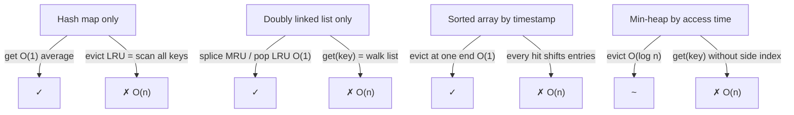
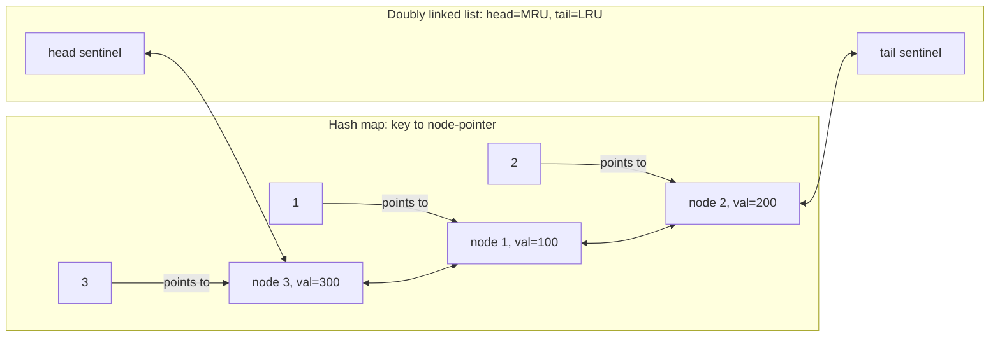

# LRU cache: hash map plus doubly linked list

LeetCode 146 prints two characters that scare interview candidates more than the rest of the problem combined: `O(1)`. Both `get` and `put` must run in constant time. Read the constraint twice. The cache holds up to 3,000 entries, the LRU policy demands you find and evict the least-recently-touched item on every overflow, and the only way through the contract at the time bound asked is a structure that almost no candidate has built before they encountered this problem.

The reason it scares people is that the obvious answers all almost work. A hash map gets `get` to O(1) average and has no idea what "least recently used" means. Reach instead for a doubly linked list, and eviction-from-the-tail is O(1), but now there is no way to find the node for a given key without walking the list. Sort by access timestamp? O(n) on every touch. Min-heap by access time? O(log n). Each single-structure attempt fails at exactly one of the two operations, and the failure is at the worst possible spot in the API. The fix is to wire two structures together so each handles the operation the other cannot.

## The contract

Three operations, all expected O(1):

- `LRUCache(capacity)` — create a cache that holds at most `capacity` key-value pairs.
- `get(key)` — return the value if the key is present, `-1` otherwise. A hit counts as a use.
- `put(key, value)` — insert or update. If the cache is at capacity and the key is new, evict the entry not touched for the longest time. An update counts as a use.[^3]

Three subtleties make the problem harder than its API suggests. The first: an update on an existing key promotes the entry to most-recently-used. `put(k, v)` is not "write a value"; it is "write a value AND mark this entry as touched". The LC test suite enforces this; miss it, and you fail tests around capacity 1.[^3] The second: eviction picks the entry at the *tail* of the recency order, never an entry the caller just operated on, even if the operation was an update. The third: hits never mutate the value, but they always mutate the recency order. A `get` is a write to the structure even though it looks like a read to the caller.

## Why one structure is never enough

Walk through what each single structure costs.

**Hash map only.** `get` is O(1) average. `put` to write is O(1) average. But "evict the least-recently-touched key" requires you to know which key that is, and a hash map has no order. You'd have to scan all `n` entries to find the oldest timestamp. Eviction is O(n).

**Doubly linked list only.** Splice the most-recently-touched node to the head; pop the tail when you evict. Both are O(1) given a pointer to the node. But `get(key)` has to *find* the node first, and a linked list does not index by key. Walk the list: O(n). The hit path is O(n).

**Sorted array by timestamp.** Eviction is O(1) at one end. `get(key)` is O(n) without an index, or O(log n) with binary search by key (and now you have to maintain that index too). Worse: every hit shifts the touched entry to one end, displacing every entry in between. O(n) on each access.

**Min-heap keyed on access time.** `get` is still O(n) without a side hash map. Eviction is O(log n). The structure is closer than the others, but it pays log time for the `get` you wanted constant-time.

Each attempt fails at exactly one operation. The dual-structure trick cures this by giving each operation to the structure that handles it natively.



*Each single structure has one operation it cannot do in O(1). The dual structure assigns each operation to the half that handles it natively.*

## The dual structure

Two pieces, bound by one rule.

A **doubly linked list** holds the entries in recency order. The node closest to the head is the most-recently-used; the node closest to the tail is the least-recently-used. Splicing a node to the head is four pointer assignments. Removing a node from anywhere in the list is two pointer assignments, *given a pointer to the node*. The doubly linked variant matters: a singly linked list cannot delete `x` in O(1) because it has no way to reach `x.prev` to rewrite its `next` pointer.[^1]

A **hash map** maps each key to the linked-list node that holds it. Not to the value, but to the *node*. This is the load-bearing detail. When `get(key)` runs the map lookup, it gets back the exact node it needs to splice to the head, with no list walk required. Both halves of the LRU contract collapse to O(1) average: the map handles "find by key", the list handles "splice and evict by recency".

Two invariants tie the structures together:

1. The map and the list always hold the same set of keys. Every map insert pairs with a list `add_to_front`. Every map delete pairs with a list `remove`.
2. The map's value type is the *node pointer*, never the user-facing value. The user-facing value lives inside the node.



*Every key in the map points to a node in the list. Left-to-right order in the list encodes recency, MRU on the left and LRU on the right. The map handles lookup; the list handles ordering.*

[Doubly linked lists](./01-reversal-patterns.md) introduced the prev/next mechanics this chapter assumes. [Linked-list fundamentals](./00-linked-list-fundamentals.md) introduced sentinels, and they earn their place again here. The list always holds two dummy nodes the algorithm never touches: a `head` sentinel before the MRU, a `tail` sentinel after the LRU. With sentinels, every splice and every remove becomes four pointer assignments with no branching for "is this the head?" or "is this the tail?". Without sentinels, those edge cases multiply, and one of them is always wrong.[^1]

## The four operations

Two helpers do the pointer surgery; `get` and `put` compose them.

```python
def _remove(self, node):
    node.prev.next = node.next
    node.next.prev = node.prev

def _add_to_front(self, node):
    node.next = self.head.next
    node.prev = self.head
    self.head.next.prev = node
    self.head.next = node
```

`_remove` unlinks an arbitrary node from anywhere in the list: middle, end, doesn't matter. Two writes. `_add_to_front` splices a node in just after the head sentinel. Four writes. Neither helper checks for null, neither special-cases the empty list. The sentinels guarantee `node.prev` and `node.next` are always real nodes, even when the list logically holds zero entries (because then `head.next == tail` and `tail.prev == head`).

`get(key)` is one map lookup, one detach, one splice:

```python
def get(self, key):
    node = self.map.get(key)
    if node is None:
        return -1
    self._remove(node)
    self._add_to_front(node)
    return node.value
```

The hit path runs three O(1) operations. By the sum rule, the total is O(1).[^1][^2] The miss path is one O(1) lookup and an early return.

`put(key, value)` has three branches, and the order matters:

```python
def put(self, key, value):
    node = self.map.get(key)
    if node is not None:
        node.value = value
        self._remove(node)
        self._add_to_front(node)
        return
    if len(self.map) == self.capacity:
        lru = self.tail.prev
        self._remove(lru)
        del self.map[lru.key]
    new_node = _Node(key, value)
    self.map[key] = new_node
    self._add_to_front(new_node)
```

Read the branches in order. The update branch handles `put` on an existing key: write the new value, then splice to head, because update counts as a use. The eviction branch handles `put` on a new key when the cache is full: read `tail.prev` (always a real node thanks to the tail sentinel), unlink it from the list, and delete its key from the map. Both halves of that paired delete must run, or the next `get(evicted_key)` returns a stale node. The insert branch then creates the new node and splices it after the head.

The eviction branch runs *before* the insert branch, never after. Insert-then-evict can pick the just-inserted node as the LRU when capacity equals 1, evicting the entry the caller wanted. The bug is rare and silent everywhere except the capacity-1 thrash test, which is exactly why LC includes that test.

The full hand-rolled implementation:

```python
from typing import Optional


class _Node:
    __slots__ = ("key", "value", "prev", "next")

    def __init__(self, key: int, value: int) -> None:
        self.key = key
        self.value = value
        self.prev: Optional["_Node"] = None
        self.next: Optional["_Node"] = None


class LRUCache:
    def __init__(self, capacity: int) -> None:
        self.capacity = capacity
        self.map: dict[int, _Node] = {}
        self.head = _Node(0, 0)
        self.tail = _Node(0, 0)
        self.head.next = self.tail
        self.tail.prev = self.head

    def _remove(self, node: _Node) -> None:
        node.prev.next = node.next
        node.next.prev = node.prev

    def _add_to_front(self, node: _Node) -> None:
        node.next = self.head.next
        node.prev = self.head
        self.head.next.prev = node
        self.head.next = node

    def get(self, key: int) -> int:
        node = self.map.get(key)
        if node is None:
            return -1
        self._remove(node)
        self._add_to_front(node)
        return node.value

    def put(self, key: int, value: int) -> None:
        node = self.map.get(key)
        if node is not None:
            node.value = value
            self._remove(node)
            self._add_to_front(node)
            return
        if len(self.map) == self.capacity:
            lru = self.tail.prev
            self._remove(lru)
            del self.map[lru.key]
        new_node = _Node(key, value)
        self.map[key] = new_node
        self._add_to_front(new_node)
```

**Solution** — Python ([Java](./05-lru-cache/lc-146/sol.java) · [C++](./05-lru-cache/lc-146/sol.cpp) · [Go](./05-lru-cache/lc-146/sol.go))

```python
# LC 146. LRU Cache
from typing import Optional


class _Node:
    __slots__ = ("key", "value", "prev", "next")

    def __init__(self, key: int, value: int) -> None:
        self.key = key
        self.value = value
        self.prev: Optional["_Node"] = None
        self.next: Optional["_Node"] = None


class LRUCache:
    def __init__(self, capacity: int) -> None:
        self.capacity = capacity
        self.map: dict[int, _Node] = {}
        # Sentinel head and tail. head.next is most recently used; tail.prev is LRU.
        self.head = _Node(0, 0)
        self.tail = _Node(0, 0)
        self.head.next = self.tail
        self.tail.prev = self.head

    def _remove(self, node: _Node) -> None:
        node.prev.next = node.next
        node.next.prev = node.prev

    def _add_to_front(self, node: _Node) -> None:
        node.next = self.head.next
        node.prev = self.head
        self.head.next.prev = node
        self.head.next = node

    def get(self, key: int) -> int:
        node = self.map.get(key)
        if node is None:
            return -1
        self._remove(node)
        self._add_to_front(node)
        return node.value

    def put(self, key: int, value: int) -> None:
        node = self.map.get(key)
        if node is not None:
            node.value = value
            self._remove(node)
            self._add_to_front(node)
            return
        if len(self.map) == self.capacity:
            lru = self.tail.prev
            self._remove(lru)
            del self.map[lru.key]
        new_node = _Node(key, value)
        self.map[key] = new_node
        self._add_to_front(new_node)
```

The `__slots__` declaration on `_Node` saves about 56 bytes per node on CPython 3.11 by suppressing the per-instance `__dict__`; it is the standard idiom for hot-path internal classes. The C++ version uses `std::list::splice`, which is constant-time and explicitly preserves iterator validity for the moved element; that preservation is what lets the unordered_map store list iterators without rebuilding them on every hit. The Go version stores `*lruNode` pointers in the map, not values, because Go map values are copied on access; storing values would break the identity binding between map entries and list nodes. The Java version mirrors the Python structure directly with a private inner `Node` class.

## What the production-grade shortcut hides

Every standard library has the same data structure ready to use. Python's `collections.OrderedDict` keeps entries in insertion order and exposes `move_to_end(key, last=True)` and `popitem(last=False)`, both O(1).[^5] Java has `LinkedHashMap` with the `accessOrder = true` constructor flag and an overridable `removeEldestEntry` callback that wires the eviction policy directly into the map. C++ has nothing built in; `std::list` plus `std::unordered_map` is the canonical idiom. Go's `container/list` plus a `map[K]*list.Element` is the parallel.

A production engineer writes the OrderedDict version. An interviewer hearing "I'd use OrderedDict" has heard nothing about whether you understand the underlying structure. The hand-rolled version above is the answer for the interview because the interviewer is testing whether you can compose the two structures yourself; it is also the answer for any production system where the OrderedDict layer is too high-level (a non-Python service, a custom invariant the stdlib doesn't expose, a memory layout you control). The shortcut is fine for production code in Python or Java; the mechanic underneath is what gets you past LC 146 and the senior loops at Meta, Amazon, and Google that ask the same question.

> [!IMPORTANT]
> If an interviewer asks you to implement LC 146, do not reach for `OrderedDict` or `LinkedHashMap`. The interviewer wants the hand-rolled version. The shortcut is correct, fast, and immediately disqualifying.

## Walking the canonical sequence

Take capacity 2 and the operation sequence `put(1,1), put(2,2), get(1), put(3,3), get(2), put(4,4), get(1), get(3), get(4)`. This is the LC 146 example. The widget below scrubs through all ten steps; the prose narrates only the moments where the answer changes.

The build is uneventful: `put(1,1)` then `put(2,2)` puts node 2 at the head and node 1 at the tail. The first interesting moment is step 3, the `get(1)` hit. Node 1 detaches from the tail position and splices to the head. Node 2 slides to the tail. The hit changed the eviction order.

That promotion is what determines step 4. `put(3,3)` finds the cache full. The tail-prev sentinel hands back the LRU, which is now node 2 because of the step-3 promotion, and step 4 evicts node 2, not node 1. Run the same sequence without step 3, and node 1 evicts instead. The rest of the trace is mechanical: misses on the evicted keys, hits on the live keys, each hit shuffling the recency order one position.

> **Interactive widget:** [LRU cache (hash map + doubly linked list)](../widgets/w-15-lru-cache.yml) — rendered on the website; the YAML spec describes the keyframes.

*Static fallback: ten keyframes showing the hash-map row and the doubly-linked-list row side by side. Each step highlights the active node, the about-to-evict node when applicable, and the post-op MRU and LRU.*

## State machine for `put`

`put` has three distinct paths through the code, and which one fires depends on the state of the map and the size:

```mermaid
stateDiagram-v2
    [*] --> CheckMap: put(k, v)
    CheckMap --> UpdatePath: key in map
    CheckMap --> InsertPath: key not in map
    UpdatePath --> WriteValue: node = map[k]
    WriteValue --> Splice: node.value = v
    Splice --> Done: remove(node); add_to_front(node)
    InsertPath --> CheckSize: size, capacity check
    CheckSize --> Evict: size == capacity
    CheckSize --> CreateNode: size < capacity
    Evict --> RemoveLRU: lru = tail.prev
    RemoveLRU --> DeleteFromMap: remove(lru); del map[lru.key]
    DeleteFromMap --> CreateNode
    CreateNode --> AddNew: map[k] = new_node
    AddNew --> Done: add_to_front(new_node)
    Done --> [*]
```



*Update-and-promote, insert-no-evict, and insert-with-evict are the three paths. Eviction always runs before insert when both fire; the order is what makes the capacity-1 case correct.*

## What it actually costs

Every operation hits O(1) average, given simple uniform hashing on the map.

| Operation | Time | Space | Source |
|---|---|---|---|
| `get(key)` (hit or miss) | O(1) average | O(n) | CLRS §10.2 (DLL O(1) splice) + §11.2 Theorem 11.1 (chained-hash O(1) average)[^1][^2] |
| `put(key, value)` (update path) | O(1) average | O(n) | One map lookup + detach + splice; sum of three O(1) steps |
| `put(key, value)` (insert, no evict) | O(1) average | O(n) | One map lookup miss + create + splice + map insert |
| `put(key, value)` (insert with evict) | O(1) average | O(n) | Same plus one detach on `tail.prev` and one map delete |
| Worst case under adversarial hash | O(n) | O(n) | All keys collide on one bucket; CLRS §11.2 worst-case bound[^2] |

CLRS Chapter 10 §10.2 establishes that `LIST-DELETE` and `LIST-INSERT` on a doubly linked list each run in O(1) given a pointer to the node, and the §10.2 sentinel argument removes the empty-list edge case from every splice.[^1] CLRS §11.2 Theorem 11.1 establishes that an unsuccessful chained-hash search runs in expected `Theta(1 + alpha)` time under simple uniform hashing, and Theorem 11.2 gives the same bound for successful searches. With load factor `alpha` bounded by a constant (Java's `HashMap` keeps it below 0.75 by resizing, Python's `dict` does similar), both bounds collapse to O(1) average.[^2] The composition is the key step: an LRU `get` is one map lookup plus one DLL detach plus one DLL splice, three O(1) steps, total O(1).

The "average" qualifier matters at staff level. An attacker who controls the keys and knows the hash function can drive every key into the same bucket; the chained-hash chain becomes a linked list, and lookups degrade to O(n) per call. Klink and Walde demonstrated this against Python and Ruby web frameworks in 2011; CPython responded with PEP 456 and SipHash, and Java responded by treeifying long chains beyond a threshold. An LRU cache backing a public API inherits this exposure, and the mitigation is the hash function, not the cache structure.

## How LFU and the cursor variants extend the shape

The dual-structure idea generalizes. Two close cousins appear on the ladder.

**LFU (LC 460).** The eviction axis is access frequency, ties broken by recency. The naive solution keeps a min-heap keyed on access count, paying O(log n) per operation. Matani, Shah, and Mitra showed in 2010 that you can keep all operations at O(1) average by replacing the heap with a doubly linked list of *frequency buckets*, where each bucket is itself a doubly linked list of entries at that frequency. The hash map maps `key -> entry node` and a side hash map maps `frequency -> bucket node`. On a hit, the entry detaches from its current frequency bucket and splices into the bucket for `frequency + 1`; eviction pops the tail entry of the smallest-frequency bucket.[^4] LRU is the special case where every entry has frequency 1.

**Browser history (LC 1472).** Two access modes again, but the secondary axis is *position* not recency. The structure is the doubly linked list itself plus a `current` pointer field. `back(n)` walks `current` n steps backward, `forward(n)` walks it n steps forward, and `visit(url)` severs the forward chain (`current.next = new Node(url)`). No hash map this time, because there is no key-based lookup, just cursor walks. Same dual-structure mental shape, different secondary axis.

The shared lesson: any time a problem demands O(1) for two distinct access modes on the same collection, the answer is two structures with bound state. LRU's two modes are key-lookup and recency-eviction. LFU's are key-lookup and frequency-bucket-walk. Browser history's are positional walk forward and backward. The pattern outlives the specific problem.

## Where readers go wrong

> [!WARNING]
> **Forgetting to delete from the map after evicting from the list.** The eviction branch of `put` does two things, and both must run: `_remove(tail.prev)` AND `del map[lru.key]`. Implementers who think of the linked list as the "main" structure tend to skip the second step. The next `get(evicted_key)` then returns the stale node: sometimes the right answer by luck, sometimes a node that has been recycled into a different position, always a bug waiting for the right test input. Treat the map and the list as co-equal owners of the same set of keys: every operation either inserts to both or deletes from both.

> [!WARNING]
> **Storing the value, not the node pointer, in the hash map.** A `Map<Integer, Integer>` declaration in Java looks right because it mirrors the API. It is also wrong: `get(key)` returns the value, but the splice operation needs the node, and the node is not findable from the value. Implementers fall back to walking the list to find the node, costing O(n). The map's value type must be the node pointer: `dict[int, _Node]` in Python, `Map<Integer, Node>` in Java, `unordered_map<int, list::iterator>` in C++, `map[int]*lruNode` in Go.

> [!WARNING]
> **Using a singly linked list (or `java.util.LinkedList`).** The design appears to work, then `get(key)` is secretly O(n) because the splice-to-front step has to walk from the head to find the node's predecessor. Java's `LinkedList` is doubly linked under the hood but does not expose iterator-stable references to internal nodes, so its `remove(Object)` is O(n) regardless of topology. Roll your own doubly linked list with explicit `prev` and `next` fields, or use a structure whose API guarantees iterator stability (C++ `std::list`, Go `container/list`, Java `LinkedHashMap`).

> [!WARNING]
> **Forgetting that `put` on an existing key is also a "use".** The natural reading of "I just changed its value, that's a write, not a read" is wrong here. LC 146's test suite expects an update to splice the node to the head; miss this and the next eviction picks the just-updated entry as the LRU.[^3] The fix is one extra splice in the update branch: `node.value = value; _remove(node); _add_to_front(node)`.

> [!WARNING]
> **Inserting before evicting at capacity = 1.** With capacity 1 and a full cache, "insert first then evict to restore capacity" makes `tail.prev` the just-inserted node, and the eviction step removes it. The cache ends up empty after the put. Always evict first, then insert.

## Problem ladder

### CORE (solve all three to claim chapter mastery)

- [LC 146 — LRU Cache](https://leetcode.com/problems/lru-cache/) [Medium] • hash-map-plus-doubly-linked-list-cache ★
- [LC 460 — LFU Cache](https://leetcode.com/problems/lfu-cache/) [Hard] • hash-map-plus-frequency-bucketed-dll
- [LC 1472 — Design Browser History](https://leetcode.com/problems/design-browser-history/) [Medium] • doubly-linked-list-with-current-cursor

### STRETCH (optional)

- [LC 1206 — Design Skiplist](https://leetcode.com/problems/design-skiplist/) [Hard] • probabilistic-multilevel-linked-list

The dual-data-structure pattern admits no canonical Easy LC; LC 705 and LC 706 (Design HashSet, Design HashMap) drop the linked-list half, and LC 707 (Design Linked List) is itself Medium. The CORE+STRETCH set spans Medium / Hard / Medium / Hard, and the ladder carries the `core-emh-via-stretch` curation flag to record the absent Easy band. LC 432 (All O\`one Data Structure) is a fourth dual-structure problem with the same shape, registry-locked to [Hash collisions and the load factor](../part-1-linear-data-structures/04-hash-collisions.md); cite it there for the frequency-bucket variant if you want a second pass at the LFU mechanic.

## Where this leads

The eviction policy is one decision in a family. LRU evicts by recency. LFU evicts by frequency. ARC (Adaptive Replacement Cache, used in ZFS) keeps two LRU lists and shifts entries between them based on observed access patterns. W-TinyLFU (the policy behind Caffeine, the JVM cache library) uses a small admission filter plus a sketch of frequency to keep the hit rate high under skewed workloads. Redis offers `maxmemory-policy allkeys-lru` and `allkeys-lfu` as configuration knobs; Memcached uses a slab-LRU hybrid; the Linux page cache approximates LRU with two lists (active and inactive). [Designing the data structure](../part-13-design-the-data-structure/00-lru-cache.md) walks the trade-offs at scale, where the question is no longer "implement LRU in O(1)" but "which eviction policy does this workload want, and why".

The pointer surgery you ran here (sentinels, `_remove`, `_add_to_front`, the four pointer assignments per splice) is the same surgery [Reverse linked list](./01-reversal-patterns.md) used in a different shape. Linked-list mechanics are the substrate; the disciplines (LRU, LFU, cycle detection, in-place reversal) are different ways to compose them. Once the substrate clicks, the disciplines stop looking like separate algorithms and start looking like applications of the same primitive.

## References

[^1]: Cormen, Leiserson, Rivest, Stein, *Introduction to Algorithms*, 4th ed., MIT Press, 2022.

[^2]: CLRS, 4th ed., Chapter 11 §11.2 "Hash tables", Theorem 11.1 (an unsuccessful search in a chained hash table under simple uniform hashing takes expected `Theta(1 + alpha)` time) and Theorem 11.2 (successful search expected `Theta(1 + alpha)` on average).

[^3]: LeetCode, "146. LRU Cache" problem. <https://leetcode.com/problems/lru-cache/>

[^4]: Ketan Shah, Anirban Mitra, Dhruv Matani, "An O(1) algorithm for implementing the LFU cache eviction scheme", arXiv:2110.11602 (paper originally circulated 2010, posted to arXiv 2021). Available at <https://arxiv.org/abs/2110.11602>.

[^5]: Python documentation, `collections.OrderedDict.move_to_end` and `OrderedDict.popitem(last=False)`. Available at <https://docs.python.org/3/library/collections.html#collections.OrderedDict>.
