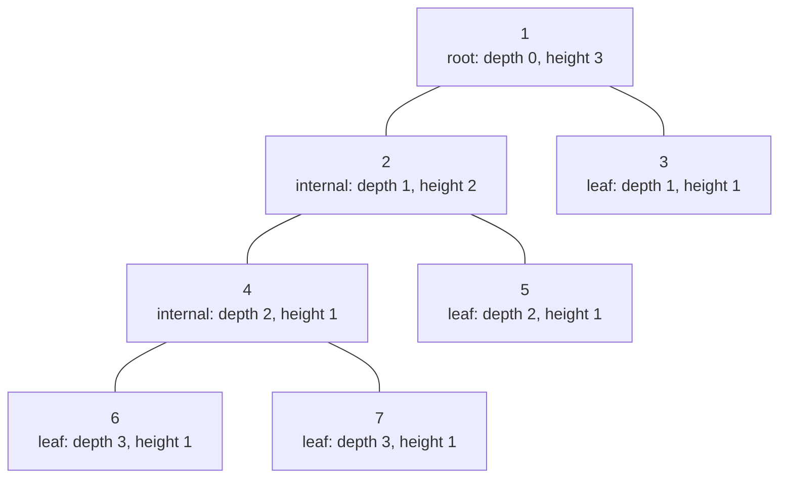
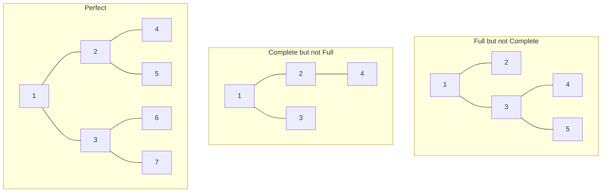
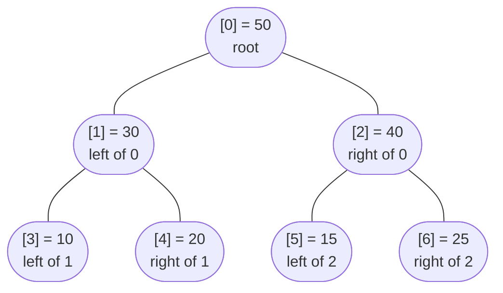

# Binary tree fundamentals

CLRS says the height of an empty tree is 0. Some AVL textbooks say it's -1. CMU's 15-121 lecture notes say height is "edges from a node to the deepest leaf"; OpenDSA says height is "number of levels." All four are correct in their own framing. Pick the wrong one halfway through your code and your `height(root)` for `[3, 9, 20, null, null, 15, 7]` returns 2 instead of 3, and you spend the rest of the interview convinced the bug is somewhere else.

Part 6 spends eleven chapters on trees and heaps. Every one of them assumes you know exactly what *height* means in this book. So this chapter pins the terminology, defines the two physical representations a binary tree can take, and sets up the one-paragraph recursion template every later chapter will lift and bend. Treat it as the glossary you come back to whenever a future chapter says *"see 6.0's definition of height."*

## What a binary tree is

A binary tree is either empty, or it's a node holding a value plus two binary trees called its left and right children. That is the entire structural definition. The recursion in the definition is not a teaching trick; it's the data structure. Whenever you see a binary-tree problem and reach for recursion, you're reaching for the shape that's already in the type.[^2]

A node with at least one child is **internal**. A node with no children is a **leaf**. The single node with no parent is the **root**.

The path from the root down to any node has a length, and that length is the node's **depth**. The longest path going the other direction, from a node down to the deepest descendant leaf, is the node's **height**. The tree's height is the height of its root.



*Tree of height 3. Node 1 is the root at depth 0; nodes 3, 5, 6, 7 are leaves; every node carries both a depth (distance down from root) and a height (distance down to its deepest descendant). Node 4's height is 1 because the longest root-to-leaf path inside its subtree has length 1.*

This book uses one convention everywhere: heights are measured in nodes-on-the-path, not edges. The empty tree has height 0. A leaf has height 1. The recurrence is `height(node) = 1 + max(height(left), height(right))` with `height(null) = 0`. This matches the LC 104 problem statement, CLRS §10.4, and OpenDSA Ch 7.2.[^1][^2] AVL chapters elsewhere on the internet often switch to height-in-edges (where the empty tree has height -1); we explicitly do not, except inside chapter 6.6 AVL trees, where the textbook proof shape needs it. When we get there, we'll annotate the convention switch.

### Three shape restrictions worth naming

Not every binary tree is the same. Three named shapes show up in algorithm proofs and in interview questions, and getting the definitions right matters because they aren't synonyms.

A **full** tree is one where every internal node has exactly two children. No node has just a left child or just a right child.

A **complete** tree is one where every level is filled left-to-right, with a possibly-incomplete bottom level that still fills from the left. This is the shape a binary heap maintains, and it's the reason heap operations can be expressed on a flat array.

A **perfect** tree is both full *and* complete, with all leaves at the same depth. A perfect tree of height `h` has exactly `2^h - 1` nodes.



*Three named shapes. Full means every internal node has two children. Complete means every level is filled left to right. Perfect is both. Full plus Complete does not imply Perfect; the middle tree above is Complete but not Full, and the leftmost is Full but not Complete.*[^9]

A tree is **balanced** in the LC sense (and the AVL sense) if every node's left and right subtree heights differ by at most 1. Balanced does not imply perfect; balanced does not imply complete. A balanced tree can have any of these shapes or none of them. The LC 110 problem is the canonical "is this tree balanced?" check.

## Two ways to store a tree in memory

The same logical tree can live in your program in two different physical representations. Picking the right one is the first design choice in any tree problem.

### Pointer-backed: nodes that hold pointers to nodes

The default for every problem this part covers except heaps. Each node is an object with a value and two pointers (or references) to its children. Missing children are null.

```python
@dataclass
class TreeNode:
    val: int = 0
    left: Optional["TreeNode"] = None
    right: Optional["TreeNode"] = None
```

In Java, `TreeNode` is a class with `int val`, `TreeNode left`, `TreeNode right`. In C++ it's a struct with raw pointers and explicit `nullptr`. In Go it's a struct with `*TreeNode` fields. LeetCode's tree problems all hand you a pointer-backed root; the level-order array in the prompt (`[3,9,20,null,null,15,7]`) is the input format the judge uses to serialize the tree, not the in-memory shape.[^8]

Pointer-backed wins when the tree is sparse, when nodes get inserted and deleted at runtime, and when traversal naturally follows the pointer structure. The cost is that each node carries a 16- or 24-byte pointer overhead on top of its payload, and the children sit wherever the allocator put them, which is usually nowhere near the parent in cache.

### Array-backed: nodes addressed by index arithmetic

When the tree is complete (every level filled left-to-right), the pointers are redundant. Number the nodes level-by-level starting at index 0 for the root. Then for any node at index `i`:

- the parent lives at index `(i - 1) / 2` (integer division)
- the left child lives at index `2*i + 1`
- the right child lives at index `2*i + 2`



*A complete tree stored in a flat array `[50, 30, 40, 10, 20, 15, 25]`. The pointers are computed, not stored: parent of index 4 is `(4-1)/2 = 1`, children of index 1 are `2*1+1 = 3` and `2*1+2 = 4`. CLRS §6.1 uses indices starting at 1 with `2*i` and `2*i+1`; modern code uses 0-indexing with `2*i+1` and `2*i+2`.*[^6]

Array-backed wins when the tree is dense and you only ever push to the next free slot or pop from the last filled slot. That's exactly the heap contract. Chapter 6.4 will use this representation in earnest. For everything else in Part 6 — BSTs, AVL trees, tries, segment trees — you want pointers, because their balance properties don't keep the tree complete.

## The post-order recursion template

Here's the shape that solves almost every binary-tree problem in Part 6. The signature problem is LC 110, *Balanced Binary Tree*: given a tree, return true if every node's left and right subtree heights differ by at most 1.[^3]

The naive instinct is to write `is_balanced(node)` directly: at each node, compute `height(left)`, compute `height(right)`, check the difference, recurse on both children. It works. It's also slower than it needs to be. Every node ends up paying for height computations of its descendants twice: once when the descendant is visited as a parent, once again when its ancestor recomputes the height through it.

The fix is to compute the height once, and to make the height function carry a second piece of information: a sentinel value meaning "stop, this subtree is unbalanced." Heights are non-negative, so `-1` is a value the natural domain can never produce. Return it from any subtree that fails the balance check, and let it propagate.

```python
def is_balanced(root):
    return height(root) != -1

def height(node):
    if node is None:
        return 0                              # base case: empty subtree
    lh = height(node.left)
    if lh == -1:
        return -1                             # short-circuit on imbalance
    rh = height(node.right)
    if rh == -1:
        return -1
    if abs(lh - rh) > 1:
        return -1                             # local check at this node
    return 1 + max(lh, rh)                    # canonical post-order combine
```

**Solution** — Python ([Java](./00-binary-tree-fundamentals/lc-110/sol.java) · [C++](./00-binary-tree-fundamentals/lc-110/sol.cpp) · [Go](./00-binary-tree-fundamentals/lc-110/sol.go))

```python
# LC 110. Balanced Binary Tree
"""LC 110 Balanced Binary Tree, height-or-sentinel post-order recursion."""

from dataclasses import dataclass
from typing import Optional


@dataclass
class TreeNode:
    val: int = 0
    left: Optional["TreeNode"] = None
    right: Optional["TreeNode"] = None


def is_balanced(root: Optional[TreeNode]) -> bool:
    """Return True iff every node's left/right subtree heights differ by <= 1."""

    def height(node: Optional[TreeNode]) -> int:
        # Returns subtree height, or -1 if any descendant is unbalanced.
        if node is None:
            return 0
        lh = height(node.left)
        if lh == -1:
            return -1
        rh = height(node.right)
        if rh == -1:
            return -1
        if abs(lh - rh) > 1:
            return -1
        return 1 + max(lh, rh)

    return height(root) != -1
```

Three properties make the template reusable. The base case `node is None` returns an identity value (`0`) so the parent's combine step has well-defined operands; without it, every recursion needs ad-hoc null-checks at the call site. The post-order ordering, left first then right then combine at the current node, is what lets the parent inspect both children's results before deciding anything; pre-order or in-order would not. And the sentinel collapses two return modes into one channel, which is the move you'll repeat in BST validation, AVL rebalance triggers, and tree DP.

### What changes for related problems

The same template, with one or two lines swapped, solves every other tree-recursion problem on the chapter ladder.

**LC 104, *Maximum Depth of Binary Tree***. Drop the sentinel; the recurrence is the height function with no abort condition.[^4]

```python
def max_depth(node):
    if node is None:
        return 0
    return 1 + max(max_depth(node.left), max_depth(node.right))
```

**LC 236, *Lowest Common Ancestor of a Binary Tree***. The return type changes from `int` to `TreeNode`. At each node, recurse into both subtrees; if both calls return non-null, this node is the LCA; otherwise propagate whichever side returned a non-null result.[^5]

```python
def lowest_common_ancestor(node, p, q):
    if node is None or node is p or node is q:
        return node
    left = lowest_common_ancestor(node.left, p, q)
    right = lowest_common_ancestor(node.right, p, q)
    if left and right:
        return node                           # both targets in different subtrees
    return left if left else right            # propagate the one we found
```

The decision at each node is exactly the same shape as the height-or-sentinel: post-order, combine at the parent. Only the carrier — what each call returns — has changed. Sentinel integers, node references, tuples of multiple facts, mutable globals threaded through the helper: every variant in the rest of Part 6 swaps the carrier and keeps the post-order spine.

## What it actually costs

| Variant | Time | Space | Notes |
|---|---|---|---|
| Optimal LC 110 (height-or-sentinel) | O(n) | O(h) | One visit per node; recursion stack bounded by tree height.[^1] |
| Naive LC 110 (recompute height per node) | O(n √n) worst | O(h) | Tighter than the commonly-cited O(n²).[^7] |
| LC 104 max depth | O(n) | O(h) | Pure post-order combine.[^4] |
| LC 236 LCA | O(n) | O(h) | Single tree walk; propagate found targets up.[^5] |
| Balanced tree height | h = ⌊log₂ n⌋ | — | Recursion stack stays logarithmic.[^6] |
| Skewed tree (left-only chain) | h = n - 1 | — | Recursion stack matches input depth; this is where Python trips.[^11] |

Two of those rows deserve a closer look.

### The naive solution is not O(n²)

Interview-prep editorials commonly report the naive height-twice solution as O(n²). It isn't. The early-exit `if abs(left - right) > 1: return False` short-circuits the second recursive call whenever one subtree has already failed, and the recursive structure forces the depths in subsequent calls to depend on each other. A community-vetted Stack Overflow analysis from February 2026 constructs the worst-case input shape (right subtrees as paths to a fixed depth) and proves the algorithm is O(n √n), tight.[^7] The proof reduces to: if `K` is the longest nested-left-recurse chain on the worst path and `N` is the total node count, then `N ≥ c₁ · K²` and total runtime is bounded by `c₂ · K · N ≤ c₂ · N · √(N/c₁)`.

This matters in the room. State the bound as O(n √n) when you walk an interviewer through the naive version, and follow with "but the optimal is O(n) using a sentinel return value." Every interviewer who knows the tight bound will notice; the ones who don't will at least learn something.

### Recursion depth on skewed inputs

LC 110's input cap is 5,000 nodes. CPython's default `sys.getrecursionlimit()` is 1,000.[^11] A balanced 5,000-node tree has height around 13 and recurses 13 levels deep, which is fine. A skewed 5,000-node left-leaning chain recurses 5,000 levels deep and raises `RecursionError`. The judge tests both shapes.

The fix is one line at the top of the Python solution:

```python
import sys
sys.setrecursionlimit(10**6)
```

Java, C++, and Go don't need this; their default thread stacks tolerate the depth. The handbook's project-wide policy is to set the limit once at module top-level for any Python solution that recurses on tree height. LC 110 itself is safe with or without the call only when the judge feeds you a balanced input; the moment you graduate to Morris traversal at 6.2 or tree DP at 9.13, the call is non-negotiable.

## Five places this trips people up

> [!WARNING]
> **Confusing depth with height.** Depth is measured from the root *down to* the node; height is measured from the node *down to* its deepest descendant. The two definitions point in opposite directions, and a recurrence that starts in one and finishes in the other produces off-by-one wrongness that's hard to debug. Pick height-from-the-node, base case `height(null) = 0`, and use it everywhere.[^1][^2]

> [!WARNING]
> **The `height(null) = -1` AVL convention.** Several textbooks define height as edge-count instead of node-count, which makes the empty tree height -1 instead of 0. Both are internally consistent. Mixing them inside one function, by copying a base case from one source and a recurrence from another, produces results that are silently off by one. The chapter on AVL trees switches conventions deliberately; until then, stick with height-in-nodes.[^10]

> [!WARNING]
> **Reporting the naive LC 110 as O(n²).** It's a loose upper bound. The tight worst-case is O(n √n), proven by constructing right-subtree-as-path inputs.[^7] State the looser bound only with the qualifier "loose"; otherwise an interviewer who knows the tighter result will catch the imprecision and lose confidence in the rest of your analysis.

> [!WARNING]
> **Forgetting `sys.setrecursionlimit` on Python tree problems.** A 5,000-node skewed input will hit the 1,000-frame default and raise `RecursionError`. Set the limit at module top-level, once. Don't put the call inside a method body; it's a process-wide setting and the placement signals you know that.[^11]

> [!WARNING]
> **Treating `null` placeholders as real nodes when reading LC's input format.** LeetCode serializes trees level-order with `null` for missing children; the array `[1,2,null,3]` is a root with a left child whose left child is 3, not a 4-node tree. A test driver that enqueues `null` markers as if they were real nodes builds the wrong tree and your algorithm spends the rest of the round failing on phantom inputs. Skip the `null` entries; do not advance the BFS queue for them.[^8]

## Problem ladder

### CORE (solve all three to claim chapter mastery)

- [LC 110 — Balanced Binary Tree](https://leetcode.com/problems/balanced-binary-tree/) [Easy] • tree-recursion-divide-and-conquer ★
- [LC 104 — Maximum Depth of Binary Tree](https://leetcode.com/problems/maximum-depth-of-binary-tree/) [Easy] • tree-recursion-divide-and-conquer
- [LC 236 — Lowest Common Ancestor of a Binary Tree](https://leetcode.com/problems/lowest-common-ancestor-of-a-binary-tree/) [Medium] • tree-recursion-with-combine-flags

### STRETCH (optional)

- [LC 543 — Diameter of Binary Tree](https://leetcode.com/problems/diameter-of-binary-tree/) [Easy] • tree-recursion-with-global-state
- [LC 100 — Same Tree](https://leetcode.com/problems/same-tree/) [Easy] • tree-recursion-on-two-trees

LC 543 and LC 100 are STRETCH because they extend the post-order template in two specific directions: LC 543 threads a mutable global through the height helper (the shape that scales up to LC 124 *Maximum Path Sum* in tree DP), and LC 100 walks two trees in lockstep (the shape that scales up to BST structural validation at chapter 6.5).

## Where this leads

The post-order template is the spine of Part 6. [Tree traversals](./01-tree-traversals.md) animates the recursion in motion and introduces the iterative-with-stack equivalents that Morris traversal then replaces with O(1) extra space. [Heaps](./04-heaps-priority-queues.md) reuses the array-backed representation introduced above; [BSTs](./05-binary-search-trees.md) uses the two-tree-lockstep shape from LC 100 to validate the BST ordering invariant; [AVL trees](./06-avl-rotations.md) lifts the height-or-sentinel idea from LC 110 to detect rebalancing triggers. The Hard generalizations live further out: LC 124 *Maximum Path Sum* belongs to [Tree DP](../part-9-dynamic-programming/13-tree-dp.md) and LC 297 *Serialize and Deserialize Binary Tree* belongs to the next chapter on traversals.

## References

[^1]: Cormen, Leiserson, Rivest, Stein, *Introduction to Algorithms*, 4th ed., MIT Press, 2022, Chapter 10 "Elementary Data Structures," §10.

[^2]: OpenDSA Project, *CS3 Data Structures and Algorithms*, Chapter 7.2 "Binary Trees: Definitions and Properties," <https://opendsa-server.cs.vt.edu/ODSA/Books/CS3/html/BinaryTree.html>.

[^3]: LeetCode 110, "Balanced Binary Tree," Easy. Constraints: number of nodes in [0, 5000], node values in [-10⁴, 10⁴]. <https://leetcode.com/problems/balanced-binary-tree/>.

[^4]: LeetCode 104, "Maximum Depth of Binary Tree," Easy. <https://leetcode.com/problems/maximum-depth-of-binary-tree/>.

[^5]: LeetCode 236, "Lowest Common Ancestor of a Binary Tree," Medium. <https://leetcode.com/problems/lowest-common-ancestor-of-a-binary-tree/>.

[^6]: Cormen, Leiserson, Rivest, Stein, *Introduction to Algorithms*, 4th ed., §6.1 "Heaps." Establishes the array-indexed binary-tree representation: PARENT(i) = ⌊i/2⌋, LEFT(i) = 2i, RIGHT(i) = 2i+1; exerc

[^7]: Stack Overflow Q79888747, "Is the brute-force solution for 'Is Binary Tree Balanced' really O(n^2) with early exit?" Accepted answer (Feb 2026, +50 bounty) constructs the worst-case input shape and proves the tight bound is O(n √n), not O(n²). <https://stackoverflow.com/questions/79888747/is-the-brute-force-balanced-binary-tree-solution-really-on2-with-early-exit>.

[^8]: LeetCode, level-order serialization with `null` placeholders for missing nodes. Convention summarized in every tree problem's Example 1.

[^9]: Alin Tomescu, "Complete vs. full vs. perfect binary trees," personal blog, Feb 2026, <https://alinush.github.io/binary-trees>.

[^10]: Wikipedia, "Self-balancing binary search tree," <https://en.wikipedia.org/wiki/Self-balancing_binary_search_tree>.

[^11]: Stack Overflow Q72359503, "Maximum recursion depth exceeded when finding the depth of binary-search-tree." Documents CPython's default 1,000-frame limit and the standard fix `sys.setrecursionlimit(...)`. <https://stackoverflow.com/questions/72359503/maximum-recursion-depth-exceeded-when-finding-the-depth-of-binary-search-tree>.
