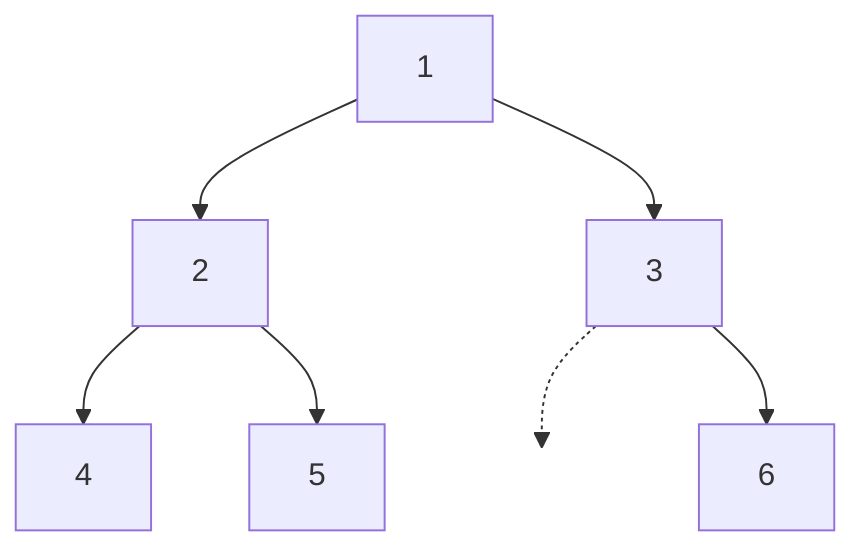
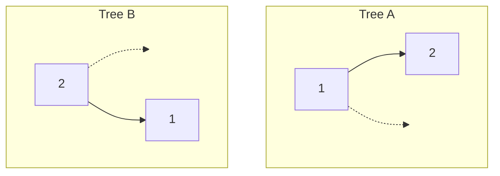

# Tree traversals: pre, in, post

Every binary-tree algorithm you'll ever write starts with the same five-line skeleton. Base case on null, recurse left, recurse right, and somewhere among those three lines, one call to `visit(node)`. The only question the algorithm answers is *where* that visit call sits.

Three positions, three names, three different tools for three different problems. Slide `visit` to the top and the algorithm hands you a root-to-leaf path on the way down. That's the right structure for tree copies, prefix expressions, and the LC 297 codec that round-trips an arbitrary binary tree through a string. Slide it to the middle and a binary-search tree's keys come out in sorted order, every time, no extra work. Slide it to the bottom and each node sees both children's results before it computes its own. That's the substrate every tree DP and every "subtree aggregate" problem is built on. The recursion itself is identical across all three. The line you write `visit` on is the algorithm.

## The five-line skeleton

A binary-tree depth-first traversal visits the root and the two subtrees in some order. Three orderings name themselves by where the root visit falls in the sequence: **pre**order is root, left, right; **in**order is left, root, right; **post**order is left, right, root.[^1] The recursive form makes the choice visible.

```python
def preorder(node):
    if node is None:
        return
    visit(node)              # root before subtrees
    preorder(node.left)
    preorder(node.right)


def inorder(node):
    if node is None:
        return
    inorder(node.left)
    visit(node)              # root between subtrees
    inorder(node.right)


def postorder(node):
    if node is None:
        return
    postorder(node.left)
    postorder(node.right)
    visit(node)              # root after subtrees
```

Same skeleton, three positions for one line. The recursion descends to the leftmost leaf in every case; what changes is when along that descent (or the unwinding) the node's value lands in the output.

That's what makes the three orderings answer three different questions. Preorder hands you each node *with* the path that led to it, because the parent emits before either child. Inorder hands you a sorted projection on a binary search tree, because for every subtree the algorithm emits the entire left half before the root and the entire right half after. Postorder hands you each node *after* both subtrees have been processed, which is the only way a node can see its children's computed results when its own turn arrives.

## The canonical tree

Every example in this chapter walks the same six-node tree, drawn here once and used everywhere:



*The chapter's worked tree. Preorder yields `[1, 2, 4, 5, 3, 6]`; inorder yields `[4, 2, 5, 1, 3, 6]`; postorder yields `[4, 5, 2, 6, 3, 1]`. Three orderings, three answers, one tree.*

Read the orderings against the diagram once and the pattern becomes obvious. In preorder, the parent value always appears earlier in the output than either of its children. In inorder, every node sits between everything in its left subtree and everything in its right subtree. In postorder, every parent appears later than both of its children.

## Inorder, in four languages

LC 94 (*Binary Tree Inorder Traversal*) is the chapter's canonical test target. The recursive form is five lines including the empty-tree base case.

```python
def inorderTraversal(root):
    out = []

    def dfs(n):
        if n is None:
            return
        dfs(n.left)
        out.append(n.val)              # visit
        dfs(n.right)

    dfs(root)
    return out
```

**Solution** — Python ([Java](./01-tree-traversals/lc-94/sol.java) · [C++](./01-tree-traversals/lc-94/sol.cpp) · [Go](./01-tree-traversals/lc-94/sol.go))

```python
# LC 94. Binary Tree Inorder Traversal
#   [1,null,2,3] -> [1,3,2], [] -> [], [1] -> [1], [1,2,3,4,5,null,6] -> [4,2,5,1,3,6]
#.
from typing import List, Optional


class TreeNode:
    def __init__(self, val=0, left=None, right=None):
        self.val, self.left, self.right = val, left, right


def inorderTraversal(root: Optional[TreeNode]) -> List[int]:
    """Recursive inorder. The five-line skeleton; visit on the middle line."""
    out: List[int] = []

    def dfs(n: Optional[TreeNode]) -> None:
        if n is None:
            return
        dfs(n.left)
        out.append(n.val)         # visit
        dfs(n.right)

    dfs(root)
    return out


def inorder_iterative(root: Optional[TreeNode]) -> List[int]:
    """Iterative inorder via explicit stack. Push left chain, pop, pivot right.
    Invariant: after every iteration, `cur` points to the next subtree to descend
    into; `stack` holds every node whose left subtree has been descended into
    but whose value has not yet been emitted.
    """
    out: List[int] = []
    stack, cur = [], root
    while cur is not None or stack:
        while cur is not None:
            stack.append(cur)
            cur = cur.left
        cur = stack.pop()
        out.append(cur.val)
        cur = cur.right            # pivot to right subtree
    return out


def preorder_iterative(root: Optional[TreeNode]) -> List[int]:
    """Iterative preorder. Push right BEFORE left so left pops next."""
    out: List[int] = []
    if root is None:
        return out
    stack = [root]
    while stack:
        n = stack.pop()
        out.append(n.val)
        if n.right is not None:
            stack.append(n.right)
        if n.left is not None:
            stack.append(n.left)
    return out


def postorder_iterative(root: Optional[TreeNode]) -> List[int]:
    """Iterative postorder via the two-stack / reverse trick: build root,right,left
    then reverse to left,right,root.
    """
    out: List[int] = []
    if root is None:
        return out
    stack = [root]
    while stack:
        n = stack.pop()
        out.append(n.val)
        if n.left is not None:
            stack.append(n.left)
        if n.right is not None:
            stack.append(n.right)
    out.reverse()
    return out
```

The recursive version is the easy one. The interviewer's follow-up, *can you do it without recursion?*, is in the LC 94 official editorial because real interviewers ask it.[^2] The iterative inorder template is structurally the same shape that Morris traversal eliminates and that BST iterators (LC 173) turn into a stateful `next()` / `hasNext()` pair. It's worth its own section.

### Iterative inorder via explicit stack

The recursive form uses the language's call stack as the data structure. Take that away and you're left holding the stack yourself. Three pieces of state replace the recursion's frames:

- A `stack` of nodes whose left subtrees have been descended into but whose values have not yet been emitted.
- A pointer `cur` to the next subtree the algorithm should descend into.
- The output list.

The algorithm has two interlocked loops. The inner loop walks the entire left chain from `cur`, pushing each node onto the stack as it goes. When that chain bottoms out, the outer loop pops the top of the stack, emits its value, and pivots `cur` to that node's right subtree. Then the inner loop runs again, walking the left chain of *that* subtree.

```python
def inorder_iterative(root):
    out, stack, cur = [], [], root
    while cur is not None or stack:
        while cur is not None:
            stack.append(cur)
            cur = cur.left
        cur = stack.pop()
        out.append(cur.val)
        cur = cur.right                # pivot to right subtree
```

The invariant is short and worth memorizing: *after every iteration of the outer loop, `cur` points to the next subtree to descend into; `stack` holds every ancestor whose left subtree has been fully processed but whose own value has not yet been emitted.*[^3] When `cur` is null and the stack is empty, every left chain has been descended and every recorded ancestor has been emitted, so there is nothing left to do.

> [!IMPORTANT]
> The pivot step is `cur = cur.right`, not `cur = None`. Forget the assignment and the algorithm visits the leftmost spine, exits the outer loop after the last pop (because `cur` stays null and the stack empties), and never explores any right subtree. The output is the left spine of the tree and nothing else. This is by far the most common iterative-inorder bug.

Iterative preorder and postorder are both shorter than iterative inorder because neither needs the left-chain descent. Preorder seeds the stack with `[root]`, then on each pop emits the node and pushes its children: right child first, then left, because stacks are LIFO and the second push lands on top. Postorder is the same loop with the children pushed in the opposite order, then the whole output reversed at the end. The reverse trick produces a `root, right, left` walk and reverses to `left, right, root`, which is postorder. Both fit in eight lines and both reuse the explicit-stack mechanic without the descent-and-pivot dance.

## What it actually costs

Every node is visited exactly once and the body of the visit does O(1) work, which gives Θ(n) total time for any of the six variants. The space cost is the maximum depth of either the call stack (recursive forms) or the explicit stack (iterative forms), and both equal the height `h` of the tree on every step.

| Variant | Time | Space | When the bound bites |
|---|---|---|---|
| Recursive pre/in/postorder | Θ(n) | Θ(h) call stack | h = log n if balanced; h = n − 1 if degenerate |
| Iterative pre/in/postorder | Θ(n) | Θ(h) explicit stack | same chain on the stack as recursive |
| Morris inorder (chapter 6.2) | Θ(n) | Θ(1) auxiliary | the only Θ(1) variant |

The `h` matters, not `log n`. CLRS proves the time bound by induction on subtree size: T(n) covers the left subtree, the root's O(1) work, and the right subtree, with T(0) = Θ(1); summing gives Θ(n).[^4] The space bound matches the maximum recursion depth, which is the depth of the deepest root-to-leaf path. For a balanced tree that's Θ(log n). For a tree skewed entirely left or entirely right, where every parent has only one child, the depth is `n − 1`, and the recursion's call stack is the same `n − 1` frames whether you wrote it recursively or with an explicit stack.

The LC tree-traversal problems all state `n <= 10^4`. Python's default recursion limit is 1000, so a fully right-skewed input on those problems will overflow before the recursion finishes. The fix is to call `sys.setrecursionlimit(10**5)` at the top, or to use the iterative form, which doesn't share the C call stack and so doesn't trip the same limit. Java and C++ default to thread stacks large enough for `n = 10^4` recursion depth at typical frame sizes, but on adversarial inputs the iterative form is still safer.

## Worked example: LC 297, serialize and deserialize a binary tree

LC 297 (*Serialize and Deserialize Binary Tree*) is the hard application that makes the choice of ordering load-bearing. The problem asks you to encode a binary tree as a string and then reconstruct *the same tree*, both same values and same shape, from that string.

Your first instinct might be: emit the inorder traversal as the string. The values come out in a clean order, the encoding is short. Run that on two different trees:



Both produce the inorder string `2, 1`. One is a left-only chain rooted at 1; the other is a right-only chain rooted at 2. The encoding has lost the structural information that distinguishes them. Pre, in, and post all suffer the same collision: without the null children explicit in the encoding, distinct trees can produce identical traversal strings.[^5]

The fix is preorder *with null markers*. Emit a sentinel token (`"#"` works) for every null child slot. The encoding now describes every position in the tree, not just the values, and the structural information survives the round-trip.

```python
class Codec:
    NULL = "#"

    def serialize(self, root):
        out = []

        def dfs(n):
            if n is None:
                out.append(self.NULL)
                return
            out.append(str(n.val))             # visit (preorder)
            dfs(n.left)
            dfs(n.right)

        dfs(root)
        return ",".join(out)

    def deserialize(self, data):
        tokens = iter(data.split(","))

        def build():
            tok = next(tokens)
            if tok == self.NULL:
                return None
            node = TreeNode(int(tok))
            node.left = build()
            node.right = build()
            return node

        return build()
```

**Solution** — Python ([Java](./01-tree-traversals/lc-297/sol.java) · [C++](./01-tree-traversals/lc-297/sol.cpp) · [Go](./01-tree-traversals/lc-297/sol.go))

```python
# LC 297. Serialize and Deserialize Binary Tree
# Codec: preorder DFS + "#" sentinel for null children; round-trip is a same-shaped
# preorder DFS reading from an iterator over the tokens.
from typing import Optional


class TreeNode:
    def __init__(self, val=0, left=None, right=None):
        self.val, self.left, self.right = val, left, right


class Codec:
    NULL = "#"
    SEP = ","

    def serialize(self, root: Optional[TreeNode]) -> str:
        """Preorder DFS; emit value or NULL token for each slot."""
        out: list[str] = []

        def dfs(n: Optional[TreeNode]) -> None:
            if n is None:
                out.append(self.NULL)
                return
            out.append(str(n.val))               # visit (preorder)
            dfs(n.left)
            dfs(n.right)

        dfs(root)
        return self.SEP.join(out)

    def deserialize(self, data: str) -> Optional[TreeNode]:
        """Same preorder shape; consume one token per slot."""
        tokens = iter(data.split(self.SEP))

        def build() -> Optional[TreeNode]:
            tok = next(tokens)
            if tok == self.NULL:
                return None
            node = TreeNode(int(tok))
            node.left = build()
            node.right = build()
            return node

        return build()
```

Serialize and deserialize are the same recursion read in two directions. Serialize emits a token for each slot, value or `"#"`, and recurses into the children in preorder. Deserialize reads tokens in the same order, builds a node from a value token, and recursively builds the left and right subtrees from the next tokens in the stream. The `"#"` sentinel is what lets deserialize distinguish "this slot has a child" from "this slot is empty"; without it, the iterator can't tell whether the next token belongs to the current node's left subtree or its right.

On the canonical six-node tree, serialize produces `1,2,4,#,#,5,#,#,3,#,6,#,#`. Thirteen tokens, six values, seven nulls. Deserialize reads `1`, builds a node, recurses left, reads `2`, builds, recurses left, reads `4`, builds, recurses left, reads `#`, returns null, recurses right from 4, reads `#`, returns null. The recursion now unwinds back to 4 and returns 4 to its parent (2), which recurses right, and the same shape repeats on 5. The structure round-trips.

## The widget

> **Interactive widget:** [Tree traversal animator (DFS pre/in/post + BFS level-order)](../widgets/w-16-tree-traversal-animator.yml) (panel `panel-a`) — rendered on the website; the YAML spec describes the keyframes.

*Static fallback: the canonical n = 6 tree with three sequential phases. Phase 1 (preorder) emits `[1, 2, 4, 5, 3, 6]`; root before subtrees, top-down. Phase 2 (inorder) emits `[4, 2, 5, 1, 3, 6]`; left subtree, root, right subtree, which is the BST sorted-projection shape. Phase 3 (postorder) emits `[4, 5, 2, 6, 3, 1]`; both subtrees, then root, with the root visited last. The recursion-stack column rises and falls with the descent depth in every phase.*

## Variants worth knowing

A small number of patterns extend the basic three orderings into the problems most interviewers actually ask.

### Building a tree from two of its traversals

Give an algorithm preorder + inorder, or inorder + postorder, and it can rebuild the original tree. LC 105 (preorder + inorder) and LC 106 (inorder + postorder) are the two canonical instances. Both algorithms read one traversal for the *root identity* (preorder[0] or postorder[−1] is always the current subtree's root) and the other, inorder, for the *split index*, which says how many of the remaining nodes belong to the left subtree versus the right.

The naive implementation does a linear scan of the inorder array on every recursive call to find the split index. With n recursive calls each scanning O(n) entries, that's O(n²) total, borderline TLE on LC 105's stated `n <= 3000`. The standard optimization is to precompute a `value -> inorder index` hash map once before the recursion, turning the lookup from O(n) into O(1) and the algorithm overall into O(n).

> [!WARNING]
> The hash-map optimization assumes node values are unique. If duplicates are possible, a `value -> index` map can't disambiguate which occurrence is the current root, and you fall back to the O(n²) linear scan or to a different invariant entirely. LC 105's constraint section explicitly states "all values are unique"; the constraint exists so the optimization works.

### Preorder + postorder is *not* enough

It's tempting to think any two of the three orderings can rebuild the tree. They can't, in general. Preorder + postorder pin the root identity (preorder[0] = postorder[−1] = root) but provide no left/right split index, so for any node with only one child, the same (preorder, postorder) pair describes both "child is left" and "child is right." The two valid pairs are preorder + inorder (LC 105) and inorder + postorder (LC 106). Inorder is load-bearing in both because it's the one ordering that linearly partitions the left and right subtrees.

The exception is full binary trees, where every internal node has 0 or 2 children. Under that constraint preorder + postorder *is* sufficient, which is exactly the framing of LC 889. It's a real problem, not a contradiction; the constraint does the work.

### Iterative pre and post via the explicit stack

Iterative preorder and postorder both reuse the explicit-stack mechanic from §"Iterative inorder" without the descent-and-pivot. The Python files in `lc-94/sol.py` carry both, including the two-stack / reverse trick for postorder; the same shape is in the Java, C++, and Go siblings. The reason to learn them is operational: in any language with a small default recursion limit (Python at 1000) or in an interview where the interviewer asks for the iterative form, you want all three iterative idioms ready in your fingers.

## Pitfalls that bite

> [!WARNING]
> **Pushing left before right in iterative preorder.** Stacks are LIFO. If you push `n.left` first and then `n.right`, the next pop is `n.right`, and the output comes out as root, right, left, which is the reverse of what you wanted. To get root, left, right out of a LIFO stack, push right first so left lands on top.[^6]

> [!WARNING]
> **Forgetting the null markers in LC 297's encoding.** A serialize that emits values for non-null nodes and skips nulls entirely loses the structural information that distinguishes a left-only chain from a right-only chain. The deserialize round-trips a tree with the right values but the wrong shape, and the bug is silent until the test harness compares structure rather than values. Emit a sentinel for every null slot.

A third pitfall worth a sentence: a recursive helper that returns a fresh list from each call and concatenates at every level is O(n²), because each level's concat does O(n) work. Thread one output list through the recursion as a parameter and append to it; the canonical implementations in `lc-94/sol.{py,java,cpp,go}` all follow this pattern.

## Problem ladder

### CORE (solve all three to claim chapter mastery)

- [LC 94 — Binary Tree Inorder Traversal](https://leetcode.com/problems/binary-tree-inorder-traversal/) [Easy] • dfs-inorder-recursive-and-iterative
- [LC 105 — Construct Binary Tree from Preorder and Inorder Traversal](https://leetcode.com/problems/construct-binary-tree-from-preorder-and-inorder-traversal/) [Medium] • preorder-driven-tree-construction-with-inorder-index ★
- [LC 297 — Serialize and Deserialize Binary Tree](https://leetcode.com/problems/serialize-and-deserialize-binary-tree/) [Hard] • preorder-with-null-markers

### STRETCH (optional)

- [LC 144 — Binary Tree Preorder Traversal](https://leetcode.com/problems/binary-tree-preorder-traversal/) [Easy] • dfs-preorder-recursive-and-iterative
- [LC 145 — Binary Tree Postorder Traversal](https://leetcode.com/problems/binary-tree-postorder-traversal/) [Easy] • dfs-postorder-iterative-two-stack-or-reverse
- [LC 106 — Construct Binary Tree from Inorder and Postorder Traversal](https://leetcode.com/problems/construct-binary-tree-from-inorder-and-postorder-traversal/) [Medium] • postorder-driven-tree-construction-with-inorder-index

LC 105 is the chapter's signature problem (★) because it's the one that forces you to state explicitly what each ordering encodes and use that statement to rebuild a tree. LC 94 anchors the iterative-with-stack template; LC 297 puts preorder into a serialization role and shows why null markers are load-bearing.

## Where this leads

The same three-line skeleton comes back, with one small addition, all over the rest of Part 6. The recursion shape stays identical; only the line that does the work changes.

Morris traversal turns the iterative-inorder template from this chapter into a Θ(1) auxiliary-space algorithm by temporarily rewriting null right-child pointers to thread the tree, then restoring them on the way back. The descent-and-pivot mechanic is the same; the explicit stack is gone, replaced by the threaded pointers themselves. That's the next chapter, on the same widget shell as this one.

Level-order BFS replaces the call stack with an explicit queue and visits the tree depth-by-depth instead of left-spine-first. Same canonical tree, different control-flow shape; the widget's panel-b animates the comparison directly. Trees that ask for shortest paths, right-side views, or zig-zag-by-depth output all live in the BFS family.

When the same prefix-sum-plus-hash trick from [The prefix-sum + hash-map combo](../part-3-pointers-window-prefix/05-prefix-sum-hash.md) is applied to a tree, "running prefix" becomes "sum from root to current node," maintained on a DFS stack with a hash of all root-to-here sums. LC 437 (Path Sum III) is the tree analogue of LC 560, with the same `{0: 1}` seed for the empty path and an additional bookkeeping step to remove the current node's contribution from the hash on the recursion's way back up. The recursion is preorder; the cleanup is postorder; the chapter is one and the same.

## References

[^1]: Cormen, Leiserson, Rivest, Stein. *Introduction to Algorithms*, 4th ed., MIT Press, 2022.

[^2]: LeetCode official editorial for LC 94 *Binary Tree Inorder Traversal*, Approach 2 ("Iterating method using Stack").

[^3]: CLRS 4th ed. §12.1 Exercise 12.1-3, non-recursive Inorder-Tree-Walk via an explicit stack. The source of the descent-and-pivot pseudocode reproduced in `lc-94/sol.py` and its siblings.

[^4]: CLRS 4th ed.

[^5]: algomaster.io, *Serialize and Deserialize Binary Tree*: "if we record null markers (like 'null' or '#') during traversal, we capture the complete structure. A preorder traversal with null markers uniquely defines a binary tree." <https://algomaster.io/learn/dsa/serialize-and-deserialize-binary-tree>.

[^6]: simplyleet.com, *LeetCode 144 Binary Tree Preorder Traversal*, on the iterative form: "When using a stack, push the right child first so that left is processed before right." <https://www.simplyleet.com/binary-tree-preorder-traversal>.
