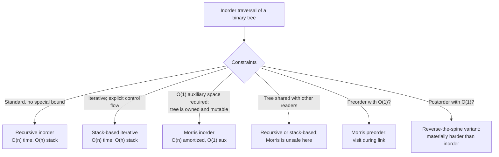

# Morris traversal: O(1)-space inorder by threading

In 1979, J. M. Morris published a two-page paper in *Information Processing Letters* that did something that should have been impossible: it walked every node of a binary tree, in inorder, with no recursion stack, no explicit stack, no queue, no parent pointers, and exactly two pointer-sized scratch variables. The paper was an answer to a question Knuth had posed in *The Art of Computer Programming*: can you traverse a binary tree without auxiliary memory? Morris said yes, and the trick is to mutate the tree on the way down and clean up on the way back.

The trick has a name. It's called *threading*: install temporary right-pointers from each subtree's rightmost descendant back to the current node, walk the tree using those threads as return paths, and tear each thread down on the second visit.[^1] Every edge is touched a bounded number of times. Total cost: O(n) time, O(1) auxiliary space, the input tree bit-for-bit identical at the start and end of the call.[^2]

## Why O(h) on the call stack is the wrong answer for some interviewers

[Tree traversals: pre/in/post, recursive vs iterative](./01-tree-traversals.md) gave you the canonical inorder. The recursive form leans on the call stack; the iterative form leans on an explicit stack. Both are O(h) auxiliary space, where h is the tree's height. For a balanced tree, h is roughly log n and nobody cares. For a degenerate tree skewed all the way left or all the way right, h is n, and recursive inorder blows Python's default recursion limit at depth 1,000.[^3]

The classic problem here is LC 99, *Recover Binary Search Tree*. Two nodes in a BST have been swapped; restore the BST without changing the tree's structure. The standard inorder solution is short: walk the tree in inorder, watch for any moment when the current value drops below the previous value, capture the witnesses, swap them at the end. Two violations may appear instead of one when the swapped pair is non-adjacent.[^4]

The follow-up the problem statement explicitly asks for is "can you do this in O(1) space?" The recursive O(h) version answers no. So does the explicit-stack version. The only canonical algorithm that answers yes is Morris.

## Why the obvious O(h) approach is what we're replacing

The recursive baseline does what every reader has written a hundred times.

```python
# Baseline: recursive inorder, O(n) time and O(h) auxiliary space.
def inorder_recursive(root, out):
    if root is None:
        return
    inorder_recursive(root.left, out)
    out.append(root.val)
    inorder_recursive(root.right, out)
```

Correct on every input. The O(h) cost is invisible in the source and very visible in production, where a left-skewed tree of 50,000 nodes (constructible in interview puzzles, common in real malformed trees) collides with the call-stack default and the program crashes before the algorithm is wrong. The iterative form pushes the same O(h) into an explicit `list` of `TreeNode` references; the cost is the same, just in heap memory instead of stack memory.

The fix needs to record "where do I return after the left subtree" without using O(h) memory. That sounds impossible. The whole point of the call stack is to remember exactly that. The way out is to write the answer down inside the tree itself, in a pointer field that's currently null and that you'll restore before the function returns.

## The reduction: thread the tree, then clean up

Pick any node `curr` whose left subtree is non-empty. The inorder predecessor of `curr` is the rightmost node in that left subtree. Call it `pred`. By definition `pred.right` is null, because if `pred` had a right child, that child would itself be further right and `pred` wouldn't be rightmost.

That null right-pointer is free real estate. Use it to write down where to come back to:

```text
pred.right = curr
```

Now descend left. The algorithm walks the entire left subtree without remembering anything else, because when it eventually reaches `pred` and tries to step right, `pred.right` no longer leads off into space — it leads back to `curr`. The thread is the return address.

When `curr` is reached the second time, by the thread, the algorithm knows it's the second visit because the inner predecessor walk lands on a node whose `right` already points back to `curr`. That's the unmistakable signature: `pred.right == curr` means "I have been here before, the left subtree is finished, please tear down the thread and visit me." Restore `pred.right = null`, output `curr.val`, step right.

Two cases per outer iteration. If `curr.left` is null, there's no left subtree to handle; visit `curr` and step right. Otherwise find the predecessor and either install or remove a thread. That's the entire algorithm.

## The pattern

```python
def morris_inorder(root):
    out = []
    curr = root
    while curr is not None:
        if curr.left is None:
            out.append(curr.val)
            curr = curr.right
        else:
            # Find inorder predecessor: rightmost in curr's left subtree.
            pred = curr.left
            while pred.right is not None and pred.right is not curr:
                pred = pred.right
            if pred.right is None:
                pred.right = curr        # install thread, descend left
                curr = curr.left
            else:
                pred.right = None        # tear down thread before visit
                out.append(curr.val)
                curr = curr.right
    return out
```

Two lines deserve attention before the worked example.

The first is the inner loop's guard: `while pred.right is not None and pred.right is not curr`. Drop the second clause and the predecessor walk falls into a loop the moment a thread exists. It follows the thread back to `curr`, then descends right from `curr` (which is now `pred.right`), and the walk never terminates. The community-curated bug list on LeetCode discuss puts the missing `pred.right != curr` guard at the top of reported issues for this algorithm.[^5]

The second is the order inside the unlink branch: tear down `pred.right` *before* calling visit, not after. The output is the same either way, because the iteration is single-threaded. The reason it has to be unlink-first is the contract Morris's paper makes about tree state: any external observer that interrupts the algorithm sees a tree whose structure is restored at every transition between iterations. A debugger frame, a logging callback, a panic handler, all of them. Visit-then-unlink leaves the tree in a threaded state at the visit moment, which breaks the "tree appears unchanged outside the call" guarantee that justifies Morris in production code.[^1]

> [!IMPORTANT]
> The tree is mutated during the traversal. Read-only callers must clone before calling Morris, accept that the tree is restored only when the function returns, or use the recursive O(h) form. Pfaff's libavl notes call this out explicitly: Morris is for single-threaded use on trees the algorithm fully owns during the call.[^6] If another thread can read the tree mid-traversal, it sees a *threaded* tree where some nominally-empty right pointers point at ancestors, and any iterator that assumes standard binary-tree shape will diverge.

## Worked example: the canonical 7-node BST

The tree:

```text
        4
       / \
      2   6
     / \   \
    1   3   7
```

Inorder is `[1, 2, 3, 4, 6, 7]`. Six nodes, two of which (the 2 and the 4) have left subtrees and will exhibit the full link-then-unlink dance.

The first iteration starts with `curr` at the root (4). Left subtree is non-empty, so the algorithm walks the right-spine of that subtree: 2 → 3. Node 3's right pointer is null, so install thread `3.right = 4` and descend left. `curr` is now 2.

Node 2 has a left subtree. Predecessor walk lands on 1 (rightmost; `1.right` is null). Install thread `1.right = 2` and descend left. `curr` is now 1.

Node 1 has no left subtree. Visit: output 1. Step right via the thread back to 2. The thread paid for itself.

Now the second visit to 2. The predecessor walk runs again. It finds `1.right = 2` (the thread we installed). Tear it down. Visit: output 2. Step right to 3.

Node 3 has no left subtree. Visit: output 3. Step right via the thread back to 4.

Second visit to 4. Predecessor walk lands on 3 with `3.right = 4` (the thread from the very first iteration). Tear it down. Visit: output 4. Step right to 6.

The right subtree (6, 7) has no left children at any point, so the algorithm degenerates to a right-walk: visit 6, step right to 7, visit 7, step right to null. Loop exits. Output: `[1, 2, 3, 4, 6, 7]`.

Both threads installed during the walk are gone by the time the function returns. The tree at the end is bit-for-bit identical to the tree at the start.

> **Interactive widget:** [Morris inorder traversal (threading)](../widgets/w-17-morris-thread.yml) — rendered on the website; the YAML spec describes the keyframes.

*Static fallback: at step 0 the tree is intact and the output buffer is empty. At step 5, two threads coexist (1 → 2 and 3 → 4), the algorithm has descended to node 1 but not yet visited it. At step 14, the 1 → 2 thread has been torn down and the algorithm has just returned to node 4 via the surviving 3 → 4 thread. At step 23, every thread is gone and the output reads `[1, 2, 3, 4, 6, 7]`.*

## Where this pattern fits in the broader traversal family



*Three branches lead to Morris: O(1) auxiliary space, ownership of the tree for the duration of the call, and inorder or preorder semantics. Postorder is the genuinely hard sibling.*

## What it actually costs

| Variant | Time | Space | Notes |
|---|---|---|---|
| Best case | O(n) | O(1) | one outer pass; `pred` walks bounded edges total |
| Average | O(n) | O(1) | Morris 1979 §3 analysis[^1] |
| Worst case | O(n) amortized | O(1) | left-skewed tree; argument below |
| Recursive baseline | O(n) | O(h) | call stack; O(n) on a degenerate tree |

The space bound is by construction. Two pointer-sized variables, `curr` and the inner-loop walker `pred`, plus the right-pointer fields that the algorithm temporarily writes into and then restores. No stack frame, no auxiliary array, nothing that grows with n.

The time bound is amortized, not pointwise, and the proof matters because the natural pointwise reading is wrong.

*Edge-counting argument.* The inner predecessor walk descends along the right-spine of `curr`'s left subtree, which on a left-skewed tree is Θ(h). A casual reading "n iterations × O(h) inner work" suggests O(n h), and on a left-skewed tree where h is n that would be O(n²). The actual O(n) bound comes from charging each edge in the tree a bounded constant number of visits across the entire traversal. Each tree edge is touched at most three times: once when the outer loop steps along it, once when the inner predecessor walk traces it during thread installation, once when the inner walk traces it again during thread teardown. The Stack Overflow community refined Morris's original analysis to exactly this bound: at most 3n edge visits across the entire walk, total O(n).[^7] Once a thread is torn down, the edges along that walk are never re-encountered, because `curr` has moved into its right subtree and never returns to its left.

## When the pattern bends

Three named variants live next door to the canonical algorithm. One of them is genuinely harder than the others; the chapter is honest about which.

### Morris preorder: move the visit, keep the threads

Preorder visits each node *before* its subtrees. The skeleton is identical to Morris inorder; the only change is *when* `out.append(curr.val)` runs. In preorder, the visit happens during the link phase — just before descending left — because that's the moment `curr` is first met. The unlink phase no longer visits; its only job is to undo the thread.[^8] Same complexity, same correctness argument, one line moved.

### Reverse Morris: descending order on a BST

Swap left and right throughout the algorithm. `pred` becomes the leftmost node of `curr`'s right subtree (the inorder *successor*); threads point from left children of subtree-leftmost nodes back up to `curr`. The output is the reverse-inorder sequence: a BST iterated from largest to smallest, in O(1) auxiliary space.[^9] Symmetric proof, identical bounds.

### Morris postorder is materially harder

Postorder visits each node *after* both subtrees. Neither the link phase (before descending left) nor the unlink phase (after the left subtree but before the right) is the right moment to visit. The seductive analogy "Morris preorder moved the visit one way, postorder must move it the other way" produces a wrong algorithm. What you get out is reverse-preorder (Node → Right → Left), not postorder (Left → Right → Node).

The standard online tutorials punt by describing a Morris-preorder of the *mirrored* tree, collecting the visits into an array, and reversing the array at the end. That's correct but defeats the O(1) goal: the array is O(n).[^10] The genuinely O(1) Morris-postorder requires reversing a path of right-pointers in place after exiting each left subtree, the "reverse the spine" technique, which is intricate enough that competitive-programming references treat it as a separate algorithm.[^11] If an interviewer insists on O(1) postorder, the spine-reversal variant is the answer; most accept O(h) explicit-stack postorder as a reasonable compromise.

## Two pitfalls that bite

> [!WARNING]
> **Forgetting the `pred.right != curr` guard.** Without the second clause in the inner loop's condition, the predecessor walk follows the thread back to `curr`, then descends right from `curr` (which is now `pred.right`), and the walk never terminates. The natural way to write "find the rightmost" is `while pred.right is not None: pred = pred.right`, and the natural way is the bug. The guard `while pred.right is not None and pred.right is not curr` stops the walk both at "no thread" (first visit) and at "thread already points back to me" (second visit). Top of the LeetCode discuss bug list for this algorithm.[^5]

> [!WARNING]
> **Visiting before tearing down the thread.** Inside the unlink branch, run `pred.right = None` first, then `out.append(curr.val)`. The output is identical either way for single-threaded use, but the order matters for the contract Morris promises: the tree's structure must look unchanged at every transition between iterations. Visit-then-unlink leaves the tree in a threaded state at the moment external observers (a debugger frame, a logging callback, a panic handler) might inspect it. If you ever plan to extend Morris to a setting where "the tree is unchanged" is a literal claim and not just an end-state claim, the unlink-first order is what makes that claim hold.

A third pitfall worth flagging briefly. On LC 99, the "two violations" pattern is non-obvious. Adjacent-swap test cases produce only one inorder violation; non-adjacent swaps produce two. Code that returns after the first violation passes the easy LC examples and fails the hidden tests. The fix is to capture `first` once on the first violation, then keep updating `second = curr` on every subsequent violation, and finally swap their values. The full LC 99 implementation in the panel below carries this pattern.

## LC 99 with Morris layered on top

```python
def recover_tree(root):
    """Recover a BST in which exactly two nodes are swapped, in O(1) space."""
    first = second = prev = None
    curr = root
    while curr is not None:
        if curr.left is None:
            if prev is not None and curr.val < prev.val:
                if first is None:
                    first = prev
                second = curr
            prev = curr
            curr = curr.right
        else:
            pred = curr.left
            while pred.right is not None and pred.right is not curr:
                pred = pred.right
            if pred.right is None:
                pred.right = curr
                curr = curr.left
            else:
                pred.right = None
                if prev is not None and curr.val < prev.val:
                    if first is None:
                        first = prev
                    second = curr
                prev = curr
                curr = curr.right
    if first is not None and second is not None:
        first.val, second.val = second.val, first.val
```

**Solution** — Python ([Java](./02-morris-traversal/lc-99/sol.java) · [C++](./02-morris-traversal/lc-99/sol.cpp) · [Go](./02-morris-traversal/lc-99/sol.go))

```python
# LC 99. Recover Binary Search Tree

from typing import Optional


class TreeNode:
    __slots__ = ("val", "left", "right")

    def __init__(
        self,
        val: int = 0,
        left: "Optional[TreeNode]" = None,
        right: "Optional[TreeNode]" = None,
    ) -> None:
        self.val = val
        self.left = left
        self.right = right


class Solution:
    def recoverTree(self, root: Optional[TreeNode]) -> None:
        """Recover a BST in which exactly two nodes are swapped, in O(1) space.

        Reference: J. M. Morris, 'Traversing binary trees simply and cheaply',
        Information Processing Letters 9(5):197-200, 1979.

        Layers the LC 99 'two witnesses' pattern on top of Morris inorder:
        track prev across the visit step; capture first on the first
        violation; keep updating second on every violation; swap at the end.
        """
        first: Optional[TreeNode] = None
        second: Optional[TreeNode] = None
        prev: Optional[TreeNode] = None

        curr = root
        while curr is not None:
            if curr.left is None:
                # Visit step.
                if prev is not None and curr.val < prev.val:
                    if first is None:
                        first = prev
                    second = curr
                prev = curr
                curr = curr.right
            else:
                # Find inorder predecessor: rightmost in curr's left subtree.
                pred = curr.left
                while pred.right is not None and pred.right is not curr:
                    pred = pred.right

                if pred.right is None:
                    pred.right = curr            # install thread, descend left
                    curr = curr.left
                else:
                    pred.right = None            # tear down thread before visit
                    if prev is not None and curr.val < prev.val:
                        if first is None:
                            first = prev
                        second = curr
                    prev = curr
                    curr = curr.right

        if first is not None and second is not None:
            first.val, second.val = second.val, first.val
```

The structure of `recover_tree` is the structure of `morris_inorder` with one addition: a `prev` pointer carried across the visit step, and the violation-capture logic that runs at every visit point — both in the `curr.left is None` branch and after the unlink in the second-visit branch. The two visit sites must each run the violation check, because both correspond to "we are about to emit `curr.val` as the next inorder value."

## Problem ladder

### CORE (solve both to claim chapter mastery)

- [LC 99 — Recover Binary Search Tree](https://leetcode.com/problems/recover-binary-search-tree/) [Medium] • morris-inorder-with-state ★
- [LC 1305 — All Elements in Two Binary Search Trees](https://leetcode.com/problems/all-elements-in-two-binary-search-trees/) [Medium] • morris-inorder-streaming-merge

### STRETCH (optional)

- [LC 285 — Inorder Successor in BST](https://leetcode.com/problems/inorder-successor-in-bst/) [Medium] • morris-inorder-with-state *(LC Premium; free alternative is LC 1305 in CORE)*

LC 99 is the chapter's signature problem (★) and the canonical Morris-only application: the problem statement explicitly calls out O(1) space as a follow-up bonus, which is exactly the bound Morris exists to deliver. LC 1305 is the cleanest exercise of two Morris cursors running concurrently with a streaming merge, taking auxiliary space from O(n₁ + n₂) (collect-then-merge) down to O(1) excluding the output array.[^12]

The ladder lives in a single difficulty band by design. The chapter's problem registry carries the `single-difficulty-band` curation flag for this reason: the canonical Morris pattern admits no Easy LC problem (Easy tree problems use recursion or explicit-stack iteration; the O(1) bound that motivates Morris isn't a constraint at that difficulty), and the Hard LC problems that nominally use Morris (LC 124 path-sum-maximum, LC 297 serialize) layer Morris under other techniques and are owned by their primary chapters.

## Where this leads

The threading mental model, overload an existing pointer field temporarily to encode return-path information, shows up in two more places further into the trees-and-heaps part. [Binary search trees](./05-binary-search-trees.md) is the natural follow-up: Morris is the O(1)-space iteration on a BST, and most BST applications that need O(1) space (range queries, validation, the LC 99 recover problem itself) reduce to Morris-with-state. [AVL rotations](./06-avl-rotations.md) are the limit case for the same family of techniques; rotations break threading by construction, so Morris cannot be paused mid-rotation. The chapter is honest about why the two ideas don't compose.

## References

[^1]: Joseph M. Morris, "Traversing binary trees simply and cheaply," *Information Processing Letters* 9(5):197-200, 1979.

[^2]: Donald E. Knuth, *The Art of Computer Programming*, Volume 1: Fundamental Algorithms, 3rd ed., Addison-Wesley 1997, §2.3.1 "Traversing Binary Trees" pp.

[^3]: Python documentation, `sys.setrecursionlimit`. <https://docs.python.org/3/library/sys.html#sys.setrecursionlimit>.

[^4]: P.-Y. Chen, "99. Recover Binary Search Tree" (Approach 3: Morris), *walkccc/LeetCode*. <https://walkccc.me/LeetCode/problems/99/>.

[^5]: LeetCode community, "Mastering Morris Traversal: A Space-Efficient Technique for Inorder Tree Traversal." <https://leetcode.com/discuss/post/5300932/mastering-morris-traversal-a-space-effic-rxkt/>.

[^6]: Ben Pfaff, *An Introduction to Binary Search Trees and Balanced Trees*, Free Software Foundation, 2004 (the libavl reference).

[^7]: Jingguo Yao, "How is the time complexity of Morris Traversal O(n)?" Stack Overflow, 2016, with refinements through 2024. <https://stackoverflow.com/questions/6478063/how-is-the-time-complexity-of-morris-traversal-on>.

[^8]: GeeksForGeeks, "Morris traversal for Preorder," updated 2025-10-09. <https://www.geeksforgeeks.org/dsa/morris-traversal-for-preorder/>. The visit-during-link variant; same skeleton, one line moved.

[^9]: GeeksForGeeks, "Reverse Morris traversal using Threaded Binary Tree," updated 2025-07-11. <https://www.geeksforgeeks.org/dsa/reverse-morris-traversal-using-threaded-binary-tree/>.

[^10]: GeeksForGeeks, "Morris traversal for Postorder," updated 2025-10-08. <https://www.geeksforgeeks.org/dsa/morris-traversal-for-postorder/>.

[^11]: GeeksForGeeks, "Post Order Traversal of Binary Tree in O(N) using O(1) space," updated 2025-07-12. <https://www.geeksforgeeks.org/post-order-traversal-of-binary-tree-in-on-using-o1-space/>.

[^12]: LeetCode The Hard Way, "1305 — All Elements in Two Binary Search Trees (Medium)" editorial. <https://leetcodethehardway.com/solutions/1300-1399/all-elements-in-two-binary-search-trees-medium>.
