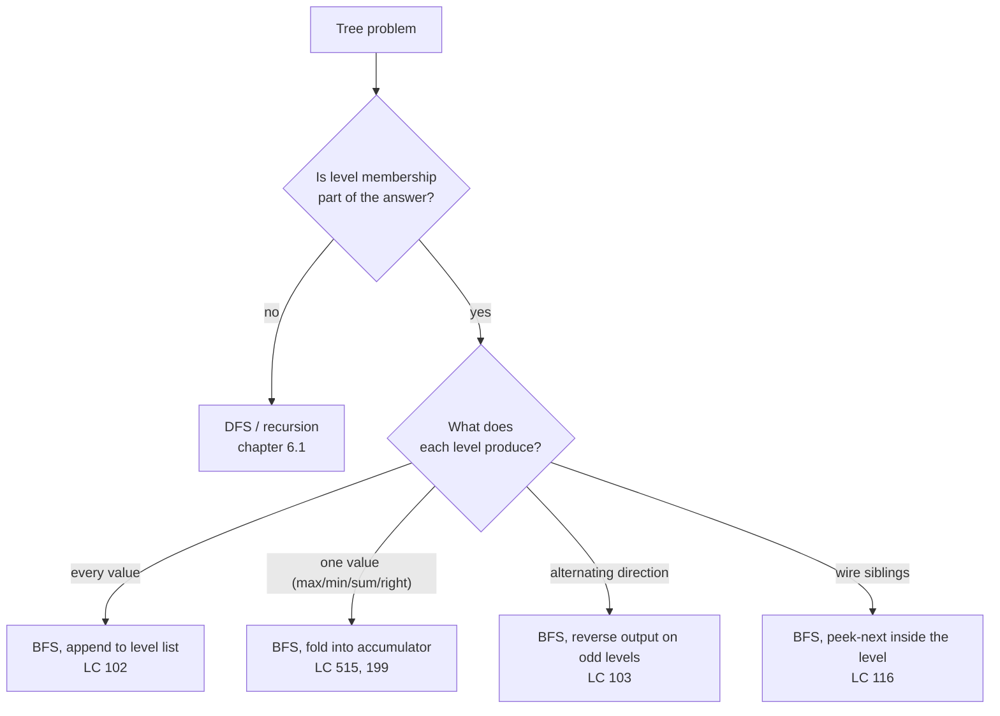
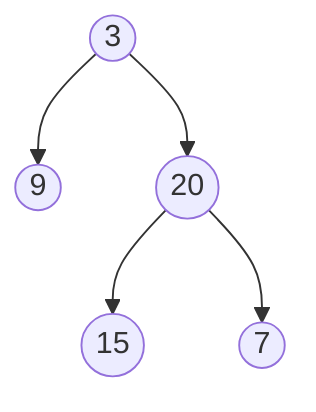

# Level-order traversal: BFS on trees

Konrad Zuse wrote down breadth-first search in 1945 and then never published it. Edward F. Moore re-derived the same algorithm fourteen years later, alone, while looking for the shortest path out of a maze. The line of code that distinguishes Moore's algorithm from a generic queue-walk is exactly this:

```python
level_size = len(queue)
```

One line. It snapshots how many nodes are on the queue *right now*, before any children get appended. That single integer is what turns "visit every node" into "visit every node, grouped by depth, in order, with the boundary between depths preserved as you go". Most LC tree problems that ask you to do anything per row, whether you're collecting, peeking, alternating, linking, or reducing, end up using that snapshot.

The chapter that came before this one taught the recursive traversals: pre-order, in-order, post-order. They walk the tree depth-first; the implicit stack lives on the call frame; you reach the bottom before you climb back up to a sibling. This chapter is what happens when the same tree gets walked the other way. The control structure flips from a recursive call stack to an explicit FIFO queue, and the question changes from "which direction down" to "which level am I on right now". The mechanics are different. The decision of which one to reach for is not subtle, once you know the trigger.

## The trigger

When a tree problem asks for one value per row, or for a value on the boundary between two rows, or for the relationship between siblings on the same row, reach for level-order BFS. That is the entire trigger.[^1] Recursive DFS is the default for trees and stays the default everywhere the answer is local to a root-to-node path. BFS earns its place only when **level membership is part of the answer**.

Five problems sit at the centre of this pattern, and all five are LC-rated Medium: LC 102 (collect every value), LC 199 (the rightmost value per level), LC 103 (alternate the direction), LC 116 (wire siblings via a `next` pointer), LC 515 (reduce per level). They are not five algorithms. They are one outer skeleton with five different inner-loop bodies. The chapter teaches the skeleton once and then names what changes.

The negative signals are equally clean. "Find a root-to-leaf path with property X" is DFS. "Validate the BST invariant" is DFS. "Compute a node's diameter or maximum sum from below" is post-order DFS. "Serialize the tree" is whichever traversal the interviewer asks for. None of those care about level membership; none of them are this chapter.

## Where this pattern fits



*Caption: BFS earns its place only when level membership is part of the answer; the inner-loop body is what changes between the variants.*

## Why the obvious approach loses the levels

The most natural BFS that a five-minute whiteboard produces looks like this:

```python
# Naive BFS — correct visit order, wrong output shape
def naive_bfs(root):
    if root is None:
        return []
    result = []
    queue = deque([root])
    while queue:
        node = queue.popleft()
        result.append(node.val)
        if node.left:  queue.append(node.left)
        if node.right: queue.append(node.right)
    return result
```

Run that on `[3, 9, 20, null, null, 15, 7]` and the output is `[3, 9, 20, 15, 7]`. Every node visited, in level-order, exactly once. The order is right. But LC 102 wants `[[3], [9, 20], [15, 7]]`, values grouped by level, and this version has lost the boundary. Once 9 and 20 are dequeued, the queue holds 15 and 7 alongside them with no marker saying "these belong to the next row". The information that depth was a thing has dissolved.

The fix has to live somewhere. There are two ways to put it back: enqueue a sentinel `None` at the end of each level and watch for it on dequeue, or snapshot the queue's size at the start of each level and pop exactly that many nodes before considering the next batch. The sentinel approach works and shows up in older textbook code; the snapshot is cleaner because it needs no extra type, no extra branch, no special case at the end. Snapshot wins. CLRS frames the more general graph BFS in §20.2[^2]; the level-snapshot adaptation is the canonical idiom for trees.

## The pattern

```python
from collections import deque

def level_order(root):
    if root is None:
        return []
    result = []
    queue = deque([root])
    while queue:
        level_size = len(queue)              # the snapshot — this is the chapter
        level = []
        for _ in range(level_size):
            node = queue.popleft()
            level.append(node.val)
            if node.left:  queue.append(node.left)
            if node.right: queue.append(node.right)
        result.append(level)
    return result
```

**Solution** — Python ([Java](./03-level-order-traversal/lc-102/sol.java) · [C++](./03-level-order-traversal/lc-102/sol.cpp) · [Go](./03-level-order-traversal/lc-102/sol.go))

```python
# LC 102. Binary Tree Level Order Traversal
from collections import deque
from typing import List, Optional


class TreeNode:
    def __init__(self, val=0, left=None, right=None):
        self.val = val
        self.left = left
        self.right = right


def level_order(root: Optional[TreeNode]) -> List[List[int]]:
    """LC 102: return level-order traversal as a list of levels."""
    if root is None:
        return []
    result: List[List[int]] = []
    queue: deque = deque([root])
    while queue:
        level_size = len(queue)
        level: List[int] = []
        for _ in range(level_size):
            node = queue.popleft()
            level.append(node.val)
            if node.left is not None:
                queue.append(node.left)
            if node.right is not None:
                queue.append(node.right)
        result.append(level)
    return result
```

Three lines do the work. The outer `while queue` runs once per level. The `level_size = len(queue)` line snapshots the boundary; children appended during this iteration belong to the next level and stay invisible until the outer loop comes round again. The inner `for _ in range(level_size)` consumes exactly the nodes that were on the queue at the moment of the snapshot, no more and no less. Everything else is bookkeeping.

A subtle point about Python's `range(level_size)`: the integer is evaluated once, at the start of the loop, so children appended inside the body don't extend the iteration count. Java's `for (int i = 0; i < queue.size(); i++)` does the opposite: `queue.size()` is recomputed every check, so writing the loop without snapshotting silently merges level boundaries into one giant pass. The Java sibling file uses `int levelSize = queue.size()` outside the loop for exactly this reason.

> [!IMPORTANT]
> The `len(queue)` snapshot is not a stylistic choice. It is the line that distinguishes "visit in level order" from "visit and group by level". Without it, the queue dissolves the boundary between depths the moment children get appended; with it, the boundary is preserved as a count for one outer iteration.

## Worked example: LC 102 on `[3, 9, 20, null, null, 15, 7]`

Tree shape:



*Caption: the LC 102 example tree. Three levels, root 3 with children 9 and 20, and 20's children 15 and 7.*

Build phase: enqueue the root, snapshot `level_size = 1`, dequeue 3, visit it, enqueue its children 9 and 20. End of level 0; result is `[[3]]`. The widget below shows the queue evolving cell by cell, and the boundary bar that appears at every `level_size` snapshot.

The decisive moment is at step 8. The queue holds `[9, 20]`, the result holds `[[3]]`, and the algorithm snapshots `level_size = 2`. Over the next four iterations, 9 and 20 each get dequeued and visited, and 20's children 15 and 7 get appended *behind* the boundary. By the end of the inner loop, the queue is `[15, 7]` and the current level is `[9, 20]`. The boundary held; the next iteration of the outer loop will see it again with a fresh snapshot of 2.

> **Interactive widget:** [Tree traversal animator (DFS pre/in/post + BFS level-order)](../widgets/w-16-tree-traversal-animator.yml) (panel `panel-b`) — rendered on the website; the YAML spec describes the keyframes.

*Static fallback: across 23 steps, the queue evolves [3] → [9, 20] → [15, 7] → empty. The result accumulates [[3]] → [[3], [9, 20]] → [[3], [9, 20], [15, 7]]. The boundary bar appears three times, each time after a `level_size` snapshot, holding the line between the level being processed and the level being prepared.*

## What changes between the variants

The outer loop is the same in all five LC problems on the chapter ladder. What changes is two things: what goes into `level` inside the inner loop, and what gets appended to `result` at the end of it.

| Problem | Inner-loop body | What `result` collects |
|---|---|---|
| LC 102, level order | `level.append(node.val)` | `result.append(level)` |
| LC 515, max per row | `level_max = max(level_max, node.val)` | `result.append(level_max)` |
| LC 199, right-side view | append `node.val` only when `i == level_size - 1` | the per-level rightmost value |
| LC 103, zigzag | identical to LC 102 | reverse `level` on odd rows before appending |
| LC 116, next pointer | peek the next-in-level via `queue[0]`; set `node.next = queue[0]` (or `None` on the last iteration) | nothing — the side effect *is* the answer |

LC 199 has the cleanest "boundary" framing: the rightmost node on a level is the one dequeued at `i == level_size - 1`. The level-snapshot tells you exactly when that moment arrives. Without it, "rightmost" is undefined: which 9-or-20 is "rightmost" depends on what level you're in, and the queue alone can't tell you that.

LC 103 has a trap. Reading "alternate direction" as "alternate the order of enqueueing children" produces wrong answers on level 2 and beyond, because the BFS enqueue order is what determines which children belong to which parents on the next level; mutating it corrupts the parent-child relationship. Reverse the *output* level, not the enqueue order. Equivalently, build `level` with `collections.deque` and use `appendleft` on odd rows.[^3]

LC 116 puts the level-snapshot to its sharpest test. Inside the inner loop, after dequeueing a node, peek at `queue[0]`. That's the next node *on the same level*, because the boundary holds. On the last iteration of the level (`i == level_size - 1`), `queue[0]` would be a child of an already-visited node and `node.next` should be `None` instead. The level-snapshot is what tells the algorithm "this is the last node in the current level"; without it, the peek would silently jump to the next level and wire siblings across rows. The problem also has an O(1)-extra-space solution that walks already-wired `next` pointers on the parent level to wire children, which the LC editorial covers; the BFS solution is the one that teaches the pattern.[^4]

## What it actually costs

| Variant | Time | Space | Notes |
|---|---|---|---|
| BFS visit every node | O(n) | O(w) | `w` = max nodes on any single level |
| Worst case (complete binary tree) | O(n) | O(n/2) = O(n) | bottom row holds half the nodes |
| Skewed tree (linked-list shape) | O(n) | O(1) extra | width is 1 throughout |
| Building list-of-lists output | O(n) | O(n) | output size is n itself |

Every node is enqueued once and dequeued once, so the queue executes exactly `2n` operations end-to-end. Each operation is amortized O(1) on `collections.deque` (Python), `ArrayDeque` (Java), `std::queue` over `std::deque` (C++), and a slice with append-and-drop-front (Go). On a tree with `n` nodes and `n - 1` edges, CLRS's general graph BFS bound of O(V + E) collapses to O(n).[^2] The level-snapshot adds two constant-time operations per level (read `len(queue)`, allocate `level`); since there are at most `n` levels in a degenerate skewed tree, the asymptotic cost is unchanged.

The pitfall that kills naive Python solutions on LC 102 is using a list as a queue. `list.pop(0)` shifts every remaining element left, which costs O(width). Total work becomes O(n × n/2) = O(n²) on a balanced tree, and the standard 10⁴-node hidden tests time out where deque-based BFS finishes in tens of milliseconds.[^5] Use `collections.deque` and stop thinking about it. The Java analogue is `ArrayDeque` over `LinkedList`: roughly three times faster as a queue because it stores elements in a circular array instead of allocating a node per enqueue, and the JIT inlines its `offer` and `poll` paths.[^6]

## Two pitfalls that bite

> [!WARNING]
> **Forgetting `if root is None: return []`.** LC 102's stated constraint is `0 <= number of nodes <= 2000`, so an empty tree is a legal input. Without the guard, the first `queue.append(root)` enqueues a `None`, the inner `popleft` returns `None`, and `None.val` throws on the dot dereference. This is the single most common bug in five-minute interview implementations of LC 102.

> [!WARNING]
> **Reading `queue.size()` inside the inner loop in Java, C++, or Go.** Python's `range(level_size)` evaluates the integer once and is safe; Java's `for (int i = 0; i < queue.size(); i++)` re-evaluates the size on every check, so children appended inside the body extend the iteration count and merge level boundaries into one big pass. Snapshot the size into a local before the inner loop. The same shape applies to C++'s `q.size()` and Go's `len(queue)`: once a snapshot, never inside the loop.

A third pitfall worth naming briefly: on LC 199, hybrid BFS-and-DFS solutions are easy to write and easy to break. LC 199 has a clean DFS solution (recurse right first, record `node.val` the first time you reach a depth never seen before) and a clean BFS solution (the one in this chapter); mixing fragments of both produces code that handles only some test cases. Pick one. For this chapter, BFS is the natural expression because the level boundary is already in hand.

## Problem ladder

### CORE (solve all three to claim chapter mastery)

- [LC 102 — Binary Tree Level Order Traversal](https://leetcode.com/problems/binary-tree-level-order-traversal/) [Medium] • bfs-level-order ★
- [LC 199 — Binary Tree Right Side View](https://leetcode.com/problems/binary-tree-right-side-view/) [Medium] • bfs-level-order-rightmost
- [LC 103 — Binary Tree Zigzag Level Order Traversal](https://leetcode.com/problems/binary-tree-zigzag-level-order-traversal/) [Medium] • bfs-level-order-alternating-direction

### STRETCH (optional)

- [LC 116 — Populating Next Right Pointers in Each Node](https://leetcode.com/problems/populating-next-right-pointers-in-each-node/) [Medium] • bfs-level-order-with-sibling-link
- [LC 515 — Find Largest Value in Each Tree Row](https://leetcode.com/problems/find-largest-value-in-each-tree-row/) [Medium] • bfs-level-order-reduce

The honest framing: every problem on the ladder is LC-rated Medium. The Easy candidates that touch level order (LC 100 Same Tree, LC 101 Symmetric Tree, LC 104 Maximum Depth) are claimed by [Binary trees: structure and recursion](./00-binary-tree-fundamentals.md), which is the right home for them. The Hard adjacent, LC 297 Serialize and Deserialize, belongs to [Tree traversals: pre, in, post](./01-tree-traversals.md). What's left for this chapter is structurally a single-difficulty band, recorded in the registry as a property of the pattern, not a gap. Five Medium problems, one skeleton, five inner-loop bodies.

## Where this leads

The level-snapshot trick generalizes. Replace "tree" with "unweighted graph" and add a `visited` set to handle cycles, and the same outer skeleton becomes the canonical algorithm for shortest paths in an unweighted graph — exactly one new concept ([BFS shortest paths](../part-8-graphs/01-bfs.md)). Replace "tree" with "grid" and seed the queue with multiple starts, and the same skeleton becomes multi-source BFS, which is how you solve "rotting oranges" and "01 matrix" style problems in linear time without Dijkstra. The pattern is the bridge between this chapter and a chunk of Part 8.

There is also a sideways move worth flagging. The `next`-pointer trick from LC 116 has an O(1)-extra-space solution that walks the parent level's already-wired pointers; the same observation underlies the iterative O(1) Morris traversal covered in [Morris traversal](./02-morris-traversal.md). The two algorithms have nothing in common at the surface, yet both are applications of the same idea: already-wired pointers in a tree can carry the work that an explicit auxiliary structure would otherwise hold.

## References

[^1]: LeetCode Discuss study guide, "Tree BFS Technique and Question Bank" (post 1805207, 2024).

[^2]: Cormen, Leiserson, Rivest, Stein, *Introduction to Algorithms*, 4th ed., MIT Press, 2022, Chapter 20 §20.2 "Breadth-first search".

[^3]: BFS itself was discovered by Konrad Zuse around 1945 in the context of solving connectivity problems, but Zuse's manuscript on Plankalkül was not published until 1972; Edward F. See [Wikipedia: Breadth-first search](https://en.wikipedia.org/wiki/Breadth-first_search)

[^4]: LeetCode 116, "Populating Next Right Pointers in Each Node" (Medium).

[^5]: Stack Overflow, "Level Order Traversal in python, Can we optimise it better?" (qid 69509897).

[^6]: Stack Overflow, "Why is ArrayDeque better than LinkedList" (qid 6163166). `ArrayDeque` is roughly three times faster than `LinkedList` as a queue due to no per-node allocations and better cache behavior; the JIT inlines its `offer` and `poll` paths. java-performance.info (2023) corroborates with microbenchmarks.
