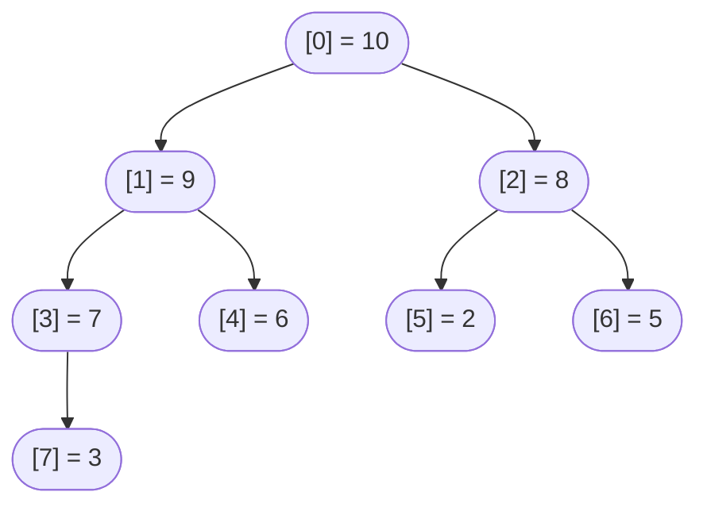
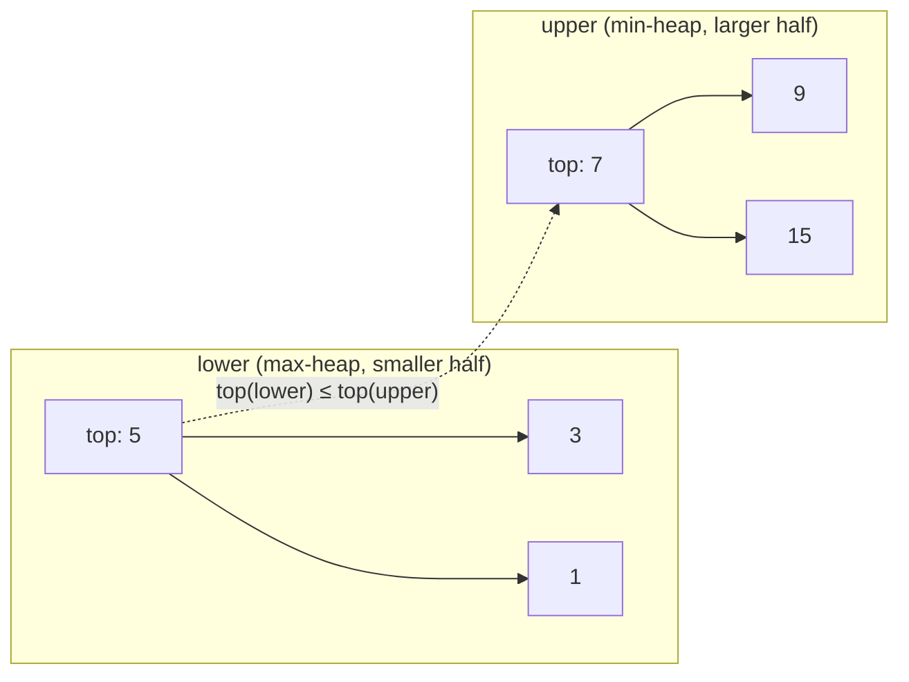

# Heaps and priority queues

J. W. J. Williams shipped the binary heap in June 1964, eight pages into Communications of the ACM, packaged inside a sorting routine he called Algorithm 232, Heapsort. Six months later, in the December issue of the same journal, Robert Floyd published Algorithm 245, Treesort, with a single change buried in the construction step: instead of inserting `n` items into an empty heap one at a time, build the heap bottom-up and run sift-down from the last internal node back to the root. Williams's construction is `O(n log n)`. Floyd's is `Θ(n)`. Same final structure, same operations afterward, linear instead of linearithmic to set up. That gap, `O(n log n)` versus `Θ(n)` for the same end state, is the chapter's hardest piece of math, and it's the part most students bounce off.

Sixty-two years later, every standard library carries a binary heap.[^1] [^2] Python's `heapq`, Java's `PriorityQueue`, C++'s `std::priority_queue`, Go's `container/heap`. Four implementations of the same abstract data type, four different surfaces, all backed by the array-as-implicit-tree idea Williams sketched. The interview problem set has converged on three shapes: top-K with a bounded heap, k-way merge of K sorted streams, and two-heap balanced halves for a running median. If you can recognize those three shapes and pick the right heap variant for each, you can solve roughly twenty distinct LeetCode problems with the same five primitives.

This chapter teaches the primitives first (array layout, sift-up, sift-down, push, pop, build-heap) and then turns around and applies them to LC 215, LC 295, and LC 23. The mechanics live in §"What a heap actually is" through §"Building a heap in linear time"; the applications live in the three worked examples that follow. Read in order; each section assumes the prior.

## What a heap actually is

A binary heap is a complete binary tree stored in an array. The completeness is structural: every level except possibly the last is full, and the last level fills left to right. The ordering is local: in a max-heap, every parent dominates its children; in a min-heap, every parent is dominated by them. There is no global order. Siblings need not be comparable, cousins are unrelated, the tenth-largest element can sit anywhere below the root.

The array layout is what makes the structure cheap. For the node at index `i` (0-indexed):

- parent is `(i - 1) / 2`
- left child is `2 * i + 1`
- right child is `2 * i + 2`

No pointers. No allocations per node. The tree is implicit; the array is the tree.



*The array `[10, 9, 8, 7, 6, 2, 5, 3]` viewed as a complete binary tree. Each parent is greater than or equal to its children, so 10 sits at the root and pop_max returns it in O(1).*

Completeness pins the height at `floor(log2 n)` for any `n`. There's no degenerate case where the tree skews into a linked list. A million-element heap has height 19. A billion-element heap has height 29. That bound, height is `O(log n)` with no exceptions, is what makes every operation cheap.

The two operations that do all the work are sift-up and sift-down. Both walk one root-to-leaf path. Both are `O(log n)` worst case because the path length is the height.

## The two primitives

Sift-up runs after a push. The new element gets appended at the next free slot, index `n` if the array currently holds `n` items, which is the leftmost open position on the bottom level. That insertion preserves completeness but can violate the ordering: the new value might be larger than its parent. Sift-up fixes that by walking the new element toward the root, swapping with the parent whenever the parent loses.

```python
def sift_up(a, i):
    while i > 0:
        parent = (i - 1) // 2
        if a[parent] < a[i]:
            a[parent], a[i] = a[i], a[parent]
            i = parent
        else:
            return
```

Sift-down runs after a pop. The root is the value being returned. Removing it leaves a gap, which we fill by moving the last leaf into the root slot. That preserves completeness but can violate ordering downward: the leaf might be smaller than its children. Sift-down fixes that by walking the value back toward a leaf, swapping with the larger of the two children at each level until both children are smaller (or there are no children left).

```python
def sift_down(a, i, n):
    while True:
        left, right, largest = 2 * i + 1, 2 * i + 2, i
        if left  < n and a[left]  > a[largest]: largest = left
        if right < n and a[right] > a[largest]: largest = right
        if largest == i:
            return
        a[i], a[largest] = a[largest], a[i]
        i = largest
```

Both loops walk one path from where they start to either a leaf or a satisfied position. Path length is bounded by the tree's height, `floor(log2 n)`. Each iteration does constant work (a comparison and optionally a swap). So both primitives run in `O(log n)` worst case, and the rest of the operation table is one-line wrappers around them.

> **Interactive widget:** [Heap operations: sift-up after push, sift-down after pop](../widgets/w-18-heap-operations.yml) (panel `default`) — rendered on the website; the YAML spec describes the keyframes.

*Static fallback: starting from the max-heap `[9, 7, 8, 3, 6, 2, 5]`, push(10) appends 10 at index 7 and sifts up through three swaps (10↔3, 10↔7, 10↔9) to reach the root. pop_max() then returns 10, moves the last leaf 3 into the root, and sifts down through two swaps (3↔9, 3↔7), restoring the heap to its starting shape.*

The widget plays the round-trip. Notice that sift-up takes three swaps and sift-down takes two: the path lengths differ because the new value entered at the last leaf and reached the root, while the moved leaf entered at the root and stopped at index 3 (a position that already has no children to violate). Both paths are bounded by `log2(8) = 3`, which is what `O(log n)` means at this scale.

## The full operation table

Once you have sift-up and sift-down, every other operation is a thin shell. Push appends and sifts up; pop swaps the root with the last leaf, shrinks the array, and sifts down on the new root. Peek reads `a[0]`. Replace fuses pop and push into a single sift-down on a value placed directly at the root, saving one path traversal.

| Operation | Time | Space | What it does |
|---|---|---|---|
| `peek()` | `O(1)` | `O(1)` | Return `a[0]`. The root is always the extremum. |
| `push(x)` | `O(log n)` | `O(1)` | Append at index `n`, sift up. |
| `pop()` | `O(log n)` | `O(1)` | Swap `a[0]` with `a[n-1]`, drop the last slot, sift down on the new root. |
| `replace(x)` | `O(log n)` | `O(1)` | Place `x` at the root, sift down. One pass instead of pop-then-push. |
| `heapify_by_insert(arr)` | `O(n log n)` | `O(1)` extra | `n` calls to push. The naive build. |
| `heapify_by_floyd(arr)` | `Θ(n)` | `O(1)` extra | Walk indices `floor(n/2) - 1` down to `0`, sift-down each. The linear build. |

The replace operation is worth flagging. Python exposes it as `heapq.heapreplace(h, x)`, which is "pop the smallest, then push x" but executed as a single sift-down on the new value placed at the root. On streaming hot paths (LC 703, LC 215), where every new element triggers a compare-and-replace, `heapreplace` is roughly twice as fast as `pop` followed by `push` because it skips one full sift-down.[^3] Go's `container/heap` exposes the same idea as `heap.Fix(h, 0)` after mutating the root in place. C++ has no direct equivalent but the same effect comes from `pop` followed by `push` with the standard library inlining the redundant work away under optimization.

The heapify_by_insert and heapify_by_floyd rows are the same final state achieved two different ways. The next section is why the second one is faster.

## Building a heap in linear time

The naive way to build a heap from an unordered array is to push each element onto an initially empty heap. That's `n` calls to push, each `O(log n)` worst case, for `O(n log n)` total. Williams's original 1964 paper used this construction, and his combined sort runs in `O(n log n)` overall, which is fine for sorting since the extraction phase is also `O(n log n)`.

Floyd noticed that the construction phase doesn't need to be `O(n log n)`. Six months after Williams, in December 1964, Floyd published the bottom-up build: walk the array from the last internal node back to the root, calling sift-down at each position.[^2]

```python
def floyd_build_max_heap(a):
    n = len(a)
    for i in range(n // 2 - 1, -1, -1):
        sift_down(a, i, n)
```

The starting index `n // 2 - 1` is the last internal node. Every index past it is a leaf, and a single-element subtree is trivially a valid heap. Sift-down on each internal node, in reverse order, fixes the heap property at that subtree. By the time the loop reaches index 0, every subtree below is already valid, and the final sift-down on the root completes the whole heap.

The proof that this runs in `Θ(n)` is the chapter's hardest piece of math.[^4] The naive intuition (n calls to sift-down at `O(log n)` each gives `O(n log n)`) is correct as an upper bound but not asymptotically tight. The tight bound comes from observing that **most nodes are leaves and most subtrees are short**.

A complete binary tree with `n` nodes has at most `ceil(n / 2^(h+1))` nodes at height `h`, where height is measured from the leaf upward. Half the nodes are leaves (height 0). A quarter are at height 1. An eighth at height 2. The single root is at height `log2(n)`.

A sift-down call from a node at height `h` does at most `O(h)` work, since that's the longest path it can walk. Total work for the whole build is the sum over all heights:

```text
Total work  =  Σ (over heights h from 0 to log2 n) of [ ceil(n / 2^(h+1)) · O(h) ]
            ≤  (n / 2) · Σ (h = 0 to ∞) [ h / 2^h ]
            =  (n / 2) · 2
            =  O(n)
```

The series `Σ h / 2^h` converges to 2. That's a standard arithmetic-geometric sum from calculus. So the entire bottom-up build does at most `n` units of work, even though the worst-case sift-down call at the root costs `log2(n)` swaps. The math works because **the expensive sift-down calls are rare**: only one node sits at the maximum height. The cheap calls (leaves do zero work; height-1 internal nodes do at most one swap) dominate the sum.

Sedgewick & Wayne sharpen the bound further to `≤ n` exchanges via a charging argument: map each node at height `k` to a unique "left-then-rights" path of length `k`, and the total path length across all nodes is bounded by `n`.[^5] Either proof reaches the same conclusion: build-heap by Floyd's method is linear, regardless of input.

The `n / 2 - 1` lower bound on the loop is the off-by-one to get right. It's the index of the last internal node, the rightmost node that has at least one child. Index `n - 1` is the last array slot, which is a leaf if `n > 0`. The parent of index `n - 1` is `((n - 1) - 1) / 2 = (n - 2) / 2`, which equals `n / 2 - 1` for even `n` and `(n - 1) / 2` for odd `n`; both expressions evaluate to the same integer in floor-division. `for i in range(n // 2 - 1, -1, -1)` is the canonical CLRS form, and all four reference languages use it verbatim.[^4]

## The four-language idiom drift

This is the part the chapter has to say out loud. Each standard library ships a heap, but no two libraries default the same way.

**Python's `heapq` is min-heap only.** There is no max-heap option in the standard library; the documentation is explicit that the module implements a min-heap and the conventional workaround is to push negated values when you need max-heap behavior.[^6] `heapq.heappush(h, x)` pushes; `heapq.heappop(h)` pops the smallest; `heapq.heapreplace(h, x)` is the fused pop-then-push. There is no class wrapper; you operate on a plain Python list with the heap invariant maintained externally.

**Java's `PriorityQueue` is min-heap by default.** Default natural ordering means the smallest element is at the head; `offer` inserts, `poll` removes the head, `peek` reads it. For max-heap, pass `Comparator.reverseOrder()` to the constructor. The bulk constructor `new PriorityQueue<>(collection)` builds in `O(n)` via Floyd's method, not `O(n log n)` via repeated insertion.

**C++'s `std::priority_queue` is max-heap by default.** This is the trap: switching from Python or Java to C++ inverts the default. `std::priority_queue<int>` returns the largest element first; for a min-heap, pass `std::greater<int>` as the third template argument: `std::priority_queue<int, std::vector<int>, std::greater<int>>`.[^7] `std::make_heap` is the bulk-build primitive that runs in `O(n)`, exactly Floyd's algorithm under the hood.

**Go's `container/heap` is a protocol, not a type.** You implement the five-method `heap.Interface` (`Len`, `Less`, `Swap`, `Push`, `Pop`) on your own slice type, and `Less` determines whether you have a min-heap or a max-heap.[^8] `heap.Init(h)` runs Floyd's build; `heap.Push(h, x)` and `heap.Pop(h)` are the public entry points; `heap.Fix(h, i)` re-heapifies after you mutate index `i` directly, which is faster than pop-then-push for the streaming-replace pattern.

The drift causes real bugs. A candidate who memorized `heap.poll()` returns the smallest in Java and reaches for `pq.top()` in C++ will get the largest. A Python solution to LC 215 (Kth largest) can be written either as a max-heap of all elements (negating on push) or as a min-heap of size K (no negation, root is the answer); the second is simpler and faster. The Java version of the same problem reads cleanest as a min-heap of size K (which is the default), but if you transcribe it to C++ you have to remember to add `std::greater<int>`. None of these inversions is hard to fix; they are hard to *not forget* under interview pressure.

## Worked example: LC 215, Kth Largest Element in an Array

> **What it asks.** Given an unsorted array `nums = [3, 2, 1, 5, 6, 4]` and `k = 2`, return the second-largest element. Here the answer is 5.

> **Pattern signal.** "Find the K-th largest" or "find the top K" with `K << n` is the bounded-heap shape. State size is `K`, not `n`; the operation that fires every step is eviction, not insertion.

> **First instinct (wrong).** Sort the array, return `nums[n - k]`. This is `O(n log n)` time and `O(1)` extra space (or `O(n)` if the language's sort is not in-place), and it works, but the heap solution is `O(n log k)`, which is asymptotically better whenever `k` is bounded.

The heap-of-size-K idea is counterintuitive on first read. To find the k-th *largest*, maintain a *min*-heap, not a max-heap. The intuition: at every step, the heap holds the k largest values seen so far, and the root is the smallest of those k. When a new value arrives, compare it against the root. If the new value is larger, it belongs in the top-K, and the current root (the smallest survivor) gets evicted. If the new value is smaller or equal, it can't possibly be in the top K and we discard it without touching the heap. After processing all `n` values, the root is exactly the k-th largest.

```python
def find_kth_largest(nums, k):
    heap = []
    for x in nums:
        if len(heap) < k:
            heapq.heappush(heap, x)
        elif x > heap[0]:
            heapq.heapreplace(heap, x)
    return heap[0]
```

**Solution** — Python ([Java](./04-heaps-priority-queues/lc-215/sol.java) · [C++](./04-heaps-priority-queues/lc-215/sol.cpp) · [Go](./04-heaps-priority-queues/lc-215/sol.go))

```python
# LC 215. Kth Largest Element in an Array
# heap solution mirrors
# top-K idiom (min-heap of size k, evict on overflow). Quickselect is the
# primary algorithm at chapter 2.7; this is the heap alternative.
import heapq
from typing import List


def find_kth_largest(nums: List[int], k: int) -> int:
    """Return the k-th largest element. Min-heap of size k; root is the answer.

    Time:  O(n log k) average and worst case.
    Space: O(k).
    """
    heap: list[int] = []
    for x in nums:
        if len(heap) < k:
            heapq.heappush(heap, x)
        elif x > heap[0]:
            heapq.heapreplace(heap, x)        # one-shot pop-then-push
    return heap[0]
```

The walk on `nums = [3, 2, 1, 5, 6, 4]` with `k = 2` goes: push 3 (heap = `[3]`); push 2 (heap = `[2, 3]`, full); 1 < 2, skip; 5 > 2, heapreplace, heap = `[3, 5]`; 6 > 3, heapreplace, heap = `[5, 6]`; 4 < 5, skip. Root is 5. Six elements processed; the heap never grew past size 2; six lookups at the root, two replacements.

The cost analysis is `O(n log k)`. Each of the `n` elements does one `O(1)` peek at the root and at most one `O(log k)` replace. Space is `O(k)` for the heap itself. When `k` is a small constant (top 5, top 10, top 100), `log k` is essentially zero and the algorithm is functionally linear. When `k` is `n / 2`, the algorithm is `O(n log n)` and there's no asymptotic win over sort.

**Quickselect is the alternative, and it's the primary at chapter [Quickselect](../part-2-search-sort/07-quickselect.md).** The heap approach is `O(n log k)`; quickselect is `O(n)` average. The tradeoff:

| Aspect | Heap of size K | Quickselect |
|---|---|---|
| Time average | `O(n log k)` | `O(n)` |
| Time worst | `O(n log k)` | `O(n²)` (mitigated by random pivots) |
| Space | `O(k)` | `O(1)` in-place, `O(log n)` recursion |
| Streaming input | Yes (single pass) | No (needs random access) |
| Online updates | Yes (see LC 703) | No (must re-run on new data) |
| Stable, preserves array | Yes (`nums` untouched) | No (partitions in place) |

Quickselect wins on average time and space when the input fits in memory and stays put. Heap wins whenever the input is a stream, the array must be preserved, or you need running answers as data arrives. LC 703 (Kth Largest in a Stream) is the cleanest case where the heap solution dominates: you can't quickselect over data you haven't seen yet.

For the offline version (LC 215 with the array given upfront), interviewers usually accept either solution but prefer to see both, with a sentence on the tradeoff. Reach for the heap first if you're comfortable with the data structure; it's shorter and harder to get subtly wrong than quickselect with random pivots and three-way partitioning.

## Worked example: LC 295, Find Median from Data Stream

> **What it asks.** Numbers arrive one at a time. After each arrival, return the median of all values seen so far. For the stream `[1, 2, 3, 4]`, the median sequence is `1.0, 1.5, 2.0, 2.5`.

> **Pattern signal.** "Running median", "running k-th percentile", "online quantile". Anything where you need a quantile after every insert and you can't afford to re-sort the whole stream every time.

> **First instinct (wrong).** Maintain a sorted list; binary-search the insertion point on each addNum. Find the insertion point is `O(log n)`, but the *insert into a list* step is `O(n)` because everything to the right shifts. Over `n` additions that's `O(n²)` total, which is the trap LC 295's constraints (up to `5 * 10^4` addNum calls) are sized to break.

The two-heap technique solves it. Split the stream into two halves: a max-heap holding the smaller half, and a min-heap holding the larger half. The median is bracketed between the two heap tops. If the heaps are the same size, the median is the average of the two tops; if one is larger, the median is the larger heap's top.



*The two heaps partition the stream so that `max(lower) ≤ min(upper)`. After inserting `[1, 3, 5, 7, 9, 15]`, the median is `(5 + 7) / 2 = 6.0`, read in O(1) from the two roots.*

Two invariants make the structure work:

1. **Size:** `0 ≤ len(lower) - len(upper) ≤ 1`. The lower heap carries one extra when the total count is odd; the heaps are equal when the count is even.
2. **Ordering:** `top(lower) ≤ top(upper)`. Every value in the lower half is no larger than every value in the upper half.

The tricky part is maintaining both invariants on every addNum without ever briefly violating the ordering invariant in a way that a concurrent findMedian could observe. The cleanest idiom is **push then rotate**: push the new value into lower unconditionally, then move lower's top into upper to enforce the ordering invariant, then if upper now has more elements than lower, rotate one back to fix the size invariant.

```python
class MedianFinder:
    def __init__(self):
        self.lower = []          # max-heap (negated values)
        self.upper = []          # min-heap

    def addNum(self, num):
        heapq.heappush(self.lower, -num)
        heapq.heappush(self.upper, -heapq.heappop(self.lower))
        if len(self.upper) > len(self.lower):
            heapq.heappush(self.lower, -heapq.heappop(self.upper))

    def findMedian(self):
        if len(self.lower) > len(self.upper):
            return float(-self.lower[0])
        return (-self.lower[0] + self.upper[0]) / 2.0
```

**Solution** — Python ([Java](./04-heaps-priority-queues/lc-295/sol.java) · [C++](./04-heaps-priority-queues/lc-295/sol.cpp) · [Go](./04-heaps-priority-queues/lc-295/sol.go))

```python
# LC 295. Find Median from Data Stream
# Two-heap technique: lower half as max-heap (negated); upper half as min-heap.
import heapq


class MedianFinder:
    """Invariant: 0 <= len(lower) - len(upper) <= 1; -lower[0] <= upper[0]."""

    def __init__(self) -> None:
        self.lower: list[int] = []   # max-heap, store as -value
        self.upper: list[int] = []   # min-heap

    def addNum(self, num: int) -> None:
        # Push then rotate: place into lower, then move lower's top to upper.
        heapq.heappush(self.lower, -num)
        heapq.heappush(self.upper, -heapq.heappop(self.lower))
        # Restore size invariant: lower may carry one extra.
        if len(self.upper) > len(self.lower):
            heapq.heappush(self.lower, -heapq.heappop(self.upper))

    def findMedian(self) -> float:
        if len(self.lower) > len(self.upper):
            return float(-self.lower[0])
        return (-self.lower[0] + self.upper[0]) / 2.0
```

The trace on the stream `[1, 2, 3]`: addNum(1) pushes -1 into lower, pops -1 back, pushes 1 into upper, then rotates because `len(upper) > len(lower)`; final state lower=`[-1]`, upper=`[]`, median 1.0. addNum(2) pushes -2 into lower, pops -2, pushes 2 into upper; final state lower=`[-1]`, upper=`[2]`, median (1 + 2)/2 = 1.5. addNum(3) pushes -3 into lower, pops -3, pushes 3 into upper, then rotates 2 back; final state lower=`[-2, -1]`, upper=`[3]`, median 2.0.

Three operations per addNum, each `O(log n)`. findMedian is two `O(1)` reads of the heap roots. Over `m` addNum calls, total cost is `O(m log m)`. That's two orders of magnitude better than the sorted-list approach at `m = 5 * 10^4`.

The alternative data structure is an order-statistics tree (a balanced BST augmented with subtree sizes), which gives `O(log n)` insert and `O(log n)` median read. It's asymptotically equivalent on the upper bound but slower in practice; the constants on a red-black tree are roughly 3-5× the constants on two heaps because each insert touches more cache lines and runs through more conditional branches. The two-heap solution is also dramatically shorter to write under interview pressure.

The pitfall to flag is the float-division step in findMedian. Java's `(lower.peek() + upper.peek()) / 2` returns an `int`; the canonical fix is `/ 2.0` to force the operands into `double`. C++ has the same trap if both heap tops are `int`. Python and Go are immune (Python's `/` is always float division for ints; Go's `float64(...)` cast in the reference implementation is explicit). The bug is silent (the function returns plausible-looking integers) and it's the most common LC 295 submission failure on the Discuss thread.

## Worked example: LC 23, Merge k Sorted Lists

> **What it asks.** You're given `k` sorted linked lists. Return one merged sorted list containing all the values. Example: `[[1,4,5], [1,3,4], [2,6]]` becomes `[1,1,2,3,4,4,5,6]`.

> **Pattern signal.** "Merge K sorted streams / lists / files / iterators" is k-way merge. The heap holds *cursors* (one per stream), not values, and advancing a cursor is the central operation.

> **First instinct (wrong).** Concatenate all the lists, sort the result. That's `O(N log N)` where `N` is total nodes, which loses the *already sorted* structure of the inputs. The benefit of knowing each input is sorted is exactly the `log k / log N` factor we can shave off; for `k = 100` and `N = 10^4`, that's roughly `7 / 13 ≈ 0.54×` the comparisons.

The k-way merge with a min-heap is the canonical solution. Initialize the heap with the head of every non-empty list. Repeatedly: pop the smallest cursor, append its node to the output, push the cursor's next node back onto the heap. The heap holds at most `k` cursors at any time, so each push and pop is `O(log k)`. After `N` total pops, the cost is `O(N log k)`.

```python
def merge_k_lists(lists):
    heap = []
    for i, head in enumerate(lists):
        if head is not None:
            heapq.heappush(heap, (head.val, i, head))
    dummy = ListNode()
    tail = dummy
    while heap:
        _, i, node = heapq.heappop(heap)
        tail.next = node
        tail = node
        if node.next is not None:
            heapq.heappush(heap, (node.next.val, i, node.next))
    tail.next = None
    return dummy.next
```

**Solution** — Python ([Java](./04-heaps-priority-queues/lc-23/sol.java) · [C++](./04-heaps-priority-queues/lc-23/sol.cpp) · [Go](./04-heaps-priority-queues/lc-23/sol.go))

```python
# LC 23. Merge k Sorted Lists
# k-way merge with a min-heap of K cursors. Tie-break tuple slot 2 (list index)
# is mandatory: ListNode is unorderable, so the heap must never compare two
# ListNode objects directly.
import heapq
from typing import List, Optional


class ListNode:
    __slots__ = ("val", "next")

    def __init__(self, val: int = 0, nxt: Optional["ListNode"] = None):
        self.val, self.next = val, nxt


def merge_k_lists(lists: List[Optional[ListNode]]) -> Optional[ListNode]:
    """O(N log K) where N = total nodes, K = number of lists."""
    heap: list[tuple[int, int, ListNode]] = []
    for i, head in enumerate(lists):
        if head is not None:
            heapq.heappush(heap, (head.val, i, head))

    dummy = ListNode()
    tail = dummy
    while heap:
        _, i, node = heapq.heappop(heap)
        tail.next = node
        tail = node
        if node.next is not None:
            heapq.heappush(heap, (node.next.val, i, node.next))
    tail.next = None
    return dummy.next
```

The tuple `(node.val, i, node)` is load-bearing across all four languages. The middle slot, list index `i`, exists to break ties when two cursors share the same value. Without it, when two heads compare equal, Python's heap reaches into the third slot and tries `node1 < node2`, which raises `TypeError` because `ListNode` defines no `__lt__`. The list index is unique by construction (we created one cursor per list), so it always breaks the tie before the heap can fall through to the unorderable comparison.

C++ and Java have the same problem with different mechanics. `std::priority_queue<ListNode*>` with the default comparator orders by *pointer address*, not by value, and pointer addresses are nondeterministic across runs, so the merge produces correct values in a non-deterministic order on duplicate keys, which sometimes happens to be correct and sometimes isn't.[^9] The fix is to pass an explicit comparator: a lambda in C++ (`[](ListNode* a, ListNode* b) { return a->val > b->val; }` for a min-heap), `Comparator.comparingInt(n -> n.val)` in Java. Go is the cleanest: `Less(i, j int) bool { return h[i].Val < h[j].Val }` is what the protocol expects from the start.

The divide-and-conquer alternative deserves mention. Pair up the K lists into K/2 pairs, merge each pair with the standard two-pointer merge, repeat on the K/2 results until one list remains. Each merge level processes all `N` nodes, and there are `log2(K)` levels, so total cost is `O(N log K)`, the same asymptotic bound as the heap version. The two approaches differ on memory (heap is `O(K)` extra; divide-and-conquer is `O(log K)` recursion depth) and on cache behavior (divide-and-conquer touches each node twice per level, which is friendlier on long lists; the heap touches each node once but with more random access).

In practice, the heap solution is what interviewers want to see at LC 23 because it generalizes immediately to k-way merge of *infinite streams* (LC 23's siblings: external-memory merge sort, B-tree leaf merge, distributed log merging). Divide-and-conquer requires all inputs to be finite, in memory, and accessible up front; it doesn't compose with iterator inputs.

## Where readers go wrong

> [!WARNING]
> **The ListNode comparator trap (LC 23).** In Java, `new PriorityQueue<ListNode>()` compiles but throws `ClassCastException` at runtime the first time two heads with equal values reach the heap, because `ListNode` doesn't implement `Comparable`. In C++, `std::priority_queue<ListNode*>` orders by pointer address, producing nondeterministic correctness on duplicates. In Python, `heapq.heappush(h, node)` raises `TypeError: '<' not supported between instances of 'ListNode' and 'ListNode'` once the heap reaches into the third slot of a value-tied tuple. **Always pass an explicit comparator.** The `(val, index, node)` tuple in the Python reference exists for exactly this reason: the `index` slot is the tie-breaker so the heap never tries to compare two `ListNode` objects directly.[^9]

> [!WARNING]
> **Two-heap rebalance order (LC 295).** The push-then-rotate idiom (push(num) into lower; pop lower's top into upper; if upper > lower, rotate back) is the cleanest of three plausible-looking idioms, and the only one where the ordering invariant holds at every observable point. Skipping the rotate-back step (the `if len(upper) > len(lower)` line) is the classic miss; you've enforced ordering but not size, and findMedian reads the wrong heap. The fix is to pick the push-then-rotate idiom and stick with it across all four languages, not to mix it with the alternative "compare with current median, push to whichever side" idiom.[^10]

> [!WARNING]
> **Java integer-overflow comparator.** `(a, b) -> a.val - b.val` is the comparator most students reach for, and it's correct for any input where both values are non-negative or both are bounded. On adversarial inputs where `a.val = Integer.MIN_VALUE` and `b.val > 0`, the subtraction wraps around and the comparator returns the wrong sign. Use `Comparator.comparingInt(n -> n.val)` or `Integer.compare(a.val, b.val)` instead. The same bug bites C++ if you write `cmp = [](int a, int b) { return a - b > 0; }` instead of `return a > b`. The reference implementations in this chapter all use the safe form.

> [!WARNING]
> **Floyd's `n / 2 - 1` versus `n / 2`.** The lower bound of the build-heap loop is the index of the last internal node, which is `(n // 2) - 1` in 0-indexed arrays. Looping from `n // 2` includes one position past the last internal node and either no-ops harmlessly or runs sift-down on a leaf (which is also a no-op). Looping from `(n - 1) // 2` is mathematically equivalent on integer division but reads as a different formula. The CLRS canonical form is `n // 2 - 1` and all four reference implementations use it.[^4]

> [!WARNING]
> **Float division in findMedian (LC 295).** The line `return (lower.peek() + upper.peek()) / 2;` returns an `int` in Java and C++ if both heap tops are `int`. The fix is `/ 2.0` to promote the divisor to floating-point, or an explicit cast: `(double)(lower.peek() + upper.peek()) / 2`. Python's `/` is always float division for ints, so the bug doesn't surface in the Python reference, but the moment you transcribe to Java or C++ the silent-integer-truncation bug appears. Discuss-thread reports rank this as the second-most-common LC 295 submission failure after the rebalance bug.

## Where the patterns extend

The three worked examples cover three distinct shapes (bounded heap, two-heap balanced halves, k-way merge with cursors), but the heap shows up in a fourth role we haven't taught: **priority scheduler** for graph algorithms. Dijkstra's shortest-path algorithm uses a min-heap keyed on tentative distance; Prim's minimum-spanning-tree algorithm uses a min-heap keyed on edge weight; Kruskal's algorithm sorts edges once (effectively a single big heap operation) before consuming them in order. Those uses live at [Dijkstra's algorithm](../part-8-graphs/09-dijkstra.md) and [Prim's algorithm](../part-8-graphs/12-mst-prim.md). The heap is the same data structure; only the scheduling policy differs.

The forward pointer worth flagging is the **indexed priority queue**, which Dijkstra needs in its `decrease_key` form. A standard heap supports `push` and `pop` but not "decrease the priority of an item already in the heap"; you'd have to find the item first, which is `O(n)` because the heap has no key-to-index map. The fix is to maintain a parallel hash map from key to position, updating both on every swap. Sedgewick & Wayne's `IndexMinPQ.java` is the canonical reference implementation; the chapter on Dijkstra walks through the variant.[^5] Fibonacci heaps push the asymptotics further (`O(1)` amortized for `decrease_key`) at the cost of much higher constant factors, which is why no production graph library actually uses them; they win only at sizes where the input no longer fits in memory.

The d-ary heap (a heap with `d` children per node instead of 2) is a different optimization: `push` becomes `O(log_d n)` because the tree is shallower, but `pop` becomes `O(d log_d n)` because sift-down has to compare against `d` children per level. For Dijkstra on graphs where `m >> n`, a 4-ary heap can be measurably faster than the binary heap because the sparse-edge regime has many more push operations than pop operations. CLRS Exercise 6.5-9 explores the variant; it's a footnote in interview practice.[^4]

## Problem ladder

### CORE (solve all three to claim chapter mastery)

- [LC 703 — Kth Largest Element in a Stream](https://leetcode.com/problems/kth-largest-element-in-a-stream/) [Easy] • min-heap-of-size-k-streaming
- [LC 347 — Top K Frequent Elements](https://leetcode.com/problems/top-k-frequent-elements/) [Medium] • hash-map-counts-plus-heap
- [LC 23 — Merge k Sorted Lists](https://leetcode.com/problems/merge-k-sorted-lists/) [Hard] • k-way-merge-min-heap-of-cursors ★

### STRETCH (optional)

- [LC 295 — Find Median from Data Stream](https://leetcode.com/problems/find-median-from-data-stream/) [Hard] • two-heap-running-median
- [LC 692 — Top K Frequent Words](https://leetcode.com/problems/top-k-frequent-words/) [Medium] • heap-with-custom-comparator

LC 215 is intentionally absent from this ladder. Its primary owner is [Quickselect](../part-2-search-sort/07-quickselect.md), where the partition algorithm is the lesson; this chapter cited LC 215 as a worked example to show the heap *alternative*, not as the chapter's signature problem. Solve it via heap once for the practice; solve it via quickselect when 2.7 comes up.

## Where this leads

The heap shows up next as a priority queue inside [Dijkstra's algorithm](../part-8-graphs/09-dijkstra.md), which adds the `decrease_key` operation we deferred above and the indexed-priority-queue variant that supports it. Past that, [Prim's algorithm for minimum spanning trees](../part-8-graphs/12-mst-prim.md) reuses the same min-heap structure with a different relaxation rule. Both chapters assume the operations table from this one as background.

For the offline-array `Kth largest` story, [Quickselect](../part-2-search-sort/07-quickselect.md) is the chapter that owns LC 215 properly and walks the average-case `O(n)` partition argument with random pivots. Read both chapters back-to-back if you want both algorithms in your interview repertoire. They solve the same problem with different tradeoffs, and that comparison is the kind of question Meta and Amazon loops reach for.

## References

[^1]: J. W. J. Williams, "Algorithm 232 — Heapsort", *Communications of the ACM*, 7(6):347–348, June 1964.

[^2]: Robert W. Floyd, "Algorithm 245 — Treesort", *Communications of the ACM*, 7(12):701, December 1964. The bottom-up `Θ(n)` build-heap algorithm. Available via [ACM Digital Library](https://cacm.acm.org/research/algorithm-245-treesort/).

[^3]: Python documentation, [`heapq` — Heap queue algorithm](https://docs.python.org/3/library/heapq.html).

[^4]: Cormen, Leiserson, Rivest & Stein, *Introduction to Algorithms*, 4th ed., MIT Press, 2022.

[^5]: Robert Sedgewick & Kevin Wayne, *Algorithms*, 4th ed., Addison-Wesley, 2011. §2.4 "Priority Queues": sink/swim primitives, the proposition that "Sink-based heap construction uses fewer than 2n compares and fewer than n exchanges" sharpened from CLRS's `O(n)` bound via a charging argument. The `IndexMinPQ.java` implementation in the same section is the canonical reference for the indexed priority queue used in Dijkstra. <https://algs4.cs.princeton.edu/24pq/>.

[^6]: Python documentation, [`heapq` — Heap queue algorithm](https://docs.python.org/3/library/heapq.html).

[^7]: cppreference.com, [`std::priority_queue`](https://en.cppreference.com/w/cpp/container/priority_queue).

[^8]: Go standard library documentation, [`container/heap`](https://pkg.go.dev/container/heap).

[^9]: walkccc.me LC 23 editorial demonstrates the canonical `Comparator.comparingInt(n -> n.val)` Java idiom and the C++ lambda-comparator pattern; the "ListNode is not Comparable" runtime failure on default-comparator `PriorityQueue<ListNode>()` is the implicit motivation for the editorial's choice. <https://walkccc.me/LeetCode/problems/23/>.

[^10]: labuladong, "Implementing Median Algorithm with Two Binary Heaps." <https://labuladong.online/algo/en/practice-in-action/find-median-from-data-stream/>.
