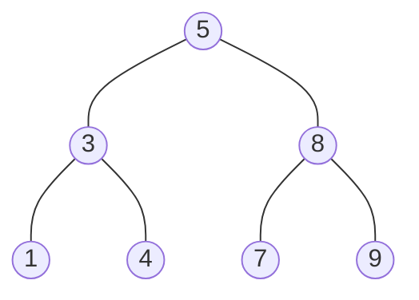
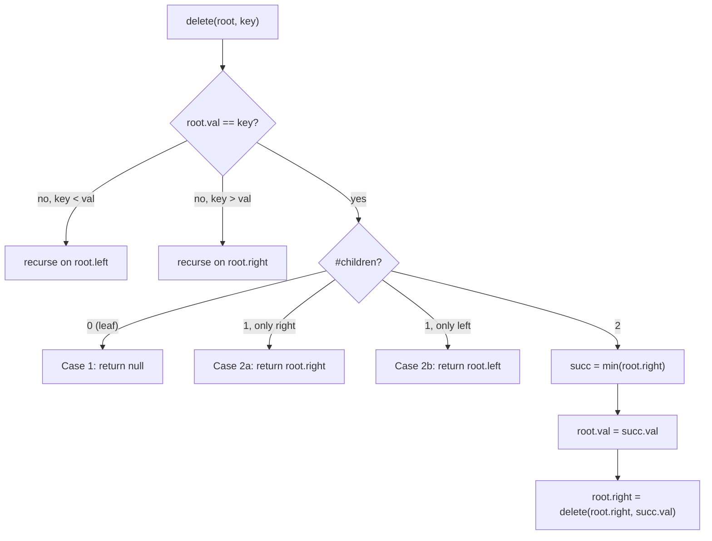

# Binary search trees

Java's `TreeMap`, C++'s `std::map`, and .NET's `SortedDictionary` are all built on red-black trees. None of them ship a vanilla binary search tree as a public class. The reason is in this chapter: a vanilla BST is the right answer when you can guarantee non-pathological insert order, and the wrong answer the moment you can't. Sedgewick & Wayne measured the gap on `N` random keys: average path length sits at ~1.39 lg N (about 28 compares for a million-key tree), and a sorted-input pathological insert collapses that to N (a million compares for a million-key tree). The factor between best and worst is the whole reason chapters 6.6 and 6.7 exist.

What this chapter does first is teach the operations on a tree that doesn't rebalance: search, insert, delete, validate, and the inorder-as-sorted-iterator trick.[^2] The mechanics matter because every balanced variant in 6.6 and 6.7 inherits them; rotation is just a structural fix-up applied *after* an insert or delete that this chapter teaches. By the time you finish, *Validate Binary Search Tree* (LC 98), *Insert into a Binary Search Tree* (LC 701), *Delete Node in a BST* (LC 450), and *Search in a Binary Search Tree* (LC 700) read as one algorithm with four entry points.[^1]

## What "BST" actually constrains

A binary search tree is a binary tree carrying one invariant: at every node `x`, every key in `x.left` is strictly less than `x.val`, and every key in `x.right` is strictly greater. The *strict-less* version (no duplicates) is what this chapter teaches. CLRS §12.1 allows `≤` on one side, but the strict form makes `isValidBST` and `delete` a single straight line of code without tie-break clauses, so every LC reference implementation uses it.[^1]



*The canonical tree built by inserting [5, 3, 8, 1, 4, 7, 9] in that order. Read left-to-right by an inorder walk and you get [1, 3, 4, 5, 7, 8, 9]; the strict-less invariant guarantees that.*

The single fact that makes a BST useful is **inorder traversal yields a sorted sequence**. CLRS Theorem 12.1 establishes it as a consequence of the invariant: `INORDER-TREE-WALK(x.left)` visits everything less than `x`, then `x`, then everything greater than `x`, recursively.[^1] Three of this chapter's five operations reduce to that one fact:

- *Validate BST?* Check the inorder is strictly increasing, or check the bounds inline.
- *Find the kth smallest?* Walk inorder, stop at the kth pop.
- *Find the LCA of two BST nodes?* Find the first node whose value lies between the two.

The other two operations, search and insert, ride on a different consequence: when comparing a target to a node's value, you can throw away half the tree. That's `O(h)` per operation, which is `O(log n)` when the tree is balanced and `O(n)` when it isn't. Hold that thought; it bookends the chapter.

## Search

A walk down. At each node, if the target equals the value, you're done. If the target is smaller, go left; if larger, go right. The chapter's first inline:

```python
def search_bst(root, target):
    cur = root
    while cur is not None:
        if target == cur.val:
            return cur
        cur = cur.left if target < cur.val else cur.right
    return None
```

**Solution** — Python ([Java](./05-binary-search-trees/lc-700/sol.java) · [C++](./05-binary-search-trees/lc-700/sol.cpp) · [Go](./05-binary-search-trees/lc-700/sol.go))

```python
# LC 700. Search in a Binary Search Tree
from typing import Optional


class TreeNode:
    def __init__(
        self,
        val: int = 0,
        left: Optional["TreeNode"] = None,
        right: Optional["TreeNode"] = None,
    ) -> None:
        self.val = val
        self.left = left
        self.right = right


def search_bst(root: Optional[TreeNode], target: int) -> Optional[TreeNode]:
    """Walk down comparing keys; O(h) time, O(1) iterative space."""
    cur = root
    while cur is not None:
        if target == cur.val:
            return cur
        cur = cur.left if target < cur.val else cur.right
    return None
```

The iterative form is preferable to the recursive one. Python's default recursion limit is 1000 frames; a sorted-input BST with 100,000 keys is a right spine 100,000 deep, and the recursive version segfaults the interpreter before it segfaults the algorithm. The iterative form costs `O(1)` extra space and runs the same path. CLRS §12.2 gives both forms and notes the iterative is the one to ship.[^1]

Cost: `O(h)` time, where `h` is the height of the tree. Constant space. Worst case `h = n` on the right-spine pathological input; expected case `h ≈ 1.39 lg n` on random keys.[^2]

## Insert

Every new key lands as a leaf. Walk down the same way search does; the first `null` slot you find is where the new node goes. Recursive form is the cleanest:

```python
def insert_into_bst(root, val):
    if root is None:
        return TreeNode(val)
    if val < root.val:
        root.left = insert_into_bst(root.left, val)
    elif val > root.val:
        root.right = insert_into_bst(root.right, val)
    return root
```

**Solution** — Python ([Java](./05-binary-search-trees/lc-701/sol.java) · [C++](./05-binary-search-trees/lc-701/sol.cpp) · [Go](./05-binary-search-trees/lc-701/sol.go))

```python
# LC 701. Insert into a Binary Search Tree
from typing import Optional


class TreeNode:
    def __init__(
        self,
        val: int = 0,
        left: Optional["TreeNode"] = None,
        right: Optional["TreeNode"] = None,
    ) -> None:
        self.val = val
        self.left = left
        self.right = right


def insert_into_bst(root: Optional[TreeNode], val: int) -> TreeNode:
    """Recurse to the empty slot; new node lands as a leaf. CLRS §12.3."""
    if root is None:
        return TreeNode(val)
    if val < root.val:
        root.left = insert_into_bst(root.left, val)
    elif val > root.val:
        root.right = insert_into_bst(root.right, val)
    # Duplicate: no-op (strict-less BST invariant).
    return root
```

The function returns the (possibly new) root of the subtree it was called on. This is the load-bearing detail. When the caller passed `null` (an empty tree), the function returns the new node; the caller has to *reassign*, with `root = insert_into_bst(root, 5)`, or the new tree is lost. Java, Python, C++, and Go all pass references by value; mutating the parameter inside the function does not propagate back. LC 701's signature `TreeNode insertIntoBST(TreeNode root, int val)` enforces this convention; every reference implementation ships it.[^3]

Duplicates: this chapter's insert is a no-op on equal keys. The strict-less invariant rules them out. Some implementations bias right on equal (per LC 701's editorial) but that complicates `isValidBST` and `kthSmallest` enough that it's not worth the flexibility for interview code.[^3]

Cost: `O(h)` time, constant extra space. Same expected and worst-case bounds as search.

## Delete: the case readers get wrong

This is the operation whose mechanics need the most care. There are three cases by the deleted node's child count:



*Three cases by child count. Cases 1 and 2 are local pointer rewires; Case 3 is the one that earns the chapter.*

Cases 1 and 2 are mechanical. A leaf disappears (parent's pointer goes `null`). A node with one child gets bypassed (parent's pointer skips over the node and adopts its only child). The pointer math is local and obvious.

Case 3, two children, is where the algorithm has to pick a replacement value that preserves the BST invariant. The answer is the **inorder successor**: the leftmost node of the right subtree, the smallest value larger than the deleted one. Hibbard's 1962 algorithm does it by *value copy*, not by node-identity rewiring: copy the successor's value into the to-be-deleted node, then recursively delete the successor from the right subtree.[^5] The successor by construction has no left child (it was the leftmost), so the recursive delete reduces to Case 1 or Case 2a, never Case 3 again, which guarantees termination.

```python
def delete_node(root, key):
    if root is None:
        return None
    if key < root.val:
        root.left = delete_node(root.left, key)
    elif key > root.val:
        root.right = delete_node(root.right, key)
    else:
        if root.left is None and root.right is None:
            return None              # case 1: leaf
        if root.left is None:
            return root.right        # case 2a
        if root.right is None:
            return root.left         # case 2b
        succ = _min_node(root.right) # case 3: two children
        root.val = succ.val
        root.right = delete_node(root.right, succ.val)
    return root
```

**Solution** — Python ([Java](./05-binary-search-trees/lc-450/sol.java) · [C++](./05-binary-search-trees/lc-450/sol.cpp) · [Go](./05-binary-search-trees/lc-450/sol.go))

```python
# LC 450. Delete Node in a BST
from typing import Optional


class TreeNode:
    def __init__(
        self,
        val: int = 0,
        left: Optional["TreeNode"] = None,
        right: Optional["TreeNode"] = None,
    ) -> None:
        self.val = val
        self.left = left
        self.right = right


def _min_node(node: TreeNode) -> TreeNode:
    while node.left is not None:
        node = node.left
    return node


def delete_node(root: Optional[TreeNode], key: int) -> Optional[TreeNode]:
    """Three-case delete (Hibbard 1962). CLRS §12.3 Theorem 12.4."""
    if root is None:
        return None
    if key < root.val:
        root.left = delete_node(root.left, key)
    elif key > root.val:
        root.right = delete_node(root.right, key)
    else:
        # Found x with x.val == key.
        if root.left is None and root.right is None:
            return None              # case 1: leaf
        if root.left is None:
            return root.right        # case 2a: only right child
        if root.right is None:
            return root.left         # case 2b: only left child
        succ = _min_node(root.right) # case 3: two children
        root.val = succ.val
        root.right = delete_node(root.right, succ.val)
    return root
```

Walk through deleting the root of the canonical tree. The widget animates it; the prose names the moment of decision. Build [5, 3, 8, 1, 4, 7, 9] one insert at a time. To delete 5: locate it (it's the root), see two children, find the successor by walking the right subtree's left spine. At 8 go left; at 7 stop because 7 has no left child, so 7 is the successor. Copy 7 into the root's value slot. The tree now has 7 at the root *and* 7 as the original right-subtree node; the recursive call removes the duplicate by Case 2a (the original 7 had a right child, no left, so its right child takes its place). Inorder afterward: [1, 3, 4, 7, 8, 9]. Sorted. Invariant survived.

> **Interactive widget:** [BST operations and AVL rotations](../widgets/w-19-bst-rotations.yml) (panel `panel-bst-ops`) — rendered on the website; the YAML spec describes the keyframes.

*Static fallback: an empty tree fills via seven inserts to [5, 3, 8, 1, 4, 7, 9]; the root is located as a Case-3 target; the successor walk highlights 8, then 7; 7 is chosen; the root's label morphs from 5 to 7; the original 7 fades out via Case 2a; the final tree is [7, 3, 8, 1, 4, null, 9] with inorder [1, 3, 4, 7, 8, 9].*

Cost: `O(h)` time. The successor walk is bounded by the height of the right subtree (itself `≤ h`), so the total work stays linear in the path length even in Case 3.

> [!WARNING]
> **Don't reassign `root` to the successor object in Case 3.** A common bug rewrites the case as `root = succ; root.right = delete(root.right, succ.val)`, which loses the entire left subtree. The Hibbard 1962 method copies *values*, not node identities. Keep the structural pointer to `root` intact; mutate `root.val` in place; recurse on the right subtree to remove the now-duplicate successor. The reference implementation above is structured exactly this way.[^5]

> [!WARNING]
> **Hibbard delete is asymmetric over long-running workloads.** Always picking the right-subtree successor (and never the left-subtree predecessor) biases the tree leftward over thousands of mixed insert/delete cycles. Sedgewick & Wayne demonstrate the empirical drift on a 150-node tree: average path length grows from ~1.39 lg N toward √N over time.[^2] In interview code this is a known caveat, not a bug to fix; in production, this is one of the reasons `TreeMap` and `std::map` use red-black trees, not vanilla BSTs.[^4]

## Validate

The most common wrong answer for *Validate Binary Search Tree* (LC 98) is to check, at each node, that `node.left.val < node.val < node.right.val`. That passes on the tree `[5, 1, 4, null, null, 3, 6]` even though 3 is the deeper-right grandchild of 5 and violates the global invariant by being less than the root.[^1] The BST property is "every key in the left subtree is less than the node", not "the immediate left child is less than the node". The two diverge at depth ≥ 2.

The fix is bounded recursion: pass `(lo, hi)` constraints down through the recursion, tightening `hi` going left and `lo` going right. Every node has to satisfy `lo < node.val < hi` strictly:

```python
def is_valid_bst(root):
    def check(node, lo, hi):
        if node is None:
            return True
        if not (lo < node.val < hi):
            return False
        return check(node.left, lo, node.val) and check(node.right, node.val, hi)
    return check(root, float("-inf"), float("inf"))
```

**Solution** — Python ([Java](./05-binary-search-trees/lc-98/sol.java) · [C++](./05-binary-search-trees/lc-98/sol.cpp) · [Go](./05-binary-search-trees/lc-98/sol.go))

```python
# LC 98. Validate Binary Search Tree
from typing import Optional


class TreeNode:
    def __init__(
        self,
        val: int = 0,
        left: Optional["TreeNode"] = None,
        right: Optional["TreeNode"] = None,
    ) -> None:
        self.val = val
        self.left = left
        self.right = right


def is_valid_bst(root: Optional[TreeNode]) -> bool:
    """Bounded recursion. Each node must lie strictly in (lo, hi).
    Sedgewick & Wayne 4e §3.2 algo 3.3."""

    def check(node: Optional[TreeNode], lo: float, hi: float) -> bool:
        if node is None:
            return True
        if not (lo < node.val < hi):
            return False
        return check(node.left, lo, node.val) and check(node.right, node.val, hi)

    return check(root, float("-inf"), float("inf"))
```

The bounds catch a global violation at the first deep node that breaks them. Walking the failing case top-down: at the root 5, bounds are `(-∞, +∞)`, fine. Going right to 4, bounds tighten to `(5, +∞)`, and `5 < 4` is false, so the function returns false immediately, no need to descend further.

The Java sentinel choice is finicky and worth naming. Using `int` with `Integer.MIN_VALUE`/`Integer.MAX_VALUE` collides with a legitimate node holding `Integer.MIN_VALUE`; LC 98 explicitly tests that case.[^6] The Java reference uses boxed `Integer` with `null` to mean "no bound on this side"; C++ uses `long long` (every legal `int` strictly fits inside); Go uses `*int` nullable pointers; Python's `float("-inf")` works natively. Same algorithm, four different sentinel surfaces.

> [!WARNING]
> **The `int`-sentinel bug in `isValidBST`.** Writing the Java version with `int lo = Integer.MIN_VALUE` and a tree containing `Integer.MIN_VALUE` as a leaf returns false on a valid tree. The leaf check `node.val > lo` is `Integer.MIN_VALUE > Integer.MIN_VALUE`, which is false, so the function rejects a legitimate input. Use a wider sentinel type, or pass nullable boxed types. This shows up as a top-comment cautionary note on every LC 98 discussion thread that's ever existed.[^6]

## Inorder as a sorted iterator

When the problem reduces to "the inorder walk yields a sorted sequence", the BST is the answer. Two of this chapter's STRETCH problems are direct applications: *Kth Smallest Element in a BST* (LC 230) and *Lowest Common Ancestor of a Binary Search Tree* (LC 235).

For the kth-smallest case, walk inorder iteratively and stop at the kth pop:

```python
def kth_smallest(root, k):
    stack, cur, count = [], root, 0
    while cur is not None or stack:
        while cur is not None:
            stack.append(cur)
            cur = cur.left
        cur = stack.pop()
        count += 1
        if count == k:
            return cur.val
        cur = cur.right
```

The early exit matters. Building the full inorder list then indexing is `O(n)` time and `O(n)` space; the iterative inorder with early exit is `O(h + k)` time and `O(h)` space, which beats the naive form whenever `k` is small relative to `n`. CLRS §12.1's `INORDER-TREE-WALK` runtime carries over directly.[^1]

For the LCA case, the BST's ordering does the work. The lowest common ancestor of `p` and `q` is the first node whose value lies in `[min(p, q), max(p, q)]`. Walk down from the root; if the current node is below the range, go right; if above, go left; otherwise you've found the LCA. `O(h)` time, `O(1)` iterative space. Compare this to the generic-tree LCA from [Binary tree fundamentals](./00-binary-tree-fundamentals.md), which has to do a postorder DFS returning subtree-hit information: `O(n)` time because there's no ordering to prune the search.[^7]

## What it actually costs

| Operation | Time (expected, random keys) | Time (worst, sorted-input spine) | Space (auxiliary) |
|---|---|---|---|
| `search` | Θ(log n), ~1.39 lg n compares avg | O(n) | O(1) iterative |
| `insert` | Θ(log n) | O(n) | O(h) recursion |
| `delete` (any case) | Θ(log n) | O(n) | O(h) recursion |
| `isValidBST` | O(n) | O(n) | O(h) recursion |
| `kthSmallest` | O(h + k) | O(n + k) | O(h) explicit stack |
| `lcaBST` | Θ(log n) | O(n) | O(1) iterative |

Search, insert, and delete each visit at most one node per tree level and never backtrack: total work is bounded by the path length from root to the visited node, which is at most `h = height(T)`.[^1] The expected `Θ(log n)` height for random insert order solves to ~1.39 lg n compares on average; this is Sedgewick & Wayne's §3.2 Proposition.[^2] Adversarial input (sorted, reverse-sorted, or zigzag patterns) collapses height to `n`, and every operation degrades linearly.

The `O(n)` worst case isn't theoretical. Insert the keys 1, 2, 3, 4, 5 in order into an empty BST and you get a right spine: the same shape as a singly linked list, and the same `O(n)` access cost. This is the entire reason [AVL rotations](./06-avl-rotations.md) exists: a self-balancing BST keeps `h ≤ 1.44 lg n` regardless of insert order, restoring the `O(log n)` bound on every operation.[^4] Red-black trees ([Red-black trees](./07-red-black-overview.md)) take a different approach to the same goal and are what production libraries actually ship: `TreeMap`, `std::map`, `SortedDictionary`, all red-black, all because Hibbard delete on a vanilla BST drifts under load.[^4]

## Where this leads

The natural follow-up is [AVL rotations](./06-avl-rotations.md), which adds the height-balanced fix-up that turns the worst case from `O(n)` back into `O(log n)`. Past that, [Red-black trees](./07-red-black-overview.md) covers the alternate balancing scheme used by every production sorted-map implementation. If you want the trick where a BST's inorder walk gets *threaded* through the tree itself to recover `O(1)` extra space, that's [Morris traversal](./02-morris-traversal.md), which owns the *Recover Binary Search Tree* (LC 99) problem.

## Problem ladder

### CORE (solve all to claim chapter mastery)

- [LC 700 — Search in a Binary Search Tree](https://leetcode.com/problems/search-in-a-binary-search-tree/) [Easy] • bst-search
- [LC 701 — Insert into a Binary Search Tree](https://leetcode.com/problems/insert-into-a-binary-search-tree/) [Medium] • bst-insert-recursive
- [LC 98 — Validate Binary Search Tree](https://leetcode.com/problems/validate-binary-search-tree/) [Medium] • bst-bounded-recursion ★
- [LC 450 — Delete Node in a BST](https://leetcode.com/problems/delete-node-in-a-bst/) [Medium] • bst-delete-three-case

### STRETCH (optional)

- [LC 230 — Kth Smallest Element in a BST](https://leetcode.com/problems/kth-smallest-element-in-a-bst/) [Medium] • bst-inorder-iterator
- [LC 235 — Lowest Common Ancestor of a Binary Search Tree](https://leetcode.com/problems/lowest-common-ancestor-of-a-binary-search-tree/) [Medium] • bst-walk-down-lca

The CORE set spans Easy + Medium with no Hard. The reason: the canonical BST-related Hards all live in adjacent chapters under the registry's primary-ownership rule. *Recover Binary Search Tree* (LC 99) is owned by [Morris traversal](./02-morris-traversal.md); the tree-DP family (LC 124, 337, 968) defers to chapter 9.13. The chapter ships with `ladder_curation_flag: core-emh-via-stretch`, the formal escape hatch from the E/M/H span requirement when no Hard problem fits the chapter's vocabulary.[^1]

## References

[^1]: Cormen, Leiserson, Rivest, Stein, *Introduction to Algorithms*, 4th ed., MIT Press, 2022.

[^2]: Sedgewick, R. and Wayne, K., *Algorithms*, 4th ed., Addison-Wesley, 2011, §3.2 "Binary Search Trees", [algs4.cs.princeton.edu/32bst](https://algs4.cs.princeton.edu/32bst/).

[^3]: LeetCode 701, "Insert into a Binary Search Tree." Constraints: tree size up to 10⁴ nodes, all node values unique, the value to insert does not already exist. [leetcode.com/problems/insert-into-a-binary-search-tree](https://leetcode.com/problems/insert-into-a-binary-search-tree/).

[^4]: Java Platform SE 21 *TreeMap* documentation, [docs.oracle.com/en/java/javase/21/docs/api/java.base/java/util/TreeMap.html](https://docs.oracle.com/en/java/javase/21/docs/api/java.base/java/util/TreeMap.html)

[^5]: Hibbard, T. N., "Some Combinatorial Properties of Certain Trees with Applications to Searching and Sorting", *Journal of the ACM* 9(1), pp. 13-28, 1962.

[^6]: LeetCode 98, "Validate Binary Search Tree." Canonical failing case `[5, 1, 4, null, null, 3, 6]` is LC 98's Example 2. [leetcode.com/problems/validate-binary-search-tree](https://leetcode.com/problems/validate-binary-search-tree/).

[^7]: LeetCode 235, "Lowest Common Ancestor of a Binary Search Tree." Time `O(h)`, space `O(1)` iterative; contrast with LC 236 (LCA on a generic binary tree) which is `O(n)` time, `O(h)` space because there's no ordering to prune the search. [leetcode.com/problems/lowest-common-ancestor-of-a-binary-search-tree](https://leetcode.com/problems/lowest-common-ancestor-of-a-binary-search-tree/).
