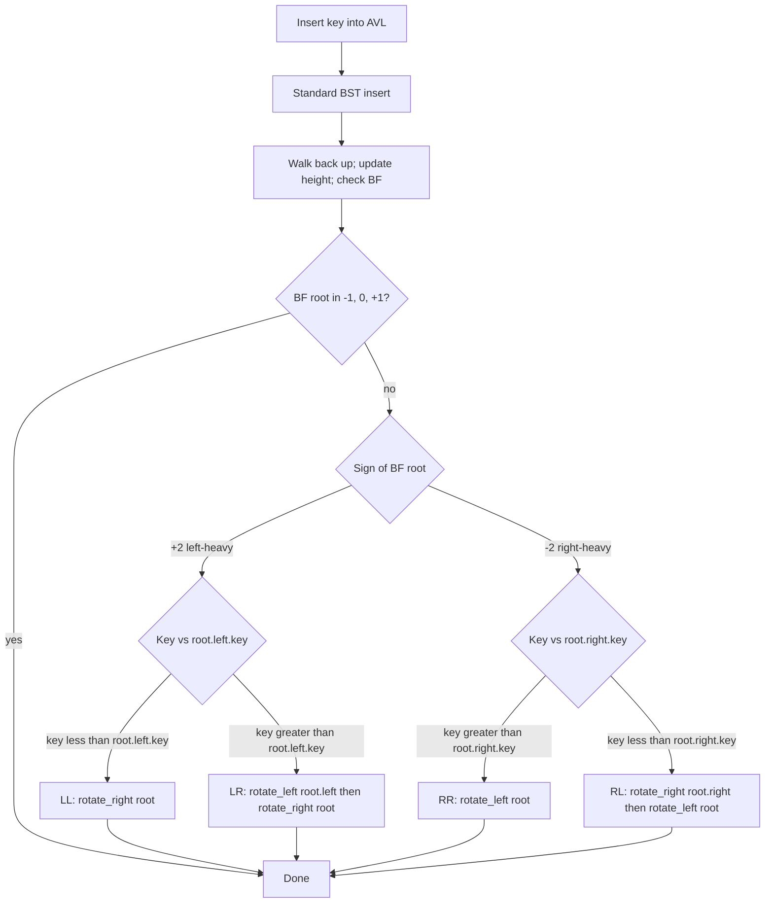
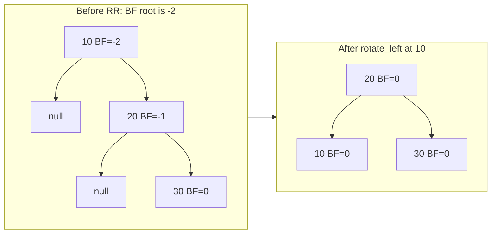

# AVL trees and rotations

Insert the keys 1, 2, 3, 4, 5, 6, 7 into a plain binary search tree, in that order, and you get a linked list. Seven nodes, height seven, every search a linear walk. The "tree" has no branching at all because every new key goes to the rightmost leaf. This is the moment a BST betrays you, and it's the entire reason the chapter exists.

Adelson-Velsky and Landis published the fix in 1962, in a four-page note in *Doklady Akademii Nauk SSSR*.[^1] Their idea is one rule and four rotations: at every node, the heights of the two subtrees may differ by at most 1. Maintain that invariant and tree height is provably bounded by `1.44 · log_2(n+2) - 0.328`,[^2] which is about 44 percent worse than a perfectly balanced binary tree and infinitely better than a linked list. Six decades later that same one-rule-four-rotations design sits underneath every standard-library ordered map you've ever used, in a slightly different dialect: Java's `TreeMap`, C++'s `std::map`, Python's `sortedcontainers`. The chapter that follows this one ([Red-black trees](./07-red-black-overview.md)) is the dialect.

This is a hard chapter. The four rotation cases are non-obvious from code alone; the LR / RL "double rotations" are where most readers first stumble. Work through the widget. Read the trace twice. The animation is the chapter.

## What an AVL tree actually promises

A plain BST guarantees that the in-order traversal is sorted. It promises nothing about height. The AVL refinement adds one constraint, applied to every node:

> The heights of the left and right subtrees differ by at most 1.

Encode that as a number. Define the **balance factor** of a node `x` as

```text
BF(x) = height(x.left) - height(x.right)
```

with `height(nil) = 0` and `height(leaf) = 1` (the convention this chapter uses; pick whichever you like, but pick one and stay there. Section 5.2 below is the bug that hits authors who don't.) The AVL invariant says `BF(x) ∈ {-1, 0, +1}` for every node. Once `|BF| > 1` somewhere, the tree is no longer AVL and you must rebalance.

A single insertion changes the height of any subtree by at most 1, so after one insert only the ancestors of the new leaf can possibly violate the invariant.[^3] Walk back up the recursion stack from the inserted leaf, recompute height, check `BF`. The first ancestor where `|BF| > 1` is the one to fix. Fix it with the right rotation and the subtree's height returns to what it was before the insert, so no ancestor further up notices anything happened.[^3] That last sentence is the load-bearing fact behind the next claim: insert performs O(1) total rotations, no matter how deep the tree.[^4]

## Four cases, decided by two questions

When you find the unbalanced ancestor (call it `root`), you ask two questions to pick the right rotation:

1. **Which side is heavy?** The sign of `BF(root)`. Positive means left-heavy; negative means right-heavy.
2. **Where on that heavy side did the new key land?** The outer subtree (LL or RR) or the inner one (LR or RL).

That gives a four-way dispatch:



*The four cases are one algorithm with a four-way dispatch, not four separate algorithms. The sign of `BF(root)` picks the heavy side; the key's position relative to the heavy child's key picks single-vs-double.*

The four-case names look intimidating until you read them as coordinates. **LL** means the new key landed in the LEFT child's LEFT subtree. **LR** means LEFT child's RIGHT subtree. **RR** and **RL** are the mirrors. Single rotations fix the "outer" cases (LL, RR) where the heavy chain is straight; double rotations fix the "inner" cases (LR, RL) where the heavy chain is bent.

## The single rotations: LL and RR

A right rotation around `y` takes `y`'s left child `x` and pivots it up to become the new subtree root. `y` demotes to `x`'s right child. `x`'s old right subtree (call it `t2`) re-anchors as `y`'s new left subtree. Three pointer rewires, two height updates, done.

```python
def _rotate_right(y):           # fixes LL
    x = y.left
    t2 = x.right
    x.right = y
    y.left = t2
    _update_height(y)           # update CHILD first
    _update_height(x)           # then PARENT
    return x                    # the new subtree root
```

The order of the height updates matters. `x`'s new height depends on `y`'s recomputed height, so update `y` first. Inverting that order gives `x` a stale height and the next ancestor's `BF` calculation goes wrong silently. No crash, no exception. The tree drifts out of balance. (Section 5.1 is what that bug looks like in the wild.)

`rotate_left` is the exact mirror: pivot the right child up, demote the parent down, re-anchor the inner subtree. The full implementation lives below.



*RR case: insert 10, 20, 30 in order. After 30 lands, root 10 has BF = -2; one `rotate_left` brings 20 up to root, 10 down to its left child, 30 stays as right child. Every BF returns to 0. The LL case is the perfect mirror.*

## The double rotations: LR and RL

The inner cases are subtler. Consider inserting 30, 10, 20: after 20 lands, root 30 has `BF = +2` (left-heavy) AND its left child 10 has `BF = -1` (right-heavy). The signs disagree, and a single right rotation around 30 produces a tree that is *still* unbalanced, just bent the other way.

The fix is two rotations:

1. `rotate_left(root.left)` to straighten the left subtree from the LR shape into the LL shape
2. `rotate_right(root)` to apply the standard LL fix

After step 1, the inserted key 20 has been promoted to be 30's left child, with 10 as 20's left child. Now the configuration is the LL case (left child is left-heavy with sign agreement), and step 2 is the same `rotate_right` you already wrote. RL is the mirror: `rotate_right` on the right child first, then `rotate_left` on the root.

The discriminator is sign agreement. Same sign on `BF(root)` and `BF(child)` means single rotation. Opposite signs mean double.[^5]

## The full insert routine

Walk back up the recursion stack, update height, dispatch:

```python
def insert(root, key):
    if root is None:
        return Node(key)
    if key < root.key:
        root.left = insert(root.left, key)
    elif key > root.key:
        root.right = insert(root.right, key)
    else:
        return root                                     # duplicate, ignored

    _update_height(root)
    bf = balance_factor(root)

    if bf >  1 and key < root.left.key:                 # LL
        return _rotate_right(root)
    if bf < -1 and key > root.right.key:                # RR
        return _rotate_left(root)
    if bf >  1 and key > root.left.key:                 # LR
        root.left = _rotate_left(root.left)
        return _rotate_right(root)
    if bf < -1 and key < root.right.key:                # RL
        root.right = _rotate_right(root.right)
        return _rotate_left(root)
    return root
```

**Solution** — Python ([Java](./06-avl-rotations/avl-insert/sol.java) · [C++](./06-avl-rotations/avl-insert/sol.cpp) · [Go](./06-avl-rotations/avl-insert/sol.go))

```python
# LC: none — chapter mechanic (AVL insert with rebalance)
from typing import Optional


class Node:
    __slots__ = ("key", "left", "right", "height")

    def __init__(self, key: int) -> None:
        self.key = key
        self.left: Optional["Node"] = None
        self.right: Optional["Node"] = None
        self.height = 1  # leaf: 1; height(None) := 0


def height(node: Optional[Node]) -> int:
    return node.height if node is not None else 0


def balance_factor(node: Node) -> int:
    # BF > 0 => left-heavy; BF < 0 => right-heavy.
    return height(node.left) - height(node.right)


def _update_height(node: Node) -> None:
    node.height = 1 + max(height(node.left), height(node.right))


def _rotate_right(y: Node) -> Node:           # fixes LL
    x = y.left
    assert x is not None
    t2 = x.right
    x.right = y
    y.left = t2
    _update_height(y)
    _update_height(x)
    return x


def _rotate_left(x: Node) -> Node:            # fixes RR (mirror of right)
    y = x.right
    assert y is not None
    t2 = y.left
    y.left = x
    x.right = t2
    _update_height(x)
    _update_height(y)
    return y


def insert(root: Optional[Node], key: int) -> Node:
    """Insert key into AVL rooted at root; return new root."""
    if root is None:
        return Node(key)
    if key < root.key:
        root.left = insert(root.left, key)
    elif key > root.key:
        root.right = insert(root.right, key)
    else:
        return root  # duplicates ignored

    _update_height(root)
    bf = balance_factor(root)

    if bf > 1 and root.left is not None and key < root.left.key:        # LL
        return _rotate_right(root)
    if bf < -1 and root.right is not None and key > root.right.key:     # RR
        return _rotate_left(root)
    if bf > 1 and root.left is not None and key > root.left.key:        # LR
        root.left = _rotate_left(root.left)
        return _rotate_right(root)
    if bf < -1 and root.right is not None and key < root.right.key:     # RL
        root.right = _rotate_right(root.right)
        return _rotate_left(root)
    return root
```

The shape comes from CLRS Problem 13-3(c).[^6] Insert as a plain BST, then on the way back up the call stack, recompute height and rebalance the first ancestor whose balance factor became ±2. Because `_update_height` sets the new height to `1 + max(left, right)` and the rotation primitives both call it, the height field stays consistent at every level, provided the rotation functions return their new root and you assign that return value to the recursive caller. (Section 5.4 is the bug for authors who forget that.)

The three pointer rewires inside each rotation are the entire mechanic. Memorize the picture, not the code: pivot up, parent down, inner subtree re-anchors. Once the picture is solid, the code writes itself.

## Watching all four cases

The widget animates all four rotation cases on hand-tuned 3-node insert sequences. Each preset starts empty, performs three inserts, and the third insert triggers exactly one rotation case. All four cases converge to the same balanced shape (root 20, 10 on the left, 30 on the right, height 2), which is the cleanest visual demonstration that the rotation cases are four routes to one outcome.

> **Interactive widget:** [BST operations and AVL rotations](../widgets/w-19-bst-rotations.yml) (panel `panel-avl`) — rendered on the website; the YAML spec describes the keyframes.

*Static fallback: four 7-step sequences, one per case. RR (insert 10, 20, 30): one `rotate_left` around 10 lifts 20 to root. LL (insert 30, 20, 10): mirror, one `rotate_right`. RL (insert 10, 30, 20): two rotations, `rotate_right(30)` then `rotate_left(10)`. LR (insert 30, 10, 20): mirror, `rotate_left(10)` then `rotate_right(30)`. All four end with root=20, left=10, right=30, BF(root)=0.*

The moment to watch is step 17 in the RL preset, where the trace pauses on the imbalance: `BF(10) = -2` and `BF(30) = +1`. That sign disagreement is the visible signal that a single rotation will not work; step 18 runs the inner rotation that *creates* sign agreement, and step 19 runs the outer rotation that resolves it.

## Why height stays small: the Fibonacci proof

The single load-bearing claim of the chapter is that AVL height stays in O(log n). The proof is a one-paragraph application of the Fibonacci recurrence and goes back to the original 1962 paper.[^1]

Let `T(h)` be the **minimum** number of nodes in any AVL tree of height `h`. We want to show that `T(h)` grows fast enough that `h` must be small relative to `n`.

A height-`h` AVL tree has a root with one subtree of height `h-1` (forcing the height) and one of height at least `h-2` (because subtree heights can differ by at most 1). To minimize the total node count, push the second subtree down to exactly `h-2`. That gives the recurrence

```text
T(h) = T(h-1) + T(h-2) + 1,    T(0) = 0,    T(1) = 1
```

which is the Fibonacci recurrence shifted by one: `T(h) = F(h+2) - 1`, where `F` is the standard Fibonacci sequence.[^2] Substituting Binet's closed form for `F(k)` and rearranging gives the height bound

```text
h ≤ log_φ(n + 2) - 0.328
  ≤ 1.4404 · log_2(n + 2) - 0.328
```

where `φ = (1 + √5) / 2 ≈ 1.618` is the golden ratio and `1.4404 = 1 / log_2(φ)`.[^2] For `n = 1,000,000` the worst-case AVL height is about 28, versus the perfect-binary-tree minimum of 20. The constant 1.44 is famous; it is exactly what the Fibonacci proof produces, not a hand-wave.

The trees that achieve this bound are called **Fibonacci trees**: the tree of height `h` whose left subtree is a Fibonacci tree of height `h-1` and whose right subtree is a Fibonacci tree of height `h-2`. They are the worst-case shape an AVL tree can take, and they are the reason the bound is `1.44 log n` rather than `log n`.

## What it actually costs

| Operation | Time worst | Space | Notes |
|---|---|---|---|
| Search | `O(log n)` | `O(1)` iterative; `O(log n)` recursive | Same as plain BST search; tighter because height is bounded.[^6] |
| Insert | `O(log n)` | `O(log n)` recursion | One BST descent, one retrace; **O(1) rotations total** per insert.[^4] |
| Delete | `O(log n)` | `O(log n)` recursion | Up to **O(log n) rotations** worst case; rebalance can propagate.[^2] |
| In-order traversal | `O(n)` | `O(h) = O(log n)` stack | Visits every node once.[^6] |

Two of those bounds need the proof. The `O(log n)` search and traversal bounds follow directly from the height bound above. The O(1)-rotations claim for insert is CLRS Problem 13-3(d): after the rebalance at the deepest unbalanced ancestor, the subtree's height returns to its pre-insert value, so no ancestor further up the path observes a change in `BF`, so no further rotation fires.[^4]

Delete is different. After the in-order-successor swap that handles the two-child case, the rebalanced subtree's height may *shrink* by 1, and that shrink can propagate all the way up the path. Each ancestor may need its own rotation. Worst case is `O(log n)` rotations for one delete, versus `O(1)` for one insert.[^2] This asymmetry is why the chapter spends its energy on insertion: the four rotation cases are identical in both directions, but insertion is where the algorithm shows its edge.

## How AVL compares to red-black

AVL is more strictly balanced than red-black. The AVL bound is `1.44 log_2(n+2)`; the red-black bound is `2 log_2(n+1)`.[^7] In ratio, AVL trees are about 28% shorter than red-black trees in the worst case. That makes AVL searches a few cache-line accesses faster on average.

The trade is on the write side. Red-black trees admit a wider class of valid shapes, which means insertion and deletion need to do less work to keep the tree in the valid set; rotations and recolors are cheaper to amortize.[^7] Production ordered-map implementations almost universally pick red-black for that reason: `java.util.TreeMap` is red-black; libstdc++'s `std::map` is red-black; `.NET`'s `SortedDictionary` is red-black. AVL shows up in workloads where lookups dominate writes, like read-heavy ordered indexes, in-memory routing tables, and some database internals.

The next chapter, [Red-black trees](./07-red-black-overview.md), covers the dialect difference in detail. Read this chapter first; the rotation primitives carry over unchanged.

## Where readers go wrong

> [!WARNING]
> **Forgetting to update node heights after a rotation.** The most natural way to write `_rotate_left` is to swap pointers and return. Height update is one extra line that's easy to skip. Without it, the rotated nodes keep stale `height` values, every subsequent `balance_factor` calculation at an ancestor reads the wrong number, and the tree drifts out of balance silently: no crash, no exception, just gradual `O(n)` degradation as enough inserts accumulate. The fix is to call `_update_height(child); _update_height(parent)` before returning from every rotation function, in that order: the parent's new height depends on the child's recomputed height.

> [!WARNING]
> **Returning the wrong node from a rotation.** Rotation functions return a *different* node than the one they were called with; that's the entire point. The recursive caller looks like `root.left = insert(root.left, key)`, which only works if `insert` (and transitively each rotation) returns the new subtree root. A rotation that mutates pointers and returns the old root compiles cleanly, runs without errors on the first few inserts, and then drops the rotated subtree on the floor when the next traversal walks past. Always assign `root = rotate_X(root)` at the call site, in every language. The reference Python, Java, C++, and Go above all return `Node` from every rotation; the recursive `insert` always assigns the return value back into `root.left` or `root.right`.

The two pitfalls beyond these are easy to remember once you've seen the rotations enough times: pick one convention for `height(leaf)` and `height(nil)` and document it (Sedgewick's leaf=1, nil=0 is the one this chapter uses; CLRS's leaf=0, nil=-1 also works); and read the four-case dispatch table as `(sign of BF, position of key)`, not as four independent algorithms.

## Where this leads

The AVL machinery in this chapter is the foundation for the next one. [Red-black trees](./07-red-black-overview.md) replaces the height-based invariant with a color-based one and trades a slightly looser balance for cheaper writes; the rotation primitives are exactly `_rotate_left` and `_rotate_right` from this chapter, unchanged. Past that, the production sorted-map APIs you actually call from application code (Java `TreeMap`, C++ `std::map`, Python `sortedcontainers`) hide red-black mechanics behind operations like `floorKey`, `ceilingKey`, `subMap`. Those operations get exercised in [Cache and design problems](../part-13-design-the-data-structure/00-lru-cache.md) once that chapter ships.

This is a foundation-and-mechanics chapter, so it ships with no problem ladder. AVL trees have no direct LeetCode problem; the closest is [LC 110 — Balanced Binary Tree](https://leetcode.com/problems/balanced-binary-tree/) (Easy), which tests whether a given tree *is* AVL-balanced rather than asking you to maintain the invariant under inserts. That problem is owned by [Binary tree fundamentals](./00-binary-tree-fundamentals.md). Mastery of this chapter is demonstrated by deriving the four rotation cases on a fresh 3-node insert sequence and explaining the height bound, not by solving an LC.

## References

[^1]: G. Bibliographic details cross-checked against the [NIST Dictionary of Algorithms and Data Structures entry for AVL tree](http://xlinux.nist.gov/dads/HTML/avltree.html).

[^2]: The height bound `h ≤ 1.4404 · log_2(n+2) - 0.328` is the closed-form consequence of the Fibonacci-tree recurrence `T(h) = T(h-1) + T(h-2) + 1`, derived in Donald E. Cross-referenced via the [Wikipedia "AVL tree" article](https://en.wikipedia.org/wiki/AVL_tree)

[^3]: A single insertion changes the height of any subtree by at most 1, so only the ancestors of the inserted leaf can possibly violate the invariant; the retracing loop terminates as soon as one rotation runs OR a node's BF reaches a value that absorbs the height change. [Wikipedia "AVL tree"](https://en.wikipedia.org/wiki/AVL_tree)

[^4]: Cormen, Leiserson, Rivest, Stein, *Introduction to Algorithms*, 4th ed. (MIT Press, 2022), Problem 13-3(d): AVL-INSERT performs O(1) total rotations because, after the rebalance at the deepest unbalanced ancestor, the subtree's height returns to its pre-insert value. Standard solutions documented at [walkccc.me CLRS §13.3](https://walkccc.me/CLRS/Chap13/Problems/13-3/).

[^5]: The same-sign-versus-opposite-sign dispatch is the cleanest formulation of the four cases. [Wikipedia "AVL tree"](https://en.wikipedia.org/wiki/AVL_tree)

[^6]: Cormen, Leiserson, Rivest, Stein, *Introduction to Algorithms*, 4th ed. (MIT Press, 2022).

[^7]: AVL trees are more rigidly balanced than red-black trees; the asymptotic ratio of maximal heights is approximately AVL/RB ≈ 0.720, citing Pfaff (2004) "Performance Analysis of BSTs in System Software," Stanford. [Wikipedia "AVL tree"](https://en.wikipedia.org/wiki/AVL_tree)
