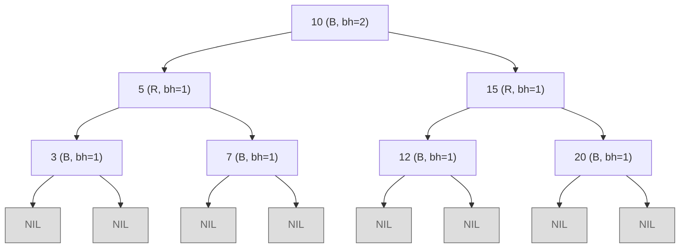
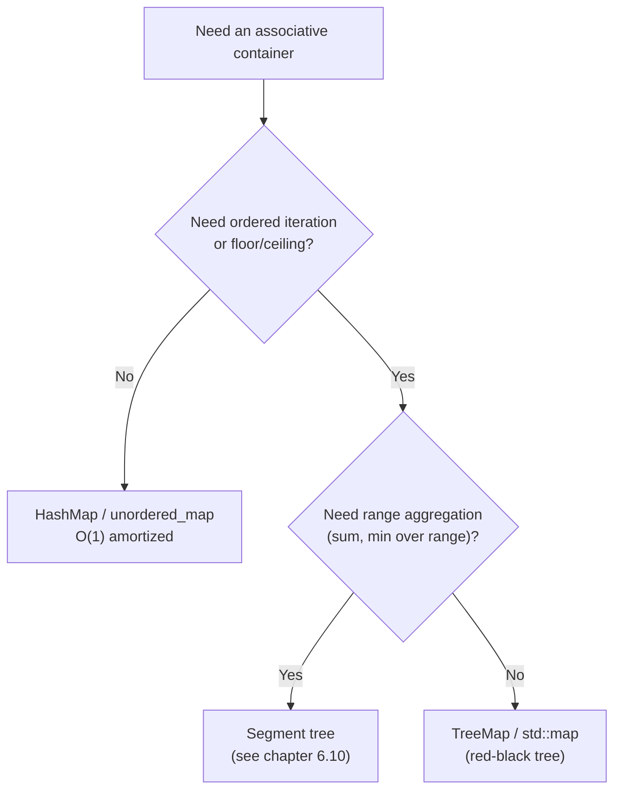

# Red-black trees: an overview

Java's `TreeMap`, C++ `std::map`, and the Linux kernel's task scheduler all sit on the same data structure: a red-black tree. The TreeMap Javadoc names it explicitly and credits Cormen, Leiserson, and Rivest's *Introduction to Algorithms* for the implementation. cppreference says `std::map` is "usually implemented as a Red-black tree" and every shipping STL (libstdc++, libc++, MSVC) does. The Linux Completely Fair Scheduler keeps every runnable task in a red-black tree keyed by virtual runtime, popping the leftmost node every context switch. Three of the most heavily-tested codebases in the world picked the same balanced BST for the same reasons.

Honest warning before you read further: writing a correct red-black insert and delete from scratch is famously bug-prone. CLRS spends Chapter 13 on it and breaks deletion into six cases that nobody types from memory.[^1] This chapter does not teach that. The goal here is the smaller and more useful one: the five invariants that pin the height bound, the AVL/RB trade-off that explains why the standard library picked RB, and the library mapping you reach for when an interview problem wants `O(log n)` floor and ceiling on top of `O(log n)` insert and delete. Read this once and you will recognize the pattern; if you ever need the case enumeration, CLRS §13.3 and §13.4 are waiting.

## What a red-black tree is

A red-black tree is a binary search tree where every node carries one extra bit of state: a color, red or black. The five invariants below, taken together, force the tree to stay roughly balanced through every insert and delete, and the rebalance cost is bounded by the height of the tree.

CLRS Chapter 13 states the invariants as five conditions on top of the BST ordering rule:[^1]

1. Every node is red or black.
2. The root is black.
3. Every leaf (the sentinel `NIL` node) is black.
4. If a node is red, both its children are black. No two reds in a row on any root-to-leaf path.
5. For each node, every simple path from that node to its descendant leaves contains the same number of black nodes. That count is the node's *black-height*.

Wikipedia and Sedgewick & Wayne drop the second invariant because the root can always be repainted black at the end of any operation, leaving only four real constraints. The case-analysis proofs are slightly cleaner with it kept; pick whichever framing your textbook uses.[^2]



*A 7-node red-black tree. The root has black-height 2 because every path from the root to a `NIL` crosses exactly two black nodes; the no-two-reds rule (invariant 4) plus equal black-height (invariant 5) bound the height.*

The data structure descends from Rudolf Bayer's 1972 "symmetric binary B-tree," a special order-4 case of a B-tree. Leo Guibas and Robert Sedgewick reformulated it in 1978 at Xerox PARC and called it red-black, reportedly because those were the colors of the laser printer they had access to.[^2] Every red-black tree is isomorphic to a 2-3-4 tree: a black node with two red children corresponds to a single 4-node, and the color flip operation that recolorings perform is the RB analog of a B-tree node split. Knowing this isomorphism is the cleanest way to remember why the invariants take the shape they do; you do not need to carry it past that.

## The height bound, in one inequality

The fact every reader should walk away with: a red-black tree on `n` keys has height `h ≤ 2 log₂(n + 1)`.[^1] Equivalently, the longest root-to-leaf path is at most twice the shortest.

The proof, sketched as CLRS Lemma 13.1 lays it out:[^1]

- By invariant 4, on any root-to-leaf path at most half the nodes are red.
- So if the root has black-height `bh(root)`, the height satisfies `h ≤ 2 · bh(root)`.
- A subtree rooted at a node with black-height `b` contains at least `2^b - 1` internal nodes (induction on `b`).
- Therefore `n ≥ 2^{h/2} - 1`, which rearranges to `h ≤ 2 log₂(n + 1)`.

The corollary is what makes the library types work: search, insert, and delete each descend or repaint along a single root-to-leaf path, so all three are `O(log n)` worst case.[^1] AVL trees do strictly better on the constant. Their worst-case height is around `1.44 log₂(n)`, about 0.72× the red-black bound, but RB's looser balance pays for itself elsewhere.[^3]

## Insert and delete, at survey level

The full case enumeration belongs to CLRS §13.3 and §13.4.[^1] Three facts are enough to reason about complexity and to read library source code without getting lost.

First, both operations start with a vanilla BST insert or delete. That part is unchanged.

Second, the rebalancing fixup is bounded. An insert needs at most two rotations plus a chain of recolorings that walks toward the root. A delete needs at most three rotations plus a similar recoloring chain. The recolorings are what propagate; the rotation count is constant.[^2]

Third, the amortized rebalance cost is `O(1)` per update, a result Tarjan proved in 1985, even though any single operation can cost `O(log n)` in the worst case.[^4] AVL trees do not share this property. Mehlhorn and Sanders observe that AVL deletion is `O(log n)` amortized because rebalancing after a delete can cascade up the tree.[^3] This single asymmetry is the load-bearing reason the JDK and the C++ STL ship RB rather than AVL: write-heavy and mixed workloads pay less rebalance overhead on RB.

## Choosing the library type

The decision flowchart for picking an associative container has three real branches.



*The first question is whether order matters. The second is whether you need to aggregate over a range, not just look up neighbors. Only when both answers come back "no aggregation, but yes ordering" does the red-black tree win.*

The four-language mapping is the single most useful table in this chapter. Memorize the signature for each language; an interviewer rarely cares which row you cite, only that you cite one without hesitation.

| Language | Library type | Standard library? | Notes |
|---|---|---|---|
| Java | `java.util.TreeMap`, `java.util.TreeSet` | Yes (`java.util`) | Documented as RB; algorithms adapted from CLRS.[^5] |
| C++ | `std::map`, `std::set`, `std::multimap`, `std::multiset` | Yes (`<map>`, `<set>`) | "Usually implemented as a Red-black tree" per cppreference; libstdc++, libc++, MSVC all ship RB.[^6] |
| Python | `sortedcontainers.SortedDict`, `SortedList` | No (third-party) | NOT internally an RB tree; Grant Jenks's implementation uses a sqrt-decomposed list of lists tuned for cache locality. Same `O(log n)` operational interface, different mechanism. Stdlib has no RB-backed sorted map.[^7] |
| Go | `github.com/google/btree` | No (third-party) | A B-tree, not RB, but the closest mainstream Go analog. Stdlib has no sorted-map type; a `sort.Search`-on-slice plus `map[K]V` is the in-interview fallback. |

Two of those rows have caveats worth flagging. Python's `SortedDict` is the right answer in an interview ("`O(log n)` operations, sorted iteration, exposes `bisect_left` / `bisect_right` for floor and ceiling"), but a candidate who claims it is internally a red-black tree has handed the interviewer an easy follow-up. The accurate phrasing is that it gives you the same operational interface. Go is in a similar place: `google/btree` is the production answer, but the data structure underneath is a B-tree, not an RB tree, and on modern hardware the higher-order B-tree's cache locality often wins.

The minimal Python form of the API:

```python
from sortedcontainers import SortedDict

d = SortedDict()
for k, v in [(5, "five"), (1, "one"), (10, "ten"), (3, "three"), (7, "seven")]:
    d[k] = v

first = d.keys()[0]                           # 1
last = d.keys()[-1]                           # 10
floor4 = d.keys()[d.bisect_right(4) - 1]      # 3, the largest key <= 4
ceiling4 = d.keys()[d.bisect_left(4)]         # 5, the smallest key >= 4
```

Java's `TreeMap` exposes the same operations as named methods: `firstKey()`, `lastKey()`, `floorKey(4)`, `ceilingKey(4)`. C++ `std::map` uses `begin()`, `rbegin()`, `upper_bound(4)` then decrement, and `lower_bound(4)`. The Java and C++ reference implementations live in the research notes for this chapter; the API shape is the chapter's takeaway, not the boilerplate.

## AVL versus red-black, in one paragraph

Both trees give you `O(log n)` worst-case search, insert, and delete. AVL is more rigidly balanced, so its lookup is slightly faster. Ben Pfaff measured AVL/RB ratios across 79 realistic test runs and found them ranging from 0.677 to 1.077, median 0.947, geometric mean 0.910.[^8] RB rebalances less aggressively, so its updates are cheaper, and its rebalance cost is `O(1)` amortized rather than `O(log n)` for AVL after deletion.[^3] The interview answer is short. Reads-only or read-mostly: AVL wins by a small constant. Mixed reads and writes: RB wins because it does less work per write. The standard library picked RB because the general-purpose `TreeMap` and `std::map` defaults face mixed workloads, and the constant-factor read penalty is under 10% in practice.

## A simpler variant: left-leaning red-black

Sedgewick's 2008 left-leaning red-black tree is a variant where every red link must lean left. The constraint compresses the case enumeration so that insert fits in 33 lines of Java instead of the 46 lines the standard formulation needs.[^9] LLRB makes the 1-to-1 correspondence with 2-3 trees explicit and is pedagogically cleaner. It has not displaced the classic Guibas-Sedgewick variant in production: Java's TreeMap and the C++ STL still ship the original. The reason to know LLRB exists is that some textbooks (notably Sedgewick & Wayne's *Algorithms*, 4th ed.) teach it instead of the classic version.[^9]

## What you actually need to remember

Three things, in order of weight:

- **The height bound.** `h ≤ 2 log₂(n + 1)`. Search, insert, and delete are `O(log n)` worst case because every operation walks one root-to-leaf path.
- **The library mapping.** Java `TreeMap`, C++ `std::map`, Python `sortedcontainers.SortedDict` (with the caveat), Go `google/btree` (with the caveat). When an interview problem needs sorted-iteration plus floor and ceiling on top of `O(log n)` updates, this is the type to name.
- **The AVL trade-off in one sentence.** AVL is stricter, so reads are faster; RB is looser, so writes are cheaper, with `O(1)` amortized rebalance per update versus `O(log n)` for AVL after deletion. The standard library picked RB.

The case-by-case insert and delete logic is not on this list. CLRS §13.3 and §13.4 own it, and you can read either section in an evening if you ever need to.[^1]

## Where this leads

[Tries](./08-tries.md) is the natural alternative when keys are strings and you want `O(L)` lookup keyed by length rather than `O(log n)` keyed by count. [Segment tree](./10-segment-tree.md) is the structure to reach for when the problem needs *aggregation* over a range (sum, min, max), not just floor and ceiling. And [Heaps and priority queues](./04-heaps-priority-queues.md) is where you go when the only ordering you need is min or max, not arbitrary neighbors.

## References

[^1]: Cormen, Leiserson, Rivest, Stein, *Introduction to Algorithms*, 4th ed., MIT Press, 2022.

[^2]: Wikipedia, "Red-black tree." Cited for the *History* section (Bayer 1972 "symmetric binary B-tree" precursor; Guibas and Sedgewick's 1978 paper "A Dichromatic Framework for Balanced Trees" at Xerox PARC), the four-property formulation, and the bounded-rotation count (≤ 2 per insert, ≤ 3 per delete). [en.wikipedia.org/wiki/Red-black_tree](https://en.wikipedia.org/wiki/Red%E2%80%93black_tree).

[^3]: Mehlhorn, Kurt; Sanders, Peter. *Algorithms and Data Structures: The Basic Toolbox*, Springer, 2008, Chapter 7 "Sorted Sequences," pp.

[^4]: Tarjan, Robert E. "Amortized Computational Complexity." *SIAM Journal on Algebraic and Discrete Methods* 6(2):306-318, April 1985.

[^5]: Oracle, "Class TreeMap (Java SE 21 & JDK 21)." [docs.oracle.com/en/java/javase/21/docs/api/java.base/java/util/TreeMap.html](https://docs.oracle.com/en/java/javase/21/docs/api/java.base/java/util/TreeMap.html).

[^6]: cppreference, "std::map." [en.cppreference.com/w/cpp/container/map](https://en.cppreference.com/w/cpp/container/map).

[^7]: Jenks, Grant. "Implementation Details — Sorted Containers documentation." [grantjenks.com/docs/sortedcontainers/implementation.html](https://grantjenks.com/docs/sortedcontainers/implementation.html).

[^8]: Pfaff, Ben. "Performance Analysis of BSTs in System Software." Stanford University, June 2004. [stanford.edu/~blp/papers/libavl.pdf](http://www.stanford.edu/~blp/papers/libavl.pdf).

[^9]: Sedgewick, Robert. "Left-leaning Red-Black Trees." 2008. [sedgewick.io/wp-content/themes/sedgewick/papers/2008LLRB.pdf](https://sedgewick.io/wp-content/themes/sedgewick/papers/2008LLRB.pdf).
