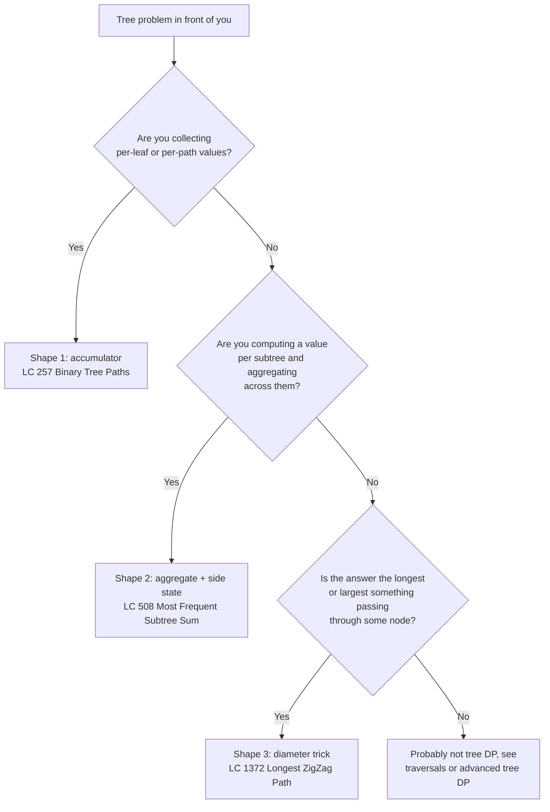
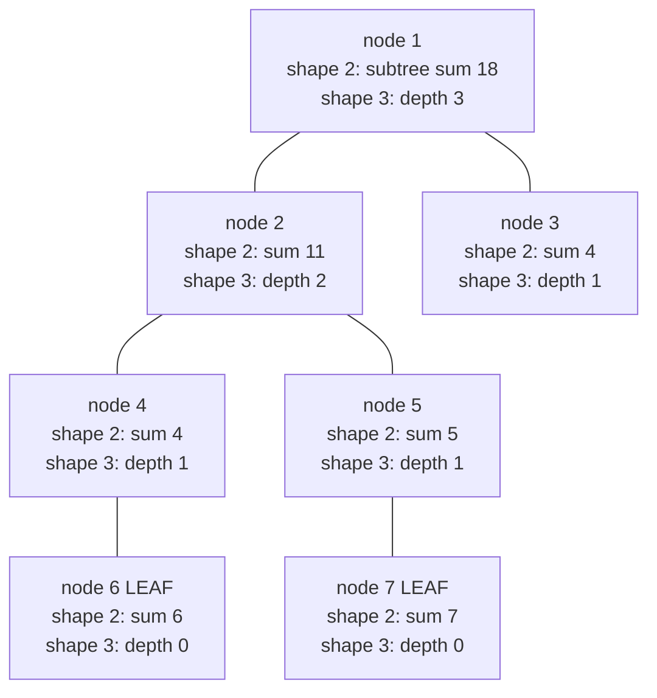

# Tree DP primer: post-order with side state

Three chapters back, every recursive helper on a tree returned exactly one thing: a height, a count, a Boolean. The function's return value carried the answer up the call stack, and the wrapper called the helper at the root and returned the result. Clean. Familiar. The shape every tree problem so far has fit into.

LC 1372 breaks that shape. The function asks for the longest *zigzag* path in a binary tree, meaning the longest run of nodes that alternates left, right, left, right (or right, left, right, left) without repeating a direction. A reasonable first instinct is to recurse, return "the longest zigzag below this node", and call it done. That instinct is wrong, and the way it's wrong is what this chapter is about. The longest zigzag a path can have *while passing through* this node is not the same number the parent needs to keep its own chain going. Two distinct numbers. One return slot. The recursion has to give the parent what it needs and *also* record the answer somewhere, and the somewhere is not the return value.

Tree DP is the family of recursions that solves this by splitting the channel. The helper's return type carries what the parent needs to combine; a closure-captured side state carries the global answer. Three reusable shapes cover almost every problem at LC Easy and Medium that fits the pattern. This chapter teaches all three. Heavier extensions, including handling negative subtrees, encoding state machines on the tree, and the marquee Hard problems like LC 124 Maximum Path Sum and LC 337 House Robber III, wait for [Tree DP advanced](../part-9-dynamic-programming/13-tree-dp.md).

## When this pattern fits

Reach for tree DP when a problem hands you a binary tree and asks for an answer that one of the three shapes below can produce. The decision flowchart is short.



*The chapter teaches three shapes. Multi-piece returns from each child are an extension of shapes 2 and 3, not a separate shape; the diameter trick already uses one when it returns a tuple.*

The pattern fails for problems that flip a subtree's contribution based on signed values (LC 124's `max(0, gain)` cutoff), problems that need a state machine attached to each node (LC 337 House Robber III's `(rob, skip)` pair, LC 968 Binary Tree Cameras' three-state DP), and problems where the "tree" is actually a graph with shared descendants. Those belong to other chapters. The three shapes here are deliberately small. Internalize them, and almost every Hard tree-DP problem in interview rotation reads as one of these shapes with a small twist.

## The three shapes share one skeleton

Every shape in this chapter is the same post-order helper with three knobs: what the helper returns, what side state the closure captures, and what the helper does at a leaf. The skeleton is one function:

```text
function helper(node):
    if node is null:
        return identity_for_this_problem
    left_result  = helper(node.left)
    right_result = helper(node.right)
    combined = combine(node.val, left_result, right_result)
    side_state.record(combined)         # or do nothing, depending on shape
    return what_parent_needs(combined)
```

That is the chapter. The three shapes below differ only in `identity_for_this_problem`, what `record` does, and what `what_parent_needs` returns. CLRS Problem 15-6, "Planning a company party", is the canonical textbook DP-on-tree exercise and fits the same skeleton: the recurrence `C[x] = max(sum_children(C), x.conviv + sum_grandchildren(C))` is exactly `combine`, and the runtime is O(n) because every node is visited once.[^1]



*One tree, two shapes computed at every node. Shape 2 (LC 508-style) returns the subtree sum and records every value in a hash counter. Shape 3 (LC 543/LC 1372-style diameter trick) returns the per-subtree depth and updates a global with the through-this-node composite.*

## Shape 1: accumulator on the call stack

The first shape is the simplest. The answer is a *collection* of per-path items (every root-to-leaf path, every path satisfying some property) and the helper threads the running collection down through a parameter, committing at every leaf. The canonical problem is LC 257 Binary Tree Paths.[^2]

The honest first attempt for LC 257 is brute-force concatenation: at every node, collect the paths from the left subtree, the paths from the right subtree, prepend the current node's value to each, and return. Correct. Also slow, because every prepend allocates a fresh list, and the total allocation is bounded by the sum of path lengths times the recursion depth, an `O(n·h)` allocation count with bad constants.

```python
# Brute force: paths are collected and rebuilt at every level
def binary_tree_paths_brute(root):
    if root is None:
        return []
    if root.left is None and root.right is None:
        return [str(root.val)]
    result = []
    for sub in binary_tree_paths_brute(root.left):
        result.append(f"{root.val}->{sub}")
    for sub in binary_tree_paths_brute(root.right):
        result.append(f"{root.val}->{sub}")
    return result
```

The fix is to flip direction. Pass the running path *down* through a parameter (a list that grows as we descend and shrinks as we ascend) and write to a closure-captured output list whenever the helper hits a leaf. The append-and-pop pair is what makes the algorithm O(total path length) instead of O(n·h) with allocation overhead per level.

```python
def binary_tree_paths(root):
    out = []
    if root is None:
        return out

    def walk(node, path):
        path.append(str(node.val))
        if node.left is None and node.right is None:
            out.append("->".join(path))
        else:
            if node.left is not None:
                walk(node.left, path)
            if node.right is not None:
                walk(node.right, path)
        path.pop()  # backtrack so siblings see a clean prefix

    walk(root, [])
    return out
```

**Solution** — Python ([Java](./09-tree-dp/lc-257/sol.java) · [C++](./09-tree-dp/lc-257/sol.cpp) · [Go](./09-tree-dp/lc-257/sol.go))

```python
# LC 257. Binary Tree Paths
"""LC 257. Return every root-to-leaf path as a list of "->"-joined strings.

Shape 1 of tree DP: accumulator-on-the-stack. The helper threads a running
path down through a parameter and commits to the closure-captured list at
every leaf. Backtracking on the way up keeps siblings independent.
"""
import sys
from dataclasses import dataclass
from typing import List, Optional


# DSH-04: raise the recursion limit once at module top so that deep tree
# inputs (LC 1372 caps at 50,000 nodes; LC 257's worst case is the same
# skewed-chain shape) don't hit CPython's default 1,000-frame ceiling.
sys.setrecursionlimit(10**6)


@dataclass
class TreeNode:
    val: int = 0
    left: Optional["TreeNode"] = None
    right: Optional["TreeNode"] = None


def binary_tree_paths(root: Optional[TreeNode]) -> List[str]:
    out: List[str] = []
    if root is None:
        return out

    def walk(node: TreeNode, path: List[str]) -> None:
        path.append(str(node.val))
        if node.left is None and node.right is None:
            out.append("->".join(path))
        else:
            if node.left is not None:
                walk(node.left, path)
            if node.right is not None:
                walk(node.right, path)
        path.pop()  # backtrack so siblings see a clean prefix

    walk(root, [])
    return out
```

The `path.pop()` line is load-bearing. Forget it and the right sibling sees the left sibling's path appended to its own, producing strings like `"1->2->4->5"` for what should be `"1->3->5"`. The pattern is the same in every language: Java's `StringBuilder.setLength(saved)`, C++'s `path.resize(saved)`, Go's `path` rebound by value at every recursive call. Pick one strategy per language and stick with it.

> [!IMPORTANT]
> A node with one null child is *not* a leaf. The leaf check is `node.left is None and node.right is None`, both clauses required. The naive shortcut "if the left child is null, this is a leaf" emits the path one level too early on a tree like `[1, null, 2]`, returning `["1"]` instead of the correct `["1->2"]`.

## Shape 2: post-order returns aggregate, side state accumulates

The second shape is the one this chapter spends the most time on. The answer is a *per-subtree aggregate* (every subtree's sum, every subtree's size, the most-frequent subtree sum across the whole tree) and the helper does two things at every node: it returns the aggregate the parent will combine, and it records that aggregate in a closure-captured collection. The canonical problem is LC 508 Most Frequent Subtree Sum.

LC 508 asks: given the root of a binary tree, return every subtree sum that appears the most often. Sample: the tree `[5, 2, -3]` produces three subtree sums (`2` from the left leaf, `-3` from the right leaf, and `4` from the whole tree, summing 5 + 2 + -3), each appearing exactly once. Tie. The answer is `[2, -3, 4]` in any order. The tree `[5, 2, -5]` produces sums `2`, `-5`, and `2` (because 5 + 2 + -5 = 2), so the mode is `2` with frequency 2 and the answer is `[2]`.

The recurrence writes itself. The sum of a subtree rooted at `node` is `node.val + sum(node.left) + sum(node.right)`, with the empty tree contributing 0. That's `combine`. What's new is `record`: every time the helper computes a subtree sum, it bumps a hash counter keyed on that sum. The mode of the counter at the end of the recursion is the answer.

```python
def find_frequent_tree_sum(root):
    if root is None:
        return []
    counts = Counter()

    def subtree_sum(node):
        if node is None:
            return 0
        s = node.val + subtree_sum(node.left) + subtree_sum(node.right)
        counts[s] += 1
        return s

    subtree_sum(root)
    best = max(counts.values())
    return [s for s, c in counts.items() if c == best]
```

**Solution** — Python ([Java](./09-tree-dp/lc-508/sol.java) · [C++](./09-tree-dp/lc-508/sol.cpp) · [Go](./09-tree-dp/lc-508/sol.go))

```python
# LC 508. Most Frequent Subtree Sum
"""LC 508. Return every subtree sum that ties for the highest frequency.

Shape 2 of tree DP: post-order returns aggregate, side accumulator records
every value the helper produces. The helper's return is what the parent
needs (the subtree sum); the answer lives in a separate channel (a Counter
keyed on every sum the recursion has ever produced).
"""
import sys
from collections import Counter
from dataclasses import dataclass
from typing import List, Optional


sys.setrecursionlimit(10**6)


@dataclass
class TreeNode:
    val: int = 0
    left: Optional["TreeNode"] = None
    right: Optional["TreeNode"] = None


def find_frequent_tree_sum(root: Optional[TreeNode]) -> List[int]:
    if root is None:
        return []

    counts: Counter[int] = Counter()

    def subtree_sum(node: Optional[TreeNode]) -> int:
        if node is None:
            return 0
        s = node.val + subtree_sum(node.left) + subtree_sum(node.right)
        counts[s] += 1
        return s

    subtree_sum(root)
    best = max(counts.values())
    return [s for s, c in counts.items() if c == best]
```

The reason this is *tree DP* and not just a recursion is the second channel. The helper's return value (`s`) is what its parent will use to compute its own subtree sum. The hash counter (`counts`) is where the answer to the original question lives. The two channels are independent. The wrapper at the bottom of the function never reads `subtree_sum(root)`; it reads `counts`. That separation is the chapter's central move, and it's the one that confuses readers coming from chapters where every recursive helper had a single return slot.

The combine step here is associative (addition), so the order of recursion doesn't matter and the analysis is clean. Each node is visited once, does O(1) work plus an amortized-O(1) hash insert, so total time is O(n).[^3] Space is O(n) for the counter (every subtree sum could be distinct in the worst case) plus O(h) for the recursion stack.

## Shape 3: the diameter trick

The third shape is the one named in the chapter's opening. The answer is "the longest or largest *something* passing through some node", where the something extends downward from any node, possibly turning at that node and continuing into the other subtree. The helper returns a per-subtree downward measure (a depth, a chain length); a closure-captured global takes the max with the through-this-node composite at every step. The classic example is LC 543 Diameter of Binary Tree, which the [Binary tree fundamentals](./00-binary-tree-fundamentals.md) chapter introduced as a stretch problem.[^1] LC 1372 Longest ZigZag Path is the same shape with one extra wrinkle.

LC 1372 asks for the longest zigzag path. A zigzag is a sequence of nodes where each step alternates direction (left, then right, then left, then right). The length is the number of nodes minus one, so a single node has length 0. Sample: on `[1, null, 1, 1, 1, null, null, 1, 1, null, 1]`, the answer is 3 (a four-node path going right, left, right).

The instinct that fails here is the same one that fails on LC 543: recurse, return "the longest zigzag below this node", and read that off the root. That number is wrong because the longest zigzag *might* pass through some internal node, with one half going down-left and the other half going down-right, and the wrapper at the root would never see it.

The diameter trick fixes the instinct in one move. Have the helper return the chain length the *parent* needs to keep its own zigzag going. At the same time, at every node the helper visits, update a closure-captured global with the longest zigzag *passing through this node*. Two channels. The helper's return is the parent's input; the global is the answer. There is one subtlety unique to LC 1372: a zigzag has direction. After visiting a node going leftward, the next step must go rightward; after visiting a node going rightward, the next step must go leftward. So the helper has to return *two* numbers, one for each entry direction.

```python
def longest_zig_zag(root):
    best = 0

    def helper(node):
        nonlocal best
        if node is None:
            return (-1, -1)
        _, left_right = helper(node.left)
        right_left, _ = helper(node.right)
        left_len  = left_right + 1   # zigzag entering me leftward, then turning right
        right_len = right_left + 1   # zigzag entering me rightward, then turning left
        local_best = left_len if left_len > right_len else right_len
        if local_best > best:
            best = local_best
        return (left_len, right_len)

    helper(root)
    return best
```

**Solution** — Python ([Java](./09-tree-dp/lc-1372/sol.java) · [C++](./09-tree-dp/lc-1372/sol.cpp) · [Go](./09-tree-dp/lc-1372/sol.go))

```python
# LC 1372. Longest ZigZag Path in a Binary Tree
"""LC 1372. Return the longest zigzag path length in a binary tree.

Shape 3 of tree DP (the diameter trick), composed with shape 4 (tuple
return). The helper returns a 2-tuple (left_extending, right_extending)
describing how far a zigzag chain entering this node from above can extend
in each direction. A closure-captured global takes the max with the
through-this-node composite at every step. The final answer lives in the
global, NOT in the helper's return value — that split is the chapter's
load-bearing insight.
"""
import sys
from dataclasses import dataclass
from typing import Optional, Tuple


sys.setrecursionlimit(10**6)


@dataclass
class TreeNode:
    val: int = 0
    left: Optional["TreeNode"] = None
    right: Optional["TreeNode"] = None


def longest_zig_zag(root: Optional[TreeNode]) -> int:
    if root is None:
        return 0

    best = 0

    def helper(node: Optional[TreeNode]) -> Tuple[int, int]:
        nonlocal best
        if node is None:
            return (-1, -1)  # sentinel: no chain to extend
        # Each child contributes the chain ending in the OTHER direction:
        # entering me leftward continues the parent's right-extending chain.
        _, left_right = helper(node.left)
        right_left, _ = helper(node.right)
        left_len = left_right + 1
        right_len = right_left + 1
        # Update the global BEFORE building the return tuple, so the
        # left-to-right argument evaluation order in max can never see
        # stale state (see §"Two pitfalls that bite", side-effect ordering).
        local_best = left_len if left_len > right_len else right_len
        if local_best > best:
            best = local_best
        return (left_len, right_len)

    helper(root)
    return best
```

Three details earn their place. First, the null sentinel `(-1, -1)`. Adding 1 to it gives 0, which is the correct chain length for a leaf (a single node, no edges traversed). Second, the helper takes the *opposite* direction's chain from each child: the left child contributes `left_right`, the chain that ended going right (because to enter me leftward, you came down from a parent on my left and continued into my left subtree, where the next step had to go right). The right child contributes `right_left` for the symmetric reason. Third, the global update happens at every node, leaves included. Skipping the leaf update is harmless on this problem because leaves contribute 0 to `best`, but it is a habit worth keeping; on adjacent problems, the leaf update is what catches the answer.

This chapter's most cited bug also lives on LC 1372. A reader, having seen the diameter pattern, writes the "obvious" line `self.longest = max(self.longest, 1 + self.helper(node.left)[1])`. Looks fine. Returns 1 instead of 2 on the sample input `[1, 1, null, 1, null, 1, null, null, 1]`. The reason is Python's argument evaluation order: `max(a, b)` reads `a` *first*, then evaluates `b`, then compares. The recursive call buried in `b` mutates `self.longest`. But `self.longest` was already read into the temporary holding `a` before the mutation ran, so `max` operates on stale data.[^2]

> [!WARNING]
> When the same line both reads and writes a global through a side-effecting recursive call, assign the recursive result to a named local first, then update the global. Skipping that step makes the algorithm depend on argument-evaluation order, which is a fragile thing to depend on. The Python reference does this explicitly: `local_best = ...` is computed first, then compared to `best`. Java, C++, and Go have the same evaluation hazard; the same fix applies.

## What it actually costs

| Shape | Time | Space | Notes |
|---|---|---|---|
| Shape 1 (LC 257 paths) | O(n + total path length) | O(n + total path length) | rendering paths is the dominant cost; balanced tree is O(n log n), skewed is O(n²) |
| Shape 2 (LC 508 sums) | O(n) expected | O(n + h) | hash counter is amortized O(1) per insert, n keys worst case |
| Shape 3 (LC 1372 zigzag) | O(n) | O(h) | one visit per node, O(1) work, no extra collection |

Variable definitions: `n` is the number of nodes; `h` is the height (`O(log n)` for balanced trees, `n - 1` for skewed).[^3] The shape-1 cost is worth a sentence of explanation. Many editorials report LC 257 as `O(n)`, which under-counts the per-leaf string render. With up to `O(n)` leaves and each path up to `h` characters, the rendering cost alone is `O(n·h)` worst case, collapsing to `O(n log n)` on balanced inputs. The balanced-tree number is what readers will see in practice.

The recursion-stack space deserves an extra note. CPython's default limit is 1,000 frames. LC 1372 caps at 50,000 nodes, and a worst-case skewed input recurses 50,000 levels deep. The Python reference raises the limit at module top-level with `sys.setrecursionlimit(10**6)`.[^4] Java, C++, and Go have larger default stacks (1 MB or more on most platforms), but the same skewed-input case still risks a stack overflow on adversarial test data. The `int[] best`, `int& best`, and closure-captured `best` idioms in the four reference implementations work around the same problem from a different angle: they keep the global out of class fields (Python: out of `self`) so the helper closes over a single mutable cell with no per-frame overhead.

## Two pitfalls that bite

> [!WARNING]
> **Returning the wrong channel.** A reader writes the diameter trick correctly, then returns `helper(root)` instead of the closure-captured global. The function returns the depth of the tree (or the right-extending chain at the root) rather than the diameter. The fix is one line: write the helper, then write the wrapper, and have the wrapper return the global. The helper's return is for the parent; the wrapper's return is for the user.

> [!WARNING]
> **Forgetting to backtrack on shape 1.** A reader writes `path.append(node.val)` on the way down, recurses, but forgets `path.pop()` on the way up. The right sibling inherits the left sibling's full path-to-leaf, and the output reports paths that don't exist in the tree. The bug surfaces immediately on any tree wider than one branch, and the fix is exactly one line.

A third trap is more subtle: assuming "the tree" can be any graph. The three shapes here rely on each subtree being independent of every other subtree, which holds for trees and breaks immediately on a graph with shared descendants or a cycle. If the input has either, the chapter you want is in [Part 8 Graphs](../part-8-graphs/00-graph-representation.md), not this one.

## Problem ladder

### CORE (solve all three to claim chapter mastery)

- [LC 257 — Binary Tree Paths](https://leetcode.com/problems/binary-tree-paths/) [Easy] • shape 1 accumulator
- [LC 508 — Most Frequent Subtree Sum](https://leetcode.com/problems/most-frequent-subtree-sum/) [Medium] • shape 2 aggregate + side state
- [LC 1372 — Longest ZigZag Path in a Binary Tree](https://leetcode.com/problems/longest-zigzag-path-in-a-binary-tree/) [Medium] • shape 3 diameter trick + tuple return ★

### STRETCH (optional)

- [LC 250 — Count Univalue Subtrees](https://leetcode.com/problems/count-univalue-subtrees/) [Medium] • shape 2 with a `(is_univalue, value)` tuple return *(LeetCode Premium; LC 508 in CORE is the free shape-2 problem)*

The CORE three exercise all three shapes once each. The chapter's signature problem (★) is LC 1372: the tuple return composes shape 3 (diameter trick) with the multi-piece return that shapes 2 and 3 both bend toward, and the side-effect-ordering pitfall is rooted on this exact problem. LC 543 Diameter of Binary Tree, the simpler diameter-trick exemplar, is owned by [Binary tree fundamentals](./00-binary-tree-fundamentals.md) as a stretch problem; readers who solved it there will recognize LC 1372 as the same shape with one direction-tracking twist on top.

The ladder spans Easy and Medium and stops there. The Hard tree-DP problems readers tend to ask about (LC 124 Maximum Path Sum, LC 337 House Robber III, LC 968 Binary Tree Cameras) all extend these three shapes with signed-value handling, state-machine returns, or both. Those live in [Tree DP advanced](../part-9-dynamic-programming/13-tree-dp.md) and are deliberately out of scope here. The chapter that owns them is the right place to learn the `max(0, gain)` cutoff, the `(rob, skip)` two-state return, and the three-state camera DP.

## Where this leads

The natural next step is [Tree DP advanced](../part-9-dynamic-programming/13-tree-dp.md). Three of its problems are direct extensions of what this chapter taught: LC 124 Maximum Path Sum is shape 3 plus the `max(0, child_gain)` cutoff that handles negative subtrees; LC 337 House Robber III is shape 2 with a `(rob_this, skip_this)` 2-tuple return; LC 968 Binary Tree Cameras is shape 2 with a three-state return. The reader who has internalized the three shapes here will recognize each of those as one shape plus a small twist, and the recurrence will draft itself.

Closer at hand, [BSTs](./05-binary-search-trees.md) uses a very similar two-channel pattern for in-order validation: a helper returns the subtree's `(is_bst, min, max)` tuple while a global accumulates whether the whole tree is a BST. Same skeleton, different combine step. And [Tries](./08-tries.md) uses the post-order template for a different purpose entirely (building a structural representation of a string set), but the muscle memory of "recurse into children, combine post-order" is what makes the chapter feel familiar instead of new.

## References

[^1]: Cormen, Leiserson, Rivest, Stein, *Introduction to Algorithms*, 4th ed., MIT Press, 2022, Problem 15-6 "Planning a company party". Verified via walkccc.me CLRS solutions, <https://walkccc.me/CLRS/Chap15/Problems/15-6/>.

[^2]: Stack Overflow Q79298842, "Leetcode 1372: Why do these two code snippets give different results?" 2024-12-21, +4 score answer by trincot, <https://stackoverflow.com/questions/79298842/leetcode-1372-why-do-these-two-code-snippets-give-different-results>.

[^3]: Cormen, Leiserson, Rivest, Stein, *Introduction to Algorithms*, 4th ed., Chapter 10 §10.4 "Representing rooted trees" (recursion-stack height bounds) and Chapter 11 §11.2 (hash-table expected-O(1) operations). OpenDSA *CS3 Data Structures and Algorithms* Chapter 7.3, <https://opendsa-server.cs.vt.edu/ODSA/Books/CS3/html/RecursiveDS.html>

[^4]: Python 3 docs, `sys.setrecursionlimit`, https://docs.python.org/3/library/sys.html#sys.setrecursionlimit.
