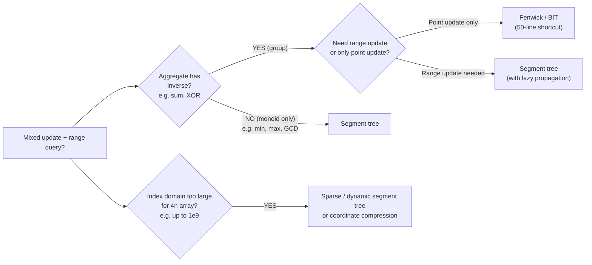
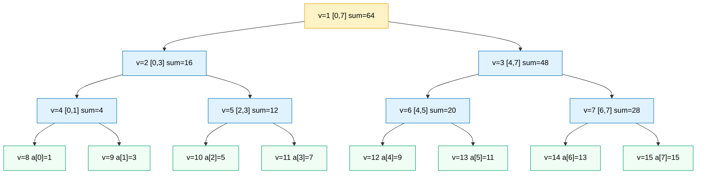

# Segment trees

A plain array gives you O(1) point updates and O(n) range sums. A prefix-sum array flips the trade: O(1) range sums, O(n) point updates because every prefix from `i` rightward needs patching. Pick either one and an interviewer who slides in a single `update(i, val)` call between two `sumRange(l, r)` calls has just turned your O(1) algorithm into a TLE.

The segment tree is the data structure that refuses to pick. Build, point update, and range query are all O(log n) on the same array, which is the only bound that survives the mixed-workload reading. The cost is roughly 4× the original array's memory, a recursive build, and the four-vertices-per-level proof that nobody guesses on the first read. This is the chapter most readers bounce off of. The widget is the chapter; work it through twice.

## Locating this pattern

Mixed update and range query is the trigger. What you do *next* depends on the aggregate and on whether the updates are point or range:



*Segment trees are the everything-tool; Fenwick trees are the specialized 50-line shortcut for prefix sums when inverses exist and only point updates are needed.*

LC 307 *Range Sum Query - Mutable* is the canonical signature: a constructor, an `update(index, val)`, a `sumRange(l, r)`, interleaved.[^1] LC 731 and LC 732 (the calendar problems) extend the same skeleton with range updates and a `max` aggregate over an enormous index domain. Those are the variants that pull in lazy propagation and dynamic allocation.[^2]

The Fenwick tree (binary indexed tree, BIT) is the cousin worth naming up front. When the aggregate is an additive group with inverses (sum, XOR) *and* updates are point-only, BIT does the same job in roughly fifty lines with smaller constants and better cache behavior.[^3] The moment the aggregate loses its inverse (min, max, GCD) or the updates go range-wide, BIT bows out and the segment tree takes over. Two slogans worth keeping: segment trees are the everything-tool; BIT is the specialized shortcut.

## What's stored, and where

The implicit-array layout is the trick that makes the rest of the chapter possible. Store the tree in a flat array `t[]` of size `4n`. The root lives at index 1; the children of vertex `v` are at `2v` and `2v + 1`, which mirrors the heap layout from [Heaps and priority queues](./04-heaps-priority-queues.md).[^4] What's *new* is that each vertex implicitly owns a contiguous index range `[tl, tr]` of the original array: the root owns `[0, n-1]`, its left child owns `[0, n/2]`, its right child owns `[n/2 + 1, n-1]`, and so on, halving until the leaves cover one element each.

The range is not stored in the node. It's passed in as parameters during recursion. That's the move that lets the tree fit in a flat array with no per-node bookkeeping.

A worked picture, on the array `[1, 3, 5, 7, 9, 11, 13, 15]`, with sum aggregate:



*Implicit-array indices `v` are shown next to each vertex; the leaves at `v=8..15` carry single elements, internal vertices carry partial sums, and the root carries the total `64`. Same `[1, 3, 5, 7, 9, 11, 13, 15]` array used by the chapter widget below.*

Two facts about the layout are worth pinning down before any code arrives. First: the tree has at most `2n - 1` real vertices when `n` is a power of two, but allocating `4n` slots is the rule. The geometric-series count `1 + 2 + 4 + ... + 2^{ceil(log2 n) + 1} - 1 < 4n` is the safe upper bound that keeps the index arithmetic clean even when `n` is not a power of two.[^4] Tightening to `2n` saves memory at the cost of computing the right-child index as `v + 2(mid - l + 1)` instead of `2v + 1`, which is exactly the kind of arithmetic readers get wrong under interview pressure. The 4× allocation is cheap insurance.

Second: the four-vertices-per-level bound is the load-bearing claim of the whole chapter. At every level of the tree, a query visits *at most four* vertices, no matter how the query range straddles the midpoints. That's why the query is O(log n) and not O(n). The proof is short enough to walk in §4 below; for now, take it on faith and keep reading.

## Build

The build is post-order: recurse left, recurse right, then combine the children's aggregates into the parent.

```python
def _build(self, nums, v, tl, tr):
    if tl == tr:
        self.tree[v] = nums[tl]
        return
    tm = (tl + tr) // 2
    self._build(nums, 2 * v, tl, tm)
    self._build(nums, 2 * v + 1, tm + 1, tr)
    self.tree[v] = self.tree[2 * v] + self.tree[2 * v + 1]
```

The split rule is the line every reader gets wrong at least once. Left child covers `[tl, tm]`. Right child covers `[tm + 1, tr]`. The boundary index `tm = (tl + tr) // 2` lives only in the left half. Three places use this rule: `_build`, `_update`, `_query`. All three must agree, or the recursion loses elements or never terminates.

The leaf base case fires when `tl == tr`. At that point the vertex covers a single index, the single value goes into `t[v]`, and the recursion unwinds. The internal case is the post-order combine: the children are already filled in by the time we read them.

Total work: each of the `2n - 1` internal-plus-leaf vertices is visited once with constant merge work, so build is O(n).[^4]

## Point update

`update(pos, new_val)` walks root-to-leaf along the unique path that contains `pos`, rewrites the leaf, and recombines on the way up.

```python
def _update(self, v, tl, tr, pos, new_val):
    if tl == tr:
        self.tree[v] = new_val
        return
    tm = (tl + tr) // 2
    if pos <= tm:
        self._update(2 * v, tl, tm, pos, new_val)
    else:
        self._update(2 * v + 1, tm + 1, tr, pos, new_val)
    self.tree[v] = self.tree[2 * v] + self.tree[2 * v + 1]
```

Each level partitions the array into disjoint vertex ranges, so `pos` falls into exactly one vertex per level. The descent visits one vertex per level, the recombine fires once per level on the way back up, and the tree height is `ceil(log2 n) + 1`. Total: O(log n) work, O(log n) recursion stack.[^4]

## Range query

`query(l, r)` is where the four-vertices-per-level proof kicks in. The function visits a vertex `v` covering `[tl, tr]` and one of three things happens:

1. **The query range is empty** (`l > r`). Return the identity (0 for sum). This is the early-exit guard.
2. **The query range matches the vertex range exactly** (`l == tl && r == tr`). Return `t[v]` directly. That's the answer for this whole subtree.
3. **The query range straddles the midpoint.** Split: recurse into the left child with the query clipped to `[l, min(r, tm)]`, and into the right child with the query clipped to `[max(l, tm + 1), r]`. Combine the two answers.

```python
def _query(self, v, tl, tr, l, r):
    if l > r:
        return 0
    if l == tl and r == tr:
        return self.tree[v]
    tm = (tl + tr) // 2
    return (self._query(2 * v, tl, tm, l, min(r, tm))
            + self._query(2 * v + 1, tm + 1, tr, max(l, tm + 1), r))
```

**Solution** — Python ([Java](./10-segment-tree/lc-307/sol.java) · [C++](./10-segment-tree/lc-307/sol.cpp) · [Go](./10-segment-tree/lc-307/sol.go))

```python
# LC 307. Range Sum Query - Mutable
from typing import List


class NumArray:
    def __init__(self, nums: List[int]):
        self.n = len(nums)
        self.tree = [0] * (4 * self.n)
        self._build(nums, 1, 0, self.n - 1)

    def _build(self, nums: List[int], v: int, tl: int, tr: int) -> None:
        if tl == tr:
            self.tree[v] = nums[tl]
            return
        tm = (tl + tr) // 2
        self._build(nums, 2 * v, tl, tm)
        self._build(nums, 2 * v + 1, tm + 1, tr)
        self.tree[v] = self.tree[2 * v] + self.tree[2 * v + 1]

    def update(self, index: int, val: int) -> None:
        self._update(1, 0, self.n - 1, index, val)

    def _update(self, v: int, tl: int, tr: int, pos: int, new_val: int) -> None:
        if tl == tr:
            self.tree[v] = new_val
            return
        tm = (tl + tr) // 2
        if pos <= tm:
            self._update(2 * v, tl, tm, pos, new_val)
        else:
            self._update(2 * v + 1, tm + 1, tr, pos, new_val)
        self.tree[v] = self.tree[2 * v] + self.tree[2 * v + 1]

    def sumRange(self, left: int, right: int) -> int:
        return self._query(1, 0, self.n - 1, left, right)

    def _query(self, v: int, tl: int, tr: int, l: int, r: int) -> int:
        if l > r:
            return 0
        if l == tl and r == tr:
            return self.tree[v]
        tm = (tl + tr) // 2
        return (self._query(2 * v, tl, tm, l, min(r, tm))
                + self._query(2 * v + 1, tm + 1, tr, max(l, tm + 1), r))
```

The clipping (`min(r, tm)` and `max(l, tm + 1)`) is the second line every reader gets wrong. Skip it and the child receives a query range that extends past the child's vertex range; the `l == tl && r == tr` exact-match check never fires, the recursion descends to leaves on every path, and the bound collapses from O(log n) to O(n).[^4]

## Why query is O(log n)

The four-vertices-per-level proof is the only non-obvious bound in the chapter, and the one most likely to be asked about by an interviewer who knows what they're doing.[^4]

By induction on the tree level. At level 0 only the root is visited. Inductively, suppose at most four vertices are visited at level `k`. Of those four, the "interior" ones (the ones whose entire range falls strictly inside `[l, r]`) terminate immediately with the exact-match return and make zero recursive calls. Only the leftmost and rightmost visited vertices at level `k` can split, because only they can straddle the boundary of the query range. Each of those splits into at most two children at level `k + 1`. So at most four vertices at level `k + 1`. The tree has `ceil(log2 n) + 1` levels, so the visited-vertex count is bounded by `4 (log2 n + 1) = O(log n)`.

The empty-range guard is what makes this clean. When `query(2v, tl, tm, l, min(r, tm))` is called with a query whose right end has been clipped past its left end, the call returns identity in O(1) without descending. The guard absorbs the half-empty splits the recursion structure produces, and the proof works.

## Worked example: build, update, query

The 8-element array `[1, 3, 5, 7, 9, 11, 13, 15]`, then `update(3, 6)` (changes index 3 from 7 to 6), then `sumRange(2, 5)`. Expected answer: `5 + 6 + 9 + 11 = 31`.

Build runs post-order across 30 steps: 8 leaf-sets and 7 internal combines for the n=8 case, with the recursion-enter halos counted as their own steps so the descent path is visible. The widget animates this directly.

Update walks four levels: descend `v=1 → v=2 → v=5 → v=11`, rewrite the leaf at `v=11` from 7 to 6, recombine on the way up so `v=5` becomes `5 + 6 = 11`, `v=2` becomes `4 + 11 = 15`, and `v=1` becomes `15 + 48 = 63`. Four touched vertices, exactly `log2(8) + 1` levels.

Query splits at the root: `[2, 5]` straddles `tm = 3`. Left child gets `[2, 3]`; right child gets `[4, 5]`. The left subtree recurses once more and exits on an exact match at `v=5` returning 11. The right subtree exits on an exact match at `v=6` returning 20. The two halves of the recursion that fell off the side of the query (the `v=4` and `v=7` calls) hit the empty-range guard and return 0 in constant time. Final answer: `11 + 20 = 31`.

> **Interactive widget:** [Segment tree (build / update / query)](../widgets/w-21-segment-tree.yml) (panel `default`) — rendered on the website; the YAML spec describes the keyframes.

*Static fallback: the widget animates 48 steps total (30 build + 9 update + 9 query). At step 29 the build is complete, with `t[1] = 64` at the root. At step 38 the update has finished and the four touched vertices on the index-3 root path carry their new sums. At step 47 the query returns 31, with the two hit vertices `v=5 (sum=11)` and `v=6 (sum=20)` highlighted in green and the empty-branch calls at `v=4` and `v=7` dimmed.*

The four-vertices-per-level bound is loose at the extremes. A query for `sumRange(0, 7)` exits in one step at the root: exact match, return 64. A query for `sumRange(3, 4)` is the worst case: it straddles the midpoint at every level, descends to two leaves, combines two single elements with two empty-range exits. Both extremes are O(log n); the constant under the big-O is what the proof bounds.

## What it actually costs

| Operation | Time | Space (extra) | Notes |
|---|---|---|---|
| `build(nums)` | `O(n)` | `O(n)` for the tree, `O(log n)` recursion | Master-theorem `T(n) = 2 T(n/2) + O(1)`.[^4] |
| `update(pos, val)` | `O(log n)` | `O(log n)` recursion | One vertex per level along the root-to-leaf path. |
| `sumRange(l, r)` | `O(log n)` | `O(log n)` recursion | Four-vertices-per-level proof above. |
| Tree storage | n/a | `4n` slots | Safe upper bound; `2n` is achievable with messier index math.[^4] |

The 4× memory is the price of the implicit-array layout. For LC 307's constraint `1 <= nums.length <= 3 * 10^4`, that's 120,000 ints in Java, well under any limit that matters. The constant in the time bound is the `4 log n` from the four-vertices proof, which at `n = 30000` is roughly 60 vertex visits per query, competitive with the BIT's roughly 15 prefix-tree updates per query given that segment-tree code is doing a few more operations per vertex. The trade-off is generality, not raw speed.

A note on textbook coverage. CLRS 4th ed. (2022) does not present the array-backed segment tree as a named data structure; its closest neighbor is the interval tree of §17.3, which augments a red-black tree to answer stabbing queries in O(log n) but does not support point updates of an underlying array's values.[^5] de Berg et al.'s *Computational Geometry* §10.3 covers segment trees in their geometric form (a canonical-subset tree for `n` stored intervals using `O(n log n)` storage), which is what Wikipedia describes; that's a different structure from the competitive-programming array tree taught here.[^6] CP-Algorithms is the canonical primary source for the form in this chapter.[^4]

## When the structure bends

The chapter's skeleton handles a much wider family than just sum queries. Three variants worth knowing the shape of:

**Min, max, GCD, XOR, modular sum.** Swap the merge function and the leaf identity, and you have a min-segment-tree, a max-segment-tree, or a GCD-segment-tree. Sum: `merge = +`, identity 0. Min: `merge = std::min`, identity `+inf`. Max: `merge = std::max`, identity `-inf`. The skeleton is identical; only two lines change.[^4] This is the "segment tree on a monoid" generalization: any associative binary operation with an identity instantiates the structure for free.

**Lazy propagation for range updates.** When the update applies to a whole range (`add x to every a[l..r]`, `assign p to every a[l..r]`), each internal vertex carries a `lazy[v]` slot holding a deferred update that has not yet been pushed to its children. Before recursing past a vertex, a `push(v)` call drains the lazy buffer one level down: the parent's pending update is applied to both children and the parent's lazy slot is cleared. The trick is that updates *only apply to a node if the entire range is covered*; otherwise the lazy gets pushed down and we descend. LC 731 *My Calendar II* (range +1 on `[start, end)` plus max-overlap query) is the canonical signature.[^2] The full mechanics are deferred to a Part 13 advanced data-structures chapter; the sketch is enough for this chapter.

**Dynamic / sparse trees for huge index domains.** When the index domain is `[0, 10^9]` but the working set of touched indices is small, allocating `4n` slots upfront is impossible. The dynamic variant pointer-allocates internal vertices the first time they're visited; CP-Algorithms calls this the "implicit segment tree" pattern.[^4] LC 732 *My Calendar III* needs this directly: coordinates run up to `10^9`, so either coordinate-compress the input upfront or build the tree lazily.[^2] The chapter teaches the trigger; the deep dive lives in Part 13.

## Where readers go wrong

> [!WARNING]
> **Allocating `2n` instead of `4n`.** Readers count "the tree has `2n - 1` vertices" (true for the perfect-binary-tree case when `n` is a power of two) and translate that into a `2n` allocation. When `n` is not a power of two the right-child recursion at `2v + 1` can exceed `2n` and the build segfaults or throws. The fix is `tree = new int[4 * n]`; the slack covers the implicit-array gaps.[^4]

> [!WARNING]
> **Off-by-one between `tm` and `tm + 1`.** The left child covers `[tl, tm]` (inclusive), the right child covers `[tm + 1, tr]` (inclusive); the boundary index `tm` lives only in the left half. Writing `build(2*v + 1, tm, tr)` instead of `build(2*v + 1, tm + 1, tr)` makes the children's ranges overlap by one cell, the build silently double-counts that cell, and queries return wrong answers. Three places in the code use the rule (`build`, `update`, `query`); get all three consistent.

> [!WARNING]
> **Forgetting the `min(r, tm)` / `max(l, tm + 1)` clipping in `query`.** The recursive calls hand the child a query range that extends past the child's vertex range, the `l == tl && r == tr` check never matches, and the recursion descends to leaves on every path. Result: stack overflow on small inputs, or O(n) query on large ones. The clipping plus the empty-range guard is what gives the four-vertices-per-level proof its empty halves to absorb.[^4]

> [!WARNING]
> **Treating LC 307 like LC 303 (immutable) and reaching for prefix sums.** LC 303 trains readers on prefix sums and sits one problem number before LC 307; the API differs by a single `update` method.[^1] Prefix sums give O(n) updates because every prefix from `i` rightward needs patching; LC 307's test suite times out on the update-heavy cases. The moment the API has both `update` and `sumRange`, the right answer is segment tree or BIT.

## Problem ladder

### CORE (solve all three to claim chapter mastery)

- [LC 307 — Range Sum Query - Mutable](https://leetcode.com/problems/range-sum-query-mutable/) [Medium] • segment-tree-point-update-range-query ★
- [LC 731 — My Calendar II](https://leetcode.com/problems/my-calendar-ii/) [Medium] • segment-tree-range-update-with-lazy *(reference: Python only)*
- [LC 732 — My Calendar III](https://leetcode.com/problems/my-calendar-iii/) [Hard] • dynamic-segment-tree-range-update *(reference: Python only)*

### STRETCH (optional)

- [LC 729 — My Calendar I](https://leetcode.com/problems/my-calendar-i/) [Medium] • segment-tree-point-conflict-check
- [LC 218 — The Skyline Problem](https://leetcode.com/problems/the-skyline-problem/) [Hard] • sweep-line-with-heap-or-segtree

The natural Easy candidate, LC 303 *Range Sum Query - Immutable*, is locked to [Prefix sums and difference arrays](../part-3-pointers-window-prefix/04-prefix-sums.md) as that chapter's signature problem.[^1] Per the registry's "each LC appears as CORE in exactly one chapter" rule, this chapter ships M/M/H with the `no-easy-canonical` flag. No other Easy LC genuinely teaches segment trees over prefix sums.

## Where this leads

The deep-dive treatment of lazy propagation, persistent trees, dynamic / sparse trees, and 2D segment trees is a Part 13 advanced data-structures chapter; the signal here is "you've seen the trigger; the full mechanics are one chapter forward." The closer cousin is the Fenwick tree, which the framing decision flowchart up top points to whenever the aggregate has an inverse and updates are point-only: fewer lines of code, smaller constants, narrower applicability. [Heaps and priority queues](./04-heaps-priority-queues.md) shares the implicit-array layout trick from §"What's stored, and where", which is why the heap chapter is a hard prerequisite for this one.

## References

[^1]: LeetCode 307, "Range Sum Query - Mutable." Constraints: `1 <= nums.length <= 3 * 10^4`, `-100 <= nums[i] <= 100`, up to `3 * 10^4` calls to `update` and `sumRange`. [leetcode.com/problems/range-sum-query-mutable](https://leetcode.com/problems/range-sum-query-mutable/)

[^2]: LeetCode 731, "My Calendar II" (Medium) and LeetCode 732, "My Calendar III" (Hard). [leetcode.com/problems/my-calendar-ii](https://leetcode.com/problems/my-calendar-ii/)

[^3]: Peter M. [cp-algorithms.com/data_structures/fenwick.html](https://cp-algorithms.com/data_structures/fenwick.html).

[^4]: CP-Algorithms, "Segment Tree." <https://cp-algorithms.com/data_structures/segment_tree.html>

[^5]: Cormen, Leiserson, Rivest, Stein, *Introduction to Algorithms*, 4th ed., MIT Press, 2022, §17.3 "Interval trees." The CLRS interval tree is augmented from a red-black tree and answers stabbing queries in O(log n); it's a different structure from the array-backed segment tree taught in this chapter.

[^6]: de Berg, M., van Kreveld, M., Overmars, M., Schwarzkopf, O., *Computational Geometry: Algorithms and Applications*, 3rd ed., Springer-Verlag, 2008, §10.3 "Segment Trees." The geometric formulation: a canonical-subset tree for `n` stored intervals with `O(n log n)` storage and `O(log n + k)` reporting query, distinct from the array-backed structure in this chapter.
