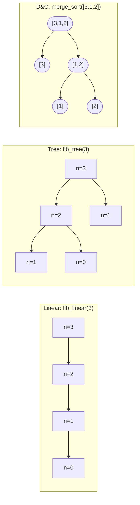

# Recursion patterns: linear, tree, and divide-and-conquer

Recursion is the chapter most readers bounce off of, and not because the syntax is hard. The syntax is the same syntax you wrote in [The recursion mental model](../part-0-foundations/02-recursion-mental-model.md): a base case, a recursive case, a function that calls itself. Trouble shows up later. You write `def fib(n): return fib(n-1) + fib(n-2)`, watch it crawl on `fib(35)`, write `def fact(n): return n * fact(n-1)` with the obvious base case, and that one runs instantly. Same shape on the page. Wildly different cost at runtime. Nothing on the screen explains why.

The gap is shape. Not the shape of the *code* but the shape of the *call tree* the code unfolds into. A function that calls itself once per frame draws a chain. Two self-calls per frame draws a binary tree. Halving the input and recursing on both halves draws a balanced tree with combine work at every internal node. Three call shapes, three complexity classes, one set of `def` keywords. The whole job of this chapter is to teach you to look at a recursive function and read which tree it draws, because that's the difference between an algorithm that runs in linear time and one that runs in exponential time, and the two are often four lines of code apart.

## What "shape of the recursion" means

Read the recurrence, not the syntax. When you see a recursive call, ignore the language for a moment and write down the relationship between the cost at size `n` and the cost at the smaller size the call descends to. That relationship is the recurrence, and it tells you which of three shapes you have.

| Recurrence | Shape | Total cost |
|---|---|---|
| `T(n) = T(n-1) + O(1)` | Linear (chain) | `Theta(n)` |
| `T(n) = T(n-1) + T(n-2) + O(1)` | Tree | `Theta(phi^n)`, exponential |
| `T(n) = a*T(n/b) + f(n)` with `b > 1` | Divide-and-conquer | Master-theorem dependent |

Knuth treats the second shape, the Fibonacci recurrence, as the canonical tree-recursion exemplar in *The Art of Computer Programming* Vol. 1 §1.2.8.[^1] The third shape is the master-theorem family Cormen, Leiserson, Rivest, and Stein cover in *Introduction to Algorithms* Chapter 4.[^2] The first shape is what you get when the recursion is, structurally, a `for` loop dressed up in stack frames.

The key distinction the syntax hides: the second and third shapes both have *two* recursive calls in the function body. They look identical at a glance. They're not. Tree recursion has subproblem size `n - 1` (subtractive); divide-and-conquer has subproblem size `n/2` or `n/3` or `n/b` (divisive). The master theorem applies to one and not the other.[^3] Wikipedia's master-theorem article calls this out under "Inadmissible equations" for exactly this reason: people reach for it on Fibonacci-shaped recurrences and get the wrong answer.



*Three call shapes at the same small input. Linear collapses to a depth-`n` chain. Tree branches at every internal node, with subproblem size shrinking by 1. Divide-and-conquer branches but the subproblem size halves at every step, and the combine step on the way up does meaningful work.*

## Linear: one self-call per frame

The signature: one recursive call in the function body, descending by a constant. The recurrence `T(n) = T(n-1) + O(1)` telescopes to `Theta(n)` time. Total frames `n`. Stack depth `n`. Combine work per frame `O(1)`. This is the shape factorial has, the shape iterative-style list traversal has when written recursively, the shape recursive Euclidean GCD has, and the shape an accumulator-based Fibonacci has.

```python
def fib_linear(n: int, a: int = 0, b: int = 1) -> int:
    if n == 0:
        return a
    return fib_linear(n - 1, b, a + b)
```

`fib_linear(30)` does 30 recursive calls and one addition per call. The `(a, b)` accumulator pair carries the running Fibonacci pair down the chain, so each frame's contribution is constant. The recursion tree is a path; there's no branching, no redundancy, nothing to optimize away.

Erickson's *Algorithms* names this shape directly in Chapter 1: a linear recursion is a tail-recursive idiom in disguise, where the recursion is doing the job of a `for` loop one frame at a time.[^4] The catch is that the disguise is expensive in the wrong runtimes. The next-to-last section of this chapter covers why.

## Tree: two self-calls per frame

Two recursive calls in the function body, each descending by a constant. The recurrence `T(n) = T(n-1) + T(n-2) + O(1)` has the same characteristic equation as the Fibonacci numbers themselves; Knuth's pinpoint analysis gives `T(n) = O(phi^n)` where `phi` is the golden ratio, about `1.618`.[^1]

```python
def fib_tree(n: int) -> int:
    if n < 2:
        return n
    return fib_tree(n - 1) + fib_tree(n - 2)
```

`fib_tree(30)` does roughly `phi^30` recursive calls, about `1.6` million. `fib_tree(35)` does about `phi^35`, around `24` million. `fib_tree(50)` is hopeless. The damage is not depth; the depth of the call tree is still only `n`. The damage is *node count*. Look at the diagram above: `fib_tree(3)` calls `fib_tree(1)` twice. `fib_tree(4)` would call `fib_tree(2)` twice and `fib_tree(1)` three times. `fib_tree(5)` calls `fib_tree(3)` twice, `fib_tree(2)` thrice, `fib_tree(1)` five times. The redundancy compounds.

Two consequences worth naming. First: tree recursion is *not* the same as exponential recursion. Memoization collapses the redundancy by caching each subproblem's answer the first time it's computed, so the second visit to `fib_tree(2)` is `O(1)` instead of another full subtree walk. The memoized form is `Theta(n)` time, same as the linear version. Chapter 9.0 builds the recursion-to-memoization lift formally; here it's enough to notice the lift exists.

Second: the *depth* of a tree recursion grows linearly even when the *work* grows exponentially. Stack space at peak is `Theta(n)`, not `Theta(phi^n)`. The 24 million calls in `fib_tree(35)` are spread across time, not across the stack. You don't need 24 million frames at once; you need 35 frames at peak depth and 24 million calls in total over the run.

That depth-vs-work split is the second-most important reading skill in this chapter, after the recurrence itself. It's also why backtracking, the next chapter's topic, is tractable: the call tree is exponential in width but only linear in depth, so the stack stays bounded and the time cost is paid one path at a time.

## Divide-and-conquer: split, recurse, combine

Two recursive calls again, but each on a subproblem of size `n/b` for some `b > 1`. Plus genuine combine work `f(n)` at each internal node. The recurrence is `T(n) = a*T(n/b) + f(n)`. The master theorem covers most of the cases that show up in practice.[^2][^3]

```python
def merge_sort(nums: list[int]) -> list[int]:
    if len(nums) <= 1:
        return nums[:]
    mid = len(nums) // 2
    left  = merge_sort(nums[:mid])
    right = merge_sort(nums[mid:])
    return _merge(left, right)
```

**Solution** — Python ([Java](./00-recursion-patterns/sol.java) · [C++](./00-recursion-patterns/sol.cpp) · [Go](./00-recursion-patterns/sol.go))

```python
# Chapter 7.0 — Recursion patterns: linear, tree, and divide-and-conquer
# merge_sort canonical cases pass.
import sys
from functools import lru_cache
from typing import List

# CPython default recursion limit is 1000; bump for deep traces and tree recursion.
sys.setrecursionlimit(10**6)


# Shape 1: linear recursion. One self-call per frame, depth n, work O(n).
# Tail-recursive form; CPython does NOT eliminate tail calls.
def fib_linear(n: int, a: int = 0, b: int = 1) -> int:
    """Linear recursion: T(n) = T(n-1) + O(1)."""
    if n == 0:
        return a
    return fib_linear(n - 1, b, a + b)


# Shape 2: tree recursion. Two self-calls per frame; T(n) = T(n-1) + T(n-2) + O(1).
# Total frames Theta(phi^n) where phi is the golden ratio (~1.618).
def fib_tree(n: int) -> int:
    """Un-memoized tree recursion: exponential without a cache."""
    if n < 2:
        return n
    return fib_tree(n - 1) + fib_tree(n - 2)


# Shape 2 collapsed to linear via memoization. The bridge to chapter 9.0.
@lru_cache(maxsize=None)
def fib_memo(n: int) -> int:
    """Tree recursion + memo: each subproblem computed once, total Theta(n)."""
    if n < 2:
        return n
    return fib_memo(n - 1) + fib_memo(n - 2)


# Shape 3: divide-and-conquer. Split, recurse on halves, combine.
# T(n) = 2T(n/2) + Theta(n) -> Theta(n log n) by master theorem case 2.
def merge_sort(nums: List[int]) -> List[int]:
    """Divide-and-conquer sort: split in half, recurse, merge."""
    if len(nums) <= 1:
        return nums[:]
    mid = len(nums) // 2
    left = merge_sort(nums[:mid])
    right = merge_sort(nums[mid:])
    return _merge(left, right)


def _merge(left: List[int], right: List[int]) -> List[int]:
    out: List[int] = []
    i = j = 0
    while i < len(left) and j < len(right):
        if left[i] <= right[j]:
            out.append(left[i]); i += 1
        else:
            out.append(right[j]); j += 1
    out.extend(left[i:]); out.extend(right[j:])
    return out


# Canonical chapter entrypoint.
def fib(n: int) -> int:
    return fib_memo(n)
```

Merge sort gives `T(n) = 2*T(n/2) + Theta(n)`. The two recursive calls each handle half the input; the merge step walks both halves once. Master theorem case 2: `a = 2`, `b = 2`, `f(n) = n`, the critical exponent `c_crit = log_2(2) = 1`, and `f(n) = Theta(n^1)` matches, so `T(n) = Theta(n log n)`. The `log n` factor is the depth of the recursion tree (`log_2 n` levels because the input halves at each level); the `n` factor at each level is the merge work. Multiply and you get `n log n`.

Three other divide-and-conquer recurrences worth recognizing. Binary search, `T(n) = T(n/2) + Theta(1)`: case 2 with `a = 1`, gives `Theta(log n)`. Balanced binary-tree traversal, `T(n) = 2*T(n/2) + Theta(1)`: case 1, gives `Theta(n)` because the constant combine is dominated by the leaf count. Recursive binary exponentiation, `pow(x, n) = pow(x*x, n/2)` for even `n`: case 2 with `a = 1`, `Theta(log n)`. That's the algorithm [Math for interviews](../part-0-foundations/04-math-for-interviews.md) covers as Pow(x, n).

What separates divide-and-conquer from tree recursion isn't "two recursive calls"; both have that. It's the size reduction. Subtractive (`n - 1`, `n - 2`) is tree recursion; divisive (`n/2`, `n/3`) is divide-and-conquer. Reach for the master theorem only when the subproblem size shrinks by a factor.

## Mutual and tail recursion: the variants worth naming

Two more shapes that show up enough to need names, but neither warrants its own H2.

**Mutual recursion.** Function `A` calls `B`, `B` calls `A`, both have base cases. The classic example is a recursive-descent parser where `parseExpr` calls `parseTerm` calls `parseExpr`, with grammar rules that bottom out on tokens. Termination still requires that some well-founded measure decreases on every back-and-forth, often the input length consumed so far. Correctness proofs need simultaneous induction over both functions because neither's correctness can be established without assuming the other's.

**Tail recursion.** The recursive call is the very last action, with no surrounding work waiting to combine the answer: `return f(...)` rather than `return n * f(...)`. The `fib_linear` above is tail-recursive; the textbook `factorial(n) = n * factorial(n-1)` is not. A compiler that performs tail-call elimination can reuse the current frame instead of pushing a new one, dropping space from `Theta(n)` to `Theta(1)`. None of Python, Java, or Go does this. Guido van Rossum rejected tail-call elimination in CPython explicitly back in 2009: tail-call optimization breaks stack traces and would let "developers write code that depends on it" non-portably.[^5] Java's HotSpot doesn't optimize self-tail recursion either. C++ may under `-O2`, but the language standard does not require it.

Tail recursion in interview-relevant languages is therefore a presentation choice, not a space optimization. Treat it as a clarity-flavored idiom and rewrite it as an explicit loop when the recursion would actually go deep enough to matter.

## What it actually costs

The three shapes have distinct cost profiles, and the rows of the table below are not best/average/worst of the same algorithm. They are different algorithms entirely.

| Shape / variant | Time | Stack space | Source |
|---|---|---|---|
| Linear `T(n) = T(n-1) + O(1)` | `Theta(n)` | `Theta(n)` | Erickson §1[^4] |
| Tree (un-memoized Fibonacci) | `Theta(phi^n)` | `Theta(n)` | Knuth Vol. 1 §1.2.8[^1] |
| Tree + memoization | `Theta(n)` | `Theta(n)` cache + `Theta(n)` stack | CLRS Chapter 14[^2] |
| D&C `T(n) = 2T(n/2) + Theta(n)` (merge sort) | `Theta(n log n)` | `Theta(n)` aux + `Theta(log n)` stack | Master Theorem case 2[^2][^3] |
| D&C `T(n) = T(n/2) + Theta(1)` (binary search) | `Theta(log n)` | `Theta(log n)` stack | Master Theorem case 2 with `a=1`[^2][^3] |
| D&C `T(n) = 2T(n/2) + Theta(1)` (balanced traversal) | `Theta(n)` | `Theta(log n)` stack (balanced) | Master Theorem case 1[^2][^3] |

Three things follow from the table.

Time and depth are different numbers. Tree recursion blows up in time (`phi^n`) while staying linear in depth (`n`), because the call tree is wide but not tall. Linear recursion has time and depth equal because the tree is a path. Divide-and-conquer's depth is `log n` even when its time is `n log n`, because the input halves at every level.

Memoization is the lift between tree and linear. The memoized Fibonacci does `n` distinct subproblem computations, each `O(1)` after the first, with a cache of `n` entries. The shape of the recursion didn't change; the redundancy got cached away. That's the entire content of [Recursion to memoization](../part-9-dynamic-programming/00-dp-recursion-to-memo.md): when you see a tree recursion whose subproblems repeat, lift it to a `Theta(n)` memoized version. It is one of the most leveraged moves in algorithmic problem-solving.

The combine step is what makes divide-and-conquer non-trivial. Linear and tree recursion combine in `O(1)`: multiply two values, add two values, compare two values. Divide-and-conquer's combine does `Theta(f(n))` work per level. Merge sort's `Theta(n)` merge is what gives it the `log n` factor over a flat `Theta(n)` traversal.

> **Interactive widget:** [Recursion call stack (factorial; three-shapes comparison)](../widgets/w-01-recursion-call-stack.yml) (panel `three_shapes`) — rendered on the website; the YAML spec describes the keyframes.

*Static fallback: three call-stack panels animate side by side. The linear panel pushes four frames in order, hits the base case, then pops back. The tree panel pushes a left subtree, pops it, then pushes a right subtree, then pops it; each base case is independent. The divide-and-conquer panel splits the input, recurses, and shows explicit merge events on the way up. The trace is deterministic and matches the Python reference.*

Step through the widget twice. Watch how the linear panel never has more than one branch active. Watch how the tree panel's right subtree begins only after the left subtree has fully returned. Watch how the D&C panel's merge events fire on the way up the stack, after both child returns have completed.

## Stack depth across languages

The reason "tail recursion is constant-space" is a trap rather than a fact in interviews: every language you might submit in handles deep recursion differently, and none of them give you tail-call elimination as a guarantee.

CPython's default recursion limit is `1000`. You can read it with `sys.getrecursionlimit()`. Past that, Python raises `RecursionError` as a soft guard before the C stack overflows the OS limit. Bumping the limit with `sys.setrecursionlimit(10**6)` works for traces that genuinely need depth, but pushing it past about `10**6` risks a hard C-stack crash that takes the interpreter down with no Python-level exception.[^6] Set it once at module load if your problem demands deep recursion. Refactor to a loop if you can.

Java's HotSpot allocates each thread its own stack, sized by `-Xss`. Defaults vary by platform; common values are 512 KB to 1 MB, which translates to roughly 5,000 to 25,000 frames depending on per-frame size. You hit `StackOverflowError` long before Python's `RecursionError`, with no soft guard in front of it. Tail recursion does not help; HotSpot does not eliminate self-tail calls.

C++ depends on the compiler and OS. Linux main-thread default is typically 8 MB; Windows default is 1 MB. Per-frame size depends on locals. Self-tail recursion may be optimized away under `-O2`, but the standard does not require it, so don't bet on it.

Go is the outlier. Goroutine stacks start small (around 8 KB) and grow segmentedly from the heap as needed. The practical depth limit is available memory rather than a fixed stack size. You can recurse millions of frames deep in Go and the runtime will keep growing the goroutine stack until you run out of RAM or hit the per-goroutine cap (1 GB by default). That makes Go forgiving for deep recursive code; it does not make Go tail-call optimized, just stack-flexible.

> [!WARNING]
> **CPython's recursion limit is depth, not work.** A `fib_tree(35)` solution times out on LeetCode not because the depth exceeds `1000` (depth is only `35`) but because the total number of calls is around `24` million. Bumping `sys.setrecursionlimit` does not fix the time problem; only memoization does. Reach for `setrecursionlimit` when depth is the bottleneck, not when total work is.

> [!WARNING]
> **Tail recursion is expressive sugar, not a portable space optimization.** Writing `fib_linear(10000)` in Python, Java, or Go blows the stack at depth, even though the function uses constant *logical* state. None of those runtimes elide the tail call. If recursion depth might exceed a few thousand, rewrite as an iterative loop. The recursion buys nothing if the stack overflows.

## Practice problems

Foundational chapters ship a sparse ladder. The two CORE problems below cover the tree shape and the divide-and-conquer shape, the two that introduce genuinely new behavior over what [The recursion mental model](../part-0-foundations/02-recursion-mental-model.md) already taught with linear recursion on factorial. The signature problem is LC 779, the cleanest tree-recursion Medium on LeetCode where the recursive structure is the whole solution.

For the linear shape, the canonical first-recursion problem is [LC 509 Fibonacci Number](https://leetcode.com/problems/fibonacci-number/), which is owned by [The recursion mental model](../part-0-foundations/02-recursion-mental-model.md) as its CORE. Solve it there if you haven't, with both the linear-recursive form (`fib_linear` above, a tail-recursive accumulator) and the tree-recursive form, and time the two implementations against each other.

### CORE

- [LC 779 — K-th Symbol in Grammar](https://leetcode.com/problems/k-th-symbol-in-grammar/) [Medium] • tree-recursion ★
- [LC 932 — Beautiful Array](https://leetcode.com/problems/beautiful-array/) [Medium] • divide-and-conquer

### STRETCH

- [LC 247 — Strobogrammatic Number II](https://leetcode.com/problems/strobogrammatic-number-ii/) [Medium] • tree-recursion *(LeetCode Premium; free alternative is LC 22 Generate Parentheses, reserved for a later Part 7 chapter)*
- [LC 87 — Scramble String](https://leetcode.com/problems/scramble-string/) [Hard] • divide-and-conquer + memo

LC 779 walks a binary tree of length-doubling rows. The recursion halves `k` each frame and asks whether `k` falls in the left half or the right half of the previous row; that's the entire algorithm. Depth is `n - 1`, work per frame is constant, total time `Theta(n)`. The recurrence is `T(n) = T(n-1) + O(1)`, the same shape as factorial, but the recursive structure of the *problem* (length-doubling rows) is what makes the recursion the natural solution rather than an ornament.

LC 932 builds a beautiful array of length `n` by recursing on `n/2` and concatenating two transformed halves. Time `Theta(n log n)` by the merge-sort recurrence, with the twist that the work at each internal node is the linear concatenation rather than a merge. The mathematical insight, that mapping `f(x) = 2x - 1` and `g(x) = 2x` over a beautiful array preserves beauty, is the load-bearing idea; the recursion is what turns the insight into an algorithm.

LC 87 is the recursion-to-memoization bridge problem. The recursive partition of a string at every position generates an exponential search tree; memoization on the `(s1, s2)` pair collapses it to `Theta(n^4)`. Solve it twice, once without the cache, watching it time out, then with the cache, to feel the lift that [Recursion to memoization](../part-9-dynamic-programming/00-dp-recursion-to-memo.md) makes formal.

## Where this leads

[Backtracking fundamentals](./01-backtracking-template.md) is recursion plus an explicit undo step. The recursion descends through a choice tree like the tree-recursion shape from this chapter, but on the way up, every frame undoes the choice it made on the way down. That choose-explore-unchoose discipline is what lets backtracking explore exponential search spaces without leaking state across siblings. Read the next chapter with the three shapes from this one in mind: backtracking is tree recursion with an undo invariant, not a new pattern unrelated to the ones here.

[Recursion to memoization](../part-9-dynamic-programming/00-dp-recursion-to-memo.md) is the formal lift from tree recursion (with redundant subproblems) to linear-time DP. The shape stays tree recursion; the redundancy gets cached. Most of dynamic programming is this lift in different costumes.

The shape distinction is the thing this chapter ships forward. Once you can read a recurrence and name which tree it draws, the rest of Part 7 and the whole of Part 9 read differently.

## References

[^1]: Donald E. Table of contents: [oreilly.com/library/view/art-of-computer/9780321635754/toc.xhtml](https://www.oreilly.com/library/view/art-of-computer/9780321635754/toc.xhtml).

[^2]: Thomas H. Cormen, Charles E. Leiserson, Ronald L. Rivest, Clifford Stein, *Introduction to Algorithms*, 4th ed., MIT Press, 2022.

[^3]: Wikipedia, "Master theorem (analysis of algorithms)," last edited 27 February 2025. [en.wikipedia.org/wiki/Master_theorem_(analysis_of_algorithms)](https://en.wikipedia.org/wiki/Master_theorem_(analysis_of_algorithms)

[^4]: Jeff Erickson, *Algorithms*, 1st ed., 2019. Chapter 1 "Recursion," §§1.1-1.5; merge sort treated in Chapter 1 as the canonical divide-and-conquer example. [jeffe.cs.illinois.edu/teaching/algorithms](https://jeffe.cs.illinois.edu/teaching/algorithms/).

[^5]: Guido van Rossum, "Tail Recursion Elimination," *Neopythonic* blog, 22 April 2009. [neopythonic.blogspot.com/2009/04/tail-recursion-elimination.html](https://neopythonic.blogspot.com/2009/04/tail-recursion-elimination.html).

[^6]: Python documentation, `sys.setrecursionlimit`.
