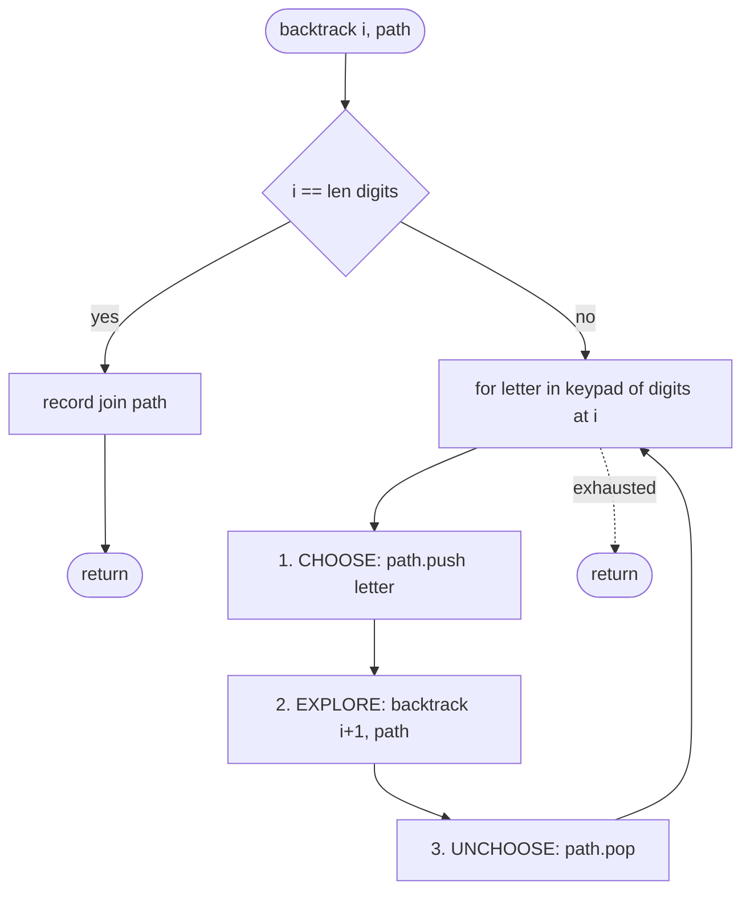
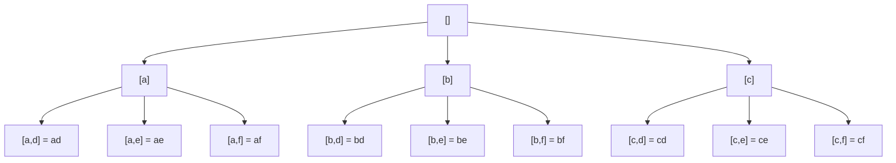

# The backtracking template

D. H. Lehmer used the word "backtracking" in print in the 1950s. The recipe he named is older than electronic computers, sat in mathematical-recreation papers for a decade, and then got a chapter in Knuth. The phrase that made the technique into a working algorithm is from §7.2.2 of TAOCP Volume 4: *"It exhaustively examines all possible candidates at each stage, but it usually doesn't have to look at very many of them, because it can rule out the others on the basis of partial information."*

That sentence has two halves. The first half is the part that beginners write fluently after their second LeetCode problem; an outer loop wraps an inner loop wraps a recursive call, the partial solution grows, and somewhere a leaf gets emitted. The second half is the part nobody reaches for unprompted, and the part that turns brute force into something with a name. Build the partial solution by **one choice at a time**, and undo that choice the moment the branch underneath it is exhausted, so the next branch sees the same starting state. Three operations: **choose**, **explore**, **unchoose**. The unchoose is the discipline. This chapter is the unchoose.

## What backtracking is, exactly

Backtracking is a recursion shape, not an algorithm. Knuth's TAOCP Volume 4 Fascicle 5 is the canonical reference and credits the term to Lehmer.[^1] The shape is a depth-first walk of a decision tree, with state mutation on the way down and state restoration on the way back up. Every chapter for the rest of Part 7 is one specialization of this shape: subsets, permutations, combination sums, word search, N-queens, Sudoku. Each specialization changes what gets recorded, what counts as valid, and what the next-choice frontier looks like; none of them changes the three-operation skeleton.

The template applies when three things are true at once. The output is enumerative ("return all X"). The decision space is structurally a tree, meaning two different choice sequences never end at the same partial state, so there's no work to memoize. Constraint checks are cheap, so early rejection (pruning) actually saves work.

When all three hold, backtracking beats brute-force enumeration by orders of magnitude. When the first fails, the problem usually wants graph search (BFS or Dijkstra, where the state space is a graph and visited-marking is global). When the second fails, the problem wants dynamic programming (overlapping subproblems with optimal substructure). When the third fails, you are running brute force with extra steps; the algorithm is correct but no faster than enumerating the full space.

> [!WARNING]
> **Reaching for backtracking on a DP-shaped problem is the most expensive mistake in this chapter.** If the same partial state can be reached by two different choice sequences (string editing, knapsack, paths-in-grid where direction matters), DP is the right tool and backtracking is exponentially slower for nothing. Before reaching for the template, ask: would two different choice sequences end at the same remaining state? If yes, memoize. If no, backtrack. House Robber (LC 198) is the canonical "looks like backtracking, is actually DP" trap.

## The wrong template, first

The fastest way to feel why "unchoose" is the discipline is to write the template *without* it and watch the output corrupt itself. LC 17 (Letter Combinations of a Phone Number) is the cleanest demonstrator. Given `digits = "23"` and the standard phone keypad (`2 → "abc"`, `3 → "def"`), return every two-letter string formed by picking one letter from each digit's set: `["ad", "ae", "af", "bd", "be", "bf", "cd", "ce", "cf"]`. Nine outputs. The decision tree fans out 3 × 3.

A first attempt that mirrors how most beginners write recursion:

```python
# WRONG TEMPLATE: stores the live path by reference, no unchoose
KEYPAD = {"2": "abc", "3": "def"}

def letter_combinations_wrong(digits):
    result = []
    path = []

    def recurse(i):
        if i == len(digits):
            result.append(path)         # <-- store by reference
            return
        for letter in KEYPAD[digits[i]]:
            path.append(letter)         # CHOOSE
            recurse(i + 1)              # EXPLORE
            # no UNCHOOSE
    recurse(0)
    return result
```

Two bugs, layered. Run it on `digits = "23"`. By the time the function returns, `path` is `["a", "d", "e", "f", "d", "e", "f", "d", "e", "f"]` (all the choose calls, no pop calls), and `result` is nine references to that same list. Output: nine copies of the same garbled string, every entry identical. Add the unchoose step (`path.pop()` after the recurse) and `path` ends at `[]` as it should, but the result is still nine references to the now-empty `path`; the output becomes nine empty strings instead of nine garbled ones. Both bugs surface together in beginner submissions because they are the same misunderstanding said twice: the writer treats the recursion frame as if it owns its own copy of `path`, when in fact every frame is mutating the one shared list.

Two fixes, both required. **Snapshot before storing** so each result entry is its own object. **Unchoose after exploring** so the sibling branch at the same depth sees the path the parent left it. Get one wrong and the answer is wrong; get both wrong and the failure mode is louder but the diagnosis is the same.

```python
# RIGHT TEMPLATE
def letter_combinations(digits):
    if not digits:
        return []
    result = []
    path = []

    def backtrack(i):
        if i == len(digits):
            result.append("".join(path))   # <-- snapshot
            return
        for letter in KEYPAD[digits[i]]:
            path.append(letter)            # 1. CHOOSE
            backtrack(i + 1)               # 2. EXPLORE
            path.pop()                     # 3. UNCHOOSE
    backtrack(0)
    return result
```

**Solution** — Python ([Java](./01-backtracking-template/lc-17/sol.java) · [C++](./01-backtracking-template/lc-17/sol.cpp) · [Go](./01-backtracking-template/lc-17/sol.go))

```python
# LC 17. Letter Combinations of a Phone Number
from typing import List


KEYPAD = {
    "2": "abc",
    "3": "def",
    "4": "ghi",
    "5": "jkl",
    "6": "mno",
    "7": "pqrs",
    "8": "tuv",
    "9": "wxyz",
}


def letter_combinations(digits: str) -> List[str]:
    """LC 17. Backtracking: each digit is one slot in the recursion tree."""
    if not digits:
        return []
    result: List[str] = []
    path: List[str] = []

    def backtrack(i: int) -> None:
        if i == len(digits):
            result.append("".join(path))
            return
        for letter in KEYPAD[digits[i]]:
            path.append(letter)        # 1. CHOOSE
            backtrack(i + 1)           # 2. EXPLORE
            path.pop()                 # 3. UNCHOOSE

    backtrack(0)
    return result
```

The difference between the two listings is six characters and one method call. The difference between right and wrong answers is the entire chapter.

## The three operations

The skeleton has three named moves and they are always in this order.

```text
function backtrack(path, choices_left):
    if is_complete(path):
        record(path)               # snapshot; never store the live path
        return

    for choice in choices_left:
        if not is_valid(path, choice):
            continue                # prune

        path.push(choice)           # 1. CHOOSE
        backtrack(path, next_choices(choices_left, choice))   # 2. EXPLORE
        path.pop()                  # 3. UNCHOOSE
```

**Choose.** Pick a candidate that satisfies the per-step constraint, push it onto the partial solution. The push extends `path` by one element; the per-step constraint is whatever the problem says, an unused index for permutations, a non-attacking square for N-queens, a digit that doesn't violate the row, column, or 3×3 box for Sudoku. For LC 17 the constraint is trivial: every letter in the current digit's set is a valid choice.

**Explore.** Recurse on the extended path. The recursive call owns the subtree under this choice; it will visit every leaf in that subtree and emit any that complete a solution, then return. While this call is running, `path` *contains* the choice. The recursion descends with that element pushed, and the descent assumes its presence.

**Unchoose.** Pop the choice off `path`. After this line, `path` is in exactly the state it was in before the matching `choose`. The reason this matters is the next iteration of the for-loop: the sibling choice at the same depth is about to take its turn, and it expects the same starting state the first sibling saw. Without the pop, every sibling inherits the previous sibling's residue. With the pop, the loop iterations are independent.

Stanford CS106B's lecture notes call the three operations "choose / explore / unchoose"; Knuth's TAOCP Vol. 4 Fascicle 5 calls them "enter-level / try-value / back-up"; Skiena's *Algorithm Design Manual* §9.1 calls them "construct candidates / recursive descent / clean up".[^2][^1][^3] Same moves, three vocabularies. This handbook stays with choose / explore / unchoose because it surfaces the load-bearing word, *unchoose*, as a verb the reader has to write into the function body.

### Why "unchoose" is the discipline

The unchoose is the line every beginner skips and every senior leaves alone. It does no work; the value goes onto `path` in the choose, gets read by the recursion, and then comes off in the unchoose with no observable consequence in this frame. A reader looking at the function body for the first time sees "push, recurse, pop" and reasonably suspects the pop is decoration.

The pop is what makes the for-loop work. Sibling choices share a parent frame; they share the parent frame's `path`; they each need the same starting state. The choose mutates the shared state; only the unchoose un-mutates it. The recursion below the explore call descends with the choice pushed and assumes its presence the whole way down. That's correct and that's what we want. But the sibling has not yet started, and when its turn comes the path must look identical to how it looked before the previous sibling ran.

The invariant is one sentence: **`path` at the start of `backtrack(...)` and `path` at the end of `backtrack(...)` are byte-for-byte identical.** This is the strongest correctness check a backtracking implementation has, and it's checkable by inspection. Walk the function body. Every push has a matching pop in the same scope, at the same indentation level, after the recurse. If you see a push without its pop, the implementation is broken and the failure mode is silent: wrong answers, no exception, sometimes correct on small inputs.

The mistake is most common when writers translate from a pass-by-value language. Python lists are mutable references; Java `ArrayDeque` is a mutable reference; C++ `std::vector` passed by reference is a mutable reference; Go slices alias an underlying array. Forget that, and "I returned the path" feels like it should work. It won't. The Stack Overflow thread *Leetcode 78: Subsets confused why duplicate subsets are generated* is forty different posters arriving at the same bug.[^4]

## The four levers

The skeleton is invariant. Across problem families, four pieces customize:

| Lever | What changes | Subsets | Permutations | LC 17 |
|---|---|---|---|---|
| `is_complete` | When to record | every node | leaves only (`len(path) == n`) | leaves only (`i == len(digits)`) |
| `record` | What to store | snapshot of `path` | snapshot of `path` | join `path` to a string |
| `is_valid` | Pruning predicate | always true (no pruning) | element not yet used | always true (digit sets are disjoint) |
| `next_choices` | Frontier shape | indices `> start` | unused elements (set-difference) | letters of `digits[i]` |

A problem from Part 7 takes the skeleton verbatim and fills in those four cells. Subsets emit at every node because every prefix of every path is itself a valid subset; permutations emit at leaves because the problem asks for full-length orderings; LC 17 emits at leaves because it asks for full-length combinations. Subsets use a `start` index to avoid generating the same subset in two different orders; permutations use set-difference (track which elements are already in `path`) because order *does* matter and every position is a fresh choice; LC 17 has neither problem because each digit indexes its own disjoint character set.

The variants land in their own chapters. [Subsets, combinations, and permutations](./02-subsets-combinations-permutations.md) covers the three classic enumeration problems. [Word search and grid backtracking](./05-word-search.md) takes the skeleton onto a 2D grid where `path` is a set of visited cells. [N-queens and constraint propagation](./03-n-queens.md) is the skeleton plus a heavyweight `is_valid` and aggressive pruning. [Partitioning and combination sum](./02-subsets-combinations-permutations.md) treats `next_choices` as "the next cut point". The skeleton stays. The cells differ.

## Walking LC 17 on `digits = "23"`

Trace the right template on `digits = "23"`, keypad `{2: "abc", 3: "def"}`. The recursion descends to depth 2, emits, climbs back. Every choose is paired with an unchoose at the same depth.

```text
 0  enter           path=[]
 1    choose 'a'    path=['a']
 2      enter       path=['a']
 3        choose 'd'  path=['a', 'd']
 4          enter     path=['a', 'd']     emit "ad"
 5        unchoose 'd'  path=['a']
 6        choose 'e'  path=['a', 'e']     emit "ae"
 7        unchoose 'e'  path=['a']
 8        choose 'f'  path=['a', 'f']     emit "af"
 9        unchoose 'f'  path=['a']
10    unchoose 'a'    path=[]
11    choose 'b'    path=['b']
12      ... emit "bd", "be", "bf"
13    unchoose 'b'    path=[]
14    choose 'c'    path=['c']
15      ... emit "cd", "ce", "cf"
16    unchoose 'c'    path=[]
```

Read line 1 against line 10. The first top-level branch chose `'a'`; ten lines later that choose has its matching unchoose. In between, the subtree under `'a'` ran to completion (three emits, three pushes, three pops) and `path` returned to `['a']` before the final pop took it back to `[]`. When the for-loop's next iteration starts on line 11, `path` is what it was on line 1 before the branch began. The sibling branches `'b'` and `'c'` mirror `'a'` exactly because they all start from the same state.

> **Interactive widget:** [Backtracking decision tree](../widgets/w-22-backtracking-tree.yml) (panel `panel-template`) — rendered on the website; the YAML spec describes the keyframes.

*Static fallback: tree fans out 3 × 3 to nine leaves; every choose along the path from root to leaf has a matching unchoose; on every back-up the path shortens by one element until the next sibling at that depth begins.*

The two diagrams below render the same trace differently. The flowchart shows the function body's control flow; the tree shows the search space the trace walked.



*The three named moves form an unbroken triangle inside the for-loop body; outside the for-loop, the function returns and the caller's unchoose runs at the next level up.*



*Every leaf is one emit; nine leaves total because |digit-2-set| × |digit-3-set| = 3 × 3 = 9. The depth-first walk visits A's subtree completely before starting B; that's what the unchoose between siblings is for.*

## What it actually costs

| Variant | Time | Space |
|---|---|---|
| LC 17 (`d` digits, max branching factor 4 from digits 7 and 9) | O(4^d × d) | O(d) recursion stack + O(4^d × d) output |
| Subsets of `n` elements (every node emits) | O(n × 2^n) | O(n × 2^n) output + O(n) stack |
| Permutations of `n` elements | O(n × n!) | O(n × n!) output + O(n) stack |
| Decision-only ("does a valid Sudoku exist?") | size of pruned tree × per-node work | O(depth); output is one boolean |

For LC 17, `d` is the number of digits in the input (LC bounds this at 4). Every leaf costs `O(d)` to materialize the string; the tree has at most `4^d` leaves and `(4^(d+1) - 1) / 3` total nodes, so the per-node `O(1)` choose/unchoose summed across the tree dominates only when leaves don't materialize anything. With string emission, leaf cost wins.

The general bound is one sentence: **runtime is the size of the search tree the algorithm actually traverses, multiplied by the per-node work**, and the size of the actually-traversed tree depends on how aggressively `is_valid` prunes. For LC 17 the digit sets are disjoint, so nothing prunes; the algorithm walks the full cartesian-product tree. For [N-queens and constraint propagation](./03-n-queens.md), `is_valid` rejects most placements before they recurse, and the tree the algorithm walks is a tiny fraction of the full `n!` permutation tree. At `n = 8`, that's 113 nodes versus 40,320.[^3] The complexity claim for a backtracking algorithm always has two parts: the worst case (the full tree, which is what bounds the proof) and the typical case (the pruned tree, which is what actually runs).

The space bound separates **output space** (the result list) from **working space** (the recursion stack). For decision problems that emit a single boolean (*does this Sudoku have a solution?*, *is this graph 3-colorable?*), output space is `O(1)` and the algorithm runs in `O(d)` total. For enumeration problems the output dominates and is the right thing to report. Conflating the two is one of the more common interview tells; Skiena flags it directly in §9.1.[^3]

## Pruning, briefly, with a forward pointer

Knuth's sentence has two halves. The first half, exhaustive examination of all candidates at each stage, is the choose/explore/unchoose triangle. The second half, *"it can rule out the others on the basis of partial information"*, is **pruning**, also called constraint propagation. Reject a candidate before recursing, and the entire subtree under that candidate is never visited.

LC 17 has no pruning. Every digit's letter is always a valid choice, so `is_valid` is the identity function `True`. The chapters where pruning earns its weight are [N-queens and constraint propagation](./03-n-queens.md), where the `is_valid` check (no two queens attack) cuts the tree by more than two orders of magnitude on `n = 8`, and the Sudoku solver in the same chapter, where row/column/box constraints reject most candidates before the recursion fires. Once you have the template down, those chapters are the next stop.

The difference between a backtracking solution that solves N-queens at `n = 12` in milliseconds and one that times out is exactly the strength of `is_valid`. The skeleton stays the same.

## Three pitfalls that bite

> [!WARNING]
> **Storing the live path instead of a snapshot.** `result.append(path)` appends a reference, not a copy. Every entry in `result` ends up pointing at the same list, which is `[]` after the recursion returns (because every choose had its unchoose). Output is one empty container per leaf instead of one distinct combination per leaf. Snapshot at every record: Python `result.append(path.copy())` or `"".join(path)`; Java `result.add(new ArrayList<>(path))`; C++ `result.push_back(path)` (the vector copy-constructor handles this); Go `result = append(result, string(path))` if `path` is `[]byte`, or an explicit `make + copy` for an `[]int`. The Go variant is the loudest because the language has no immutable-by-default fallback to save you.

> [!WARNING]
> **Forgetting the unchoose.** Sibling branches at the same depth see leftover state from the just-explored branch. The `path` accumulates choices that should have been popped, and emitted strings or subsets contain elements that don't belong to that branch. Symptom: too many results, or results with the wrong contents. Code-review heuristic: every `path.push` inside the for-loop body has a matching `path.pop` at the same indentation level, after the recurse. If you see a push without its pop, the implementation is broken.

> [!WARNING]
> **Recording at the wrong tree node.** If the chapter's problem emits at every node (subsets) and the writer copies a leaf-only template (`if len(path) == n: record`), only the largest result is emitted: one output instead of `2^n`. If the problem emits at leaves (LC 17, permutations) and the writer copies an every-node template, the result is full of duplicates and partial entries. The fix is to be explicit about `is_complete`: the four-lever table above is the discriminator, and getting it wrong is silent until you check the output count against the expected count. Always check the count.

## Problem ladder

### CORE (foundation/framework, one anchor)

- [LC 17 — Letter Combinations of a Phone Number](https://leetcode.com/problems/letter-combinations-of-a-phone-number/) [Medium] • backtracking-template-cartesian-product ★

This is a foundation/framework chapter; the ladder is intentionally short. LC 17 is the cleanest problem on which the choose/explore/unchoose triangle is visible without subset-ordering or permutation-skipping noise. Each digit indexes a disjoint character set, so the tree is pure cartesian product. The concrete problem families live in the next four chapters, each of which inherits the template verbatim and customizes the four levers: [Subsets, combinations, and permutations](./02-subsets-combinations-permutations.md) for LC 78 / 77 / 46 / 39, [Word search and grid backtracking](./05-word-search.md) for LC 79 / 212, [N-queens and constraint propagation](./03-n-queens.md) for LC 51 / 37, and [Partitioning and combination sum](./02-subsets-combinations-permutations.md) for LC 131 / 698.

## Where this leads

The next chapter is the natural one. [Subsets, combinations, and permutations](./02-subsets-combinations-permutations.md) takes this template and walks the three classic enumeration problems: every prefix is a subset (LC 78), exactly-`k` elements per leaf (LC 77, LC 39), every element appears in every order (LC 46). The entire chapter is filling in the four-lever table for each. Same skeleton, three different `is_complete` predicates, three different `next_choices` shapes.

After that, [Word search and grid backtracking](./05-word-search.md) and [N-queens and constraint propagation](./03-n-queens.md) push the template into territory where pruning earns its weight. [N-queens and constraint propagation](./03-n-queens.md) in particular is the chapter where `is_valid` does the heavy lifting and the search tree the algorithm walks bears almost no resemblance to the full `n!` permutation tree.

## References

[^1]: Donald E. Lehmer in the 1950s. <https://www-cs-faculty.stanford.edu/~knuth/taocp.html>

[^2]: Stanford CS106B Lecture 11, "Recursive Backtracking and Enumeration." Uses the choose / explore / unchoose three-operation framing this chapter adopts; flags the unchoose-by-reference pitfall as the most common bug. <https://web.stanford.edu/class/cs106b/lectures/11-backtracking1/>

[^3]: Steven S. Defines backtracking as "a systematic way to iterate through all the possible configurations of a search space"; the N-queens 113-vs-40,320 pruning numbers are taken from §9.1's worked example. <https://www3.cs.stonybrook.edu/~skiena/algorist/>

[^4]: Stack Overflow, "Leetcode 78: Subsets confused why duplicate subsets are generated." Documents the missing-unchoose / store-by-reference bug across multiple posters, surfacing the same diagnosis the chapter teaches. <https://stackoverflow.com/questions/73074775/leetcode-78-subsets-confused-why-duplicate-subsets-are-generated>
