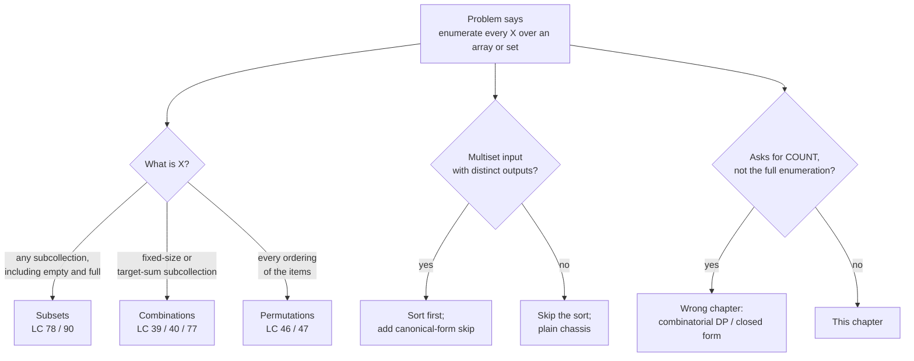
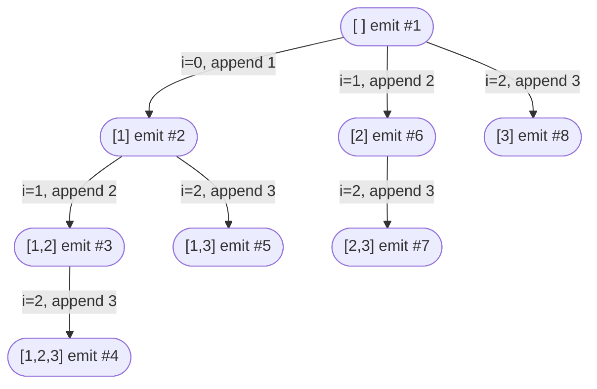

# Subsets, combinations, permutations

The array `[1, 2, 3]` has eight subsets: the empty set, three singletons, three pairs, and the full set itself. The same three-element array has six permutations: `[1,2,3]`, `[1,3,2]`, `[2,1,3]`, `[2,3,1]`, `[3,1,2]`, `[3,2,1]`. Bump the array to five elements and the subset count climbs to 32 while the permutation count rockets to 120. Neither growth shape is the same algorithm; `2^n` and `n!` diverge fast.

Three problems on three different LeetCode pages, *Subsets* (LC 78), *Permutations* (LC 46), *Combination Sum* (LC 39), and behind them is one recursion. Same three lines: choose, recurse, unchoose. Three problems become three knobs on the same machine: when do you snapshot the path, what counts as the next element, and is duplicate-pruning needed. [The backtracking template](./01-backtracking-template.md) introduced the chassis on a phone-keypad fan-out where every position carries a different alphabet. This chapter applies the same chassis to a single array and shows that subsets, permutations, and combinations are not three skeletons; they are one skeleton with three configurations of those knobs.

## Why one chassis covers all three

A reader who has met the three problems separately tends to write three separate functions, one per problem, copying the recursion shape across files and never quite seeing that the shape is the same. The exercise below is the chapter in miniature: a single recursion outline, with the three knobs called out as comments. Every concrete algorithm in this chapter fills those slots in one of three ways.

```python
def enumerate(items):
    result, path = [], []
    def dfs(...):
        if SNAPSHOT_RULE:                  # knob 1: when to record
            result.append(path.copy())
        for i in NEXT_AVAILABLE_RANGE:     # knob 2: which elements remain
            if SHOULD_PRUNE:               # knob 3: duplicate / target cuts
                continue
            path.append(items[i])
            dfs(...)
            path.pop()                     # the unchoose half is non-negotiable
    dfs(...)
    return result
```

Subsets fills knob 1 with "every node," knob 2 with `range(start, n)`, and leaves knob 3 unused. Permutations fills knob 1 with "leaves only" (`len(path) == n`), knob 2 with `range(0, n)` filtered by a `used[]` mask, and again leaves knob 3 unused unless duplicates appear. Combination Sum fills knob 1 with "when target hits zero," knob 2 with `range(start, n)` (or `range(start, n)` *with reuse*, recursing on `i` instead of `i+1`), and uses knob 3 to break out of branches whose remaining target has gone negative. Three problems, three configurations, one machine.

## Locating this chapter inside the backtracking family



*Decision flowchart for problems framed as "enumerate every X." Problems that ask for a count or for an optimum belong elsewhere; this chapter covers the shape where the output IS the enumeration.*

The "asks for count" branch is worth pausing on. *How many* subsets sum to `K` is `2^n` for the full enumeration but only one integer for the count, and the linear-DP solution that returns that integer (LC 416 Partition Equal Subset Sum, LC 494 Target Sum) lives in [Part 9](../part-9-dynamic-programming/00-dp-recursion-to-memo.md). Reaching for backtracking when the question wants a count is the most common framing error on this pattern. When the output is the full list of subsets / permutations / combinations, you are in this chapter.

## Subsets (LC 78)

The problem statement is short. Given an integer array of distinct values, return every subset of the array, in any order. For `nums = [1, 2, 3]`, the answer has eight elements: `[]`, `[1]`, `[2]`, `[3]`, `[1,2]`, `[1,3]`, `[2,3]`, `[1,2,3]`.[^1]

The honest first attempt is to enumerate every binary mask of length `n` and read off the indices set to 1. That works and runs in `O(n · 2^n)`, which matches the lower bound (the output itself has size `Θ(n · 2^n)`, so any algorithm that emits the full enumeration must touch every output cell at least once). The problem with the bitmask formulation is that it doesn't generalize: the moment the input becomes a multiset (LC 90), or the moment the problem caps subset size at `k` (LC 77), the bitmask becomes a filter over a too-large search space and the elegance breaks.

The recursion handles all four shapes uniformly. Index `start` says: at this depth, the next element you are allowed to take is `nums[start]`, `nums[start+1]`, or any later one, never one before `start`, because that would let you pick `[2, 1]` after already picking `[1, 2]` and you would emit duplicates of every subset. Snapshot `path` on entry to every call, then loop over the legal next elements; for each one, push, recurse with `start = i + 1`, pop. The push-recurse-pop dance is the chassis from [The backtracking template](./01-backtracking-template.md); the snapshot-on-entry is the new bit.

```python
def subsets(nums):
    result, path = [], []
    def dfs(start):
        result.append(path.copy())   # snapshot at every node
        for i in range(start, len(nums)):
            path.append(nums[i])
            dfs(i + 1)               # i+1 prevents reuse and reordering
            path.pop()
    dfs(0)
    return result
```

**Solution** — Python ([Java](./02-subsets-combinations-permutations/lc-78/sol.java) · [C++](./02-subsets-combinations-permutations/lc-78/sol.cpp) · [Go](./02-subsets-combinations-permutations/lc-78/sol.go))

```python
# LC 78. Subsets
from typing import List


def subsets(nums: List[int]) -> List[List[int]]:
    """LC 78. Return every subset via DFS with start index."""
    result: List[List[int]] = []
    path: List[int] = []

    def dfs(start: int) -> None:
        result.append(path.copy())   # snapshot at every node
        for i in range(start, len(nums)):
            path.append(nums[i])
            dfs(i + 1)               # i+1 prevents reuse and reordering
            path.pop()               # undo for backtrack

    dfs(0)
    return result
```

> [!IMPORTANT]
> **Snapshot at every node, not at every leaf.** The empty subset comes from the snapshot at the root, before the loop has fired even once. Singletons come from the snapshot at depth 1, before that level's loop has fired. Pairs and the full set come from snapshots at depths 2 and 3. The very first thing every `dfs(start)` call does, before deciding what to take next, is record the partial path it just inherited. Move the snapshot to the loop body and you miss every subset that doesn't have a "successor pick" — including, lethally, the empty subset and the full set.

The decision-tree expansion on `nums = [1, 2, 3]` is what the widget animates. It produces eight nodes, in bijection with the eight subsets, walked in pre-order DFS:



*Each node corresponds to one `dfs(start)` call; every node emits one subset on entry. Edge labels show the index `i` chosen and the value appended. Total nodes = 2³ = 8.*

> **Interactive widget:** [Backtracking decision tree](../widgets/w-22-backtracking-tree.yml) (panel `panel-subsets`) — rendered on the website; the YAML spec describes the keyframes.

*Static fallback: snapshot fires at the root for `[]`; the leftmost branch builds `[1] → [1,2] → [1,2,3]`, snapshotting at each depth; the algorithm backtracks twice, then takes the right sibling at depth 1 to produce `[1,3]`; the same pattern plays out under starting choices `2` and `3`. Eight emissions total, in pre-order.*

The snapshots fire 8 times; pushes and pops fire 7 times each (once per non-root node); the recursion depth never exceeds 3. That is what the `Θ(n · 2^n)` bound buys you: linear depth, exponential breadth, every output produced exactly once.

## Permutations (LC 46)

Same problem statement shape, structurally different output. Given an integer array of distinct values, return every ordering. For `nums = [1, 2, 3]`, the answer has six elements: every length-3 arrangement of the three numbers.[^2]

The cheap bitmask trick from subsets does not transfer. A bitmask over `nums` records *which* values are in the subset; it cannot record *order*. Permutations are an enumeration over orderings, not over membership sets, so the chassis has to track which elements are still available without committing to a left-to-right scan order.

The structural change is the second knob. Subsets walked the array left to right with a `start` index, and the index of an element doubled as a position-in-the-output marker. Permutations let the user pick *any* unused element at every depth, so the loop has to iterate over the whole array `[0, n)` and consult a `used[]` mask before pushing. The `used[]` mask is the bookkeeping that replaces `start`. Snapshot only when `path` has hit length `n`. Non-leaf nodes don't correspond to valid outputs because permutations are full-length by definition.

```python
def permute(nums):
    result, path = [], []
    used = [False] * len(nums)
    def dfs():
        if len(path) == len(nums):
            result.append(path.copy())   # snapshot only at full-length leaves
            return
        for i in range(len(nums)):
            if used[i]:
                continue
            used[i] = True
            path.append(nums[i])
            dfs()
            path.pop()
            used[i] = False               # the unchoose pair: pop AND clear the mask
    dfs()
    return result
```

**Solution** — Python ([Java](./02-subsets-combinations-permutations/lc-46/sol.java) · [C++](./02-subsets-combinations-permutations/lc-46/sol.cpp) · [Go](./02-subsets-combinations-permutations/lc-46/sol.go))

```python
# LC 46. Permutations
# mechanism pseudocode and §5.3.
from typing import List


def permute(nums: List[int]) -> List[List[int]]:
    """LC 46. Return every permutation via DFS with a used[] mask."""
    result: List[List[int]] = []
    path: List[int] = []
    used: List[bool] = [False] * len(nums)

    def dfs() -> None:
        if len(path) == len(nums):
            result.append(path.copy())   # snapshot only at full-length leaves
            return
        for i in range(len(nums)):
            if used[i]:
                continue                 # element already in path; skip
            used[i] = True
            path.append(nums[i])
            dfs()
            path.pop()                   # undo for backtrack
            used[i] = False

    dfs()
    return result
```

The `used[]` mask carries a quiet invariant: at any moment, `sum(used) == len(path)`, which is the depth of the current frame. The push-and-mark and pop-and-clear pairs keep that invariant. A common bug is forgetting to clear `used[i]` in the unchoose half; the algorithm proceeds, fails to revisit the cleared element on a sibling branch, and produces a too-small answer (often `n!/something`, never quite the full count). The `used[i] = False` line is not optional.

> **Interactive widget:** [Backtracking decision tree](../widgets/w-22-backtracking-tree.yml) (panel `panel-perms`) — rendered on the website; the YAML spec describes the keyframes.

*Static fallback: under starting choice 1 the algorithm produces `[1,2,3]` and `[1,3,2]`; backtracking through the depth-0 frame clears `used[0]`, freeing 1 to appear later; starting choice 2 produces `[2,1,3]` and `[2,3,1]`; starting choice 3 produces `[3,1,2]` and `[3,2,1]`. Six leaves total — exactly `3!`.*

The recursion depth is always exactly `n` for every leaf; the tree is balanced and every internal node has fan-out `n - depth`. Total work is `Θ(n · n!)`: there are `n!` leaves, each costs `O(n)` to copy into `result`, internal-node work is dominated by leaf work because each level above the leaves contributes a strictly smaller geometric sum. The `n` and the `!` together give the brutal scaling: at `n = 10` the answer has 3.6 million arrangements; at `n = 12` it has 479 million; at `n = 15` you have already exceeded a trillion and any backtracking solution is the wrong tool. LC 46 caps `nums.length` at 6 (720 permutations) for exactly this reason.[^2]

## Combination Sum (LC 39)

The third worked example introduces something the first two did not: a *constraint*. Given a list of positive integers `candidates` and an integer `target`, return every combination of candidates that sums to `target`. Each candidate may be used unlimited times. For `candidates = [2, 3, 6, 7]` and `target = 7`, the answer is `[[2, 2, 3], [7]]`.[^3]

The structural change is on the third knob. Subsets and permutations enumerated unconditionally; here, branches whose remaining target has gone negative cannot possibly succeed and must be cut. The cut is what distinguishes *backtracking* from *brute-force enumeration with a filter*: prune as deep into the tree as possible, abandon entire subtrees the moment they become infeasible, never let a doomed branch grow another node.

A second twist sits in the recursion call. LC 39 lets you reuse the same candidate, so when you pick `candidates[i]` at depth `d`, the next depth's loop should start at `i`, not `i + 1`. Recurse with the same index and the algorithm enumerates `[2]`, `[2, 2]`, `[2, 2, 2]`, ... until the running target drops below zero or hits zero. Recurse with `i + 1` and you have LC 40 instead, where each candidate is a one-shot and the answer to the same input is just `[[7]]`.

```python
def combination_sum(candidates, target):
    candidates.sort()                       # sort enables the early break below
    result, path = [], []
    def dfs(start, remaining):
        if remaining == 0:
            result.append(path.copy())      # snapshot when target hit exactly
            return
        for i in range(start, len(candidates)):
            if candidates[i] > remaining:
                break                       # sorted: no later candidate fits either
            path.append(candidates[i])
            dfs(i, remaining - candidates[i])  # i, not i+1 — reuse
            path.pop()
    dfs(0, target)
    return result
```

**Solution** — Python ([Java](./02-subsets-combinations-permutations/lc-39/sol.java) · [C++](./02-subsets-combinations-permutations/lc-39/sol.cpp) · [Go](./02-subsets-combinations-permutations/lc-39/sol.go))

```python
# LC 39. Combination Sum
# mechanism (recurse with i, not i+1, to allow reuse).
from typing import List


def combination_sum(candidates: List[int], target: int) -> List[List[int]]:
    """LC 39. Return every combination of candidates summing to target. Reuse allowed."""
    result: List[List[int]] = []
    path: List[int] = []
    candidates.sort()                           # sort enables the early break below

    def dfs(start: int, remaining: int) -> None:
        if remaining == 0:
            result.append(path.copy())          # snapshot when target hit exactly
            return
        for i in range(start, len(candidates)):
            if candidates[i] > remaining:
                break                           # sorted: no later candidate fits either
            path.append(candidates[i])
            dfs(i, remaining - candidates[i])   # i, not i+1 — reuse same element
            path.pop()                          # undo for backtrack

    dfs(0, target)
    return result
```

The sort up front is the sneaky optimization. With sorted candidates, the first `candidates[i]` that exceeds `remaining` proves every later candidate exceeds it too, so the loop can `break` instead of `continue`. On the canonical input the prune saves only a handful of recursive calls; on `target = 500` with `candidates = [2, 3, 5, 7, 11, ...]` it saves orders of magnitude.[^3]

> **Interactive widget:** [Backtracking decision tree](../widgets/w-22-backtracking-tree.yml) (panel `panel-combos`) — rendered on the website; the YAML spec describes the keyframes.

*Static fallback: under starting choice 2, the algorithm explores `[2]`, `[2, 2]`, `[2, 2, 2]` (pruned: remaining = 1, no candidate fits), pops to `[2, 2]`, picks 3 to hit `[2, 2, 3]` (snapshot), then prunes the remaining branches because every later candidate exceeds the residual. Under starting choice 3, the subtree explores but produces no snapshots. Under starting choice 7, the algorithm hits target on the first push and emits `[7]`. Two snapshots total, matching LC 39's expected output.*

A reasonable upper bound on the work is `O(N^(T/M))` where `N = |candidates|`, `T = target`, `M = min(candidates)`: every recursion branch has at most `N` children, and the depth is bounded by `T/M` because each push reduces remaining by at least `M`. The bound is loose; the actual recursion tree on most inputs is dramatically smaller because pruning removes branches eagerly. Tight analysis depends on the specific candidates, and there is no clean closed form.[^3]

## When duplicates show up: LC 90 and LC 47

Move from `nums = [1, 2, 3]` to `nums = [1, 2, 2]` and the subsets problem changes. The expected output has six distinct subsets, not eight: `[]`, `[1]`, `[1, 2]`, `[1, 2, 2]`, `[2]`, `[2, 2]`. Run the LC 78 algorithm on `[1, 2, 2]` and you get eight subsets including a duplicated `[2]` and a duplicated `[1, 2]`. The chassis is right; the chassis-applied-to-a-multiset is wrong.

The fix is two lines. Sort `nums` first, then inside the loop add a canonical-form skip:

```python
def subsets_with_dup(nums):
    nums.sort()                           # sort makes duplicates adjacent
    result, path = [], []
    def dfs(start):
        result.append(path.copy())
        for i in range(start, len(nums)):
            if i > start and nums[i] == nums[i - 1]:
                continue                  # canonical-form skip
            path.append(nums[i])
            dfs(i + 1)
            path.pop()
    dfs(0)
    return result
```

Why it works is one of the tighter combinatorial arguments in the chapter. After sorting, every distinct multiset corresponds to exactly one weakly-increasing index-sequence in `nums`. The skip rule `i > start and nums[i] == nums[i-1]` says: *at this recursion level, once you have used a value `v` as the choice at this level, refuse to start a new branch with the same `v`.* The first equal in a run is permitted (the `i == start` case bypasses the skip); every subsequent equal at the same level is forbidden. The pruned tree visits exactly one canonical representation per distinct multiset.[^4]

For permutations with duplicates (LC 47) the predicate has to change shape, because the chassis tracks `used[]` instead of `start`. The right rule is `if i > 0 and nums[i] == nums[i-1] and not used[i-1]: continue`. The `not used[i-1]` clause is the part that is genuinely non-obvious. After sorting, two equal values `nums[i-1]` and `nums[i]` appear adjacent. Two cases. If `used[i-1]` is already true, the previous-equal sibling has been chosen at an outer level and is currently in `path`; then `nums[i]` represents a *different* duplicate-instance and is allowed to extend `path`. If `used[i-1]` is false, the previous-equal sibling is unused at this level; then picking `nums[i-1]` first or `nums[i]` first produces identical sub-trees, and we always pick the leftmost-equal-first by skipping `nums[i]`. Same canonical-form argument, reshaped for the chassis it sits on.[^5]

> [!WARNING]
> **The two duplicate-skip predicates are not interchangeable.** `if i > start and nums[i] == nums[i-1]` is correct for the start-indexed chassis (subsets, combinations). `if i > 0 and nums[i] == nums[i-1] and not used[i-1]` is correct for the used-mask chassis (permutations). Pasting the start-indexed version into the permutation chassis silently misses valid permutations; pasting the used-mask version into the subsets chassis silently emits duplicates. The chassis owns the predicate.

## Three pitfalls that bite

> [!WARNING]
> **Snapshot by reference instead of by value.** The single most common bug in this chapter family. The mutable list / slice / vector being snapshotted is appended to `result` by reference; every later push or pop mutates every prior snapshot too because they all share the same backing storage. The result is a list of identical entries, all reflecting whatever `path` looked like when recursion finished (typically empty). Python `path.copy()`, Java `new ArrayList<>(path)`, C++ `result.push_back(path)` (vector copy on push), Go `make([]int, len(path))` + `copy()`. The Go version is where the footgun is most invisible because slice headers don't look like aliases until you trace the backing array.

> [!WARNING]
> **Iterating from `start` in the permutations skeleton.** Muscle memory from subsets carries the `start` index into the permutations function. The result is the *combinations* output, not permutations. For `nums = [1, 2, 3]` the broken algorithm emits 8 entries (the subsets) instead of 6 (the permutations). The structural difference is precisely the trade between `start` and `used[]`: subsets advance `i` from `start` to forbid reordering; permutations iterate `i` from 0 with a `used[]` mask to allow any unused element at every level. The two are not interchangeable.

> [!WARNING]
> **LC 39: forgetting to recurse on `i` instead of `i + 1`.** LC 39 allows reuse; LC 40 does not. The single-line difference between them is `dfs(i, ...)` vs `dfs(i + 1, ...)`. Pasting the LC 40 line into LC 39 misses every combination with a repeated element (`[2, 2, 3]` for the canonical input) and the algorithm passes a few sample cases before dying on the hidden tests. Read the problem statement once for "use the same number any number of times" and the answer for which line to write is unambiguous.

## What it actually costs

| Variant | Time | Auxiliary space (beyond output) | Output size |
|---|---|---|---|
| Subsets (LC 78) | Θ(n · 2ⁿ) | O(n) recursion + O(n) `path` | Θ(n · 2ⁿ) |
| Subsets II (LC 90) | O(n · 2ⁿ) worst case | O(n) | O(n · 2ⁿ) |
| Permutations (LC 46) | Θ(n · n!) | O(n) recursion + O(n) `used[]` + O(n) `path` | Θ(n · n!) |
| Permutations II (LC 47) | O(n · n!) worst case | O(n) | O(n · n!) |
| Combination Sum (LC 39) | O(N^(T/M)) loose upper bound | O(T/M) recursion depth | bounded by output |

The lower bound on every row matches the upper bound up to constants: the *output alone* has the size in the rightmost column, so any algorithm that emits the full enumeration must touch every output cell at least once. Asking "can you do better than `O(n · 2^n)`" in an interview is a trap unless the asker means streaming (yield one subset at a time, `O(n)` per subset) or counting only (one integer, `O(n)` for some cases or worse for others — different chapter).[^1][^2]

The practical takeaway is the scaling cliff. Subsets are tractable to about `n = 20` (one million subsets). Permutations are tractable to about `n = 8` (forty thousand permutations). Combination Sum is bounded by output size and prunes aggressively in practice, but worst-case inputs with small minimum candidate and large target blow up just as fast. *"Can you do this in `O(n)` instead of `O(n · 2^n)`?"* — no, and the asker either misunderstands the problem or is looking for a counting / DP framing. State the bound, state why it is tight, and move on.

## Problem ladder

### CORE (solve all three to claim chapter mastery)

- [LC 78 — Subsets](https://leetcode.com/problems/subsets/) [Medium] • subsets-backtracking ★
- [LC 46 — Permutations](https://leetcode.com/problems/permutations/) [Medium] • permutations-backtracking
- [LC 39 — Combination Sum](https://leetcode.com/problems/combination-sum/) [Medium] • combinations-backtracking-with-target

### STRETCH (optional)

- [LC 90 — Subsets II](https://leetcode.com/problems/subsets-ii/) [Medium] • subsets-with-duplicates
- [LC 47 — Permutations II](https://leetcode.com/problems/permutations-ii/) [Medium] • permutations-with-duplicates

> [!NOTE]
> The pure subsets / combinations / permutations skeleton is structurally Medium-bound on LeetCode; LC 51 N-Queens is the closest Hard but its lesson is constraint pruning, not enumeration, and it lives in the next chapter. The frontmatter's `single-difficulty-band` curation flag records this honestly. Five Mediums is the right shape; padding the ladder with a forced Easy or Hard would teach the wrong thing.

## Where this leads

The next chapter, [N-Queens and constraint pruning](./03-n-queens.md), keeps the chassis but shifts every weight onto knob 3. Subsets, permutations, and Combination Sum prune on simple predicates (duplicate skip, target-sum cut). N-Queens prunes on geometric constraints (column and diagonal conflicts), and the recursion tree shrinks from `n!` down to a few thousand nodes for `n = 8` because most branches die at depth 2 or 3. Same chassis. The pruning predicate is doing all the work.

The other direction is enumerations that *can* admit memoization. When the recursion's state is small enough that subtrees repeat (LC 698 Partition to K Equal Sum Subsets, LC 691 Stickers), the chassis grows a memoization table and turns into bitmask DP, covered later in [Part 9](../part-9-dynamic-programming/00-dp-recursion-to-memo.md). The trio in this chapter is what comes *before* memoization is even applicable: full enumeration, no overlap, output equals work.

## References

[^1]: Donald E. The Θ(n · 2ⁿ) bound for subsets generation matches the recursion-tree node count in bijection with the power set; output-size lower bound matches recursion-tree upper bound up to constants. <https://www-cs-faculty.stanford.edu/~knuth/taocp.html>

[^2]: Donald E. Knuth, *The Art of Computer Programming*, Volume 4A, Addison-Wesley, 2011, §7.2.1.2 "Generating all permutations" (Algorithm L: lexicographic permutations).

[^3]: walkccc.me LeetCode Solutions, *39. Combination Sum*, <https://walkccc.me/LeetCode/problems/39/>.

[^4]: Donald E. Knuth, *The Art of Computer Programming*, Volume 4A, Addison-Wesley, 2011, §7.2.1.3, lexicographic duplicate-elimination pattern.

[^5]: cs.stackexchange community Q&A, "Math behind leetcode problem 47 permutations II," <https://cs.stackexchange.com/questions/128337/math-behind-leetcode-problem-47-permutations-ii>.
