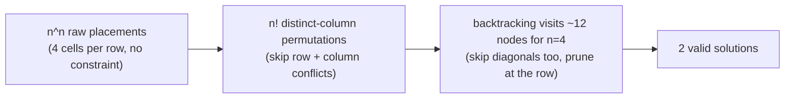
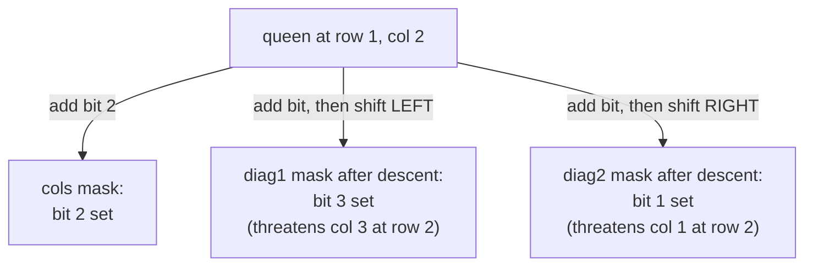

# N-Queens: pruning and constraint propagation

In 1848, a German chess enthusiast named Max Bezzel posed a puzzle in *Berliner Schachzeitung*: place eight queens on a chessboard so that no two attack each other. Two years later Franz Nauck mailed in a count of 92 distinct solutions, which Carl Friedrich Gauss confirmed by hand and Glaisher proved exhaustive in 1874. In 1972, Edsger Dijkstra used the same puzzle to demonstrate what he called *structured programming*, walking a depth-first backtracking algorithm step by step in print. Knuth's *The Art of Computer Programming* Volume 4, Fascicle 5 still opens its backtracking chapter on N-Queens almost two decades after Dijkstra's lecture, and for the same reason: the puzzle is the cleanest demonstration of what backtracking actually is.

The eight-queens board has 4,426,165,368 raw arrangements of eight queens on 64 squares.[^1] Of those, exactly 92 are legal, a Bezzel-and-Nauck result Gauss verified by hand and Glaisher confirmed exhaustively two decades later.[^2] That ratio, roughly 48 million bad arrangements per good one, is why brute enumeration is hopeless and why constraint tracking is the algorithm. This chapter is the smallest possible vehicle for that idea: one queen per row, three integers carrying the conflict state, and a pair of bit-shifts that make every shrink-and-grow step a single bitwise operation. Knuth's TAOCP §7.2.2 still uses N-Queens as the motivating example for the broader Algorithm X / Dancing Links family, sixty-plus years after Bezzel posed the original puzzle.[^3]

## Why the obvious approach is hopeless

LC 51 (N-Queens) wants every distinct configuration of `n` queens on an `n × n` board where no two share a row, column, or either of the two diagonals. For `n = 4` the answer is two boards. For `n = 8`, ninety-two. For `n = 9`, three hundred fifty-two. The honest first attempt enumerates every way to place `n` queens on `n²` squares and filters the conflicting arrangements out:

```python
# Brute force: O(n^(2n)) -- what we're replacing
from itertools import combinations

def solve_n_queens_brute(n):
    solutions = []
    squares = [(r, c) for r in range(n) for c in range(n)]
    for placement in combinations(squares, n):
        if is_legal(placement):
            solutions.append(placement)
    return solutions

def is_legal(placement):
    for (r1, c1), (r2, c2) in combinations(placement, 2):
        if r1 == r2 or c1 == c2:
            return False
        if abs(r1 - r2) == abs(c1 - c2):    # same diagonal
            return False
    return True
```

For `n = 8`, `combinations(64, 8)` is 4,426,165,368. The filter is fast per arrangement, but four billion iterations is four billion iterations. The submission times out at `n = 6` and the algorithm has no future.

The first observation that collapses the search space is structural rather than clever. Each *legal* configuration places exactly one queen in every row, because two queens in the same row attack each other immediately. So instead of choosing `n` squares from `n²`, choose `n` columns, one per row, from the `n × n × ⋯ × n` Cartesian product, and skip the row-conflict check. That cuts the enumeration to `n^n`, which is `1.6 × 10⁷` at `n = 8`: still slow, but tractable.

The second observation cuts harder. Within an `n^n` enumeration, two queens in different rows can still share a column. So advance to the *permutation* search: for each row pick a *distinct* column from `0..n-1`. That's `n!`, and `8!` is `40,320`. Faster than `n^n` by three orders of magnitude.

The third observation is the algorithm. We don't have to generate the permutation and *then* check diagonals. We can generate the permutation row by row and *abandon* a partial placement the instant a diagonal conflict appears. Most partial placements fail at row 2 or 3, long before they would have wasted work down to row 7.



*The pruning cascade for n=4: `4^4 = 256` raw placements collapse to `24` permutations collapse to `~12` backtracking nodes collapse to `2` solutions. At n=8 the same cascade goes `1.6 × 10^7 → 40,320 → ~15,720 → 92`.*

## The pattern

The recursion takes a row index and three integer bitmasks tracking which columns and which diagonals are currently under attack from previously-placed queens. At each row, compute the columns that are *not* attacked, place the queen at the lowest available column, recurse to the next row, then iterate to the next available column.

```python
def solve_n_queens(n):
    solutions = []
    queens = [-1] * n

    def backtrack(row, cols, diag1, diag2):
        if row == n:
            solutions.append(['.' * c + 'Q' + '.' * (n - c - 1) for c in queens])
            return
        available = ((1 << n) - 1) & ~(cols | diag1 | diag2)
        while available:
            bit = available & -available             # isolate lowest set bit
            col = bit.bit_length() - 1
            queens[row] = col
            backtrack(row + 1,
                      cols | bit,
                      (diag1 | bit) << 1,
                      (diag2 | bit) >> 1)
            available &= available - 1               # try the next column

    backtrack(0, 0, 0, 0)
    return solutions
```

**Solution** — Python ([Java](./03-n-queens/lc-51/sol.java) · [C++](./03-n-queens/lc-51/sol.cpp) · [Go](./03-n-queens/lc-51/sol.go))

```python
# LC 51. N-Queens (and LC 52. N-Queens II as the count-only sibling)
# (counts: 1, 2, 92, 724 -- matches OEIS A000170).
from typing import List


def solve_n_queens(n: int) -> List[List[str]]:
    """LC 51 -- return all distinct n-queens boards as char arrays."""
    solutions: List[List[str]] = []
    queens = [-1] * n

    def backtrack(row: int, cols: int, diag1: int, diag2: int) -> None:
        if row == n:
            solutions.append(['.' * c + 'Q' + '.' * (n - c - 1) for c in queens])
            return
        available = ((1 << n) - 1) & ~(cols | diag1 | diag2)
        while available:
            bit = available & -available             # isolate lowest set bit
            col = bit.bit_length() - 1
            queens[row] = col
            backtrack(row + 1,
                      cols | bit,
                      (diag1 | bit) << 1,
                      (diag2 | bit) >> 1)
            available &= available - 1               # try the next column

    backtrack(0, 0, 0, 0)
    return solutions


def total_n_queens(n: int) -> int:
    """LC 52 -- count-only variant; same recursion, no board built."""
    count = 0

    def backtrack(row: int, cols: int, diag1: int, diag2: int) -> None:
        nonlocal count
        if row == n:
            count += 1
            return
        available = ((1 << n) - 1) & ~(cols | diag1 | diag2)
        while available:
            bit = available & -available
            backtrack(row + 1,
                      cols | bit,
                      (diag1 | bit) << 1,
                      (diag2 | bit) >> 1)
            available &= available - 1

    backtrack(0, 0, 0, 0)
    return count
```

> [!IMPORTANT]
> The bitmask form is not an optimization layered on top of a "real" boolean-array algorithm. The integers `cols`, `diag1`, `diag2` are themselves the algorithm. Each one encodes "which columns at the *next* row are attacked by some queen placed in a *prior* row", and the shift on the recursive call is what maintains that invariant. The boolean-array form is a translation; the bitmask form is the lesson. Wirth presented this formulation in *Algorithms and Data Structures* in 1976,[^4] and Knuth's TAOCP §7.2.2 still uses it as the motivating example for the broader Algorithm X / Dancing Links family.[^3]

The four primitives map onto the recursion this way:

| Primitive | What it is | Why it's O(1) |
|---|---|---|
| `init_state` | `cols = diag1 = diag2 = 0` at the root call | Three integers; no allocation |
| `available` | `((1 << n) - 1) & ~(cols \| diag1 \| diag2)` | Three bitwise ops |
| `place` | `cols \| bit`, `(diag1 \| bit) << 1`, `(diag2 \| bit) >> 1` | Three bitwise ops; passed by value to the recursive call |
| `undo` | (none — masks are passed by value) | The recursive call's modifications never reach the caller |

The "no undo" row is the lesson the bitmask form teaches that an array-based form obscures. Every common backtracking bug in N-Queens, and there are several catalogued in the pitfalls below, is some variant of forgetting to undo a placement. The bitmask form makes the bug literally unwriteable: there is no shared mutable state to corrupt.

## Worked example: n = 4

The board starts empty. Three constraint masks are zero. We open the search at row 0.

`row = 0`. All four columns available. Place at `(0, 0)`. Now `cols = 0b0001 = 1`, `diag1 = 0b0010 = 2` (the queen's `\\` diagonal threatens column 1 at the next row), `diag2 = 0b0000 = 0` (the queen's `/` diagonal would threaten column -1, which is off-board, so the right-shift drops it).

`row = 1`. The available mask is `0b1111 & ~(1 | 2 | 0) = 0b1100`. Columns 2 and 3 are legal; columns 0 and 1 are blocked. Place at column 2.

`row = 2`. Available is `0b1111 & ~(0b0101 | 0b1100 | 0b0010) = 0b1111 & ~0b1111 = 0`. **All four columns are blocked.** First dead-end. Backtrack.

The widget animates exactly this trace. The chapter's central teaching artifact is the moment of dead-end at row 2: the union of three masks `5 | 12 | 2 = 15 = 0b1111` *is* the proof that no column survives, and the reader sees the integer arithmetic happen on screen rather than reading it off a code listing.

> **Interactive widget:** [N-Queens -- place / attack / backtrack on n=4](../widgets/w-23-n-queens.yml) — rendered on the website; the YAML spec describes the keyframes.

*Static fallback: the search visits 38 algorithmically meaningful states across 40 frames. Two solutions surface at frames 15 and 24 (`[1, 3, 0, 2]` and `[2, 0, 3, 1]`); four dead-ends at frames 3, 7, 32, 36; the rest are place and backtrack steps. The two valid configurations are mirror images of each other, which is generally true of N-Queens solutions on small boards.*

The widget shows three colored overlays on every frame: vermilion for `cols`, orange for `diag1`, reddish purple for `diag2`. A square that's blocked by two constraints simultaneously displays both colors stacked. This is what makes the dead-end visible as more than just "the search failed." The reader sees *why*.

## The bitmask shift, in detail

The `cols` mask is straightforward: bit `c` is set iff some prior queen occupies column `c`. Bit operations on `cols` are arithmetic on a single integer; nothing surprising.

The diagonal masks are the move that takes a beat to internalize. A queen at `(r, c)` controls every square `(r + d, c + d)` along the `\\` diagonal and every square `(r + d, c - d)` along the `/` diagonal. The naive approach is to track diagonals by their constant, `r - c` for `\\` and `r + c` for `/`, and mark cells in a `2n - 1`-element array. That works. It's also what produces the off-by-one bug catalogued in the pitfalls.

The bitmask alternative uses a different coordinate system. Instead of asking "which diagonal is this queen on", ask: "given that the recursion is currently at row `r`, which columns at row `r` are under attack from some queen placed at row `r' < r`?" That's a single integer per diagonal direction. When the recursion descends from row `r` to row `r + 1`, the set of columns under `\\`-attack shifts one position to the right (because the `\\` diagonal moves one column rightward as it descends one row). Equivalently, the *bitmask* shifts one position to the left, so bit `c` becomes bit `c + 1`, exactly the column it threatens at the new row. The `/` diagonal moves leftward as it descends, so its mask shifts right.

That's what `(diag1 | bit) << 1` and `(diag2 | bit) >> 1` are doing. Add the new queen's bit. Then propagate the entire mask one row down. Bits that shift off either end represent diagonal threats to columns that are off the board; they vanish silently, which is the correct behavior.

### Bitmask state: from O(N²) per check to O(1)

Without the bitmask trick, each call to `is_legal(row, col)` walks the placed queens and checks three conditions per queen: same column, same `\\`-diagonal, same `/`-diagonal. With `r` queens already placed, that's `O(r)` per attempt and `O(n²)` per row in the worst case across `n` candidate columns. Across the whole search the constant factor matters: the `n^n` rejection step is the same, but the cost of *every* visited node is multiplied by `n`.

The bitmask form replaces all three checks with `available = ((1 << n) - 1) & ~(cols | diag1 | diag2)`. Three OR-and-NOT operations on three machine words. Then the inner loop iterates only the *bits that are set in `available`*, using the well-known `bit & -bit` idiom to isolate the lowest set bit, which means we never even consider blocked columns.

Empirical timings on commodity hardware: at `n = 12` (14,200 solutions) the bitmask form runs in roughly 200 ms; the boolean-array form runs in roughly 1 second. At `n = 14` (365,596 solutions) the gap widens to roughly 5 seconds vs roughly 30. Same algorithmic class, five-to-tenfold constant-factor speedup. Knuth attributes the formulation to Wirth's 1976 textbook;[^4] modern competitive-programming tutorials treat it as the canonical reference implementation.[^5]



*Each constraint mask names "columns at the NEXT row that are attacked by some queen placed in a PRIOR row". The shifts on the recursive call propagate the diagonal threats one row downward, which is what makes the per-step cost O(1) instead of O(n).*

## What it actually costs

| Variant | Time | Space (excluding output) |
|---|---|---|
| Brute enumeration `combinations(n², n)` + filter | O(n² choose n) | O(n) |
| Permutation enumeration with diagonal filter | O(n!) | O(n) |
| Backtracking with array-based constraint sets | O(n!) worst case; pruning makes practical cost much smaller | O(n) |
| Backtracking with bitmask constraint sets (this chapter) | Same asymptotic; ~5-10x constant-factor speedup | O(n) for the `queens` array |

The exact number of nodes the standard backtracker visits is OEIS A319284, which grows superexponentially but slower than `n!` because of pruning.[^6] The exact number of *solutions* is OEIS A000170 (1, 0, 0, 2, 10, 4, 40, 92, 352, 724, 2680, 14200, …), which Simkin proved in 2021 grows asymptotically as `((1 ± o(1)) · n · e^{-α})^n` with `α ≈ 1.942`.[^7]

For LC 51 the dominant cost is *output materialization*, not search. Each of `Q(n)` solutions produces an `n`-length list of `n`-character strings, costing `O(n²)` per solution. At `n = 9` (LC's hard cap), that's 352 solutions × 81 characters = roughly 28K characters of output, which dwarfs the search time. LC 52 is the same algorithm with the leaf changed from `solutions.append(board)` to `count += 1`, and runs measurably faster because the leaf does `O(1)` work instead of `O(n²)`. The search and the output are separable concerns; a candidate who points this out in the interview is signaling something useful about how they think about runtime.

## When the pattern bends

The chapter's algorithm is exhaustive: it enumerates every valid configuration. Three follow-ups change the question and force a different tool, and an interviewer who is paying attention will ask at least one of them.

**"What if `n = 1,000,000`?"** Backtracking is intractable past roughly `n = 30`. The right answer is min-conflicts local search: place one queen per column at random, then repeatedly pick a queen whose row is in conflict and move it to the row with the *fewest* conflicts in its column. Minton, Johnston, Philips, and Laird published this in 1992 and demonstrated million-queen instances in seconds.[^8] Sosič and Gu's 1994 follow-up scaled it to three million queens in under a minute on workstation-grade hardware.[^9] The price is correctness: min-conflicts is incomplete and can stall on local optima, which means it needs random restarts. For *unconstrained* N-Queens this is fine, because Bernhardsson 1991 proved that solutions exist for every `n ≥ 4` and gave an explicit closed-form construction.[^10]

**"What if some queens are pre-placed?"** This is the *N-Queens completion* problem, and it is genuinely hard. Gent, Jefferson, and Nightingale proved in 2017 that the decision version is NP-Complete and the counting version is #P-Complete.[^11] The same backtracking algorithm runs (start the recursion with the pre-placement masks already populated), but no polynomial-time algorithm exists in the worst case. This is the rare interview corner where the right answer to "is N-Queens NP-Hard?" is a precise three-way distinction: open-form (find any solution) is polynomial-time constructive; find-all (LC 51) and count (LC 52) are exponential but tractable for small `n`; completion is NP-Complete.

**"What about symmetry?"** Every solution to N-Queens has up to seven counterparts under rotation and reflection of the board. For `n = 8` there are 12 fundamental solutions; eleven of them have all eight variants and one has rotational symmetry that collapses its orbit to four, giving the canonical 92.[^2] For LC 52 specifically, restricting the row-0 queen to `[0, ⌊(n+1)/2⌋ - 1]` and multiplying gives an eight-fold speedup on the count. The trick is well-known and adds maybe twenty lines of bookkeeping; most submissions skip it because the constant-factor win doesn't offset the code complexity.

## Three pitfalls that bite

> [!WARNING]
> **Forgetting `>>>` on Java diagonal shifts.** The Python and C++ references write `(diag2 | bit) >> 1`. Java's `>>` is *arithmetic* right shift on signed integers, not logical: when the high bit is set, sign-extension fills the top with `1` bits and pollutes the constraint mask with phantom attacks at columns far above `n`. The fix is one character: write `>>>` instead of `>>`. The reference implementation in `lc-51/sol.java` uses `>>>`. C++ programmers don't think about this distinction because the C++ code typically uses `int` masks where the high bit doesn't accumulate at small `n`, but a Java port that copies the C++ source verbatim will silently produce wrong answers on `n ≥ 12` once the masks grow large enough to need the high half of the integer.

> [!WARNING]
> **Off-by-one on the diagonal index in array-based forms.** The array-based form uses `boolean[2*n - 1]` arrays for the two diagonal sets. The `/` anti-diagonal indexes cleanly as `r + c`, ranging over `[0, 2n - 2]`. The `\\` diagonal indexes as `r - c`, ranging over `[-(n-1), n-1]`, which means it needs a `+(n-1)` offset to fit inside an array. A candidate who writes one of the two diagonals correctly often forgets the offset on the other and gets `ArrayIndexOutOfBoundsException` on any queen whose row index is less than its column index. The bitmask form sidesteps the question entirely; the diagonal is encoded as the *current set of attacked columns* rather than as a slot index.

> [!WARNING]
> **Building the board string at every recursive call.** A "natural" Python form passes the partial board down through the recursion: `dfs(row + 1, board + ['.'*j + 'Q' + '.'*(n-j-1)])`. Reads idiomatically. Allocates an `n`-length list at every recursive node, not just at solution leaves. For `n = 12` the search visits roughly 100,000 nodes and emits 14,200 solutions; the wasteful form allocates ten times more strings than necessary, and submissions that pass at `n = 8` time out at `n = 12`. The fix is to maintain a single mutable `queens[row] = col` array and materialize the board *only* at the leaf, which is what the reference does. For LC 52 the materialization is dropped entirely.

## Problem ladder

### CORE (solve both to claim chapter mastery)

- [LC 51 — N-Queens](https://leetcode.com/problems/n-queens/) [Hard] • backtracking-row-column-diagonal ★
- [LC 52 — N-Queens II](https://leetcode.com/problems/n-queens-ii/) [Hard] • backtracking-row-column-diagonal-count-only

### STRETCH (optional)

- [LC 1219 — Path with Maximum Gold](https://leetcode.com/problems/path-with-maximum-gold/) [Medium] • backtracking-grid-path-with-state-restore

LC 51 is the chapter's signature problem (★) and the one the widget animates. LC 52 is the same algorithm with the leaf changed from "emit board" to `count++`; treating it as STRETCH would obscure that the search and the output materialization are separable concerns. The CORE pair is both Hard. The chapter has no canonical Easy or Medium variant on the same pattern: removing the constraint sets reduces the problem to permutation enumeration, which lives in [Subsets, combinations, permutations](./02-subsets-combinations-permutations.md); removing the attack-style constraint reduces it to grid traversal, which lives in [Word search](./05-word-search.md). The frontmatter's `single-difficulty-band` curation flag records this honestly. LC 1219 is the chapter's stretch and bridges to the next chapter's territory by applying the same "make a choice, recurse, undo" discipline to a 4-direction grid walk.

## Where this leads

[Sudoku solver](./04-sudoku-solver.md) is the natural follow-up. The structure is identical, row-by-row constraint propagation with a small set of bitmasks, but the constraints generalize from "row + column + two diagonals" to "row + column + 3×3 box". The Sudoku puzzle is also non-empty at the start, which makes it the *completion* variant rather than the *find-any* variant; the algorithm is the same, the input is harder. [Word search](./05-word-search.md) takes the backtracking discipline somewhere different again: a grid-walk with mark/recurse/unmark state restoration, which is what LC 1219 above is preparation for.

## References

[^1]: "A000170: Number of ways of placing n nonattacking queens on an n × n board", On-Line Encyclopedia of Integer Sequences. Sequence: 1, 1, 0, 0, 2, 10, 4, 40, 92, 352, 724, 2680, 14200, … . The 4,426,165,368 raw arrangement count comes from `C(64, 8)`, computed exactly. <https://oeis.org/A000170>

[^2]: "Eight queens puzzle", Wikipedia, last edited 2026-04-09. Sources for: Bezzel 1848 in *Berliner Schachzeitung*, Nauck 1850 mailing in 8-queens solutions, Gauss confirming Nauck's 92 solutions, Glaisher's 1874 exhaustive proof, the 12 fundamental solutions, and the 11×8 + 1×4 = 92 D₄ orbit decomposition. <https://en.wikipedia.org/wiki/Eight_queens_puzzle>

[^3]: Donald E. ISBN 0-134-67179-1. §7.2.2 ("Backtrack Programming") presents N-Queens as the motivating example; §7.2.2.1 introduces Algorithm X / Dancing Links. <https://www-cs-faculty.stanford.edu/~knuth/taocp.html>

[^4]: Niklaus Wirth, *Algorithms and Data Structures* (1976/2004 update), Oberon edition, ETH Zürich. The "Eight Queens Problem" section presents the bitmask + shift formulation that this chapter's reference uses. <https://people.inf.ethz.ch/wirth/AD.pdf>

[^5]: P.-Y. Chen, "LeetCode Solutions: 51. N-Queens", walkccc.me, 2024-2026. Verified C++/Java/Python implementations with the bitmask + shift formulation; cites the `O(n · n!)` time bound. <https://walkccc.me/LeetCode/problems/0051/>

[^6]: "A319284: Number of nodes visited by the n-queens backtracking algorithm", On-Line Encyclopedia of Integer Sequences. Documents the exact node count as a function of `n`; the diagonal of the broader search-tree-size sequence. <https://oeis.org/A319284>

[^7]: Michael Simkin, "The number of n-queens configurations", arXiv:2107.13460, 2021. Proves `Q(n) = ((1 ± o(1)) · n · e^{-α})^n` with `α` between 1.939 and 1.945. <https://arxiv.org/abs/2107.13460>

[^8]: Steven Minton, Mark D. The original min-conflicts paper; demonstrates the heuristic on N-Queens and Hubble Space Telescope scheduling. <https://doi.org/10.1016/0004-3702(92)90007-K>

[^9]: R. The QS1/QS3/QS4 family of algorithms; QS4 solves three-million-queen instances in under a minute. <https://doi.org/10.1109/69.317698>

[^10]: B. Bernhardsson, "Explicit solutions to the N-queens problem for all N", *ACM SIGART Bulletin*, vol. 2, no. 2, p. 7, April 1991.

[^11]: Ian P. Proves that decision-version N-Queens completion is NP-Complete and counting-version is #P-Complete. <https://doi.org/10.1613/jair.5512>
