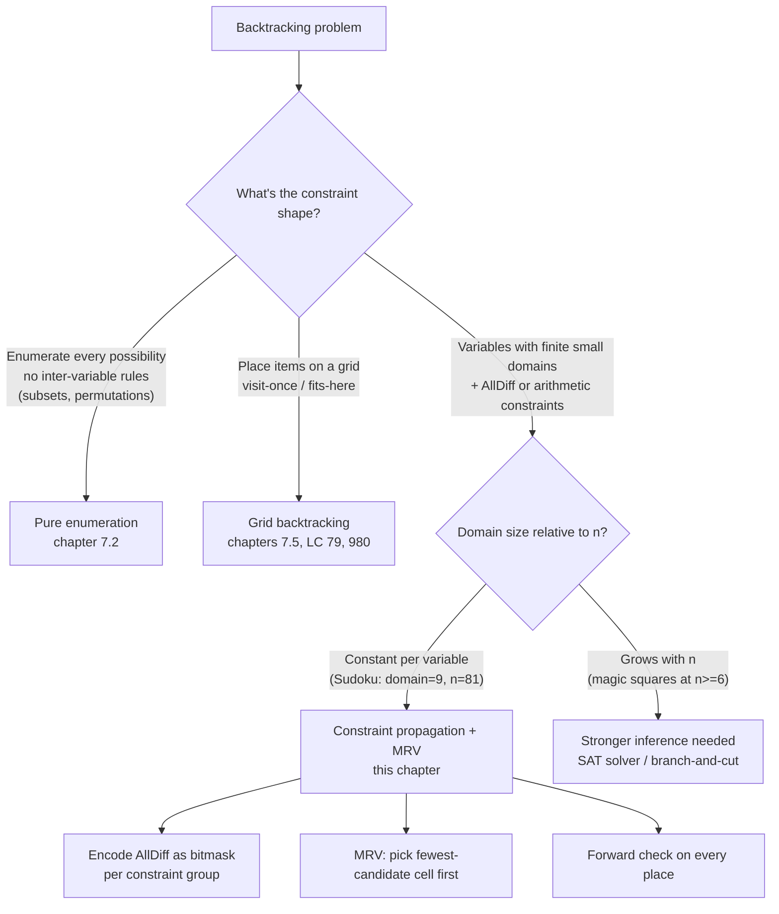

# Sudoku solver: constraint propagation and forward checking

The number of distinct ways to fill a blank 9x9 Sudoku grid is roughly 4 × 10^38. The age of the universe is about 4 × 10^17 seconds. Even at a billion grid checks per second per CPU, brute-force enumeration would not finish before the heat death. LeetCode's grader expects an answer in two seconds.

The classic problem is LC 37 Sudoku Solver. Given a partially-filled 9x9 board with some cells holding `'1'..'9'` and the rest holding `'.'`, mutate the board in place so every row, every column, and every 3x3 box contains each of `'1'..'9'` exactly once. The input is guaranteed to have one unique solution. The honest first attempt scans the grid in row-major order, tries digits 1 through 9 at each empty cell, validates against the row, column, and box, and recurses. It is correct. It also times out on the harder hidden test cases, and the gap between "correct" and "fast enough" is the chapter. Two changes, bitmask state and a single line of variable-ordering heuristic, collapse a search tree that nominally has 9^81 leaves into one that, on real puzzles, branches at most sixteen times.[^1]

## What makes Sudoku hard, formally

Sudoku is the textbook constraint-satisfaction problem (CSP).[^2] The input gives 81 *variables* (the cells), each with a domain of `{1..9}`, plus 27 `AllDiff` constraints. Each AllDiff covers nine cells (a row, a column, or a 3x3 box) and requires those nine cells to hold all nine digits with no repeats. Every cell shares constraints with exactly 20 *peers*: 8 in its row, 8 in its column, and 4 more in its box after removing the row-and-column overlap. Placing a digit at one cell removes that digit from the candidate sets of those 20 peers, atomically.

The general n×n version of Sudoku is NP-complete, proved by Yato and Seta in 2003 via reduction from Latin-square completion.[^3] For LC 37's fixed n = 9, the worst case is bounded but useless as a number; 9^81 is still 4 × 10^77. The interview-relevant question is not "what's the asymptotic bound" but "why does backtracking with the right heuristics finish in milliseconds on a problem whose worst case is `n^(n²)`?" The answer is the chapter.

## The naive solver, and why it stalls

Strip the algorithm to its skeleton: scan the board left-to-right, top-to-bottom; at the first empty cell, try `'1'` through `'9'`; for each, check whether the placement is legal (no duplicate in the same row, column, or box); if legal, recurse; if the recursion returns false, undo and try the next digit; if no digit works, return false to the caller.

```python
# Brute force: row-major scan with O(27)-per-cell isValid check.
# Correct, but times out on harder LC 37 inputs.
def solve_sudoku_brute(board):
    def is_valid(r, c, ch):
        for i in range(9):
            if board[r][i] == ch or board[i][c] == ch:
                return False
            br, bc = 3 * (r // 3) + i // 3, 3 * (c // 3) + i % 3
            if board[br][bc] == ch:
                return False
        return True

    def backtrack(r, c):
        if r == 9:
            return True
        nr, nc = (r, c + 1) if c < 8 else (r + 1, 0)
        if board[r][c] != ".":
            return backtrack(nr, nc)
        for d in "123456789":
            if is_valid(r, c, d):
                board[r][c] = d
                if backtrack(nr, nc):
                    return True
                board[r][c] = "."
        return False

    backtrack(0, 0)
```

Two costs are wasted on every recursive entry. First, `is_valid` re-scans 27 cells (the row, the column, and the box) to find duplicates the algorithm could have remembered. Second, the row-major cell-picking ignores the structure of the puzzle: a cell with one legal digit is treated identically to a cell with seven, which means the search keeps blindly branching nine ways at cells where the answer was already forced.

Norvig measured the gap on his 95-puzzle hard set: with the right heuristics, the solver visits 64 search nodes on average and never branches more than sixteen times. Without them, naive ordering pushes the same problems past 10^5 nodes; one of his hardest test puzzles takes 188.79 seconds.[^1] The interview implication is direct. If the input is on the easy end of LC 37's hidden suite, naive backtracking passes. If it isn't, you watch a TLE.

## Where this pattern lives in the backtracking family



*Three forces — bounded domain, group-level AllDiff, small constant per cell — make Sudoku the textbook fit for constraint-propagation backtracking; magic-square completion at large n is the textbook miss.*

## The pattern

The fix has three moving parts that compose. Each one is small. Together they collapse the search.

**One: encode the AllDiff constraints as bitmasks.** Hold three integer arrays, `rows[9]`, `cols[9]`, `boxes[9]`. Each is a 9-bit mask where bit `d-1` is set iff digit `d` is still available in that row, column, or box. Initialize every entry to `0x1FF` (all nine bits set). For every clue at `(r, c, d)`, XOR the bit `1 << (d-1)` out of `rows[r]`, `cols[c]`, and `boxes[box(r,c)]`. The set of legal digits for empty cell `(r, c)` is then `rows[r] & cols[c] & boxes[box(r,c)]`. One AND. Constant time. The 27-cell rescan is gone.

**Two: pick the most constrained variable first.** At every recursive entry, scan the empty cells; pick the one whose candidate mask has the fewest set bits. Russell and Norvig call this "minimum remaining values" or "fail-first" ordering, and prove it minimizes the expected size of the search subtree: branching first on the variable closest to a contradiction makes contradictions surface earlier and the failed branches shorter.[^4] If the chosen cell has zero candidates, the recursion is dead, return false immediately, no children to explore. If it has one, the placement is forced, no branching at all. If it has more, branch only over those few.

**Three: undo symmetrically.** The bitmask state is shared across recursive calls; place is `XOR`-in, unplace is `XOR`-out, and the two operations are exact inverses. Set the cell. XOR the bit out of three masks. Recurse. If the recursion succeeds, propagate true; if not, restore the cell to `'.'`, XOR the bit back into the three masks, and try the next candidate.

```python
def solve_sudoku(board):
    ALL = 0x1FF
    rows = [ALL] * 9
    cols = [ALL] * 9
    boxes = [ALL] * 9
    box_index = lambda r, c: (r // 3) * 3 + (c // 3)

    for r in range(9):
        for c in range(9):
            if board[r][c] != ".":
                bit = 1 << (int(board[r][c]) - 1)
                rows[r] ^= bit; cols[c] ^= bit; boxes[box_index(r, c)] ^= bit

    def backtrack():
        # MRV: scan empties, pick fewest-candidate cell.
        best, best_count, best_mask = None, 10, 0
        for r in range(9):
            for c in range(9):
                if board[r][c] != ".":
                    continue
                cand = rows[r] & cols[c] & boxes[box_index(r, c)]
                count = bin(cand).count("1")
                if count < best_count:
                    best, best_count, best_mask = (r, c), count, cand
                    if count <= 1:
                        break
            if best_count <= 1:
                break
        if best is None:
            return True              # solved
        if best_count == 0:
            return False             # dead end

        r, c = best
        b = box_index(r, c)
        cand = best_mask
        while cand:
            bit = cand & -cand                  # lowest set bit
            cand ^= bit
            d = bit.bit_length()                # digit 1..9
            board[r][c] = str(d)
            rows[r] ^= bit; cols[c] ^= bit; boxes[b] ^= bit
            if backtrack():
                return True
            rows[r] ^= bit; cols[c] ^= bit; boxes[b] ^= bit
            board[r][c] = "."
        return False

    backtrack()
```

**Solution** — Python ([Java](./04-sudoku-solver/lc-37/sol.java) · [C++](./04-sudoku-solver/lc-37/sol.cpp) · [Go](./04-sudoku-solver/lc-37/sol.go))

```python
# LC 37. Sudoku Solver
from typing import List


def box_index(r: int, c: int) -> int:
    """Map (row, col) to 3x3 box index 0..8 in row-major order."""
    return (r // 3) * 3 + (c // 3)


def solve_sudoku(board: List[List[str]]) -> None:
    """LC 37 Sudoku Solver, mutates board in place."""
    ALL = 0x1FF  # bits 0..8 -> digits 1..9 available
    rows = [ALL] * 9
    cols = [ALL] * 9
    boxes = [ALL] * 9

    for r in range(9):
        for c in range(9):
            ch = board[r][c]
            if ch != ".":
                bit = 1 << (int(ch) - 1)
                rows[r] ^= bit
                cols[c] ^= bit
                boxes[box_index(r, c)] ^= bit

    def backtrack() -> bool:
        # MRV: scan empties, pick fewest-candidate cell.
        best = None
        best_count = 10
        best_mask = 0
        for r in range(9):
            for c in range(9):
                if board[r][c] != ".":
                    continue
                cand = rows[r] & cols[c] & boxes[box_index(r, c)]
                count = bin(cand).count("1")
                if count < best_count:
                    best_count = count
                    best = (r, c)
                    best_mask = cand
                    if count <= 1:
                        break
            if best_count <= 1:
                break
        if best is None:
            return True            # no empties -> solved
        if best_count == 0:
            return False           # forward-check dead end

        r, c = best
        b = box_index(r, c)
        cand = best_mask
        while cand:
            bit = cand & -cand                # lowest set bit
            cand ^= bit
            d = bit.bit_length()              # 1..9
            board[r][c] = str(d)
            rows[r] ^= bit
            cols[c] ^= bit
            boxes[b] ^= bit
            if backtrack():
                return True
            rows[r] ^= bit
            cols[c] ^= bit
            boxes[b] ^= bit
            board[r][c] = "."
        return False

    backtrack()
```

> [!IMPORTANT]
> Three idioms recur across all four language tabs and are worth naming once. The lowest set bit of a non-zero mask is `cand & -cand` (works in two's-complement integers everywhere). The digit value from a single-bit mask is `bit_length()` in Python, `Integer.numberOfTrailingZeros(bit) + 1` in Java, `__builtin_ctz(bit) + 1` in C++, `bits.TrailingZeros(uint(bit)) + 1` in Go. The popcount of the candidate set comes from `bin(x).count("1")`, `Integer.bitCount`, `std::bitset<9>(x).count()`, and `bits.OnesCount` respectively. Same algorithm, four idiomatic surfaces.

## Worked example: a 4x4 mini-Sudoku

The 9x9 LC 37 solution traces are too long to follow by hand. A 4x4 mini-Sudoku — digits `{1, 2, 3, 4}`, four 2x2 boxes — preserves every constraint structural feature while compressing the trace to 33 frames. The puzzle:

```text
. 2 . .
3 . . .
. . . 4
. . 1 .
```

After loading the four clues, the masks for row 0, row 1, row 2, row 3 hold `{1, 3, 4}`, `{1, 2, 4}`, `{1, 2, 3}`, `{2, 3, 4}` respectively (each row has one digit cleared). Column and box masks update similarly. The first MRV scan finds cell `(0, 0)` with two candidates `{1, 4}` — its row 0 admits `{1, 3, 4}`, column 0 admits `{1, 2, 4}`, box 0 admits `{1, 4}`, the intersection is `{1, 4}`. That two-candidate cell is the only place the algorithm actually branches on this puzzle.

Try `1`. The XOR removes `1` from row 0, column 0, and box 0. The next scan finds cell `(0, 3)` with exactly one candidate, `3` — forced. Place it. The cascade runs: every subsequent cell turns out to have exactly one legal digit, in the order `(0, 2)=4`, `(1, 1)=4`, `(1, 2)=2`, `(1, 3)=1`, `(2, 0)=2`, `(2, 2)=3`, `(2, 1)=1`, `(3, 0)=4`, `(3, 1)=3`, `(3, 3)=2`. Twelve placements, zero backtracks, one branch decision the entire run.

> **Interactive widget:** [Sudoku solver (constraint propagation + MRV)](../widgets/w-24-sudoku-grid.yml) — rendered on the website; the YAML spec describes the keyframes.

*Static fallback: the four clues highlight at init; the first MRV pick at `(0, 0)` shows its two candidates `{1, 4}`; mid-trace at step 16 the top half of the grid is filled and propagation has reduced every remaining cell to one candidate; the final keyframe shows the completed grid `1 2 4 3 / 3 4 2 1 / 2 1 3 4 / 4 3 1 2`.*

This trace is Norvig's observation in miniature: once propagation is in place, the search tree on a well-conditioned puzzle degenerates to a chain.[^1] On the 9x9 LC 37 canonical hard puzzle, a few branches actually fire: the algorithm guesses, the guess fails some thirty placements deep, the bitmask undo restores state, and the next candidate is tried. The effective branch count stays in single digits.

## What it actually costs

| Variant | Time | Space | Notes |
|---|---|---|---|
| Naive row-major DFS, isValid scan | up to 9^81 worst case; ~10^5 branches typical on hard puzzles | O(81) recursion + O(1) state | re-scans 27 cells per attempt; times out on Norvig's hard set |
| Bitmask + MRV (this chapter) | average 64 search nodes on Norvig's 95-puzzle hard set; ≤ 16 explicit branches | O(81) recursion + O(27) integers | the LC 37 ceiling |
| Knuth's Dancing Links / Algorithm X | identical asymptotic; faster constants on adversarial puzzles | O(729 × 324) doubly-linked toroidal matrix | not interview-friendly; mentioned for completeness |
| n × n generalization | NP-complete | O(n²) state | Yato and Seta 2003 reduction from Latin-square completion |

Three forces compress the practical search. MRV ordering ensures every branch decision either is forced (one candidate, no fan-out) or fans out over the smallest available alternative set. Forward checking via `rows[r] & cols[c] & boxes[b]` detects an unsatisfiable cell, mask `= 0`, the moment the last candidate is eliminated, not several recursive levels later. And the 27 AllDiff constraints over a 9-element domain mean each placement propagates to up to 20 peer cells in constant time; on Norvig's "easy" grid 1, the propagation eliminates every remaining cell's candidates down to one digit before the search even starts.[^1]

### MRV: the line that earns the chapter

Of the three optimizations, the MRV pick is the load-bearing one. Bitmask state alone, without MRV, scanning row-major, speeds up the inner per-cell check from 27 comparisons to one mask AND, but leaves the search tree shape unchanged. The improvement is constant-factor; the worst-case asymptotic isn't.

MRV changes the asymptotic in practice. The argument is fail-first: if a cell has only one legal digit, branching there is no branching. If a cell has two legal digits, the worst-case subtree under it has at most twice the size of the best. If a cell has nine legal digits, the worst-case subtree under it can be up to nine times the size. Picking the smallest-candidate cell first means every branch the algorithm does fan out over does so over the *minimum* available fan-out at that recursion level. Russell and Norvig prove this minimizes expected work to the next contradiction; intuitively, a contradiction discovered shallow saves more search than the same contradiction discovered deep.[^4]

Norvig's empirical numbers make the case concrete. With MRV, his hard set averages 64 search nodes; without it, the same set averages multiple orders of magnitude more, with one puzzle at 188.79 seconds.[^1] The line that buys the speedup is `if count < best_count: best = (r, c)` inside the empties scan. Six characters of conditional, on the right side of a forward-check, do the work.

### Pure constraint propagation, briefly

Some Sudoku puzzles solve without any branching at all, only by repeatedly applying the inference rule "if a cell has one candidate, place it; propagate; repeat." Norvig's 2006 essay calls this approach AC-3 plus search and demonstrates it on the same essay where the MRV solver is built.[^1] On easy puzzles, the AC-3 phase alone fills the grid; on hard ones, propagation reduces the search space by enough that the subsequent MRV-driven backtracking finds an answer in milliseconds. The chapter does not implement this layer. The gain on LC 37's hidden suite is small relative to the implementation cost, and a four-language reference for AC-3 would multiply the surface area without changing what the interviewer expects to see. A reader curious about the production-grade approach should read [Norvig's essay](https://norvig.com/sudoku.html) end-to-end; it remains the canonical treatment.

## Three pitfalls that bite

> [!WARNING]
> **Forgetting to undo on recursion failure.** The single most common Sudoku bug, documented across multiple Stack Overflow threads.[^5] The backtracking template requires three phases (place, recurse, unplace) and a tired writer collapses to place-then-recurse. The algorithm runs to completion on the first test case and corrupts the board on the second, because the first successful path happens to leave masks in the right state by accident. The fix is to keep place and unplace symmetric: every `^= bit` has a matching `^= bit` in the failure branch, every `board[r][c] = str(d)` has a matching `board[r][c] = "."`. Read the four lines of the inner while-loop in the reference code and confirm each XOR has its twin.

> [!WARNING]
> **The box-index formula `(r // 3) * 3 + (c // 3)`.** This single expression maps `(r, c)` to the 3x3 box id `0..8`, and almost every off-by-one bug in Sudoku sits in some variant of it. `r * 3 + c // 3` (forgets to divide r), `(r // 3) + (c // 3)` (collides on adjacent boxes), `(r / 3) * 3 + (c / 3)` in Python 3 (gives a float; rare in mask code, common when computing peer indices). The mental check that holds: rows 0, 1, 2 are box-row 0; rows 3, 4, 5 are box-row 1; rows 6, 7, 8 are box-row 2. The same partition for columns. The box id is `box_row * 3 + box_col`. If a quick mental trace of `box_index(2, 2) = 0`, `box_index(0, 3) = 1`, `box_index(8, 8) = 8` doesn't pass, the formula is wrong; rewrite it from the partition rule.

> [!WARNING]
> **Reaching for `PriorityQueue<Integer>` in Java to track empties by candidate count.** Java auto-boxes on every `offer` and `poll`; the inner loop allocates an `Integer` for every comparison and pushes garbage-collection pressure into a hot path. The reference implementation uses a flat scan over the 81 cells per recursive entry. The scan looks expensive — 81 cells per call, called up to 81 times deep — but most levels short-circuit on a 1-candidate cell and the early-break on `count <= 1` cuts the average scan length to a small constant. A `PriorityQueue<int[]>` boxes less but introduces its own allocation, and neither beats the flat scan on a 9x9 board. Pick the scan; profile only if a real input shows otherwise.

## Problem ladder

This chapter ships a 2-problem ladder. The constraint-propagation Sudoku pattern admits exactly one canonical LC problem at meaningful difficulty, LC 37 (Hard), and the closest Easy or Medium neighbor (LC 36 Valid Sudoku) is validation-only and lives in [Hash collisions and load factor](../part-1-linear-data-structures/04-hash-collisions.md).

### CORE (solve to claim chapter mastery)

- [LC 37 — Sudoku Solver](https://leetcode.com/problems/sudoku-solver/) [Hard] • constraint-propagation-backtracking ★

### STRETCH (optional)

- [LC 980 — Unique Paths III](https://leetcode.com/problems/unique-paths-iii/) [Hard] • grid-backtracking-with-state-encoding

LC 980 is a different shape of backtracking — the place / recurse / unplace template applied to grid traversal where the constraint is "visit every empty cell exactly once" rather than AllDiff over a digit domain. It rewards the same recursion-with-undo discipline this chapter teaches, on a problem where the state encoding is a `(remaining_count, current_position)` pair rather than three bitmasks.

## Where this leads

The same `place → recurse → unplace` template returns immediately in [Word Search on grids](./05-word-search.md), where the state encoding is a visited-cells bitmask and the constraint is path-formation rather than AllDiff. After that, [Topological sort](../part-8-graphs/04-topological-sort-kahn.md) shows how the same fail-first inference shows up in graph form: Kahn's algorithm picks the next zero-in-degree node, structurally identical to the Sudoku solver picking the lowest-candidate-count cell. Constraint propagation is one shape; the principle generalizes.

## References

[^1]: Peter Norvig, "Solving Every Sudoku Puzzle," <https://norvig.com/sudoku.html>

[^2]: Stuart Russell and Peter Norvig, *Artificial Intelligence: A Modern Approach*, 4th ed. (Pearson, 2021), Chapter 5 "Constraint Satisfaction Problems," §5.1. Global index at <https://aima.cs.berkeley.edu/global-index.html>.

[^3]: Takayuki Yato and Takahiro Seta, "Complexity and Completeness of Finding Another Solution and Its Application to Puzzles," 2003. Wikipedia's [NP-completeness](https://en.wikipedia.org/wiki/NP-completeness)

[^4]: Russell and Norvig, AIMA 4th ed., §5.3 "Backtracking Search for CSPs," covering forward checking and the minimum-remaining-values (fail-first) heuristic with the proof sketch that branching on the mos

[^5]: Stack Overflow, "Sudoku recursion with backtracking," <https://stackoverflow.com/questions/18191648/sudoku-recursion-with-backtracking>
