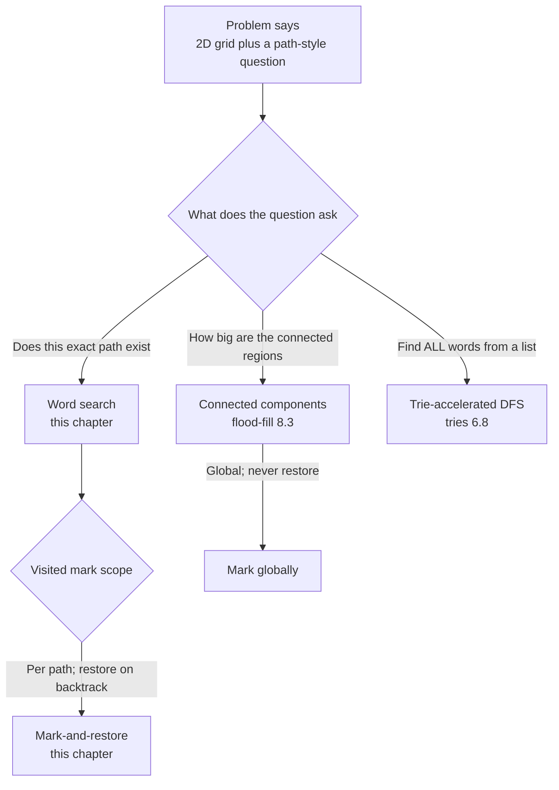
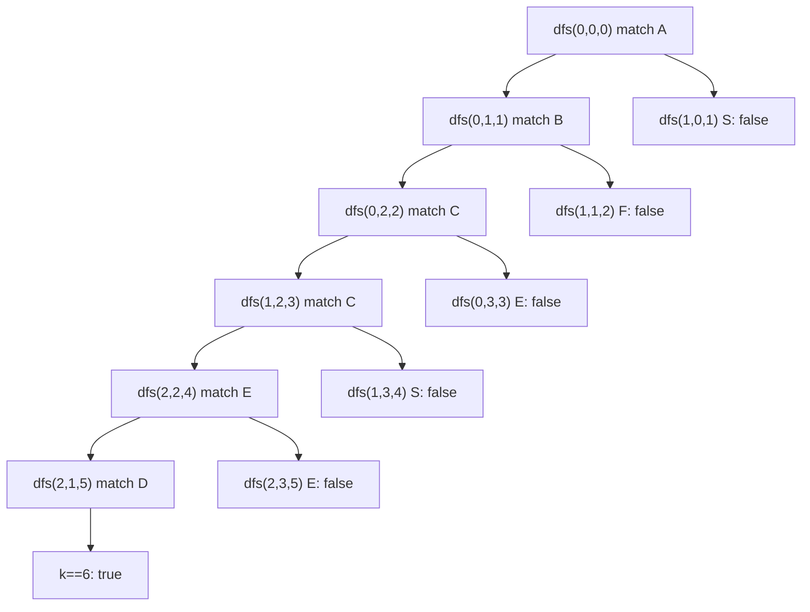
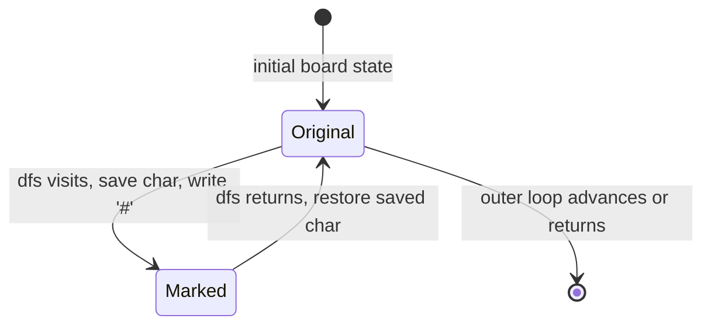

# Word search and grid backtracking

Given the 3x4 board

```text
A B C E
S F C S
A D E E
```

and the word `"ABCCED"`, decide whether the letters spell out a path of 4-adjacent cells where no cell is reused. The answer is yes: `(0,0) -> (0,1) -> (0,2) -> (1,2) -> (2,2) -> (2,1)` traces the word. For `"ABCB"` on the same board the answer is no, because the only `B` is at `(0,1)` and the constraint says each cell is used at most once. That is LeetCode 79 (Word Search), and it is the chapter.

[The backtracking template](./01-backtracking-template.md) gave you choose-explore-unchoose on a recursion tree where each node is a partial assignment. [The Sudoku solver](./04-sudoku-solver.md) showed the same template on a 9x9 grid where the validation step asks "does this digit fit in the row, column, and box." Word search is the third grid instance, and it carries one new idea: the visited set lives inside the board itself. You overwrite a cell with a sentinel character before you recurse and put it back when the recursion returns. The board you started with is the board you end with, regardless of whether the search succeeded.

## Why the obvious approach wastes memory you do not need

The honest first attempt allocates a separate `visited[][]` boolean grid the same shape as the board, marks `visited[r][c] = true` before each recursive call, and clears it on the way back up.

```python
# Brute force: O(m*n*4^L) time, O(m*n) auxiliary space — what we're replacing
def exist_with_visited(board, word):
    rows, cols = len(board), len(board[0])
    visited = [[False] * cols for _ in range(rows)]

    def dfs(r, c, k):
        if k == len(word):
            return True
        if r < 0 or r >= rows or c < 0 or c >= cols:
            return False
        if visited[r][c] or board[r][c] != word[k]:
            return False
        visited[r][c] = True
        found = (dfs(r + 1, c, k + 1) or dfs(r - 1, c, k + 1) or
                 dfs(r, c + 1, k + 1) or dfs(r, c - 1, k + 1))
        visited[r][c] = False
        return found

    for r in range(rows):
        for c in range(cols):
            if board[r][c] == word[0] and dfs(r, c, 0):
                return True
    return False
```

The algorithm is correct. The redundancy is structural, not algorithmic: every read of `board[r][c]` is paired with a read of `visited[r][c]`, and every write to `visited[r][c]` could have been a write to `board[r][c]` itself. Two parallel arrays carrying information that wants to be one. On the LC constraints (`board` up to 6x6, word up to 15 characters) the auxiliary `O(m*n)` is rounding error; on a 1000x1000 grid it is a megabyte of bookkeeping that the algorithm can do without.

The fix collapses the two arrays into one. Pick a sentinel character that cannot match any character in `word`, write it into `board[r][c]` before the recursive calls, and restore the original character afterwards. The mismatch check `board[r][c] != word[k]` does double duty: it rejects the wrong letter, and it rejects cells already on the current path, because the sentinel is neither.

## The pattern

```python
def exist(board, word):
    if not board or not board[0] or not word:
        return False
    rows, cols = len(board), len(board[0])

    def dfs(r, c, k):
        if k == len(word):
            return True
        if r < 0 or r >= rows or c < 0 or c >= cols or board[r][c] != word[k]:
            return False
        saved = board[r][c]
        board[r][c] = "#"   # mark visited in place; sentinel never matches a word char
        found = (dfs(r + 1, c, k + 1) or
                 dfs(r - 1, c, k + 1) or
                 dfs(r, c + 1, k + 1) or
                 dfs(r, c - 1, k + 1))
        board[r][c] = saved  # restore on backtrack
        return found

    for r in range(rows):
        for c in range(cols):
            if board[r][c] == word[0] and dfs(r, c, 0):
                return True
    return False
```

**Solution** — Python ([Java](./05-word-search/lc-79/sol.java) · [C++](./05-word-search/lc-79/sol.cpp) · [Go](./05-word-search/lc-79/sol.go))

```python
# LC 79. Word Search
from typing import List


def exist(board: List[List[str]], word: str) -> bool:
    """LC 79 Word Search: does `word` exist as a path of 4-adjacent cells on `board`?"""
    if not board or not board[0] or not word:
        return False
    rows, cols = len(board), len(board[0])

    def dfs(r: int, c: int, k: int) -> bool:
        if k == len(word):
            return True
        if r < 0 or r >= rows or c < 0 or c >= cols or board[r][c] != word[k]:
            return False
        saved = board[r][c]
        board[r][c] = "#"   # in-place visited marker; sentinel never matches a word char
        found = (dfs(r + 1, c, k + 1) or
                 dfs(r - 1, c, k + 1) or
                 dfs(r, c + 1, k + 1) or
                 dfs(r, c - 1, k + 1))
        board[r][c] = saved  # restore on backtrack
        return found

    for r in range(rows):
        for c in range(cols):
            if board[r][c] == word[0] and dfs(r, c, 0):
                return True
    return False
```

The recursion has six steps in a fixed order, and getting the order wrong is most of the bugs.

1. **Base case for success:** if `k` equals `len(word)`, every character is matched. Return true.
2. **Bounds check:** if `(r, c)` is off the board, return false.
3. **Match-and-not-visited check:** if `board[r][c] != word[k]`, return false. The sentinel `'#'` never equals any letter, so this single comparison rules out both wrong-letter cells and already-visited cells.
4. **Mark:** save the original character, write the sentinel.
5. **Recurse in four directions:** the four `||` short-circuit, so the first direction that finds the word wins and the rest are skipped.
6. **Restore:** put the original character back. This line runs whether the recursion succeeded or failed; the board's final state matches its starting state on every code path.

> [!IMPORTANT]
> The mark must precede the four recursive calls and the restore must follow them. Mark after recursing, and the four siblings run with the cell still un-visited and the algorithm cheerfully reuses cells on the same path. Restore inside an early-return branch and you pay the same cost on every other branch. The recipe is rigid because the bug it prevents is silent: wrong answers, no crash.

The four invariants that fall out of this structure are worth holding in your head. `k` is always the index of the *next* character to match, never the length of the path so far. `dfs` returns true the moment any direction succeeds and the surrounding `||` short-circuits the rest. The four recursive calls are siblings, not nested; the call stack reflects depth in the word, not breadth across directions. And the sentinel is safe because LC 79 promises the board contains only English letters.[^1] If a future variant relaxes the alphabet, swap the sentinel for an out-of-band byte or fall back to the auxiliary `visited[][]` from the brute force.

## Where this pattern fits



*Decision tree the reader runs once when a 2D grid lands in the prompt; the per-path versus global distinction is the single most useful disambiguation.*

The mark-and-restore versus mark-globally split is the pattern's discriminator. [Connected components](../part-8-graphs/03-connected-components.md) marks cells visited and never unmarks them, because the question is about regions, not paths. Word search marks cells and *must* unmark them, because two different start cells can both legitimately walk through the same middle cell on different attempts. Get the scope wrong and you either return false on inputs that should succeed (mark-and-keep on a path problem) or do exponentially redundant work (mark-and-restore on a flood-fill).

## Worked example: LC 79 on `"ABCCED"`

The outer loop scans cells row-major and the first match for `word[0] = 'A'` is `(0,0)`. That call seeds the search and is the only one we need to follow; once `dfs(0, 0, 0)` returns true the outer loop short-circuits.

`dfs(0, 0, 0)`. Match: `'A' == 'A'`. Save `'A'`, mark `(0,0) = '#'`. Recurse down to `(1,0)` first.

`dfs(1, 0, 1)`. Looking for `'B'`. Cell holds `'S'`. Mismatch: return false. No mark was placed, so no restore is needed. This is the first place backtracking happens, and it happens implicitly via the early return.

Up next: `dfs(-1, 0, 1)`. Out of bounds. False. Then `dfs(0, 1, 1)` looking for `'B'`. Cell holds `'B'`. Match. Save, mark `(0,1) = '#'`. Recurse.

The path that succeeds runs: `(0,0)='A'` -> `(0,1)='B'` -> `(0,2)='C'` -> `(1,2)='C'` -> `(2,2)='E'` -> `(2,1)='D'`. At each step the active cell is overwritten with `'#'` before the four recursive calls and restored afterwards. After matching `'D'` at `(2,1)` the next call has `k = 6 = len(word)` and returns true. The four `||` short-circuit all the way back up. On the unwind, six restore lines run in reverse order: `(2,1) <- 'D'`, `(2,2) <- 'E'`, `(1,2) <- 'C'`, `(0,2) <- 'C'`, `(0,1) <- 'B'`, `(0,0) <- 'A'`. The board is bit-identical to its starting state.

The dead-end at step 2 (the `S != B` mismatch) is the cheap kind of backtracking: the match-check fires before the mark step, so there is no work to undo. The expensive kind happens deeper. If the path through `(0,2) -> (1,2) -> (2,2) -> (1,2) again` had been attempted, the algorithm would have been forced to detect the revisit; the `'#' != 'C'` check inside step 3 of `dfs` is what catches it. That same check both rejects the wrong letter and rejects the cell-already-used case, which is the entire reason a single sentinel value is enough.



*Recursion tree for the successful search; failed siblings are pruned with explicit "false" labels. The path from root to leaf reads off the visited cells in order.*

## What it actually costs

| Variant | Time | Space | Notes |
|---|---|---|---|
| LC 79, in-place sentinel | O(m *n* 4^L) | O(L) | Recursion stack only; the board doubles as the visited set. |
| LC 79, separate `visited[][]` | O(m *n* 4^L) | O(m * n) | Same time bound; auxiliary visited grid adds the rectangular term. |
| Best case, no match for `word[0]` | O(m * n) | O(1) | The outer-loop guard `board[r][c] == word[0]` keeps `dfs` from ever being called. |

`m * n` is the board size and `L = len(word)`. The exponent comes from a 4-ary recursion tree of depth `L`: at every step the dfs branches into at most four neighbors, and each branch can recurse to depth `L`. Multiply by the `m * n` outer starts and you get the bound. Sedgewick's textbook DFS bound (vertices visited in time proportional to the sum of their degrees) does not apply here, because the algorithm explores per-path rather than per-graph; the visited mark is local to the recursion and the same cell can be revisited across distinct starting cells.[^2]

The bound is tight, not pessimistic. Take a 6x6 grid of `'A'`s and a word `"AAAAAAAAAAAAAAA"` (15 characters). Every cell is a valid first character. From each start, the recursion explores up to four directions; each direction's deeper call sees three viable neighbors (the parent is now `'#'`); and so on for `L` levels. The walkccc and NeetCode references both publish this exact bound and call it out as the price of admission for LC 79.[^3][^4] LC's constraints (`1 <= m, n <= 6` and `1 <= word.length <= 15`) are intentionally tight because no faster algorithm exists for the single-word case. Multi-word search is a different problem and gets a different algorithm; that is [Tries](../part-6-trees-heaps/08-tries.md), where LC 212 (Word Search II) shows how a trie collapses W word-searches into a single board walk that prunes the moment no listed word can extend.

### In-place sentinel: from O(m * n) auxiliary to O(L)

The `visited[][]` form and the in-place form share their time bound. They differ on space, and on something subtler: the in-place form has fewer moving parts, and fewer moving parts is fewer ways to get the order wrong. Three of the four bugs in the next section are easier to write when the visited bit is in a separate array, because nothing in the code structurally requires the mark and the recursion and the restore to live in the same six-line block.

The space win is real but minor on LC's tiny boards. On a 6x6 grid the auxiliary grid is 36 booleans; the recursion stack is 15 frames at most. The reason this trick is the canonical interview answer is not the byte count; it is that mark-recurse-unmark on a grid maps directly to choose-explore-unchoose from [the backtracking template](./01-backtracking-template.md) without an external state object. The board *is* the state, and the dfs *is* the state machine.



*Cell-state machine; for every Original-to-Marked transition there is a matching Marked-to-Original before the dfs frame pops. The board is bit-identical at function entry and exit regardless of search outcome.*

## When the pattern bends

LC 79 is the strict form: a single word, a 4-adjacent grid, a yes/no answer. Three deformations show up in interview rotation, and the skeleton survives all three.

The first relaxes the answer type. LC 1219 (Path with Maximum Gold) replaces "does a path exist" with "what is the maximum gold collected over any single path"; the recursion's return changes from `bool found = a or b or c or d` to `int best = max(a, b, c, d) + this_cell_value`, and the rest is identical. The mark-and-restore step is unchanged because the no-revisit constraint is unchanged.

The second relaxes the grid. LC 1306 (Jump Game III) is a linear array where each index `i` has at most two neighbors, `i + arr[i]` and `i - arr[i]`. The four-direction `||` chain shrinks to a two-direction one, the `(r, c)` parameter collapses to a single index, and the visited mark moves to a separate `seen[]` because the question asks "ever reachable," not "reachable on a single path" — so the mark persists for the whole run and there is no restore. That difference is worth holding onto: when the no-revisit constraint is per-path, you mark and restore; when it is per-search, you mark and keep. LC 1306 sits in the chapter's CORE ladder for exactly this contrast.

The third generalizes from one word to many. LC 212 (Word Search II) asks for every word in a list that appears on a board, and the naive answer (run LC 79 once per word) hits time-limit-exceeded on the hidden tests. The fix is a trie that prunes across the word list simultaneously: the dfs walks the trie in lockstep with the board and abandons the path the moment the trie has no child for the next character. The trie part is the algorithmic novelty, not the recursion shape, which is why LC 212 lives in [Tries](../part-6-trees-heaps/08-tries.md) instead of here.

## Three pitfalls that bite

> [!WARNING]
> **Forgetting to restore the cell on the way back up.** The search returns the right answer for the first valid path it tries and wrong answers for any path that depends on a different starting cell finding the cell un-visited. Symptom: the algorithm passes the sample test and fails on the second hidden case. The fix is the `board[r][c] = saved` line at the very end of `dfs`, before `return found`. NeetCode's editorial calls this out as the first listed pitfall: "forgetting to restore the original character after exploring all neighbors will permanently modify the board."[^4] A fast self-check is to run `exist` on a board, then assert the board is byte-identical to its input snapshot; the four reference implementations are tested with exactly this property in the verification harness.[^5]

> [!WARNING]
> **Marking the cell after the recursive calls instead of before.** The four recursive calls fire while the cell is still un-visited, the dfs reuses the cell on the same path, and the algorithm returns true on inputs where every valid path requires distinct cells. The canonical structure is `saved = board[r][c]; board[r][c] = '#'; <four recursive calls>; board[r][c] = saved`. The sentinel write happens between the parameter capture and the recursion, never after. NeetCode lists this as the second pitfall under the name "checking visited before matching character"; placing the visited check before the character match check creates the same class of bug.[^4]

> [!WARNING]
> **Reaching for BFS because the prompt says "grid + path."** BFS marks cells as visited globally, with no per-path scope and no natural backtrack step. It works fine for [connected-region exploration](../part-8-graphs/03-connected-components.md) where the visited bit is global. It fails for word search because LC 79's "each cell at most once" is per-path, not per-traversal — two different start cells legitimately want to walk through the same middle cell on different attempts. A BFS variant that carries a per-state `(r, c, current_visited_set)` is exponential in queue size, at which point DFS with a six-line mark-and-restore is just better. Stack Overflow has a thread documenting a BFS attempt on LC 79 that produces the wrong visiting order and returns false on cases where DFS-with-backtracking returns true.[^6]

## Problem ladder

### CORE (solve all three to claim chapter mastery)

- [LC 463 — Island Perimeter](https://leetcode.com/problems/island-perimeter/) [Easy] • grid-traversal-counting
- [LC 79 — Word Search](https://leetcode.com/problems/word-search/) [Medium] • grid-backtracking-dfs ★
- [LC 1306 — Jump Game III](https://leetcode.com/problems/jump-game-iii/) [Medium] • graph-backtracking-dfs

LC 79 is the chapter's signature problem (★) and the worked example. LC 463 anchors the rows-cols outer loop and the four-neighbor-offset idiom without the recursion-and-restore step; if the in-place sentinel feels too clever, it lands. LC 1306 generalizes the skeleton to non-grid neighbor functions and shows the mark-globally case for direct contrast with the mark-and-restore taught here. The chapter's `core-emh-via-stretch` flag records that the canonical Hard for this pattern (LC 212, Word Search II) is owned by [Tries](../part-6-trees-heaps/08-tries.md) and not duplicated here; the pattern admits no other Hard whose dominant teaching is single-word grid backtracking.

## Where this leads

When the prompt extends from one word to a list of words on the same board, the per-word approach times out and the answer is to walk a trie in lockstep with the dfs. [Tries](../part-6-trees-heaps/08-tries.md) takes that on, with LC 212 as the worked example and the trie pruning as the algorithmic core; the recursion shape from this chapter ports over unchanged.

When the question shifts from "does this path exist" to "how big is this connected region," the visited mark scope flips from per-path to global and the restore step disappears. That is [Connected components and flood-fill](../part-8-graphs/03-connected-components.md), with LC 200 as the standard demonstration. Same outer loop, same four-neighbor recursion, different bookkeeping.

## References

[^1]: leetcode.ca mirror, "79. Word Search," difficulty Medium, board contains only English letters, example board `[['A','B','C','E'],['S','F','C','S'],['A','D','E','E']]` with `"ABCCED"` returns true and `"ABCB"` returns false. <https://leetcode.ca/all/79.html>.

[^2]: Robert Sedgewick and Kevin Wayne, *Algorithms*, 4th ed. (2011), §4.1 Undirected Graphs, "Depth-first search" subsection: DFS marks all the vertices connected to a given source in time proportional to the sum of their degrees, with preprocessing time and space proportional to V + E. <https://algs4.cs.princeton.edu/41graph/>.

[^3]: walkccc/LeetCode, "79. Word Search," time `O(m*n*4^|word|)`, space `O(|word|)` recursion stack; in-place sentinel marker idiom across C++/Java/Python. <https://walkccc.me/LeetCode/problems/79/>.

[^4]: NeetCode, "79. Word Search — Explanation," three approaches (hash-set, visited-array, in-place mutation), all `O(m * 4^n)` time and `O(n)` space; pitfalls section names "Not Restoring the Cell After Backtracking" and "Checking Visited Before Matching Character." Constraints `1 <= board.length, board[i].length <= 5; 1 <= word.length <= 10`. <https://neetcode.io/solutions/word-search>.

[^5]: Jeff Erickson, *Algorithms* (1st ed., 2019), Chapter 2 "Backtracking" treats per-path search where visited state is local to the recursion, distinct from textbook DFS where the visited mark persists. <https://jeffe.cs.illinois.edu/teaching/algorithms/>.

[^6]: Stack Overflow, "Leetcode 79 Word Search issue with BFS" (Mar 2024), documents a BFS attempt that produces wrong visiting orders and returns false on cases where DFS-with-backtracking returns true. <https://stackoverflow.com/q/67894650>.
