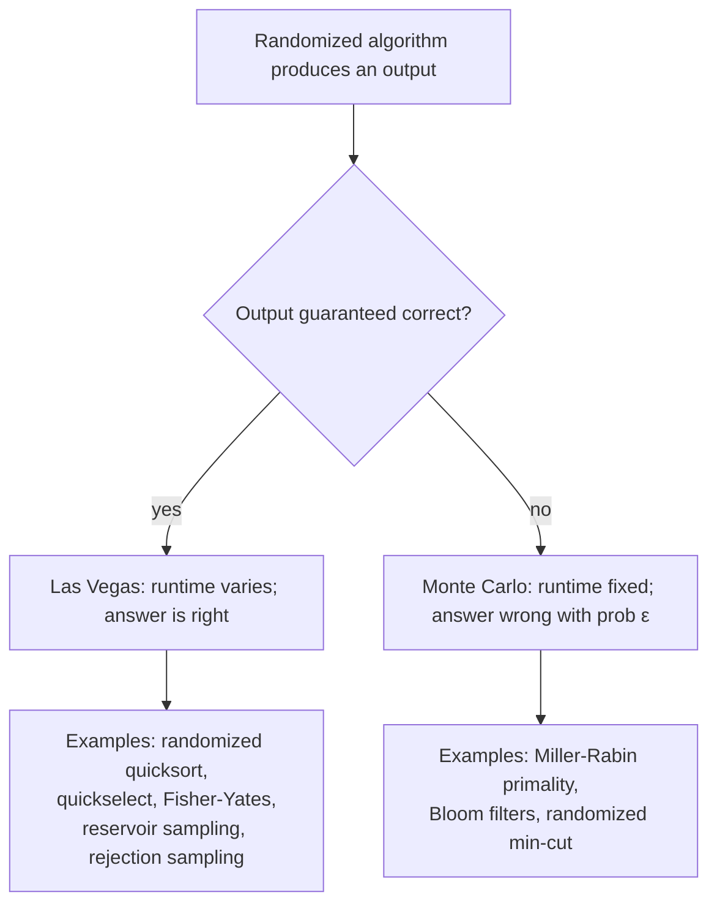
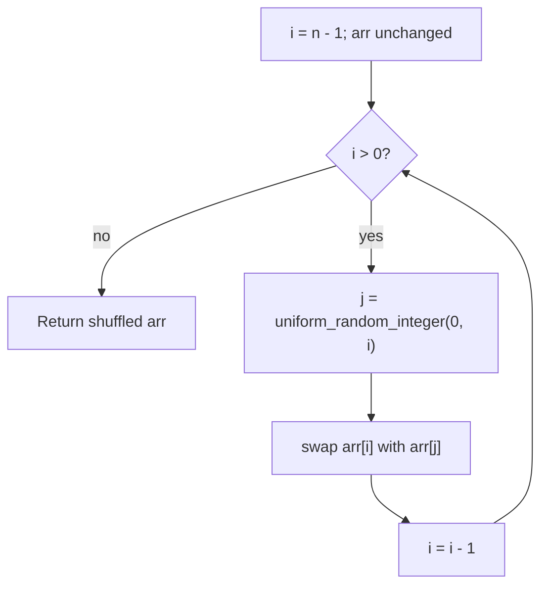
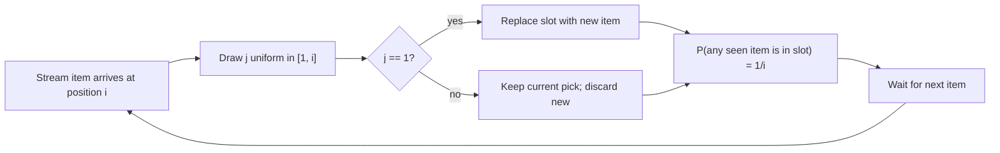

# Randomized algorithms: Fisher-Yates, reservoir sampling, rejection sampling

Knuth opens the section on reservoir sampling in Volume 2 of *The Art of Computer Programming* with a confession: *"This algorithm may appear to be unreliable at first glance and, in fact, to be incorrect. But a careful analysis shows that it is completely trustworthy."* The algorithm picks a uniformly random sample of size `k` from a stream whose length you do not know. Reading it as code, before watching the math, the reader's first response is the right one. It looks broken. It is not.

Three problems from three different families share that property in this chapter. Shuffle a million-element array so every permutation is equally likely. Pick a uniform random index of a target value in a stream you cannot rewind. Build a uniform-on-`{1..10}` generator from a black-box `rand7()` you cannot rewrite. Each has a tempting wrong answer and a correct answer whose correctness only emerges from a probability calculation. The chapter teaches the three techniques side by side because the trick is the same: a small amount of extra randomness, deployed in the right place, replaces a much larger amount of computation, memory, or oracle access.

## The taxonomy: Las Vegas versus Monte Carlo

Randomized algorithms split into two families along a single axis: when the random coins betray you, what fails — the answer or the runtime?[^1]

A **Las Vegas algorithm** always returns a correct answer. The randomness affects how long it takes; on a bad coin sequence, the algorithm runs longer, but the output stays right. Randomized quicksort and quickselect from [Quickselect: linear-time selection](../part-2-search-sort/07-quickselect.md) are the canonical examples. The pivot is uniform-random; a streak of bad pivots costs you `Theta(n^2)` work in the worst case, but the answer at the end is the k-th element either way.

A **Monte Carlo algorithm** has a fixed runtime budget but a small chance of returning a wrong answer. The Miller-Rabin primality test is the textbook case: run `k` rounds, declare a number prime if every round agrees, and accept a `4^(-k)` false-positive probability against composite inputs. The deterministic AKS algorithm (Agrawal-Kayal-Saxena, 2002) eliminates the error and proved that primality testing lives in P, but Miller-Rabin is what production code ships because the constants are about three orders of magnitude smaller and the error probability for any practical `k` is under any reasonable physical event you would be willing to compare it against.[^2]



*The single axis that separates the two families. Every algorithm in this chapter is Las Vegas: the answer is always uniform; only the time-to-answer is probabilistic (and for Fisher-Yates and reservoir, even that is deterministic).*

The three techniques in this chapter (Fisher-Yates shuffle, reservoir sampling, rejection sampling) are all Las Vegas. Fisher-Yates always produces a permutation of the input; reservoir sampling always returns `k` items from the stream; rejection sampling always returns a sample from the target distribution. The randomness lives in *which* permutation, *which* `k` items, *how long* until acceptance, never in *whether the output is valid*.

Knowing the family in advance changes how you reason about the algorithm. For Las Vegas, the question is "what is the expected runtime?" For Monte Carlo, it is "what is the failure probability, and how do I drive it down?" The two questions have different answers and different proof techniques. Conflating them is the most common source of confusion when randomized algorithms appear in interviews.

## Fisher-Yates: shuffle in linear time

LeetCode 384 (Shuffle an Array) is the textbook randomized-shuffle problem. You hold an array of `n` integers and a `shuffle()` method that must return a permutation; the contract is that every one of the `n!` permutations is equally likely. The reset method returns the original. Calls alternate.

The wrong answer feels obviously right. Walk the array; at each index `i`, swap `arr[i]` with `arr[rand(0, n-1)]`. Each element gets touched once; the loop is `O(n)`; randomness is sprinkled in. This implementation produces a non-uniform distribution. For `n = 3` the loop generates `3^3 = 27` distinct execution paths but there are only `3! = 6` permutations; some permutations appear five times across the 27 paths and others four. The bias is small enough that a casual test ("did the output differ from the input?") will not detect it, large enough that Microsoft shipped it in their 2009 EU browser-ballot bug and Internet Explorer ended up third-place more often than chance would predict.[^3]

The fix is one line. At each step, draw the random index from the *unshuffled* portion only, the suffix you have not yet locked. Durstenfeld's 1964 reformulation walks `i` from `n-1` down to `1`, draws `j` uniformly from `[0, i]` inclusive, and swaps. Each element ends up in its final position the moment `i` reaches that index; the algorithm never touches it again. The proof is a counting argument: there are exactly `n!` execution paths (`n` choices, then `n-1`, then `n-2`, down to `1`), one per permutation, and the random integer at each step is uniform, so each permutation appears exactly once.[^4]

```python
import random
from typing import List


class Solution:
    def __init__(self, nums: List[int]):
        self.original = list(nums)

    def reset(self) -> List[int]:
        return list(self.original)

    def shuffle(self) -> List[int]:
        arr = list(self.original)
        for i in range(len(arr) - 1, 0, -1):
            j = random.randint(0, i)
            arr[i], arr[j] = arr[j], arr[i]
        return arr
```

**Solution** — Python ([Java](./06-randomized-algorithms/lc-384/sol.java) · [C++](./06-randomized-algorithms/lc-384/sol.cpp) · [Go](./06-randomized-algorithms/lc-384/sol.go))

```python
# LC 384. Shuffle an Array
import random
from typing import List


class Solution:
    def __init__(self, nums: List[int]):
        self.original = list(nums)

    def reset(self) -> List[int]:
        return list(self.original)

    def shuffle(self) -> List[int]:
        arr = list(self.original)
        # Durstenfeld: i descends from n-1 down to 1; j drawn uniformly from
        # [0, i] inclusive; swap arr[i] with arr[j]. The inclusive upper bound
        # is what makes the distribution uniform: dropping i from the range
        # produces Sattolo's algorithm (single-cycle permutations only).
        for i in range(len(arr) - 1, 0, -1):
            j = random.randint(0, i)
            arr[i], arr[j] = arr[j], arr[i]
        return arr
```

The inclusive upper bound on the random draw is the entire algorithm. `random.randint(0, i)` includes `i`; the iteration where `j == i` swaps the element at position `i` with itself, a no-op on the array but a coin flip the math depends on. Drop the upper bound, write `random.randint(0, i - 1)` instead, and the algorithm becomes Sattolo's, which generates only `(n-1)!` single-cycle permutations. Every element moves; no element returns to its original position. The off-by-one is the most common bug in shuffle implementations; TheAlgorithms/JavaScript repo carried it in their `bogoSort.js` Fisher-Yates routine until late 2024.[^5]



*The Durstenfeld loop. The unshuffled prefix shrinks by one each iteration; the shuffled suffix grows. Position `i` is locked the moment the swap completes.*

The complexity is `Theta(n)` time and `O(1)` extra space, both tight. Every uniform random permutation algorithm must read every element at least once (otherwise some position's distribution is fixed by the input), so `Theta(n)` is the lower bound; Durstenfeld matches it with exactly `n - 1` swaps and `n - 1` random draws. CLRS gives the formal uniformity proof in §5.3 (`RANDOMIZE-IN-PLACE`, Lemma 5.5) via a loop invariant on `(i-1)`-permutations of the unshuffled prefix.[^4]

> [!CAUTION]
> **The naive `swap with rand(0, n-1)` shuffle is biased even though it looks uniform.** The bias is small for small `n` and impossible to spot without a histogram. Production code that "shuffles" with this pattern has a real corner case: any time the count of distinct permutations matters (poker decks, A/B test bucketing, encryption key permutations), the missing fraction matters. The fix is one character: `rand(0, i)` instead of `rand(0, n - 1)`.

## Reservoir sampling: pick from a stream you cannot rewind

LeetCode 398 (Random Pick Index) sets the trap. Given `nums` and a target value, return a uniformly random index where the value appears. The array can be huge; calls to `pick(target)` are frequent. The clean answer — bucket every value at construction time, then index uniformly into the bucket — works when the array fits in memory. When it does not, when the array arrives as a stream you cannot index, the bucket approach collapses.

Reservoir sampling is the streaming analogue. Keep a single slot. As the stream arrives, replace what is in the slot with probability `1/i` on the `i`-th item; keep the current pick with probability `1 - 1/i`. After processing the entire stream of length `n`, the slot holds a uniformly random item; every input item ended up there with probability exactly `1/n`. The algorithm runs in one pass with `O(1)` extra space. It is the algorithm Knuth's confession was about.[^6]

```python
import random
from typing import List


class Solution:
    def __init__(self, nums: List[int]):
        self.nums = nums

    def pick(self, target: int) -> int:
        chosen_idx = -1
        match_count = 0
        for idx, value in enumerate(self.nums):
            if value != target:
                continue
            match_count += 1
            if random.randint(1, match_count) == 1:
                chosen_idx = idx
        return chosen_idx
```

```python
# LC 398. Random Pick Index
import random
from typing import List


class Solution:
    def __init__(self, nums: List[int]):
        self.nums = nums

    def pick(self, target: int) -> int:
        """Reservoir sampling, k = 1. One scan, O(1) extra space.

        After processing the i-th match (1-indexed), every match seen so
        far is the current pick with probability exactly 1/i. The trick:
        when the i-th match arrives, replace the current pick with
        probability 1/i (i.e., when randint(1, i) == 1).
        """
        chosen_idx = -1
        match_count = 0
        for idx, value in enumerate(self.nums):
            if value != target:
                continue
            match_count += 1
            # Replace with probability 1/match_count.
            if random.randint(1, match_count) == 1:
                chosen_idx = idx
        return chosen_idx
```

The chapter's reservoir-sampling reference is Python only; the four-language treatment is reserved for LC 384, where the canonical test runs all four. The algorithm transcribes cleanly to Java's `ThreadLocalRandom.current().nextInt(matchCount) == 0`, C++'s `std::uniform_int_distribution<>(0, matchCount-1)(rng) == 0`, and Go's `rng.Intn(matchCount) == 0`; each language's idiom for "bernoulli with probability `1/i`" is the inner check.



*Reservoir sampling for `k = 1` per stream item. The probability that any item seen so far is the current pick decays as `1/i`; after `n` items, every input has probability exactly `1/n`.*

### Why each item has equal probability

Reading the algorithm as code, the suspicion is that early items must accumulate too much probability. Item 1 starts in the slot; item 2 evicts it with probability `1/2`; item 3 evicts whatever is there with probability `1/3`. Surely after `n` items, item 1 is over-represented because it had `n - 1` chances to survive while item `n` had only one chance to enter? The math says no, and the proof is short.

**Claim.** After the algorithm processes item `i`, every item among `{1, 2, ..., i}` is in the reservoir slot with probability exactly `1/i`.

**Proof by induction on `i`.**

*Base case* (`i = 1`): the algorithm stores item 1 unconditionally. Probability `1 = 1/1`. ✓

*Inductive step.* Assume the claim holds at step `i - 1`: every item among `{1, ..., i-1}` is currently in the slot with probability `1/(i-1)`. Now item `i` arrives. The algorithm draws `j` uniformly from `{1, 2, ..., i}` and replaces the slot iff `j == 1`.

The new item enters the slot with probability `Pr[j == 1] = 1/i`. ✓ for the new item.

For any older item `x`, two events must happen for it to be in the slot after step `i`: it must have been in the slot before step `i` (prior probability `1/(i-1)` by induction), and the new draw must not evict it (probability `1 - 1/i = (i-1)/i`). The two events are independent. The prior reservoir state is fixed before step `i` runs, and the new random draw is fresh. Multiply:

$$
\Pr[x \text{ in slot after step } i] = \frac{1}{i-1} \cdot \frac{i-1}{i} = \frac{1}{i}.
$$

The new item and every old item share the same probability `1/i`. The induction closes. ∎

The proof is the chapter's load-bearing argument. Without it, the algorithm reads as superstition. With it, the `1/i` invariant emerges as a fixed point: every item, every step, exactly `1/i`. After `n` items the slot holds a uniformly random item, which is what the contract demanded.

The general `k > 1` case is identical with a small adjustment: when item `i > k` arrives, draw `j` uniformly from `{1, ..., i}` and, if `j <= k`, evict slot `j`. The same induction goes through with `k/i` replacing `1/i` everywhere; an item survives both conditions (prior membership probability `k/(i-1)`, survival probability `1 - 1/i`) to give `k/(i-1) * (i-1)/i = k/i`.[^6]

The complexity is one pass over the stream, `O(1)` extra space for `k = 1`, `O(k)` for general `k`. The lower bound is `Theta(n)`: any algorithm that admits item `i` to the reservoir must at minimum read it, and the algorithm must read every item to give it a chance. Vitter's 1985 paper introduces an Algorithm Z that achieves expected `O(k(1 + log(n/k)))` time by sampling geometric jump distances and skipping items algorithmically; production streaming systems (Apache DataSketches' reservoir sketch, BigQuery's approximate sampling) ship Algorithm Z when `n >> k` because the constant matters at petabyte scale.[^6]

> [!IMPORTANT]
> **The single-slot version (`k = 1`) is what shows up in interviews.** LC 398 and LC 382 (Linked List Random Node) both fix `k = 1`. The general-`k` version is the one to derive on the whiteboard *after* the interviewer asks for it. Working out general-`k` cold requires you to remember which side of the `j <= k` comparison evicts which slot; working out `k = 1` from the proof above is mechanical because the probability argument and the code line up.

## Rejection sampling: build the right distribution by discarding the wrong one

LeetCode 470 (Implement Rand10() Using Rand7()) is the cleanest rejection-sampling problem on the platform. You have `rand7()` returning a uniform integer in `{1, 2, ..., 7}`; build `rand10()` returning a uniform integer in `{1, 2, ..., 10}`. The catch: `7^k` is never a multiple of `10` for any positive integer `k`, so no truncation of any product of `rand7()` calls produces a clean uniform `{0, ..., 9}` distribution.

The naive answer ignores this. Combine two `rand7()` calls into a number in `{0, ..., 48}` and take the result modulo 10. This is wrong. Residues 0 through 8 each appear five times in `{0, ..., 48}` (count: `0, 10, 20, 30, 40` for residue 0) but residue 9 appears only four times (`9, 19, 29, 39`; the candidate at 49 is missing because the sum maxes at 48). Probability of `rand10 == 1` is approximately `5/49 = 0.102`, not `0.1`. The bias is small but visible across millions of draws and large enough that any platform that needs uniformity (cryptographic shuffles, Monte Carlo simulations, fair-coin experiments) cannot ship it.

Rejection sampling fixes the bias by throwing the bad outcomes out. Two `rand7()` calls form 49 equally-likely outcomes. Map them to the integers `{1, 2, ..., 49}`. Accept the first 40, project them onto `{1, ..., 10}` (four 1s, four 2s, ..., four 10s — uniform), and *reject* the last 9, redrawing from scratch. The rejected region is the algorithm's safety valve; throwing those outcomes away is what makes the surviving distribution uniform.

```python
def rand10() -> int:
    while True:
        roll = (rand7() - 1) * 7 + rand7()
        if roll <= 40:
            return ((roll - 1) % 10) + 1
```

```python
# LC 470. Implement Rand10 Using Rand7


def rand7() -> int:
    """Stub — interview problem provides this as a black box returning
    a uniform integer in 1..7. The real harness injects the LC version.
    """
    raise NotImplementedError


def rand10() -> int:
    """Two rand7 calls form 49 equally-likely outcomes. Accept the first
    40 (uniform on 1..40) and project onto 1..10; reject 41..49 and
    redraw. Expected calls per accepted sample = 2 * 49 / 40 = 2.45.
    """
    while True:
        # Map the 49 outcomes to 1..49 with no overlap; accept 1..40.
        roll = (rand7() - 1) * 7 + rand7()
        if roll <= 40:
            # 40 outcomes split evenly into 10 groups of 4 each.
            return ((roll - 1) % 10) + 1
        # roll in 41..49: reject and continue.
```

The expected number of `rand7()` calls per accepted `rand10()` answer is `2 / (40/49) = 49/20 = 2.45`. Each outer iteration is two `rand7()` calls; the geometric distribution with success probability `p = 40/49` has expected value `1/p = 49/40 ≈ 1.225` outer iterations per acceptance.[^7]

The general shape of rejection sampling is one of the simplest patterns in the chapter. You can sample from an *easy* distribution (uniform on a large set) and you need a sample from a *hard* one (uniform on a small subset). Sample from the easy distribution; if the result lies in the target subset, accept; otherwise, redraw. The expected work per accepted sample is `1/p` outer iterations where `p` is the acceptance probability.

The acceptance probability has a production cost. Low `p` causes long-tail latency: the 99th percentile of iterations is `ceil(log(0.01) / log(1 - p))`, which blows up as `p` approaches zero. For LC 470 the `40/49` choice is a sweet spot. A lazier alternative (use one `rand7()` call, accept outcomes 1 to 5, double-sample to extend to 1 to 10) has acceptance probability `5/7 ≈ 0.714` and burns more `rand7()` calls in expectation. A more elaborate alternative (three `rand7()` calls for 343 outcomes, accept the first 340) has `p = 340/343 ≈ 0.991` but uses three `rand7()` calls per attempt, giving 3.03 expected calls per acceptance, marginally worse than 2.45. The two-call-accept-40 design is the local optimum for the small-integer ranges this problem operates on.

## Where this connects to quickselect

The Las Vegas idea (correctness fixed, runtime randomized) first appeared in this handbook as randomized partition for quickselect. The chapter on [Quickselect: linear-time selection](../part-2-search-sort/07-quickselect.md) made the case that random pivot is not a performance optimization; it is the correctness fix that turns a `Theta(n^2)`-on-adversarial-input algorithm into one that runs in `Theta(n)` expected time on every input. The same argument runs the other direction here: Fisher-Yates is randomized partition's cousin, applied to the entire array instead of one pivot at a time. Reservoir sampling is the streaming version of "give me a random element of an array I cannot fully store." Rejection sampling is what `rand7 -> rand10` shares with Las Vegas in spirit: the failure mode is "draw again", never "produce the wrong answer."

The umbrella property, correctness independent of randomness and runtime conditional on it, is what makes Las Vegas algorithms safe to ship. An adversary feeding worst-case inputs cannot break the answer, only the latency. Production systems pair Las Vegas algorithms with timeout fallbacks: `std::nth_element` is randomized quickselect with a heapsort fallback when recursion depth crosses a threshold; production shuffle routines run Fisher-Yates with a CSPRNG so an attacker cannot predict the output. The framework is general; the chapter's three techniques are three doors into it.

## Pitfalls

> [!WARNING]
> **The off-by-one that produces Sattolo's algorithm.** Writing `random.randint(0, i - 1)` instead of `random.randint(0, i)` excludes self-swap and produces only `(n-1)!` single-cycle permutations. Every element moves; the result is no longer uniform on permutations. Test with `n = 3`: a uniform shuffle of `[1, 2, 3]` produces all six permutations including `[1, 2, 3]` itself; Sattolo never produces the identity. The inclusive upper bound is required, not optional.

> [!WARNING]
> **PRNG period and internal-state limits cap the reachable distribution.** A 32-bit-state PRNG produces at most `2^32 ≈ 4.3` billion distinct sequences after seeding. For `n = 13`, `13! ≈ 6.2` billion exceeds `2^32`, so a 32-bit PRNG cannot reach every permutation no matter how clean the Fisher-Yates loop is. For a 52-card deck, `52! ≈ 8 * 10^67` and no 64-bit PRNG comes close. Online-poker shuffling bugs in the 2000s recovered hands in milliseconds because the seeded shuffles only covered four billion of the `52!` decks. Use a CSPRNG when the application is adversarial.[^8]

> [!CAUTION]
> **Modulo bias in rand-from-rand constructions.** `(rand7() + rand7() - 2) % 10 + 1` produces a non-uniform distribution because `49 mod 10 != 0`. The fix is rejection sampling, not "more iterations" or "a bigger product". Whenever the source range size is not a multiple of the target range size, modulo gives biased results. The rule is mechanical: count outcomes; reject the prefix or suffix that breaks divisibility; redraw.

> [!WARNING]
> **The "swap with random whole-array index" shuffle bug.** The implementation `for i in range(n): swap(arr[i], arr[rand(0, n-1)])` looks like Fisher-Yates but is biased: `n^n` execution paths versus `n!` permutations. For `n = 3`, that is 27 paths over 6 permutations; some appear five times, others four. Always draw from the *unshuffled* portion (`rand(0, i)` for the descending-i variant or `rand(i, n-1)` for the ascending-i variant). The descending form is canonical in CLRS §5.3 and is what the four reference implementations use.[^4]

> [!WARNING]
> **Forgetting to seed the RNG deterministically in tests.** Empirical "is the shuffle uniform?" tests must run on a fixed seed so the result is reproducible. The four reference implementations for LC 384 are verified against 10,000 shuffles of `[1, 2, 3, 4, 5]` with `seed = 42`; every `(value, position)` cell lands at `2000 ± 150` occurrences. A test with `random.shuffle(arr)` and a check that "outputs differ" is not a uniformity test; it is an "is randomness present" test, which any biased shuffle also passes.

## Problem ladder

The randomized-algorithm canonical pool on LeetCode is Medium-or-Hard; no Easy problem teaches Fisher-Yates, reservoir sampling, or rejection sampling at the depth this chapter requires. The CORE three span M/M/H under the `no-easy-canonical` curation flag.

### CORE (solve all three to claim chapter mastery)

- [LC 384 — Shuffle an Array](https://leetcode.com/problems/shuffle-an-array/) [Medium] • randomized-shuffle ★
- [LC 398 — Random Pick Index](https://leetcode.com/problems/random-pick-index/) [Medium] • reservoir-sampling *(reference: Python only)*
- [LC 710 — Random Pick with Blacklist](https://leetcode.com/problems/random-pick-with-blacklist/) [Hard] • rejection-sampling-with-remap *(reference: Python only)*

### STRETCH (optional)

- [LC 470 — Implement Rand10() Using Rand7()](https://leetcode.com/problems/implement-rand10-using-rand7/) [Medium] • rejection-sampling *(reference: Python only)*
- [LC 382 — Linked List Random Node](https://leetcode.com/problems/linked-list-random-node/) [Medium] • reservoir-sampling-streaming

LC 710 is the hardest of the three and pairs rejection sampling with a hash-remap trick: instead of redrawing on a blacklisted index, remap each blacklisted position in `[0, n - |B|)` to a non-blacklisted position in `[n - |B|, n)`, yielding `O(1)` per pick after `O(|B|)` construction. The naive draw-and-reject solution is `O(|B|)` per call and times out on the largest test cases. LC 380 (Insert/Delete/GetRandom O(1)) is locked at chapter 1.4 hash-collisions and not part of this chapter's ladder; the array-of-keys + hash-of-positions structure underpins LC 710's optimal solution but the chapter cites it only in passing.

## Where this leads

The randomization theme continues in [Skip lists](../part-13-design-the-data-structure/00-lru-cache.md) (planned), where geometric-distribution level promotion is itself a rejection-sampling instance, and in [Hash maps with universal hashing](../part-12-strings-pattern-matching/01-rabin-karp.md) (planned), where the random pick of a hash function from a family is one Fisher-Yates draw on the family's index set. The Monte Carlo side of the taxonomy (Bloom filters, Miller-Rabin, randomized min-cut) gets a dedicated treatment in Part 13 once the deterministic baselines are in place.

## References

[^1]: The Las Vegas / Monte Carlo distinction is the standard taxonomy for randomized algorithms, formalized in CLRS 4th ed. (Cormen, Leiserson, Rivest, Stein, *Introduction to Algorithms*, MIT Press, 2022) Chapter 5 §5.3 and Wikipedia's [Randomized algorithm](https://en.wikipedia.org/wiki/Randomized_algorithm)

[^2]: Miller-Rabin primality testing originates in two papers: Gary L. Miller, "Riemann's hypothesis and tests for primality," *Journal of Computer and System Sciences*, 13(3):300-317, 1976 (deterministic, conditional on the generalized Riemann hypothesis); Michael O.

[^3]: Jeff Atwood, ["The Danger of Naïveté"](https://blog.codinghorror.com/the-danger-of-naivete/)

[^4]: The Durstenfeld in-place form of Fisher-Yates first appeared in Richard Durstenfeld, "Algorithm 235: Random permutation," *Communications of the ACM*, 7(7):420, July 1964 (DOI: 10.1145/364520.364540).

[^5]: Sattolo's algorithm, the off-by-one variant of Fisher-Yates that generates only single-cycle permutations, is documented at [Wikipedia "Sattolo's algorithm"](https://en.wikipedia.org/wiki/Fisher%E2%80%93Yates_shuffle#Sattolo's_algorithm).

[^6]: Reservoir sampling Algorithm S appears in Donald E. Knuth, *The Art of Computer Programming*, Volume 2: *Seminumerical Algorithms*, 3rd ed., Addison-Wesley, 1998, §3.4.2.

[^7]: The expected-iterations argument for rejection sampling (`1/p` iterations per acceptance under acceptance probability `p`) follows from the geometric distribution; the result is given in CLRS 4th ed. Appendix C and Wikipedia's [Rejection sampling](https://en.wikipedia.org/wiki/Rejection_sampling)

[^8]: The PRNG-period ceiling on reachable permutations is documented at Wikipedia's [Fisher-Yates shuffle](https://en.wikipedia.org/wiki/Fisher%E2%80%93Yates_shuffle)
