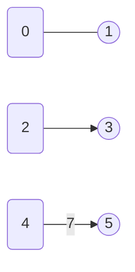
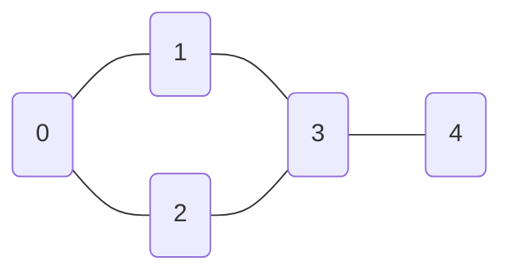

# Graph representation

A LeetCode problem with `n = 10^5` vertices fits in roughly 1.6 MB if you store the graph one way and demands roughly 10 GB if you store it the other. Same graph, same vertices, same edges. The choice between adjacency list and adjacency matrix is the difference between Accepted and Memory Limit Exceeded, and it's the first decision every Part 8 chapter assumes you've already made.

This chapter sets the menu and picks the default. Three ways to represent a graph in code: adjacency list, adjacency matrix, edge list. One default for the interview-scale case (`n ≤ 10^4`, edges sparse): adjacency list. Two narrow exceptions where the matrix or the raw edge list earns its place. After this chapter, every traversal, shortest-path, and minimum-spanning-tree algorithm in Part 8 takes the adjacency list as input and runs.

## The diagram legend (used across all of Part 8)

Every Part 8 chapter draws graphs with the same Mermaid conventions, so the reader doesn't relearn the visual grammar in chapter 8.4 that they learned in 8.1.

- **Hollow circles** `(0)` mark unvisited vertices.
- **Filled circles** `((0))` mark visited vertices (or the current vertex during a trace).
- **Plain edges** with no arrowhead are undirected.
- **Arrowed edges** `-->` are directed.
- Edge weights, when present, sit on the edge label: `--|7|-->`.

Here's the legend rendered:



*Vertex 0 is unvisited, vertex 1 is visited; the 0-1 edge is undirected. The 2-3 edge is directed. The 4-5 edge is directed and weighted 7.*

That's the full vocabulary. Chapters 8.1 through 8.12 inherit it without re-explaining.

## The three representations

Each representation answers the same two questions in different ways: *what are u's neighbors?* and *is there an edge from u to v?*

The same five-vertex undirected graph runs through every section of this chapter. Lock its picture in your head:



*Five vertices, five undirected edges. Vertex 3 is the most-connected (degree 3); vertex 4 is a leaf (degree 1). The traversal chapters reuse this graph as their canonical input.*

### Adjacency list

A length-`n` array of lists. Index `u` holds the list of u's neighbors. Built by walking the input edge list once and appending each edge to its endpoints' lists.

```python
def build_adjacency_list(n, edges, directed=False):
    adj = [[] for _ in range(n)]
    for u, v in edges:
        adj[u].append(v)
        if not directed:
            adj[v].append(u)            # undirected: push both halves
    return adj
```

For the canonical graph above, the result is:

```text
adj[0] = [1, 2]
adj[1] = [0, 3]
adj[2] = [0, 3]
adj[3] = [1, 2, 4]
adj[4] = [3]
```

`neighbors(u)` is `adj[u]`, iterated in `Θ(deg(u))`. `hasEdge(u, v)` is a linear scan of `adj[u]`, worst case `Θ(deg(u))`. Build is `Θ(V + E)`. Space is `Θ(V + E)`. Sedgewick & Wayne's `Graph.java` in *Algorithms*, 4th ed. is the canonical implementation; the Javadoc states the same `Θ(E + V)` space and `Θ(1)` per-method bound this section just derived.[^1]

### Adjacency matrix

An `n`-by-`n` boolean matrix. `M[u][v] = true` exactly when an edge exists from u to v. For undirected graphs, the matrix is symmetric. Built by allocating an `n × n` zero matrix and flipping a bit for each edge.

```python
def build_adjacency_matrix(n, edges, directed=False):
    M = [[False] * n for _ in range(n)]
    for u, v in edges:
        M[u][v] = True
        if not directed:
            M[v][u] = True
    return M
```

For the canonical graph:

```text
    0 1 2 3 4
  ┌──────────
0 │ 0 1 1 0 0
1 │ 1 0 0 1 0
2 │ 1 0 0 1 0
3 │ 0 1 1 0 1
4 │ 0 0 0 1 0
```

`hasEdge(u, v)` is one array index, `Θ(1)`. That's the matrix's reason to exist. The flip side: `neighbors(u)` requires scanning a full row, `Θ(V)`, even when `deg(u)` is tiny. Build cost is `Θ(V^2)` regardless of edge count, dominated by the zero-fill. Space is the same `Θ(V^2)`.

### Edge list

The raw input: an array of `(u, v)` tuples (or `(u, v, w)` for weighted edges). No per-vertex structure at all. Space is `Θ(E)`.

```text
edges = [(0,1), (0,2), (1,3), (2,3), (3,4)]
```

`neighbors(u)` requires scanning the entire list to find edges touching u, `Θ(E)` per query, useless for traversal. `hasEdge(u, v)` is the same `Θ(E)` scan. The edge list shines when the algorithm consumes edges in bulk and never asks for neighbors: Kruskal's MST sorts the edges by weight and feeds them through Union-Find one at a time; Bellman-Ford relaxes every edge `V - 1` times in any order. For these, the input format LeetCode hands you `edges[][]` *is* the working representation.

## Picking the right one

The decision rule fits on one line: **adjacency list by default; adjacency matrix only when the graph is dense or you genuinely need `O(1)` edge tests; edge list only when you're feeding it directly into Kruskal or Bellman-Ford.**

| You see... | Reach for... |
|---|---|
| `n ≤ 10^4`, sparse edges, BFS/DFS/Dijkstra body | Adjacency list (default) |
| `n ≤ 500` and many `hasEdge(u, v)` queries, OR `E ≈ V^2` (Floyd-Warshall, transitive closure, dense graphs) | Adjacency matrix |
| Kruskal MST, Bellman-Ford, edge-centric streaming, problem hands you `edges[][]` and never asks for neighbors | Edge list |

The density threshold the matrix needs to earn its place is roughly `E ≈ V^2 / 2`. CLRS §22.1 frames it directly: *"The adjacency-list representation provides a compact way to represent sparse graphs (where |E| is much less than |V|^2); it is usually the method of choice. The adjacency-matrix representation is preferred when the graph is dense (|E| is close to |V|^2)."*[^2]

The constraint that actually decides matters more than the asymptotic argument. At the `n ≤ 10^5` ceiling LC sets for graph problems, the adjacency list costs about `10^5 * 8 + 10^5 * 8 ≈ 1.6 MB` of memory; the matrix costs `(10^5)^2 = 10^{10}` cells, tens of gigabytes. The matrix is unimplementable at LC's scale long before its time bound becomes interesting. In interview rooms with small `n`, the matrix becomes viable; even there, the adjacency list still wins on every traversal-shaped algorithm because traversal cost is `Θ(V + E)` for the list and `Θ(V^2)` for the matrix.

> [!IMPORTANT]
> Default to the adjacency list. The matrix is for `n ≤ 500` problems with `O(1)` edge tests in the inner loop (Floyd-Warshall, transitive closure). The edge list is for Kruskal and Bellman-Ford. Every other Part 8 chapter consumes adjacency lists.

## What it actually costs

| Representation | Build time | Space | `neighbors(u)` | `hasEdge(u, v)` | `addEdge(u, v)` |
|---|---|---|---|---|---|
| Adjacency list | `Θ(V + E)` | `Θ(V + E)` | `Θ(deg(u))` | `O(deg(u))` | `Θ(1)` amortized |
| Adjacency matrix | `Θ(V^2)` | `Θ(V^2)` | `Θ(V)` | `Θ(1)` | `Θ(1)` |
| Edge list | `Θ(E)` | `Θ(E)` | `Θ(E)` | `Θ(E)` | `Θ(1)` (append) |

*Bounds from CLRS §22.1 and Sedgewick & Wayne `Graph.java`.[^1][^2]*

Two notes on those numbers. The `Θ(1)` amortized cost for adjacency-list `addEdge` is the dynamic-array doubling argument from Part 1: every push is amortized constant even though some pushes trigger an underlying reallocation. The `O(deg(u))` worst case for adjacency-list `hasEdge` becomes `O(1)` average if you swap the inner list for a `HashSet<Integer>` per vertex; the constant-factor space cost is the trade.

## LC 1971: building the adjacency list, then traversing it

LC 1971 (Find if Path Exists in Graph) is the simplest problem that forces a full round-trip. The input is `n`, an `edges[][]` array, a source, and a destination; the output is whether a path exists. The natural answer: convert the edge list to an adjacency list, then run BFS from source until you reach destination or exhaust the connected component.

```python
from collections import deque

def valid_path(n, edges, source, destination):
    if source == destination:
        return True
    adj = [[] for _ in range(n)]
    for u, v in edges:
        adj[u].append(v)
        adj[v].append(u)                # undirected: push both halves
    visited = [False] * n
    visited[source] = True
    q = deque([source])
    while q:
        u = q.popleft()
        for v in adj[u]:
            if v == destination:
                return True
            if not visited[v]:
                visited[v] = True
                q.append(v)
    return False
```

**Solution** — Python ([Java](./00-graph-representation/lc-1971/sol.java) · [C++](./00-graph-representation/lc-1971/sol.cpp) · [Go](./00-graph-representation/lc-1971/sol.go))

```python
# LC 1971. Find if Path Exists in Graph
# Build an adjacency list from the edges, then BFS from source. The build
# is O(V + E); the BFS is O(V + E). Total O(V + E) time and space.
from collections import deque
from typing import List


def valid_path(n: int, edges: List[List[int]], source: int, destination: int) -> bool:
    if source == destination:
        return True
    adj: List[List[int]] = [[] for _ in range(n)]
    for u, v in edges:
        adj[u].append(v)
        adj[v].append(u)                       # undirected: push both halves
    visited = [False] * n
    visited[source] = True
    q = deque([source])
    while q:
        u = q.popleft()
        for v in adj[u]:
            if v == destination:
                return True
            if not visited[v]:
                visited[v] = True
                q.append(v)
    return False
```

Two parts of this code are doing all the work. The first is the build: `adj[u].append(v); adj[v].append(u)` for both halves, because the graph is undirected. The second is the visited array allocated next to the adjacency list: `visited = [False] * n`. Every Part 8 traversal pairs an `adj` of size `V + E` with a `visited` of size `V`. CP-Algorithms's reference BFS uses exactly this `vector<vector<int>> adj; vector<bool> used(n);` pairing.[^3] The visited array isn't a quirk of BFS; it's the representation of *traversal state*, sitting beside the representation of the *graph itself*.

The traversal mechanics belong to chapter 8.1; what this chapter establishes is the contract. The adjacency list is built in `O(V + E)`, the BFS runs in `O(V + E)`, the total is `O(V + E)`. Every chapter from 8.1 onward inherits this build phase verbatim and replaces the BFS body with whatever algorithm it teaches.

## The variants you'll meet

Each axis below is independent of the choice between list, matrix, and edge list. They compose.

### Directed vs undirected

Undirected graphs push both halves of each edge into the adjacency list; directed graphs push only the source-to-destination half. One constructor flag decides. Sedgewick & Wayne ship separate `Graph` and `Digraph` classes for exactly this reason; the only behavioural delta is the second push.[^1]

The undirected case has one quiet cost: every edge appears twice in the adjacency-list cell count, so the total cell count is `2E`. Space stays `Θ(V + E)` in big-O, but the constant factor is real for memory-tight problems.

### Weighted vs unweighted

Weighted graphs replace the inner cell `int` with a `(neighbor, weight)` pair. In Python that's a tuple `(v, w)`. In Java, an `int[]` of length 2 (`new int[]{v, w}`) or a small `Edge` record. In C++, `std::pair<int, int>`. In Go, a struct field. Algorithms that actually use the weight (Dijkstra, Bellman-Ford, Prim, Kruskal) always consume one of these shapes; algorithms that don't (BFS, DFS, plain reachability) ignore the weight.

The trap is integer overflow on path sums. When `V * max_w > 2^31`, an `int` accumulator wraps; promote to `long` (Java) or `int64` (Go) before the multiply.

### Vertex IDs: dense integers vs strings

LC's standard input format is `(n, edges)` with vertices already labelled `0` to `n - 1`. The adjacency list is then `List<List<Integer>>` (Java), `vector<vector<int>>` (C++), `[][]int` (Go), or `List[List[int]]` (Python): an array-of-lists, indexed directly by vertex.

When the input gives string IDs instead (LC 399 Evaluate Division, LC 721 Accounts Merge), two options. Either keep the structure as `Map<String, List<String>>` and pay a hash on every lookup, or remap strings to dense integers `0..n-1` once on read and use the array shape for everything downstream. The remap is almost always worth it: Union-Find, BFS visited arrays, and DP tables all want array indices, not string keys.

### Implicit graphs

A grid is a graph in disguise. So is a list of words where two words are connected if they differ by one character. Building an explicit adjacency list for a `100 × 100` grid (10,000 vertices, ~40,000 edges) is a waste; the neighbor function is four lines of arithmetic:

```python
def grid_neighbors(r, c, rows, cols):
    for dr, dc in ((-1, 0), (1, 0), (0, -1), (0, 1)):
        nr, nc = r + dr, c + dc
        if 0 <= nr < rows and 0 <= nc < cols:
            yield (nr, nc)
```

The traversal algorithm doesn't care whether neighbors come from `adj[u]` or from a generator. MIT 6.006 frames this explicitly: graph algorithms are written against an `adj[u]` accessor, and any implementation that supplies neighbors works.[^4] LC 200 (Number of Islands), LC 994 (Rotting Oranges), and LC 127 (Word Ladder) are all implicit graphs.

### In-edges as easily as out-edges

Some algorithms need to walk backwards along edges (Kosaraju SCC, Tarjan SCC, "min vertices to reach all nodes"). Two options: maintain a parallel `in_adj` of the reversed graph, or compute the reverse on demand. Both are `Θ(V + E)`.

When the algorithm only needs in-degree counts (Kahn's topological sort, LC 1557), an `int[] in_degree` of size V is enough; no in-list, no reverse graph. LC 1557 is the cleanest example of this and earns its STRETCH seat in this chapter precisely because the answer requires no adjacency list at all:

```python
def find_smallest_set_of_vertices(n, edges):
    in_degree = [0] * n
    for _, v in edges:                  # only the destination matters
        in_degree[v] += 1
    return [u for u in range(n) if in_degree[u] == 0]
```

**Solution** — Python ([Java](./00-graph-representation/lc-1557/sol.java) · [C++](./00-graph-representation/lc-1557/sol.cpp) · [Go](./00-graph-representation/lc-1557/sol.go))

```python
# LC 1557. Minimum Number of Vertices to Reach All Nodes
# In a DAG, a vertex is unreachable from any other vertex iff its in-degree
# is zero. The answer is the set of in-degree-zero vertices. No adjacency
# list is needed; an int[] of size n is sufficient. O(V + E) time, O(V) space.
from typing import List


def find_smallest_set_of_vertices(n: int, edges: List[List[int]]) -> List[int]:
    in_degree = [0] * n
    for _, v in edges:                         # only the destination matters
        in_degree[v] += 1
    return [u for u in range(n) if in_degree[u] == 0]
```

The lesson is that "graph representation" includes deciding the *minimum* structure the algorithm needs. Sometimes that's an adjacency list. Sometimes it's a single integer array.

## Where readers go wrong

> [!WARNING]
> **Forgetting the second push for undirected graphs.** The most common LC graph bug. The reader writes `adj[u].append(v)` for every edge in the input and forgets that an undirected edge is *two* entries in the adjacency-list view. BFS finds nodes on one side of an edge but not the other; `validPath(0, 5)` returns false on a graph the example clearly shows is connected. Wire the `directed` flag into the constructor and let it decide; never branch later in the algorithm.

> [!WARNING]
> **Using `Map<Integer, List<Integer>>` when vertex IDs are dense.** The Pythonic / Java-fluent reflex is to reach for a hash map keyed by vertex. When the input gives you `0..n-1`, an `int[][]` or `List<List<Integer>>` is two to five times faster on the LC judge: cache locality, no per-lookup hashing, no autoboxing. Reserve `Map<...>` for genuine string-keyed problems (LC 399, LC 721). CP-Algorithms uses `vector<vector<int>>` exclusively for this reason.[^3]

> [!WARNING]
> **Building an adjacency list when the algorithm is edge-centric.** Kruskal's MST sorts edges by weight and scans them once with Union-Find, no `adj` ever. Bellman-Ford relaxes every edge `V - 1` times in any order, no `adj` ever. Before writing 30 lines of adjacency-list construction, ask what the algorithm actually consumes. If the answer is "edges in some order," the input edge list is already the right shape.

> [!WARNING]
> **Mutating the adjacency list during traversal.** `ConcurrentModificationException` in Java, iterator invalidation in C++, "dictionary changed size during iteration" in Python. The fix isn't to add try/catch; it's to never mutate. Kahn's topological sort decrements an `int[] inDegree` and never touches the adjacency list itself; tombstone-mark deleted edges with a sentinel value if the algorithm needs to remember they existed; snapshot a neighbor list before iterating it if you genuinely need to modify it.[^5]

## Problem ladder

This chapter is on the `FOUNDATION_FRAMEWORK_EXEMPT` list (DSH-15 carve-out): foundation chapters ship one or two illustrative anchors with no Easy/Medium/Hard span requirement. Real graph problems begin in chapter 8.1.

### CORE

- [LC 1971 — Find if Path Exists in Graph](https://leetcode.com/problems/find-if-path-exists-in-graph/) [Easy] • graph-representation-build-and-traverse ★

### STRETCH (optional)

- [LC 1557 — Minimum Number of Vertices to Reach All Nodes](https://leetcode.com/problems/minimum-number-of-vertices-to-reach-all-nodes/) [Medium] • graph-in-degree-only

## Where this leads

Every algorithm in Part 8 takes the adjacency list this chapter built and runs against it. Next up: [Breadth-first search](./01-bfs.md), the canonical adjacency-list consumer, queue-based traversal that visits every vertex in shortest-path order from the source. The build phase is the one you just wrote in `validPath`; the traversal body is what 8.1 teaches.

## References

[^1]: Robert Sedgewick and Kevin Wayne, *Algorithms*, 4th ed., Addison-Wesley, 2011, §4.1 "Undirected Graphs." <https://algs4.cs.princeton.edu/41graph/Graph.java.html>

[^2]: Cormen, Leiserson, Rivest, Stein, *Introduction to Algorithms*, 4th ed., MIT Press, 2022, Chapter 22 §22.1.

[^3]: CP-Algorithms (translated from e-maxx.ru), "Breadth-first search." The canonical `vector<vector<int>> adj;` adjacency-list paired with `vector<bool> used(n);` for visited tracking; updated 2024-10-13. [cp-algorithms.com/graph/breadth-first-search](https://cp-algorithms.com/graph/breadth-first-search.html).

[^4]: MIT 6.006 Spring 2020 (Erik Demaine, Jason Ku, Justin Solomon), "Lecture 9: Breadth-First Search." The course's graph unit treats graphs as an `adj[u]` accessor abstraction, with concrete representations (set object, hash dict, array) chosen at construction time. [ocw.mit.edu/courses/6-006-introduction-to-algorithms-spring-2020](https://ocw.mit.edu/courses/6-006-introduction-to-algorithms-spring-2020/resources/mit6_006s20_lec9/).

[^5]: walkccc LeetCode mirror, "1557. Minimum Number of Vertices to Reach All Nodes." <https://walkccc.me/LeetCode/problems/1557/>
