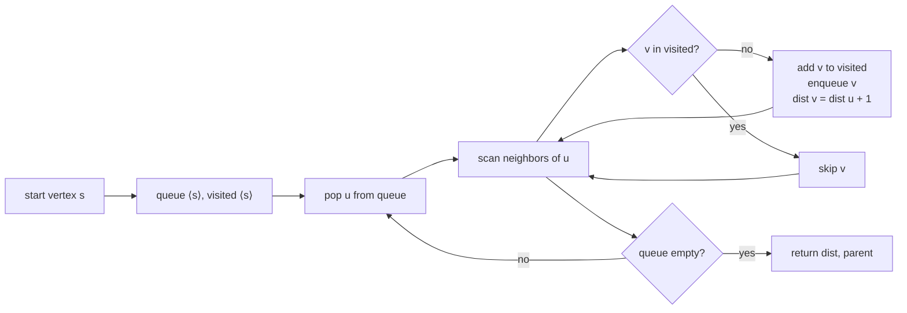
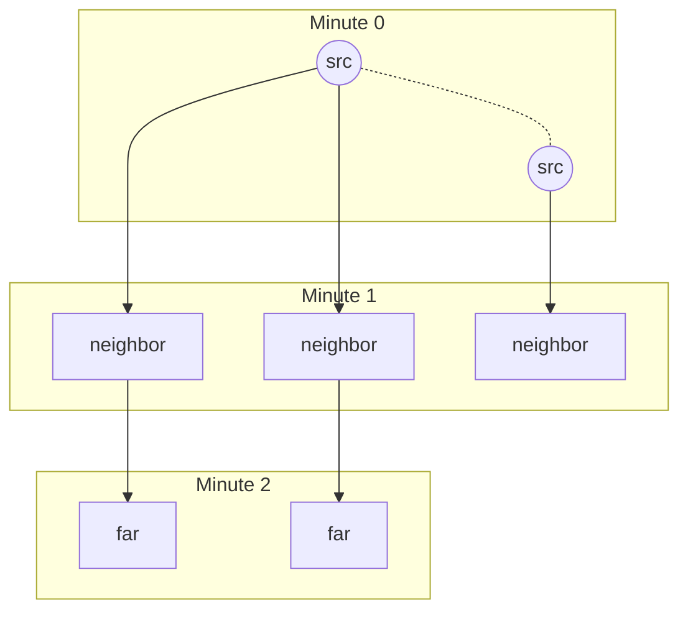

# Breadth-first search

A 3×3 grid of oranges. One of them is rotten, eight are fresh, and every minute a rotten orange spreads to its four-cardinal neighbors. After how many minutes is none left fresh? The answer for `[[2, 1, 1], [1, 1, 0], [0, 1, 1]]` is 4. For `[[2, 1, 1], [0, 1, 1], [1, 0, 1]]` it's `-1`, because one fresh cell is walled off and never gets reached.

That's LC 994. It's the canonical setup for this chapter, and it forces you to confront BFS as it actually exists: a queue, a visited set, and the discipline of never enqueuing the same cell twice. The minute count falls out the moment fresh hits zero, which sounds obvious until you write it as code and realize how many ways there are to get the count off by one.

## The contract

Two pieces of state, working in lockstep.

A **FIFO queue** holds cells the algorithm has discovered but not yet expanded. The "F" in FIFO is doing real work here: a cell pushed earlier is popped earlier, which is exactly what makes the second piece of state possible.

A **visited set** holds cells the algorithm has already discovered, regardless of whether they've been expanded. This is the part beginners get wrong. *Discovered* means "has been added to the queue at least once." Not "has been popped." If you mark cells visited when you pop them instead of when you push them, you'll push the same cell two or three times, and your O(V + E) algorithm becomes O(V · E) on a dense graph.

The invariant the FIFO discipline buys you: at any point in the run, every cell in the queue is at one of two consecutive distances from the start. The queue drains a complete layer at distance `d` before any cell at distance `d + 1` gets popped. That's the level-by-level traversal property, and it's the reason BFS produces shortest paths in unweighted graphs.



*BFS as a finite control loop. The only branch that's not bookkeeping is the visited check, which is what bounds the algorithm's total work.*

## Why graphs need a visited set when trees don't

Tree BFS, the LC 102 level-order traversal that lives in [Level-order traversal](../part-6-trees-heaps/03-level-order-traversal.md), gets away without a visited set, because trees have no cycles. Every node has exactly one parent. The BFS frontier walks down the tree, layer by layer, and there's no way for two parents to point at the same child.

Graphs aren't trees. Two vertices can share a neighbor. Cycles exist. Without a visited bit, a 3-node triangle `A → B → C → A` produces a queue that fills with `A, B, C, A, B, C, A, B, C, ...` until you run out of memory. The visited set is what makes BFS a *terminating* algorithm on a graph with cycles, not just a level-order one on a tree.

The bookkeeping cost: one bit per vertex. The bound it preserves: O(V + E), proven below.

## The canonical implementation

LC 994 specifies a multi-source variant: every initially-rotten cell starts the clock at minute 0. The single-source case is a simpler version of the same code with one cell in the seed scan. We'll teach the multi-source version because it's the harder case and because the single-source version falls out of it for free.

Three phases. Scan the grid to seed every source at depth 0 and count the fresh cells. Drain the queue layer by layer, decrementing the fresh count as new cells get discovered. When the queue is empty, return the last depth seen if and only if every fresh cell was reached.

```python
from collections import deque

def oranges_rotting(grid):
    rows, cols = len(grid), len(grid[0])
    queue = deque()
    fresh = 0
    for r in range(rows):
        for c in range(cols):
            if grid[r][c] == 2:
                queue.append((r, c, 0))    # seed every source at depth 0
            elif grid[r][c] == 1:
                fresh += 1
    if fresh == 0:
        return 0
    minutes = 0
    dirs = ((1, 0), (-1, 0), (0, 1), (0, -1))
    while queue:
        r, c, t = queue.popleft()
        minutes = t
        for dr, dc in dirs:
            nr, nc = r + dr, c + dc
            if 0 <= nr < rows and 0 <= nc < cols and grid[nr][nc] == 1:
                grid[nr][nc] = 2           # mark visited at enqueue, not at dequeue
                fresh -= 1
                queue.append((nr, nc, t + 1))
    return minutes if fresh == 0 else -1
```

**Solution** — Python ([Java](./01-bfs/lc-994/sol.java) · [C++](./01-bfs/lc-994/sol.cpp) · [Go](./01-bfs/lc-994/sol.go))

```python
# LC 994. Rotting Oranges
from collections import deque
from typing import List


def oranges_rotting(grid: List[List[int]]) -> int:
    """LC 994 Rotting Oranges: minimum minutes until no fresh orange remains, or -1."""
    if not grid or not grid[0]:
        return 0
    rows, cols = len(grid), len(grid[0])
    queue = deque()
    fresh = 0
    for r in range(rows):
        for c in range(cols):
            if grid[r][c] == 2:
                queue.append((r, c, 0))
            elif grid[r][c] == 1:
                fresh += 1
    if fresh == 0:
        return 0
    minutes = 0
    dirs = ((1, 0), (-1, 0), (0, 1), (0, -1))
    while queue:
        r, c, t = queue.popleft()
        minutes = t
        for dr, dc in dirs:
            nr, nc = r + dr, c + dc
            if 0 <= nr < rows and 0 <= nc < cols and grid[nr][nc] == 1:
                grid[nr][nc] = 2
                fresh -= 1
                queue.append((nr, nc, t + 1))
    return minutes if fresh == 0 else -1
```

Three things in this code do real work and deserve a closer look.

`grid[nr][nc] = 2` happens *inside* the `if grid[nr][nc] == 1` branch, on the same line as the `queue.append`. That's the visited-at-enqueue rule made concrete. The grid itself doubles as the visited array. Once a cell flips from `1` to `2`, the discovery test on its next visitor reads `grid[nr][nc] == 1` and fails, so the cell never enters the queue twice.

Each queue entry carries its own depth as a third tuple element `t`. An alternative, the **layer-counted style**, uses an outer loop that drains the entire current frontier with `for _ in range(len(queue))` before bumping a `minute` counter. Both are correct. The depth-tagged form generalizes more cleanly to cases where different sources start at different depths (which is exactly LC 994's multi-source seeding); the layer-counted form is one-line cleaner when the answer is "minimum edges from a single source." Pick one, write it consistently across a chapter; switching styles mid-chapter is the most reliable way to ship an off-by-one.

The seed scan happens *before* the BFS loop runs, in a single pass over the grid. Every rotten cell goes in at depth 0. Mathematically this is equivalent to adding a virtual super-source connected to each true source by zero-weight edges; the O(V + E) analysis still holds because the virtual edges are scanned exactly once.[^1] What it buys you in code: one BFS run instead of one BFS per source, and a correct answer for "minimum minutes until *all* fresh are reached" instead of "minutes from any one source."

## Walking minutes 0 to 3

Take the smaller `[[2, 1, 1], [1, 1, 1]]`, which has one source at `(0, 0)` and five fresh cells. Every cell has at most four neighbors; the answer is three minutes.

Seed the queue with `(0, 0, 0)`. Pop it. Mark `(1, 0)` and `(0, 1)` as visited at depth 1, push them. The queue now reads `[(1, 0, 1), (0, 1, 1)]`. Pop `(1, 0, 1)`; its only fresh neighbor is `(1, 1)`, which goes in at depth 2. Pop `(0, 1, 1)`; its fresh neighbor is `(0, 2)`, also depth 2. Pop `(1, 1, 2)`; `(1, 2)` enters at depth 3. The fresh count just hit zero on that push, but the loop continues until the queue drains. Pop `(0, 2, 2)`, no fresh neighbors. Pop `(1, 2, 3)`, no fresh neighbors. Queue empty. Return 3.

The widget animates the same trace. Watch the queue column on the right and the per-cell minute label that gets stamped on each cell at the moment it's marked visited.

> **Interactive widget:** [Graph BFS — frontier expansion (multi-source on a grid)](../widgets/w-25-graph-bfs.yml) (panel `default`) — rendered on the website; the YAML spec describes the keyframes.

*Static fallback: minute 0 has one source at (0, 0); minute 1 has (1, 0) and (0, 1) visited; minute 2 adds (1, 1) and (0, 2); minute 3 adds (1, 2) and the fresh count hits zero. Answer = 3.*

## What it actually costs

| Variant | Time | Space | Notes |
|---|---|---|---|
| Single-source, generic graph | O(V + E) | O(V) | The textbook bound from CLRS 3rd ed. §22.2.[^2] |
| Multi-source grid (LC 994, 542, 286) | O(m·n) | O(m·n) | Specialization with V = m·n and E ≤ 4·m·n. |
| 8-directional grid (LC 1091) | O(n²) | O(n²) | Direction array length 8 instead of 4. |
| State-space BFS (LC 752 lock) | O(10⁴ · 8) | O(10⁴) | State count ≤ 10000; branching factor 8. |
| Word-graph BFS (LC 127) | O(N · L · 26) | O(N · L) | N = wordlist size, L = word length. |
| 0-1 BFS (deque variant) | O(V + E) | O(V) | Front-push for zero-weight edges; covered in [Dijkstra and 0-1 BFS](./09-dijkstra.md). |

The argument is short.[^2] Each vertex is enqueued at most once because the visited bit is set at enqueue time, so each enqueue and each dequeue is O(1). Each edge `(u, v)` is examined at most twice (once from each endpoint) on undirected graphs and once on directed graphs, and each examination is O(1) given an adjacency-list representation. Sum: O(V + E). The space bound is the visited array plus the queue; the queue never holds more than V elements because every enqueue is gated by the visited check.

For grids, V = m·n and E ≤ 4·m·n (or 8·m·n for the diagonal case), which collapses to O(m·n) in both dimensions. The space cost on a 1000×1000 grid is 4 MB for an int visited array, usually small enough not to matter, occasionally large enough to push you toward bit-packing.

## Multi-source BFS

The "what if there are several start points expanding at once?" case is one paragraph to state and one diagram to show.



*All sources expand simultaneously at minute 0; the BFS frontier produces per-cell minute counts that respect every source's clock at once.*

Seed every source at depth 0 in a single pre-loop scan, then run one BFS. That's it. The mathematical equivalent (virtual super-source plus zero-weight edges) is what makes this work without breaking the O(V + E) bound, but you don't need to think about super-sources to write the code; you just need to push every source before the main loop runs.

The pattern shows up in three problems. **LC 994** rots oranges from every initially-rotten cell. **LC 542** computes, for every cell in a binary matrix, the distance to the nearest zero: same algorithm, different question on the output side. **LC 286** Walls and Gates is the same again, with gates as sources and rooms as the cells whose distances you're filling in (it's LC Premium; LC 542 is the free equivalent and the one in the ladder).

The wrong way to handle this, the way that comes naturally if you're thinking single-source, is `for source in sources: bfs(source)`. That gives correct *single-source* distances n times over, which is not what the problem asks for. "Minimum minutes until all are reached" is "minute when the last fresh cell rots," which depends on the union of all source frontiers expanding in parallel. The seed-then-BFS pattern handles that union for free.

## Two pitfalls that bite

> [!WARNING]
> **Marking visited at dequeue instead of enqueue.** The intuition that says *"I haven't visited a node until I've popped it"* is wrong for BFS. When two already-queued neighbors `u₁` and `u₂` both point at the same undiscovered `v`, both will push `v` onto the queue before either gets a chance to pop it, unless `v`'s visited bit is set at the moment of the first push. The fix: set `visited[v] = true` on the same line as `queue.append(v)`, inside the `if not visited[v]` branch. The walkccc LC 542 reference uses an explicit `seen` array set at enqueue time and pushes with `seen[x][y] = true` on the same line as `q.emplace(x, y)`, exactly so this bug can't happen.[^3]

> [!WARNING]
> **`list.pop(0)` in Python instead of `deque.popleft`.** The dequeue cost goes from O(1) to O(n) because every remaining element shifts down one slot, turning the BFS from O(V + E) into O(V · (V + E)) and TLE-ing on grids ≥ 10×10. The algorithm is *correct*, just unacceptably slow. Always `from collections import deque` at the top of the file. The same bug destroys naive DFS-via-`list`-as-stack in the next chapter, [DFS](./02-dfs.md).

A third pitfall worth naming: the off-by-one on the minute count. LC 994 wants minutes elapsed (= edges traversed = depth at which the last fresh cell was discovered). LC 1091 wants path length in cells (= depth + 1, because the path *includes* the start). Different problems, different conventions, identical algorithm. The fix is to trace the canonical example by hand on a 3-cell straight-line path before submitting; the off-by-one is invisible until you watch one specific case run.

## When the pattern bends

### State-space BFS (LC 127, LC 752)

The "graph" is sometimes a set of states rather than an explicit adjacency list. LC 127 Word Ladder has words as vertices, with one-letter mutations as edges. LC 752 Open the Lock has 4-digit combinations as vertices, with `±1` on any wheel as edges. The BFS skeleton is identical to LC 994's: queue + visited set, layer-by-layer expansion. What changes is the neighbor function: `for v in neighbors_of(u)` is now a loop over generated states, not a stored adjacency list.

The complexity bound shifts accordingly. For LC 752, the state space is bounded at 10⁴ combinations and the branching factor is 8 (two directions × four wheels), so the run is O(10⁴ · 8) regardless of input. For LC 127, the bound is O(N · L · 26) where N is the wordlist size and L is the word length; the per-node cost dominates because generating neighbors means trying every position × every letter.

### 0-1 BFS

When edges carry weights of either 0 or 1, BFS with a queue undercounts because zero-weight edges should be free but FIFO treats them like length-1 edges. The fix is a deque: front-push the destination of a zero-weight edge, back-push the destination of a one-weight edge. Same O(V + E) bound, same visited-at-enqueue discipline. The full treatment lives in [Dijkstra and 0-1 BFS](./09-dijkstra.md), where the deque variant is taught alongside the priority-queue version that handles arbitrary positive weights.

### Layer-counted vs. depth-tagged

Two implementation styles for "what step are we on?":

- **Layer-counted**: outer loop counts steps, inner loop drains the current frontier with `for _ in range(len(queue))`. Cleaner when the answer is "minimum edges from a single source"; this is what walkccc's LC 994 / LC 1091 / LC 127 references use.[^3]
- **Depth-tagged**: each queue entry carries its own depth as part of the tuple. Cleaner when sources start at different depths (multi-source) or when the chapter wants to surface depth as a first-class variable. The §"Canonical implementation" code uses this.

Both produce the same answer. Switching styles mid-chapter, or worse, mid-function, is how interview off-by-ones get born.

## Where BFS is and isn't the right tool

The trigger is "shortest path" or "minimum number of steps" on an unweighted graph (or one where every transition carries the same cost). When the problem says that, reach for BFS.

When the problem doesn't say that, it's usually one of three other algorithms. **Weighted graphs with non-uniform positive weights** want Dijkstra; BFS undercounts because every edge is treated as length 1. **Negative weights** want Bellman-Ford; even Dijkstra can't handle those. **Topology-driven problems** like cycle detection in directed graphs, topological sort, or articulation points want DFS, because they need the recursion / parent-pointer structure that BFS can't provide.

The specific case of 0-1 weights is the exception that proves the rule: BFS-with-deque (covered in [Dijkstra and 0-1 BFS](./09-dijkstra.md)) is still O(V + E), strictly faster than Dijkstra, and the visited-at-enqueue rule from this chapter still holds.

## Problem ladder

### CORE (solve all three to claim chapter mastery)

- [LC 994 — Rotting Oranges](https://leetcode.com/problems/rotting-oranges/) [Medium] • bfs-multi-source-grid ★
- [LC 542 — 01 Matrix](https://leetcode.com/problems/01-matrix/) [Medium] • bfs-multi-source-grid
- [LC 1091 — Shortest Path in Binary Matrix](https://leetcode.com/problems/shortest-path-in-binary-matrix/) [Medium] • bfs-shortest-path-grid

### STRETCH (optional)

- [LC 127 — Word Ladder](https://leetcode.com/problems/word-ladder/) [Hard] • bfs-implicit-graph-state
- [LC 752 — Open the Lock](https://leetcode.com/problems/open-the-lock/) [Medium] • bfs-implicit-graph-state

LC 994 is the chapter's signature problem (★) and the one the worked example and widget animate. The CORE three cluster at Medium because the canonical pure-BFS pattern admits no clean Easy LC. LC 102 binary tree level-order is owned by [Level-order traversal](../part-6-trees-heaps/03-level-order-traversal.md), where the tree-vs-graph distinction is the teaching point. The Hard rung is satisfied by LC 127 in STRETCH, which is also the cleanest bridge from grid BFS to state-space BFS.

## Where this leads

The next chapter, [DFS](./02-dfs.md), uses the same skeleton with a stack instead of a queue and trades the level-by-level guarantee for the recursion structure that BFS can't express. Same visited-at-enqueue (or visited-at-push) rule, same O(V + E) bound, different algorithmic shape.

After that, [Connected components](./03-connected-components.md) treats BFS as one of two interchangeable tools for flood-filling, and [Topological sort (Kahn's algorithm)](./04-topological-sort-kahn.md) reuses the BFS frontier with in-degree-zero seeding to produce a linear ordering of a DAG. The 0-1 BFS variant and the priority-queue generalization both live in [Dijkstra and 0-1 BFS](./09-dijkstra.md).

## References

[^1]: CP-Algorithms, "Breadth-first search," applications and complexity, last updated 2024-10-13. <https://cp-algorithms.com/graph/breadth-first-search.html>.

[^2]: Cormen, Leiserson, Rivest, Stein, *Introduction to Algorithms*, 3rd ed., MIT Press, 2009, Chapter 22 §22.2 ("Breadth-first search"), pp.

[^3]: walkccc/LeetCode, problem references for LC 994 Rotting Oranges, LC 542 01 Matrix, and LC 1091 Shortest Path in Binary Matrix. <https://walkccc.me/LeetCode/problems/994/>
