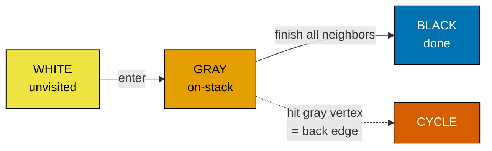

# Depth-first search

Five lines of Python, plus a recursion-limit bump at the top of the file. That is the entire algorithm. A function takes a vertex, marks it visited, calls itself on each unvisited neighbor. Whatever processing the chapter wants to do happens on the way in, on the way out, or both. Every advanced graph algorithm later in this part is a customization of those five lines: which neighbors to explore, what to record on entry, what to record on exit, when to halt.

The depth-first traversal was first described as a maze-solving procedure by Charles Pierre Trémaux in the 1880s, who proved that marking each corridor as you traverse it (and refusing to take a corridor you have already marked) lets a single explorer find the exit of any connected maze.[^1] Modern presentations, complete with timestamps and the proofs of correctness this chapter cites, descend from Hopcroft and Tarjan's 1973 paper, which used DFS to solve planarity testing in linear time and made the algorithm respectable as a building block.[^2] Reading Hopcroft and Tarjan once is worth more than any blog post on the topic.

## The recursive form

A graph DFS expects two things: an adjacency view of the graph (any of the representations from [Graph representation](./00-graph-representation.md) works), and a way to remember which vertices have already been seen. On grids, the second one collapses into the first, since you can mutate cells to mark them. On generic graphs, it is a separate `visited` set.

```python
import sys
sys.setrecursionlimit(10**6)  # DSH-04: deep graphs can blow the default 1000-frame stack.

def dfs(graph, u, visited):
    visited.add(u)
    # pre-order hook: process u BEFORE descending into its subtree.
    for v in graph[u]:
        if v not in visited:
            dfs(graph, v, visited)
    # post-order hook: process u AFTER its entire subtree has finished.
```

The function call stack *is* the search frontier. There is no explicit data structure named "stack" anywhere in those lines, and yet a stack is everything that is happening: each recursive call pushes a frame, each return pops one. This is the cleanest reading of DFS, and it is the one to memorize.

```python
def dfs_iter(graph, source, visited):
    stack = [source]
    while stack:
        u = stack.pop()
        if u in visited:
            continue
        visited.add(u)
        for v in graph[u]:
            if v not in visited:
                stack.append(v)
```

The two functions visit the same set of vertices; the order they visit them in differs. Recursive DFS visits neighbors in the iteration order of `graph[u]`. Iterative DFS, because the stack is LIFO, visits them in reverse. For most LeetCode-style problems the order does not matter. The answer depends only on *which* vertices are reachable, not on *when* they were reached. Where order does matter (post-order finish times for topological sort, edge classification for cycle detection), the iterative variant needs an extra trick. Sedgewick's textbook devotes a full exercise to constructing a 4-vertex graph where naive `stack.pop` followed by `mark + push neighbors` produces a traversal that is *not* a valid DFS tree.[^3] [Topological sort](./05-topological-sort-dfs.md) and [Cycle detection in graphs](./06-cycle-detection-graphs.md) inherit that subtlety; for the rest of this chapter, the simpler stack-pop variant is fine.

> [!IMPORTANT]
> Reach for the iterative form whenever Python recursion depth is a real concern. CPython's default recursion limit is 1,000 frames; on a 200×200 grid where the live region snakes through most cells, recursive DFS reliably crashes with `RecursionError`. The fix is one line at module top, `sys.setrecursionlimit(10**6)`, or a switch to the iterative version above. Java and C++ have larger default stacks but are not exempt; a grid with 40,000 cells can still blow them.[^4]

## Three flavors: pre-order, post-order, on-stack

The recursion handler has two natural hooks: a line that runs before the loop over neighbors, and a line that runs after it returns. Different problems pick different hooks.

**Pre-order DFS** processes a vertex on entry, before recursing. This is the flavor for "do something to every reachable vertex": flood fill, marking border-connected cells, building a connected component. The chapter's worked example below is pre-order. LC 130 marks the cell `'#'` on entry, recurses into the four neighbors, then returns; nothing happens on the way out.

**Post-order DFS** processes a vertex on the way back up the stack, after its entire subtree has finished. Topological sort is the canonical case: each vertex emits its finish time after its descendants emit theirs, and reversing finish order yields a valid topological ordering of the DAG. Tree DP (the longest-path-in-tree pattern from [Tree DP](../part-9-dynamic-programming/13-tree-dp.md)) is also post-order, because the answer at a node depends on values returned from its children.

**On-stack DFS** maintains a third state in addition to "visited" and "unvisited": a vertex is *currently on the recursion stack*. The first time DFS hits a neighbor that is on-stack, it has found a back edge, and a back edge is a cycle. The standard implementation uses three colors (white for unvisited, gray for on-stack, black for finished) and the white-path theorem from CLRS §20.3 makes the correctness proof work.[^5] [Cycle detection in graphs](./06-cycle-detection-graphs.md) does this in detail.



*The three-color CLRS DFS state machine. For grid problems like LC 130 a single mark replaces both gray and black; the distinction matters once the algorithm needs to detect cycles.*

The flavor split also drives a piece of vocabulary worth knowing. In a directed graph, every DFS edge falls into exactly one of four categories: *tree edges* (the ones that took DFS into a previously-unvisited vertex), *back edges* (to a gray vertex; these are the cycles), *forward edges* (to a black descendant), and *cross edges* (to a black non-descendant). Undirected DFS only ever produces tree edges and back edges; the other two are directed-graph artifacts. This taxonomy will become load-bearing in Part 8.6 when the chapter starts asking which kind of edge breaks correctness; for now, knowing the names is enough.

## What it actually costs

| Variant | Time | Space | Notes |
|---|---|---|---|
| Adjacency-list DFS, generic graph | O(V + E) | O(V) | Each vertex is marked once; each edge is examined once (twice for undirected). CLRS Theorem 20.7.[^6] |
| Adjacency-matrix DFS | O(V²) | O(V) | Listing neighbors costs O(V) per vertex regardless of degree. |
| Grid DFS, m×n cells, 4-directional | O(m·n) | O(m·n) | Each cell is visited at most once; recursion stack depth is at most the longest snake-shaped region through the grid. |

The amortization argument is the same one used for stack push/pop. Each vertex is added to the `visited` set exactly once. After it is added, DFS scans its adjacency list exactly once and never returns to it. Total work is `Σ (1 + deg(v))` summed over all vertices, which is `V + 2E` for an undirected graph and `V + E` for a directed one. Done.

The space bound is loose. A grid full of `'X'`s with a single `'O'` at one corner gives a recursion stack of depth 1; a grid where the `'O'` cells form a Hilbert-curve snake gives a recursion stack of depth m·n. The chapter quotes the worst case in the table and uses "linear in the input size" in prose because the worst case is what trips real submissions. Plan for it; the iterative form sidesteps the problem entirely.

## Worked example: LC 130 — Surrounded Regions

The problem in our own words. A 2D board contains `'X'`s and `'O'`s. An `'O'` region is *captured* (flipped to `'X'`) if it is fully enclosed, meaning every `'O'` in the region is hemmed in by `'X'`s on all four sides through every neighbor chain. An `'O'` region that contains a cell on the board's border is *safe*, because such a region escapes the enclosure.

The first instinct is to walk every `'O'` region directly and decide, somehow, whether it is enclosed. The check has no obvious local form: from the inside of a region, you cannot tell whether it touches the border without exploring outward. The reduction that unlocks this problem is to invert the question. Find the regions you do *not* want to flip (the border-connected ones) and mark them. Whatever the DFS does not reach is, by construction, surrounded.

Three passes do it. Pass one walks the four borders and starts a DFS from every `'O'` it finds, marking each reachable cell with a sentinel `'#'`. Pass two is implicit, hidden inside pass one; it is what the DFS does. Pass three sweeps the entire grid: every remaining `'O'` was unreachable from the border, so flip it to `'X'`; every `'#'` was border-connected, so restore it to `'O'`.

```python
def solve(board):
    if not board or not board[0]:
        return
    m, n = len(board), len(board[0])

    def dfs(r, c):
        if r < 0 or r >= m or c < 0 or c >= n or board[r][c] != "O":
            return
        board[r][c] = "#"           # mark border-connected
        dfs(r + 1, c); dfs(r - 1, c)
        dfs(r, c + 1); dfs(r, c - 1)

    for r in range(m):
        dfs(r, 0); dfs(r, n - 1)
    for c in range(n):
        dfs(0, c); dfs(m - 1, c)

    for r in range(m):
        for c in range(n):
            if board[r][c] == "O":
                board[r][c] = "X"
            elif board[r][c] == "#":
                board[r][c] = "O"
```

**Solution** — Python ([Java](./02-dfs/lc-130/sol.java) · [C++](./02-dfs/lc-130/sol.cpp) · [Go](./02-dfs/lc-130/sol.go))

```python
# LC 130. Surrounded Regions
import sys
sys.setrecursionlimit(10**6)  # DSH-04: deep grids approach n*m recursion depth.


def solve(board: list[list[str]]) -> None:
    """LC 130 Surrounded Regions: capture every 'O' region not touching the border."""
    if not board or not board[0]:
        return
    m, n = len(board), len(board[0])

    def dfs(r: int, c: int) -> None:
        # Bounds + only walk live 'O' cells.
        if r < 0 or r >= m or c < 0 or c >= n or board[r][c] != "O":
            return
        board[r][c] = "#"  # mark border-connected
        dfs(r + 1, c)
        dfs(r - 1, c)
        dfs(r, c + 1)
        dfs(r, c - 1)

    # Sweep the four borders, DFS from any 'O' we find.
    for r in range(m):
        dfs(r, 0)
        dfs(r, n - 1)
    for c in range(n):
        dfs(0, c)
        dfs(m - 1, c)

    # Final sweep: '#' was border-connected (restore), 'O' was surrounded (capture).
    for r in range(m):
        for c in range(n):
            if board[r][c] == "O":
                board[r][c] = "X"
            elif board[r][c] == "#":
                board[r][c] = "O"
```

The bounds check and the `!= "O"` guard at the top of `dfs` are doing all the recursion-terminating work. Out of bounds, an `'X'`, or an already-marked `'#'`: any of the three returns without recursing. The mutation `board[r][c] = "#"` is both the visited mark and the answer-being-built. There is no separate `visited` set because the grid is the visited record.

> **Interactive widget:** [DFS exploration -- iterative DFS-from-boundary on a 5x5 grid](../widgets/w-26-graph-dfs.yml) — rendered on the website; the YAML spec describes the keyframes.

*Static fallback: on the canonical 5x5 input, the four border `'O'`s seed the stack; DFS marks seven cells boundary-connected; the two interior cells at (3,1) and (3,2) flip from `'O'` to `'X'` in the final sweep.*

The widget animates the iterative form because the explicit stack is the visible state; recursive DFS hides the same information inside Python's call stack, where it is harder to draw. Watch steps 16 and 17 in particular: those are pop-skip events where the stack hands the loop a cell that is already marked, and the visited check at the top of the handler is the only thing standing between the algorithm and an infinite loop. That guard is what the next pitfall is about.

## Two pitfalls that bite

> [!WARNING]
> **Recursing before marking the cell visited.** The natural way to write the recursion is "do the thing, then recurse." On grids, that ordering is wrong. If `dfs(r, c)` recurses into `dfs(r+1, c)` *before* marking `(r, c)` as `'#'`, the neighbor immediately recurses back into `(r, c)` (still an `'O'`), which recurses back into the neighbor, and so on. Python raises `RecursionError`; Java throws `StackOverflowError`; C++ segfaults. Every implementation in this chapter and in the sibling files marks the cell first and recurses second. Reverse the two lines and the algorithm loops forever.[^7]

> [!WARNING]
> **Carrying a separate `visited` set on grids.** The temptation transfers from generic-graph DFS, where `visited: set[int]` is canonical, but on grids the cell sentinel `'#'` already does the work. A separate `visited: set[(int, int)]` doubles memory and adds an extra hash lookup per recursive call. Use one or the other, not both. The same argument applies on every grid problem in this part, including LC 200 and LC 695 in [Connected components and flood fill](./03-connected-components.md).

A third pitfall worth a passing mention: on the iterative version, a cell can be pushed onto the stack multiple times by different neighbors before any pop visits it. That is fine, because the visited check at the top of the handler skips the duplicate, but it inflates the stack's high-water mark. If memory is genuinely tight, gate the push behind an "is this cell live and unmarked" check, paying for a slightly redundant test in exchange for a smaller stack.

## Problem ladder

### CORE (solve all three to claim chapter mastery)

- [LC 130 — Surrounded Regions](https://leetcode.com/problems/surrounded-regions/) [Medium] • dfs-from-boundary ★
- [LC 417 — Pacific Atlantic Water Flow](https://leetcode.com/problems/pacific-atlantic-water-flow/) [Medium] • dfs-from-boundary-multi-source
- [LC 1254 — Number of Closed Islands](https://leetcode.com/problems/number-of-closed-islands/) [Medium] • dfs-from-boundary-then-count

### STRETCH (optional)

- [LC 1971 — Find if Path Exists in Graph](https://leetcode.com/problems/find-if-path-exists-in-graph/) [Easy] • dfs-reachability
- [LC 827 — Making A Large Island](https://leetcode.com/problems/making-a-large-island/) [Hard] • dfs-component-sizing-then-flip

The CORE three are all Medium because the canonical DFS-from-boundary pattern this chapter teaches has no Easy or Hard cousin at its native shape. STRETCH fills the span: LC 1971 is the gentlest possible reachability check (does a path exist between two vertices in an explicit-edge-list graph?), and LC 827 is two passes of DFS, one to label every island with a size, one to evaluate flipping each `'0'` cell, where the trick is deduplicating neighbor component ids. LC 200 (Number of Islands) and LC 547 (Number of Provinces) are not on this ladder; they belong to [Connected components and flood fill](./03-connected-components.md), where the flood-fill primitive is the chapter's main subject rather than a vehicle for the boundary-DFS pattern.

## Where this leads

The next two chapters split DFS into two specializations. [Connected components and flood fill](./03-connected-components.md) takes the recursive primitive from this chapter and wraps it in a counter, asking how many connected regions exist and how big each one is; that is where LC 200 and LC 695 belong. [Topological sort (DFS)](./05-topological-sort-dfs.md) takes the post-order hook and uses it to derive an ordering of vertices in a DAG, which is the substrate for build-system ordering, course scheduling, and dependency resolution.

The third descendant is [Cycle detection in graphs](./06-cycle-detection-graphs.md), which adds the on-stack flavor and the white/gray/black coloring to find back edges. Once cycle detection is solid, the chapter on Tarjan's strongly-connected-components algorithm reuses *both* the post-order timestamps and the on-stack tracking in the same DFS pass; that combination is the densest application of DFS in the book.

## References

[^1]: Donald E. Knuth, *The Art of Computer Programming, Volume 1*, 3rd ed., Addison-Wesley, 1997, §2.3.4.5 "Trees and Networks".
[^2]: John Hopcroft and Robert Tarjan, "Efficient Planarity Testing," *Journal of the ACM* 21(4), 1974. The companion paper "Algorithm 447: Efficient Algorithms for Graph Manipulation," *Communications of the ACM* 16(6), 1973, gives the modern DFS formulation with timestamps and edge classification. <https://doi.org/10.1145/362248.362272>
[^3]: Robert Sedgewick and Kevin Wayne, *Algorithms*, 4th ed., Addison-Wesley, 2011. §4.1 "Undirected Graphs", `DepthFirstSearch.java` and Web Exercise 29 (NonrecursiveDFS counterexample). <https://algs4.cs.princeton.edu/41graph/>
[^4]: Stack Overflow user post, "Maximum recursion depth exceeded while doing DFS in python3, not solved by increasing limit," 2020. Documents the LC-style symptom and the iterative-DFS workaround. <https://stackoverflow.com/questions/61829251/>
[^5]: Cormen, Leiserson, Rivest, Stein, *Introduction to Algorithms*, 4th ed., MIT Press, 2022, Chapter 20 "Elementary Graph Algorithms," §20.
[^6]: CLRS 4th ed., §20.3, Theorem 20.7. DFS runs in Θ(V + E). The walkccc CLRS solutions mirror reproduces the proof under the 3rd-edition numbering at <https://walkccc.me/CLRS/Chap22/22.3/>
[^7]: Youcademy, "Common Mistakes in DFS Implementation and How to Avoid Them," catalogs forgetting-to-mark-visited as the first canonical bug. <https://youcademy.org/common-mistakes-in-graph-dfs/>
