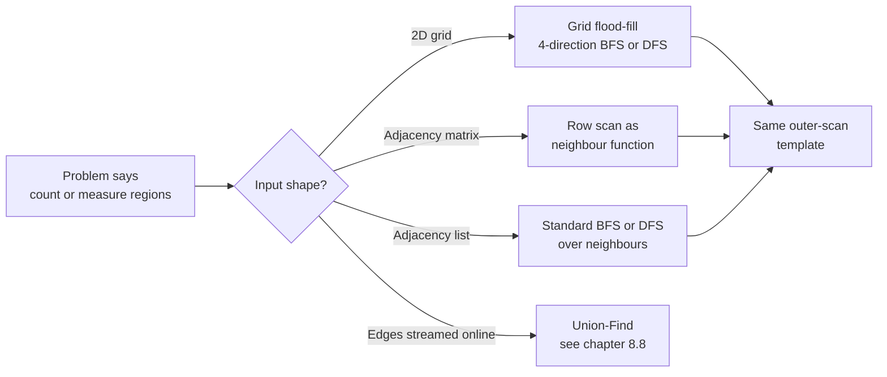

# Connected components and flood fill

A 4-by-5 grid of `'1'`s and `'0'`s. The `'1'`s are land, the `'0'`s are water, and a cell connects to its four orthogonal neighbours. Asked: how many islands? Most readers see this for the first time as LeetCode 200 and reach for the same instinct, which is to BFS from cell `(0, 0)`. That works for one island. The trick of the chapter is the second island, and the third, and how a clean two-line outer loop turns the BFS you already know into a counting algorithm.

The two preceding chapters, [BFS](./01-bfs.md) and [DFS](./02-dfs.md), trained the muscle: a frontier or a stack, a visited set, a graph that may or may not exist as an adjacency list. This chapter doesn't add a new traversal. It adds the *meta-pattern* that wraps both: scan every vertex; if it's unvisited, increment a counter and run a single BFS or DFS from it. The outer scan is what turns "explore one component" into "find all components."

## Why the obvious approach is half an algorithm

Take the LC 200 grid that has three islands. Run a BFS from `(0, 0)`. It correctly marks the first island as visited. Now what? The BFS terminates because its queue is empty; the second and third islands sit untouched and the function returns 1.

The bug isn't in the BFS. The BFS is doing exactly what BFS does: it explores everything reachable from its start, then stops. The bug is that the algorithm has no plan for unreachable cells. A single traversal is by definition local to one component.

```python
# Half an algorithm: returns 1 instead of 3.
def num_islands_broken(grid):
    rows, cols = len(grid), len(grid[0])
    bfs(grid, 0, 0, rows, cols)   # marks one component visited
    return 1                       # ...but how many were there?
```

The fix is shorter than the bug. After the first BFS finishes, walk the grid and ask one question of every cell: *are you a `'1'` that hasn't been visited yet?* If yes, you've discovered a new component; bump the counter and BFS from there. Every unvisited `'1'` is, by definition, the seed of an island the previous traversals never reached. The outer scan is what guarantees coverage; the inner traversal is what guarantees correctness within one component.

## The pattern

Two phases. An outer scan that decides where to start; an inner traversal that floods until the queue empties.

```python
def num_islands(grid):
    if not grid or not grid[0]:
        return 0
    rows, cols = len(grid), len(grid[0])
    count = 0

    def bfs(sr, sc):
        q = deque([(sr, sc)])
        grid[sr][sc] = "0"          # mark visited at enqueue, not dequeue
        while q:
            r, c = q.popleft()
            for dr, dc in ((1, 0), (-1, 0), (0, 1), (0, -1)):
                nr, nc = r + dr, c + dc
                if 0 <= nr < rows and 0 <= nc < cols and grid[nr][nc] == "1":
                    grid[nr][nc] = "0"
                    q.append((nr, nc))

    for r in range(rows):                 # the outer scan
        for c in range(cols):
            if grid[r][c] == "1":         # unvisited land = new component
                count += 1
                bfs(r, c)
    return count
```

**Solution** — Python ([Java](./03-connected-components/lc-200/sol.java) · [C++](./03-connected-components/lc-200/sol.cpp) · [Go](./03-connected-components/lc-200/sol.go))

```python
# LC 200. Number of Islands
from collections import deque
from typing import List
import sys

# 300x300 grid is the LC 200 constraint upper bound; recursive DFS on an
# all-ones grid recurses ~90,000 deep. Python's default recursion limit
# is ~1000, so iterative BFS is the safe default. Raise the limit only
# if you must use recursive DFS.
sys.setrecursionlimit(10**6)


def num_islands(grid: List[List[str]]) -> int:
    """LC 200. Count maximal 4-connected components of '1' in the grid.

    Outer scan visits every cell once. When it lands on an unvisited '1',
    increment the component counter and run BFS to mark every reachable
    land cell as water. The outer scan is the algorithm; BFS is the engine.
    """
    if not grid or not grid[0]:
        return 0
    rows, cols = len(grid), len(grid[0])
    count = 0

    def bfs(sr: int, sc: int) -> None:
        q = deque([(sr, sc)])
        grid[sr][sc] = "0"          # mark visited at enqueue, not dequeue
        while q:
            r, c = q.popleft()
            for dr, dc in ((1, 0), (-1, 0), (0, 1), (0, -1)):
                nr, nc = r + dr, c + dc
                if 0 <= nr < rows and 0 <= nc < cols and grid[nr][nc] == "1":
                    grid[nr][nc] = "0"
                    q.append((nr, nc))

    for r in range(rows):
        for c in range(cols):
            if grid[r][c] == "1":
                count += 1
                bfs(r, c)
    return count
```

Three things in that code body deserve attention.

The visited mark is the grid itself. Writing `'0'` over a `'1'` saves an `m*n` boolean allocation and folds the visited check into the existing `grid[r][c] == '1'` predicate. If the caller needs the input preserved, pass a copy or maintain a separate `visited[r][c]` array. State the trade-off in an interview: *"I'm mutating the grid for O(1) extra space; if you want the input intact, I'll switch to a visited array."*

The neighbour offsets are a 4-tuple of `(dr, dc)` pairs, iterated with one `for` loop. Don't expand to four separate `if` blocks; you'll forget one and the bug only shows up when the missing direction matters. The grid-traversal idiom `for dr, dc in [(0,1),(0,-1),(1,0),(-1,0)]` is the same in every language; only the syntax around it changes.

Visited is set when a cell is *enqueued*, not when it's dequeued. If you mark on dequeue, the same cell can be pushed onto the queue four times by four neighbours before it's its turn to be processed; the queue blows up to `O(rc)` duplicates and the algorithm slows by a constant factor. This is the most common LC 200 performance bug.

> [!IMPORTANT]
> The signal that triggers this pattern is a problem that asks you to **count or measure regions** given local adjacency. *How many islands? How many provinces? How big is the largest cluster?* Whenever the input is a grid, an undirected graph, or a friendship matrix, and the question word is "how many" applied to a structural property (number, max size, total area, perimeter), the algorithm is the outer-scan-and-flood template above.[^1] Not "shortest path between two cells" (that's pure BFS), not "is there a cycle" (the [cycle-detection chapter](./06-cycle-detection-graphs.md)), not "is it bipartite" (the [bipartite-check chapter](./07-bipartite-check.md)).

## Locating this pattern



*Four input shapes, one template. Only the neighbour function changes; the outer scan and the inner flood are identical.*

The decision tree above is the chapter in one diagram. Whatever the input looks like, a grid, a boolean matrix, an adjacency list, or a stream of edges, the question is what `neighbours(v)` returns. For LC 200, it's *the four orthogonal cells with value `'1'`*. For LC 547, it's *every column index `j` where `isConnected[i][j] == 1`*. For LC 305, the edges arrive one at a time and the answer is Union-Find, which the [Union-Find chapter](./08-union-find.md) owns.

## The graph-shape-agnostic reveal: LC 547

Number of Provinces hands you an `n` by `n` boolean matrix. If `isConnected[i][j] == 1`, city `i` and city `j` are in the same province. Find how many provinces there are. Constraint: `1 <= n <= 200`.

The instinct on first read is to BFS over the matrix as if it were a grid. That returns nonsense, because the matrix is not the world; it's the *adjacency relation* of `n` vertices. Vertex `i` exists; vertex `j` exists; the matrix tells you whether they're connected. The "neighbours of `i`" are the column indices `j` where row `i` has a 1.

Once you see that, the algorithm is the same three lines as LC 200. The outer scan walks `i` from 0 to `n-1`. If `i` is unvisited, increment the counter and BFS from `i`. The BFS pulls a vertex `u` off the queue, then scans row `u` of the matrix for unvisited columns, and pushes them.

```python
def find_circle_num(is_connected):
    n = len(is_connected)
    visited = [False] * n
    count = 0

    def bfs(start):
        q = deque([start])
        visited[start] = True
        while q:
            u = q.popleft()
            for v in range(n):
                if is_connected[u][v] == 1 and not visited[v]:
                    visited[v] = True
                    q.append(v)

    for i in range(n):
        if not visited[i]:
            count += 1
            bfs(i)
    return count
```

**Solution** — Python ([Java](./03-connected-components/lc-547/sol.java) · [C++](./03-connected-components/lc-547/sol.cpp) · [Go](./03-connected-components/lc-547/sol.go))

```python
# LC 547. Number of Provinces
from collections import deque
from typing import List


def find_circle_num(is_connected: List[List[int]]) -> int:
    """LC 547. Count connected components of an undirected graph
    given as an n-by-n adjacency matrix.

    Same outer-scan-and-flood template as LC 200; only the neighbor
    function changes. For city i, neighbors are j where
    is_connected[i][j] == 1 and j != i.
    """
    n = len(is_connected)
    visited = [False] * n
    count = 0

    def bfs(start: int) -> None:
        q = deque([start])
        visited[start] = True
        while q:
            u = q.popleft()
            for v in range(n):
                if is_connected[u][v] == 1 and not visited[v]:
                    visited[v] = True
                    q.append(v)

    for i in range(n):
        if not visited[i]:
            count += 1
            bfs(i)
    return count
```

Two changes from LC 200. `visited` is now a `bool[n]` array because the input matrix is read-only by convention (and mutating the diagonal would make subsequent calls return wrong answers). `neighbours(u)` is `for v in range(n): if is_connected[u][v] == 1`, an `O(n)` scan inside the inner loop. That's why the total time is `O(n²)`: you're forced to look at every matrix cell at least once just to read the input.

The diagonal `isConnected[i][i] == 1` is guaranteed by the problem and ignored by the visited check. The matrix is symmetric, so visiting `(u, v)` and later `(v, u)` would do nothing extra; the visited set absorbs the redundancy. No special-casing needed.

This is the chapter's central abstraction at full intensity. The same `count_components` skeleton, swap `neighbours()`, get the right answer. Internalise it; chapters [topological sort](./04-topological-sort-kahn.md) and [bipartite check](./07-bipartite-check.md) will both reuse it.

## Measuring instead of counting: LC 695

Same grid as LC 200; the question changes from "how many islands?" to "how big is the largest island?" The outer scan is identical. The only difference is what the inner BFS *returns*: instead of nothing, it returns the size of the component it just flooded.

```python
def max_area_of_island(grid):
    if not grid or not grid[0]:
        return 0
    rows, cols = len(grid), len(grid[0])
    best = 0

    def bfs(sr, sc):
        q = deque([(sr, sc)])
        grid[sr][sc] = 0
        size = 0
        while q:
            r, c = q.popleft()
            size += 1
            for dr, dc in ((1, 0), (-1, 0), (0, 1), (0, -1)):
                nr, nc = r + dr, c + dc
                if 0 <= nr < rows and 0 <= nc < cols and grid[nr][nc] == 1:
                    grid[nr][nc] = 0
                    q.append((nr, nc))
        return size

    for r in range(rows):
        for c in range(cols):
            if grid[r][c] == 1:
                area = bfs(r, c)
                if area > best:
                    best = area
    return best
```

**Solution** — Python ([Java](./03-connected-components/lc-695/sol.java) · [C++](./03-connected-components/lc-695/sol.cpp) · [Go](./03-connected-components/lc-695/sol.go))

```python
# LC 695. Max Area of Island
from collections import deque
from typing import List


def max_area_of_island(grid: List[List[int]]) -> int:
    """LC 695. Return the area of the largest 4-connected island.

    Same outer scan as LC 200. The inner BFS now returns the number
    of land cells it visited so the outer scan can track a running max.
    """
    if not grid or not grid[0]:
        return 0
    rows, cols = len(grid), len(grid[0])
    best = 0

    def bfs(sr: int, sc: int) -> int:
        q = deque([(sr, sc)])
        grid[sr][sc] = 0
        size = 0
        while q:
            r, c = q.popleft()
            size += 1
            for dr, dc in ((1, 0), (-1, 0), (0, 1), (0, -1)):
                nr, nc = r + dr, c + dc
                if 0 <= nr < rows and 0 <= nc < cols and grid[nr][nc] == 1:
                    grid[nr][nc] = 0
                    q.append((nr, nc))
        return size

    for r in range(rows):
        for c in range(cols):
            if grid[r][c] == 1:
                area = bfs(r, c)
                if area > best:
                    best = area
    return best
```

The skeleton is byte-for-byte the LC 200 code. The two diffs are: the inner BFS returns an integer (the cell count) by incrementing `size` once per dequeue, and the outer scan compares that return value against a running `best`. Three lines changed.

The same template handles "sum of values in each component," "list of representative vertices," "perimeter of each component," "shape signature for deduplication" (LC 694 Number of Distinct Islands). You decide what the inner traversal accumulates. The outer scan never changes.

## The same algorithm in different clothing: flood fill

[Flood Fill (LC 733)](https://leetcode.com/problems/flood-fill/) gives you a grid, a start cell, and a new colour. Reach the entire region of cells matching the start's original colour and recolour them. Read it as a graph problem and it's exactly the inner traversal from LC 200 — BFS from one specified start, neighbour predicate is "same original colour as start." There's no outer scan because there's no counting; the caller supplies the seed. Flood fill is the inner half of this chapter's template, exposed as a public API. The graphics-programming literature has been calling this algorithm flood fill since the 1970s; the textbook calls it the same algorithm.[^2]

## Three approaches, one template

The outer scan is fixed; the inner traversal is a choice. You have three options for the inner half. All three give the same answer; they trade off in different ways.

### DFS (recursive)

The shortest code. Ten lines or fewer in any language. Conceptually clean: *visit me, then visit my unvisited neighbours.* The grading is that recursion uses the program stack, and on a 300-by-300 grid that is one giant component, a recursive DFS recurses up to 90,000 levels deep. Python's default recursion limit is around 1000.[^3] Java's default thread stack is around 25,000 frames. You will get `RecursionError` or `StackOverflowError` on the worst-case LC 200 input even though the algorithm is correct.

The fix is one line, `sys.setrecursionlimit(10**6)` for Python, but it doesn't change the underlying OS stack size; segfaults are still possible at extreme depth. Iterative is strictly safer.

### BFS (iterative, with explicit queue)

The reference implementations above. Slightly more code than recursive DFS (you allocate a queue, push the start, loop until empty), but the queue lives on the heap, not the stack, so it scales to the largest LC 200 input. `deque` in Python, `ArrayDeque` in Java, `std::queue` in C++, slice-as-queue in Go. This is the safe default for grid problems with constraints in the hundreds-by-hundreds range.

### Union-Find

For the static problem, BFS and DFS are simpler. Union-Find earns its place when components grow *online*, one edge at a time, and you have to report the count after each insertion. LC 305 Number of Islands II is the canonical case: you receive a stream of `addLand(r, c)` operations, and after each one you must return the current number of components. Re-running BFS from scratch costs `O(k * mn)` for `k` operations, which is too slow at the problem's constraints. Union-Find with path compression and union by rank does the same work in `O(k * α(mn))`, where α is the inverse Ackermann function and is below 5 for any plausible input.[^4] The proof and the data structure live in the [Union-Find chapter](./08-union-find.md); for static counting in LC 200, BFS is the right tool.

## What it actually costs

| Variant | Time | Space | Notes |
|---|---|---|---|
| BFS or DFS over a grid (LC 200, 695) | O(m × n) | O(m × n) worst-case queue | Each cell enqueued at most once; outer scan adds one O(1) check per cell. |
| BFS or DFS over an adjacency matrix (LC 547) | O(n²) | O(n) for visited, O(n) queue | The matrix scan is the floor; reading every entry is unavoidable. |
| BFS or DFS over an adjacency list | Θ(V + E) | O(V) | The standard graph-traversal bound from CLRS §20.2-20.3.[^5] |
| Union-Find incremental (LC 305) | O(k × α(mn)) | O(m × n) | k = number of operations; covered in the Union-Find chapter. |

Why the bounds hold: every vertex enters the queue at most once because of the visited check; every edge is examined a constant number of times (twice per undirected edge, once from each endpoint).[^6] The outer scan adds `m*n` constant-time checks, which doesn't change the order. Sedgewick's `CC.java` documentation states the bound directly: "this implementation uses depth-first search; the constructor takes Θ(V + E) time."[^7]

The space bound is tighter than it looks. In the worst case, a grid that snakes through one giant component, the BFS queue holds `O(m*n)` cells at once. For typical inputs it stays at `O(min(m, n))`. Mention both bounds in an interview if the input shape is in scope.

## Three pitfalls that bite

> [!WARNING]
> **Counting diagonals as adjacent.** Input `[["1","0","0","0","1"],["0","0","0","0","0"],["0","0","1","0","0"],["0","0","0","0","0"],["1","0","0","0","1"]]` is five separate cells on the diagonal. Five islands. A solution that includes the four diagonal directions returns 1, not 5. LC 200 specifies "horizontally or vertically"; LC 695 says explicitly that 1s cannot be connected diagonally. Read the constraint section. The default for these grid problems is 4-direction unless the title says "diagonally."

> [!WARNING]
> **Recursive DFS overflowing on a 300x300 grid of 1s.** Algorithm correct; interpreter unhappy. Python raises `RecursionError`; the JVM raises `StackOverflowError`. LeetCode reports "Runtime Error" on the worst-case test even though smaller grids passed. Either iterate (recommended) or raise the recursion limit at module top with `sys.setrecursionlimit(10**6)` for Python and `-Xss` for the JVM. The Stack Overflow thread "Time limit exceeded with recursion, works on 90/91 test cases" is exactly this bug; the accepted answer is "use BFS or set the recursion limit."[^8]

> [!WARNING]
> **The LC 463 trap.** Island Perimeter looks like a flood-fill problem because it lives in the islands tag. It isn't. There is one island; the question is its perimeter. Running BFS over the single component and counting boundary edges inside the recursion produces a 30-line muddle. The closed form is six lines: every land cell contributes 4 to the perimeter, minus 2 for every shared land-land edge. So `perimeter = 4 * land_cells - 2 * shared_edges`. Single linear scan, O(mn) time, O(1) space.[^9] Read the problem before reaching for the template.

A fourth pitfall worth naming briefly: misreading LC 547 as a 2D grid problem and BFSing over `isConnected` cells. The matrix is the adjacency relation, not the world. The vertices are the `n` cities; "neighbours of `i`" is row `i`, scanned for 1s.

## When the pattern bends

The skeleton accommodates a few useful variants without changing shape.

**Restricting the outer scan to the border.** LC 130 Surrounded Regions and LC 1254 Closed Islands ask about components that *don't* touch the boundary. Trick: BFS from every border `'O'` first, mark those cells "safe", then run the standard outer scan and flip everything else. The scan's *starting set* changes; the inner BFS is unchanged.

**Multi-source BFS.** LC 994 Rotting Oranges and LC 542 01 Matrix seed the BFS queue with *every* starting cell at once before the loop, then BFS in lockstep so the frontier expands in concentric layers from a multi-source frontier. This is a two-step pattern: identify component members first, then distance-BFS from them. The mechanics belong to the [BFS chapter](./01-bfs.md); they reuse the outer-scan idea to enumerate seeds.

**Online edges.** When components grow one edge at a time, the static template stops fitting. Switch to Union-Find. The [Union-Find chapter](./08-union-find.md) is one chapter away.

## Problem ladder

### CORE (solve all three to claim chapter mastery)

- [LC 200 — Number of Islands](https://leetcode.com/problems/number-of-islands/) [Medium] • grid-flood-fill ★
- [LC 695 — Max Area of Island](https://leetcode.com/problems/max-area-of-island/) [Medium] • grid-flood-fill
- [LC 547 — Number of Provinces](https://leetcode.com/problems/number-of-provinces/) [Medium] • adjacency-matrix-cc

### STRETCH (optional)

- [LC 463 — Island Perimeter](https://leetcode.com/problems/island-perimeter/) [Easy] • grid-traversal-counting
- [LC 733 — Flood Fill](https://leetcode.com/problems/flood-fill/) [Easy] • grid-flood-fill
- [LC 305 — Number of Islands II](https://leetcode.com/problems/number-of-islands-ii/) [Hard] • union-find-incremental *(reference: Python only; Premium-only — free alternative is solving LC 547 with the Union-Find template)*

LC 200 is the chapter's signature problem (★) and the canonical worked example. The CORE three are all Medium because the pattern's natural difficulty level lives there; LC 463 anchors Easy STRETCH by being the "looks like flood-fill, isn't" lesson, LC 733 is the second Easy STRETCH and the public-API form of the inner traversal taught in §"The same algorithm in different clothing", and LC 305 anchors Hard by reframing the same problem as an online algorithm whose data structure is owned by the next-but-one chapter.

## Where this leads

The next chapter, [topological sort with Kahn's algorithm](./04-topological-sort-kahn.md), keeps the outer-scan idea but replaces the unvisited-vertex predicate with a zero-indegree predicate. Same shape, different invariant: at each step, find a vertex with no remaining incoming edges, emit it, and decrement its successors. The graph-traversal mechanics are unchanged; the *order* in which vertices come off the frontier carries the meaning.

If the question is "how many edges to add to connect everything?" or "what's the count after each addLand?", the right structure is Union-Find. The [Union-Find chapter](./08-union-find.md) carries the inverse-Ackermann proof and the path-compression code; it's also the natural follow-up for anyone who wants to see LC 200 solved a third way.

## References

[^1]: Sedgewick R., Wayne K., *Algorithms*, 4th ed., Addison-Wesley, 2011, section 4.1 "Undirected Graphs," subsection on connected components. Online companion at <https://algs4.cs.princeton.edu/41graph/>.

[^2]: Erickson J., *Algorithms*, 1st ed., 2019, chapter 5 "Basic Graph Algorithms," section on whatever-first search and connected components. <https://jeffe.cs.illinois.edu/teaching/algorithms/book/05-graphs.pdf>.

[^3]: Stack Overflow, "Why don't functions recurse as many times as the limit I set with sys.setrecursionlimit()?" <https://stackoverflow.com/questions/7081448/why-dont-functions-recurse-as-many-times-as-the-limit-i-set-with-sys-setrecursi>.

[^4]: Tarjan R. E., "Efficiency of a good but not linear set union algorithm," *Journal of the ACM*, 22(2):215-225, 1975.

[^5]: Cormen T. H., Leiserson C. E., Rivest R. L., Stein C., *Introduction to Algorithms*, 4th ed., MIT Press, 2022, chapter 20 "Elementary Graph Algorithms," sections 20.2 (BFS, linear-time analysis) and 20.3 (DFS, Θ(V+E) analysis).

[^6]: Hopcroft J. E., Tarjan R. E., "Efficient algorithms for graph manipulation," *Communications of the ACM*, 16(6):372-378, 1973. The original linear-time DFS-based decomposition of a graph into connected components. Stanford preprint at <http://i.stanford.edu/TR/CS-TR-71-207.html>.

[^7]: Sedgewick R., Wayne K., `CC.java` API documentation, *Algorithms, 4th edition*, <https://algs4.cs.princeton.edu/code/javadoc/edu/princeton/cs/algs4/CC.html>.

[^8]: Stack Overflow, "Time limit exceeded with recursion, works on 90/91 test cases, fails on large input." <https://stackoverflow.com/questions/66037170/time-limit-exceeded-with-recursion-works-on-90-91-test-cases-fails-on-large-in>.

[^9]: Huahua (Zhi Xi), "LC 463 Island Perimeter." <https://zxi.mytechroad.com/blog/math/leetcode-463-island-perimeter/>.
