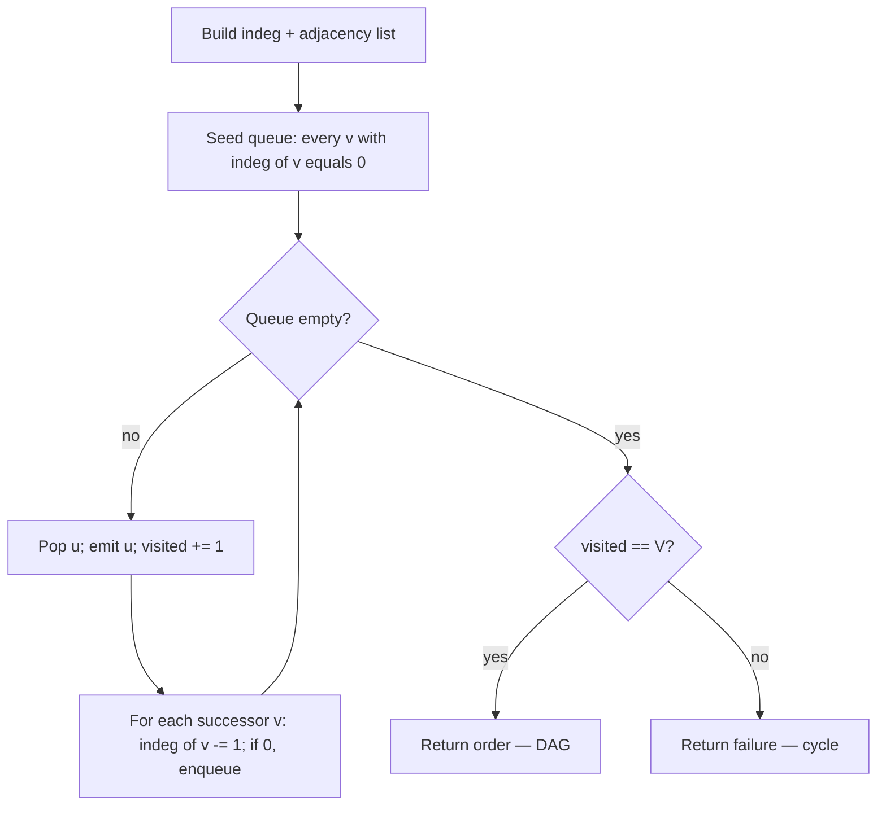
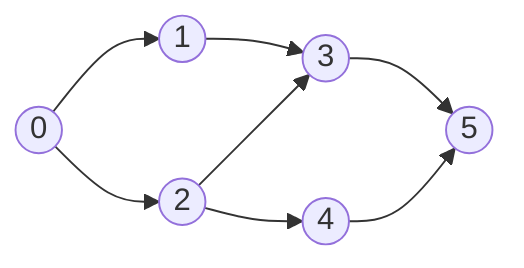

# Topological sort: Kahn's algorithm

LeetCode 207 hands you a course catalog and a list of prerequisites. Course 1 needs course 0 first; course 3 needs both 1 and 2. Can a student finish all of them? The answer is yes whenever the dependency graph is a DAG, no whenever a cycle hides inside. Two thousand courses, five thousand prerequisites, and the function has to return a single boolean.

Two algorithms solve this. Both run in linear time. Either one works on the same inputs. They produce different but equally valid orderings, and they fail on cyclic input in the same way. So why two chapters? Because the moves the reader needs to learn are different. This chapter is Kahn's algorithm: iterative, indegree-driven, queue-based. The next chapter is DFS post-order: recursive, finish-time-driven, stack-based. Pick Kahn first if you only have time for one. It is the safer interview default at LC's input scale, and the indegree mental model lines up with the way prerequisites are usually phrased in the problem text itself.

## What Kahn's actually does

Take the dependency graph as a directed graph: an edge `b -> a` means *b is a prerequisite of a*. The indegree of a vertex is the number of incoming edges, which is the number of prereqs not yet satisfied. A vertex with indegree zero has no unsatisfied prereqs; it is *ready*. Take any such vertex, declare it the next course, and pretend you already finished it: every edge leaving it disappears, and that may free up new indegree-zero vertices for the next round.

Here is the reduction the chapter is built on. **A topological order exists if and only if at every step there is at least one vertex with indegree zero in the remaining subgraph.** Kahn's algorithm makes this constructive by repeatedly extracting such a vertex and decrementing its successors' indegrees. If the loop runs out of indegree-zero vertices before emitting all `|V|` of them, then a cycle is hiding among the leftovers — every vertex on a cycle has at least one prereq sitting on the same cycle, so none of them ever reaches indegree zero.

The dual purpose is the algorithm's quietest virtue. One loop produces a topological order and detects a cycle, exactly, with no extra bookkeeping. LeetCode 207 is just a special case where the boolean `len(order) == numCourses` is the requested output.

## The algorithm

Three phases. Build the indegree array and the adjacency list. Seed a queue with every vertex whose indegree is already zero. Then drain: pop one, emit it, decrement each successor's indegree, and enqueue any successor whose count just hit zero. Stop when the queue is empty.

```python
def can_finish(num_courses, prerequisites):
    indeg = [0] * num_courses
    adj = [[] for _ in range(num_courses)]
    for a, b in prerequisites:        # b -> a (b is the prereq)
        adj[b].append(a)
        indeg[a] += 1

    q = deque(v for v in range(num_courses) if indeg[v] == 0)
    visited = 0
    while q:
        u = q.popleft()
        visited += 1
        for v in adj[u]:
            indeg[v] -= 1
            if indeg[v] == 0:
                q.append(v)
    return visited == num_courses
```

**Solution** — Python ([Java](./04-topological-sort-kahn/lc-207/sol.java) · [C++](./04-topological-sort-kahn/lc-207/sol.cpp) · [Go](./04-topological-sort-kahn/lc-207/sol.go))

```python
# LC 207. Course Schedule
"""LC 207 Course Schedule — Kahn's algorithm reference."""
from collections import deque
from typing import List


def can_finish(num_courses: int, prerequisites: List[List[int]]) -> bool:
    """Return True iff all courses can be finished (the prereq graph is a DAG).

    Edge convention: prerequisites[i] = [a, b] means b must be taken before a,
    so the directed edge is b -> a in the dependency graph. Run a Kahn
    topological sort on (V, E) and report True iff we order all V vertices.
    """
    indeg = [0] * num_courses
    adj: List[List[int]] = [[] for _ in range(num_courses)]
    for a, b in prerequisites:
        adj[b].append(a)
        indeg[a] += 1

    q = deque(v for v in range(num_courses) if indeg[v] == 0)
    visited = 0
    while q:
        u = q.popleft()
        visited += 1
        for v in adj[u]:
            indeg[v] -= 1
            if indeg[v] == 0:
                q.append(v)
    return visited == num_courses
```

The control flow has only one conditional that matters, and it is the indegree check on the decrement. *Equality, not less-than-or-equal.* With duplicate prereqs in the input the indegree may go negative; a `<= 0` check then mis-fires on every subsequent decrement and starts re-enqueuing vertices that already left the queue. The verified Java, C++, and Go versions all use `--indeg[v] == 0`.



*The cycle decision is at termination, never inside the loop. The queue empties either because all V vertices were emitted (DAG) or because the leftovers are stuck on a cycle.*

## Worked example: LC 207 on a 6-course catalog

Six courses, seven prerequisites: `0 -> 1`, `0 -> 2`, `1 -> 3`, `2 -> 3`, `2 -> 4`, `3 -> 5`, `4 -> 5`. The arrow `0 -> 1` means course 0 is a prereq of course 1.

Initial indegrees: `[0, 1, 1, 2, 1, 2]`. Vertex 0 is the only one ready, so the queue starts as `[0]`.



*The 6-node DAG used by both panels of widget w-27. Vertex 0 is the unique source; vertex 5 is the unique sink; the middle three indices have multiple valid orderings.*

Pop 0, emit 0. Decrement indegrees of 1 and 2; both hit zero, both go into the queue. The decisive moment lands on the second pop: when vertex 2 is processed, two successors (3 and 4) get a decrement, and only 4 becomes ready immediately while 3 still owes one prereq to vertex 1. The interleaving from there determines whether the emitted order is `[0, 1, 2, 3, 4, 5]`, `[0, 2, 1, 4, 3, 5]`, or one of the three other valid orderings; the FIFO queue makes the choice deterministic without making it canonical.

The widget animates each step: indegree array on the left, queue contents in the middle, the emitted order growing at the bottom. Step through it twice. The first pass to see the loop run; the second to notice that vertex 0 and vertex 5 always land at the same positions across every preset, while the middle three permute.

> **Interactive widget:** [Topological sort (Kahn's vs DFS post-order)](../widgets/w-27-topological-sort-kahn.yml) (panel `panel-kahn`) — rendered on the website; the YAML spec describes the keyframes.

*Static fallback: indegrees collapse `[0,1,1,2,1,2] → [0,0,1,2,1,2] → [0,0,0,2,1,2] → [0,0,0,0,0,0]` over the 16-step trace; emitted list grows `[] → [0] → [0,1] → [0,1,2,3,4,5]`; the final terminator records `|emitted| == |V|`, valid topological order.*

## What it actually costs

| Variant | Time | Space | Notes |
|---|---|---|---|
| DAG, adjacency list | O(V + E) | O(V) | Each vertex enqueued and dequeued once; each edge relaxed once. |
| Cyclic graph, early exit | O(V + E) | O(V) | Same loop; the cycle is the leftover after the queue drains. |
| Adjacency *matrix* input | O(V²) | O(V) | The relax-neighbor loop scans a length-V row even for sinks. Convert to list first. |

Each vertex is enqueued exactly once, the moment its indegree first reaches zero, and dequeued exactly once. Each directed edge `(u, v)` is relaxed exactly once, when the algorithm processes `u` and decrements `indeg[v]`. The total work is `O(|V|)` for vertex bookkeeping plus `O(|E|)` for edge bookkeeping.[^1] The bound is tight: any topological-sort algorithm has to read every edge at least once to verify that the order respects it, so `Ω(V + E)` is the lower bound, and Kahn matches it within a constant.[^2]

The space cost is dominated by the indegree array (`O(V)`) and the queue, which can hold up to `V` vertices at once when the input has no edges. Adjacency itself is `O(V + E)` but already counts as input.

## When the pattern bends

The signature shape — graph given, run Kahn, return the answer — covers most of the rotation. Three variants change either the input or the termination condition. Each is its own LC problem, and each is a question about whether the reader can recognize Kahn under a different surface.

### Reverse-graph Kahn for "safe nodes"

LC 802 asks which vertices have *no* path that ever enters a cycle. The natural inversion is to flip every edge, then run Kahn from the original-graph terminal vertices (out-degree zero in the original, indegree zero in the reverse). Every vertex Kahn emits in the reversed graph is safe, because in the original direction it has no descendant on a cycle.[^3]

```python
def eventual_safe_nodes(graph):
    n = len(graph)
    rev_indeg = [0] * n          # = original out-degree
    rev_adj = [[] for _ in range(n)]
    for u, succs in enumerate(graph):
        for v in succs:
            rev_adj[v].append(u)  # reverse edge: v -> u
            rev_indeg[u] += 1
    q = deque(v for v in range(n) if rev_indeg[v] == 0)
    safe = [False] * n
    while q:
        u = q.popleft()
        safe[u] = True
        for v in rev_adj[u]:
            rev_indeg[v] -= 1
            if rev_indeg[v] == 0:
                q.append(v)
    return [v for v in range(n) if safe[v]]
```

**Solution** — Python ([Java](./04-topological-sort-kahn/lc-802/sol.java) · [C++](./04-topological-sort-kahn/lc-802/sol.cpp) · [Go](./04-topological-sort-kahn/lc-802/sol.go))

```python
# LC 802. Find Eventual Safe States
"""LC 802 Find Eventual Safe States — reverse-graph Kahn."""
from collections import deque
from typing import List


def eventual_safe_nodes(graph: List[List[int]]) -> List[int]:
    """Return all vertices from which every path terminates (no cycle reachable).

    Insight: a vertex is safe iff in the *reversed* graph it can be emitted
    by Kahn starting from terminal vertices (out-degree zero in the original,
    indegree zero after reversal). Reverse all edges, seed Kahn from
    original-terminal vertices, return the emitted set sorted.
    """
    n = len(graph)
    rev_indeg = [0] * n          # = original out-degree
    rev_adj: List[List[int]] = [[] for _ in range(n)]
    for u, succs in enumerate(graph):
        for v in succs:
            rev_adj[v].append(u)  # reverse edge: v -> u
            rev_indeg[u] += 1     # u's reversed indegree = u's original out-degree

    q = deque(v for v in range(n) if rev_indeg[v] == 0)
    safe = [False] * n
    while q:
        u = q.popleft()
        safe[u] = True
        for v in rev_adj[u]:
            rev_indeg[v] -= 1
            if rev_indeg[v] == 0:
                q.append(v)
    return [v for v in range(n) if safe[v]]
```

The reversal is the entire interview value of LC 802. Without it the problem reduces to DFS with three-color marking, which is a different algorithm and a different chapter.

### Char-pair edge construction (LC 269)

LC 269 hands you a list of strings, sorted lexicographically by an unknown alphabet, and asks for any total order on the characters consistent with the input. The graph is not given. You build it: pairwise-compare adjacent words, find their first differing position, add a directed edge between those two characters. Then run Kahn on a graph of at most 26 vertices and return any valid order. The edge case that bites is the invalid prefix: when `words[i]` is a strict longer prefix of `words[i+1]` (for example, `["abc", "ab"]`), no character ordering can place `"abc"` before `"ab"`, and the function returns `""`.[^4]

### Pseudo-Kahn on undirected leaves (LC 310)

LC 310 wants the centroid of an undirected tree: the vertex (or two vertices) you can root at to minimize the tree's height. The trick is to peel leaves layer by layer. Initialize a queue with every vertex of degree 1; pop one, decrement its single neighbor's degree, push the neighbor if its degree drops to 1; stop when fewer than three vertices remain. The leftover one or two are the centroids. The graph is undirected so "indegree" becomes "degree", and the termination condition is `<= 2` rather than zero — but the loop body is the same indegree-reduction loop Kahn runs on a DAG.

## Two pitfalls that bite

> [!WARNING]
> **Edge-direction inversion on LC 207.** The problem statement reads `prerequisites[i] = [a, b]` as *a depends on b* in English, and the natural directed-graph reading is *the edge goes from cause to effect*, so the edge is `b -> a`. The bug is to write `adj[a].append(b)` and increment `indeg[b]`, which inverts the dependency and turns DAGs into cycles and vice versa. Pin the convention to a comment at the top of the function: `# b -> a` per the verified reference. Hand-trace the 2-course case `[[1, 0]]` before submitting; if your code returns `False`, the convention is flipped.[^5]

> [!WARNING]
> **The visited-count check belongs after the loop, not inside it.** A common shape is to return the order list (or `True`) on every dequeue, which silently passes cyclic inputs because the queue may drain before all vertices are emitted. The cycle is detected only at termination: the *last* line of the function is `return visited == num_courses`. No early returns inside the loop.

A third bug is worth naming briefly because it shows up on Java and C++ submissions specifically: forgetting to pre-size the adjacency list. `List<List<Integer>> adj = new ArrayList<>()` creates an empty outer list, and `adj.get(b).add(a)` then throws `IndexOutOfBoundsException` because `b` was never allocated. Always loop `numCourses` times to add empty inner lists before any insertion. The C++ form `std::vector<std::vector<int>> adj(numCourses)` does this in one line.

## Problem ladder

### CORE (solve all three to claim chapter mastery)

- [LC 207 — Course Schedule](https://leetcode.com/problems/course-schedule/) [Medium] • topological-sort-kahn ★
- [LC 210 — Course Schedule II](https://leetcode.com/problems/course-schedule-ii/) [Medium] • topological-sort-kahn
- [LC 802 — Find Eventual Safe States](https://leetcode.com/problems/find-eventual-safe-states/) [Medium] • topological-sort-kahn-reverse-graph

### STRETCH (optional)

- [LC 269 — Alien Dictionary](https://leetcode.com/problems/alien-dictionary/) [Hard] • topological-sort-kahn-char-graph *(LeetCode Premium; the order-output mechanic is in CORE via LC 210)*
- [LC 310 — Minimum Height Trees](https://leetcode.com/problems/minimum-height-trees/) [Medium] • topological-sort-kahn-leaf-trim

LC 207 is the chapter's signature problem and the one the worked example and widget animate. LC 210 is a one-line edit on top of LC 207: append to an order list on dequeue, return it when its length matches `numCourses`. LC 802 is the pattern's first non-trivial variant; the reversal step is the entire interview value.

The Easy band is intentionally absent. Kahn's algorithm has no canonical Easy LC problem; the closest candidates (LC 1971 reachability, LC 997 town judge) test in/out-degree counting, not the indegree-decrement loop, and would teach the wrong pattern.

## Where this leads

The dual chapter [Topological sort: DFS post-order](./05-topological-sort-dfs.md) solves the same problems on the same inputs with a different algorithm, and the side-by-side widget panel renders both runs on this chapter's 6-node DAG so the divergence in the middle three positions is visible at a glance. A "pick between them" decision table lives at the close of 8.5 once the reader has both algorithms in hand.

Past that, [Cycle detection in graphs](./06-cycle-detection-graphs.md) reuses Kahn's emit-count test as one of three canonical cycle tests; the BFS-side machinery is identical.

## References

[^1]: Arthur B. Kahn, "Topological sorting of large networks," *Communications of the ACM*, vol. 5, no. 11, pp. 558-562, November 1962. <https://doi.org/10.1145/368996.369025>.

[^2]: Wikipedia, "Topological sorting," §Algorithms. <https://en.wikipedia.org/wiki/Topological_sorting>.

[^3]: LeetCode, "802. Find Eventual Safe States." <https://leetcode.com/problems/find-eventual-safe-states/>.

[^4]: LeetCode, "269. Alien Dictionary." <https://leetcode.com/problems/alien-dictionary/>.

[^5]: LeetCode, "207. Course Schedule." <https://leetcode.com/problems/course-schedule/>.
