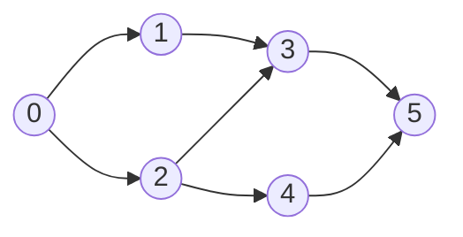

# Topological sort: DFS post-order reverse

Two algorithms solve LC 207 *Course Schedule* in linear time. [Topological sort: Kahn's algorithm](./04-topological-sort-kahn.md) emits vertices as their indegree drops to zero, growing the answer one queue-pop at a time. The algorithm in this chapter does the opposite: it walks the graph depth-first, emits each vertex on the way out of its recursion frame, and discovers the topological order *after* the recursion has completed by reversing the list it built.

Same problem, same complexity, two genuinely different mental models. The Kahn version reads the graph forward; the DFS version reads it backward. Both produce a valid topological order, but on the canonical 6-node DAG the chapter animates, they pick *different* orders: same source, same sink, three middle positions different. That divergence is the lesson. Topological order is plural, and which valid order a given algorithm reports depends entirely on how the algorithm walks.

The reason this chapter exists as a sibling rather than a footnote is that the post-order skeleton is not just an alternate route to the topological sort. Tarjan's bridge-finding algorithm, Hierholzer's Eulerian-path construction, dynamic programming on a DAG, and cycle-length detection in a functional graph are all the same recursion shape with a different action at the post-order moment. Mastering this chapter unlocks five named graph algorithms in one mental model.

## Why two colors are not enough

Most readers come to this chapter with `visited[]` muscle memory from undirected DFS, one boolean per vertex, flip it on entry, never reset. That works for tree traversal. It does not work for cycle detection in directed graphs.

Consider the graph `0 -> 1 -> 2 -> 0`. DFS from 0 enters 0 and marks `visited[0] = True`. It descends into 1, then 2. From 2, the algorithm encounters the edge back to 0 and reads `visited[0] = True`. The natural conclusion is *"0 is already done; safe to skip"*. The cycle goes silently uncounted. LeetCode reports the wrong answer.

The fix is a three-color invariant from CLRS:[^1]

- **WHITE** is never visited.
- **GRAY** is currently on the recursion stack. The DFS frame for this vertex is somewhere up the call chain, still running.
- **BLACK** is finished. The DFS frame returned, every successor is finished too.

Two-color DFS conflates GRAY and BLACK. Three-color DFS keeps them distinct, and the cycle test becomes a single line: *if DFS encounters a GRAY successor, the edge is a back edge and the graph has a cycle.* GRAY identifies *current-path* membership; BLACK identifies *finished*. The witness is the GRAY-to-GRAY edge.

The same three colors are what make post-order emission correct. When DFS exits a vertex, every successor is BLACK, which means every successor was emitted before this vertex. Append the vertex to a running list at the GRAY-to-BLACK transition and the list will hold every vertex in finish-time order: consumers first, producers last. Reverse the list and the order is what a topological sort needs: producers first.

## The algorithm

Two responsibilities, one recursion. The outer loop dispatches DFS on every vertex that's still WHITE so disconnected components don't get missed. The inner DFS does the three-color dance and the post-order append.

```python
import sys
sys.setrecursionlimit(10000)

WHITE, GRAY, BLACK = 0, 1, 2

def can_finish(num_courses, prerequisites):
    adj = [[] for _ in range(num_courses)]
    for a, b in prerequisites:
        adj[b].append(a)                   # b must finish before a; edge b -> a

    color = [WHITE] * num_courses

    def dfs(u):
        color[u] = GRAY                    # entering: u is on the recursion stack
        for v in adj[u]:
            if color[v] == GRAY:
                return False               # back edge -> cycle
            if color[v] == WHITE and not dfs(v):
                return False
            # color[v] == BLACK: cross/forward edge, fine to skip
        color[u] = BLACK                   # leaving: post-order point
        return True                        # post.append(u) here for LC 210

    for u in range(num_courses):
        if color[u] == WHITE and not dfs(u):
            return False
    return True
```

**Solution** — Python ([Java](./05-topological-sort-dfs/lc-207/sol.java) · [C++](./05-topological-sort-dfs/lc-207/sol.cpp) · [Go](./05-topological-sort-dfs/lc-207/sol.go))

```python
# LC 207. Course Schedule
"""LC 207 Course Schedule, DFS post-order reverse topological sort."""
import sys
from typing import List

sys.setrecursionlimit(10000)  # DSH-04: LC 207 hidden tests include depth-2000 chains

WHITE, GRAY, BLACK = 0, 1, 2


def can_finish(num_courses: int, prerequisites: List[List[int]]) -> bool:
    """Return True iff the prereq graph is a DAG. Edge convention: b -> a."""
    adj: List[List[int]] = [[] for _ in range(num_courses)]
    for a, b in prerequisites:
        adj[b].append(a)

    color = [WHITE] * num_courses

    def dfs(u: int) -> bool:
        color[u] = GRAY
        for v in adj[u]:
            if color[v] == GRAY:
                return False  # back edge -> cycle
            if color[v] == WHITE and not dfs(v):
                return False
        color[u] = BLACK  # post-order point: append u to a list here for LC 210
        return True

    for u in range(num_courses):
        if color[u] == WHITE and not dfs(u):
            return False
    return True
```

The line `sys.setrecursionlimit(10000)` is not decoration. LC 207's stated bound is `numCourses <= 2000`, and the worst-case input is the chain `0 -> 1 -> 2 -> ... -> 1999`. The DFS recursion depth equals the chain length. Python's default limit is 1000; without the lift, the submission throws `RecursionError` on hidden tests that the visible examples don't exercise.[^2] Java's process stack tolerates depth 2000 without intervention; C++ on Linux (8 MB default stack) tolerates roughly 130,000 frames; Go grows goroutine stacks dynamically. The Python guard is genuinely the only language where this matters at LC scale, and it's the most common Python-specific bug on graph DFS submissions.

The edge convention deserves a sentence. LC 207's `prerequisites[i] = [a, b]` reads as *"a depends on b"* in English. The natural directed-graph model is "edge from cause to effect", so the algorithm builds `adj[b].append(a)`: `b -> a`, prerequisite to dependent. Same convention as Kahn's version of the chapter. Get this backward and the function returns wrong-answer on every input that isn't symmetric.

## Walking the canonical DAG

Take the same six-node DAG the chapter on Kahn's algorithm uses: vertices `0` through `5`, edges `0->1, 0->2, 1->3, 2->3, 2->4, 3->5, 4->5`. Single source 0, single sink 5, no cycle. Kahn's algorithm emits this as `[0, 1, 2, 3, 4, 5]`, dequeuing one vertex per iteration as its indegree hits zero. DFS does something different.



*The canonical input. DFS from 0 finds 5 first (the deepest sink) and emits it first to the post-order list; the reverse of that list is the topological order.*

Top-level loop reaches vertex 0; it's WHITE, so call `DFS(0)`. Mark 0 GRAY. Iterate `adj[0]` and find 1; recurse into `DFS(1)`. Mark 1 GRAY. Iterate `adj[1]` and find 3; recurse into `DFS(3)`. Mark 3 GRAY, find 5, recurse into `DFS(5)`. Mark 5 GRAY. Vertex 5 has no outgoing edges, so `DFS(5)` immediately falls through the loop and reaches the post-order point. **5 is the first vertex to finish.** Mark 5 BLACK; append 5 to the post-order list. Return.

Back in `DFS(3)`. The for-loop in `DFS(3)` had only one neighbor (5), so 3 also reaches its post-order point. Append 3. Back in `DFS(1)`, same story; append 1. Back in `DFS(0)`. The first iteration of `adj[0]` finished; on to the second, which is 2. Recurse into `DFS(2)`. Mark 2 GRAY. Iterate: first edge `2 -> 3`. But `color[3]` is already BLACK, so this is a cross/forward edge: skip it. Next edge `2 -> 4`. Recurse, mark 4 GRAY, hit `4 -> 5`, but 5 is BLACK, skip. `DFS(4)` falls through; append 4. Back in `DFS(2)`, post-order; append 2. Back in `DFS(0)`, post-order; append 0.

Post-order list: `[5, 3, 1, 4, 2, 0]`. Reverse it: `[0, 2, 4, 1, 3, 5]`. **That's the topological order DFS reports.**

> **Interactive widget:** [Topological sort (Kahn's vs DFS post-order)](../widgets/w-27-topological-sort-kahn.yml) (panel `panel-dfs`) — rendered on the website; the YAML spec describes the keyframes.

*Static fallback: the panel-dfs trace runs 23 steps. The post-order list stays empty until the deepest frame finishes (step 9 emits 5), then grows one entry per DFS-exit, and reaches `[5, 3, 1, 4, 2, 0]` at step 20 when the outermost call to `DFS(0)` returns. Step 21 reverses the list in place. The widget's panel-kahn pane animates Kahn's algorithm on the same DAG so the two emit orders sit on screen at once.*

The same DAG, two algorithms, two valid topological orders. Kahn's `[0, 1, 2, 3, 4, 5]` agrees with English intuition: process vertices in roughly increasing indegree order, ties broken by insertion. DFS's `[0, 2, 4, 1, 3, 5]` follows the recursion. Vertex 0 spawned the call to 1 first, which finished its entire subtree (3 and 5) before the call to 2 ran. So 1, 3, 5 all finished *before* 2 and 4, meaning 2 and 4 have larger finish times, meaning they appear *earlier* in the reversed post-order. That's the algorithm's logic in one sentence.

## Why post-order, then reverse, is correct

The proof is almost embarrassingly short. A topological order requires that for every edge `(u, v)`, `u` precedes `v` in the output. DFS gives us an invariant strong enough to make that automatic.

When DFS exits vertex `u`, every successor of `u` has already finished. That's mechanical: the for-loop in `DFS(u)` cannot reach the post-order point until every recursive call it spawned has returned. So `u` finishes *after* every vertex it can reach.

Append vertices to a list at their post-order moment, and the list holds vertices in increasing finish time. The first vertex appended is some sink; the last vertex appended is some source. That's the wrong direction for a topological sort, which wants sources first. Reverse the list and the property flips: the vertex with the *latest* finish time is now first, and for every edge `(u, v)`, `u`'s frame finished after `v`'s, so `u` has the larger finish time, so `u` comes earlier in the reversed list. Done.

CLRS calls the underlying property the parenthesis theorem: the discovery and finish times of any pair of vertices nest like balanced parentheses, with proper containment for tree and forward edges.[^1] The theorem statement is more general than this chapter needs; the corollary "post-order, then reverse, is a topological sort" is what's load-bearing here. Erickson's free *Algorithms* text gives the same correctness argument with less machinery.[^3]

The algorithm doubles as a cycle decision because the back-edge case is the only way the proof breaks. If DFS ever encounters a GRAY successor, that successor is currently on the recursion stack: its frame is still open, its finish time is unknown. The output list would contain a vertex whose successor hasn't finished yet, violating the invariant. Returning false at that moment is correct; the graph is not a DAG and no topological order exists.

## What it actually costs

| Variant | Time | Space | Notes |
|---|---|---|---|
| Cycle decision (LC 207) | O(V + E) | O(V) | Color array + recursion stack. Bound matches Kahn's. |
| Order production (LC 210) | O(V + E) | O(V) | Add a post-order list of size V. |
| Tarjan bridges (LC 1192) | O(V + E) | O(V) | Two arrays (`disc`, `low`) instead of one (`color`). |
| Hierholzer Eulerian (LC 332) | O((V + E) log E) | O(V + E) | Sorting per-vertex adjacency for lex order adds log E; without sort, O(V + E). |

Each vertex enters DFS exactly once (the WHITE-to-GRAY transition is gated by the WHITE check) and exits DFS exactly once (the GRAY-to-BLACK transition happens on the way out). Each directed edge `(u, v)` is examined exactly once, at the moment `u`'s DFS frame iterates over `adj[u]`. Total work is O(|V|) for vertex bookkeeping plus O(|E|) for edges, summing to O(V + E).[^4]

The bound is tight for any topological-sort algorithm. Reading every edge at least once is necessary just to verify the order respects it. DFS post-order matches the lower bound to a constant.

The space row is worth a sentence. The O(V) bound counts the color array, the post-order list, and the recursion stack. On a chain `0 -> 1 -> ... -> V-1`, the recursion stack hits depth V. That's fine in Java, C++, and Go for V up to roughly 10^4 to 10^5 on default stack sizes; in Python, fine only after `sys.setrecursionlimit`. Production code on million-vertex graphs converts the recursion to an explicit stack of `(vertex, iterator-index)` frames, which is mechanical but ugly enough that interview solutions rarely bother.

## Where the post-order moment pays off

The chapter's center of gravity is what `color[u] = BLACK` does *next*. In the topological sort above, it's a single `post.append(u)`. In three named algorithms, the same line does substantially more, and the algorithm's value lives there.

**Tarjan's bridges (LC 1192).** Add two integer arrays `disc[u]` (the global counter when DFS enters `u`) and `low[u]` (the minimum `disc[w]` reachable from the subtree rooted at `u`). For each tree-edge child `v`, after recursing on `v`, update `low[u] = min(low[u], low[v])`. For each back edge to `w`, update `low[u] = min(low[u], disc[w])`. After the for-loop, the edge `(u, v)` is a bridge iff `low[v] > disc[u]`: no path from `v`'s subtree climbs above `u`, so removing the edge severs the graph.[^5] The propagation of `low[v]` into `low[u]` happens *after* the recursive call returns. That's the post-order moment doing work the chapter sets up.

**Hierholzer's Eulerian path (LC 332).** Greedily descend along available outgoing edges until the current vertex has no more; prepend the dead-end vertex to the result list and backtrack. The result list, read forward after all DFS frames return, is the Eulerian path. The post-order operates on edges instead of vertices: each edge is consumed once and the consuming vertex is recorded on the way out. Reconstruct Itinerary's lex-smallest variant adds a min-heap or pre-sort over each vertex's adjacency list so the greedy descent picks airports in alphabetical order.

**Cycle length in a functional graph (LC 2360).** Each vertex has at most one outgoing edge. DFS from each unvisited vertex follows the unique chain until it revisits a vertex; if the seen vertex is GRAY (still on this DFS run's recursion stack), the cycle length is `current_timestamp - disc[seen]`. If it's BLACK from a prior run, no cycle starts here. The pattern recurs: per-DFS-run timestamps, the GRAY-versus-BLACK distinction, post-order finalization. Same skeleton, different action at finish time.

These are not three separate algorithms taught from scratch elsewhere. They are three actions taken at the same recursion point. The chapter on cycle detection takes the back-edge witness and treats it as the load-bearing artifact instead.

## Two pitfalls that bite

> [!WARNING]
> **Reverse-vs-forward post-order confusion.** The mistake is finishing the algorithm with `return post_order` instead of `return list(reversed(post_order))`. The post-order list holds consumers before producers: every dependent before its prerequisite, the *opposite* of what LC 210 grades. The fix is one line at the top of the function or one wrapper around the return. Mnemonic: the deepest leaves finish first; the topological order needs them last. Reverse to flip the chronology.

> [!WARNING]
> **Forgetting the GRAY-to-BLACK flip on the way out.** The for-loop body inside `DFS(u)` handles GRAY (cycle), WHITE (recurse), and BLACK (skip) cases for successors. It's tempting to read GRAY as "permanently visited" and omit the BLACK transition. The result: a second top-level DFS run encounters a vertex from a finished prior subtree, sees it as GRAY, and falsely reports a cycle. Disconnected-component test cases surface this immediately. The flip is mandatory at the end of every DFS frame, before the `return True`.

A third pitfall worth naming briefly: in Tarjan's bridge variant, updating `low[u] = min(low[u], disc[v])` for tree-edge children instead of `low[u] = min(low[u], low[v])`. The asymmetry between the two cases (`low[v]` for tree children, `disc[w]` for back-edge targets) is the lowlink algorithm's central invariant. Get it wrong and the function over-reports bridges on graphs that have deep back edges from far descendants. The webcoderspeed walk-through of LC 1192 names this as the most common "passes small cases, fails large" failure mode.

## Picking between Kahn and DFS

Both algorithms run in O(V + E) and both produce a valid topological order on a DAG. The choice is operational, not asymptotic.

| | Kahn's algorithm (see [Topological sort: Kahn's algorithm](./04-topological-sort-kahn.md)) | DFS post-order reverse (this chapter) |
|---|---|---|
| **Mental model** | BFS-style: peel off zero-indegree vertices one at a time. | Recursive: emit on the way out, reverse at the end. |
| **Cycle detection** | Compare emitted count to V. If fewer than V vertices are emitted, the unprocessed remainder is a cycle. | Three-color invariant. A GRAY successor during DFS is the back-edge witness. |
| **Iterative or recursive** | Iterative; uses an explicit queue. No recursion depth concerns. | Recursive by default; Python needs `sys.setrecursionlimit(10000)` on chains > 1000. |
| **Order construction** | Emergent during the run; the order *is* the dequeue sequence. | Constructed after the run, in reverse; the order materializes only when DFS finishes and the post-order list is reversed. |
| **Lexicographic order** | Trivial: replace the queue with a min-heap. Gives the lex-smallest topological order; useful for LC 269 *Alien Dictionary*. | Possible but awkward: requires sorting each vertex's adjacency list and reversing the full output. |
| **Per-vertex post-order computation** | Awkward; Kahn doesn't naturally know when a vertex's successors are done. | Native: the GRAY-to-BLACK transition *is* "successors done". Tarjan's `low[]`, DAG dynamic programming, and Hierholzer's prepend all live here. |
| **Code size** | A few lines longer; explicit indegree array, queue, emit-counter. | Shorter: three colors, one recursive function, one reverse at the end. |
| **Production code at scale** | Preferred for million-vertex graphs (no recursion-depth concerns) and for any case where lex order matters. | Preferred when the algorithm naturally extends to a per-vertex post-order computation (Tarjan's family of algorithms; DAG-DP). |

A useful heuristic: if the question is *"is this a DAG"* or *"give me an order"* with no per-vertex post-order computation, reach for [Kahn's algorithm](./04-topological-sort-kahn.md). It's iterative, it gives lex order for free, and it's immune to recursion-depth issues. If the algorithm naturally extends to *"what does each vertex learn from its descendants"* (bridges, articulation points, longest path on a DAG, dynamic programming on a DAG, Eulerian paths, strongly connected components), reach for DFS post-order. The recursion frame is the place where descendant information lives, and the post-order moment is when it's all available.

## Problem ladder

### CORE (solve all three to claim chapter mastery)

- [LC 1192 — Critical Connections in a Network](https://leetcode.com/problems/critical-connections-in-a-network/) [Hard] • dfs-postorder ★
- [LC 332 — Reconstruct Itinerary](https://leetcode.com/problems/reconstruct-itinerary/) [Hard] • dfs-postorder
- [LC 2360 — Longest Cycle in a Graph](https://leetcode.com/problems/longest-cycle-in-a-graph/) [Hard] • dfs-postorder

### STRETCH (optional)

- [LC 444 — Sequence Reconstruction](https://leetcode.com/problems/sequence-reconstruction/) [Medium] • dfs-postorder *(Premium; free alternative: [LC 210 — Course Schedule II](https://leetcode.com/problems/course-schedule-ii/))*
- [LC 1059 — All Paths from Source Lead to Destination](https://leetcode.com/problems/all-paths-from-source-lead-to-destination/) [Medium] • dfs-postorder *(Premium; free alternative: [LC 207 — Course Schedule](https://leetcode.com/problems/course-schedule/))*

The CORE three are intentionally all Hard. Pure DFS post-order applications (Tarjan's bridges, Hierholzer's, cycle-length via timestamps) are structurally Hard and LC has no canonical Easy at this theme. LC 207 and LC 210 are owned by [Topological sort: Kahn's algorithm](./04-topological-sort-kahn.md), which exercises the same family of problems at the Medium tier. The post-order skeleton in this chapter and the indegree skeleton in 8.4 cover the topological-sort question between them.

LC 1192 is the chapter's signature problem (★) because it's the cleanest demonstration of why the post-order moment matters: `low[v]` is the value a tree-edge parent needs from its child, and that value is only available *after* the recursive call returns. Tarjan's algorithm is exactly the topological sort skeleton with `post.append(u)` replaced by `low[u] = min(low[u], low[v])`.

## Where this leads

The next chapter, [Cycle detection in graphs](./06-cycle-detection-graphs.md), takes the back-edge witness from this chapter and treats it as the load-bearing artifact. The same three-color invariant; a different question (*"does a cycle exist"* and *"return one"*); and a tour through the three canonical methods (Floyd's tortoise-and-hare from [Linked list cycle detection](../part-5-linked-lists/03-cycle-detection.md), the DFS three-color test from this chapter, and the Kahn count-check from the sibling).

[Strongly connected components](./02-dfs.md) is where the post-order skeleton gets its second large application. Tarjan's SCC and Kosaraju's SCC both run two DFS passes, and the post-order finish-time ordering from the first pass is exactly what makes the second pass linear. Half of that algorithm is the topological sort above.

For dynamic programming on a DAG (longest path, count of paths, weighted topological problems) the chapters in Part 9 use the post-order order produced here as the relaxation order. When `u`'s frame returns, every `answer[v]` for `v in adj[u]` is finalized; computing `answer[u]` from them is an O(degree) operation per vertex.

## References

[^1]: Thomas H. Cormen, Charles E. Leiserson, Ronald L. Rivest, Clifford Stein, *Introduction to Algorithms*, 3rd edition (MIT Press, 2009), §22.3 "Depth-first search" and §22.4 "Topological sort".

[^2]: AlgoMaster, *Python for DSA*. <https://algomaster.io/learn/dsa/python-crash-course>.

[^3]: Jeff Erickson, *Algorithms*, Chapter 6 "Depth-First Search" §6.4 "Topological sort". <https://jeffe.cs.illinois.edu/teaching/algorithms/book/06-dfs.pdf>.

[^4]: cp-algorithms, *Topological Sorting*. <https://cp-algorithms.com/graph/topological-sort.html>.

[^5]: Robert Tarjan, "Depth-first search and linear graph algorithms," *SIAM Journal on Computing* 1(2):146-160, 1972.
