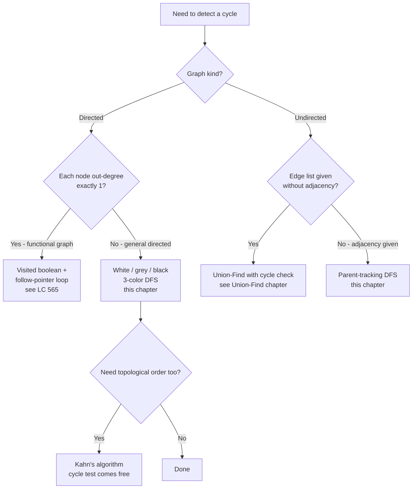
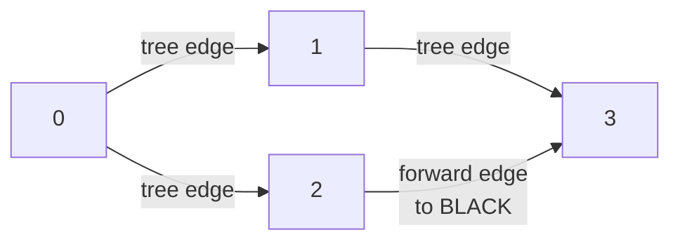

# Cycle detection in graphs

Four nodes, four directed edges: `0 → 1`, `0 → 2`, `1 → 3`, `2 → 3`. Draw it. The shape is a diamond. There is no cycle. A perfectly reasonable cycle-detection algorithm, DFS plus a single boolean `visited[]` array, reports a cycle on this graph anyway, and every interview prep site that lifts the linked-list visited-set idiom into graph territory ships this bug.

The fix is one extra state. The reason takes a chapter to explain. The other half of the chapter is the same fix, in reverse: when the input is undirected, the fancy three-state DFS collapses, but a cleanly-drawn one-state DFS *also* reports a cycle on every connected graph if you forget a single argument. Cycle detection is two algorithms, four lines apart, and the cost of using the wrong one on the wrong graph kind is silent wrong answers.

## Locating this pattern



*Two questions decide the algorithm: the graph's kind, and (for directed graphs) whether each vertex has exactly one outgoing edge.*

The signal is in the **graph kind**, not the problem flavor. Reach for the white/grey/black DFS coloring when the input is directed and the question is *"is this acyclic?"* or *"can these courses be taken?"*. Reach for parent-tracking DFS when the input is undirected and the question is *"do these edges form a tree?"* or *"is there a cycle in this network?"*. Adjacent patterns the reader will mistake for this one: if the problem also wants a topological ordering, [Topological sort: Kahn's algorithm](./04-topological-sort-kahn.md) gets cycle detection free as the by-product of "did we drain every in-degree-zero node?"; if each node has exactly one successor and you need O(1) extra space, the linked-list framing of Floyd's tortoise-and-hare in [Linked-list cycle detection](../part-5-linked-lists/03-cycle-detection.md) is shorter and doesn't allocate a visited set.

## Why the obvious approach reports cycles that aren't there

Take the diamond from the opening. `adj = {0: [1, 2], 1: [3], 2: [3], 3: []}`. The DAG is acyclic. Now write the cycle detector the way every two-color visited-set tutorial writes it:

```python
# WRONG: this is the bug. 2 colors aren't enough for directed graphs.
def has_cycle_two_color(n, adj):
    visited = [False] * n
    def dfs(u):
        if visited[u]:
            return True            # WRONG: "visited" conflates
        visited[u] = True          #        two distinct states
        for v in adj[u]:
            if dfs(v):
                return True
        return False
    for u in range(n):
        if not visited[u] and dfs(u):
            return True
    return False
```

Walk the diamond. Start at 0, mark it visited. Recurse into 1, mark it. Recurse into 3, mark it. 3 has no neighbors; return false. Back at 1; return false. Back at 0; recurse into 2, mark it. Look at 2's neighbor: 3. `visited[3]` is true, so the algorithm returns true. **Reports a cycle on a graph that has none.**

The bug is that `visited[3] == True` was meant to mean *"3 is on my current recursion path"*, and instead it means *"I have ever seen 3 before"*. Those are different things. The first one finds back edges (the only edge type that closes a cycle). The second one also catches forward edges and cross edges (edges into a finished subtree), which are perfectly legal in a DAG.[^1] The fix is to give the algorithm enough state to distinguish "currently inside" from "already finished".

Three colors do that. WHITE means undiscovered. GREY means on the active recursion stack: DFS entered this vertex and has not yet returned. BLACK means DFS finished this vertex; everything reachable from it is fully explored. A back edge to a GREY vertex is the cycle witness. An edge to a BLACK vertex is benign: BLACK means *"I'm done with this; nothing on my current path leads here"*.

```python
def has_cycle_directed(n, edges):
    adj = [[] for _ in range(n)]
    for u, v in edges:
        adj[u].append(v)

    WHITE, GREY, BLACK = 0, 1, 2
    color = [WHITE] * n

    def dfs(u):
        color[u] = GREY
        for v in adj[u]:
            if color[v] == GREY:        # back edge -> cycle
                return True
            if color[v] == WHITE and dfs(v):
                return True
        color[u] = BLACK
        return False

    for u in range(n):
        if color[u] == WHITE and dfs(u):
            return True
    return False
```

Re-run on the diamond. Visit 0: GREY. Recurse into 1: GREY. Recurse into 3: GREY → BLACK. Return to 1: BLACK. Return to 0. Recurse into 2: GREY. Look at 2's neighbor 3: BLACK, not GREY, **not a back edge**, no cycle reported. 2 → BLACK. 0 → BLACK. Return false. Correct.



*The diamond DAG. The C → D edge is a forward edge into the already-finished BLACK vertex 3; the three-color algorithm correctly classifies it and reports no cycle. The two-color algorithm sees `visited[3] == True` and reports a cycle.*

## The other half: undirected graphs need a parent argument, not three colors

Switch graph kinds. The undirected case has its own version of the two-color bug, but in reverse: collapsing to one boolean is correct here, and forgetting a different piece of state is what breaks it.

Look at a triangle: `0 — 1 — 2 — 0`. Three vertices, three undirected edges. There's a cycle. Write the algorithm:

```python
# WRONG: this reports a cycle on every connected graph with >= 1 edge.
def has_cycle_undirected_no_parent(n, edges):
    adj = [[] for _ in range(n)]
    for u, v in edges:
        adj[u].append(v)
        adj[v].append(u)         # both directions: undirected
    visited = [False] * n
    def dfs(u):
        if visited[u]:
            return True
        visited[u] = True
        for v in adj[u]:
            if dfs(v):
                return True
        return False
    return dfs(0)
```

Run it on a tree with one edge: `n = 2`, `edges = [[0, 1]]`. Visit 0, mark it visited. Recurse into 1, mark it. Look at 1's neighbors: `adj[1] = [0]` (because the undirected edge `(0, 1)` puts each endpoint on the other's adjacency list). `visited[0] == True`. Return true. **The algorithm reports a cycle on a graph that is structurally a single edge.**

The bug: undirected edges go both ways in the adjacency list, so the DFS, when it walks from 0 to 1, finds 0 on 1's neighbor list and treats that as a separate edge into a visited vertex. It can't tell *"this is the edge I just traversed"* from *"this is a back edge"*. The fix is the parent argument:

```python
def has_cycle_undirected(n, edges):
    adj = [[] for _ in range(n)]
    for u, v in edges:
        adj[u].append(v)
        adj[v].append(u)

    visited = [False] * n

    def dfs(u, parent):
        visited[u] = True
        for v in adj[u]:
            if not visited[v]:
                if dfs(v, u):
                    return True
            elif v != parent:           # visited non-parent -> cycle
                return True
        return False

    for u in range(n):
        if not visited[u] and dfs(u, -1):
            return True
    return False
```

The parent argument tells the recursion *"the edge I just walked across does not count"*. Every other visited neighbor is a back edge witness. CLRS §20.3 establishes the result this leans on: in an undirected graph, every DFS edge is either a tree edge or a back edge; there are no forward or cross edges to worry about.[^1] So one boolean state plus one parent argument is exactly the right amount of bookkeeping.

A reasonable question at this point: why does the directed case need three states when the undirected case only needs one plus a parent? Because in undirected DFS the only non-tree edges are back edges (no forward edges, no cross edges), so any visited non-parent neighbor is a guaranteed cycle witness. In directed DFS, forward edges and cross edges into already-finished subtrees are legal, and the algorithm has to recognize them as benign without flagging them. BLACK is the state that says *"benign"*.

## Worked example: LC 1361 Validate Binary Tree Nodes

Some of the cleanest applications combine both halves. LC 1361 hands you `n` nodes labeled `0..n-1` and two arrays `leftChild[i]` and `rightChild[i]` (each entry is a node id or `-1`). Decide whether the structure is a valid binary tree.

A valid binary tree on n nodes is exactly two things: no cycle, and one connected component reachable from a unique root. The first half is undirected-style cycle detection (revisiting a node from a different parent fails). The second half is straightforward connectivity. Both fall out of one BFS:

```python
from collections import deque

def validate_binary_tree_nodes(n, leftChild, rightChild):
    in_degree = [0] * n
    for c in leftChild:
        if c != -1:
            in_degree[c] += 1
    for c in rightChild:
        if c != -1:
            in_degree[c] += 1

    root = -1
    for i in range(n):
        if in_degree[i] == 0:
            if root != -1:
                return False        # two roots
            root = i
        elif in_degree[i] > 1:
            return False            # two parents -> cycle or shared subtree

    if root == -1:
        return False                # every node has a parent -> cycle

    seen = [False] * n
    seen[root] = True
    visited_count = 1
    q = deque([root])
    while q:
        u = q.popleft()
        for v in (leftChild[u], rightChild[u]):
            if v == -1:
                continue
            if seen[v]:             # visited again -> cycle
                return False
            seen[v] = True
            visited_count += 1
            q.append(v)
    return visited_count == n       # all reachable from root?
```

**Solution** — Python ([Java](./06-cycle-detection-graphs/lc-1361/sol.java) · [C++](./06-cycle-detection-graphs/lc-1361/sol.cpp) · [Go](./06-cycle-detection-graphs/lc-1361/sol.go))

```python
# LC 1361. Validate Binary Tree Nodes
"""LC 1361. Each node has 0, 1, or 2 children given by leftChild[i] / rightChild[i]
(value -1 means no child). Return True iff the n nodes form a valid binary tree.

A valid binary tree on n nodes:
  1. exactly one root (in-degree 0); every other node has in-degree 1
  2. no cycle (BFS from root visits every node at most once)
  3. one connected component (BFS from root visits all n nodes)

Conditions 2 and 3 collapse into "BFS from the unique root visits exactly n
distinct nodes". The chapter teaches this as the canonical undirected-DFS
application; the directed framing here is structurally identical because
each edge is parent->child and the parent-tracking guard is replaced by the
"in-degree ≤ 1" precondition.
"""

from typing import List
from collections import deque


def validate_binary_tree_nodes(n: int, leftChild: List[int], rightChild: List[int]) -> bool:
    in_degree = [0] * n
    for c in leftChild:
        if c != -1:
            in_degree[c] += 1
    for c in rightChild:
        if c != -1:
            in_degree[c] += 1

    # exactly one root
    root = -1
    for i in range(n):
        if in_degree[i] == 0:
            if root != -1:
                return False
            root = i
        elif in_degree[i] > 1:
            return False
    if root == -1:
        return False

    # BFS from root; every node must be visited exactly once
    seen = [False] * n
    seen[root] = True
    visited_count = 1
    q = deque([root])
    while q:
        u = q.popleft()
        for v in (leftChild[u], rightChild[u]):
            if v == -1:
                continue
            if seen[v]:           # cycle witness
                return False
            seen[v] = True
            visited_count += 1
            q.append(v)
    return visited_count == n
```

The in-degree pass enforces "every node has at most one parent" and "exactly one node has no parent". That alone catches a lot of bad inputs, but not all: it misses cycles that are entirely separate from the root's component. The BFS from the unique root catches both a cycle (re-entering a `seen` node from a different path) and disconnection (`visited_count < n`). Two checks, both necessary.

A small example. `n = 4`, `leftChild = [1, -1, 3, -1]`, `rightChild = [2, -1, -1, -1]`. In-degrees: node 0 has none, nodes 1, 2, 3 each have one parent. Root is 0. BFS visits 0, then 1, 2, then 3. All four seen, no revisits. Return true.

A cycle case. `n = 4`, `leftChild = [1, 0, 3, -1]`, `rightChild = [-1, -1, -1, -1]`. Node 0 points to 1 which points back to 0. In-degree of 0 is 1, in-degree of 1 is 1, in-degree of 2 is 0, in-degree of 3 is 1. Two roots? Wait — only node 2 has in-degree zero, so root = 2. BFS from 2 visits 2 and 3. Then `visited_count = 2 != 4`. Return false. The cycle in {0, 1} is unreachable from the root, and the connectivity check catches it.

The code reuses the chapter's two algorithms with one twist: because each edge is directed (parent → child) and a child can only have one parent, the parent-tracking guard from the undirected version is replaced by the in-degree precondition. Otherwise the BFS body is identical to the undirected DFS in §"The other half" — visited again means cycle.

## What it actually costs

| Variant | Time | Space | Notes |
|---|---|---|---|
| Directed cycle detection (3-color DFS) | O(V + E) | O(V) | Two DFS-state words per vertex; no per-edge state. |
| Undirected cycle detection (parent-tracking DFS) | O(V + E) | O(V) | Same bound; the parent argument is one int per recursion frame. |
| Functional graph (out-degree exactly 1) | O(V) | O(V) | Each step follows a unique pointer, so the inner loop disappears. |
| Cycle detection + cycle path reconstruction | O(V + E) | O(V) | Maintain an `edgeTo[]` parent-pointer array; on back-edge detection, walk it backward. |

The amortization is standard. Each DFS state transition is monotone (WHITE → GREY → BLACK; no state is ever revisited). The `for v in adj[u]` loop charges one cell-read per outgoing edge. Summed over all vertices, the total is O(V) for state bookkeeping plus O(E) for adjacency scans (or O(2E) = O(E) for undirected, since each edge appears in two adjacency lists). Tarjan's 1972 paper established this as the linear-time foundation that the whole DFS family inherits.[^2]

The space is O(V) for the color or visited array plus O(V) worst-case recursion-stack depth on a chain-shaped graph (`0 → 1 → 2 → ... → V-1` forces depth V).

## Variations: when the algorithm bends

### Functional graphs collapse the three-color machinery

When each vertex has at most one outgoing edge (a permutation, a "next pointer" array, an `edges[i] = j` form), the three-color algorithm overstates the bookkeeping. The DFS becomes a while-loop that follows the unique successor; the cycle, if there is one, is the closed loop the chain enters. A single visited boolean plus a per-traversal step counter computes both *whether* there's a cycle and *how long* it is in one O(n) pass.[^3] LC 565 (Array Nesting) is the canonical entry point.

### Reporting the cycle, not just yes-or-no

The 3-color DFS short-circuits on the first back edge it finds, which throws away the witness. To return *which* vertices form the cycle (LC's "redundant connection" problems, the "find the deadlock" diagnostic), maintain a parent-pointer array `edgeTo[]` during DFS. When the algorithm detects a back edge `(u, v)` with `v` GREY, walk `edgeTo[u] → edgeTo[edgeTo[u]] → ...` until reaching `v`, then prepend `v` and reverse for the cycle. Sedgewick & Wayne's `algs4` library ships exactly this in `DirectedCycle.java`; the pointer-walk is O(cycle-length) on top of the original DFS.

### Self-loops and parallel edges

A directed self-loop `(u, u)` is itself a length-1 cycle, and the three-color algorithm catches it for free: when DFS visits `u` and looks at `adj[u]`, it sees `u` GREY immediately, reports the cycle, done.

Parallel undirected edges are subtler. If the graph has two distinct edges between `u` and `v`, the basic parent-tracking algorithm misses the resulting length-2 cycle, because the second edge to `v`'s parent looks indistinguishable from "the edge I came from" and gets filtered. The fix is to track the entering *edge index* rather than the parent vertex. Sedgewick & Wayne's `Cycle.java` documents this explicitly, and runs a Θ(V + E) preprocessing pass to handle self-loops and parallel pairs before the main DFS.[^4] In LC's standard problem set this case doesn't appear, but it's the kind of "what if" follow-up that earns chapter credit in a Senior+ interview.

## Two pitfalls that bite

> [!WARNING]
> **Stack overflow on chain-shaped graphs.** A directed graph that's structurally a chain — `0 → 1 → 2 → ... → 99999` — forces DFS recursion depth equal to V. CPython's default recursion limit is 1000, designed to catch infinite recursion before exhausting the OS stack, not to support deep graph DFS.[^5] The same code that passes locally on n = 100 fails on the LC hidden test with `RecursionError`. Fix: set `sys.setrecursionlimit(10**6)` at the top of the module, or convert to an explicit-stack iterative DFS where the stack frames live on the heap. Java's JVM stack size `-Xss` is platform-dependent and the same risk applies; the iterative conversion is the portable answer. Go's auto-growing goroutine stack is the rare structural win.

> [!WARNING]
> **Forgetting to restart on every component.** The inner DFS only visits one connected component (or one weakly-connected component for directed graphs). On a graph with multiple components, the outer for-loop is what catches cycles that aren't in the root's component. Both algorithms in this chapter wrap the DFS in `for u in range(n): if color[u] == WHITE: dfs(u)` for exactly this reason. A submission that runs DFS only from vertex 0 will return "no cycle" on a graph whose first component is a tree and whose second component is a triangle — and will fail silently on the hidden test that exercises this case.

A third trap worth naming briefly: writing `if color[v] != WHITE: return True` inside the directed algorithm. This conflates BLACK with GREY and regresses to the two-color bug from the opening. The cycle witness is *only* a GREY neighbor; a BLACK neighbor is a finished subtree and is benign. Naming the constant `ON_STACK` instead of `GREY` helps the mental model. The question the algorithm is actually asking is *"is `v` currently on my recursion stack?"*, and only ON_STACK answers yes.

## Problem ladder

### CORE (solve all three to claim chapter mastery)

- [LC 565 — Array Nesting](https://leetcode.com/problems/array-nesting/) [Medium] • directed-cycle-functional-graph
- [LC 1361 — Validate Binary Tree Nodes](https://leetcode.com/problems/validate-binary-tree-nodes/) [Medium] • undirected-cycle-tree-validity ★
- [LC 261 — Graph Valid Tree](https://leetcode.com/problems/graph-valid-tree/) [Medium] • undirected-cycle-tree-validity *(Premium; free mirror: [LC 684 — Redundant Connection](https://leetcode.com/problems/redundant-connection/))*

### STRETCH (optional)

- [LC 1971 — Find if Path Exists in Graph](https://leetcode.com/problems/find-if-path-exists-in-graph/) [Easy] • undirected-traversal-DFS
- [LC 802 — Find Eventual Safe States](https://leetcode.com/problems/find-eventual-safe-states/) [Medium] • directed-cycle-three-color

LC 565 is the gentlest entry: a permutation has out-degree exactly 1, so the three-color machinery collapses to "follow the chain until you re-enter visited territory". LC 1361 is the chapter's signature problem (★) and its worked example. LC 261 sits behind LC Premium; readers without a subscription drill the same algorithm on LC 684 (PRIMARY-owned by [Union-Find](./08-union-find.md) under the union-find framing, but the parent-tracking DFS in this chapter solves it just as well). The two STRETCH problems extend the family in adjacent directions: LC 1971 is the same parent-tracking DFS skeleton answering reachability instead of cycle-presence (the warm-up); LC 802 uses the three-color DFS as a node-property test ("a vertex is safe iff its DFS subtree contains no GREY neighbor"), the natural Medium follow-up to LC 565's "follow one chain" framing.

## Where this leads

The "is it acyclic?" question keeps coming up under different names. [Topological sort: Kahn's algorithm](./04-topological-sort-kahn.md) and [Topological sort: DFS post-order](./05-topological-sort-dfs.md) ship cycle detection as a by-product: Kahn returns a partial ordering when the in-degree-zero queue drains early, and DFS post-order detects cycles exactly when this chapter's three-color algorithm does, then uses the *finishing-time* of each vertex to produce the order. [Bipartite graph check](./07-bipartite-check.md) reuses the DFS skeleton with a different coloring discipline: two colors instead of three, and a violation is the *same* color on both endpoints of an edge instead of GREY-on-the-stack. Same recursion shape, different invariant.

For undirected cycle detection, [Union-Find](./08-union-find.md) is the alternative: each edge becomes a `union(u, v)` call, and a cycle is the first edge whose endpoints already share a root. The parent-tracking DFS from this chapter is O(V + E); Union-Find with path compression is O(E·α(V)), where α is the inverse Ackermann function (effectively a constant under 5 for any plausible V). Union-Find wins when the input is an edge stream and you need incremental queries; the DFS wins when you have the adjacency list anyway and want to also enumerate the cycle.

## References

[^1]: Cormen, Leiserson, Rivest, Stein, *Introduction to Algorithms*, 4th ed., MIT Press, 2022.

[^2]: Tarjan, R. E., "Depth-First Search and Linear Graph Algorithms," *SIAM Journal on Computing*, Vol. 1, Num. 2, pp. 146-160, June 1972. <https://dl.acm.org/doi/10.1137/0201010>.

[^3]: AlgoMonster / doocs leetcode wiki on functional-graph cycle detection, <https://doocs.github.io/leetcode/en/lc/2360/>.

[^4]: Sedgewick & Wayne, *Algorithms*, 4th edition, `Cycle.java` (undirected), Princeton University, <https://algs4.cs.princeton.edu/code/javadoc/edu/princeton/cs/algs4/Cycle.html>.

[^5]: Python 3 docs, `sys.setrecursionlimit`, https://docs.python.org/3/library/sys.html#sys.setrecursionlimit.
