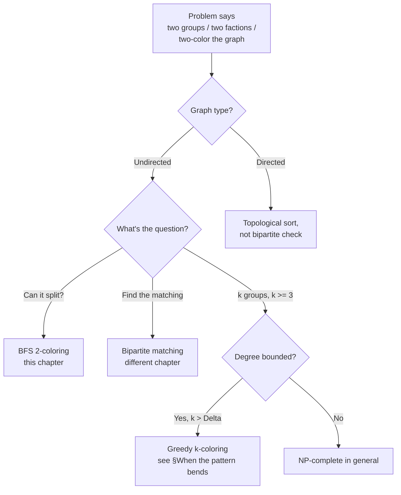
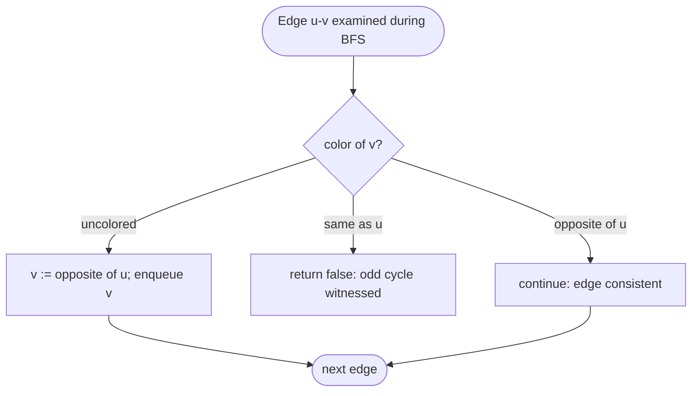
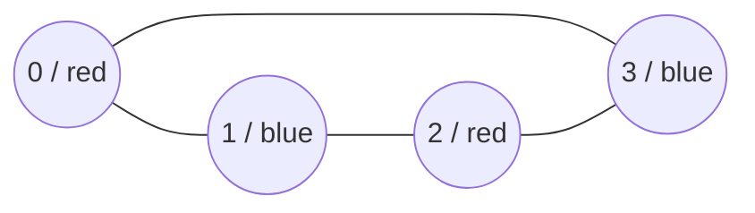
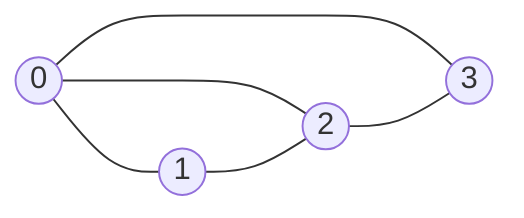

# Bipartite check

A four-node cycle: 0-1-2-3-0. Color node 0 red. Its neighbor 1 must be blue. Vertex 2, adjacent to 1, has to be red. Walking back to vertex 3, adjacent to 2, forces blue. The closing edge 3-0 lands across the partition. Every edge crosses; the graph is bipartite.

Now make it a triangle: 0-1-2-0. Color 0 red, 1 blue, 2 red. The closing edge is 0-2, both red. Two-coloring fails on the third edge. This graph is not bipartite, and the only thing wrong with it is the cycle's length: three is odd. That observation is the chapter.

## Locating this pattern



*The decision tree before reaching for code: bipartite check applies to undirected graphs asking for a 2-partition. Directed analogues route to [topological sort](./04-topological-sort-kahn.md); k-coloring with k ≥ 3 is a different problem.*

## Why the obvious approach wastes most of its work

The first instinct on bipartite check is to enumerate. Try every assignment of vertices to two sides. Reject the assignment if any edge stays inside one side. Return whether any assignment survives.

```python
# Brute force: O(2^n * E) — what we're replacing
def is_bipartite_brute(graph):
    n = len(graph)
    for mask in range(1 << n):
        # bit i of mask = which side vertex i is on
        ok = True
        for u in range(n):
            for v in graph[u]:
                if ((mask >> u) & 1) == ((mask >> v) & 1):
                    ok = False
                    break
            if not ok:
                break
        if ok:
            return True
    return False
```

Two reasons this is the wrong answer. First, the running time is exponential in n; LC 785's cap of n ≤ 100 already gives 2^100 assignments, more than the atoms in the visible universe. Second, the algorithm has no idea *why* an assignment fails. It just iterates.

The fix is a single pass that builds the partition while it walks. Color the first vertex either side, push it onto a queue, and for every edge you cross, paint the other endpoint the opposite color. If you ever see an edge whose endpoints are already painted the same color, give up: that edge is the proof no 2-coloring exists. If you finish the walk without a conflict, the colors you assigned *are* the partition.

The trick is that "no 2-coloring exists" has a much sharper characterization than the brute force suggests. **A graph is bipartite if and only if it has no odd-length cycle.**[^1] König proved this in 1916; the proof is short, the consequence is sweeping. BFS happens to detect odd cycles for free. When you walk a tree-like region, every edge points from one BFS level to the next, alternating colors trivially. The only way an edge can violate the alternation is to close a cycle, and the only cycles that violate are the odd ones, because in an even cycle the colors swap an even number of times and end where they started.

## The pattern

Two phases nested. The outer loop visits every vertex at least once so disconnected components don't slip through. For each starting vertex that hasn't been colored yet, run BFS and paint as you go.

```python
from collections import deque


def is_bipartite(graph):
    n = len(graph)
    color = [0] * n                       # 0 = unvisited, 1 / -1 = the two color classes
    for start in range(n):
        if color[start] != 0:
            continue                      # already painted by a prior component
        color[start] = 1
        q = deque([start])
        while q:
            u = q.popleft()
            for v in graph[u]:
                if color[v] == 0:
                    color[v] = -color[u]  # flip color across the edge
                    q.append(v)
                elif color[v] == color[u]:
                    return False          # same-color edge: odd cycle
    return True
```

**Solution** — Python ([Java](./07-bipartite-check/lc-785/sol.java) · [C++](./07-bipartite-check/lc-785/sol.cpp) · [Go](./07-bipartite-check/lc-785/sol.go))

```python
# LC 785. Is Graph Bipartite?
from collections import deque
from typing import List


def is_bipartite(graph: List[List[int]]) -> bool:
    """LC 785 — true iff `graph` admits a 2-coloring (no odd cycle)."""
    n = len(graph)
    color = [0] * n                       # 0 = unvisited, 1 / -1 = the two color classes
    for start in range(n):
        if color[start] != 0:
            continue                      # already painted by a prior component
        color[start] = 1
        q = deque([start])
        while q:
            u = q.popleft()
            for v in graph[u]:
                if color[v] == 0:
                    color[v] = -color[u]  # flip color across the edge
                    q.append(v)
                elif color[v] == color[u]:
                    return False          # same-color edge: odd cycle
    return True
```

Three things in the body deserve attention.

The colors are `1` and `-1`, not `0` and `1`. That choice lets `color[v] = -color[u]` flip the color in one operation; using `0` and `1` would force a `1 - color[u]` or a XOR with `1`, both of which read fine but make the "paint the opposite" intent slightly less direct. The third value, `0`, means "unvisited", and the test `color[v] == 0` gates BFS entry to vertices we haven't touched yet.

The decision at each edge is exactly three-way. The neighbor `v` is uncolored, in which case paint it the opposite of `u` and enqueue. Or `v` is already colored the opposite of `u`, in which case the edge is consistent and we move on. Or `v` is already colored the same as `u`, which is the only way the algorithm returns `false`.



*The decision the BFS body makes at every edge. The "same as u" branch is the only one that returns false; the other two keep BFS moving.*

The outer `for start in range(n)` loop is doing more work than it looks. LC 785's problem statement explicitly says "the graph may not be connected." If you BFS only from vertex 0 and stop, you'll miss components 1, 2, 3, ... and can falsely return `True` on a graph whose unvisited components contain odd cycles. The cost of the outer loop on a connected graph is zero (every later iteration trips the `continue` immediately), so there is no reason not to write it.[^2]

## Worked example: LC 785 on a 4-cycle and on a triangle

Take Example 2 from LC 785: `graph = [[1,3],[0,2],[1,3],[0,2]]`. That's the four-cycle 0-1-2-3-0 from the opening.



*The 4-cycle 0-1-2-3-0 admits a valid 2-coloring: {0, 2} red, {1, 3} blue. Every edge crosses the partition.*

Start at vertex 0. Color 0 red, push to queue. Pop 0, walk its neighbors: 1 is uncolored, so color it blue and push; 3 is uncolored, color blue, push. Pop 1, walk its neighbors: 0 is already red (opposite of 1, consistent); 2 is uncolored, color red, push. Pop 3, walk neighbors: 0 red (opposite, consistent); 2 red (opposite, consistent). Pop 2, walk neighbors: 1 blue, 3 blue, both consistent. Queue empty, no conflict. Return `True`.

Now take Example 1: `graph = [[1,2,3],[0,2],[0,1,3],[0,2]]`. There's a triangle hiding inside (vertices 0-1-2-0).



*Example 1 contains the triangle 0-1-2-0. No 2-coloring satisfies all edges.*

Start at vertex 0. Color 0 red, push. Pop 0, walk neighbors: 1 uncolored, color blue, push; 2 uncolored, color blue, push; 3 uncolored, color blue, push. Pop 1, walk neighbors: 0 red (opposite, fine); 2 *blue, same as 1*. Return `False`. The triangle's third edge fired the same-color check, exactly as König's theorem predicts.

## What it actually costs

| Variant | Time | Space | Notes |
|---|---|---|---|
| Best case (immediate odd cycle near root) | O(V + E) | O(V) | Early exit on first same-color edge; asymptotic worst-case dominates the bound. |
| Bipartite (whole graph traversed) | O(V + E) | O(V) | Inherits the BFS framework's O(V + E) bound from CLRS §20.2.[^3] |
| Constructing the partition (sets A, B) | O(V + E) | O(V) | The color array is the partition; no extra work. |
| Brute force | O(2^n · E) | O(n) | The wrong answer; what we replaced. |

The amortization argument is short. Every vertex is enqueued exactly once across all BFS runs (the `color[v] == 0` test gates the assignment). Every edge is examined twice, once from each endpoint in the undirected adjacency-list representation, and the per-edge work is one O(1) color comparison.[^3] The outer loop over disconnected components adds at most O(V) extra iterations across all components combined. Total: O(V) + O(2E) · O(1) = O(V + E). The bound is tight: a path on V vertices with V - 1 edges takes Θ(V + E) to certify bipartite, since every edge has to be checked.

## When the pattern bends

The two-color case is the special one. Its variants either swap BFS for DFS, change the input shape, or push past two colors entirely.

### DFS as an alternative

BFS and DFS both implement the same proof: an odd cycle exists if and only if 2-coloring fails. DFS uses recursion or an explicit stack; the body becomes "for each neighbor, recurse with the opposite color or check the existing color matches." The two algorithms produce different cycle witnesses when one is found. DFS's witness is the path on the recursion stack from `u` back to `v`, which interviewers sometimes ask for as a follow-up. The linear-time bound is the same.[^4] Pick BFS by default in Python: the recursion limit (1000 by default) blows on adversarially deep chains, and `sys.setrecursionlimit` is a workaround you'd rather not need.

### Edge-list input, 1-indexed

LC 886 *Possible Bipartition* takes `dislikes = [[1,2],[1,3],[2,4]]` and asks whether n people can be split into two groups so no disliked pair shares a group. The algorithm is unchanged once you build adjacency from the edge list. The trap is the 1-indexed input: people are numbered 1 to n, so `color = [0] * n` indexed at `color[n]` is out of bounds. Either size the array `n + 1` and ignore index 0 (cleaner), or convert to 0-indexed at ingest. Pick one; mixing them is how silent wrong-answers happen.[^5]

### k-coloring with k ≥ 3

The bipartite-check intuition does *not* extend. **3-coloring (and any k ≥ 3 chromatic-number decision) is NP-complete** in general; it's one of Karp's 21 original problems. LC 1042 *Flower Planting With No Adjacent* asks for 4-coloring on a graph with max degree 3, and looks at first like a generalization of bipartite check. It isn't. The problem is solvable in linear time for a different reason: with max degree 3, every vertex has at most three neighbors, so at least one of four colors is always unused on the neighborhood. A greedy single pass picks any unused color and moves on. The "guaranteed answer exists" line in the problem statement is a pre-cooked instance of [Brooks' theorem](https://en.wikipedia.org/wiki/Brooks%27_theorem) (chromatic number ≤ Δ for non-complete-non-odd-cycle graphs).[^6]

The lesson buried inside LC 1042 is the boundary. Bipartite check (Δ ≥ 1, k = 2) and degree-bounded greedy coloring (k > Δ) are both linear. Everything in between, graph k-coloring without degree bounds, is NP-complete. An odd cycle of any length needs three colors despite Δ = 2, which is the exact case Brooks' theorem carves out and the reason 2-coloring is special.

## Two pitfalls that bite

> [!WARNING]
> **Forgetting the outer loop over components.** The function returns `True` on a disconnected graph where one component contains an odd cycle, because BFS started from vertex 0 never reached the bad component. LC 785 is famous for catching this exact bug; its test set includes inputs where the official Example 1 is fully connected but the hidden cases are not. The four lines of outer loop cost nothing on connected inputs and are the difference between green and red on disconnected ones.

> [!WARNING]
> **Resetting the color array on each BFS start.** The instinct is to treat each component independently and zero out colors before each BFS. That re-enters already-painted vertices and either spirals into an infinite loop or quietly turns the algorithm quadratic. The color array is *shared* across components; the `if color[start] == 0` check is the only gate. Once a component is fully colored, its vertices stay colored for the rest of the run, which is exactly what makes the outer loop O(V) overhead instead of O(V²).

A third trap worth naming: conflating bipartite check with bipartite *matching*. They share a name and a graph type and almost nothing else. Bipartite check decides whether a 2-partition exists. Bipartite matching, given that one does, finds the largest set of edges with no shared endpoint. The matching problem is solved by Hopcroft-Karp or by max-flow, lives in a future chapter, and is not what an interviewer means when they hand you LC 785.

## Problem ladder

### CORE (solve all three to claim chapter mastery)

- [LC 785 — Is Graph Bipartite?](https://leetcode.com/problems/is-graph-bipartite/) [Medium] • bipartite-check ★
- [LC 886 — Possible Bipartition](https://leetcode.com/problems/possible-bipartition/) [Medium] • bipartite-check
- [LC 1042 — Flower Planting With No Adjacent](https://leetcode.com/problems/flower-planting-with-no-adjacent/) [Easy] • graph-coloring

### STRETCH (optional)

- [LC 684 — Redundant Connection](https://leetcode.com/problems/redundant-connection/) [Medium] • cycle-detection (free mirror of the Premium *Graph Valid Tree*)

LC 785 is the chapter's signature problem (★) and the one the worked example walks through. LC 886 is the same algorithm under a different name; the build-the-graph step and the 1-indexed handling are the only new work. LC 1042 is the Easy slot through the adjacent-pattern door: not 2-coloring, but the same paint-and-traverse skeleton, and a useful boundary marker for where the technique stops applying.

There is no canonical Hard for this chapter, and that's an honest gap, not a curation choice. The natural Hard variants of bipartite-check drift into bipartite *matching* (König via max-flow, future chapter), odd cycle *transversal* (NP-complete), or edge bipartization (NP-complete). LC's Hard graph problems that touch this territory teach genuinely different algorithms.

## Where this leads

[Cycle detection](./06-cycle-detection-graphs.md) is the dual: bipartite check IS odd-cycle detection, dressed in different vocabulary, and the chapter on cycles formalizes the relationship. [Union-Find](./08-union-find.md) supports the online variant where edges arrive one at a time and you report bipartiteness after each insertion; the technique is "Union-Find with parity," a parent-edge bit that tracks whether the path from a node to its representative is even or odd in length. The matching problem (find the largest set of edges with no shared endpoint, given that the graph is bipartite) waits for the network-flow chapter.

## References

[^1]: Wikipedia contributors, "Bipartite graph," English Wikipedia, §"Properties — Characterization", <https://en.wikipedia.org/wiki/Bipartite_graph>.

[^2]: LeetCode 785, *Is Graph Bipartite?*, problem statement: "There is an undirected graph with n nodes... The graph may not be connected, meaning there may be two nodes u and v such that there is no path between them." Verified via the leetcodethehardway.com mirror at <https://leetcodethehardway.com/solutions/0700-0799/is-graph-bipartite-medium>.

[^3]: T. H. Cormen, C. E. Leiserson, R. L. Rivest, C. Stein, *Introduction to Algorithms*, 4th ed., MIT Press, 2022, Chapter 20 §20.2 (Breadth-first search), Theorem 20.1 — BFS runs in O(V + E) on adjacency-list input.

[^4]: R. Sedgewick, *Algorithms in Java, Part 5: Graph Algorithms*, 3rd ed., Addison Wesley, 2004, pp. 109–111 (DFS-based bipartite test). Cited via the LC discuss reference template "Graph coloring using BFS," <https://leetcode.com/discuss/interview-question/1992272/graph-coloring-using-bfs>.

[^5]: P.-Y. Chen (walkccc), *LeetCode Solutions* — LC 886 reference, <https://walkccc.me/LeetCode/problems/0886/>.

[^6]: Wikipedia contributors, "Brooks' theorem," <https://en.wikipedia.org/wiki/Brooks%27_theorem>.
