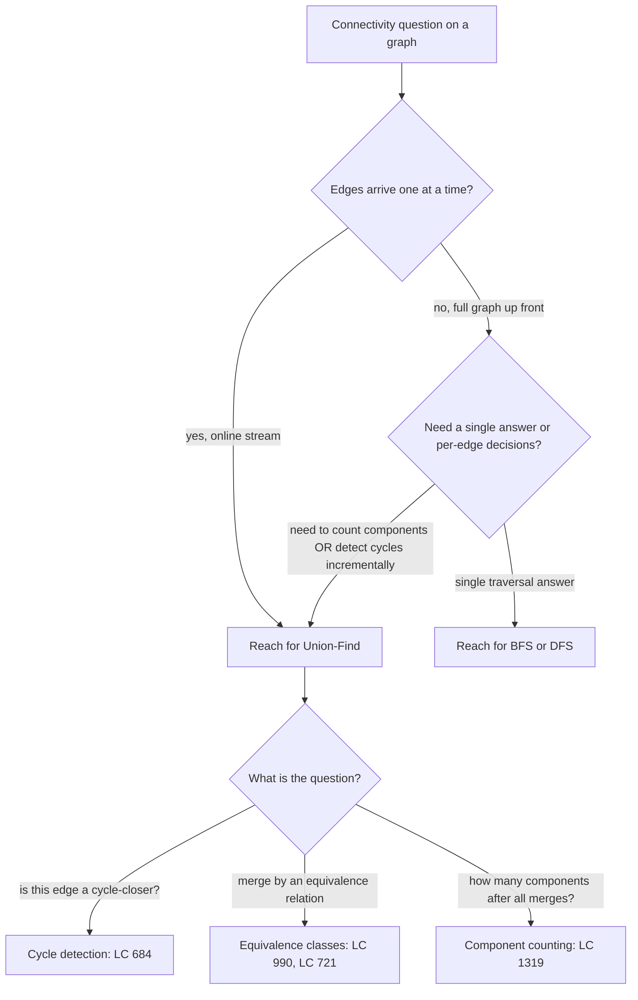
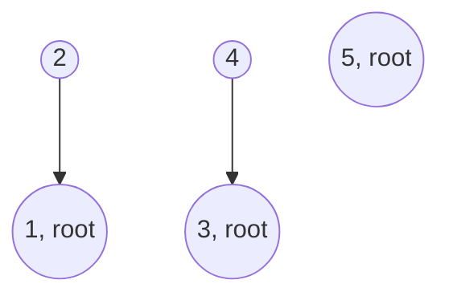

# Union-Find: parent forests, path compression, and union by rank

Take the edges `[[1, 2], [1, 3], [2, 3]]` and ask whether the third one closes a cycle. Drawn on paper the answer is obvious: nodes 2 and 3 reach each other through 1, so adding the edge `(2, 3)` shuts the loop. Now ask the same question on a million edges streaming in one at a time, with the requirement that you flag the cycle-closer the moment it arrives. A full BFS or DFS on every edge gives you `O(m²)` work, and the millionth query times out. The right answer was published by Bernard Galler and Michael Fischer in 1964 and tightened by Robert Tarjan in 1975, and forty years later it still runs in what every textbook calls "amortized constant time."

The data structure has one job: maintain a partition of `n` items into disjoint sets and answer two questions fast. Are these two items in the same set, and if not, merge their two sets. That's it. The interview tell is the word *online* or any phrasing of the form *"for each edge, do something."* When the connectivity question arrives one edge at a time with a query interleaved between additions, reach for Union-Find. When you have the whole graph up front and want to traverse it once, reach for BFS or DFS instead.

The structure is small enough that an interviewer can ask you to write it from scratch in ten minutes, and the whole chapter rests on a stack of three claims that are easy to state and surprisingly subtle to defend. A naive parent-pointer forest gives you `O(n)` per operation. Adding union by rank brings that to `O(log n)`. Adding path compression on top brings it to `O(α(n))`, where `α` is the inverse Ackermann function and `α(n) ≤ 4` for any `n` you can write down. The proof is from Tarjan's 1975 paper in the *Journal of the ACM*[^4], and the structure has not been beaten since[^1][^5].

## Locating this pattern

Three concrete problem shapes trigger Union-Find. Knowing which shape you have decides which framing to use:



*Caption: Online-vs-batch is the discriminator. BFS and DFS work when you can scan the whole graph once; Union-Find earns its place when the queries interleave with the merges.*

The three downstream branches share the same data structure and differ only in what they observe at the end. Cycle detection answers with the first edge that fails to merge two distinct sets. Equivalence-class building answers by walking every element and asking what its representative is. Component counting answers with the number of distinct representatives.

## What we're building

A Union-Find (also called a Disjoint Set Union, or DSU) maintains a partition of `n` elements into disjoint sets. It exposes three operations[^1][^2]:

- `make_set(x)` initializes the singleton set `{x}`. Most implementations bake this into the constructor by initializing every element as its own root.
- `find(x)` returns the representative of the set containing `x`. Two elements are in the same set if and only if their `find` results agree.
- `union(x, y)` merges the two sets containing `x` and `y`. If they were already the same set, it does nothing and reports that fact.

The implementation is one parent-pointer forest. Each set is stored as a tree whose root represents the entire set; every other element points at its parent. The integer array `parent[i]` holds the parent of element `i`, with the convention that a root points at itself: `parent[root] == root`. There are no child pointers, no edges-list, no auxiliary structure. One array.



*Caption: After unions of (1, 2) and (3, 4), the forest holds two depth-1 trees plus a singleton at 5. `parent = [_, 1, 1, 3, 3, 5]` using 1-indexed slots; the underscore is the unused parent[0] slot.*

`find(x)` is a walk up parent pointers until you reach a node whose parent is itself. `union(x, y)` is two finds plus one parent-pointer rewire. So far the data structure is one array and two short loops.

## Quick-find: the wrong answer first

Before the heuristics, consider the simplest possible implementation, the one Sedgewick teaches first to make the cost of doing nothing visible[^6]. Skip the parent-pointer forest entirely. Use a flat array where `id[i]` is the set's representative directly, no walking required:

```python
# Quick-find: O(1) find, O(n) union — what we're replacing
class QuickFind:
    def __init__(self, n):
        self.id = list(range(n))

    def find(self, x):
        return self.id[x]                  # O(1)

    def union(self, x, y):
        rx, ry = self.id[x], self.id[y]
        if rx == ry:
            return False
        for i in range(len(self.id)):      # O(n) per union
            if self.id[i] == rx:
                self.id[i] = ry
        return True
```

The find is constant time, which sounds great until you trace a sequence of `n` unions. Each one rewrites up to `n` entries; the whole sequence is `O(n²)`. On the LC 684 input size of 1,000 edges that's a million operations, which is fine; on a million-edge stream that's a trillion, which is the difference between an interview pass and a TLE.

The fix is the parent-pointer forest. Each `union` rewires exactly one pointer instead of scanning the whole array. The cost moves into `find`, which now walks up the tree instead of returning a cached answer. Whether that walk is short or long is the entire game.

## The forest, the find, the union

Here is the unoptimized version, the one that comes out of an interview if you forget the heuristics. `find` walks up parents to the root; `union` finds both roots and points one at the other:

```python
class DSU:
    def __init__(self, n):
        self.parent = list(range(n))           # every element starts as its own root

    def find(self, x):
        while self.parent[x] != x:             # walk up to the root
            x = self.parent[x]
        return x

    def union(self, x, y):
        rx, ry = self.find(x), self.find(y)
        if rx == ry:
            return False                       # already same set
        self.parent[ry] = rx                   # arbitrary attachment
        return True
```

This works, in the sense that it produces correct answers. The trouble is the line `self.parent[ry] = rx`. Always attaching the second root under the first looks innocent, but feed it the adversarial sequence `union(0, 1), union(1, 2), union(2, 3), ...` and the tree degenerates into a linked list: a chain of length `n`. Now every `find` is `O(n)`, and the running time is back to `O(n²)`. Path compression alone won't save you either; the chain is built on the *union* side, before any find ever runs[^12].

Two changes fix this. The first decides which way to attach during `union`. The second flattens the tree during `find`.

## Two heuristics that change the bound

Both heuristics are local. Both add a few lines. Together they take the cost from quadratic to amortized constant.

### Path compression: flattening on the way up

When `find(x)` walks from `x` to the root through some chain of intermediates, every one of those intermediates already knows the answer the moment the walk completes. Why make the next call do the same walk? Rewire each visited node directly to the root on the way back down. The next find on any of them is one hop[^1][^2].

The recursive form is the cleanest expression of the idea: `find` returns the root, and on the return path it overwrites `parent[x]` with that root.

```python
def find(self, x):
    if self.parent[x] != x:
        self.parent[x] = self.find(self.parent[x])    # the rewire
    return self.parent[x]
```

After one `find(4)` on the chain `4 → 3 → 2 → 1`, the parent pointers are `parent[4] = 1`, `parent[3] = 1`, `parent[2] = 1`. The tree's depth dropped from 4 to 1 in a single call. The next find on any of these four nodes is one step.

The iterative two-pass form does the same work without recursion, which matters when the tree is deep enough to overflow Python's 1,000-frame stack or C++'s default 8 MB stack. Walk to the root, then walk again from the original node and reset every parent pointer:

```python
def find(self, x):
    # Pass 1: locate the root.
    root = x
    while self.parent[root] != root:
        root = self.parent[root]
    # Pass 2: rewire every node on the path.
    while self.parent[x] != root:
        next_x = self.parent[x]
        self.parent[x] = root
        x = next_x
    return root
```

For chapter-scale inputs (LC 684 caps `n` at 1,000) the recursive form is fine. For competitive-programming or production use at `n ≥ 10⁵`, the iterative form is the one to ship. CP-Algorithms documents both and notes that the iterative version uses constant scratch memory while the recursive form costs `O(path_length)` stack frames per call[^2].

Path halving and path splitting are one-pass alternatives that retain the same amortized bound. Halving rewires every other parent on the find-path to its grandparent; splitting does the same to every parent. Either one is fine; full compression is what every textbook teaches first[^1].

### Union by rank: keeping the tree shallow

Path compression flattens after the fact. The other heuristic prevents the chain from forming in the first place. During `union`, when merging two trees, attach the shorter tree under the taller one's root. The merged tree's height is then the larger of the two heights, instead of one plus the height of the merged-under tree.

The bookkeeping is one extra integer per element, called `rank`. Initially every element has rank 0. The merge rule is:

1. Compare the ranks of the two roots.
2. Attach the lower-rank root under the higher-rank root.
3. If the ranks are equal, attach either way and bump the new root's rank by one.

Rank is an upper bound on tree height after the heuristics interact[^1]. It is not the exact height; path compression can shrink a tree without lowering its rank, which is a subtlety that becomes important in the proof but never in the implementation. The rule for updating `rank` only fires on the equal-rank case because that is the only case where the merged tree's height could actually grow.

```python
def union(self, x, y):
    rx, ry = self.find(x), self.find(y)
    if rx == ry:
        return False
    # Attach the lower-rank root under the higher-rank root.
    if self.rank[rx] < self.rank[ry]:
        rx, ry = ry, rx
    self.parent[ry] = rx
    if self.rank[rx] == self.rank[ry]:
        self.rank[rx] += 1
    return True
```

Used alone, union by rank gives an `O(log n)` bound per operation. The proof is short: a rank-`r` root has at least `2^r` descendants[^1], so a tree with `n` nodes has rank at most `log₂ n`, and a find walks at most that many parent pointers.

Combined with path compression, the bound collapses further to inverse Ackermann. That collapse is the next section.

Union by size is an equally valid alternative that tracks subtree size instead of rank and merges the smaller tree under the larger. Same `O(α(n))` bound, slightly different bookkeeping[^1][^2]. CLRS teaches union by rank because it interacts more cleanly with the proof[^3]; Sedgewick teaches union by size because the reasoning is intuitive ("the bigger component absorbs the smaller")[^6]. Pick one and stay consistent. This chapter uses rank because it matches CLRS Chapter 19's presentation[^3].

## Putting it all together

The canonical Union-Find class is twenty lines. Every line above the dotted return statement is one of the two heuristics; the rest is bookkeeping.

```python
class DSU:
    def __init__(self, n):
        self.parent = list(range(n + 1))      # 1-indexed; parent[0] unused
        self.rank = [0] * (n + 1)

    def find(self, x):
        if self.parent[x] != x:
            self.parent[x] = self.find(self.parent[x])
        return self.parent[x]

    def union(self, x, y):
        rx, ry = self.find(x), self.find(y)
        if rx == ry:
            return False
        if self.rank[rx] < self.rank[ry]:
            rx, ry = ry, rx
        self.parent[ry] = rx
        if self.rank[rx] == self.rank[ry]:
            self.rank[rx] += 1
        return True


def find_redundant_connection(edges):
    """LC 684: process edges left to right; return the first one whose
    endpoints already share a root."""
    n = len(edges)
    dsu = DSU(n)
    for u, v in edges:
        if not dsu.union(u, v):
            return [u, v]
    return []
```

**Solution** — Python ([Java](./08-union-find/lc-684/sol.java) · [C++](./08-union-find/lc-684/sol.cpp) · [Go](./08-union-find/lc-684/sol.go))

```python
# LC 684. Redundant Connection
from typing import List


class DSU:
    def __init__(self, n: int) -> None:
        self.parent = list(range(n + 1))  # 1-indexed; parent[0] unused
        self.rank = [0] * (n + 1)

    def find(self, x: int) -> int:
        # Path compression (recursive two-pass).
        if self.parent[x] != x:
            self.parent[x] = self.find(self.parent[x])
        return self.parent[x]

    def union(self, x: int, y: int) -> bool:
        rx, ry = self.find(x), self.find(y)
        if rx == ry:
            return False  # already connected; would form a cycle
        # Union by rank: attach shorter tree under taller root.
        if self.rank[rx] < self.rank[ry]:
            rx, ry = ry, rx
        self.parent[ry] = rx
        if self.rank[rx] == self.rank[ry]:
            self.rank[rx] += 1
        return True


def find_redundant_connection(edges: List[List[int]]) -> List[int]:
    """LC 684: return the edge that, if removed, leaves a tree.
    If multiple, return the one occurring last in the input."""
    n = len(edges)  # n nodes, n edges (one extra)
    dsu = DSU(n)
    for u, v in edges:
        if not dsu.union(u, v):
            return [u, v]
    return []
```

The driver function is three lines and is the core of LC 684. Process each edge in order; the first call to `union` that returns `False` is announcing that the edge's two endpoints already share a root, which means the path between them already exists, which means the new edge closes a cycle. Stop and return that edge. If you walk the whole list without a redundancy, the input is already a tree; return the empty answer.

A single instinct is worth naming explicitly because it traps the reader who has just seen LC 684's directed sibling: comparing parent pointers instead of roots. `parent[u] == parent[v]` is wrong because two nodes can share a root without sharing an immediate parent. Always call `find` on both sides before comparing.

## Worked example: redundant connection

The cleanest input for watching the data structure work is five nodes and five edges, the last of which closes a cycle:

```text
n = 5
edges = [(1, 2), (3, 4), (2, 3), (1, 5), (4, 5)]
expected_redundant = [4, 5]
```

The first edge `(1, 2)` finds two roots at rank 0; one wins arbitrarily, the other attaches under it, and the winner's rank bumps to 1. The second edge `(3, 4)` does the same on a parallel pair, leaving the forest as two depth-1 trees and one singleton at 5. The interesting moment is the third edge.

> **Interactive widget:** [Union-Find: parent forest with path compression and union by rank](../widgets/w-28-union-find.yml) (panel `default`) — rendered on the website; the YAML spec describes the keyframes.

*Static fallback: a 23-step trace on the canonical input. Step 12 is the equal-rank merge that builds the chapter's first depth-2 tree. Step 18 is the headline frame: `find(4)` walks `4 → 3 → 1`, and on the return path, path compression rewires `parent[4]` from 3 directly to 1. Step 21 is the cycle detection: both endpoints of `(4, 5)` resolve to root 1, so the edge is rejected as redundant.*

Step 18 is the moment to watch twice. Before that step, the tree under root 1 has depth 2: nodes 2 and 5 are at depth 1, and node 4 lives at depth 2 through node 3. After step 18, every non-root in the tree points directly at 1. The next find on any of the four children is one parent-pointer dereference. That is the working definition of "amortized constant" — not that every operation is fast, but that an expensive operation (the depth-2 walk at step 18) pays for the cheaper future operations it enables.

The animation also surfaces the negative case. Toggle the `compression: off` preset and step 18's flatten disappears; the next find on the same depth-2 chain walks the same two hops every single time. Toggle `union_by: none` and the trees never balance during construction; on a sorted-input chain of `n` unions the tree builds into a linked list, and find degrades to `O(n)` before compression has a chance to help. Both heuristics are doing real work; either one alone is not enough.

## What it actually costs

| Variant | Time per op (amortized) | Space | Source |
|---|---|---|---|
| Quick-find | `O(n)` for `union`, `O(1)` for `find` | `O(n)` | Sedgewick algs4 §1.5[^6] |
| Quick-union (no rank, no compression) | `O(n)` worst case | `O(n)` | [^1] |
| Union by rank only | `O(log n)` | `O(n)` | rank-`r` root has ≥ `2^r` descendants[^1] |
| Path compression only | `O((1 + log_{2+f/n} n))` per find on average | `O(n)` | [^1] |
| **Union by rank + path compression** | **`O(α(n))` amortized** | `O(n)` | **Tarjan 1975[^4]** |
| Lower bound (any pointer-machine algorithm) | `Ω(α(n))` amortized | — | Tarjan 1979[^5] |

The two amortized bounds at the top of the table are the two failure modes you avoid by combining the heuristics. Quick-find pushes all the cost into `union`; the parent-pointer forest pushes it into `find`. The combined data structure spreads it everywhere and the worst case never lands.

### Why operations average to inverse-Ackermann

Tarjan's 1975 paper establishes the bound that gives the chapter its punchline. Any sequence of `m` `find` and `union` operations on `n` elements, using union by rank combined with path compression, runs in `O(m · α(n))` total time, where `α(n)` is the inverse Ackermann function[^4]. A 1979 follow-up by Tarjan proved that this is also the lower bound: no pointer-machine algorithm can do better[^5]. So this is not a stepping stone toward a tighter bound; this is the answer.

Tarjan's argument is about rank classes. Group every node by the bucket its rank falls into, where the buckets are defined by the iterated tower-of-twos function. A node's rank can grow as new unions occur, but it can only grow logarithmically in the number of descendants the node accumulates, so the number of nodes in each bucket falls geometrically. Each find traverses some nodes whose rank is in the same bucket as their parent's, plus at most one bucket-crossing edge per pass. The bucket-crossing edges sum to `O(α(n))` per find by definition of the bucketing. The within-bucket traversals get charged to the nodes themselves via path compression, which guarantees every node's parent's rank strictly increases each time a find passes through it; over the entire sequence of operations, each node can only be charged `O(α(n))` times before its parent's rank exceeds its own bucket's ceiling and the charge moves up. Total work: `O(m · α(n))`[^4].

The function `α(n)` grows so slowly that calling it constant is barely a lie. Wikipedia and CP-Algorithms both note that `α(n) ≤ 4` for any `n` up to roughly `2^65535`, a number with more digits than there are atoms in the observable universe[^1][^2]. For every `n` you will write, type, allocate, or imagine, every Union-Find operation is constant time by any reasonable interpretation.

A simpler bound, `O(m · log* n)` using the iterated logarithm, was proved by Hopcroft and Ullman in 1973 and stood as the best known until Tarjan tightened it two years later[^1]. The chapter quotes Tarjan's bound because it is tight; the historical bound matters only as the chronology that makes it clear why `α(n)` was a surprising answer at the time.

## Two more places this pattern shows up

LC 684 is the cleanest entry point because the question maps directly onto `union` returning `false`. Two other classics adapt the same data structure to subtler queries.

### LC 990: equality and inequality, two passes

The problem hands you a list of equations like `["a==b", "b!=c", "c==a"]` and asks whether they can all be simultaneously true. The way to read this is that `==` is an equivalence relation: reflexive, symmetric, transitive. Every `==` constraint is a `union`. Every `!=` constraint is a query that the two endpoints land in different sets[^8].

The trick is that the order of the equations in the input is misleading. You cannot process them left to right because a later `==` can connect two variables that an earlier `!=` has not yet been asked about. Two passes:

```python
def equations_possible(equations):
    dsu = DSU(26)
    for eq in equations:
        if eq[1] == "=":
            dsu.union(ord(eq[0]) - ord("a"), ord(eq[3]) - ord("a"))
    for eq in equations:
        if eq[1] == "!":
            if dsu.find(ord(eq[0]) - ord("a")) == dsu.find(ord(eq[3]) - ord("a")):
                return False
    return True
```

```python
# LC 990. Satisfiability of Equality Equations
# Two-pass: first union all '==' equations; then for each '!=', check the
# two endpoints have different roots. If any '!=' has equal roots, return False.
from typing import List


class DSU:
    def __init__(self, n: int) -> None:
        self.parent = list(range(n))
        self.rank = [0] * n

    def find(self, x: int) -> int:
        if self.parent[x] != x:
            self.parent[x] = self.find(self.parent[x])
        return self.parent[x]

    def union(self, x: int, y: int) -> bool:
        rx, ry = self.find(x), self.find(y)
        if rx == ry:
            return False
        if self.rank[rx] < self.rank[ry]:
            rx, ry = ry, rx
        self.parent[ry] = rx
        if self.rank[rx] == self.rank[ry]:
            self.rank[rx] += 1
        return True


def equations_possible(equations: List[str]) -> bool:
    """LC 990: return True iff the equations can be simultaneously satisfied."""
    dsu = DSU(26)  # 26 lowercase letters as node ids
    # Pass 1: unify all variables connected by '=='.
    for eq in equations:
        if eq[1] == "=":
            dsu.union(ord(eq[0]) - ord("a"), ord(eq[3]) - ord("a"))
    # Pass 2: every '!=' must have endpoints in different sets.
    for eq in equations:
        if eq[1] == "!":
            if dsu.find(ord(eq[0]) - ord("a")) == dsu.find(ord(eq[3]) - ord("a")):
                return False
    return True
```

Pass one builds every equivalence class the equations require. Pass two checks every inequality against the resulting partition. If any `!=` finds its two variables in the same class, the equations contradict themselves and the answer is `False`. Total work is `O(n · α(26))`, which the constant factor reduces to plain `O(n)`. The data structure is the same `DSU` class as before; only the driver changes.

### LC 721: when the keys are strings

Up to this point, every set element has been an integer, indexed directly into the parent array. LC 721 hands you a list of accounts, each a name followed by some emails, and asks you to merge any two accounts that share at least one email[^9]. The natural element to put in the data structure is the email, which is a string.

The fix is to swap the array out for a hash map and write `make_set` explicitly to handle first sightings. The find and union logic does not change at all; the parent map is a `dict[str, str]` instead of a `list[int]`:

```python
def accounts_merge(accounts):
    dsu = DSU()
    email_to_name = {}
    for account in accounts:
        name = account[0]
        first = account[1]
        dsu.make(first)
        email_to_name[first] = name
        for email in account[2:]:
            dsu.make(email)
            email_to_name[email] = name
            dsu.union(first, email)
    groups = defaultdict(list)
    for email in email_to_name:
        groups[dsu.find(email)].append(email)
    return [[email_to_name[root]] + sorted(emails) for root, emails in groups.items()]
```

```python
# LC 721. Accounts Merge
# String-keyed Union-Find: parent map is dict[str, str]. Each email is a
# node; for each account, union all of its emails into one set; finally
# group emails by their find-root and re-attach the owner name.
from typing import List
from collections import defaultdict


class DSU:
    def __init__(self) -> None:
        self.parent: dict = {}
        self.rank: dict = {}

    def make(self, x: str) -> None:
        if x not in self.parent:
            self.parent[x] = x
            self.rank[x] = 0

    def find(self, x: str) -> str:
        if self.parent[x] != x:
            self.parent[x] = self.find(self.parent[x])
        return self.parent[x]

    def union(self, x: str, y: str) -> None:
        rx, ry = self.find(x), self.find(y)
        if rx == ry:
            return
        if self.rank[rx] < self.rank[ry]:
            rx, ry = ry, rx
        self.parent[ry] = rx
        if self.rank[rx] == self.rank[ry]:
            self.rank[rx] += 1


def accounts_merge(accounts: List[List[str]]) -> List[List[str]]:
    """LC 721: merge accounts that share at least one email; return the
    merged accounts with each email list sorted, owner name first."""
    dsu = DSU()
    email_to_name: dict = {}

    for account in accounts:
        name = account[0]
        first = account[1]
        dsu.make(first)
        email_to_name[first] = name
        for email in account[2:]:
            dsu.make(email)
            email_to_name[email] = name
            dsu.union(first, email)

    groups: dict = defaultdict(list)
    for email in email_to_name:
        groups[dsu.find(email)].append(email)

    return [[email_to_name[root]] + sorted(emails) for root, emails in groups.items()]
```

The pattern is the same shape as LC 990: pass one runs the unions while reading the input; pass two derives the answer by walking every element and asking what its representative is. The string-keyed variant adds a `dict` lookup per `find` call, so the bound is `O(n · k · α(n))` where `k` is the longest account; in practice the hash factor is constant and the data structure is still effectively linear.

The `make_set` step is the one easy thing to miss. With integer keys, the constructor pre-fills `parent[i] = i` for every legal index, so every element starts as a root automatically. With string keys, every email needs an explicit `make` call when it first appears, or `find` raises a `KeyError` on its first lookup[^9].

## Where readers go wrong

> [!WARNING]
> **Skipping union by rank turns Union-Find into a quadratic algorithm.** Path compression alone is not enough. The adversarial sequence `union(0, 1), union(1, 2), union(2, 3), ..., union(n-2, n-1)` builds a chain of length `n` if every union one-sidedly attaches the second root under the first; compression only fires after a find, and on this construction sequence no find runs until the chain is built[^12]. Always compare ranks (or sizes) and attach the shorter tree under the taller. The dev.to LC 684 explainer explicitly notes that "this question is only Medium if you know how to use Union-Find with union by rank"[^12].

> [!WARNING]
> **Comparing immediate parents instead of roots.** The line `if parent[x] == parent[y]: return False` fails on any tree of depth ≥ 2: two cousins can share a root through a longer chain while having different immediate parents. The connectivity test is *always* `find(x) == find(y)`, which forces the walk to the root before the comparison.

> [!WARNING]
> **Recursive `find` overflowing the stack on `n ≥ 10⁵`.** Python's default recursion limit is 1,000 frames; C++'s default 8 MB stack tops out at roughly the same depth for typical frame sizes. LC 684's `n ≤ 1000` is well within bounds, but transferring the same code to a competitive-programming or MST workload at `n = 10⁶` will crash the interpreter or segfault the binary before the algorithm has a chance to run. The two-pass iterative form (walk to the root, then re-walk and rewire) uses constant scratch memory and has the same `O(α(n))` bound[^2].

> [!WARNING]
> **Counting components by reading `parent` directly.** After a series of unions, `len(set(parent))` undercounts the components: a node that was unioned into a deeper tree may still hold a stale parent pointer that points at an intermediate, not at the root. The actual component count is `len({find(i) for i in range(n)})` — derive every root explicitly, then count[^10]. Wikipedia spells out the underlying invariant: "once a node becomes a child, its rank is never accessed again," and the same is true of intermediate parent pointers[^1].

## Problem ladder

### CORE (solve all three to claim chapter mastery)

- [LC 684 — Redundant Connection](https://leetcode.com/problems/redundant-connection/) [Medium] • union-find-cycle-detection ★
- [LC 685 — Redundant Connection II](https://leetcode.com/problems/redundant-connection-ii/) [Hard] • union-find-directed-twist *(reference: Python only)*
- [LC 990 — Satisfiability of Equality Equations](https://leetcode.com/problems/satisfiability-of-equality-equations/) [Medium] • union-find-equivalence-classes *(reference: Python only)*

### STRETCH (optional)

- [LC 721 — Accounts Merge](https://leetcode.com/problems/accounts-merge/) [Medium] • union-find-string-keyed *(reference: Python only)*
- [LC 1319 — Number of Operations to Make Network Connected](https://leetcode.com/problems/number-of-operations-to-make-network-connected/) [Medium] • union-find-component-count

LC 685 is the directed sibling of LC 684 and the chapter's hardest problem. The case-split is non-trivial: a node may have two parents, the graph may have a cycle, both, or just a cycle. The data structure is the same; what changes is a pre-scan for any node with in-degree 2, after which the algorithm runs LC 684's logic over a carefully chosen subset of edges. Algomap's explainer documents the case-split[^7].

## Where this leads

The natural follow-up is [Kruskal's minimum spanning tree](./11-mst-kruskal.md), where Union-Find becomes the engine that prevents cycles inside a sorting-driven greedy: process edges in weight order, accept each edge if and only if `union` returns `true`. The chapter you just read is the data structure; Kruskal is the algorithm built on top of it[^4][^11]. The contrast chapter, [Prim's minimum spanning tree](./12-mst-prim.md), uses a frontier-driven heap instead and never invokes Union-Find; reading the two chapters back to back is the cleanest way to feel the difference between an edge-sorted greedy and a vertex-frontier greedy on the same problem.

The DFS-based framing of cycle detection on undirected and directed graphs lives in [Cycle detection in graphs](./06-cycle-detection-graphs.md), which cites this chapter as the alternative whenever the graph arrives one edge at a time. For the connected-components question on a fully assembled graph, [Connected components and flood fill](./03-connected-components.md) teaches the BFS and DFS framings; this chapter is what you reach for when the graph builds itself incrementally.

## References

[^1]: *Disjoint-set data structure*, Wikipedia, last edited 13 April 2026. <https://en.wikipedia.org/wiki/Disjoint-set_data_structure>.

[^2]: *Disjoint Set Union*, CP-Algorithms, last update 29 March 2026. <https://cp-algorithms.com/data_structures/disjoint_set_union.html>.

[^3]: Cormen, Leiserson, Rivest, Stein, *Introduction to Algorithms*, 4th ed., MIT Press, 2022.

[^4]: R. E. Tarjan, "Efficiency of a Good But Not Linear Set Union Algorithm," *Journal of the ACM*, vol. 22, no. 2, pp. 215–225, April 1975. DOI: <https://doi.org/10.1145/321879.321884>.

[^5]: R. E. Tarjan, "A class of algorithms which require non-linear time to maintain disjoint sets," *Journal of Computer and System Sciences*, vol. 18, no. 2, pp. 110–127, 1979. DOI: <https://doi.org/10.1016/0022-0000(79)90042-4>.

[^6]: R. Sedgewick and K. Wayne, *Algorithms*, 4th ed., Addison-Wesley, 2011. Section 1.5 "Case Study: Union-Find." Reference implementations (`QuickFindUF.java`, `QuickUnionUF.java`, `WeightedQuickUnionUF.java`, `QuickUnionPathCompressionUF.java`) at <https://algs4.cs.princeton.edu/15uf/>.

[^7]: *Redundant Connection II*, algomap.io. <https://algomap.io/problems/redundant-connection-ii>.

[^8]: J. Plank, *"Satisfiability of Equality Equations,"* University of Tennessee Knoxville CS class notes. <https://web.eecs.utk.edu/~jplank/topcoder-writeups/Leetcode/Satisfiability-of-Equality-Equations/index.html>.

[^9]: *721. Accounts Merge*, walkccc.me. <https://walkccc.me/LeetCode/problems/721/>.

[^10]: *1319. Number of Operations to Make Network Connected*, walkccc.me. <https://walkccc.me/LeetCode/problems/1319/>.

[^11]: *Minimum Spanning Tree — Kruskal with Disjoint Set Union*, CP-Algorithms. <https://cp-algorithms.com/graph/mst_kruskal_with_dsu.html>.

[^12]: *684. Redundant Connection*, dev.to (samuelhinchliffe), 14 July 2022. <https://dev.to/samuelhinchliffe/684-redundant-connection-33i5>.
