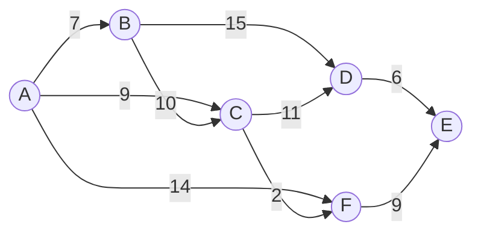

# Dijkstra's shortest-path algorithm

Six cities. Nine roads with non-negative drive times. The signal leaves city A and propagates along every outgoing road in lockstep, taking the road's weight in seconds to cross. The question is when the last city hears the signal. Brute force enumerates every simple path from A to every other city and minimizes; on a six-vertex graph that's already thousands of paths, and on the LC 743 input bound of a 100-vertex graph it's astronomical.

The algorithm in this chapter does the same job in `O((V + E) log V)`. It was published in 1959 by Edsger W. Dijkstra in three pages of *Numerische Mathematik*[^5], and the modern implementation is shorter than the proof of its correctness.[^1] The trick is a single invariant: when you extract the smallest tentative distance from a priority queue, *that distance is final*. No future relaxation can improve it. The proof is one paragraph, the algorithm is one loop, and getting it wrong in interview rotation costs you the round.

> [!IMPORTANT]
> Dijkstra requires every edge weight to be non-negative. With even one negative edge, the algorithm silently returns wrong answers, no exception, no warning. The settled-once invariant breaks because a later detour through a negative edge can improve a vertex you already finalized. If any edge can be negative, jump to [Bellman-Ford and negative cycles](./10-bellman-ford.md).

## What it is

Dijkstra's algorithm computes the shortest path from a single source vertex to every other vertex in a weighted directed graph, provided every edge weight is non-negative. The output is an array `dist[]` where `dist[v]` is the cost of the shortest path from the source to `v`, or infinity if `v` is unreachable.

The algorithm reads as BFS with a priority queue instead of a FIFO queue. [BFS](./01-bfs.md) computes shortest paths when every edge has weight 1; the FIFO queue happens to dequeue vertices in non-decreasing order of distance because every step adds exactly 1. Dijkstra generalizes that to arbitrary non-negative weights by replacing the FIFO with a min-priority queue keyed on tentative distance. The pop-the-smallest order is no longer a free side-effect of the queue's discipline; it's the data-structure's defining contract.

## The operations

Five primitives drive the algorithm. Each one shows up explicitly in the §2 reference. Read the operations once before reading the loop; the loop is the orchestration.

### Initialize

`dist[source] = 0`, every other `dist[v] = INF`. Push `(0, source)` onto an empty min-heap. The heap is keyed on tentative distance; ties broken by node id are fine but irrelevant for correctness.

### Pop

Extract the entry `(d, u)` with the smallest `d`. The min-heap's `extractMin` runs in `O(log n)` where `n` is the heap's current size. This is the single decision point where the algorithm commits to a finalization order.

### Lazy-skip (the guard `if d > dist[u]: continue`)

If the popped distance `d` is greater than the currently known `dist[u]`, this entry is *stale*. Some earlier pop already settled `u` with a smaller distance. Discard the entry and continue the loop. Without this guard the algorithm is still correct, but stale neighbor scans can balloon the runtime; with it, every pop does at most one full neighbor scan.

### Relax

For each outgoing edge `(u, v)` with weight `w`, compute the candidate distance `d + w`. If `d + w < dist[v]`, the candidate beats whatever `v` currently holds. Update `dist[v] = d + w` and push the fresh entry `(d + w, v)` onto the heap. Older entries for `v` (if any) sit in the heap waiting to be lazy-skipped on pop.

### Settle

When pop yields a non-stale `(d, u)`, vertex `u` is *settled*. Its distance is now final. The proof is the algorithm's central claim: by the non-negativity of weights, any path from the source to `u` that hasn't been discovered yet must pass through some currently-unsettled vertex `v` with `dist[v] >= dist[u]`, and adding any non-negative remainder yields a total `>= dist[u]`. So no future relaxation can improve `u`. CLRS Theorem 22.6 carries this argument formally.[^1]

## The loop

```python
import heapq

def dijkstra(adj, n, source):
    dist = [float("inf")] * n
    dist[source] = 0
    pq = [(0, source)]
    while pq:
        d, u = heapq.heappop(pq)
        if d > dist[u]:
            continue                   # stale; u already settled with smaller dist
        for v, w in adj[u]:
            nd = d + w
            if nd < dist[v]:
                dist[v] = nd
                heapq.heappush(pq, (nd, v))
    return dist
```

Three lines do real work: the pop, the lazy-skip guard, the relax. Everything else is plumbing. The orchestration is exactly what BFS would be if the FIFO were swapped for a heap and the visited check moved from "before push" to "after pop".

The chapter's signature problem wraps this loop in an adjacency-list build and a final reduction. LC 743 (Network Delay Time) hands you an edge list, a source `k`, and a node count `n`, and asks for the time at which the last node hears the signal, which is `max(dist)` over reachable nodes, or `-1` if any node is unreachable.

```python
def network_delay_time(times, n, k):
    adj = [[] for _ in range(n + 1)]
    for u, v, w in times:
        adj[u].append((v, w))
    INF = float("inf")
    dist = [INF] * (n + 1)
    dist[k] = 0
    pq = [(0, k)]
    while pq:
        d, u = heapq.heappop(pq)
        if d > dist[u]:
            continue
        for v, w in adj[u]:
            nd = d + w
            if nd < dist[v]:
                dist[v] = nd
                heapq.heappush(pq, (nd, v))
    longest = max(dist[1:])
    return -1 if longest == INF else longest
```

**Solution** — Python ([Java](./09-dijkstra/lc-743/sol.java) · [C++](./09-dijkstra/lc-743/sol.cpp) · [Go](./09-dijkstra/lc-743/sol.go))

```python
# LC 743. Network Delay Time
import heapq
from typing import List


def network_delay_time(times: List[List[int]], n: int, k: int) -> int:
    """LC 743. Min time for all nodes to receive signal from k, or -1."""
    adj = [[] for _ in range(n + 1)]
    for u, v, w in times:
        adj[u].append((v, w))

    INF = float("inf")
    dist = [INF] * (n + 1)
    dist[k] = 0

    # Lazy-deletion priority queue: stale entries filtered when popped.
    pq = [(0, k)]
    while pq:
        d, u = heapq.heappop(pq)
        if d > dist[u]:
            continue                   # u already settled with smaller dist
        for v, w in adj[u]:
            nd = d + w
            if nd < dist[v]:
                dist[v] = nd
                heapq.heappush(pq, (nd, v))

    longest = max(dist[1:])            # 1-indexed nodes
    return -1 if longest == INF else longest
```

## Lazy deletion: pushing duplicates instead of decrease-key

The CLRS pseudocode for Dijkstra calls `DECREASE-KEY(Q, v, dist[v])` whenever a relaxation improves a tentative distance.[^1] Decrease-key is a heap operation that locates an existing entry by handle and adjusts its key, costing `O(log n)`. Implementing it on top of a binary heap requires either a parallel handle map or a custom heap with bidirectional pointers.

Python's `heapq` doesn't expose decrease-key. Java's `PriorityQueue` doesn't expose it. C++'s `std::priority_queue` doesn't expose it. Go's `container/heap` doesn't expose it. The textbook formulation is hostile to every standard library on the planet.

The library-friendly fix is **lazy deletion**: never decrease a key. Push a fresh entry on every successful relaxation. When pop returns an entry whose distance exceeds the current `dist[u]`, the entry is stale; skip it. Sedgewick documents this as the standard implementation in `algs4`, and it's what the LC 743 official editorial uses.[^2]

```python
# Two versions of the same relax step:
# textbook (decrease-key):       PQ.decrease_key(v, nd)
# lazy (push duplicate):         heapq.heappush(pq, (nd, v))
```

The asymptotic bound stays at `O((V + E) log V)`. The heap holds at most `O(E)` entries at any moment (one per successful relaxation), each pop is `O(log E) = O(log V²) = O(log V)`, and the lazy-skip guard discards stale entries in `O(1)`. The constant factor is roughly twice the textbook version because the heap is fatter, but the code is one line of `if` per pop instead of a hundred lines of decrease-key infrastructure.

The trade is so favorable that the textbook formulation effectively never ships in production. CLRS teaches decrease-key because the proof of `O((V + E) log V)` is cleanest under that assumption; Sedgewick teaches lazy deletion because every working Dijkstra implementation in his book uses it.[^2] When you read someone else's Dijkstra and see the `if d > dist[u]: continue` line, you're looking at lazy deletion.

## Worked example

A 6-vertex weighted directed graph. Source A.



*Six vertices, nine directed edges, all weights non-negative. The shortest-path tree from A turns out to use A->B (7), A->C (9), A->C->D (20), A->C->F (11), and A->C->F->E (20); the direct A->F (14) loses to the A->C->F detour, and the natural A->B->D path (22) loses to A->C->D (20).*

The build phase pushes `(0, A)`. The first pop yields `(0, A)`, settles A at 0, and relaxes A's three outgoing edges: dist[B] = 7, dist[C] = 9, dist[F] = 14. The heap now holds `[(7, B), (9, C), (14, F)]`.

Pop `(7, B)`. Settle B at 7. Relax B->C (candidate 17, current 9, skip) and B->D (candidate 22, current INF, push `(22, D)`). Heap: `[(9, C), (14, F), (22, D)]`.

Pop `(9, C)`. Settle C at 9. Relax C->D (candidate 20, beats 22, push `(20, D)`) and C->F (candidate 11, beats 14, push `(11, F)`). The heap now holds *two* entries for D and *two* entries for F. Heap: `[(11, F), (14, F), (20, D), (22, D)]`.

Pop `(11, F)`. Settle F at 11. Relax F->E (push `(20, E)`).

Pop `(14, F)`. **The lazy-skip fires.** F is already settled at 11; the popped distance 14 is stale. Discard without scanning F's neighbors.

Pop `(20, D)`, settle D at 20, relax D->E (candidate 26, current 20, skip). Pop `(20, E)`, settle E at 20. Pop `(22, D)`, lazy-skip again. Heap empty. All six nodes settled.

Final distances from A: `[A:0, B:7, C:9, D:20, E:20, F:11]`. The two stale entries, `(14, F)` and `(22, D)`, are exactly the cost of pushing duplicates instead of decrease-key. The widget below animates every step; the two stale-skip events at steps 18 and 25 are deterministic on this input.

> **Interactive widget:** [Dijkstra's shortest-path algorithm](../widgets/w-29-dijkstra.yml) (panel `default`) — rendered on the website; the YAML spec describes the keyframes.

*Static fallback: priority queue, dist[] array, and graph state at four keyframes (init / B-settled / first lazy-skip fires on (14, F) / all six nodes settled). The lazy-skip event is the chapter's central teaching moment; reduced-motion readers see the stale entry highlighted in the third still.*

## Locating this pattern

Not every weighted-graph shortest-path problem wants Dijkstra. Two adjacent algorithms cover the cases Dijkstra can't:

```mermaid
flowchart LR
    Start[Weighted graph,<br/>SSSP needed] --> Sign{All edge<br/>weights non-negative?}
    Sign -->|No| BF[Bellman-Ford<br/>chapter 8.10]
    Sign -->|Yes| Bin{All weights<br/>in {0, 1}?}
    Bin -->|Yes| ZeroOne[0-1 BFS with deque<br/>O&#40;V+E&#41;]
    Bin -->|No| Heap[Dijkstra with binary heap<br/>O&#40;&#40;V+E&#41; log V&#41;]
```

*Three branches on the weight set. Bellman-Ford is the next chapter; the 0-1 BFS branch is treated below as Dijkstra's data-structure specialization.*

When the question asks for the path with the *fewest stops* on an unweighted graph, BFS does the job in `O(V + E)` and Dijkstra is overkill. When the question allows negative weights or asks about negative cycles, [Bellman-Ford and negative cycles](./10-bellman-ford.md) takes over. The K-stops problem (LC 787 *Cheapest Flights Within K Stops*) looks like Dijkstra but isn't. The K-stop bound makes it a constrained-shortest-path problem owned by chapter 8.10; classic Dijkstra returns wrong answers because the settled-once invariant breaks.

## What it actually costs

| Variant | Time | Space | Notes |
|---|---|---|---|
| Binary-heap with lazy deletion (canonical) | `O((V + E) log V)` | `O(V + E)` | The §2 reference. Heap holds at most O(E) entries. |
| Binary-heap with decrease-key (textbook) | `O((V + E) log V)` | `O(V)` | Same bound, smaller heap, requires handle map. |
| Fibonacci-heap with decrease-key | `O(E + V log V)` | `O(V)` | Theoretical improvement.[^3] Constants are large enough that practitioners use binary heaps regardless. |
| Array PQ on dense graph | `O(V²)` | `O(V)` | Wins when `E = Θ(V²)`. Almost never the right call on LC. |
| 0-1 BFS with deque | `O(V + E)` | `O(V)` | Specialization for weights in {0, 1}; covered below. |

The amortization is straightforward. Each vertex is settled exactly once, contributing one `O(log V)` extract-min. Each edge is relaxed at most once per endpoint settlement, contributing at most one `O(log V)` push. Total: `O((V + E) log V)`. The lazy-deletion variant adds at most `O(E)` extra heap entries (one per successful relax), each costing `O(log V)` to pop and discard; the bound absorbs them. CLRS §22.3 carries the proof verbatim under decrease-key, and Sedgewick's `O(E log V)` proposition is the same bound under lazy deletion with tighter wording.[^1][^2]

The Fibonacci-heap form replaces `O(log V)` decrease-key with `O(1)` amortized decrease-key, dropping the bound to `O(E + V log V)`.[^3] Real-world constants kill the win on every input shape that actually appears in interviews; binary heaps are universally faster in wall-clock time at LC scale. Treat Fibonacci heaps as a theoretical footnote.

## When the pattern bends

Two specializations matter for interview rotation. Both reuse the §2 loop with one substitution.

### Min-max paths: replace `+` with `max`

LC 1631 (*Path With Minimum Effort*) and LC 778 (*Swim in Rising Water*) ask a different question. Among all paths from start to end, each path has a worst step: the largest single height difference between adjacent cells (LC 1631), or the highest cell elevation along the path (LC 778). The objective is to minimize that worst step.

Dijkstra still works. The relaxation changes from `dist[v] = dist[u] + w(u, v)` to `dist[v] = max(dist[u], cost(u, v))`. The settled-once invariant survives because `max` is monotone non-decreasing in the path prefix. Extending a path can only keep or increase the running max. That's the same property that makes `+` admissible, and it's all the proof needs.

```python
# LC 1631 inner loop — only the relax line differs from §2.
nd = max(d, abs(heights[r][c] - heights[nr][nc]))
if nd < dist[nr][nc]:
    dist[nr][nc] = nd
    heapq.heappush(pq, (nd, nr, nc))
```

The mental move worth keeping: **Dijkstra is correct for any monotone non-decreasing path-scoring function, not just the sum**. Sum and max are two examples. Min, on the other hand, is monotone *non-increasing*, which breaks the invariant. That's why LC 1102 (max-min path) needs a max-heap variant, not the standard form.

### Binary weights: replace heap with deque

When every edge weight is 0 or 1, the heap is overkill. The deque trick replaces it with `O(1)` per push and pop.

The invariant is BFS's: the deque always contains vertices spanning at most two consecutive levels of the BFS tree.[^4] Push 0-cost relaxations to the *front* of the deque; push 1-cost relaxations to the *back*. The front always holds a node with minimum tentative distance, so popping the front is a legitimate substitute for extract-min. Each vertex is dequeued at most twice; total cost is `O(V + E)`, beating the heap by a `log V` factor.

```python
from collections import deque

def zero_one_bfs(adj, n, source):
    dist = [float("inf")] * n
    dist[source] = 0
    dq = deque([source])
    while dq:
        u = dq.popleft()
        for v, w in adj[u]:
            nd = dist[u] + w
            if nd < dist[v]:
                dist[v] = nd
                if w == 0:
                    dq.appendleft(v)        # 0-cost to FRONT
                else:
                    dq.append(v)            # 1-cost to BACK
```

LC 1368 (*Minimum Cost to Make at Least One Valid Path in a Grid*) is the canonical 0-1 BFS problem on LC. Each cell carries a directional sign; following the sign costs 0, choosing any other direction costs 1.

**Solution** — Python ([Java](./09-dijkstra/lc-1368/sol.java) · [C++](./09-dijkstra/lc-1368/sol.cpp) · [Go](./09-dijkstra/lc-1368/sol.go))

```python
# LC 1368. Minimum Cost to Make at Least One Valid Path in a Grid
from collections import deque
from typing import List


def min_cost_grid_01_bfs(grid: List[List[int]]) -> int:
    """LC 1368. 0-1 BFS: free moves push-front, cost-1 moves push-back."""
    rows, cols = len(grid), len(grid[0])
    DIRS = {1: (0, 1), 2: (0, -1), 3: (1, 0), 4: (-1, 0)}   # LC's encoding

    INF = float("inf")
    dist = [[INF] * cols for _ in range(rows)]
    dist[0][0] = 0

    dq = deque([(0, 0)])
    while dq:
        r, c = dq.popleft()
        for d, (dr, dc) in DIRS.items():
            nr, nc = r + dr, c + dc
            if 0 <= nr < rows and 0 <= nc < cols:
                cost = 0 if grid[r][c] == d else 1
                nd = dist[r][c] + cost
                if nd < dist[nr][nc]:
                    dist[nr][nc] = nd
                    if cost == 0:
                        dq.appendleft((nr, nc))
                    else:
                        dq.append((nr, nc))
    return dist[rows - 1][cols - 1]
```

The takeaway: 0-1 BFS is Dijkstra's data-structure specialization, not a different algorithm. When the priorities are bounded within `+1` of each other, the heap collapses to a deque and the `log V` factor disappears.

## Three pitfalls that bite

> [!WARNING]
> **Negative edges silently produce wrong answers.** Dijkstra has no detection mechanism for negative weights. If `times` contains a negative edge, the §2 reference returns garbage with no exception. Before reaching for Dijkstra, scan edge weights for any negative value; if you find one, [Bellman-Ford](./10-bellman-ford.md) is the right tool. The trap most often shows up on LC 787 (*Cheapest Flights Within K Stops*) where the K-stops constraint creates negative-equivalent costs in the natural graph encoding; readers who try classic Dijkstra get wrong answers and don't realize why.

> [!WARNING]
> **C++ `std::priority_queue` is a max-heap by default.** This is the structural opposite of Python's `heapq`, Java's `PriorityQueue`, and Go's `container/heap`, all of which default to min-heap. Authors port Python directly to C++ and ship a max-heap that returns wrong answers. The fix is the third template argument: `std::priority_queue<PI, std::vector<PI>, std::greater<PI>>`. The §2.4 reference uses exactly this declaration. A top-voted LC discuss thread on LC 743 calls this out as the single most common C++ Dijkstra bug.

> [!WARNING]
> **Java autoboxing on `PriorityQueue<Integer>` doubles the constant.** Every `offer` and `poll` boxes `int` to `Integer` and unboxes on read. On LC 743's hot path the difference can push a correct algorithm from accepted to time-limit-exceeded at `n = 10^4`. The fix is `PriorityQueue<int[]>` with `Comparator.comparingInt(a -> a[0])`; the §2.3 reference uses this idiom. Document users have measured roughly 3x speedup over the boxed form on identical input.

A fourth pitfall worth naming briefly: forgetting the lazy-skip guard `if d > dist[u]: continue`. The algorithm is still correct without it (relaxation is idempotent under non-negative weights), but on adversarial inputs the per-pop neighbor scan runs once per stale entry instead of once per vertex, and the runtime balloons toward `O((V + E)² / log V)`. The guard is one line; keep it.

## Problem ladder

### CORE (solve all three to claim chapter mastery)

- [LC 743 — Network Delay Time](https://leetcode.com/problems/network-delay-time/) [Medium] • dijkstra-shortest-paths ★
- [LC 1631 — Path With Minimum Effort](https://leetcode.com/problems/path-with-minimum-effort/) [Medium] • dijkstra-on-grid-min-max-path
- [LC 778 — Swim in Rising Water](https://leetcode.com/problems/swim-in-rising-water/) [Hard] • dijkstra-on-grid-min-max-path

### STRETCH (optional)

- [LC 1368 — Minimum Cost to Make at Least One Valid Path in a Grid](https://leetcode.com/problems/minimum-cost-to-make-at-least-one-valid-path-in-a-grid/) [Hard] • 0-1-bfs

LC 743 is the chapter's signature problem (★) and the one the worked example and widget animate. LC 1631 is the gentlest second pass: same algorithm, one-line change to the relaxation. LC 778 is LC 1631 at Hard with two clean solutions on the same problem (Dijkstra OR binary search on `t` plus BFS reachability), making it the chapter's deep-dive. LC 1368 is the proving ground for the 0-1 BFS specialization; solving it by Dijkstra works but ships the wrong asymptotic.

The ladder has no Easy entry. Dijkstra is intrinsically Medium-and-up: surveying every shortest-path-tagged problem on LC, no Easy variant has Dijkstra as its dominant solution, because Easy LC problems on shortest paths are unweighted (and live in [BFS](./01-bfs.md)). The chapter's `ladder_curation_flag` is `no-easy-canonical`.

LC 787 (*Cheapest Flights Within K Stops*) looks like a Dijkstra problem but isn't; its K-stops constraint makes it a Bellman-Ford-relax-K-times problem owned by chapter 8.10. Trying classic Dijkstra returns wrong answers on the LC test suite.

## Where this leads

[Bellman-Ford and negative cycles](./10-bellman-ford.md) is the next stop. Bellman-Ford handles graphs Dijkstra can't (negative edges, negative cycles, K-stops constraints) at the cost of `O(VE)` time instead of `O((V + E) log V)`. The two algorithms together cover every weighted single-source shortest-path problem you'll see in interviews.

The minimum-spanning-tree chapters [Kruskal MST](./11-mst-kruskal.md) and [Prim MST](./12-mst-prim.md) reuse Dijkstra's PQ-relaxation skeleton with one substitution: the relaxation key becomes "edge weight from MST-set to vertex" rather than "path distance from source". If you internalized the lazy-deletion idiom here, you use it again in Prim. MST is conceptually adjacent but distinct: Dijkstra optimizes path distances from one source; MST optimizes the spanning tree's total weight.

## References

[^1]: Cormen, Leiserson, Rivest, Stein, *Introduction to Algorithms*, 4th ed., MIT Press, 2022.

[^2]: Sedgewick and Wayne, *Algorithms*, 4th ed., Addison-Wesley, 2011. ISBN 978-0-321-57351-3. §4.4 Shortest Paths, online at <https://algs4.cs.princeton.edu/44sp/>.

[^3]: Fredman, M.L. and Tarjan, R.E., "Fibonacci heaps and their uses in improved network optimization algorithms," *Journal of the ACM* 34(3), 1987, pp. 596-615. <https://dl.acm.org/doi/10.1145/28869.28874>.

[^4]: himanshujaju, "0-1 BFS [Tutorial]", Codeforces blog entry 22276, 2015. <https://codeforces.com/blog/entry/22276>.

[^5]: Dijkstra, E.W., "A note on two problems in connexion with graphs," *Numerische Mathematik* 1 (1959), pp. 269-271. <https://link.springer.com/doi/10.1007/bf01386390>.
