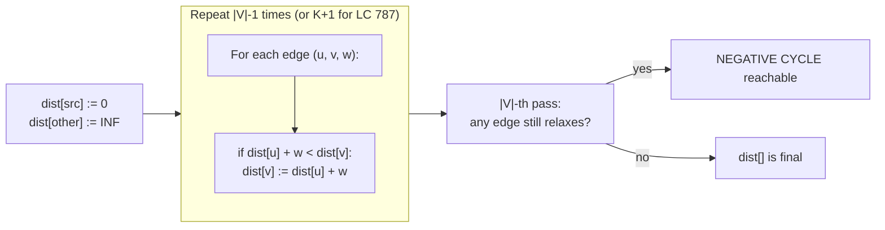

# Bellman-Ford and negative cycles

A directed graph with five vertices and ten edges. Source vertex `0`. Two of the edges have negative weights: `1 -> 4` costs `-4`, `3 -> 1` costs `-2`. Run Dijkstra from `0` and it finalizes vertex `1` at distance `6` after one heap pop, then never revisits it. Walk the same graph by hand and you'll find a path `0 -> 2 -> 3 -> 1` of length `7 + (-3) + (-2) = 2`, beating Dijkstra's answer by four. Dijkstra has not crashed, has not warned, has not flagged uncertainty. It has returned `6` as gospel and moved on.

That is the chapter. Bellman-Ford exists because Dijkstra's "the closest unvisited vertex is finalized" invariant breaks the moment a later detour through a negative edge can improve a vertex you already finalized.[^1] The fix: don't finalize anything. Relax every edge `|V| - 1` times. After the `i`-th pass, `dist[v]` is correct for any shortest path from the source to `v` that uses at most `i` edges, and a simple acyclic shortest path uses at most `|V| - 1` edges, so `|V| - 1` passes are enough. One more pass, the `|V|`-th, is the cycle detector: if any edge still relaxes, a negative cycle is reachable from the source.[^1] [^2]

This chapter is the harder of the two shortest-path chapters in Part 8. The negative-cycle detector, the proof-by-induction-on-edge-count, the snapshot trick that makes the K-edge bound exact, and the constraint-encoding generalization that turns LC 787's "at most K stops" into "at most `K+1` relaxation passes" are all moving parts. Plan to spend more time here than on Dijkstra. The widget below is the chapter; work through it twice.

## When you reach for this and not Dijkstra

Three signals point at Bellman-Ford rather than at the heap-driven greedy of [Dijkstra](./09-dijkstra.md).

The first is **negative edge weights**. Currency arbitrage, profit-and-loss nets, and time-cost trade-offs where one cost can subsidize another all break Dijkstra silently. If any edge weight in the input can be negative, Dijkstra is wrong; reach for this chapter.

The second is a **path bounded by a number of edges, not a number of vertices**. LC 787's "at most `K` stops" between `src` and `dst` is the canonical case: the constraint is on hop count, and Bellman-Ford's "after pass `i`, `dist` is correct for any path with at most `i` edges" lemma maps onto the constraint with one line of code.[^2] [^3]

The third is **negative-cycle detection as the actual question**. Not "find the shortest path" but "does a profitable cycle exist?" Currency arbitrage is the textbook case. Run `|V| - 1` passes, then check the `|V|`-th; if anything still relaxes, the answer is yes.[^2]

If none of those three apply, use Dijkstra. Bellman-Ford is `O(|V| * |E|)` while Dijkstra with a binary heap is `O((|V| + |E|) log |V|)`;[^1] choosing Bellman-Ford on a non-negative-weight graph trades a `log |V|` factor for nothing.

## The algorithm, in three pieces

The shape is small. Initialize `dist[src] = 0` and every other entry to infinity. Relax every edge in the graph, repeat `|V| - 1` times. Run one more pass to detect a negative cycle.

```python
# Vanilla Bellman-Ford. Returns (dist, has_negative_cycle).
import math

def bellman_ford(n, edges, src):
    INF = math.inf
    dist = [INF] * n
    dist[src] = 0
    for _ in range(n - 1):
        updated = False
        for u, v, w in edges:
            if dist[u] != INF and dist[u] + w < dist[v]:
                dist[v] = dist[u] + w
                updated = True
        if not updated:
            break  # early termination: no edge relaxed this pass, none will next
    # |V|-th pass: detect negative cycle reachable from src
    for u, v, w in edges:
        if dist[u] != INF and dist[u] + w < dist[v]:
            return dist, True
    return dist, False
```

Three things in that code are load-bearing.

The relaxation step `if dist[u] + w < dist[v]: dist[v] = dist[u] + w` is the entire algorithm. Everything else is a wrapper. The `dist[u] != INF` guard is not theoretical; in Java and C++, `INT_MAX + w` wraps to a negative number and the comparison silently relaxes vertices that should stay unreachable. Pitfall §7.4.

The outer loop runs `|V| - 1` times because a *simple* shortest path (no repeated vertices) uses at most `|V| - 1` edges, and after pass `i` every vertex has the correct shortest distance for any path of at most `i` edges. The proof is induction on `i`; CLRS 4th ed. §22.1 walks it line by line.[^1] If you run fewer than `|V| - 1` passes, some long shortest paths are not yet found. If you run more, you waste work on a graph that has already converged. Hence the `updated` flag, the early-termination optimization that drops the bound to `O(L * |E|)` where `L` is the maximum shortest-path length in edges.[^2]

The `|V|`-th pass is the proof of termination, not optional bookkeeping. If after `|V| - 1` passes some edge still satisfies `dist[u] + w < dist[v]`, no acyclic path explains the relaxation, so a cycle of negative total weight is reachable from `src`.[^2] Skip this pass and you cannot distinguish "converged" from "still relaxing"; pitfall §7.3 covers the trap.

## Why `|V| - 1` is the right number

Pass 1 finds every shortest path that uses one edge: a single relaxation of `(src, v, w)` for every direct neighbor `v` of `src`. Pass 2 finds every shortest path of at most two edges, because every two-edge path `src -> u -> v` extends a one-edge path that pass 1 already correct, and the inner loop visits the edge `(u, v)` somewhere in the second pass. By induction, pass `i` correctly handles every shortest path of at most `i` edges.

A simple path on `|V|` vertices has at most `|V| - 1` edges. So `|V| - 1` passes are sufficient and necessary in the worst case (a chain `0 -> 1 -> 2 -> ... -> |V|-1` with edges given in *reverse* topological order needs all `|V| - 1` passes for the relaxation wave to propagate from source to leaf).



*The two-phase shape: `|V| - 1` relaxation passes, then a single detection pass that proves convergence or reports a negative cycle.*

```mermaid
stateDiagram-v2
    [*] --> Init: dist[src]=0
    Init --> PassRunning: begin pass i
    PassRunning --> PassRunning: relax edge
    PassRunning --> PassEnd: all edges scanned
    PassEnd --> PassRunning: i &lt; |V|-1 and any relaxation
    PassEnd --> EarlyTerm: no relaxation this pass
    EarlyTerm --> Done
    PassEnd --> VCheck: i == |V|-1
    VCheck --> Done: no relaxation
    VCheck --> NegCycle: still relaxing
    NegCycle --> [*]
    Done --> [*]
```

*The state diagram makes the two optimizations explicit: `PassEnd -> EarlyTerm` is the no-relaxation skip, and `PassEnd -> VCheck` is the bridge from the main loop to the cycle detector.*

## What it actually costs

| Variant | Time | Space | Notes |
|---|---|---|---|
| Worst case (general graph) | `O(\|V\| * \|E\|)` | `O(\|V\|)` | Each of `\|V\| - 1` passes scans every edge once. |
| Best case with early termination | `O(\|E\|)` | `O(\|V\|)` | One pass that relaxes nothing; the convergence flag breaks the outer loop. |
| Realistic with early termination | `O(L * \|E\|)` | `O(\|V\|)` | `L` = longest shortest-path length in edges. |
| LC 787 K-edge variant | `O((K+1) * \|E\|)` | `O(\|V\|)` | The K-stop bound caps the outer loop. |
| Negative-cycle detection | `O(\|E\|)` extra | `O(\|V\|)` | One additional pass over the edge list. |

The `|V| * |E|` bound is the stable headline number CLRS reports.[^1] On dense graphs (`|E| = O(|V|^2)`) it is `O(|V|^3)`, on sparse graphs (`|E| = O(|V|)`) it is `O(|V|^2)`. Dijkstra's `O((|V| + |E|) log |V|)` beats Bellman-Ford on both shapes once weights are non-negative; the `log |V|` is the price of the heap, and Bellman-Ford pays it everywhere instead.

## Bellman-Ford with a budget: LC 787

[*Cheapest Flights Within K Stops*](https://leetcode.com/problems/cheapest-flights-within-k-stops/) gives you `n` cities, a list of one-way flights with prices, a source, a destination, and an integer `k`. Return the cheapest price from `src` to `dst` using at most `k` stops, or `-1` if unreachable.[^4] The reduction is one sentence and worth pausing on. **`k` stops between `src` and `dst` means at most `k + 1` edges on the path.** A direct flight is `0` stops and `1` edge. One stop is `2` edges. So the LC 787 bound is "the cheapest path with at most `k + 1` edges from `src`", which is exactly what Bellman-Ford after `k + 1` passes computes. We don't need `|V| - 1` passes; we need `k + 1`.

```python
def find_cheapest_price(n, flights, src, dst, k):
    INF = float('inf')
    dist = [INF] * n
    dist[src] = 0
    for _ in range(k + 1):
        snapshot = dist[:]   # CRITICAL: read previous-pass dist
        for u, v, w in flights:
            if snapshot[u] == INF:
                continue
            if snapshot[u] + w < dist[v]:
                dist[v] = snapshot[u] + w
    return -1 if dist[dst] == INF else int(dist[dst])
```

**Solution** — Python ([Java](./10-bellman-ford/lc-787/sol.java) · [C++](./10-bellman-ford/lc-787/sol.cpp) · [Go](./10-bellman-ford/lc-787/sol.go))

```python
# LC 787. Cheapest Flights Within K Stops
"""LC 787: Bellman-Ford with K+1 relaxation passes."""
from typing import List
import math


def find_cheapest_price(n: int, flights: List[List[int]], src: int, dst: int, k: int) -> int:
    """Cheapest src->dst path using at most k stops (k+1 edges).

    Each pass reads from `snapshot` (the previous-pass dist) and writes to
    `dist`. Without that double buffer, a single pass could relax a chain
    src -> a -> b in one iteration of the outer loop, silently violating
    the K-edge bound.
    """
    INF = math.inf
    dist = [INF] * n
    dist[src] = 0
    for _ in range(k + 1):
        snapshot = dist[:]  # CRITICAL: read from previous pass, write to current
        for u, v, w in flights:
            if snapshot[u] == INF:
                continue
            if snapshot[u] + w < dist[v]:
                dist[v] = snapshot[u] + w
    return -1 if dist[dst] == INF else int(dist[dst])
```

The one new line is `snapshot = dist[:]` at the top of every pass. The vanilla Bellman-Ford in the previous section reads and writes the same `dist` array because it only cares about the final answer after `|V| - 1` passes. LC 787 cares about an intermediate guarantee: after pass `i`, `dist[v]` is the cheapest cost to reach `v` using *exactly* up to `i` edges from `src`. Drop the snapshot and a single iteration of the outer loop can chain `src -> a -> b` through two adjacent edges, both seeing the live `dist`, and the algorithm returns a path cost for `i + 1` edges while pretending it used `i`.

## Worked example: LC 787 on the four-city sample

Take the LC 787 sample input: `n = 4`, flights `[[0,1,100], [1,2,100], [2,0,100], [1,3,600], [2,3,200]]`, `src = 0`, `dst = 3`, `k = 1`.[^4] One stop allowed, so two edges max.

Build phase. `dist = [0, INF, INF, INF]`.

Pass 1. Snapshot is `[0, INF, INF, INF]`. The only edges whose `snapshot[u]` is finite are the ones leaving `0`: `(0,1,100)`. After pass 1, `dist = [0, 100, INF, INF]`. Direct flights are reachable; nothing two-hop yet.

Pass 2. Snapshot is `[0, 100, INF, INF]`. Now edges leaving `1` see a finite source: `(1,2,100)` relaxes `dist[2]` to `200`, and `(1,3,600)` relaxes `dist[3]` to `700`. After pass 2, `dist = [0, 100, 200, 700]`. The path `0 -> 1 -> 3` costs `700`, found in two edges (one stop).

Note the path `0 -> 1 -> 2 -> 3` costing `400` exists in the graph, but it uses three edges (two stops), and `k + 1 = 2` passes never give it a chance to relax. **Return `700`.** That is the correct answer to the LC 787 sample, and it's the snapshot trick doing real work: without it, pass 2's relaxation of `(1,2)` could have pushed `dist[2]` to `200`, and the same pass's later relaxation of `(2,3)` would have read the freshly-updated `dist[2]` and dropped `dist[3]` to `400`. That value is wrong, because the path uses three edges.

The widget animates this two-edge trace plus a richer five-vertex graph that lets you watch the early-termination optimization fire and the `|V|`-th pass clear or trigger.

> **Interactive widget:** [Bellman-Ford with negative-cycle detection](../widgets/w-37-bellman-ford.yml) (panel `default`) — rendered on the website; the YAML spec describes the keyframes.

*Static fallback: on the canonical 5-node CLRS graph, the run terminates after `|V| - 1 = 4` passes with `dist = [0, 2, 7, 4, -2]`; pass 3 relaxes nothing, so a smart implementation breaks the loop on convergence, but the textbook version runs all four passes; the V-th pass relaxes nothing and confirms no negative cycle is reachable from `0`.*

## Detecting a negative cycle

Switch the input. Take a 4-vertex graph with edges `(0,1,1)`, `(1,2,2)`, `(2,3,-5)`, `(3,1,1)`. The triangle `1 -> 2 -> 3 -> 1` sums to `2 + (-5) + 1 = -2`, a negative cycle reachable from `0` via the edge `(0,1,1)`.

Run vanilla Bellman-Ford. Pass 1: `dist = [0, 1, 3, -2]`. Pass 2: `dist = [0, -3, 1, -4]`. Pass 3: `dist = [0, -5, -1, -6]`. Each lap around the triangle pushes every cycle vertex two units lower. After `|V| - 1 = 3` passes the values look plausible but they have not converged; they are diverging linearly toward `-infinity`.

The `|V|`-th pass, the fourth, relaxes the edge `(1, 2, 2)` again, dropping `dist[2]` from `1` to `-1`. **That single still-relaxing edge is the proof.** No acyclic path could have improved `dist[2]` further, so a cycle must explain it, and the cycle's total weight must be negative. Return the negative-cycle flag instead of `dist`.

The widget's second panel (`neg_cycle`) animates this exact 20-step trace; the same code that printed a clean `dist` on the canonical input now halts at step 18 with a vermilion banner.

> **Interactive widget:** [Bellman-Ford with negative-cycle detection](../widgets/w-37-bellman-ford.yml) (panel `neg_cycle`) — rendered on the website; the YAML spec describes the keyframes.

*Static fallback: 4-vertex graph with the negative triangle `1 -> 2 -> 3 -> 1` (sum -2). Three passes show `dist` diverging — `[0, 1, 3, -2]`, `[0, -3, 1, -4]`, `[0, -5, -1, -6]` — instead of converging. The `|V|`-th pass detects a still-relaxing edge and returns the negative-cycle flag in lieu of distances.*

## SPFA: Bellman-Ford with a queue

The textbook algorithm scans every edge in every pass, even when most vertices have stable distances. The Shortest Path Faster Algorithm (SPFA), popularized on Codeforces and traceable to Moore's 1959 variant, keeps a queue of "vertices whose `dist` just decreased" and only relaxes outgoing edges of those vertices.[^2] Worst-case complexity is the same `O(|V| * |E|)`, but on graphs without adversarial structure the average case is materially faster, often by a factor of 4-10x.

The algorithm: enqueue `src`, repeat: dequeue `u`, relax every outgoing edge `(u, v, w)`, and enqueue `v` if its distance dropped and `v` is not already in the queue. Halt when the queue is empty.

SPFA has two real-world properties worth remembering. It is **deterministic**, so adversarial inputs can force the `O(|V| * |E|)` worst case; a chain `0 -> 1 -> 2 -> ... -> |V|-1` with edge weights that force the whole queue to repeatedly drain and refill is the standard counterexample. And the negative-cycle detector adapts: track how many times each vertex has been dequeued; if any vertex is dequeued more than `|V|` times, a negative cycle is reachable. On Western-style technical interviews vanilla Bellman-Ford is the expected answer; SPFA is what to mention if the interviewer asks "can you do better in practice."

## Two pitfalls that bite

> [!WARNING]
> **Forgetting the snapshot in LC 787.** A reader who copies textbook Bellman-Ford pseudocode straight into the LC 787 inner loop reads and writes the live `dist` in a single pass and returns paths of `k + 2` or `k + 3` edges while pretending they used `k + 1`. The fix is one line at the top of every pass: `snapshot = dist[:]` (or `dist.clone()` in Java, `std::vector<int> snapshot = dist;` in C++). The relaxation reads from the snapshot and writes to the live `dist`. The textbook K-pass argument depends on this: each pass must enforce "this is the `i`-th edge added," which requires reading the previous-pass distances.[^3]

> [!WARNING]
> **Skipping the `|V|`-th pass and trusting the output anyway.** After `|V| - 1` passes on a graph with a reachable negative cycle, `dist[]` contains plausible-looking finite values that are not converged; running more passes pushes them all toward `-infinity`. A reader who omits the detection pass returns those values to a downstream consumer who trusts them. The fix is mechanical: always run the final pass; if any edge relaxes, return a negative-cycle signal (boolean, predecessor chain, or whatever the caller needs).[^2] CP-Algorithms phrases it precisely: "after the `(n-1)`-th phase, if we run the algorithm for one more phase and it performs at least one more relaxation, then the graph contains a negative weight cycle."

A third pitfall worth naming briefly: integer overflow when computing `dist[u] + w` in C++ or Java. `INT_MAX + 5` wraps to a negative number and the relaxation check sees a "smaller" value and incorrectly relaxes. The reference implementations gate the relaxation on `dist[u] != INF` before the sum; an alternative is to use `INT_MAX / 4` as the sentinel so addition cannot overflow, or to promote to `long long`. CP-Algorithms suggests `d[v] = max(-INF, d[u] + w)` as a clamp for negative-cycle code where the divergence is the whole point.[^2]

## Problem ladder

### CORE (solve all three to claim chapter mastery)

- [LC 787 — Cheapest Flights Within K Stops](https://leetcode.com/problems/cheapest-flights-within-k-stops/) [Medium] • bellman-ford-k-edge-bound ★
- [LC 1786 — Number of Restricted Paths From First to Last Node](https://leetcode.com/problems/number-of-restricted-paths-from-first-to-last-node/) [Medium] • bellman-ford-on-distance-DAG *(reference: Python only)*
- [LC 1928 — Minimum Cost to Reach Destination in Time](https://leetcode.com/problems/minimum-cost-to-reach-destination-in-time/) [Hard] • bellman-ford-with-time-state *(reference: Python only)*

### STRETCH (optional)

- [LC 882 — Reachable Nodes In Subdivided Graph](https://leetcode.com/problems/reachable-nodes-in-subdivided-graph/) [Hard] • dijkstra-with-budget *(reference: Python only)*

LC 787 is the chapter's signature problem and the one the worked example and widget animate. LC 1786 generalizes the relaxation-as-DP framing: Dijkstra computes shortest distances from the target, the distances induce a DAG, and a Bellman-Ford-flavored DP counts paths over that DAG modulo `10^9 + 7`. LC 1928 stretches LC 787's "pass `i` corresponds to edges-used = `i`" mapping to a `(city, time-used)` lattice and is the hardest single bit in the chapter. LC 882 is the adjacent-pattern Hard: not pure Bellman-Ford, but the "relaxation under a budget" mental model from LC 787 transfers wholesale to its Dijkstra-with-max-moves solution.

## Where this leads

The natural sibling is [Dijkstra](./09-dijkstra.md), which is what you reach for when every edge weight is non-negative and the heap-driven greedy outperforms the per-pass scan. The two chapters are best read as a pair; the right algorithm at interview time is whichever one matches the input's negative-edge profile and the constraint shape. Floyd-Warshall, the all-pairs analogue that also handles negative edges, lives in a future chapter; its `O(|V|^3)` complexity is what you accept when you need every-pair shortest paths and the graph is dense enough that running Bellman-Ford from every vertex is no faster.

Bellman-Ford itself is a dynamic program over edge count, which is why Part 9 on dynamic programming reuses the relaxation-as-DP frame to introduce shortest-path-on-DAG variants without re-deriving the induction argument.

## References

[^1]: Cormen, Leiserson, Rivest, Stein, *Introduction to Algorithms*, 4th ed., MIT Press, 2022, Chapter 22 §22.1 "The Bellman-Ford algorithm", pp.

[^2]: Ivanov et al., "Bellman-Ford — finding shortest paths with negative weights," CP-Algorithms, last updated 2025-09-10. <https://cp-algorithms.com/graph/bellman_ford.html>.

[^3]: Wong, Ka Wai (@wkw), "0787 — Cheapest Flights Within K Stops (Medium)," LeetCodeTheHardWay, retrieved 2026-05-20. <http://leetcodethehardway.com/solutions/0700-0799/cheapest-flights-within-k-stops-medium>.

[^4]: leetcode.ca mirror of LC 787, "Cheapest Flights Within K Stops," retrieved 2026-05-20. <https://leetcode.ca/all/787.html>.
