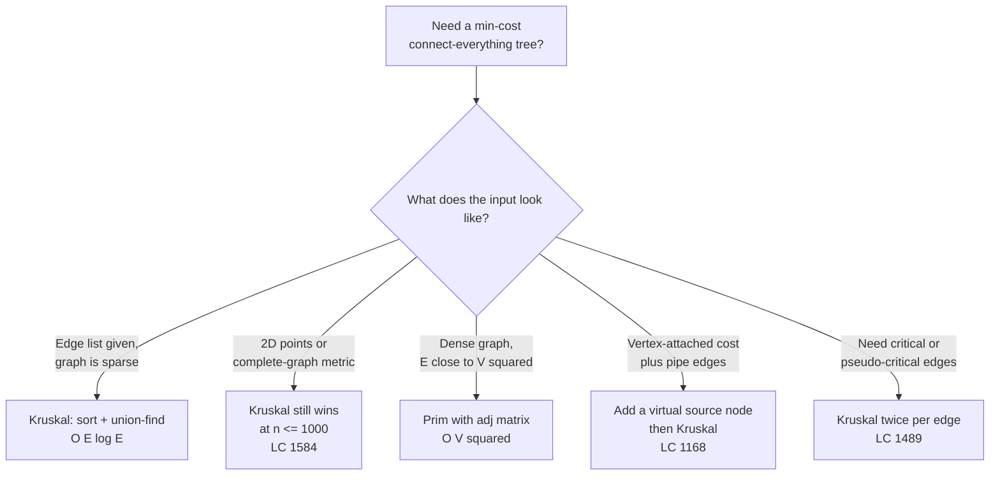
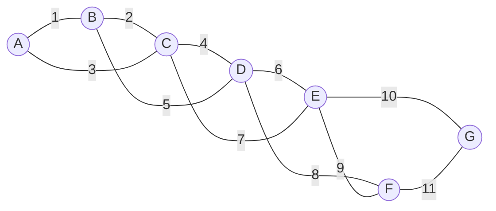
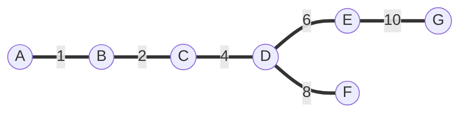

# Minimum spanning tree: Kruskal's algorithm

In 1956, Joseph Kruskal published a three-page paper titled *On the Shortest Spanning Subtree of a Graph and the Traveling Salesman Problem*. Three pages. The algorithm fits in two paragraphs of English; the proof of correctness fits in the third. Seventy years later, every system that lays cable, every clustering pipeline that draws boundaries from a similarity graph, every interview question that asks for the minimum-cost way to connect things — they're all running the same loop Kruskal wrote down at Bell Labs.

The chapter's signature problem is *Min Cost to Connect All Points* (LC 1584). You're given `n` points in 2D, like `[[0,0], [2,2], [3,10], [5,2], [7,0]]`. Every pair of points has a connection cost equal to the Manhattan distance between them. Return the minimum total cost that wires all the points together so any one is reachable from any other. The five-point example above answers 20. The naive instinct is to greedily attach each new point to its nearest connected neighbour, which feels right and is wrong on inputs of size four. The correct answer is Kruskal's algorithm, and it has been the correct answer since the year *I Love Lucy* aired.

## Where this pattern fits

Three of the four signature MST problems on LeetCode are Premium. The free one, LC 1584, hides its graph: the input is a list of points, not a list of edges, and the reader has to notice that "connection cost = Manhattan distance" turns the `n` points into a complete weighted graph with `n(n-1)/2` edges. Once you see that, every variant in the family fits the same flowchart.



*Decision flow for the MST pattern. Three of the four right-hand boxes are this chapter; the dense-graph case is [Minimum spanning tree: Prim's algorithm](./12-mst-prim.md), with a side-by-side comparison there.*

## Why the obvious approach is wrong

The greedy that fails on this problem is also the greedy that costs candidates the most interview points. Pick the closest pair of points and connect them. Then pick the next-closest unconnected point to whatever you've built so far, attach it, repeat until everyone's wired. This sounds like Prim's; it isn't. Prim's tracks a *frontier* of all edges crossing the cut between the built tree and the rest of the graph, then picks the lightest of those. The "attach the next-closest *point*" version doesn't track the frontier, so it routinely picks an edge that's optimal locally and disastrous globally.

Worse, candidates write the *enumerate every spanning tree* version on the whiteboard:

```python
# Brute force: enumerate spanning trees. Don't actually run this.
from itertools import combinations

def mst_brute(n, edges):
    best = float('inf')
    for tree in combinations(edges, n - 1):
        if is_spanning_tree(tree, n):  # connectivity check
            best = min(best, sum(w for _, _, w in tree))
    return best
```

There are `C(E, n-1)` candidate trees. For LC 1584 at `n = 1000` that's `C(499500, 999)`, a number with over four thousand digits. The connectivity check inside the loop costs `O(V + E)`. The whole thing is exponential in the worst sense. You will not finish.

The fix turns out to be embarrassingly direct: walk the edges in order of weight and accept each one that doesn't close a cycle. Stop when you've accepted `n - 1` of them.

## The pattern

Kruskal's algorithm is one for-loop with a guard:

```python
def min_cost_connect_points(points):
    n = len(points)
    if n <= 1:
        return 0
    edges = []
    for i in range(n):
        for j in range(i + 1, n):
            w = abs(points[i][0] - points[j][0]) + abs(points[i][1] - points[j][1])
            edges.append((w, i, j))
    edges.sort()
    dsu = DSU(n)
    total = accepted = 0
    for w, u, v in edges:
        if dsu.union(u, v):
            total += w
            accepted += 1
            if accepted == n - 1:
                break
    return total
```

**Solution** — Python ([Java](./11-mst-kruskal/lc-1584/sol.java) · [C++](./11-mst-kruskal/lc-1584/sol.cpp) · [Go](./11-mst-kruskal/lc-1584/sol.go))

```python
# LC 1584. Min Cost to Connect All Points
from typing import List


class DSU:
    """Disjoint-set with path halving + union by rank."""

    def __init__(self, n: int) -> None:
        self.parent = list(range(n))
        self.rank = [0] * n

    def find(self, x: int) -> int:
        while self.parent[x] != x:
            self.parent[x] = self.parent[self.parent[x]]  # path halving
            x = self.parent[x]
        return x

    def union(self, a: int, b: int) -> bool:
        ra, rb = self.find(a), self.find(b)
        if ra == rb:
            return False
        if self.rank[ra] < self.rank[rb]:
            ra, rb = rb, ra
        self.parent[rb] = ra
        if self.rank[ra] == self.rank[rb]:
            self.rank[ra] += 1
        return True


def min_cost_connect_points(points: List[List[int]]) -> int:
    """LC 1584. Manhattan-distance MST via Kruskal."""
    n = len(points)
    if n <= 1:
        return 0
    edges = []
    for i in range(n):
        xi, yi = points[i]
        for j in range(i + 1, n):
            xj, yj = points[j]
            edges.append((abs(xi - xj) + abs(yi - yj), i, j))
    edges.sort()
    dsu = DSU(n)
    total = accepted = 0
    for w, u, v in edges:
        if dsu.union(u, v):
            total += w
            accepted += 1
            if accepted == n - 1:
                break
    return total
```

Three things are happening in that loop body and they all matter.

The `edges.sort()` line is doing the entire algorithm's work. Once edges are weight-ordered, every accept decision is locally greedy: take the cheapest edge that's still safe. The proof that local greediness yields a globally optimal tree is the *cut property*[^1], discussed below.

The `dsu.union(u, v)` call returns `True` when `u` and `v` were in different components and merges them, `False` when they were already connected. The first case means accepting `(u, v)` extends the spanning forest by one edge without creating a cycle. The second case means `(u, v)` would close a cycle, so reject it. The union-find structure is what makes the cycle check `O(α(V))` per edge, effectively constant, instead of the `O(V + E)` BFS that brute-force cycle detection would need. [Union-find](./08-union-find.md) is the prerequisite chapter, and the `DSU` class above uses both path-halving and union-by-rank as taught there.

The `if accepted == n - 1: break` line is the early termination. A spanning tree on `n` vertices has exactly `n - 1` edges; once you've found them, the rest of the sorted edge list is guaranteed to consist of cycle-closers. You can stop reading. On the canonical 7-vertex graph below, the early break skips the heaviest edge entirely.

> [!IMPORTANT]
> The signal that triggers Kruskal: the input gives you, or lets you trivially derive, a flat list of weighted edges, and the question asks for the minimum-cost subgraph that connects everyone. Two follow-ups that make Kruskal even cleaner: when the problem asks you to *think about edges* (which to keep, which to remove, which is critical) rather than vertices, and when the cost has a vertex-local component you can model with a virtual-source-node trick. Both extensions appear in the ladder below.

## Why it works: the cut property

The correctness of Kruskal's algorithm rests on one theorem from CLRS Chapter 21.[^2] Pick any way to split the vertices into two non-empty sets — call this a cut. Of all the edges that cross the cut (one endpoint in each set), the lightest one belongs to *some* minimum spanning tree.

Kruskal's loop is the cut property applied implicitly. When the algorithm considers edge `(u, v)` and `find(u) ≠ find(v)`, the two endpoints are in different components. There's a cut that separates `u`'s component from the rest of the graph, and `(u, v)` is the lightest edge across that cut. Every cheaper edge has already been processed and either accepted (in which case it lies inside one of the two components) or rejected because its endpoints were already in one component, so it couldn't cross this cut. The cut property says taking `(u, v)` is safe. Repeated `n - 1` times, the resulting tree is optimal.

The proof in CLRS Theorem 21.1 is a one-page exchange argument: assume some optimal MST `T*` doesn't contain the lightest cross-cut edge `e = (u, v)`. Adding `e` to `T*` creates a cycle, which must have another edge `e'` crossing the same cut. Swap `e` for `e'`: the result is still a spanning tree, and its weight is no greater than `T*`'s because `weight(e) ≤ weight(e')` by assumption. So an optimal MST containing `e` exists.

The rejection case is symmetric and goes by the *cycle property*: in any cycle, the heaviest edge cannot be in any MST. When Kruskal rejects an edge, every other edge in the cycle it would close is already in the partial MST and is at least as light, so the rejected edge is the heaviest in that cycle. Safe to drop.

## Worked example: the canonical 7-vertex graph



*Seven vertices, eleven edges, distinct integer weights. Four of the cheap edges (A-C 3, B-D 5, C-E 7, E-F 9) close cycles and will be rejected.*

Sort: `A-B 1, B-C 2, A-C 3, C-D 4, B-D 5, D-E 6, C-E 7, D-F 8, E-F 9, E-G 10, F-G 11`.

Walk the sorted list. The first two edges (A-B, B-C) connect fresh components; both accepted. The third edge, A-C 3, finds `find(A) = find(C) = A` — already in one component. **Reject.** This is the moment the algorithm earns its keep. The naive sort-and-take-three approach would have taken A-C and missed the cheaper path through B.

C-D 4 is accepted. B-D 5 is rejected (B and D both reach root A). D-E 6 is accepted. C-E 7 is rejected. D-F 8 is accepted. E-F 9 is rejected. E-G 10 is accepted, and that's the sixth edge. The early break fires and F-G 11 is never examined.

Six accepts, four rejects, ten edges examined out of eleven, total weight 31. The MST is `{A-B 1, B-C 2, C-D 4, D-E 6, D-F 8, E-G 10}`.



*The minimum spanning tree. Both Kruskal and Prim produce these exact six edges; the next chapter animates Prim's path to the same answer.*

> **Interactive widget:** [MST: Kruskal + Prim (side-by-side)](../widgets/w-30-mst-kruskal-prim.yml) (panel `panel-kruskal`) — rendered on the website; the YAML spec describes the keyframes.

*Static fallback: 23-step trace on the canonical graph. Six accepts (green), four rejects (vermilion), one edge skipped via early break (sky blue). Final mst_weight = 31, accepted = 6 = n - 1.*

## What it actually costs

| Variant | Time | Space | Notes |
|---|---|---|---|
| Sort + DSU with path-halving + union-by-rank | O(E log E) | O(V + E) | The standard implementation. The sort dominates; the DSU loop is O(E α(V)), sublinear. |
| Sort + naive cycle check (BFS per edge) | O(E (V + E)) | O(V + E) | What you'd write before learning union-find. Asymptotically catastrophic; mentioned only for contrast. |
| Best case (already-sorted edges, integer weights) | O(E α(V)) | O(V + E) | Apply when weights fit a counting-sort range. Rare in practice. |
| LC 1584 at n = 1000 | E = ~500,000 sort dominates at ~10^7 ops | ~12 MB for edge tuples | Comfortably under any LC time limit. Prim's at O(V²) = 10^6 is faster by a constant; both pass. |

Two parts to the time bound and the interviewer will probe both. *Why is sorting the bottleneck?* Comparison-based sorting requires `Ω(E log E)`, and the post-sort union-find loop is `O(E α(V))`, which is sublinear in `E log E` for any `V` smaller than the number of atoms in the universe. *Why is α(V) the right number for union-find?* Tarjan proved in 1975 that path compression plus union-by-rank gives `O(m α(n))` amortized over a sequence of `m` operations, where α is the inverse Ackermann function and α(n) ≤ 4 for any input you'll ever see.[^3]

The `O(E log E)` bound is essentially tight under comparison-based assumptions. Cheriton and Tarjan brought it down to `O(E log log V)` in 1976 with a more elaborate algorithm; nobody implements it for interviews and LeetCode never asks. Kruskal at `O(E log E)` is the practical answer.

## Variants worth knowing

The chapter's CORE problem (LC 1584) is one shape of MST. Three other shapes show up on the ladder, each pulling on a different muscle.

### MST + virtual source node (LC 1168)

The problem statement: each house can either pay `wells[i]` to drill its own well, or pay `pipes[i][j]` to connect to another house's water. Find the minimum total cost to give every house water. The decision-per-house (well vs pipe) looks like a DP problem and is actually an MST.

Add a virtual vertex 0. For every house `i`, add an edge `(0, i, wells[i])`. Add the original pipes unchanged. Run Kruskal on the augmented graph. The MST has exactly `n` edges (it spans `n + 1` vertices), and each house ends up connected to vertex 0 either directly via its well-edge, interpreted as "build a well at house `i`", or transitively through cheaper pipes, interpreted as "connect `i` to some other house's water". The MST minimizes the total cost over all such mixed plans simultaneously.[^4]

The trick is the modeling step. Once the augmented graph exists, Kruskal is unchanged. Spotting that a per-vertex cost reduces to a virtual-source edge is the entire interview question.

### Disconnected-graph contract (LC 1135)

LC 1135 asks for the same thing as LC 1584, but the input may be disconnected and the contract is "return -1 if not all cities can be connected". The early break used in the LC 1584 reference is unsafe here: if the graph is disconnected, the loop will terminate with `accepted < n - 1` and the algorithm should signal failure rather than return a partial-forest weight.

The fix: drop the `if accepted == n - 1: break` line and walk every edge. After the loop, check `accepted == n - 1`; return `-1` otherwise.

### Critical and pseudo-critical edges (LC 1489)

An edge is *critical* if removing it from the graph raises the MST weight (or breaks connectivity). It's *pseudo-critical* if it appears in *some* MST but not all, equivalently, if forcing it included keeps the MST weight at the baseline, but excluding it doesn't raise the weight.

The algorithm is Kruskal twice per edge. Compute the baseline MST weight `W*`. For each edge `e`: run Kruskal excluding `e`; if the new weight exceeds `W*` (or no spanning tree exists), `e` is critical. Otherwise, run Kruskal forcing `e` accepted first; if the result equals `W*`, `e` is pseudo-critical. Total cost: `O(E^2 α(V))`.[^5]

The cycle property and the cut property both show up here: a critical edge is a bridge in the MST that no other edge can replace at the same weight, and a pseudo-critical edge is a non-bridge whose weight class has ties at the cut crossings.

## Two pitfalls that bite

> [!WARNING]
> **Forgetting union-by-rank or forgetting path compression.** Authors copy a "naive" union-find that does only one of the two and watch the algorithm degrade from `O(E α(V))` per find to `O(E log V)` or `O(E V)` overall, depending on which optimization is missing. For LC 1584 at `n = 1000` the gap looks small, but adversarial chains push the union depth to V and TLE on the larger cases. Always use both. The `DSU` class in the reference uses path halving (the iterative form of path compression) and union-by-rank.

> [!WARNING]
> **Integer overflow in Java and C++ on the summed weight.** LC 1584 has `n ≤ 1000` and coordinates in `[-10^6, 10^6]`, so individual edge weights can reach `4 × 10^6` and the sum of the 999 MST edges can reach roughly `4 × 10^9`. That exceeds `Integer.MAX_VALUE = 2.147 × 10^9`. Track the total in a `long` (Java) or `long long` (C++) accumulator and cast to `int` only at return time, after confirming the LC contract caps the answer at `INT_MAX`. The Java reference at `lc-1584/sol.java` uses exactly this idiom; a `long total` declaration is the entire fix. Python is exempt (arbitrary-precision integers); Go's `int` is 64-bit on every platform you'll deploy to but `int32` would overflow.

A third pitfall worth a sentence: writing `find` recursively. The textbook `find(x) = parent[x] == x ? x : (parent[x] = find(parent[x]))` is elegant and stack-bounded; iterative path halving achieves the same amortized bound without recursion and won't blow Python's recursion limit on adversarial chains. Pick iterative once and keep using it.

## Problem ladder

### CORE (solve to claim chapter mastery)

- [LC 1584 — Min Cost to Connect All Points](https://leetcode.com/problems/min-cost-to-connect-all-points/) [Medium] • mst-kruskal-union-find ★

### STRETCH (optional)

- [LC 1135 — Connecting Cities With Minimum Cost](https://leetcode.com/problems/connecting-cities-with-minimum-cost/) [Medium] • mst-kruskal-union-find *(LeetCode Premium)*
- [LC 1168 — Optimize Water Distribution in a Village](https://leetcode.com/problems/optimize-water-distribution-in-a-village/) [Hard] • mst-virtual-source-node *(LeetCode Premium)*
- [LC 1489 — Find Critical and Pseudo-Critical Edges in MST](https://leetcode.com/problems/find-critical-and-pseudo-critical-edges-in-minimum-spanning-tree/) [Hard] • mst-kruskal-with-edge-fix

LC 1584 is the chapter's signature problem (★) and the worked example. The MST pattern on LeetCode skews Medium-and-Hard; there is no canonical Easy MST problem, and the difficulty span is achieved across CORE-plus-STRETCH rather than within CORE alone. LC 1135 carries the textbook explicit-graph framing (Premium-locked, with LC 1584 as the free analogue). LC 1168 carries the virtual-source-node modeling trick. LC 1489 carries the Hard band and exercises both the cut and cycle properties at once.

## Where this leads

The sibling chapter is [Minimum spanning tree: Prim's algorithm](./12-mst-prim.md), which animates the same canonical 7-vertex graph under a different algorithm: frontier expansion through a min-heap instead of edge sorting. Both produce the same six-edge tree (distinct edge weights mean a unique MST, by Sedgewick Exercise 4.3.2[^6]). The decision table that picks between Kruskal and Prim's lives at the end of 8.12; read it after seeing both algorithms run.

The greedy correctness pattern that justifies Kruskal, the cut property and the cycle property, is the canonical example of a *matroid greedy*. When you reach the dynamic-programming chapters, the contrast is sharp: greedy works on MST because the problem has matroid structure; greedy fails on most knapsack-shaped problems because they don't.

## References

[^1]: Joseph B. Kruskal, *On the Shortest Spanning Subtree of a Graph and the Traveling Salesman Problem*, Proceedings of the American Mathematical Society 7(1): 48-50, 1956. DOI [10.1090/S0002-9939-1956-0078686-7](https://doi.org/10.1090/S0002-9939-1956-0078686-7).

[^2]: Cormen, Leiserson, Rivest, Stein, *Introduction to Algorithms*, 4th ed., MIT Press 2022, Chapter 21 §21.1 (Theorem 21.1, the cut property and the generic safe-edge MST argument) and §21.2 (MST-KRUSKAL pseudocode + Theorem 21.2, the `O(E log E)` bound).

[^3]: Robert E. Tarjan, *Efficiency of a Good But Not Linear Set Union Algorithm*, Journal of the ACM 22(2): 215-225, 1975.

[^4]: GeeksforGeeks, *Minimum cost to provide water to all villages*, [https://www.geeksforgeeks.org/dsa/minimum-cost-to-provide-water/](https://www.geeksforgeeks.org/dsa/minimum-cost-to-provide-water/).

[^5]: LeetCode 1489 official editorial, mirrored at [https://www.stealthinterview.ai/blog/leetcode-1489-find-critical-and-pseudo-critical-edges-in-minimum-spanning-tree](https://www.stealthinterview.ai/blog/leetcode-1489-find-critical-and-pseudo-critical-edges-in-minimum-spanning-tree).

[^6]: Sedgewick and Wayne, *Algorithms*, 4th ed., Addison-Wesley 2011, §4.3 Exercise 4.3.2, [https://algs4.cs.princeton.edu/43mst/](https://algs4.cs.princeton.edu/43mst/).
