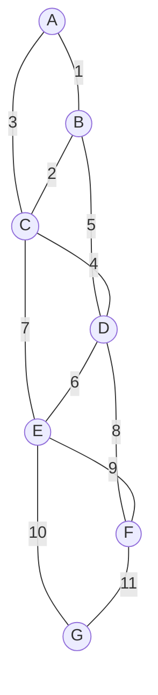

# Minimum spanning trees: Prim's algorithm

A thousand 2D points. The problem asks for the cheapest network of segments that connects all of them, where every pair has a Manhattan-distance cost. Sort the half-million implicit edges and feed them to Kruskal? Possible, but you have just paid `O(n² log n)` to materialise an edge list before the MST algorithm even starts. There is a better answer, and it has a name from 1957, though the algorithm itself is older than that.

The chapter is the second half of a pair. [Minimum spanning trees: Kruskal's algorithm](./11-mst-kruskal.md) taught the edge-driven view: sort every edge once, walk the list, accept any edge whose endpoints sit in different components. This chapter is the vertex-driven view. Pick a start vertex; grow a single tree from it; at every step, absorb the cheapest edge crossing the boundary between the in-tree vertices and everything else. Same MST in the end (when edge weights are distinct, both algorithms produce the unique tree[^1]); a different journey to it, and a different cost profile.

## Same correctness, different shape

Both algorithms are corollaries of the same fact, the **cut property**: for any partition of the vertices into two non-empty sets, the minimum-weight edge crossing the partition is safe to add to some MST.[^1] Kruskal applies the property globally; every edge it tries is the minimum-weight edge crossing the cut between the components it would join. Prim applies it locally. At every step the cut is fixed (in-tree vs out-of-tree) and the algorithm absorbs the minimum-weight edge crossing it.

The difference matters when you look at what each algorithm spends time on. Kruskal sorts every edge in the graph up front. If the graph is given as a list of `m` edges, that is one `O(m log m)` sort and you are done with the expensive step. Prim never sorts globally; it pulls the minimum *crossing* edge out of a priority queue, one absorption at a time. The PQ is small, bounded by the number of frontier edges live at any moment, and each pull is `O(log m)`. The cost shape changes: Kruskal pays its `log` factor once, on the full edge list; Prim pays `log` per absorption, on the live frontier.

That cost shape is the entire reason both algorithms exist. On a sparse graph (`m` close to `n`), the two are within constant factors. On a dense graph (`m` close to `n²`), or on an implicit complete graph where the edges aren't even materialised yet, the cost shape diverges. The decision table at the end of the chapter spells out where each one wins.

## The pattern

Pick any start vertex. Maintain a set of in-tree vertices, initially just the start, and a min-heap of `(weight, vertex)` pairs representing edges from the in-tree set to the outside. On each iteration, pop the heap's minimum. If its vertex is already in the tree, that entry is stale; skip it. Otherwise absorb the vertex, add its weight to the running total, and push every outgoing edge to a not-yet-in-tree neighbour onto the heap. Stop when every vertex is absorbed.

```python
def prim(n, adj, start=0):
    in_mst = [False] * n
    pq = [(0, start)]            # (weight, vertex)
    total = 0
    edges_added = 0
    while pq and edges_added < n:
        w, u = heapq.heappop(pq)
        if in_mst[u]:
            continue              # stale entry: skip
        in_mst[u] = True
        total += w
        edges_added += 1
        for v, weight in adj[u]:
            if not in_mst[v]:
                heapq.heappush(pq, (weight, v))
    return total
```

Two ideas in the loop body deserve a closer look.

The heap holds *vertex* entries, not *edge* entries. Each entry is `(weight, vertex)`, where `weight` is the cost of the cheapest edge currently known from the tree to that vertex. Same vertex can sit in the heap multiple times with different weights; the cheapest will surface first, the rest are duplicates we ignore. This is the lazy variant of Prim. The eager variant uses an indexed heap with decrease-key support and keeps exactly one entry per outside vertex, but Python's `heapq`, Java's `PriorityQueue`, Go's `container/heap`, and C++'s `std::priority_queue` don't support decrease-key in `O(log n)`, so the lazy version is what you write at a whiteboard.[^2]

The `if in_mst[u]: continue` check is the load-bearing line. Without it, the algorithm absorbs the same vertex twice and the total comes out wrong. The cost is benign, since every duplicate entry is `O(log m)` to pop and discard, but you cannot skip the test.

There's a small reduction worth naming explicitly. Prim's loop terminates when every vertex is in the tree, at which point the chosen edges form a spanning tree (`n-1` edges connecting `n` vertices, no cycles by construction since we never absorb a vertex twice). The total weight of those edges is what the function returns. Whether Prim found the *minimum* spanning tree comes from the cut property, not from the algorithm's structure: at every absorption, the chosen edge is the cheapest crossing the (in-tree, out-of-tree) cut, and the cut property says any such edge is safe to add to some MST. By induction, every edge Prim adds is safe, so the final tree is an MST.[^1]

## Worked example: the canonical 7-vertex graph

Seven vertices labelled A through G; eleven edges with distinct integer weights so the MST is unique:



*The chapter's canonical input. 7 vertices, 11 edges; the same graph that anchors [Kruskal's chapter](./11-mst-kruskal.md). Distinct weights guarantee a unique MST, so both algorithms produce the same tree.*

Start Prim from vertex A. The first frontier scan pushes `(1, B)` and `(3, C)` onto the heap. The min-pop is `(1, B)`, so B is absorbed via the edge A-B with weight 1. That is exactly the same first edge Kruskal would pick, since A-B is the globally cheapest edge.

The agreement is a coincidence of this graph; on the second pick the algorithms could diverge. They don't, here. Prim's frontier scan from B pushes `(2, C)` and `(5, D)`; the heap also still holds the stale `(3, C)` from earlier. The min-pop is `(2, C)`, so C is absorbed via B-C. Kruskal's second accept would also be B-C, for the same reason A-B was first: B-C is the next-cheapest edge globally and its endpoints are in different components.

The two algorithms keep agreeing, because in this graph the next-cheapest globally is also the next-cheapest on the frontier at every step. Where they visibly differ is on the *rejected* edges. Kruskal queries A-C (weight 3), checks the union-find for both endpoints, sees they are in the same component {A, B, C}, and rejects the edge as a cycle. Prim's heap also surfaces (3, C) on the next pop, but the rejection mechanism is different: C is already in `in_mst`, so the entry is skipped as stale, no union-find involved.

Same edge, two reasons to throw it out. The cut property explains both: A-C does not cross the cut between in-tree and out-of-tree (both endpoints sit on the in-tree side), so it cannot be safe.

> **Interactive widget:** [MST: Kruskal + Prim (side-by-side)](../widgets/w-30-mst-kruskal-prim.yml) (panel `panel-prim`) — rendered on the website; the YAML spec describes the keyframes.

*Static fallback: Prim absorbs vertices in order A, B, C, D, E, F, G; accepts edges A-B (1), B-C (2), C-D (4), D-E (6), D-F (8), E-G (10) for total weight 31; encounters four stale heap entries (A-C 3, B-D 5, C-E 7, E-F 9) along the way and skips them.*

## Where the cost shape comes from

Each vertex is absorbed exactly once, so there are `n` extract-min calls. Each edge is enqueued at most twice (once from each endpoint when its other endpoint joins the tree), so there are at most `2m` push operations. With a binary heap, both extract-min and push are `O(log m)`, so total work is `O((n + m) log m)`.[^2] When the graph is connected, `m ≥ n - 1`, and the bound simplifies to `O(m log m)`. Since `m ≤ n²` implies `log m ≤ 2 log n`, the bound is also `O(m log n)` up to constants.

| Variant | Time | Space | When |
|---|---|---|---|
| Lazy Prim, binary heap, adjacency list | `O(m log m)` | `O(m)` | What you write in interviews. PQ may grow to `O(m)` because of stale entries; each entry is still `O(log m)` to push or pop.[^2] |
| Eager Prim, indexed binary heap with decrease-key | `O(m log n)` | `O(n)` | The variant Sedgewick teaches. Requires an indexed PQ; standard libraries don't provide it.[^2] |
| Dense Prim, adjacency matrix, linear scan | `O(n²)` | `O(n)` | The right answer when the graph is dense (`m` close to `n²`) or implicit. No heap. Maintain an array `min_edge[v]` of the cheapest edge from `v` to any in-tree vertex; each iteration linear-scans for the smallest, marks it in-tree, then linear-updates `min_edge` for the new vertex's neighbours.[^3] |
| Eager Prim, Fibonacci heap | `O(m + n log n)` | `O(n)` | Theoretical, mostly. Fredman and Tarjan's 1987 result; almost no production code or interview answer uses a Fibonacci heap.[^4] |

The bound that matters in interview rotation is `O(m log n)`. The dense-graph variant matters when the graph is given implicitly; the next section's worked problem is the canonical case.

## When the graph is implicit: LC 1584

[LC 1584 — Min Cost to Connect All Points](https://leetcode.com/problems/min-cost-to-connect-all-points/) hands you `n` 2D points, up to a thousand of them, and asks for the cheapest set of segments that connects them all under Manhattan distance. The graph is a complete graph: every pair of points is an edge whose weight is `|x₁ - x₂| + |y₁ - y₂|`. With `n = 1000`, that is roughly half a million edges nobody has built yet.

The natural Prim implementation builds the adjacency list lazily. On each absorption, scan every other point, compute the distance on the fly, and push it onto the heap if its target isn't in the tree yet. No edge list, no precomputed adjacency:

```python
def min_cost_connect_points(points):
    n = len(points)
    if n <= 1:
        return 0
    in_mst = [False] * n
    pq = [(0, 0)]              # (weight, vertex)
    total = 0
    edges_added = 0
    while pq and edges_added < n:
        w, u = heapq.heappop(pq)
        if in_mst[u]:
            continue
        in_mst[u] = True
        total += w
        edges_added += 1
        for v in range(n):
            if not in_mst[v]:
                d = abs(points[u][0] - points[v][0]) + abs(points[u][1] - points[v][1])
                heapq.heappush(pq, (d, v))
    return total
```

**Solution** — Python ([Java](./12-mst-prim/lc-1584/sol.java) · [C++](./12-mst-prim/lc-1584/sol.cpp) · [Go](./12-mst-prim/lc-1584/sol.go))

```python
# LC 1584. Min Cost to Connect All Points
import heapq
from typing import List


def min_cost_connect_points(points: List[List[int]]) -> int:
    """LC 1584 - Manhattan-distance MST via lazy Prim."""
    n = len(points)
    if n <= 1:
        return 0
    in_mst = [False] * n
    pq: list[tuple[int, int]] = [(0, 0)]   # (weight, vertex)
    total = 0
    edges_added = 0
    while pq and edges_added < n:
        w, u = heapq.heappop(pq)
        if in_mst[u]:
            continue                        # stale entry
        in_mst[u] = True
        total += w
        edges_added += 1
        for v in range(n):
            if not in_mst[v]:
                d = abs(points[u][0] - points[v][0]) + abs(points[u][1] - points[v][1])
                heapq.heappush(pq, (d, v))
    return total
```

This solution passes within the time limit. The heap grows to roughly `n²` entries, each operation is `O(log n²) = O(log n)`, so total work is about `O(n² log n)`. For `n = 1000`, that's about ten million heap operations. Java's `PriorityQueue` is the slowest of the four languages on this workload but still comfortably under the LC ceiling.

There's a faster answer, and on dense input it's the right one.

### Dense Prim: from O(n² log n) to O(n²)

Skip the heap. Keep an array `min_edge[v]` storing the cheapest edge weight from `v` to any current in-tree vertex; initialise it to infinity for every vertex except the start. Each iteration does two linear passes:

1. Find the unselected vertex `u` with the smallest `min_edge[u]`. That's the cheapest crossing edge, the same edge Prim's heap would have surfaced, no priority queue needed.
2. Mark `u` in-tree. For every other unselected `v`, if the edge `(u, v)` is cheaper than the current `min_edge[v]`, update it.

`n` iterations, each doing `O(n)` work, total `O(n²)`. No heap operations, no stale entries, no `log n` factor. For `n = 1000` that's a million operations versus the heap variant's ten million, an order of magnitude faster on the same problem.[^3]

The dense variant is the right choice whenever `m` is close to `n²` or whenever the edges are derived from the input (geometric problems, every-pair similarity scores, all-to-all costs). The heap variant is the right choice on sparse explicit graphs. For the in-between cases, either works and the constant factors decide.

## Two pitfalls that bite

> [!WARNING]
> **Cumulating the weight on the heap turns Prim into Dijkstra.** The two algorithms have nearly identical skeletons: start vertex, frontier heap, absorb one vertex per iteration. The only structural difference is what gets pushed when a frontier edge is discovered. Dijkstra pushes `(distance_from_start + edge_weight, neighbour)`, because it tracks the cost of the path to the neighbour. Prim pushes `(edge_weight, neighbour)`, because it tracks the cost of the *single edge* into the neighbour. Muscle memory from a recent Dijkstra problem produces a shortest-path tree instead of an MST: same nodes, different edges, wrong total. The line to memorise: **Dijkstra cumulates, Prim doesn't.**

> [!WARNING]
> **Forgetting to skip stale entries.** Lazy Prim allows the same vertex to sit in the heap with multiple weights. The first pop absorbs it correctly; every subsequent pop for that vertex is a duplicate that must be discarded. Without `if in_mst[u]: continue` immediately after the pop, the algorithm absorbs the same vertex multiple times and the running total overshoots the true MST weight. The cost of the check is one boolean lookup per pop; the cost of forgetting it is silent incorrectness, since the algorithm still terminates with a number that *looks* plausible.

## Problem ladder

### CORE (solve to claim chapter mastery)

- [LC 1584 — Min Cost to Connect All Points](https://leetcode.com/problems/min-cost-to-connect-all-points/) [Medium] • mst-prim-dense ★

### STRETCH (optional)

- [LC 1135 — Connecting Cities With Minimum Cost](https://leetcode.com/problems/connecting-cities-with-minimum-cost/) [Medium] • mst-sparse *(Premium; free analogue at LC 1584)*
- [LC 1489 — Find Critical and Pseudo-Critical Edges in MST](https://leetcode.com/problems/find-critical-and-pseudo-critical-edges-in-minimum-spanning-tree/) [Hard] • mst-edge-classification

There is no canonical Easy LC problem on the MST tag; the smallest non-trivial MST instance has at least three vertices and at least one tie or cycle decision, which lands at Medium. The chapter ladder is intentionally narrow: LC 1584 is the one problem where Prim is more natural than Kruskal (the dense-graph case), and the two STRETCH problems live primarily in [Kruskal's chapter](./11-mst-kruskal.md). Work them in either framing.

## Kruskal vs Prim: the decision table

Both algorithms produce the same MST on any input where edge weights are distinct.[^1] The choice between them is a cost question, not a correctness question.

| Question | Use Kruskal | Use Prim |
|---|---|---|
| Graph density | Sparse (`m` close to `n`) | Dense (`m` close to `n²`) |
| Graph representation | Edge list given directly | Adjacency list, adjacency matrix, or implicit (e.g., 2D points with metric distance) |
| Cost of materialising edges | Free; edges already in hand | Expensive: `O(n²)` to build |
| Dominant data structure | Union-Find with path compression | Min-heap (lazy) or adjacency-matrix scan (dense) |
| Time, generic case | `O(m log m)`, dominated by the sort[^5] | `O(m log n)` lazy heap, `O(n²)` dense matrix[^2] |
| Disconnected input | Detected by `accepted < n - 1` at termination | Detected by heap-emptied-before-all-absorbed |
| Negative edge weights | Works | Works (cut property holds for any real weights, unlike Dijkstra) |
| Cleanest interview answer when | Edge list is the natural input | Vertex set is the natural input, especially when edges are derived |
| The signature problem | `connections[i] = [u, v, cost]` (LC 1135 shape) | `points[i] = [x, y]` (LC 1584 shape) |

The pithy version: when the input gives you edges, sort them and run Kruskal. When the input gives you vertices and the edges are implicit, grow a tree from any starting vertex and run Prim. The two algorithms are not in tension. They are the same theorem (the cut property) realised on two different cost profiles.

## Where this leads

Prim and Dijkstra share a skeleton: a start vertex, a min-heap keyed on a frontier value, one absorption per iteration. Dijkstra keys on path distance from the source; Prim keys on edge weight to the tree.[^2] Reading [Dijkstra's algorithm](./09-dijkstra.md) and [Kruskal's algorithm](./11-mst-kruskal.md) together is enough to internalise both. The third algorithm in the family, and the natural place to look next, is the cut property's other big customer: greedy correctness arguments, revisited in Part 10.

## A note on names

Prim's algorithm is most often named after Robert C. Prim, who published it in 1957 as part of a Bell Labs paper on telephone-network design.[^6] The same algorithm had been published in 1930 by the Czech mathematician Vojtěch Jarník, in a Czech-language journal that did not reach English-speaking readers until decades later. Edsger Dijkstra independently rediscovered it in 1959, in the same paper that introduced his shortest-path algorithm.[^7] Three independent discoveries across thirty years; the algorithm sometimes carries all three names ("Jarník-Prim-Dijkstra") in the older literature. The name in interviews is always "Prim's."

## References

[^1]: Cormen, Leiserson, Rivest, Stein, *Introduction to Algorithms*, 4th ed., MIT Press, 2022, Chapter 21 §21.2 ("The algorithms of Kruskal and Prim"), Theorem 21.1 (the cut-property safe-edge lemma).

[^2]: Sedgewick & Wayne, *Algorithms*, 4th ed., Addison-Wesley, 2011, §4.3 "Minimum Spanning Trees", <https://algs4.cs.princeton.edu/43mst/>.

[^3]: CP-Algorithms, "Minimum spanning tree, Prim's algorithm", <https://cp-algorithms.com/graph/mst_prim.html>.

[^4]: Fredman, Michael L., and Robert E. Tarjan, "Fibonacci heaps and their uses in improved network optimization algorithms," *Journal of the ACM* 34(3):596–615, 1987.

[^5]: Wikipedia, "Prim's algorithm", <https://en.wikipedia.org/wiki/Prim%27s_algorithm>

[^6]: Prim, Robert C., "Shortest connection networks and some generalizations," *Bell System Technical Journal* 36(6):1389–1401, 1957.

[^7]: Dijkstra, E. W., "A note on two problems in connexion with graphs," *Numerische Mathematik* 1:269–271, 1959.
