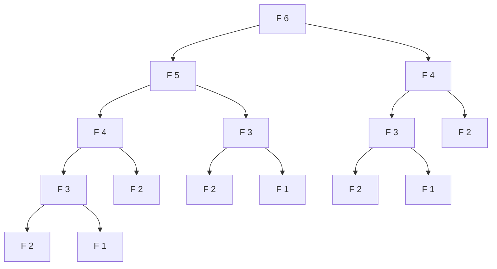
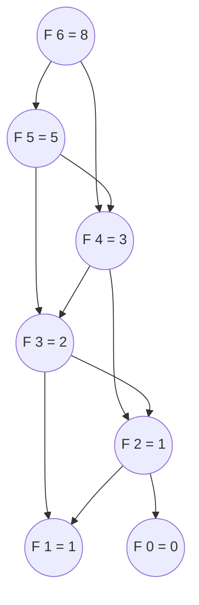

# Dynamic Programming: From Recursion to Memoization

A naive `fib(43)` does about 433 million recursive calls. The function is four lines of code. The shape is `F(n) = F(n-1) + F(n-2)`, base cases at 0 and 1, return the sum. Read those four lines and you would expect them to run in time proportional to `n`. They run in time proportional to `phi^n` instead, where `phi` is about `1.618`. Adding a hash map keyed by `n`, with eight characters of code that check the cache before recursing, drops the same function back to time proportional to `n`. Same algorithm. Same answer. Eight orders of magnitude in speed.

Dynamic programming is the engineering move you make when a recursion's call tree carries that kind of redundancy. The textbook framing, due to Bellman in 1957, calls it the *principle of optimality*: an optimal answer to a problem is built from optimal answers to smaller subproblems of the same form.[^2] CLRS §14.3 names the pair of conditions Bellman's principle requires: *optimal substructure* (small answers compose into a big answer) and *overlapping subproblems* (the same small answer is needed by more than one big problem).[^3] When both hold, the recursion is correct as written and the memoization lift is mechanical. The whole job of this chapter is to teach you that lift.

## What dynamic programming actually is

Strip the name down. Dynamic programming is recursion plus a cache, when the recursion's subproblems repeat. That's the entire content. The "dynamic programming" label is historical (Bellman picked it for political reasons inside RAND, not technical ones)[^2] and obscures the fact that the move is small.

Two attributes have to hold at once for the move to be available.

**Optimal substructure.** The optimal answer at size `n` is built from optimal answers at sizes `< n`. For Fibonacci this is trivial: `F(n) = F(n-1) + F(n-2)` is the substructure, by definition. For shortest paths it's a theorem (the prefix of a shortest path is itself a shortest path). For longest common subsequence the substructure is a case analysis on whether the last characters match.

**Overlapping subproblems.** The same subproblem identity reappears in the recursion tree, in two or more branches. A naive `fib(6)` calls `fib(4)` twice (once on the way to `fib(5)`, once directly), `fib(3)` four times, `fib(2)` five times. Without overlap, dynamic programming buys nothing; the memo never hits.



*The naive recursion tree for `fib(6)`. `F(4)` appears twice, `F(3)` four times, `F(2)` five times, `F(1)` four times. The exponential branching is the disaster the memo prevents.*

The signal is the *repetition*, not the recursion. Merge sort is recursive and has optimal substructure (sorting `[1..n]` reduces to sorting `[1..k]` and `[k+1..n]`), but the two halves share zero subproblems; nothing in the right half ever needs an answer the left half computed. Wikipedia is explicit about this distinction: merge sort and quicksort are not classified as dynamic programming.[^1] If your recursion tree's subproblems don't repeat, reach for divide-and-conquer instead and skip the memo.

The merge-sort case is a useful negative example precisely because it has the same syntactic shape as a DP. Two recursive calls, a combine step, a base case. The tell that DP applies is not in the syntax. It's in the *identity* of the subproblems. Are the same `(args)` going to show up under two different parents in the call tree? If yes, memoize. If no, you have divide-and-conquer.

## What pure recursion costs

Write the Fibonacci recurrence the obvious way and it ships:

```python
def fib(n: int) -> int:
    if n < 2:
        return n
    return fib(n - 1) + fib(n - 2)
```

`fib(10)` returns `55` in microseconds. `fib(30)` returns `832040` in about a second on a 2024 laptop. `fib(43)` takes most of a minute and does roughly 433 million function calls. `fib(50)` is hopeless; the call count is closer to ten billion.

The recurrence for the runtime is `T(n) = T(n-1) + T(n-2) + Theta(1)`, the same recurrence as the Fibonacci numbers themselves. The closed form is `T(n) = Theta(phi^n)` where `phi = (1 + sqrt(5))/2 ~ 1.618`.[^3] Each level of the tree roughly doubles the leaf count of the level above; thirty levels deep is `1.618^30`, about 1.6 million leaves; forty-three levels deep is `1.618^43`, about 433 million.

The damage is not depth. The depth of the call tree for `fib(n)` is just `n`, because the deepest path follows `n -> n-1 -> n-2 -> ... -> 0`. Stack space stays linear. The damage is *node count*, and the node count is exponential because the tree fans out at every internal node and the same subproblem gets recomputed in many places. `fib(2)` is computed five times in `fib(6)`, twenty-eight times in `fib(10)`, and 433 million times in `fib(43)`.[^1] Recomputing `fib(2)` from scratch is fast; doing it 433 million times is not.

Watch the recursion run in the widget. The sub-trees that repeat are the visible cost.

## The conversion procedure

Four steps turn the naive recursion into a memoized recursion. The procedure is mechanical, not creative; you follow the steps and the function gets faster.

**1. Identify the recursive function's signature.** Whatever the function takes as arguments is the *DP state* — the unique identifier of a subproblem. For Fibonacci the signature is `fib(n: int)`, so the state is the single integer `n`. For longest common subsequence it's `(i, j)`. For coin change it's `(amount)`. The signature *is* the state; treat them as the same thing.

**2. Identify the base cases.** The directly-knowable subproblems where the recursion terminates without recursing further. For Fibonacci, `fib(0) = 0` and `fib(1) = 1`. The base cases are usually obvious, but if you can't write them down cleanly, your state probably isn't right; go back to step 1.

**3. Cache the return value, keyed by the state.** Add a dictionary keyed by the state. After the recursive call completes, write the answer to the cache before returning it.

**4. Check the cache before recursing.** At the top of the function, look up the state in the cache. If present, return immediately. If absent, compute as before.

Steps 3 and 4 together turn each unique subproblem into a one-time computation. The recursion is unchanged otherwise. The base cases are unchanged. The combine step is unchanged. Only the cache check and the cache write are new.

```python
def fib(n: int) -> int:
    memo: dict[int, int] = {0: 0, 1: 1}

    def solve(k: int) -> int:
        if k in memo:
            return memo[k]
        memo[k] = solve(k - 1) + solve(k - 2)
        return memo[k]

    return solve(n)
```

**Solution** — Python ([Java](./00-dp-recursion-to-memo/lc-509/sol.java) · [C++](./00-dp-recursion-to-memo/lc-509/sol.cpp) · [Go](./00-dp-recursion-to-memo/lc-509/sol.go))

```python
# LC 509. Fibonacci Number
import sys
from functools import lru_cache


def fib(n: int) -> int:
    """LC 509: top-down memoization with an explicit dict.

    Time O(n), space O(n) for the memo plus O(n) recursion depth.
    """
    memo: dict[int, int] = {0: 0, 1: 1}

    def solve(k: int) -> int:
        if k in memo:
            return memo[k]
        memo[k] = solve(k - 1) + solve(k - 2)
        return memo[k]

    return solve(n)


# Idiomatic alternative with @lru_cache. Same recurrence; the decorator IS
# the memo. Two ways to spell the same algorithm; pick the one your team
# reads more easily.
@lru_cache(maxsize=None)
def fib_cached(n: int) -> int:
    if n < 2:
        return n
    return fib_cached(n - 1) + fib_cached(n - 2)


# DSH-04 (DSA Handbook code-idioms): bump CPython's default 1000-frame
# recursion limit ONCE at module top-level for any DP chapter where naive
# recursion can approach 1000 frames. Set it once; never per function.
sys.setrecursionlimit(10_000)
```

> **Interactive widget:** [DP table fill](../widgets/w-31-dp-table-fill.yml) (panel `panel-a`) — rendered on the website; the YAML spec describes the keyframes.

*Static fallback: a 24-step trace on `fib(6)`. The recursion tree builds depth-first to the leftmost leaf, hits the base case, computes `F(2) = 1`, then on every right child of every ancestor the cache hits and the subtree is pruned. Eleven tree nodes total for `fib(6)`; five of those are cache hits that save five exponential subtrees.*

Three things every memoized DP shares. A *base map* (here, `{0: 0, 1: 1}` — the two known answers seeded into the memo). A *recurrence* (`solve(k - 1) + solve(k - 2)`, the relation that breaks size `k` into smaller sizes). A *cached return* (the `if k in memo` check at the top, the `memo[k] = ...` assignment before the return). Skiena's *Algorithm Design Manual* §10.3 calls this the "three-step recipe" and presents it as the universal DP shape.[^4]

### Why memoization preserves correctness

The memo is allowed to skip work. It is not allowed to change the answer. The argument that it doesn't is short, but worth doing once explicitly because every later DP chapter rests on it.

Three observations. First, the recursive function is *pure*: it has no side effects on its inputs, no reads from external mutable state, no I/O. For a given input `k`, the function's return value is determined entirely by `k`. This is the property Wikipedia calls *referential transparency*: "calling the function has exactly the same effect as replacing that function call with its return value."[^5]

Second, when the function is pure, *the value at `k` is fixed*. There is one correct answer for `fib(2)`, namely `1`. The cache holds that answer. The next time the recursion asks for `fib(2)`, returning `1` from the cache is identical to recomputing `fib(2)` from scratch. The two paths produce the same output by construction.

Third, the two paths produce that output *at different costs*. Recomputing from scratch traverses the entire subtree below the call. Returning from the cache is one hash-map lookup. The transformation that swaps recomputation for a cache lookup, when both produce the same output, is what makes the algorithm valid. This is the same observation the compiler uses when it constant-folds `2 + 2` to `4`: the substitution preserves meaning because `+` is pure.

Two consequences worth naming. The first: this argument is the formal connection between top-down memoization (recursion plus a cache) and bottom-up tabulation (iteration plus a table; the next chapter's topic). Both compute the same DP value for every state; they differ only in the *order* the states are visited. Memoization visits them lazily, in whatever order the recursion needs them. Tabulation visits them eagerly, in an order picked at the top so every state's dependencies are filled before the state itself. The two are equivalent in correctness; they trade off recursion-stack overhead, ease of writing, and constant-factor speed.

The second consequence: if the recursive function is *not* pure (it reads a hidden global, mutates an argument, returns a fresh list whose contents depend on call history), the memo will return the wrong answer. The pitfall section below names the real cases where this bites.

## What it actually costs

The unique-subproblem count for `fib(n)` is `n + 1` (the subproblems `F(0), F(1), ..., F(n)`). Memoization guarantees each unique subproblem is computed exactly once, with `O(1)` work above the recursive calls.[^1] Total time is `O(n)`. Without the memo, the call tree has `Theta(phi^n)` nodes; with the memo, the recursion *DAG* has `n + 1` nodes.[^3] The shape changed from a tree to a DAG — same edges, same dependencies, no duplicate vertices.



*The same recursion as a memo DAG. Each subproblem is a unique node, computed once, reused by every ancestor. Seven nodes total for `fib(6)`, where the tree had fourteen.*

The space cost is `O(n)` for the memo table plus `O(n)` for the recursion stack. The two add to `O(n)`. [Bottom-up tabulation](./01-dp-bottom-up-tabulation.md) drops the recursion stack, getting to `O(n)` flat memory. A two-variable rolling trick on Fibonacci specifically gets to `O(1)`, because each computation needs only `F(k-1)` and `F(k-2)`, but that's a Fibonacci-specific reduction, not a general DP move.

The time bound `O(n)` is the simplest case of a more general result. For any DP whose unique-subproblem count is `S` and whose per-subproblem combine work is `W`, the memoized total is `O(S * W)`.[^1] CLRS §14.3 calls this the "elements of dynamic programming" theorem and uses it to bound matrix-chain multiplication at `O(n^3)`, edit distance at `O(mn)`, and so on.[^3] The shape of the bound is the same every time: count the states, multiply by the work per state.

| Variant | Time | Space |
|---|---|---|
| Naive recursion (no memo) | `Theta(phi^n)`, exponential | `O(n)` recursion stack |
| Top-down memoized | `O(n)` | `O(n)` memo + `O(n)` stack = `O(n)` |
| Bottom-up tabulated (next chapter) | `O(n)` | `O(n)` table |
| Bottom-up two-variable rolling | `O(n)` | `O(1)` |

## When the recurrence shape bends

The Fibonacci-shape DP (single-integer state, fixed-arity recurrence, sum combine) is the simplest. Three small variants of the same chapter-level pattern show up in the ladder; recognising them is most of the skill.

**The combine operator changes.** When the recurrence is `f(n) = min(f(n-1), f(n-2)) + cost(n)` instead of `f(n) = f(n-1) + f(n-2)`, the algorithm is identical except for the operator. House Robber (LC 198) and Coin Change (LC 322) are both this shape; each anchors its own pattern chapter later in Part 9. The state is still a single integer; the memo is still a 1D table; the recursion still descends one or two steps. Only the way you combine subproblem answers changes, from `+` to `min` or `max`.

**The state is derived from output position, not from input.** Some DPs index the memo by the position in the *output* sequence rather than by the input. Ugly Number II is the canonical case: state is the output index, the recurrence at position `k` reads from earlier output positions through three "dilator" pointers (`*2`, `*3`, `*5`), and the answer is the minimum among the three pointer-dilated futures. The memo is a 1D array indexed by `k`, but the *recurrence* is computed by reading from earlier output positions through pointer dilation rather than by direct subproblem identity.[^6]

**The return type is structural, not scalar.** Most DPs return a number. Some return a list, a tree, or a set of objects. Unique Binary Search Trees II returns the list of all BSTs whose keys lie in a range; the recurrence enumerates root choices and recurses on left/right subranges; the memo holds lists of `TreeNode` references. The "trust the recursion + memoize" frame still applies, but the cached object is mutable, which is its own pitfall (named below).[^7]

The chapter doesn't deepen these here. Each one anchors a later chapter or shows up as ladder practice; the move is "recognise the shape" before "memoize the recurrence".

## Pitfalls

> [!WARNING]
> **Forgetting the memo entirely.** The fastest way to discover that you wrote pure recursion instead of DP is to submit, watch LeetCode time out somewhere around `n = 35`, and stare at the call tree on the way home. Wikipedia's DP article documents this as the canonical pitfall when teaching DP via Fibonacci: the same subproblems get solved "over and over."[^1] The fix is the cache check at the top and the cache write before the return. Either an explicit dict, or the idiomatic `@functools.lru_cache` decorator on Python (which is how production codebases usually spell it), or a `HashMap` / `unordered_map` / `map[int]int` in the other three languages.

> [!WARNING]
> **Hitting Python's default recursion limit.** Pure Fibonacci on `n` near 1000 raises `RecursionError: maximum recursion depth exceeded`. CPython's default is 1000 frames per the `sys` documentation.[^8] Set `sys.setrecursionlimit(10_000)` once at module top level, per the DSA Handbook code-idioms convention. If `n` could be larger still, prefer the iterative form covered in [Bottom-up tabulation](./01-dp-bottom-up-tabulation.md), which has no recursion stack at all.

> [!WARNING]
> **Memo across calls when the function isn't really pure.** A `static` or instance-field memo persists across calls in Java and C++. For Fibonacci this is harmless (the function really is pure across calls). For DPs whose memo is keyed on relative state — the way some coin-change variants are written — the cache contains stale answers from the previous call and the next call returns the wrong result. The fix: instantiate a fresh memo per call. The principle: a memo is a cache of `(input -> output)`; if the function depends on hidden mutable state, the cache is wrong by construction.

> [!WARNING]
> **Returning a mutable structure from a memoized function.** The `@lru_cache` decorator caches a *reference* to the returned object, not a copy. If your memoized function returns a list and the caller mutates it, the next cache hit returns the mutated list. Subtle bug, often only visible at scale. For DP problems whose answer is a list of trees (LC 95) or a list of sequences (LC 1143 reconstruction), either return immutable copies, or make read-only the caller's contract.

## Problem ladder

### CORE (solve all three to claim chapter mastery)

- [LC 509 — Fibonacci Number](https://leetcode.com/problems/fibonacci-number/) [Easy] • dp-memoization-fibonacci-shape ★
- [LC 1137 — N-th Tribonacci Number](https://leetcode.com/problems/n-th-tribonacci-number/) [Easy] • dp-memoization-fibonacci-shape
- [LC 264 — Ugly Number II](https://leetcode.com/problems/ugly-number-ii/) [Medium] • dp-multi-pointer-on-recurrence

### STRETCH (optional)

- [LC 95 — Unique Binary Search Trees II](https://leetcode.com/problems/unique-binary-search-trees-ii/) [Medium] • dp-recursion-with-structural-memo

The ladder spans Easy + Easy + Medium + Medium with no Hard; the canonical Hard for the "trust the recursion plus memoize" pattern is LC 312 Burst Balloons, locked downstream at the interval-DP chapter. The natural Hard analogues at this difficulty (LC 70 / 198 / 322) are also locked downstream because they each anchor their own pattern chapter.

## Where this leads

Bottom-up tabulation is the same algorithm written from the other direction. Every subproblem still gets computed exactly once; the difference is the order. [Bottom-up tabulation: from memo to iterative DP](./01-dp-bottom-up-tabulation.md) re-derives the Fibonacci memoization as a flat for-loop, drops the recursion stack, and makes the dependencies between states a layout question instead of a control-flow question. Every later DP chapter in Part 9 builds on the same conversion procedure for harder recurrences.

## References

[^1]: Wikipedia, *Dynamic programming*, https://en.wikipedia.org/wiki/Dynamic_programming

[^2]: Bellman, R., *Dynamic Programming*, Princeton University Press, 1957.

[^3]: Cormen, T.H., Leiserson, C.E., Rivest, R.L., Stein, C., *Introduction to Algorithms*, 4th ed., MIT Press, 2022, Chapter 14 "Dynamic Programming", §14.

[^4]: Skiena, S., *The Algorithm Design Manual*, 3rd ed., Springer, 2020, Chapter 10 "Dynamic Programming", §10.

[^5]: Wikipedia, *Memoization*, https://en.wikipedia.org/wiki/Memoization

[^6]: LeetCode 264 *Ugly Number II*, accessed via the walkccc community mirror at https://walkccc.me/LeetCode/problems/264/. Tags listed: Dynamic Programming, Hash Table, Heap (Priority Queue), Math.

[^7]: LeetCode 95 *Unique Binary Search Trees II*, accessed via the walkccc community mirror at https://walkccc.me/LeetCode/problems/95/.

[^8]: Python documentation, `sys.setrecursionlimit`, https://docs.python.org/3/library/sys.html#sys.setrecursionlimit.
