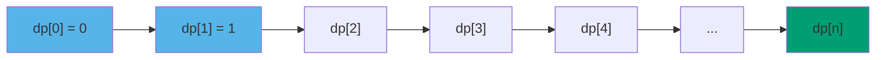
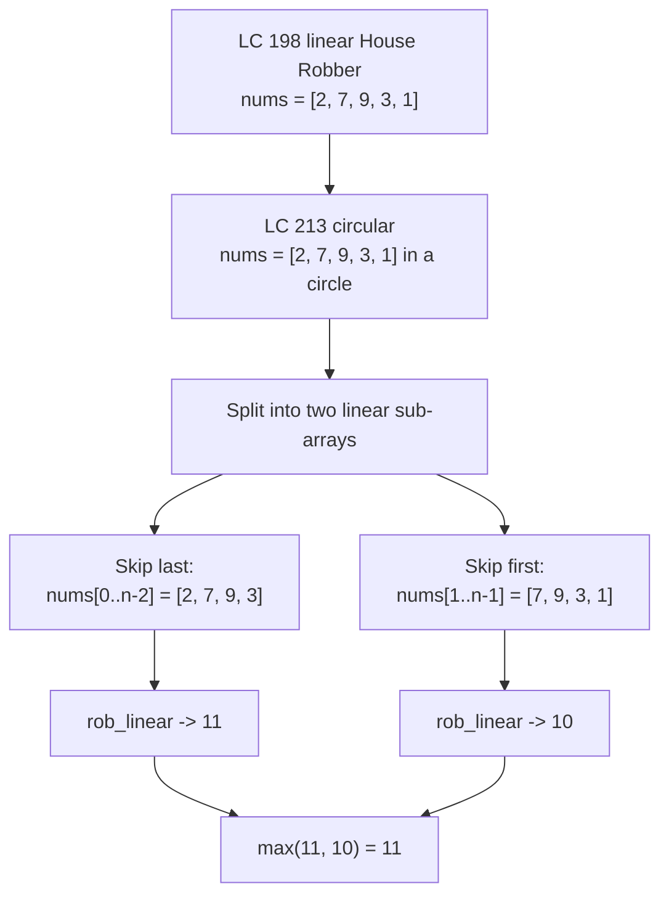

# DP: bottom-up tabulation

CPython's default recursion limit is 1000. LeetCode's input bound on a typical 1D-DP problem is 10⁴. The memoized Fibonacci you finished with at the end of [DP: from recursion to memoization](./00-dp-recursion-to-memo.md) is correct, fast in the asymptotic sense, and dies on `fib(2500)` with a `RecursionError` before it touches a single hidden test case. The rewrite that survives the test fleet is the one this chapter teaches: same recurrence, no recursion, an array filled left to right.

The interesting thing is how mechanical the rewrite is. Once you can name the dependency between subproblems and the order in which they have to be evaluated, the conversion from a memoized recursion to an iterative table is four steps and a loop body. The harder part is what comes next: noticing that the table you just built throws away every cell except the last two, and collapsing the array into a pair of scalars that drops space from O(n) to O(1). That collapse is what interviewers expect on every constant-state-window 1D recurrence in the problem set, and it's the keystone of this chapter.

## Why iterative beats recursive in production

Memoization is correct. So is the iterative version. The reason interviewers ask for the rewrite is the cost picture in three places.

The first is stack depth. Python's recursion limit is 1000 by default; the JVM's default thread stack is 512 KB, which fits roughly 5–15 thousand frames depending on the locals; Go's goroutine stack starts at 8 KB and grows on demand, but every grow event costs real time. A recurrence indexed by `i = 0, 1, ..., n` with naive recursion calls the function `n` times deep before the first base case fires. At `n = 10⁴` the Python version raises before it returns, regardless of the cache.[^1]

The second is constant factors. Function calls have overhead, frame setup and argument binding and return-value plumbing, and that overhead is paid `n` times in the memoized version even when every call is a cache hit. The iterative form pays for one loop variable and one array index per step. On Python the gap is roughly 3×; on the JIT'd languages it shrinks to maybe 1.5×, but it never reverses.[^2]

The third is the space optimization that bottom-up unlocks and top-down cannot. Once the table is filled in a known order, you can look at any cell and ask: when is it read for the last time? For the recurrence `dp[i] = f(dp[i-1], dp[i-2])`, the answer is "two iterations later". After that the cell is dead. Knowing which cells are dead is what lets you replace the entire array with two scalars. Top-down memoization stores every result indefinitely because it has no idea when the recursion will ask for it again.

So the rewrite is not pedantry. It is the thing that takes a correct algorithm and makes it run inside the test fleet, with constants small enough that the same Python solution that timed out at `n = 10⁴` finishes in milliseconds.

## The four-step conversion

Take any memoized recurrence. The conversion to iterative tabulation is four moves, in order.

### Step 1: name the dependency DAG

Every memoized function call produces a value that depends on a set of other calls. Draw that as a directed graph: a node per subproblem, an edge from each subproblem to each of the subproblems it directly depends on. For Fibonacci, `fib(i)` depends on `fib(i-1)` and `fib(i-2)`, so the graph has `n+1` nodes (`fib(0)` through `fib(n)`) and edges `i → i-1`, `i → i-2`. The graph is acyclic by construction; every dependency points at a strictly smaller index.



*Each cell points at the two cells it depends on; the graph is a DAG, which is the precondition for tabulation.*

The acyclic property is what makes the rest of the procedure work. If the dependency graph had a cycle, no evaluation order would ever find every dependency already computed. CLRS's Chapter 14 introduces this framing as the formal precondition for bottom-up DP: the algorithm requires "an order in which to fill in the table such that whenever we need to compute the value of a subproblem, all of the smaller subproblems on which it depends have already been computed."[^3]

### Step 2: pick a topological order

A topological order on the DAG is a linear sequence that respects every edge: every node appears after the nodes it depends on. For most 1D DP recurrences the order is trivial: smallest index first. Iterate `i = 0, 1, 2, ..., n` and the dependencies `dp[i-1]` and `dp[i-2]` are already computed by the time you evaluate `dp[i]`.

For 2D recurrences indexed by `(i, j)` the order is also trivial in most cases: row-major or column-major, depending on the recurrence. The order has to be discovered only when the dependency graph is genuinely irregular, and that's the case where bottom-up loses its appeal (more on that below).

### Step 3: replace recursion with a loop

Open the loop in the topological order from step 2. Inside the loop, evaluate the recurrence by reading from the cells already filled and writing to the current cell. Base cases get filled before the loop starts.

For Fibonacci the body is one line:

```text
dp[0] = 0
dp[1] = 1
for i from 2 to n:
    dp[i] = dp[i-1] + dp[i-2]
return dp[n]
```

The recurrence is the same one the memoized version had. Only the evaluation strategy changed.

### Step 4: replace the cache with an array

The memo dictionary in 9.0 was a dictionary because the recursion could ask for any subproblem in any order, and a dictionary's flexibility absorbs that. The loop only ever reads `dp[i-1]` and `dp[i-2]`, both with integer indices, in a known order. A flat array indexed by the integer subproblem index is strictly cheaper.

```python
def fib(n):
    if n < 2:
        return n
    dp = [0] * (n + 1)
    dp[1] = 1
    for i in range(2, n + 1):
        dp[i] = dp[i - 1] + dp[i - 2]
    return dp[n]
```

That's the textbook bottom-up form: O(n) time, O(n) space. The recursion is gone, the stack is gone, the function-call overhead is gone. What's left is one loop and one array, and a problem that used to time out now runs in microseconds.

## Worked example: LC 213 House Robber II

Houses sit in a circle. You rob a subset; you cannot rob two adjacent houses, and because the row is circular, the first and last houses count as adjacent. Maximize the total stolen.[^4]

The recurrence is the standard "rob or skip" choice, `dp[i] = max(dp[i-1], dp[i-2] + houses[i])`, but the circular adjacency between `houses[0]` and `houses[n-1]` breaks the linear formulation. If you rob the first house, you can't rob the last. If you skip the first, the last is back in play.

The reduction is a case-split on that single decision. Run the linear House Robber on `houses[0..n-2]` (the case where the last house is excluded) and again on `houses[1..n-1]` (the case where the first is excluded), and take the max. Both sub-passes are a clean linear DP with no circular constraint, and each one is the rolling-pair tabulation we just built.

```python
def rob(nums):
    n = len(nums)
    if n == 0:
        return 0
    if n == 1:
        return nums[0]
    if n == 2:
        return max(nums[0], nums[1])
    return max(_rob_linear(nums[:-1]), _rob_linear(nums[1:]))


def _rob_linear(houses):
    prev2, prev1 = 0, 0
    for x in houses:
        prev2, prev1 = prev1, max(prev1, prev2 + x)
    return prev1
```

**Solution** — Python ([Java](./01-dp-bottom-up-tabulation/lc-213/sol.java) · [C++](./01-dp-bottom-up-tabulation/lc-213/sol.cpp) · [Go](./01-dp-bottom-up-tabulation/lc-213/sol.go))

```python
# LC 213. House Robber II
from typing import List


def rob(nums: List[int]) -> int:
    """LC 213 House Robber II. Circular -> two linear sub-passes, max of both."""
    n = len(nums)
    if n == 0:
        return 0
    if n == 1:
        return nums[0]
    if n == 2:
        return max(nums[0], nums[1])
    # skip last, then skip first; the circular adjacency is broken in each pass
    return max(_rob_linear(nums[:-1]), _rob_linear(nums[1:]))


def _rob_linear(houses: List[int]) -> int:
    """Linear House Robber I via rolling-pair tabulation, O(1) space.

    Recurrence: dp[i] = max(dp[i-1], dp[i-2] + houses[i]).
    Only the last two values matter, so carry (prev2, prev1).
    """
    prev2, prev1 = 0, 0
    for x in houses:
        prev2, prev1 = prev1, max(prev1, prev2 + x)
    return prev1
```

The `n <= 2` branch matters more than it looks. If you trust the reduction without checking, `nums = [5]` evaluates `max(_rob_linear([]), _rob_linear([]))`, which is `max(0, 0) = 0` instead of the correct `5`. Both sub-arrays are empty; both linear passes return 0; the function silently undercounts on every single-element circle. Stack Overflow has the exact bug filed against the canonical solution, with the fix being the three-line guard.[^5]



*The circular adjacency is broken in each sub-pass by dropping one of the boundary houses; the answer is the max of the two linear results.*

Trace the whole thing on `nums = [2, 7, 9, 3, 1]`. The skip-last sub-pass runs `_rob_linear([2, 7, 9, 3])`: starting from `(prev2, prev1) = (0, 0)`, the rolling pair walks `(0, 2)`, `(2, 7)`, `(7, 11)`, `(11, 11)`, returning 11. The skip-first sub-pass runs `_rob_linear([7, 9, 3, 1])` and returns 10. Final answer: `max(11, 10) = 11`. Two linear scans, each O(n) time and O(1) space, total O(n) time and O(1) space.

## Tracing the table fill

The widget below animates the inner primitive, bottom-up Fibonacci on `n = 8`, because Fibonacci is the cleanest two-state recurrence in DP and the side-by-side rolling-pair view makes the space-collapse argument visible in pixels. The chapter 9.0 panel of the same widget shows the same input solved by memoized recursion; flipping between the two panels is the lesson.

> **Interactive widget:** [DP table fill](../widgets/w-31-dp-table-fill.yml) (panel `panel-b`) — rendered on the website; the YAML spec describes the keyframes.

*Static fallback: dp[0..8] starts empty; the base cases dp[0] = 0 and dp[1] = 1 fill in; the loop fills dp[2] through dp[8] left-to-right, each cell reading the two cells immediately to its left. A two-cell rolling-pair strip below the array tracks (dp[i-1], dp[i]) at every step. Both the full array and the two-cell strip end at 21.*

The visual to focus on is what happens to the cells behind the read frontier. By the time the loop is computing `dp[5]`, it reads `dp[4]` and `dp[3]` and never reads `dp[2]`, `dp[1]`, or `dp[0]` again. Those three cells are dead memory. The full `dp` array stores them anyway; the rolling-pair strip below doesn't. That's the picture the next section turns into a code change.

## Rolling-pair compression: from O(n) to O(1) space

The full-array form is correct and easy to read. It is also strictly more memory than the algorithm needs. For any recurrence whose state depends only on a constant number of recent cells, the dead cells behind the read frontier can be dropped, and the array can be replaced with a fixed-size set of scalars equal to the dependency window.

For the Fibonacci recurrence the window is two cells: `dp[i-1]` and `dp[i-2]`. Carry them as `prev1` and `prev2` and update in lock-step:

```python
def fib(n):
    if n < 2:
        return n
    prev2, prev1 = 0, 1                # dp[0], dp[1]
    for _ in range(2, n + 1):
        prev2, prev1 = prev1, prev2 + prev1
    return prev1
```

Same algorithm, same answer, O(n) time, O(1) space. The space cut is a constant-factor improvement in the asymptotic sense and a hard requirement in practice: `n = 10⁹` is impossible with an O(n) array and trivial with two scalars. CLRS frames this as "a tradeoff between time and space" in §14.3 and notes that asymptotic time stays O(n); only the constant in space changes.[^3]

The compression carries one risk worth naming: it makes traceback impossible. If the problem also asks "*which* houses did you rob", the rolling pair has thrown away the per-cell decisions, and recovering the answer requires the full table. Pure-value problems (LC 198, 213, 740, 1937, almost every Easy/Medium 1D-DP) are fine with the compression. Reconstruction problems (LC 72 edit distance, LC 300 LIS in its alignment-recovery form) keep the array.

The rolling-pair update in Python uses tuple-assignment, which evaluates the right-hand side in full *before* writing to either left-hand variable. That atomicity is what prevents the off-by-one trap discussed below in the pitfalls section. Java, C++, and Go don't have tuple-assignment; the equivalent there is to compute the new value into a local first and then shift:

```java
int curr = Math.max(prev1, prev2 + nums[i]);
prev2 = prev1;
prev1 = curr;
```

Same shape. Different syntax. Same trap if you get the order wrong.

## What it actually costs

| Variant | Time | Space | Notes |
|---|---|---|---|
| Naive recursion (the 9.0 starting point) | O(φ^n) ≈ O(1.618^n) | O(n) call stack | exponential blowup; dies before n = 50[^6] |
| Memoized recursion (the 9.0 endpoint) | O(n) | O(n) memo + O(n) call stack | correct but stack-bound at n ≈ 1000 in Python[^1] |
| Bottom-up table | O(n) | O(n) | the textbook canonical form |
| **Bottom-up rolling pair** | **O(n)** | **O(1)** | the interview default |
| House Robber II circular | O(n) | O(1) | two linear sub-passes, each rolling-pair[^4] |

The asymptotic time is O(n) across the four bottom-up rows; what changes is the constant and the space. For the rolling-pair form on Fibonacci, the constant is roughly two adds and one assignment per step. That's the floor.

## When tabulation fails

Bottom-up isn't always the right answer. The procedure depends on knowing the topological order of subproblems before you start, and there are recurrences where the order is genuinely hard to enumerate.

Matrix-chain multiplication is the textbook counter-example. The recurrence is `m[i][j] = min over k of (m[i][k] + m[k+1][j] + cost)`, which depends on every shorter sub-chain inside `[i, j]`. The bottom-up version has to fill the table in order of increasing chain length: a nested loop where the outer index is `len = 2, 3, ..., n` and the inner indices are `(i, j) = (i, i + len - 1)`, and getting the loop nesting right takes thought. Top-down memoization has no such constraint: the recursion explores subproblems lazily, in whatever order the answer needs, and the cache prevents recomputation. Erickson calls this the canonical case where "memoize first, tabulate later" is the right discipline, because it lets you prove correctness on the easier formulation before optimizing.[^7]

The signal: if you can write the recurrence in two minutes but can't enumerate the topological order in three, ship the memoized version. Bottom-up is a tax you pay only when the order is obvious or the constant-factor win is critical.

## Two pitfalls that bite

> [!WARNING]
> **The rolling-pair update order.** Writing `prev2 = prev1; prev1 = max(prev1, prev2 + nums[i]);` in two statements reads `prev2` after it was just overwritten with the old `prev1`, so the formula evaluates to `max(prev1, prev1 + nums[i]) = prev1 + nums[i]`. The bug passes most short tests because the greedy-take answer often happens to be optimal. Either use Python's atomic tuple-assign (`prev2, prev1 = prev1, max(prev1, prev2 + x)`), or in Java, C++, and Go, compute the new value into a local first and then shift. Multiple LC discuss threads on House Robber's O(1)-space variant document the exact ordering bug.[^5]

> [!WARNING]
> **Inverting the iteration direction.** If you carry the top-down recurrence `f(i) = max(f(i+1), f(i+2) + nums[i])` ("from house i, skip to i+1 or take and skip to i+2") into bottom-up code without rewriting it, the loop reads `dp[i+1]` and `dp[i+2]` instead of `dp[i-1]` and `dp[i-2]`. A left-to-right loop now reads uninitialized cells; the answer is silently wrong. Rewrite the recurrence with the iteration direction baked in: "I'm filling `dp[i]` after `dp[0..i-1]` are known," so `dp[i] = max(dp[i-1], dp[i-2] + nums[i])`. OpenDSA's DP chapter walks the reader through this transformation explicitly because it's the one piece that has no mechanical translation from the recursive form.[^8]

A third trap, less dramatic but worth flagging: in LC 740 Delete and Earn, the implementer recognizes "House Robber on adjacent values" but skips the bucket-by-value transformation. Sorting and de-duplicating the input gives `[2, 3, 4]` for `nums = [2, 2, 3, 3, 3, 4]`, and House Robber on `[2, 3, 4]` returns 6. The correct answer is 9 (take all three 3s, eliminating both 2s and the 4). The fix is to build `earn[v] = v * count(v)` as a dense array indexed by *value*, then run the rolling-pair on `earn[]`. The adjacency is on the integer-value axis, not on the input-position axis.

## Problem ladder

### CORE (solve all three to claim chapter mastery)

- [LC 213 — House Robber II](https://leetcode.com/problems/house-robber-ii/) [Medium] • dp-1d-rolling ★
- [LC 740 — Delete and Earn](https://leetcode.com/problems/delete-and-earn/) [Medium] • dp-1d-rolling
- [LC 1937 — Maximum Number of Points with Cost](https://leetcode.com/problems/maximum-number-of-points-with-cost/) [Medium] • dp-1d-rolling *(reference: Python only)*

LC 213 is the chapter signature (★) and the cleanest demonstration of a structural twist riding on the rolling-pair primitive. LC 740 teaches the meta-skill of recognizing a 1D-DP shape under a non-obvious surface form. LC 1937 generalizes the rolling-pair from "previous two cells" to "previous row," previewing the rolling-row variant that lands properly in [DP: 2D problems on grids](./06-lcs.md).

All three sit at Medium. The chapter ships with the `single-difficulty-band` curation flag because the canonical interview vehicles for "1D linear DP with constant-state-window recurrence solved by bottom-up tabulation" are all Medium at LC; the obvious Easy candidates (LC 70, LC 509) are owned by 9.0 and 9.2, and the Hard 1D-DP problems pull in either bitmask state, segment-tree maintenance, or substantively different recurrences belonging to later chapters.

## Where this leads

The linear House Robber primitive that powers every sub-pass here gets its first-principles treatment in [DP on a 1D array: the classic patterns](./02-dp-1d.md), alongside Climbing Stairs, Kadane's algorithm for max subarray sum, and the rest of the linear-DP cookbook. The rolling-row generalization, "drop everything except the previous row," is the bridge into [DP: 2D problems on grids](./06-lcs.md), where each row is a full sweep and the recurrence touches a constant number of recent rows. Edit distance and LCS, in [DP: longest common subsequence](./06-lcs.md) and [DP: edit distance](./07-edit-distance.md), are the other end of that road: 2D tables that need full traceback, where the rolling-row trick stops being available because the table itself is the construction.

## References

[^1]: Python `sys.setrecursionlimit` defaults to 1000 in CPython; a memoized recurrence indexed by `i = 0..n` recurses `n` deep before the first base case fires, so any input with `n > ~990` raises `RecursionError` regardless of cache contents. Documented at <https://docs.python.org/3/library/sys.html#sys.setrecursionlimit>.

[^2]: OpenDSA Virginia Tech, *Data Structures & Algorithms*, §5.10 "Dynamic Programming," <https://opendsa-server.cs.vt.edu/ODSA/Books/eu_book/html/DynamicProgramming.html>.

[^3]: Cormen, Leiserson, Rivest, Stein, *Introduction to Algorithms*, 4th ed., MIT Press, 2022, Chapter 14 "Dynamic Programming," §14.3.

[^4]: LC 213 House Robber II problem statement and difficulty verified via the leetcode.ca mirror at <https://leetcode.ca/all/213.html>.

[^5]: Stack Overflow Q72597591, *LeetCode question: House Robber II The code does not return correct output*, <https://stackoverflow.com/questions/72597591/leetcode-question-house-robber-ii-the-code-does-not-return-correct-output>.

[^6]: Erickson, *Algorithms*, Chapter 3 "Dynamic Programming," <https://jeffe.cs.illinois.edu/teaching/algorithms/book/03-dynprog.pdf>.

[^7]: AlgoMaster, *House Robber II* explainer, <https://algomaster.io/learn/dsa/house-robber-ii>.

[^8]: OpenDSA Virginia Tech, §5.10.2, same source as [^2].
