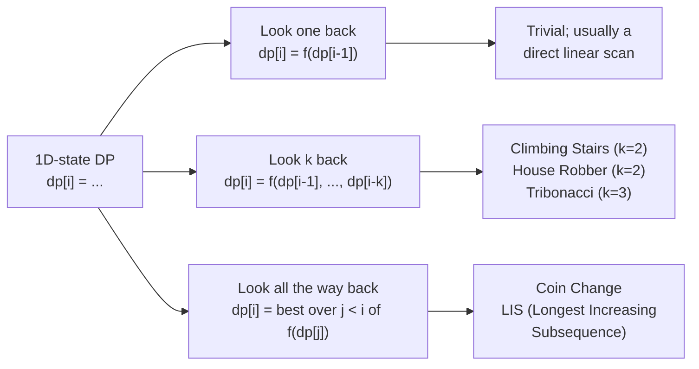
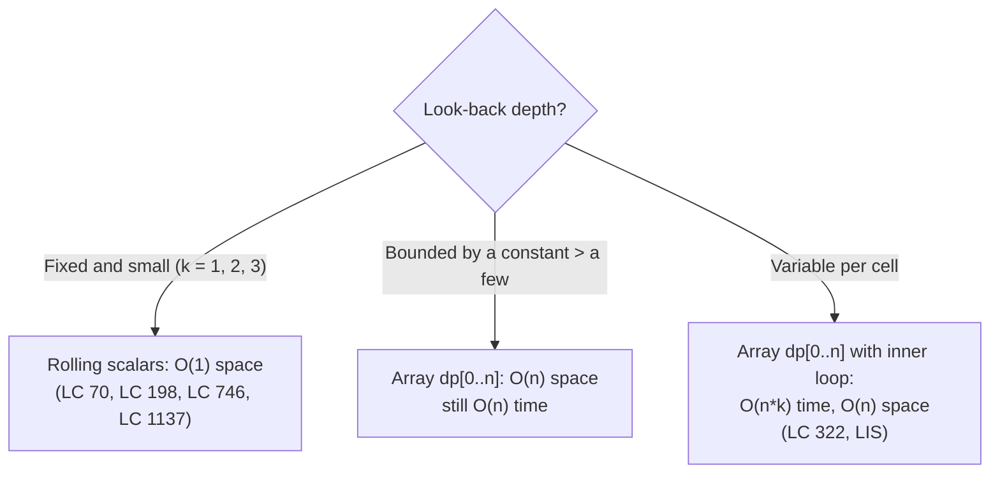

# Dynamic programming on a 1D state

In 1957, Richard Bellman wrote down a sentence that became the principle of optimality: an optimal policy has the property that whatever the initial state and initial decision, the remaining decisions must constitute an optimal policy with respect to the state resulting from the first decision. Strip the rhetoric and the engineering content is one line. **If the best answer at position `i` is built out of best answers at earlier positions, you can compute it left to right and never look back further than the recurrence forces you to.**

That sentence is the entire chapter. Every algorithm below is a 1D array of cells where each cell asks "what's the best I can do up to here", computes itself from one or two earlier cells, and forgets everything older. The differences between Climbing Stairs, House Robber, and Min Cost Climbing Stairs reduce to three knobs: the combiner (`+` or `max` or `min`), what the cell itself contributes (a count, a value taken, a cost paid), and how far back the recurrence reaches. Get those three knobs right and a hundred LeetCode problems collapse into one shape.

## What "1D state" actually means

A DP solution has *1D state* when each subproblem is identified by a single integer index. The table is `dp[0..n]`, the recurrence reads from a few earlier entries, and the answer falls out of the last cell (or the second-to-last; we'll get to the off-by-one). This is the simplest non-trivial DP and the one that does the most work in interview rotation.[^1]

The signal in problem prose is unmistakable. The input is one linear sequence: an array of values, a list of costs, a staircase of `n` steps. The constraint is local: no two adjacent, any two reachable in one step or two, any choice that pays the current cost. The asked output is a single optimum: max, min, or count. When all three signals fire, write `dp[i]` first and ask what the recurrence is second. Greedy will fail on at least half of these problems, and recursion without memoization will time out on the rest.[^2]

[Recursion to memoization](./00-dp-recursion-to-memo.md) introduced the recursion-with-overlapping-subproblems framing; [Bottom-up tabulation](./01-dp-bottom-up-tabulation.md) walked the conversion from a memo to an iterative array. This chapter starts with the iterative form already in hand and asks a different question: what does the recurrence actually look like once you commit to 1D state, and how do you tell the variants apart on sight.

## The three look-back shapes



*Almost every 1D-state recurrence falls into one of three depths. The "look k back" family with `k = 2` is the bulk of this chapter. The "look all the way back" family is the bridge from 1D DP to the more expensive O(n²) shapes; it shows up later in [Coin change](./05-knapsack-unbounded.md) and [Longest increasing subsequence](./08-lis-quadratic.md).*

A cell that looks one back is rarely worth calling DP. The recurrence is a running aggregate, and a single accumulator handles it. A cell that looks `k` back, where `k` is a small constant, is the sweet spot: the recurrence has just enough memory to encode a local choice, and the table compresses to a fixed number of scalars. A cell that looks all the way back is genuine DP with an inner loop; the time becomes O(n²), and the optimization story is harder. This chapter lives in the middle column.

## Climbing stairs (LC 70)

The cleanest 1D DP in the catalogue. You're at the bottom of `n` stairs. Each move climbs one step or two. How many distinct sequences of moves reach the top?

The recurrence falls out of one observation. The last move into step `n` is either a one-step (preceded by some sequence ending at `n-1`) or a two-step (preceded by some sequence ending at `n-2`). Those two cases don't overlap, since they end with different last moves, so the count at `n` is the sum:

```text
ways[n] = ways[n - 1] + ways[n - 2]
```

That is the Fibonacci recurrence shifted by one index.[^3] The base cases earn their own paragraph in §"Pitfalls" below; for now, `ways[0] = ways[1] = 1`. The implementation is five lines:

```python
def climb_stairs(n: int) -> int:
    a, b = 1, 1                      # a = ways[i-2], b = ways[i-1]
    for _ in range(n):
        a, b = b, a + b
    return b
```

`a` and `b` are the rolling scalars. After `n` iterations, `b` holds `ways[n]`. The full table `ways[0..n]` is never materialised because no cell deeper than `i - 2` is ever read. Space is two integers.

LC 70 is the chapter's gentle entry. It teaches the shape (recurrence, base case, rolling collapse) without forcing a decision per cell. There's no choice; both predecessors contribute their counts, and the combiner is `+`. The problem is a counting problem, not an optimization. The rest of the chapter is what happens when each cell has to *pick*.

## House robber (LC 198)

The prototype. Houses sit in a line, each holds some loot, and an alarm system trips if you rob two adjacent houses on the same night. Pick a non-adjacent subset that maximises the take.

```python
def rob(nums):
    prev2, prev1 = 0, 0
    for x in nums:
        prev2, prev1 = prev1, max(prev1, prev2 + x)
    return prev1
```

**Solution** — Python ([Java](./02-dp-1d/lc-198/sol.java) · [C++](./02-dp-1d/lc-198/sol.cpp) · [Go](./02-dp-1d/lc-198/sol.go))

```python
# LC 198. House Robber
def rob(nums: list[int]) -> int:
    """LC 198 House Robber: max sum of non-adjacent elements.
    Two-options-per-cell DP: at each house, take + dp[i-2] OR skip = dp[i-1].
    O(n) time, O(1) space (rolling pair).
    """
    prev2, prev1 = 0, 0
    for x in nums:
        prev2, prev1 = prev1, max(prev1, prev2 + x)
    return prev1
```

The recurrence has a single crisp sentence behind it. At house `i`, you have two options. **Take it**, in which case house `i-1` was off-limits and the loot up to `i` is `dp[i-2] + nums[i]`. **Skip it**, in which case the loot up to `i` is whatever it was up to `i-1`, namely `dp[i-1]`. The optimal `dp[i]` is the better of the two:

```text
dp[i] = max(dp[i - 1], dp[i - 2] + nums[i])
```

This is the canonical *take-or-skip* 1D recurrence. Demaine, Ku, and Solomon teach it in MIT 6.006 as the Bowling problem, where each pin has a value, knocking pin `i` forfeits pin `i-1`, and you want the maximum knocked-pin total.[^4] The pins are renamed houses; the recurrence is identical. Kleinberg and Tardos use the same shape under the name *weighted interval scheduling*.[^5]

Two things distinguish House Robber from Climbing Stairs and earn it the prototype slot.

The first is that the cell's own value enters only one branch. `nums[i]` shows up in the take branch and is absent from the skip branch. That asymmetry is what makes the algorithm an *optimization* rather than a count. The combiner became `max` to match.

The second is that greedy fails. The temptation on a fresh look at this problem is to take the alternating subset, even indices or odd indices, whichever sums to more. On `nums = [2, 1, 1, 2]` the parity-greedy returns 3 (either `[2, 1]` or `[1, 2]`), but the optimal pick is *take, skip, skip, take* for a sum of 4.[^6] AlgoMaster's House Robber walkthrough leads with this exact counter-example. The optimal subset is *not* periodic; only the recurrence sees that. Any time you find yourself reaching for "alternate every other element" on a take-or-skip problem, the recurrence is the correction.

The space collapse is the same trick as Climbing Stairs. `dp[i]` reads `dp[i-1]` and `dp[i-2]` and nothing older, so two scalars suffice. The Python tuple-swap is the cleanest expression; in Java, C++, and Go, you compute `cur` into a fresh variable first and then shift, because those languages evaluate the right-hand side after the left-hand side updates and an order bug there silently corrupts the recurrence on every iteration.

## Min cost climbing stairs (LC 746)

A min-combiner cousin to LC 70 with a cost on every step. The input `cost[0..n-1]` is the price you pay if you stand on step `i`. You can start from step 0 or step 1. From any step you take a one-step or a two-step. The destination is the floor *above* step `n-1`, that is, position `n`. Minimise the total cost.

The recurrence is a cell-wise minimum over the two ways to arrive:

```text
dp[i] = min(dp[i - 1] + cost[i - 1], dp[i - 2] + cost[i - 2])     for i >= 2
dp[0] = dp[1] = 0
return dp[n]
```

Two things to register. The combiner is `min` rather than `max`. And the answer is `dp[n]`, not `dp[n-1]`, because the destination is one position past the last paid step.[^7]

```python
def min_cost(cost):
    n = len(cost)
    a, b = 0, 0                       # dp[0] = dp[1] = 0
    for i in range(2, n + 1):
        a, b = b, min(b + cost[i - 1], a + cost[i - 2])
    return b
```

LC 746 sits between LC 70 and LC 198 on the difficulty curve. It looks like LC 70 from a distance: same staircase, same one-or-two move set. It carries LC 198's per-cell decision shape, just with a `min` instead of a `max` and a paid-step cost instead of a free counted step. Three problems, one recurrence template, three knobs turned differently.

## When the window grows: rolling vs array

The three problems above all have a fixed look-back of 2, so two rolling scalars are enough. The general form is `k` scalars when the look-back is fixed at `k`. Tribonacci (LC 1137) is the next step up: `T(n) = T(n-1) + T(n-2) + T(n-3)` runs on three rolling integers.[^8]

The array form is what you reach for when the look-back is no longer constant. Coin Change asks for the minimum number of coins summing to `amount`; the recurrence at `dp[a]` looks at `dp[a - c]` for every coin denomination `c`. The window has the size of the coin set, and the coin set isn't bounded by a constant. The full `dp[0..amount]` table stays in memory; rolling buys you nothing because every entry might be revisited. [Coin change](./05-knapsack-unbounded.md) develops this case in full.

The dividing line is concrete. Fixed look-back of `k = O(1)` collapses to `k` scalars. Variable look-back keeps the array. Confuse the two and you'll either burn O(n) space on a problem that needed O(1), or worse, you'll try to roll a window that doesn't have a fixed shape and end up reading uninitialised cells.



*The rolling collapse depends on the dependency window being fixed and small. Once the window varies per cell or grows with the input, the array is back.*

## What it actually costs

| Variant            | Time      | Space     | Notes                                                                 |
|--------------------|-----------|-----------|-----------------------------------------------------------------------|
| Tabulated array    | O(n)      | O(n)      | The straightforward implementation; one cell per index.               |
| Rolling scalars    | O(n)      | O(1)      | Fixed look-back of 2; only the last two cells are ever read.[^9]      |
| Memoized recursion | O(n)      | O(n)      | Top-down equivalent; the call stack pays the space cost.              |
| Naive recursion    | O(2^n)    | O(n) stack | What you get without memoization; tree of calls re-explores everything.[^10] |

Each cell is computed once and reads two earlier cells, so the per-cell work is constant and the total work is Θ(n). The space drop from Θ(n) to Θ(1) is the load-bearing optimisation: it's the same trick that turns the textbook Fibonacci recurrence into a two-variable loop, and it generalises to any 1D DP whose look-back is a fixed small constant.[^11]

## Pitfalls

> [!WARNING]
> **`f(0) = 0` on Climbing Stairs.** The off-by-one bug that bites every reader writing the recurrence for the first time. Setting `f(0) = 0` makes `f(2) = f(1) + f(0) = 1`, which is wrong; the correct answer is 2 (one-plus-one or two). The convention is that there is exactly one way to do nothing, so `f(0) = 1`. Verify on `n = 2` before trusting any Climbing Stairs code you wrote.[^3]

> [!WARNING]
> **Returning `dp[n-1]` on Min Cost Climbing Stairs.** The destination is one position past the last paid step. On `cost = [10, 15, 20]`, the bug returns 20 (cost to step 2) instead of 15 (cost to the floor reached from step 1 via a two-step). The fix is to size the table `dp[0..n]` and return `dp[n]`. The LeetCode problem statement is unfortunately easy to misread on this exact point; LC-Feedback issue #440 is an entire thread of testers arguing the official answer is wrong before realising the destination is past the end of the array.[^7]

A third trap, harder to call a pitfall but worth a sentence. In Java, C++, and Go, the rolling pair must be updated through a temporary, not in place. Writing `prev1 = max(prev1, prev2 + x); prev2 = prev1` corrupts the recurrence on the next iteration because the second statement reads the just-updated `prev1`. Python's tuple-swap dodges this by evaluating the entire right-hand side first; the other three languages need an explicit `cur` variable. The reference implementation above does it the safe way.

## Problem ladder

### CORE (solve all to claim chapter mastery)

- [LC 70 — Climbing Stairs](https://leetcode.com/problems/climbing-stairs/) [Easy] • dp-1d-fibonacci-counting ★
- [LC 198 — House Robber](https://leetcode.com/problems/house-robber/) [Medium] • dp-1d-take-or-skip

### STRETCH (optional)

- [LC 746 — Min Cost Climbing Stairs](https://leetcode.com/problems/min-cost-climbing-stairs/) [Easy] • dp-1d-min-cost-step

The Hard problems in the 1D-DP family live in the next three chapters by design. [Decode ways and word break](./03-dp-decode-word-break.md) owns the count-with-validity shape (LC 91, LC 139). [Partition and subset sum](./04-knapsack-01.md) owns the Boolean-feasibility shape on a numeric target. [Coin change](./05-knapsack-unbounded.md) owns the unbounded-look-back shape. Reading this chapter and following any cross-reference walks you to a Hard 1D-DP problem within two chapters.

## Where this leads

Three branches lead away from here.

When the recurrence has to gate each option behind a validity check (the substring at position `i` is a valid encoding *and* `dp[i-2]` was reachable, the prefix is a valid word *and* the rest segments cleanly), the shape is still 1D, but each "option" carries a predicate. [Decode ways and word break](./03-dp-decode-word-break.md) is the count-with-validity flavour and the gateway to the trickier 1D problems.

When the cell's value can be picked any number of times rather than just once, the look-back stops being fixed at `k = 2` and stretches over an entire denomination set. [Coin change](./05-knapsack-unbounded.md) is the canonical unbounded-look-back problem, and the shape recurs in [Longest increasing subsequence](./08-lis-quadratic.md) where each cell scans every smaller index.

When the input becomes two-dimensional, with two strings, a grid, or a string and a pattern, the same take-or-skip decision shows up on a 2D table. [Longest common subsequence](./06-lcs.md) is the cleanest entry; the recurrence is `dp[i][j] = max(dp[i-1][j], dp[i][j-1], dp[i-1][j-1] + 1 if match else 0)`, and you'll recognise the take-vs-skip branches on sight.

## References

[^1]: Bellman, R., *Dynamic Programming*, Princeton University Press, 1957. The principle of optimality is Bellman's original phrasing; carried in [Bellman equation, Wikipedia](https://en.wikipedia.org/wiki/Bellman_equation).

[^2]: takeUforward (Striver), *Dynamic Programming Introduction Tutorial*, [takeuforward.org/data-structure/dynamic-programming-introduction](https://takeuforward.org/data-structure/dynamic-programming-introduction/)

[^3]: walkccc, *LeetCode Solutions*, [Problem 70 Climbing Stairs](https://walkccc.me/LeetCode/problems/70/)

[^4]: Demaine, E.; Ku, J.; Solomon, J., MIT 6.006 *Introduction to Algorithms* (Spring 2020), Lecture 15 "Dynamic Programming, Part 1: SRTBOT, Fib, DAGs, Bowling," [MIT OpenCourseWare](https://ocw.mit.edu/courses/6-006-introduction-to-algorithms-spring-2020/resources/lecture-15-dynamic-programming-part-1-srtbot-fib-dags-bowling/).

[^5]: Kleinberg, J.; Tardos, É., *Algorithm Design*, Pearson, 2005, Chapter 6 §6.1 (Weighted Interval Scheduling).

[^6]: AlgoMaster.io, ["House Robber"](https://algomaster.io/learn/dsa/house-robber), accessed 2026-05-20. Source for the `[2, 1, 1, 2] → 4` parity-greedy counter-example.

[^7]: LC-Feedback issue #440, ["746. Min Cost Climbing Stairs, wrong testcase"](https://github.com/LeetCode-Feedback/LeetCode-Feedback/issues/440)

[^8]: walkccc, *LeetCode Solutions*, [Problem 1137 N-th Tribonacci Number](https://walkccc.me/LeetCode/problems/1137/), accessed 2026-05-20. Verified the three-rolling-scalars form for fixed look-back of 3.

[^9]: Cormen, Leiserson, Rivest, Stein, *Introduction to Algorithms*, 4th ed., MIT Press, 2022, Chapter 14 §14.2 (matrix-chain template).

[^10]: Erickson, J., *Algorithms*, free online textbook, [jeffe.cs.illinois.edu/teaching/algorithms](https://jeffe.cs.illinois.edu/teaching/algorithms/)

[^11]: CP-Algorithms, ["Dynamic programming"](https://cp-algorithms.com/dynamic_programming/intro-to-dp.html)
