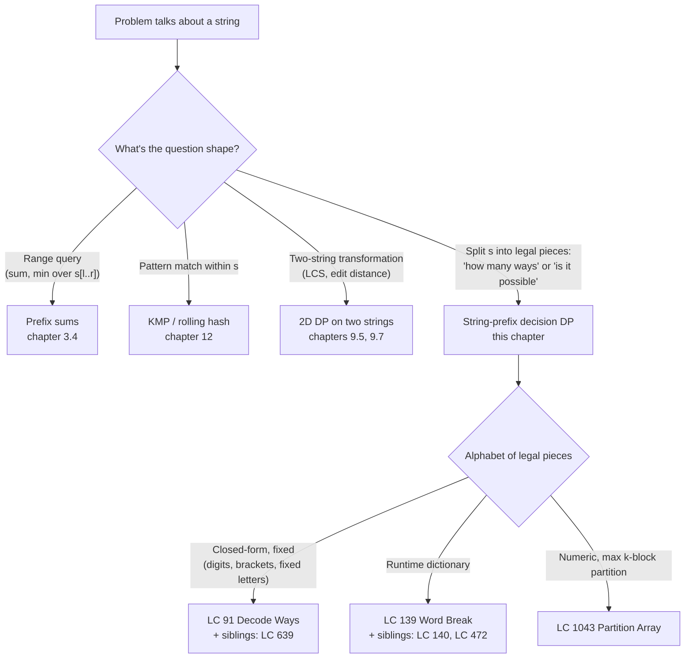
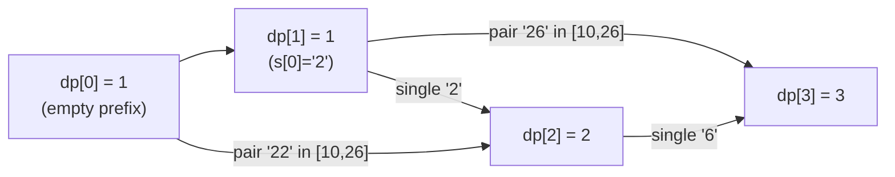
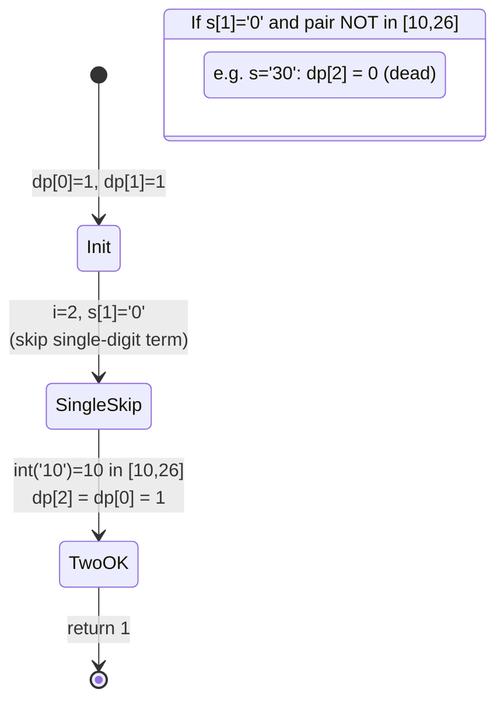

# Decode Ways and Word Break: string-prefix decision DP

LC 91 *Decode Ways* sits at roughly a 35% LeetCode acceptance rate.[^1] Two-thirds of attempts get it wrong. The problem looks short. Given a digit string like `"226"`, count how many ways to decode it under the mapping `1→A, 2→B, ..., 26→Z`, and the recurrence is two lines once you see it. The reason it bites is the `'0'` rule: `'0'` alone has no letter, so it must always attach backward to a `'1'` or `'2'`, and that single constraint nukes the most natural recurrence on inputs like `"10"`, `"06"`, and `"30"`.

LC 139 *Word Break* asks something that sounds different. Given `s = "leetcode"` and `wordDict = ["leet", "code"]`, can `s` be split into a sequence of dictionary words? The recurrence is the same shape. Stand at position `i` in the string. Look back at every position `j < i` where the prefix `s[:j]` already has an answer. For each such `j`, ask whether the slice `s[j:i]` is a legal piece. Aggregate across the `j`s. That's it. For Decode Ways the legal pieces are digits in `1..9` and digit pairs in `10..26`; for Word Break they're whatever's in the dictionary. One template, two alphabets.

This chapter teaches that template under the name **string-prefix decision DP**.

## Locating this pattern



*The trigger for this chapter is a string question that asks for a count of valid splittings or a yes/no decision over splittings. Never a range aggregate, never a transformation. Once you're on the right branch, all that changes between problems is what counts as a legal piece.*

## Why brute force burns

Decode Ways' obvious first attempt enumerates every cut. Try to split off one digit; recurse. Try to split off two digits; recurse. Add the counts.

```python
# Brute force: O(2^n) — what we're replacing
def num_decodings_brute(s):
    if not s:
        return 1
    if s[0] == "0":
        return 0
    total = num_decodings_brute(s[1:])                 # take one digit
    if len(s) >= 2 and 10 <= int(s[:2]) <= 26:
        total += num_decodings_brute(s[2:])            # take two digits
    return total
```

Correct on every input. Catastrophic on length. The recursion tree has roughly the Fibonacci shape (at each node, up to two children), so the call count is `O(phi^n)`. At `n = 35` it's about 30 million calls; at `n = 100` (Decode Ways' upper bound) the heat death of the universe arrives first.

The waste is visible by hand. Run the recursion on `"22622"`. The string `"622"` is computed when the algorithm takes one digit from `"22622"` and recurses, *and* it's computed again when the algorithm takes two digits (`"22"`) and recurses on `"622"`. Same suffix, two arrival paths, two full subtree expansions. Generalize that to every position and the explosion is the algorithm doing the same subproblem `O(phi^k)` times for each suffix of length `k`.

The fix is the move every chapter in Part 9 makes. Stop recomputing. Cache each suffix's answer the first time you compute it, and reuse the cached value forever after. The recursion tree collapses to a DAG with `n + 1` nodes (one per suffix length) and the runtime drops to `O(n)`. [Part 9.0 — recursion to memoisation](./00-dp-recursion-to-memo.md) walks the lift formally; here we go straight to the bottom-up form, which is what every interview answer wants.

## The recurrence, written once

Both LC 91 and LC 139 want a `dp` array indexed by **prefix length**. `dp[i]` is the answer for the prefix `s[:i]`, the first `i` characters. `dp[0]` is the empty prefix.

For Decode Ways, `dp[i]` counts decodings:

```text
dp[i] = (dp[i-1]   if s[i-1] != '0'        else 0)            # take 1 digit
      + (dp[i-2]   if 10 <= int(s[i-2:i]) <= 26  else 0)      # take 2 digits
```

For Word Break, `dp[i]` is a Boolean: is the prefix `s[:i]` segmentable?

```text
dp[i] = OR over j in [max(0, i - L_max), i)  of
        (dp[j] AND s[j:i] in dictionary)
```

Same shape. Stand at prefix length `i`, look back at the prefix lengths `j` that could have been the previous boundary, demand that the slice `s[j:i]` is one of the legal pieces, and combine. Decode Ways' "combine" is sum (count of decodings); Word Break's is OR (existence of a segmentation).[^2]

The base case is the only line beginners get wrong on Word Break. `dp[0] = True`. The empty prefix is segmentable into zero dictionary words, the same way an empty product is `1` and an empty sum is `0`. Set `dp[0] = False` and the recurrence telescopes everything to `False`. CLRS' framing of one-cell base subproblems (the trivial case takes whatever value makes the recurrence work, no more) is what's at stake here.[^3]

## Decode Ways: the pattern

```python
def num_decodings(s: str) -> int:
    n = len(s)
    if n == 0 or s[0] == "0":
        return 0
    # Rolling window: only prev2 = dp[i-2] and prev1 = dp[i-1] live across iters.
    prev2, prev1 = 1, 1
    for i in range(2, n + 1):
        cur = 0
        if s[i - 1] != "0":                            # single-digit decode
            cur += prev1
        two = int(s[i - 2 : i])                        # two-digit decode
        if 10 <= two <= 26:
            cur += prev2
        prev2, prev1 = prev1, cur
    return prev1
```

**Solution** — Python ([Java](./03-dp-decode-word-break/lc-91/sol.java) · [C++](./03-dp-decode-word-break/lc-91/sol.cpp) · [Go](./03-dp-decode-word-break/lc-91/sol.go))

```python
# LC 91. Decode Ways


def num_decodings(s: str) -> int:
    """LC 91 Decode Ways. Return the number of ways to decode digit string s.

    dp[i] = number of decodings of the prefix s[:i].
    Rolling-window: only prev2 = dp[i-2] and prev1 = dp[i-1] live across iters.
    """
    n = len(s)
    if n == 0 or s[0] == "0":
        return 0
    prev2, prev1 = 1, 1
    for i in range(2, n + 1):
        cur = 0
        # Single-digit decode: s[i-1] in '1'..'9'.
        if s[i - 1] != "0":
            cur += prev1
        # Two-digit decode: s[i-2:i] in '10'..'26'.
        two = int(s[i - 2 : i])
        if 10 <= two <= 26:
            cur += prev2
        prev2, prev1 = prev1, cur
    return prev1
```

Two lines do the work. `if s[i-1] != "0"` is the `'0'` guard: if the current character is `'0'`, it can't stand alone as a letter, so the single-digit branch contributes nothing. `if 10 <= two <= 26` is the two-digit guard: the pair has to be a legal letter mapping. Anything outside `[10, 26]` (`"00"`, `"06"`, `"30"`, `"99"`) kills the two-digit branch. If both branches fail at some `i`, `dp[i] = 0` and that zero propagates forward, which is the correct behaviour: there's no way to decode any prefix that ends with an unattachable `'0'`.

The rolling-window collapse from a full `dp[]` array to two integers comes free, the same lift [1D DP: Fibonacci-like](./02-dp-1d.md) used on climbing stairs and house robber. `dp[i]` only ever reads `dp[i-1]` and `dp[i-2]`; everything older is dead. Keep the two live values, drop the array, and the space cost goes from `O(n)` to `O(1)` with no change to the algorithm.[^4]

> [!IMPORTANT]
> **Trust the zero.** When `dp[i]` is `0`, the prefix `s[:i]` is genuinely unsegmentable. Don't add bogus "if both branches fail, do something" logic. Downstream iterations see `prev1 = 0` and propagate the zero correctly. `num_decodings("100")` returns `0` because the `"00"` suffix has no decoding, and that's the right answer.

## Word Break: same template, runtime alphabet

```python
def word_break(s: str, word_dict: list[str]) -> bool:
    n = len(s)
    words = set(word_dict)
    max_w = max((len(w) for w in words), default=0)
    dp = [False] * (n + 1)
    dp[0] = True
    for i in range(1, n + 1):
        lo = max(0, i - max_w)
        for j in range(lo, i):
            if dp[j] and s[j:i] in words:
                dp[i] = True
                break
    return dp[n]
```

**Solution** — Python ([Java](./03-dp-decode-word-break/lc-139/sol.java) · [C++](./03-dp-decode-word-break/lc-139/sol.cpp) · [Go](./03-dp-decode-word-break/lc-139/sol.go))

```python
# LC 139. Word Break


def word_break(s: str, word_dict: list[str]) -> bool:
    """LC 139 Word Break. Bottom-up O(n * L_max).

    dp[i] = True iff some j < i has dp[j] True AND s[j:i] is in the dict.
    The L_max bound on the inner loop cuts O(n^2) -> O(n * L_max).
    """
    n = len(s)
    words = set(word_dict)
    max_w = max((len(w) for w in words), default=0)
    dp = [False] * (n + 1)
    dp[0] = True
    for i in range(1, n + 1):
        lo = max(0, i - max_w)
        for j in range(lo, i):
            if dp[j] and s[j:i] in words:
                dp[i] = True
                break
    return dp[n]
```

Three details earn their place.

The hash set conversion at line 4 is not optional. Python's `in` on a `list` is `O(|wordDict|)` per probe; on a `set` it's `O(L)` where `L` is the substring's length. For LC 139's stress tests the difference is TLE versus AC. Java, C++, and Go have the analogous trap: `List.contains` is linear, `HashSet.contains` is amortized constant. The sibling files convert at the top of the function. Skip the conversion and the runtime becomes `O(n^2 * |wordDict| * L)`, which on LC 139's `n = 300` and `|wordDict| = 1000` is roughly `10^10` and times out.[^5]

The `max_w` bound on the inner loop is the optimization that takes Word Break from `O(n^3)` to `O(n * L_max)`. No dictionary word is longer than `L_max`, so any `j` with `i - j > L_max` cannot supply a matching slice. Restricting `j` to `[i - L_max, i)` is exact, not approximate. With LC 139's constraints `n ≤ 300` and `L_max ≤ 20`, the inner loop runs roughly 6,000 iterations across the entire function. Comfortable.

The early `break` on the first hit is what makes the OR-fold fast in practice. As soon as one `(j, slice)` pair certifies `dp[i] = True`, no later `j` can change the answer; bail out.

### Why dp[0] = True, in one trace

Run the verified Python reference on `s = "leetcode"`, `dict = {"leet", "code"}`. The slice `"leet"` lives at `s[0:4]`; the slice `"code"` lives at `s[4:8]`.

| `i` | Prefix `s[:i]` | The `j` that fires | `dp[i]` |
|---|---|---|---|
| 0 | `""`             | (base case)                                | `True`  |
| 1 | `"l"`            | none                                       | `False` |
| 2 | `"le"`           | none                                       | `False` |
| 3 | `"lee"`          | none                                       | `False` |
| 4 | `"leet"`         | `j = 0`: `dp[0]=True` and `"leet"` in dict | `True`  |
| 5 | `"leetc"`        | none                                       | `False` |
| 6 | `"leetco"`       | none                                       | `False` |
| 7 | `"leetcod"`      | none                                       | `False` |
| 8 | `"leetcode"`     | `j = 4`: `dp[4]=True` and `"code"` in dict | `True`  |

The `True` at `dp[4]` was bought by the `True` at `dp[0]`. Set `dp[0] = False` and `dp[4]` falls; once `dp[4]` is `False`, `dp[8]` falls; once `dp[8]` is `False`, the function returns `False` on every input. The base case isn't decoration. It's the only `True` the algorithm starts with, and every later `True` chains back to it.

## Worked example: Decode Ways on "226"

Three iterations. `prev2 = 1` and `prev1 = 1` to start (the empty-prefix and single-character base cases).

**`i = 2`, current `'2'`, pair `"22"`.** `s[1] = '2'` is non-zero, so `cur += prev1 = 1`. `int("22") = 22` is in `[10, 26]`, so `cur += prev2 = 1`. `cur = 2`. The two decodings of `"22"` are `"BB"` (single-digit twice) and `"V"` (two-digit). Roll: `prev2 = 1`, `prev1 = 2`.

**`i = 3`, current `'6'`, pair `"26"`.** `s[2] = '6'` is non-zero, so `cur += prev1 = 2`. `int("26") = 26` is in `[10, 26]` (the boundary), so `cur += prev2 = 1`. `cur = 3`. The three decodings of `"226"` are `"BBF"` (`2-2-6`), `"VF"` (`22-6`), `"BZ"` (`2-26`). Roll: `prev2 = 2`, `prev1 = 3`.

Return `prev1 = 3`. Match.



*Each `dp[i]` aggregates one or two predecessors. The arrows landing on `dp[3]` are the two ways the suffix `'6'` can be parsed: as the standalone letter `'F'` from `dp[2]`, or as part of `"26"` from `dp[1]`. The recurrence's aggregation step is the addition at every node.*

The `'0'` rule is what makes the same recurrence go silent on adversarial inputs. Trace `"10"` to see it:



*Decode Ways' decision branch on `'0'`. When `s[i-1] = '0'`, the single-digit term is skipped and the only path forward is the two-digit term, which must land in `[10, 26]`. `"10"` survives because `int("10") = 10`; `"30"` doesn't because `int("30") = 30` is out of range, and `dp[2] = 0` propagates from there.*

## What it actually costs

| Problem | Time | Space | Notes |
|---|---|---|---|
| Decode Ways (rolling window) | `O(n)` | `O(1)` | one pass; constants tiny; the form to write in interviews |
| Decode Ways (full dp[]) | `O(n)` | `O(n)` | clearer for first read; same asymptotic |
| Word Break (bottom-up, `L_max` bound) | `O(n * L_max)` | `O(n + sum \|w\|)` | the L_max bound matters; without it the inner loop is `O(n)` |
| Word Break (bottom-up, no `L_max` bound) | `O(n^3)` worst | `O(n + sum \|w\|)` | substring construction inside the inner loop; LC editorial Approach 3[^6] |
| Naive recursion (either) | `O(2^n)` | `O(n)` stack | the wrong answer; what we replaced |

Decode Ways' `O(n)` falls out of the dependency DAG: each `dp[i]` reads at most two predecessors, each transition is `O(1)`, sum of edges is at most `2n`. Word Break's `O(n * L_max)` falls out of the bound on the inner loop plus the per-iteration substring hash cost, which is `O(L_max)` worst-case but a small constant for short slices in practice.[^6]

A subtle line in the Word Break complexity table: the worst-case substring hash cost makes the rigorous bound `O(n * L_max^2)` rather than `O(n * L_max)`. On LC's English-letter constraints with `L_max ≤ 20` the constant is small enough that nobody bothers tracking the squared factor. A `Trie` walk replaces the substring construction with a per-character step and gets the bound to `O(n * L_max)` flat. That's the optimization [Tries](../part-6-trees-heaps/08-tries.md) layers on top of this chapter.

## Two pitfalls that bite

> [!WARNING]
> **Treating `'0'` as a stand-alone single-digit decode.** Drop the `s[i-1] != '0'` guard and `dp[i]` mistakenly inherits `dp[i-1]` whenever the current character is `'0'`. `num_decodings("10")` returns `2` instead of `1` (the algorithm thinks `"1"` then `"0"` is a decoding, but `'0'` has no letter mapping). On `"100"` it returns `1` instead of `0` (it inherits the bogus `dp[2]=2` and continues). The fix is the guard. The two-digit branch already excludes the bogus single `'0'` because `10 <= int(s[i-2:i]) <= 26` rules out the `0..9` range. Both AlgoMaster's writeup and LC 91's editorial flag this as the most common bug class on the problem.[^7]

> [!WARNING]
> **`dp[0] = False` for Word Break.** The empty-prefix base case has to be `True`. Set it to `False` and the OR-fold never finds a starting `True` to chain from, so `dp[i] = False` for every `i` and the function returns `False` on every input, including ones where the answer is obviously `True`. The mathematical framing that helps: an empty product is `1`; an empty sum is `0`; an empty AND-OR-fold over the dictionary is whatever value makes the recurrence telescope. Here that's `True`. CLRS' one-cell-base convention names this case directly.[^3]

A third bug worth naming: building the `wordDict` set inside the inner loop instead of once at the top. The set conversion is `O(|wordDict| * L_avg)`; doing it `n^2` times turns the algorithm from `O(n * L_max)` into `O(n^3 * |wordDict| * L_avg)` and TLEs on LC 139's hidden tests. Convert once.

## When the pattern bends

The shape stays. The aggregate function and the alphabet of legal pieces are what change.

### Enumerate every segmentation: LC 140 Word Break II

LC 140 asks for *every* sentence formed by valid segmentations of `s`. The same prefix-DP scaffolds the search, but now the value at each prefix is a list of partial sentences instead of a Boolean. Output is bounded below by the number of valid segmentations, which on adversarial inputs like `"aaaaa...aab"` with `dict = {"a","aa","aaa",...}` is exponential in `n`. No memoization can beat that floor; the algorithm is `O(2^n)` in the worst case.[^8] The natural form is top-down memoization on the suffix, returning a `List<String>` that gets concatenated up the recursion. Bottom-up doesn't help here because the bottleneck is output enumeration, not redundant subproblem work.

### Multi-source segmentation: LC 472 Concatenated Words

LC 472 hands you an array of words and asks which ones are concatenations of *other* words in the same array (at least two of them). The inner loop is Word Break with the dictionary set to "every word except this one." Sort by length so shorter words are available as building blocks for longer ones, then run LC 139 once per word. The bound is `O(n * L^3)` for `n` words of max length `L`.[^9] The Trie variant gets it to `O(n * L^2)` by replacing the substring hash with a Trie walk over `s[j:i]`, the same idea as the Trie optimization for plain Word Break.

### Numeric prefix-DP: LC 1043 Partition Array for Maximum Sum

LC 1043 partitions an array (not a string) into contiguous blocks of length at most `k`, replacing each block with `block.length * max(block)`. Maximize the total. Same prefix-DP shape: `dp[i]` stands at array length `i`, looks back over block lengths `1..k`, and aggregates. The aggregate is `max` over block-length choices and the per-transition cost is `max(arr[i-j..i)) * j` rather than a dictionary lookup. The point of LC 1043 in this chapter is generalization: prefix-decision DP isn't tied to strings or dictionaries; it's a shape that fits any sequence whose answer for length `i` decomposes into "choose a final block, recurse on what's left."

## Problem ladder

### CORE (solve all three to claim chapter mastery)

- [LC 91 — Decode Ways](https://leetcode.com/problems/decode-ways/) [Medium] • string-prefix-decision-dp ★
- [LC 139 — Word Break](https://leetcode.com/problems/word-break/) [Medium] • string-prefix-decision-dp
- [LC 1043 — Partition Array for Maximum Sum](https://leetcode.com/problems/partition-array-for-maximum-sum/) [Medium] • prefix-decision-dp-over-array

### STRETCH (optional)

- [LC 140 — Word Break II](https://leetcode.com/problems/word-break-ii/) [Hard] • string-prefix-decision-dp + memoized-backtracking
- [LC 472 — Concatenated Words](https://leetcode.com/problems/concatenated-words/) [Hard] • string-prefix-decision-dp + outer-iteration

LC 91 is the chapter's signature problem (★) for the cleanest closed-form alphabet and the rolling-window `O(1)` lift. LC 139 layers the runtime dictionary and the `L_max` bound. LC 1043 ports the same shape to a numeric array with an arithmetic transition, which is what makes the pattern a *shape* and not a string trick. The pattern's canonical Easy LC problems (LC 70 climbing stairs, LC 198 house robber) are claimed by [1D DP: Fibonacci-like](./02-dp-1d.md) as its CORE; the `ladder_curation_flag: complete` records that this chapter's three Mediums occupy the natural difficulty band, with the Hard rung supplied by the two STRETCH problems.

## Where this leads

A budget axis enters the state in [0/1 knapsack and unbounded knapsack](./04-knapsack-01.md). `dp[i][b]` says "best value using the first `i` items with budget `b` left", which is the same look-back recurrence with a second dimension. The look-back over `j` becomes a look-back over `(j, item_taken_or_not)`; the prefix DP shape is the seed of the 2D form.

Two strings replace one in [Longest common subsequence](./06-lcs.md). `dp[i][j]` answers about the prefix pair `(s[:i], t[:j])`; the recurrence's three cases (`s[i-1] == t[j-1]` extends the match, or skip a character on the left, or skip a character on the right) are still "look back at smaller prefixes and aggregate", just on two indices instead of one. Edit distance (chapter 9.7) adds a third operation. The shape is recognizable on sight once you've internalized this chapter.

When the alphabet of legal pieces is itself a dictionary that needs sub-linear matching, [Tries](../part-6-trees-heaps/08-tries.md) replaces the substring-hash probe with a per-character walk and brings Word Break's bound back to `O(n * L_max)` flat. That's the same optimization LC 472 and LC 139's stress tests reach for.

## References

[^1]: LeetCode problem 91 *Decode Ways*. Acceptance rate hovers near 35% per LC discuss aggregators (krishnadey30 corpus). <https://leetcode.com/problems/decode-ways/>.

[^2]: Erickson, Jeff. *Algorithms*, 1st ed., June 2019, Chapter 3 §3.5 "Splittable strings" (text segmentation, *interpunctio verborum*). Free PDF: <https://jeffe.cs.illinois.edu/teaching/algorithms/book/03-dynprog.pdf>.

[^3]: Cormen, Leiserson, Rivest, Stein, *Introduction to Algorithms*, 4th ed., MIT Press, 2022, Chapter 14 "Dynamic Programming," §14.1 (rod cutting, base-case convention) and §14.3 (one-cell base subproblem for optimal binary search trees).

[^4]: LeetCode official editorial, problem 91 *Decode Ways*, Approach 4 (rolling-window `O(1)` space). <https://leetcode.com/problems/decode-ways/editorial/>.

[^5]: LeetCode discuss, recurring "TLE with `List`, AC with `HashSet`" pattern on LC 139.

[^6]: LeetCode official editorial, problem 139 *Word Break*, Approaches 1-4 (brute-force recursion, memoization, BFS, bottom-up). <https://leetcode.com/problems/word-break/editorial/>.

[^7]: AlgoMaster.io, "Decode Ways" walkthrough. <https://algomaster.io/learn/dsa/decode-ways>.

[^8]: walkccc.me LeetCode solutions, problem 140 *Word Break II*. <https://walkccc.me/LeetCode/problems/140/>.

[^9]: walkccc.me LeetCode solutions, problem 472 *Concatenated Words*. <https://walkccc.me/LeetCode/problems/472/>.
