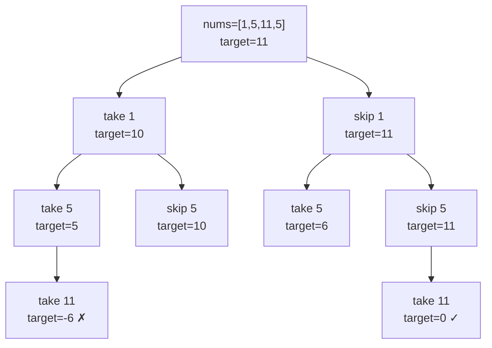

# 0/1 knapsack

Karp's 1972 list of 21 NP-complete problems names PARTITION as the seventh entry: given a bag of positive integers, can you split them into two groups with the same sum? Fifty-four years later, the problem is at LeetCode 416, graded Medium. Two hundred numbers, each at most a hundred. The decision version is still NP-complete in the asymptotic sense, but the *practical* answer is a 1D array of booleans, two nested loops, and one line of code that absolutely has to run in the right direction.

That direction is the chapter. Sweep the inner loop right-to-left and the algorithm answers correctly: each item contributes to the table at most once, which is the 0/1 commitment. Sweep it left-to-right and the same code computes a different problem, namely unbounded knapsack, and produces wrong answers on every input where the right answer would have used some item zero times. The next chapter, [Unbounded and bounded knapsack](./05-knapsack-unbounded.md), is exactly the left-to-right version. Same loop body. One direction-flip apart.

## What 0/1 knapsack actually is

A finite list of items. Each item has a weight. The bag has a capacity. You can either take an item once, paying its weight, or skip it. No fractional take, no take-twice. The question that frames the problem is "is there a subset whose total weight equals the target," or some close variant.

LC 416 *Partition Equal Subset Sum* is the cleanest instance. Given `nums = [1, 5, 11, 5]`, the total is 22, so each half would have to sum to 11. Each `nums[i]` is an item with weight equal to value equal to `nums[i]`. The capacity is 11. The question is whether some subset of `nums` sums to exactly 11. (The subset `{11}` does. Answer: yes.)

The decision per item is binary and irrevocable. Take it: the remaining capacity drops by the item's weight. Skip it: the remaining capacity is unchanged. The state space the DP tracks is `(items considered so far, remaining capacity)`, and the recurrence is the canonical "skip OR take":

```text
dp[i][j] = dp[i-1][j]                            if nums[i] > j     (must skip)
        = dp[i-1][j] OR dp[i-1][j - nums[i]]    otherwise          (skip OR take)
```

The 2D form is the textbook shape stated in CLRS §14 and Erickson §3.6.[^2] The 1D form is what we actually write.

## Why brute force isn't enough

Try every subset. Sum it. Check if it hits the target.

```python
# Brute force: O(2^n) — what we're replacing
def can_partition_brute(nums):
    total = sum(nums)
    if total & 1:
        return False
    target = total // 2
    n = len(nums)
    for mask in range(1 << n):
        s = sum(nums[i] for i in range(n) if mask & (1 << i))
        if s == target:
            return True
    return False
```

Correct on every input. At LC 416's stated bound `n ≤ 200`, the loop runs `2^200` times, roughly `10^60` operations. The sun finishes burning before the function returns. Even with pruning (sort descending, prune when remaining sum can't catch up), the worst case stays exponential.

The DP replaces the exponential with `O(n × W)` where W is the capacity. For LC 416 that's `200 × 10001 ≈ 2 × 10^6` boolean operations, well inside LC's five-second budget.[^3] The runtime is "pseudo-polynomial": polynomial in the *value* of W but exponential in the *bit-length* of W, which is why the DP works on small W and the problem stays NP-complete in general.[^4]

## The 1D table fill

Allocate a boolean array `dp` of length `target + 1`. Seed `dp[0] = True`: the empty subset sums to zero, regardless of which items have been considered. The remaining cells start `False`. For each item `x`, sweep `j` from `target` down to `x`, updating `dp[j] = dp[j] OR dp[j - x]`. When `dp[target]` flips to `True`, the answer is `True`.

```python
def can_partition(nums):
    total = sum(nums)
    if total & 1:
        return False
    target = total // 2

    dp = [False] * (target + 1)
    dp[0] = True

    for x in nums:
        # Right-to-left so each item contributes at most once.
        for j in range(target, x - 1, -1):
            dp[j] = dp[j] or dp[j - x]
        if dp[target]:
            return True
    return dp[target]
```

**Solution** — Python ([Java](./04-knapsack-01/lc-416/sol.java) · [C++](./04-knapsack-01/lc-416/sol.cpp) · [Go](./04-knapsack-01/lc-416/sol.go))

```python
# LC 416. Partition Equal Subset Sum
from typing import List


def can_partition(nums: List[int]) -> bool:
    """LC 416: can nums be split into two equal-sum subsets?"""
    total = sum(nums)
    if total & 1:
        return False
    target = total // 2

    # dp[j] is True iff some subset of seen items sums exactly to j.
    dp = [False] * (target + 1)
    dp[0] = True  # empty subset sums to 0

    for x in nums:
        # Iterate capacity right-to-left so each item contributes at most once.
        # Going left-to-right would reuse x in the same pass and break 0/1.
        for j in range(target, x - 1, -1):
            dp[j] = dp[j] or dp[j - x]
        if dp[target]:
            return True
    return dp[target]
```

Three lines deserve attention before the trace.

`dp[0] = True` is the empty-prefix seed. The recurrence reads `dp[j - x]` whenever item `x` reaches a cell `j ≥ x`; on the very first item, the only previously-True cell is `dp[0]`, and that cell is what lets `dp[x]` flip when the item's weight matches `x`. Drop the seed and every cell stays `False` forever. The DP runs to completion and returns `False` on every input.

`if total & 1: return False` is the cheapest correctness shortcut in the algorithm. An odd total can't split into two equal integer halves, so the algorithm has nothing to do.[^5] Without it, the DP runs the full `O(n × target)` work and returns `False` correctly anyway because `target` (rounded down) is unreachable, but you've spent half the budget proving something the parity bit decides for free.

`for j in range(target, x - 1, -1)` is the line the chapter is about. The next section is why it has to run in that direction.

## Why the inner loop sweeps right-to-left

The 1D DP is a space optimization over the 2D form. Conceptually we have rows `dp[i][·]` indexed by "first `i` items considered"; the 1D layout reuses one row, overwriting it in place. The recurrence reads `dp[i-1][j]` and `dp[i-1][j - x]`, both from the *previous* row.

When the inner loop sweeps right-to-left, the cell on the right (`dp[j - x]`) hasn't been overwritten yet in this pass, so it still holds its previous-row value. That's exactly what the recurrence needs. The 1D update is correct.

When the inner loop sweeps left-to-right, the cell on the right (`dp[j - x]`) has already been overwritten earlier in this same pass. It now holds the *current* row's value, the value computed assuming item `x` was already taken. Reading it lets `x` be taken a second time inside one outer-loop iteration. That's not 0/1 anymore; that's unbounded knapsack.

A two-input demonstration nails it. Take `nums = [3]`, `target = 6`. The honest answer is `False`: there is no subset of `[3]` summing to 6. Run both directions:

```python
# RIGHT-TO-LEFT (correct, 0/1):
# After x = 3: dp = [T, F, F, T, F, F, F]
# dp[6] = False; correct.

# LEFT-TO-RIGHT (wrong, secretly unbounded):
# Step j=3: dp[3] = dp[3] or dp[0] = True. dp = [T, F, F, T, F, F, F]
# Step j=4: dp[4] = dp[4] or dp[1] = False.
# Step j=5: dp[5] = dp[5] or dp[2] = False.
# Step j=6: dp[6] = dp[6] or dp[3] = True ← uses x=3 twice!
# dp[6] = True; WRONG (would require taking 3 twice).
```

The same code, the same data, two different answers, separated by the direction of one `range` argument. Aditya Verma's interview-prep DP notes flag this as the canonical 0/1-vs-unbounded distinction; review threads on LC 416 catch the bug repeatedly because the direction looks like a stylistic choice and isn't.[^6]

The side-by-side, with the difference highlighted:

```python
# 0/1 knapsack — each item AT MOST once
for x in items:
    for j in range(target, x - 1, -1):       # right-to-left
        dp[j] = dp[j] or dp[j - x]

# Unbounded knapsack — each item ANY number of times
for x in items:
    for j in range(x, target + 1):           # left-to-right
        dp[j] = dp[j] or dp[j - x]
```

Two lines change. Everything else is identical. The animation panel below freezes on the moment the recurrence reads `dp[j - x]` so the difference is visible: in the right-to-left pass, the source cell still holds the previous-row value; in the left-to-right pass, it would already have been overwritten.

## Worked example: LC 416 on `nums = [1, 5, 11, 5]`

Total is 22 (even). Target is 11. Allocate `dp` of length 12 with `dp[0] = True`.

**Item 0, x = 1.** Inner loop sweeps `j = 11, 10, ..., 2`. Each cell reads `dp[j - 1]`, all of which are `False` from the initial state, so nothing flips. At `j = 1`, `dp[1] = dp[1] or dp[0] = True`. The state after this pass: subset `{1}` reaches 1.

**Item 1, x = 5.** Inner loop sweeps `j = 11, 10, ..., 5`. At `j = 6`, the cell reads `dp[1]`, which holds `True` from the previous outer-loop iteration — that's the right-to-left contract paying off. `dp[6]` flips to `True`. At `j = 5`, the cell reads `dp[0] = True`, so `dp[5]` flips. The pass leaves `dp = [T, T, F, F, F, T, T, F, F, F, F, F]`. Subsets `{5}` and `{1, 5}` reach 5 and 6.

**Item 2, x = 11.** Inner loop sweeps `j = 11`. The cell reads `dp[0] = True`. `dp[11]` flips to `True`. The early-exit fires: `dp[target]` is now `True`, the answer is `True`, item 3 (the trailing `5`) is never processed.

> **Interactive widget:** [Knapsack DP table fill (0/1 vs unbounded)](../widgets/w-32-knapsack-fill.yml) (panel `panel-01`) — rendered on the website; the YAML spec describes the keyframes.

*Static fallback: dp evolves through four states. Init `[T,F,F,F,F,F,F,F,F,F,F,F]`. After x=1: `[T,T,F,F,F,F,F,F,F,F,F,F]`. After x=5: `[T,T,F,F,F,T,T,F,F,F,F,F]`. After x=11: `[T,T,F,F,F,T,T,F,F,F,F,T]`. The cell `dp[11]` flips on the third item by reading the seeded `dp[0]`; the early-exit returns `True` without touching item 3.*

The trace also shows what the parity guard saves you from. Run the same algorithm on `nums = [1, 2, 3, 5]`. Total is 11, odd. The guard returns `False` immediately, no allocation, no loops. The DP would have run `4 × 6 = 24` cell updates and returned `False` anyway, but the answer was decided by one bit.

## The take-or-skip view

Every cell flip in the table fill is a "take" decision projected from the recursive shape. The tree below shows the recursion on the same input, with `target` decreasing as items are taken:



*Every branch is a take-or-skip per item; LC 416 succeeds when any path hits target = 0. The DP collapses overlapping subproblems by indexing on `(items considered, remaining capacity)` instead of remembering the path that reached each state.*

The DP is the same recursion with two changes: the recursion is replaced by a loop over items, and the result table is filled bottom-up so each cell is computed exactly once. The 2D form makes the correspondence explicit; the 1D form is the 2D form with one optimization stacked on top.

## What it actually costs

| Variant | Time | Space | Notes |
|---|---|---|---|
| Naive recursion (every subset) | O(2^n) | O(n) | the wrong answer; what we replaced |
| 2D DP, full table | O(n × W) | O(n × W) | textbook form; trivially correct |
| 1D DP, in-place sweep | O(n × W) | O(W) | this chapter; right-to-left required |
| Bitset trick | O(n × W / 64) | O(W / 64) | top-voted LC 416 submissions |

For LC 416 the 1D DP runs ~2 × 10^6 boolean operations, comfortable inside LC's limits.[^3] The runtime is *pseudo-polynomial*: `O(n × W)` is polynomial in the value W but exponential in the bit-length `log W`. Encode W in unary and the DP is linear; encode W in binary and the DP is exponential in the input size.[^4] That gap is exactly why the decision version of 0/1 knapsack stays on Karp's NP-complete list while the DP solves every interview-sized instance in milliseconds.[^1]

## Reformulations: when the problem doesn't say "knapsack"

The pattern's deepest payoff is recognizing 0/1 knapsack inside problems that don't look like knapsack on first read. Three named reformulations cover most of interview rotation.

### LC 494 Target Sum: signed sums collapse to subset count

LC 494 asks how many ways you can assign `+` and `-` signs to elements of `nums` so the signed sum equals `target`. The reformulation is one paragraph of algebra. Let `P` be the sum of positively-signed elements and `N` the sum of negatively-signed elements. Then `P + N = total` and `P - N = target`, so `P = (total + target) / 2`. The signed-expression count becomes "count subsets of `nums` summing to `P`", which is the canonical 0/1 knapsack count-subsets variant. The recurrence stays the same shape; boolean OR becomes integer addition.

```python
def find_target_sum_ways(nums, target):
    total = sum(nums)
    if (total + target) & 1 or abs(target) > total:
        return 0
    p = (total + target) // 2
    dp = [0] * (p + 1)
    dp[0] = 1
    for x in nums:
        for j in range(p, x - 1, -1):
            dp[j] += dp[j - x]
    return dp[p]
```

The cleverness is the algebra. The DP is the same loop with the same direction. The two guards `(total + target) & 1` and `abs(target) > total` are the parity guard's siblings: cheap correctness shortcuts that skip the DP entirely on inputs the reformulation can't handle.

### LC 1049 Last Stone Weight II: minimize, don't equalize

LC 1049 asks for the minimum positive value left after smashing stones two-by-two. Reformulated: split the stones into two groups with the minimum possible positive difference. The minimum difference equals `total - 2 × S` where `S` is the largest subset sum that's at most `total / 2`. Run the boolean 0/1 DP up to `target = total // 2`, then walk `dp` from `target` down to find the largest `True` cell. Return `total - 2 × S`.

The shape is the optimization variant: pure boolean reachability isn't the answer, but reachability is a building block. Run the same DP, then mine the table.

### LC 474 Ones and Zeroes: the capacity is a tuple

Each input string has two weights: its zero-count and its one-count. The capacity is the pair `(m, n)` (max zeros, max ones). The recurrence is the same take-or-skip, just iterated descending over both dimensions in the 1D space optimization:

```python
def find_max_form(strs, m, n):
    dp = [[0] * (n + 1) for _ in range(m + 1)]
    for s in strs:
        zeros = s.count('0')
        ones = len(s) - zeros
        for i in range(m, zeros - 1, -1):     # outer descending
            for j in range(n, ones - 1, -1):  # inner descending
                if dp[i - zeros][j - ones] + 1 > dp[i][j]:
                    dp[i][j] = dp[i - zeros][j - ones] + 1
    return dp[m][n]
```

Two axes, two right-to-left sweeps. The reason both have to descend is the same reason the 1D version descends: the recurrence reads the previous-iteration cell, which has to still be intact when read.

## Two pitfalls that bite

> [!WARNING]
> **Iterating the inner loop left-to-right.** The most common bug on LC 416 submissions, and the one with the most subtle failure mode. The algorithm runs to completion, returns wrong answers on inputs where some item could be reused to reach the target, and silently solves unbounded knapsack instead. The fix is one character: write `range(target, x - 1, -1)` in Python, `j >= x; j--` in Java/C++/Go. If your code reads `range(x, target + 1)` and the problem is 0/1, you have this bug.

> [!WARNING]
> **Forgetting `dp[0] = True`.** The seed is not an optimization; it's the empty-subset entry that every later cell flip transitively depends on. Without it, the DP allocates a fully-False array, every `dp[j] = dp[j] or dp[j - x]` reads two False cells, and the loop returns `False` on every input. The bug is silent and catastrophic. CI's canonical-test gate catches it on the first input where the expected answer is `True`.

A third one worth naming briefly: confusing "reach exactly k" with "reach at most k". The boolean OR variant in this chapter answers "is there a subset summing to exactly k". The textbook value variant `dp[i][j] = max(dp[i-1][j], dp[i-1][j - w[i]] + v[i])` answers "max value with capacity at most j". The two recurrences are different; the prompt determines which one applies.[^2]

## Problem ladder

### CORE (solve all three to claim chapter mastery)

- [LC 416 — Partition Equal Subset Sum](https://leetcode.com/problems/partition-equal-subset-sum/) [Medium] • knapsack-01-subset-sum ★
- [LC 494 — Target Sum](https://leetcode.com/problems/target-sum/) [Medium] • knapsack-01-count-subsets
- [LC 879 — Profitable Schemes](https://leetcode.com/problems/profitable-schemes/) [Hard] • knapsack-01-3d-two-constraints

### STRETCH (optional)

- [LC 474 — Ones and Zeroes](https://leetcode.com/problems/ones-and-zeroes/) [Medium] • knapsack-01-2d-axes
- [LC 1049 — Last Stone Weight II](https://leetcode.com/problems/last-stone-weight-ii/) [Medium] • knapsack-01-min-difference

LC 416 is the chapter's signature problem (★) and the reference instance for the 1D DP. The CORE three exercise the three load-bearing variations: pure boolean reachability (LC 416), counting via integer-add (LC 494), and the 3D extension with two simultaneous constraints (LC 879). 0/1 knapsack admits no canonical Easy LeetCode problem; every meaningful subset-sum / take-or-skip variant LC has tagged is graded Medium or harder. The CORE+STRETCH set spans Medium and Hard; the Easy slot is empty by topic, not by oversight.

## Where this leads

The next chapter, [Unbounded and bounded knapsack](./05-knapsack-unbounded.md), is the same algorithm with the inner loop running left-to-right. Each item can be taken any number of times, and the canonical instance is LC 322 *Coin Change*. The widget on this page has a second panel for the unbounded variant; click between them to see the same dp row evolve under each direction.

For two-string DPs where the state is `(prefix of A, prefix of B)` rather than `(items considered, capacity)`, the natural follow-up is [LCS, edit distance, palindromes](./06-lcs.md). The 2D table fill there shares this chapter's vocabulary, recurrence over previous-row cells, in-place row reuse, sweep direction matters, applied to a different state shape.

## References

[^1]: Karp, Richard M., "Reducibility Among Combinatorial Problems," in *Complexity of Computer Computations*, Plenum Press, 1972, pp. 85-103. KNAPSACK and PARTITION listed among the 21 NP-complete problems. <https://link.springer.com/chapter/10.1007/978-1-4684-2001-2_9>

[^2]: Cormen, Leiserson, Rivest, Stein, *Introduction to Algorithms*, 4th ed., MIT Press, 2022, Chapter 14 (Dynamic Programming). Erickson, Jeff, *Algorithms*, §3.6 (Subset Sum), <https://jeffe.cs.illinois.edu/teaching/algorithms/book/03-dynprog.pdf>

[^3]: walkccc, "416. Partition Equal Subset Sum," <https://walkccc.me/LeetCode/problems/0416/>.

[^4]: Wikipedia, "Knapsack problem," <https://en.wikipedia.org/wiki/Knapsack_problem>

[^5]: Design Gurus, "Equal Subset Sum Partition," <https://designgurus.io/course-play/grokking-dynamic-programming/doc/solution-equal-subset-sum-partition>.

[^6]: Aditya Verma, "DP Notes," <https://www.scribd.com/document/842860835/dp-notes-aditya-verma>.
