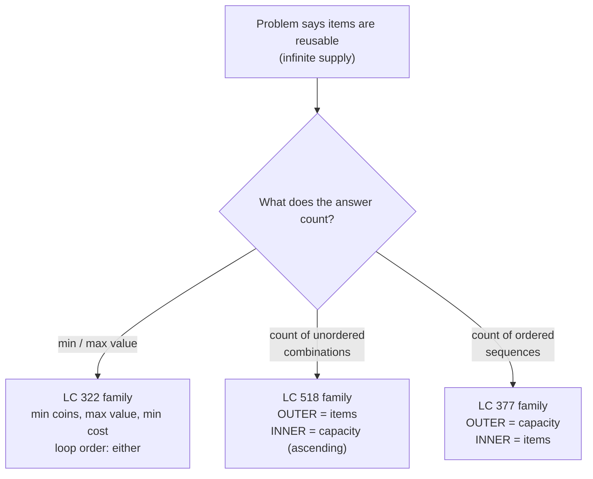

# Unbounded knapsack: when items can be picked over and over

There is a single character of difference between the 0/1 knapsack DP from the previous chapter and the algorithm for `coins = [1, 2, 5], amount = 11 → 3`. One direction reversed in the inner loop. Sweep `for a in range(W, c-1, -1)` and the algorithm packs each item at most once. Sweep `for a in range(c, W+1)` and the same item gets packed as many times as the capacity allows. That single flip is the chapter.

The class of problems this unlocks is the one most candidates think they need a new algorithm for: minimum coins to reach a target, count of unordered ways to make change, count of ordered sequences that sum to a number, minimum cost across reusable bundle deals. They share a recurrence so close to 0/1 knapsack that the chapter's job is mostly to keep the two from collapsing in your head.

## Locating this pattern

The signal that points to unbounded knapsack is a problem statement that pairs three ingredients: a bounded one-dimensional target, a small set of items with a "weight" that consumes the target, and explicit permission to pick each item any number of times. The phrase that gives it away in interview prose is verbatim across the family: "you have an infinite number of each kind of coin" (LC 322[^2]) or "you could use any of the special offers as many times as you want" (LC 638). The 0/1 variant swaps in *each item may be used at most once*; the contrast is on purpose.



*The aggregation operator and the loop nesting together pin down which sub-pattern of unbounded knapsack the problem belongs to. Get the loop order wrong on a counting problem and the algorithm gives a syntactically valid wrong answer.*

## What changes from 0/1 knapsack

[The 0/1 knapsack chapter](./04-knapsack-01.md) built a 1-D space-optimised DP where `dp[a]` stores the best achievable value at capacity `a`. The recurrence is the same shape in both chapters:

```text
dp[a] = aggregate over each item i of (dp[a - w_i] + value_i)
```

The difference is whether `dp[a - w_i]` reads the *previous-item* state or the *current-item* state. In 0/1 knapsack, an item can be used at most once, so when you decide whether to pack item `i` into a capacity-`a` knapsack, the comparison is against the best value achievable with the *earlier* items, never against a state that has already used item `i`. The algorithm enforces this by sweeping the inner loop right-to-left: `dp[a - w_i]` is read *before* `dp[a]` is overwritten, so the read sees the previous row.[^1]

In unbounded knapsack, you *want* to use item `i` repeatedly. When deciding what `dp[a]` should be, the comparison includes the option "I just used item `i` to reach capacity `a - w_i`; use it again to reach `a`." That option corresponds to reading `dp[a - w_i]` *after* the inner loop has already updated it for item `i`. Sweeping left-to-right makes that read see the just-written value, and the algorithm is now packing item `i` as many times as fits.[^1]

The widget below renders both panels on the same canonical input so the direction flip is the headline visual. Same array, same item set, same recurrence body. Only the inner sweep direction changes, and the answer changes accordingly.

> **Interactive widget:** [Knapsack DP table fill (0/1 vs unbounded)](../widgets/w-32-knapsack-fill.yml) (panel `panel-unbounded`) — rendered on the website; the YAML spec describes the keyframes.

*Static fallback: a row of cells `dp[0..11]` initialised `[0, INF, INF, ...]`. Coin 1 fills cells left-to-right, then coin 2 sweeps over them updating where it improves, then coin 5, the dramatic moment, drops `dp[5]` from 3 to 1, and `dp[10]` from 3 to 2 because `dp[5] = 1` has already been written and now feeds back. Final `dp[11] = 3`, the answer (5 + 5 + 1).*

## The mechanics: filling dp[a] left to right

The signature problem is LC 322 *Coin Change*: given coin denominations and a target amount, return the minimum number of coins that sum to the amount, or `-1` if no combination works.[^2] Each coin is reusable. Sample: `coins = [1, 2, 5]`, `amount = 11`. Answer: 3, via `5 + 5 + 1`.

Walk the recurrence on paper before the code. `dp[a]` will hold the minimum number of coins to make amount `a`. Base case `dp[0] = 0` (zero coins make zero). Every other cell starts at infinity. To fill `dp[a]`, try each coin `c`: if `c <= a`, then `dp[a - c] + 1` is a candidate (use one of coin `c` on top of the best way to make `a - c`). Take the smallest candidate over all coins.

The full table on the canonical input, sweeping `a = 1..11`, with each column showing what `dp[a]` becomes after considering each coin:

| `a` | after `c=1` | after `c=2` | after `c=5` | reasoning |
|---|---|---|---|---|
| 0 | 0 | 0 | 0 | base case |
| 1 | 1 | 1 | 1 | only `1` fits |
| 2 | 2 | 1 | 1 | one 2-coin beats two 1-coins |
| 3 | 3 | 2 | 2 | `1 + 2` |
| 4 | 4 | 2 | 2 | `2 + 2` |
| 5 | 5 | 3 | 1 | one 5-coin beats `2 + 2 + 1` |
| 6 | 6 | 3 | 2 | `5 + 1` |
| 7 | 7 | 4 | 2 | `5 + 2` |
| 8 | 8 | 4 | 3 | `5 + 2 + 1` |
| 9 | 9 | 5 | 3 | `5 + 2 + 2` |
| 10 | 10 | 5 | 2 | `5 + 5` |
| 11 | 11 | 6 | 3 | `5 + 5 + 1` ← answer |

The "after `c = k`" columns reflect a coin-outer sweep, but for LC 322 specifically the order does not matter, because `min` is commutative; iterating over `a` in the outer loop and `c` in the inner loop arrives at the same final column.[^3] That forgiveness is unique to the min-aggregation case; the counting variants that follow are not so tolerant.

The code is short. One pass over each amount, one pass over each coin per amount, three lines in the body:

```python
INF = float('inf')

def coin_change(coins, amount):
    dp = [0] + [INF] * amount
    for a in range(1, amount + 1):
        for c in coins:
            if c <= a and dp[a - c] + 1 < dp[a]:
                dp[a] = dp[a - c] + 1
    return dp[amount] if dp[amount] != INF else -1
```

**Solution** — Python ([Java](./05-knapsack-unbounded/lc-322/sol.java) · [C++](./05-knapsack-unbounded/lc-322/sol.cpp) · [Go](./05-knapsack-unbounded/lc-322/sol.go))

```python
# LC 322. Coin Change
# [1,2,5]/11=3, [2]/3=-1, [1]/0=0 all PASS.
from typing import List

INF = float('inf')


def coin_change(coins: List[int], amount: int) -> int:
    """Minimum number of coins summing to `amount`, or -1 if not reachable.
    Each coin may be reused unlimited times.
    """
    dp = [0] + [INF] * amount
    for a in range(1, amount + 1):
        for c in coins:
            if c <= a and dp[a - c] + 1 < dp[a]:
                dp[a] = dp[a - c] + 1
    return dp[amount] if dp[amount] != INF else -1
```

Two production details, both about overflow. Python's `float('inf')` swallows arithmetic cleanly: `INF + 1` is still `INF`. Java does not, and the standard editorial idiom is `int INF = amount + 1;`.[^4] The maximum number of coins on a feasible path is `amount` (all 1-coins, if available), so `amount + 1` is unambiguously infeasible *and* additions stay safely within `int`. C++ and Go use the same sentinel for the same reason. Reach for `Integer.MAX_VALUE` and `dp[a-c] + 1` overflows to `Integer.MIN_VALUE`, which then becomes the new minimum and corrupts every downstream cell.

## What it actually costs

| Variant | Time | Space | Notes |
|---|---|---|---|
| LC 322 min-coins (1-D DP) | O(n × W) | O(W) | one pass per amount, one pass per coin |
| LC 322 (2-D DP, before space optimisation) | O(n × W) | O(n × W) | textbook starting point |
| LC 518 / 377 counting | O(n × W) | O(W) | same shape, sum aggregation |

Where `n` is the number of distinct items (coins) and `W` is the capacity (amount). The 1-D DP fills `W + 1` cells, each aggregating over at most `n` items. Wikipedia's *Knapsack problem* article states the bound directly: at most `n` items examined per cell, at most `W` cells, so total work is O(nW).[^5]

The bound is *pseudo-polynomial*. `W` takes O(log W) bits to encode, so the algorithm is exponential in input length when `W` is astronomical, but practical for LC's bound (`amount ≤ 10⁴` per LC 322 constraints[^2]). The decision version of the underlying knapsack problem is weakly NP-complete[^5]; the change-making problem inherits this and is also weakly NP-hard. The DP is the canonical workaround that exploits small numeric `W`.

## Counting unordered combinations: LC 518

LC 518 *Coin Change II* asks how many ways there are to make `amount` from `coins`, treating each combination as a multiset.[^6] Sample: `coins = [1, 2, 5], amount = 5`. Four multisets sum to 5: `{5}`, `{2, 2, 1}`, `{2, 1, 1, 1}`, `{1, 1, 1, 1, 1}`. Answer: 4. Note that `{2, 2, 1}` and `{2, 1, 2}` are the same multiset; LC 518 counts each once.

The recurrence body changes from `min` to `+=`, and the base case changes from `dp[0] = 0` to `dp[0] = 1`. The new base case is the combinatorial identity that the empty multiset is one valid way to sum to zero. Forget it and `dp[a]` stays at zero for every `a > 0`, because the recurrence `dp[a] += dp[a - c]` only adds zeros to zeros.

```python
def change(amount, coins):
    dp = [0] * (amount + 1)
    dp[0] = 1                           # empty multiset is one valid way
    for c in coins:                     # OUTER = coins -> combinations
        for a in range(c, amount + 1):
            dp[a] += dp[a - c]
    return dp[amount]
```

**Solution** — Python ([Java](./05-knapsack-unbounded/lc-518/sol.java) · [C++](./05-knapsack-unbounded/lc-518/sol.cpp) · [Go](./05-knapsack-unbounded/lc-518/sol.go))

```python
# LC 518. Coin Change II
# OUTER loop = coins is mandatory; counts unordered combinations.
from typing import List


def change(amount: int, coins: List[int]) -> int:
    dp = [0] * (amount + 1)
    dp[0] = 1                           # empty multiset is one valid way
    for c in coins:                     # OUTER = coins -> combinations
        for a in range(c, amount + 1):
            dp[a] += dp[a - c]
    return dp[amount]
```

The line `for c in coins` being the outer loop is doing the entire combinatorics work. To see why, walk the algorithm by hand on `coins = [1, 2], amount = 3`. Initial `dp = [1, 0, 0, 0]`.

Outer iteration `c = 1`. The inner sweep adds `dp[a - 1]` into `dp[a]` for `a = 1, 2, 3`:

- `dp[1] += dp[0]` → `dp[1] = 1`
- `dp[2] += dp[1]` → `dp[2] = 1`
- `dp[3] += dp[2]` → `dp[3] = 1`

After the first outer iteration, `dp = [1, 1, 1, 1]`. Each cell records the one and only combination using nothing but coin 1: the all-ones multiset.

Outer iteration `c = 2`:

- `dp[2] += dp[0]` → `dp[2] = 2`. The new way is `{2}`.
- `dp[3] += dp[1]` → `dp[3] = 2`. The new way is `{2, 1}`.

Final `dp[3] = 2`. Two combinations: `{1, 1, 1}` and `{2, 1}`. Correct.

The point of the outer-coin discipline is that once the algorithm finishes processing coin `c`, it never goes back. By the time the inner loop runs for coin 2, the multiset `{1, 1, 1}` is already accounted for in `dp[3] = 1`; the addition `dp[3] += dp[1]` adds `dp[1] = 1` representing "one way to make 1 using only coins {1, 2} in the order processed so far," which extends to a fresh combination by appending one 2-coin. The multiset `{2, 1}` is recorded once. The order in which 2 and 1 appear in the sequence is irrelevant because the algorithm never asks; it only ever extends an already-canonical sub-multiset by adding more of the *current* coin.

Reverse the loop nesting and that property breaks.

## Counting ordered sequences: LC 377

LC 377 *Combination Sum IV* asks how many sequences of values from `nums` (order matters, repetition allowed) sum to `target`.[^7] LC's title is misleading; the word "combinations" in the problem name is wrong. The statement clarifies *"different sequences are counted as different combinations,"* which is the definition of permutations.[^7] Sample: `nums = [1, 2, 3], target = 4`. Seven sequences: `(1,1,1,1)`, `(1,1,2)`, `(1,2,1)`, `(2,1,1)`, `(2,2)`, `(1,3)`, `(3,1)`. Answer: 7.

The recurrence body is identical to LC 518: `dp[a] += dp[a - n]`. The base case is identical: `dp[0] = 1`. The only line that changes is the loop nesting. Outer loop is now over `a`, inner loop over `nums`.

```python
def combination_sum4(nums, target):
    dp = [0] * (target + 1)
    dp[0] = 1                           # empty sequence is one valid way
    for a in range(1, target + 1):      # OUTER = amounts -> permutations
        for n in nums:
            if n <= a:
                dp[a] += dp[a - n]
    return dp[target]
```

**Solution** — Python ([Java](./05-knapsack-unbounded/lc-377/sol.java) · [C++](./05-knapsack-unbounded/lc-377/sol.cpp) · [Go](./05-knapsack-unbounded/lc-377/sol.go))

```python
# LC 377. Combination Sum IV
# OUTER loop = amounts; counts ordered sequences (the problem statement
# explicitly says "different sequences are counted as different combinations").
from typing import List


def combination_sum4(nums: List[int], target: int) -> int:
    dp = [0] * (target + 1)
    dp[0] = 1                           # empty sequence is one valid way
    for a in range(1, target + 1):      # OUTER = amounts -> permutations
        for n in nums:
            if n <= a:
                dp[a] += dp[a - n]
    return dp[target]
```

Walk the algorithm on `nums = [1, 2], target = 3` to see the difference.

`a = 1`: try `n = 1`, `dp[1] += dp[0] = 1` → `dp[1] = 1`. Try `n = 2`, but 2 > 1, skip. After: `dp = [1, 1, 0, 0]`.

`a = 2`: try `n = 1`, `dp[2] += dp[1] = 1` → `dp[2] = 1`. Try `n = 2`, `dp[2] += dp[0] = 1` → `dp[2] = 2`. After: `dp = [1, 1, 2, 0]`. The two sequences summing to 2 are `(1, 1)` and `(2)`.

`a = 3`: try `n = 1`, `dp[3] += dp[2] = 2` → `dp[3] = 2`. The two sequences are "any sequence summing to 2, then a 1," which gives `(1, 1, 1)` and `(2, 1)`. Try `n = 2`, `dp[3] += dp[1] = 1` → `dp[3] = 3`. The new sequence is "any sequence summing to 1, then a 2," which gives `(1, 2)`. Final `dp[3] = 3`.

Three sequences for target 3: `(1, 1, 1)`, `(2, 1)`, `(1, 2)`. The same multiset `{2, 1}` is counted *twice*: once as the sequence `(2, 1)`, once as `(1, 2)`. That double-counting is the algorithm working correctly; LC 377 wants ordered sequences, and the outer loop over amounts is what makes it happen.

The structural difference is which dimension gets to "introduce itself once" versus "be reconsidered every step." In LC 518, items are introduced once (outer loop) and amortised across all amounts (inner loop). Each multiset is built by appending the current item to states from earlier items, so order is fixed by the loop. In LC 377, every amount reconsiders every item (outer loop = amounts), so the algorithm can extend `(1, 2)` to make `(1, 2, 1)` and separately extend `(2, 1)` to make `(2, 1, 1)`, treating them as distinct.

## When the pattern bends

LC 983 *Minimum Cost For Tickets* is a min-aggregation variant where each "coin" has a fixed structural transformation rather than a numeric weight. The problem: given a list of travel days and three ticket types (1-day, 7-day, 30-day) with given costs, find the minimum total cost.[^8]

The recurrence is `dp[i] = min(dp[i-1] + costs[0], dp[i-7] + costs[1], dp[i-30] + costs[2])` for each travel day `i`. Three "coins" with weights 1, 7, 30 and costs `costs[0..2]`. The "items" are now structured rather than scalar (buying a 30-day pass is structurally different from buying thirty 1-day passes), but the recurrence shape is unchanged. Same `min`-aggregation, same left-to-right sweep, same O(W) space where `W` is the last travel day. The framing-as-knapsack with three fixed-shift items is the unlock.

LC 638 *Shopping Offers* is the multi-dimensional cousin. The state is a vector of remaining needs across `n ≤ 6` items with `needs[i] ≤ 10`, small enough that the entire state can be packed into a 24-bit integer for memoization. Each "offer" is a vector subtraction from the needs state. The DP is still over `(state, choice-of-offer)`; the state just grew from a scalar to a tightly bounded vector. The bitmask packing is an encoding optimisation, not a change to the algorithm. Start by writing the recurrence over a `tuple(needs)` key and only switch to the bitmask once the recurrence is clear.

## Three pitfalls that bite

> [!WARNING]
> **Inner-loop direction copied from 0/1 knapsack.** A reader who learned 0/1 knapsack first writes the unbounded inner loop descending (`for a in range(amount, c-1, -1)`) and LC 322 silently returns the wrong minimum because each coin is treated as single-use. The descending sweep is correct for 0/1, where reuse must be blocked; the ascending sweep is correct for unbounded, where reuse is the point. CP-Algorithms states the rule explicitly: complete-knapsack inner loop runs in *increasing* order; 0/1 runs in *decreasing*.[^1] Mnemonic: 0/1 = down, infinite = up.

> [!WARNING]
> **The LC 518 / LC 377 loop-order swap.** Both problems share the recurrence `dp[a] += dp[a - x]` and the base case `dp[0] = 1`. Only the loop nesting differs: outer = items for unordered combinations, outer = amounts for ordered sequences. There is no compiler error and no runtime error when you copy the wrong template. The bug surfaces only when the inputs distinguish between combinations and permutations. For `coins = [1, 2], amount = 2`, both nestings return 2; both look correct, both pass small unit tests. At amount 3 the answers diverge (2 versus 3), and at amount 4 (3 versus 5). Memorise the rule: outer = items counts combinations; outer = amounts counts permutations.

> [!CAUTION]
> **`Integer.MAX_VALUE` as the infeasibility sentinel in Java.** Java integer overflow is silent. Initialise `dp[a] = Integer.MAX_VALUE` and the line `dp[a - c] + 1` overflows to `Integer.MIN_VALUE` whenever `dp[a - c]` is unreachable, and that negative value then becomes the new minimum and propagates as if it were a valid count. The fix is the LC editorial idiom `int INF = amount + 1;`.[^4] The maximum coins on any feasible path is `amount` (all 1-coins), so `amount + 1` is unambiguously infeasible and `dp[a-c] + 1` stays safely within `int`.

A fourth small one worth flagging: `dp[0] = 0` for min-coins versus `dp[0] = 1` for counting variants. Different problem families, different base cases, same array initialisation pattern. Mixing them up is silent, the algorithm runs to completion and returns the wrong number, and the fix is one character.

## Problem ladder

### CORE (solve all three to claim chapter mastery)

- [LC 322 — Coin Change](https://leetcode.com/problems/coin-change/) [Medium] • unbounded-knapsack-min ★
- [LC 518 — Coin Change II](https://leetcode.com/problems/coin-change-ii/) [Medium] • unbounded-knapsack-count-combinations
- [LC 377 — Combination Sum IV](https://leetcode.com/problems/combination-sum-iv/) [Medium] • unbounded-knapsack-count-permutations

### STRETCH (optional)

- [LC 983 — Minimum Cost For Tickets](https://leetcode.com/problems/minimum-cost-for-tickets/) [Medium] • unbounded-knapsack-min-fixed-shifts
- [LC 638 — Shopping Offers](https://leetcode.com/problems/shopping-offers/) [Medium] • unbounded-knapsack-multi-state

LC 322 is the chapter's signature problem and the cleanest min-aggregation demonstration. The CORE three exercise the three load-bearing variations on the recurrence: minimum coins (LC 322, `min` with `+1`), unordered count (LC 518, `+=` with outer = items), ordered count (LC 377, `+=` with outer = amounts). All five problems sit at Medium because the unbounded-knapsack pattern admits no canonical Easy or Hard problem in interview rotation without poaching from adjacent chapters; LC 70 (Climbing Stairs) is structurally LC 377 with `nums = [1, 2]` but is owned by [Fibonacci-shaped DP](./01-dp-bottom-up-tabulation.md) for its prerequisite role, and LC 416 (Partition Equal Subset Sum) is owned by [0/1 knapsack](./04-knapsack-01.md). The chapter's `single-difficulty-band` curation flag in the problem registry records that this is a property of the pattern, not a gap.

## Where this leads

The chapters that follow stop being one-dimensional. [Longest common subsequence](./06-lcs.md) is the first 2-D table fill where neither dimension is "capacity," and the inner-loop direction story stops being informative because the recurrence reads from cells that are *already* in the previous row by construction. [Edit distance](./07-edit-distance.md) generalises further to two strings with three edit operations, each labelling a distinct path through the table. The discipline you built here (write the recurrence first, prove which dimension can be space-optimised, pick the loop direction that makes the dependency reads valid) is the discipline that carries.

LC 279 *Perfect Squares* is the closest follow-up to LC 322 that does not get its own ladder slot here. Treat the perfect squares 1, 4, 9, 16, ... as coins, and the algorithm reduces to LC 322 with a denomination set that grows with `n`. Worth an evening of practice if the loop-order rule still feels precarious.

## References

[^1]: CP-Algorithms, "Knapsack Problem," sections "0-1 Knapsack" and "Complete Knapsack." <https://cp-algorithms.com/dynamic_programming/knapsack.html>.

[^2]: doocs/leetcode mirror, LC 322 Coin Change README_EN. Difficulty Medium. Constraints: `1 <= coins.length <= 12`, `1 <= coins[i] <= 2³¹ - 1`, `0 <= amount <= 10⁴`. <https://github.com/doocs/leetcode/blob/main/solution/0300-0399/0322.Coin%20Change/README_EN.md>.

[^3]: walkccc, "LeetCode Solutions" 322. Coin Change. <https://walkccc.me/LeetCode/problems/322/>.

[^4]: walkccc, "LeetCode Solutions" 322. Coin Change, Java tab. The `Arrays.fill(dp, 1, dp.length, amount + 1)` idiom is the standard editorial sentinel for this problem family. <https://walkccc.me/LeetCode/problems/322/>.

[^5]: Wikipedia, "Knapsack problem," sections "Computational complexity" and "Dynamic programming in-advance algorithm." <https://en.wikipedia.org/wiki/Knapsack_problem>.

[^6]: doocs/leetcode mirror, LC 518 Coin Change II README_EN. Difficulty Medium. Constraint: "answer is guaranteed to fit into a signed 32-bit integer." <https://github.com/doocs/leetcode/blob/main/solution/0500-0599/0518.Coin%20Change%20II/README_EN.md>.

[^7]: doocs/leetcode mirror, LC 377 Combination Sum IV README_EN. Difficulty Medium. Statement quote: "different sequences are counted as different combinations." <https://github.com/doocs/leetcode/blob/main/solution/0300-0399/0377.Combination%20Sum%20IV/README_EN.md>.

[^8]: doocs/leetcode mirror, LC 983 Minimum Cost For Tickets README_EN. Difficulty Medium. Constraints: `1 <= days.length <= 365`; ticket types {1-day, 7-day, 30-day}. <https://github.com/doocs/leetcode/blob/main/solution/0900-0999/0983.Minimum%20Cost%20For%20Tickets/README_EN.md>.
