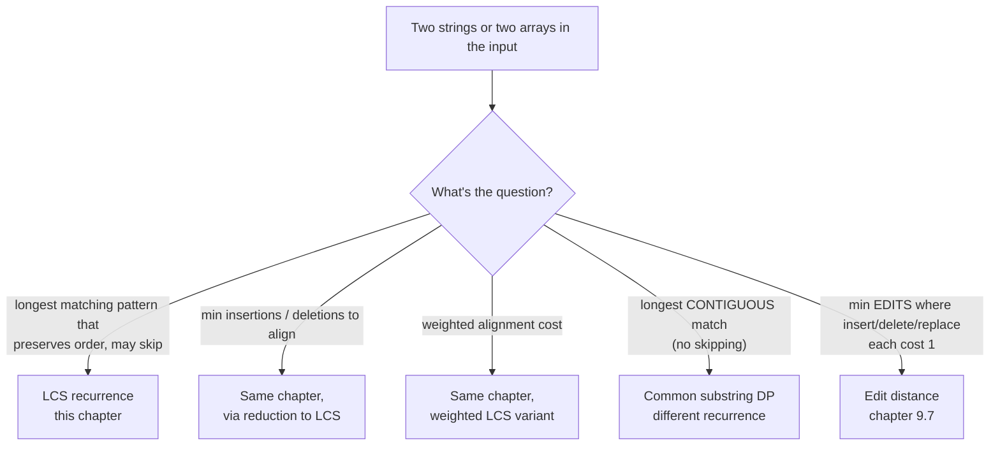
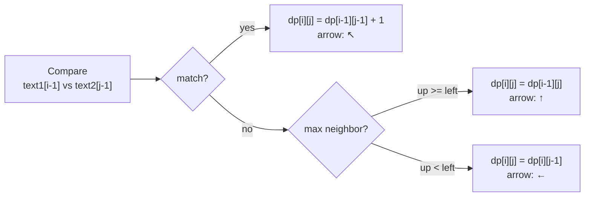
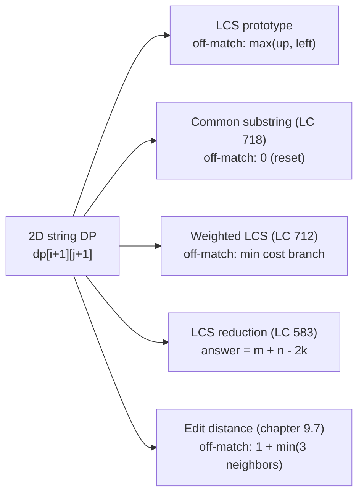

# Longest common subsequence

Two strings sit on a page. Cross out as many characters as you want from each, in any positions, but never reorder what's left. What's the longest run of characters you can leave standing in *both* strings at once? On `"ABCBDAB"` and `"BDCAB"` the answer is four, and the surviving string is `"BCAB"` — or `"BDAB"`, depending on which valid recovery you pick. There are five common subsequences of length four hiding in those twelve total characters. Find them by hand once and the recurrence becomes obvious. Try to find them by enumeration and you'll be there until lunch: each string of length seven has 128 subsequences, the second has 32, and you'd be checking each pair for a match.

This chapter builds the algorithm that finds the answer in 35 cell writes plus a 7-step walk back. The same algorithm is what `git diff` runs to align two versions of a file, what `wdiff` runs to align two versions of a sentence, and what every "minimum edits to make these strings equal" interview question quietly reduces to. Once the recurrence clicks, half of Part 9's hardest-looking string problems become small variations on the same 2D table.

The chapter is genuinely intermediate, but the hard part is not the recurrence. Three lines of code do the recurrence. The hard part is recognizing the pattern when LeetCode wraps it in a different abstraction: non-crossing lines between integer arrays, ASCII-weighted deletions, palindromic subsequences hiding in a single string. Half this chapter is the prototype; the other half is teaching pattern recognition through five problems that all reduce to the same eleven lines.

## Locating this pattern

Three signals trigger this chapter, and one signal sends you to a different one.



*Caption: when the input is a string pair and order is preserved, the question's predicate decides which 2D string DP applies. LCS owns three of the five branches; the contiguous-match cousin and edit distance own the others.*

The contrast that bites is the contiguous-match branch. Common subsequence and common substring share the same 2D table shape, the same `dp[i-1][j-1] + 1` match step, the same `(m+1) × (n+1)` allocation. They differ in one branch, the mismatch case, and on `"ABCBDAB"` vs `"BDCAB"` they give different answers (4 vs 2). [Pitfalls](#pitfalls) returns to this; for now just notice that "subsequence" and "substring" are not interchangeable in this corner of the algorithm space.

## The shape of the wrong answer

Take `text1 = "abcde"` and `text2 = "ace"`. The recursive definition writes itself: an LCS of two strings is either the LCS of the two strings with the last character of one (or both) removed, plus that character if it matches. Spelled as a function:

```python
# Brute force: O(2^(m+n)) — what we're replacing
def lcs_brute(text1, text2):
    def go(i, j):
        if i == 0 or j == 0:
            return 0
        if text1[i - 1] == text2[j - 1]:
            return go(i - 1, j - 1) + 1
        return max(go(i - 1, j), go(i, j - 1))
    return go(len(text1), len(text2))
```

Correct on every input. Run it on a 30-character string against another 30-character string and you'll be waiting; on LC 1143's stated bound `text1.length, text2.length ≤ 1000`, you'll be waiting forever. The branching factor is two on every mismatch, the depth reaches `m + n`, and the same `(i, j)` pair is reached again and again from different recursion paths.

The redundancy is what to fix. Print the calls in order on `text1 = "abcde"` and `text2 = "ace"` and `go(2, 1)` shows up four separate times: once via `go(3, 1)`, once via `go(2, 2)`, twice through paths that go through `go(3, 2)` first. Each visit recomputes the same answer. Multiply that across an `m × n` grid of possible `(i, j)` pairs and you have the same `O(m × n)` distinct subproblems being recomputed `O(2^{m+n})` times.

Memoize the recursion (any of the patterns from [Recursion to memoization](./00-dp-recursion-to-memo.md)) and the runtime collapses to `O(m × n)`. The bottom-up form trades the recursion stack for an explicit table and lays the groundwork for the space optimization later in this chapter. Here's that table.

## The pattern

Allocate `dp[m+1][n+1]`, initialize row 0 and column 0 to zero, fill in row-major order. Each cell asks one question and takes one of two branches based on the answer.

```python
def longest_common_subsequence(text1: str, text2: str) -> int:
    m, n = len(text1), len(text2)
    dp = [[0] * (n + 1) for _ in range(m + 1)]
    for i in range(1, m + 1):
        for j in range(1, n + 1):
            if text1[i - 1] == text2[j - 1]:
                dp[i][j] = dp[i - 1][j - 1] + 1
            else:
                dp[i][j] = max(dp[i - 1][j], dp[i][j - 1])
    return dp[m][n]
```

**Solution** — Python ([Java](./06-lcs/lc-1143/sol.java) · [C++](./06-lcs/lc-1143/sol.cpp) · [Go](./06-lcs/lc-1143/sol.go))

```python
# LC 1143. Longest Common Subsequence
#           (("abcde","ace")=3, ("abc","abc")=3, ("abc","def")=0,
#            ("ABCBDAB","BDCAB")=4, ("","abc")=0, ("a","a")=1).
def longest_common_subsequence(text1: str, text2: str) -> int:
    """LC 1143: length of the longest common subsequence.

    Bottom-up tabulation per CLRS 14.4. dp[i][j] holds the LCS length of
    text1[:i] vs text2[:j]. Row 0 and column 0 are zero (empty prefix).
    O(m*n) time, O(m*n) space.
    """
    m, n = len(text1), len(text2)
    dp = [[0] * (n + 1) for _ in range(m + 1)]
    for i in range(1, m + 1):
        for j in range(1, n + 1):
            if text1[i - 1] == text2[j - 1]:
                dp[i][j] = dp[i - 1][j - 1] + 1
            else:
                dp[i][j] = max(dp[i - 1][j], dp[i][j - 1])
    return dp[m][n]


def lcs_with_reconstruction(text1: str, text2: str) -> tuple[int, str]:
    """Recover an actual LCS string by backtracking from (m, n) per CLRS PRINT-LCS.

    Requires the full 2D table (the rolling-row optimization loses the
    parent pointers the backtrack needs). Backtrack runs in O(m + n).
    """
    m, n = len(text1), len(text2)
    dp = [[0] * (n + 1) for _ in range(m + 1)]
    for i in range(1, m + 1):
        for j in range(1, n + 1):
            if text1[i - 1] == text2[j - 1]:
                dp[i][j] = dp[i - 1][j - 1] + 1
            else:
                dp[i][j] = max(dp[i - 1][j], dp[i][j - 1])
    out = []
    i, j = m, n
    while i > 0 and j > 0:
        if text1[i - 1] == text2[j - 1]:
            out.append(text1[i - 1])
            i, j = i - 1, j - 1
        elif dp[i - 1][j] >= dp[i][j - 1]:
            i -= 1
        else:
            j -= 1
    out.reverse()
    return dp[m][n], "".join(out)


def longest_common_subsequence_rolling(text1: str, text2: str) -> int:
    """Length-only variant in O(min(m, n)) space.

    Iterate the shorter string along the inner dimension so the rolling
    row is as small as possible. The diagonal predecessor (dp[i-1][j-1])
    must be saved into a scalar before being overwritten by the next
    write to the previous row.
    """
    if len(text1) < len(text2):
        text1, text2 = text2, text1  # iterate the shorter as the inner axis
    n = len(text2)
    prev = [0] * (n + 1)
    curr = [0] * (n + 1)
    for i in range(1, len(text1) + 1):
        for j in range(1, n + 1):
            if text1[i - 1] == text2[j - 1]:
                curr[j] = prev[j - 1] + 1
            else:
                curr[j] = max(prev[j], curr[j - 1])
        prev, curr = curr, prev  # swap; reusing the old prev as next row's scratch
        for k in range(n + 1):
            curr[k] = 0  # zero-out the row we're about to fill
    return prev[n]
```

Three things in the code earn a sentence each.

The grid is `(m+1) × (n+1)`, not `m × n`. Row 0 and column 0 are the empty-prefix base cases; the LCS of any string with the empty string is zero. The `+1` shift is what lets the recurrence write `dp[i-1][j-1]` without special-casing `i == 0` or `j == 0`. Drop the shift and every fill iteration needs guards; keep it and the loop body is two lines.

The string is read with `text1[i-1]` while the table is written at `dp[i][j]`. The table is 1-indexed; the strings are 0-indexed. Pick one convention per implementation and stay with it. [Pitfalls](#pitfalls) shows what happens when the conventions cross.

The mismatch step is `max(up, left)`, not `0`. That is the entire difference between common-subsequence and common-substring DP. `max(up, left)` says *the LCS of these two prefixes is at least as good as the LCS of one prefix with one character chopped off*: order-preserving, allowed to skip. A `0` says *contiguity broke; the run resets*. Which one is on the page determines which problem the algorithm solves.



*Caption: three branches, three arrows. The arrow each cell records is the parent pointer; the second pass of the algorithm reads it backwards to recover the actual subsequence.*

The widget animates exactly this recurrence on the canonical input.

## Worked example: LC 1143 on the textbook input

`text1 = "ABCBDAB"`, `text2 = "BDCAB"`. The grid is 8 rows by 6 columns. The corner cell `dp[7][5]` is going to land on 4. Watch where it gets there.

The first row of fills (i = 1, comparing `'A'` against each character of `text2`) lands one match: `dp[1][4] = 1` from `'A' == 'A'`, with the diagonal arrow `↖`. Every other cell in that row inherits zero or one from a neighbor.

Row 2 is where the algorithm starts producing real signal. `text1[1] = 'B'` matches `text2[0] = 'B'` at `dp[2][1] = 1`, then matches `text2[4] = 'B'` again at `dp[2][5] = 2`. The second match consumes the diagonal predecessor `dp[1][4] = 1` and adds one to it: the algorithm has found the subsequence `"AB"`, length 2, hidden across the two prefixes `"AB"` and `"BDCAB"`.

Row 3 (`text1[2] = 'C'`) matches `text2[2] = 'C'` once, at `dp[3][3] = 2`. The diagonal predecessor there is `dp[2][2] = 1`, recording that the prefix `"AB"` against `"BD"` had an LCS of length 1 (`"B"`); add the new `'C'` match and you have `"BC"` against `"BDC"`, length 2. The algorithm is bookkeeping, one prefix pair at a time.

By row 4 (`text1[3] = 'B'`, the second `'B'` in the input) the table is finding length-3 subsequences. `dp[4][5] = 3` records that `"ABCBDAB"`'s prefix `"ABCB"` has a length-3 LCS with `"BDCAB"`: concretely, `"BCB"` or `"BAB"`, depending on the path. The match step at that cell consumes `dp[3][4] = 2` (`"ABC"` vs `"BDCA"`) and adds one. The progression is monotone along any row: an LCS of a longer prefix can only stay the same or grow.

Row 5 (`text1[4] = 'D'`) matches `text2[1] = 'D'` once, at `dp[5][2] = 2`. The mismatch cells in this row inherit from the larger of the up/left neighbors; `dp[5][5] = 3` from `dp[4][5] = 3` (the up neighbor wins on a tie because the implementation favors up). Row 6 (`text1[5] = 'A'`) matches `text2[3] = 'A'` at `dp[6][4] = 3`, building `"BCA"` from a length-2 prefix at `dp[5][3]`.

The corner cell `dp[7][5]` is the one to watch. By the time the fill reaches it, all 35 interior cells are populated. `text1[6] = 'B'` matches `text2[4] = 'B'`, so the recurrence takes the diagonal: `dp[7][5] = dp[6][4] + 1 = 3 + 1 = 4`. That cell holds the answer. The LCS is length 4, and reconstructing it is a separate pass.

The whole fill is 35 cell writes, each touching three already-computed neighbors. No cell is ever revisited. No backtracking inside the fill. One pass, left-to-right, top-to-bottom, and the answer falls out at the corner.

> **Interactive widget:** [DP table fill](../widgets/w-31-dp-table-fill.yml) (panel `panel-c`) — rendered on the website; the YAML spec describes the keyframes.

*Static fallback: an 8×6 grid is filled left-to-right, top-to-bottom. Five matches occur on the diagonal — `(1,4)`, `(2,1)`, `(2,5)`, `(3,3)`, `(4,1)`, `(4,5)`, `(5,2)`, `(6,4)`, `(7,1)`, `(7,5)` — each writing a `↖` arrow. Mismatches inherit from the larger of the up/left neighbors. The corner cell `dp[7][5] = 4`. The backtrack pass walks from the corner to `(0, 0)` and collects the four characters `"BCAB"` along the way.*

### Recovering the actual subsequence

The fill returns 4. The interviewer will ask for `"BCAB"`. The reconstruction is a separate pass that reads the same table backwards.

Start at `(m, n) = (7, 5)` and walk to `(0, 0)`. At each cell, look at the two characters being compared. If they match, this is a diagonal cell, the character is part of the LCS, and the next step is `(i-1, j-1)`. If they don't match, look at the two neighbors `dp[i-1][j]` and `dp[i][j-1]`; the one whose value matches `dp[i][j]` is the parent. Tie-break consistently, either way works.

```python
def lcs_with_reconstruction(text1, text2):
    m, n = len(text1), len(text2)
    dp = [[0] * (n + 1) for _ in range(m + 1)]
    for i in range(1, m + 1):
        for j in range(1, n + 1):
            if text1[i - 1] == text2[j - 1]:
                dp[i][j] = dp[i - 1][j - 1] + 1
            else:
                dp[i][j] = max(dp[i - 1][j], dp[i][j - 1])
    out = []
    i, j = m, n
    while i > 0 and j > 0:
        if text1[i - 1] == text2[j - 1]:
            out.append(text1[i - 1])
            i, j = i - 1, j - 1
        elif dp[i - 1][j] >= dp[i][j - 1]:
            i -= 1
        else:
            j -= 1
    out.reverse()
    return dp[m][n], "".join(out)
```

On the canonical input, the path is `(7,5) ↖ → (6,4) ↖ → (5,3) ↑ → (4,3) ↖ → (3,2) ↑ → (2,2) ↖ → (1,1) ↑ → (0,1)`. Four `↖` steps, four characters collected — `B`, `A`, `C`, `B` — reversed at the end into `"BCAB"`. CLRS Figure 14.8 displays exactly this 8×6 table with the same recovered string.[^1]

The strict-`>` tie-break (`dp[i - 1][j] > dp[i][j - 1]`) recovers `"BDAB"` instead. Both are valid LCSs of length 4. The non-uniqueness is real and worth naming once: when the interviewer says "give me an LCS", any of them works; when they say "give me *all* LCSs", that's a different problem (exponential output, generally).

> [!IMPORTANT]
> The fill and the backtrack must use the same tie-break. If the fill records `up` on ties and the backtrack follows `left` on ties, the recovered string can disagree with the table's scoring path. Either pick one comparator and use it in both passes, or store an explicit `b[i][j]` parent-arrow table during the fill and read from it during the backtrack. CLRS does the second; this chapter does the first because it matches what the widget renders.[^1]

## What it actually costs

| Variant | Time | Space | What you get |
|---|---|---|---|
| Bottom-up table fill (canonical) | O(m·n) | O(m·n) | length only, full table available for reconstruction |
| Backtrack from `(m, n)` | O(m + n) extra | O(LCS length) | the actual LCS string, after the fill |
| Rolling rows (length only) | O(m·n) | O(min(m, n)) | length only; reconstruction not possible |
| Hirschberg's algorithm | O(m·n) | O(m + n) | the LCS string in linear space; divide-and-conquer over the midpoint |

The fill bound is a counting argument, not a deep theorem. The grid has `(m+1)(n+1)` cells, each cell does `O(1)` work (three reads, one write, one comparison), so the total is `O(m · n)`. CLRS makes this argument in one paragraph.[^1]

What's not obvious from the counting argument is *why each cell can read only three neighbors*, rather than re-exploring the exponentially many subsequences ending at each prefix pair. That's the optimal-substructure property, CLRS Theorem 14.1. The proof is an exchange argument: if `(z_1, ..., z_k)` is an LCS of `(X[1..m], Y[1..n])` and `x_m == y_n`, then `z_k` must equal `x_m` and `(z_1, ..., z_{k-1})` must be an LCS of the strictly-smaller prefix pair `(X[1..m-1], Y[1..n-1])`. If it weren't, we could swap in a longer LCS for the smaller pair, append `x_m`, and get a longer LCS than the one we started with, contradicting optimality.[^1] The recurrence inherits this structure directly: each cell needs only the three smaller-prefix-pair answers because the optimal LCS at this prefix pair must extend one of those three.

The backtrack walks at most `m + n` steps because every step either decrements `i`, decrements `j`, or both. It cannot revisit a cell, so it terminates by the time either index hits zero.

The asymptotic bound is tight in the worst case. There are `Θ(m · n)` distinct subproblems, the dependency between them is the recurrence's three-neighbor reach, and any algorithm that respects this dependency must touch each cell at least once. Faster algorithms exist for special cases. Hunt-Szymanski runs in `O((n + r) log n)` where `r` is the number of matching pairs, useful when the LCS is short relative to `m · n`, but it's outside chapter scope and rarely faster on interview-sized inputs.[^2]

### O(min(m, n)) space via row reuse

The full table is `O(m · n)` cells. Most of that storage is dead weight: row `i` reads only row `i-1` and the current row's left neighbors. Two rolling rows of size `min(m, n) + 1` are enough to compute the answer, dropping the space from `O(m · n)` to `O(min(m, n))`.

The mechanics. Pick the shorter string as the inner loop's axis (so the rolling row is as small as possible). Maintain two arrays, `prev` and `curr`, each of length `n + 1`. After filling row `i` into `curr`, swap them: the new `prev` is what used to be `curr`, and the new `curr` is the old `prev` zeroed out for the next pass.

```python
def lcs_rolling(text1, text2):
    if len(text1) < len(text2):
        text1, text2 = text2, text1            # iterate the shorter as inner axis
    n = len(text2)
    prev = [0] * (n + 1)
    curr = [0] * (n + 1)
    for i in range(1, len(text1) + 1):
        for j in range(1, n + 1):
            if text1[i - 1] == text2[j - 1]:
                curr[j] = prev[j - 1] + 1       # diagonal predecessor
            else:
                curr[j] = max(prev[j], curr[j - 1])
        prev, curr = curr, prev                  # swap; old prev becomes scratch
        for k in range(n + 1):
            curr[k] = 0
    return prev[n]
```

Two things to notice. The diagonal predecessor `dp[i-1][j-1]` reads from `prev[j-1]` *before* `curr[j-1]` was overwritten at the previous inner-loop step. That's fine: `prev` is the old row and `curr[j-1]` is the new row, and the inner loop has already written `curr[j-1]` before reading `prev[j-1]`. The single diagonal value is in `prev[j-1]` at exactly the right moment.

A tighter variant uses one row of length `n + 1` plus one scalar that holds the diagonal predecessor across the inner loop's overwrite. The scalar is what `prev[j-1]` was before `curr[j-1]` clobbered it. That form trades a swap-and-zero pass for one explicit save of the diagonal:

```python
def lcs_one_row(text1, text2):
    if len(text1) < len(text2):
        text1, text2 = text2, text1
    n = len(text2)
    dp = [0] * (n + 1)
    for i in range(1, len(text1) + 1):
        diag = 0                                 # dp[i-1][0] = 0 always
        for j in range(1, n + 1):
            saved = dp[j]                        # save dp[i-1][j] before overwrite
            if text1[i - 1] == text2[j - 1]:
                dp[j] = diag + 1
            else:
                dp[j] = max(dp[j], dp[j - 1])
            diag = saved                         # next iteration's dp[i-1][j-1]
    return dp[n]
```

One row, one scalar, one pass. Either form is fine for an interview answer; the two-row version is easier to read and debug, the one-row-plus-scalar version is what production code tends to look like.

The catch. The rolling form returns the length, not the string. Reconstruction needs every row of the table because the backtrack walks across rows in reverse. Throw away the old rows and the parent pointers go with them. If the problem asks for the LCS itself in linear space, the right tool is Hirschberg's 1975 algorithm: compute the LCS length forwards from the start and backwards from the end, find the column where the two scores sum to the LCS length (the split point), and recurse into the two halves.[^3] The recurrence is the same; the schedule trades a constant factor of time for asymptotic space. Worth knowing the name; rarely worth implementing under a 45-minute clock.

The space optimization is the one extension that almost always shows up as a follow-up question. "Can you do it in less space?" The answer is yes, two rows are enough, and the next sentence is "but not if you need the actual subsequence." That's the entire interview exchange.

Why pick the shorter string for the inner axis? When `m = 1000` and `n = 5`, the rolling row is length 6 instead of 1001. The choice doesn't affect time complexity (both axes still require `O(m · n)` cell writes), but it changes the rolling-row size from `O(max(m, n))` to `O(min(m, n))`. If the swap matters for a memory-tight environment, it's a one-line guard at the top.

## Variants and reductions

LCS is the prototype, and at least three flavors of LeetCode problem reduce to it without changing the recurrence. Recognizing the disguise is the hard part; the code that follows is the same eleven lines.



*Caption: the LCS chapter sits at the root of a small family of 2D string DPs. The off-match branch is the variant axis; everything else is shared.*

### LCS in disguise: LC 1035 Uncrossed Lines

You're given two integer arrays. Draw a line between every pair of equal numbers, one from each array. The lines cannot cross. What's the maximum number of non-crossing lines?

Two lines `(i_1, j_1)` and `(i_2, j_2)` cross iff `i_1 < i_2` and `j_1 > j_2`. Non-crossing means `i_1 < i_2` implies `j_1 < j_2`. Which is to say: the matched pairs preserve order. Which is the definition of a common subsequence. The maximum number of non-crossing lines is `LCS(nums1, nums2)`.

The implementation is `longest_common_subsequence` with `==` comparing integers instead of characters. Nothing else changes.[^4] When you spot this problem, recognize it; don't re-derive the DP.

The reduction is the chapter's first lesson in pattern recognition through abstraction. The problem statement says nothing about subsequences, nothing about strings, nothing about prefixes. It talks about geometry: lines, crossings, parallel arrays. The candidate who builds a fresh DP from scratch on this problem solves it; the candidate who recognizes "non-crossing pair-matching is order-preserving pair-matching" reaches the same code in 30 seconds. Recognizing the disguise is the skill the chapter is teaching, not the recurrence.

### Reduction-to-LCS: LC 583 Delete Operation for Two Strings

Given `word1` and `word2`, what's the minimum number of single-character deletions (from either word) to make them equal?

The reduction is one step. Let `k = LCS(word1, word2)`. The characters in the LCS stay; everything else gets deleted. From `word1`, that's `m - k` deletions; from `word2`, that's `n - k`. The answer is `(m - k) + (n - k)`.

```python
def min_distance(word1, word2):
    k = longest_common_subsequence(word1, word2)
    return (len(word1) - k) + (len(word2) - k)
```

That's the chapter for LC 583. The DP is unchanged; the reduction lives in the answer-extraction line.[^5] Once you internalize it, an entire family of "minimum deletions to equalize", "minimum insertions to make a palindrome", "minimum operations to transform" questions collapse to LCS plus arithmetic.

The proof that the reduction is correct: any sequence of deletions that makes the two strings equal leaves behind a string that is, by definition, a common subsequence of both originals. The longer the common-subsequence-that-stays, the fewer the deletions. The minimum number of deletions corresponds to the maximum-length common subsequence, which is exactly what LCS computes. Two strings of length 5 with an LCS of length 3 require `(5 - 3) + (5 - 3) = 4` deletions. The arithmetic is invariant; the LCS length is the only thing the algorithm has to compute.

### Weighted LCS: LC 712 Minimum ASCII Delete Sum

Same shape as LC 583, but each deletion costs the deleted character's ASCII value. Find the minimum total cost.

The recurrence flips. `dp[i][j]` is now the minimum delete-cost to make `word1[:i]` and `word2[:j]` equal, not the longest match. The combiner becomes `min`. The base row and column are no longer zeros; they accumulate the running ASCII sum, because making `word1[:i]` equal to the empty string costs `sum(word1[:i])` in deleted ASCII. The match step keeps the diagonal predecessor (no cost when characters match). The mismatch step picks the cheaper of two delete options.

```python
def minimum_delete_sum(s1, s2):
    m, n = len(s1), len(s2)
    dp = [[0] * (n + 1) for _ in range(m + 1)]
    for i in range(1, m + 1):
        dp[i][0] = dp[i - 1][0] + ord(s1[i - 1])
    for j in range(1, n + 1):
        dp[0][j] = dp[0][j - 1] + ord(s2[j - 1])
    for i in range(1, m + 1):
        for j in range(1, n + 1):
            if s1[i - 1] == s2[j - 1]:
                dp[i][j] = dp[i - 1][j - 1]
            else:
                dp[i][j] = min(dp[i - 1][j] + ord(s1[i - 1]),
                               dp[i][j - 1] + ord(s2[j - 1]))
    return dp[m][n]
```

The recurrence shape (diagonal vs up vs left) is preserved; only the arithmetic is different.[^6] This is the canonical interview rendering of "weighted LCS"; once you've seen it, the family of "find the min/max-cost alignment" problems is approachable.

### The cousin that breaks the pattern: LC 718 Maximum Length of Repeated Subarray

This one *looks* like LCS but isn't. The problem asks for the longest *contiguous* matching block in two arrays: common substring, not common subsequence.

Same 2D table shape. Same `dp[i-1][j-1] + 1` match branch. Different mismatch branch:

```python
def find_length(nums1, nums2):
    m, n = len(nums1), len(nums2)
    dp = [[0] * (n + 1) for _ in range(m + 1)]
    best = 0
    for i in range(1, m + 1):
        for j in range(1, n + 1):
            if nums1[i - 1] == nums2[j - 1]:
                dp[i][j] = dp[i - 1][j - 1] + 1
                if dp[i][j] > best:
                    best = dp[i][j]
            # mismatch: dp[i][j] stays 0 — contiguity reset
    return best
```

Two changes from LCS. The mismatch case writes `0`, not `max(up, left)`, because contiguity broke. The answer is the maximum cell anywhere in the table, not the corner cell, because the longest run can end anywhere.[^7]

Run LCS code on `("ABCBDAB", "BDCAB")` and you get 4. Run common-substring code on the same input and you get 2 (the run `"AB"` at the end). The recurrence on the page is the difference between an answer of 4 and an answer of 2. This is the exact pitfall named below; LeetCode discussion threads put it at the top of the "most common student error" list specifically because the two algorithms share so much surface that the wrong one looks right at a glance.[^8]

## Pitfalls

> [!WARNING]
> **Confusing common subsequence with common substring.** The match branch is identical; the mismatch branch is the entire difference. Subsequence inherits from neighbors via `max(up, left)` — the answer is the corner cell. Substring resets to `0` — the answer is the max over all cells. On `("ABCBDAB", "BDCAB")` the buggy code returns 2 instead of 4. Memorize the mismatch branch as the test, not the table shape.[^8]

The two recurrences sit on top of the same dependency graph, write to the same shape of table, allocate the same way. They diverge in three lines: the mismatch case (`max(up, left)` vs `0`), the answer location (corner cell vs max over all cells), and the implicit reset (subsequence never resets, substring resets on every mismatch). When code looks right and the answer is wrong on a small input, this is the first place to look.

> [!WARNING]
> **Mixing string and table indexing inside the loop.** The dp table is 1-indexed (`i = 1..m`, `j = 1..n`); the strings are 0-indexed. Read the character as `text1[i-1]`, not `text1[i]`. Mixing the conventions inside one function shifts the comparison by one position and silently corrupts the diagonal. Pick one convention and stay with it; both `dp[i][j]` with `text1[i-1]` and `dp[i+1][j+1]` with `text1[i]` are correct, but only one at a time.

The shifted-by-one bug is silent because the table dimensions still work: `dp[m][n]` is still in bounds, the loop still terminates, the answer is still some integer. It just isn't the right integer. The diagnostic is to run the algorithm on a one-character match like `("a", "a")` and check whether it returns 1; the off-by-one form returns 0 because `text1[1]` (out of bounds, or empty, or the next character) doesn't equal `text2[1]`.

> [!WARNING]
> **Returning the table corner for the actual LCS string.** The interviewer will pivot from "what's the length" to "give me the string". If the candidate has memorized `dp[m][n]` but not the backtrack pass, the question stalls. The backtrack is a separate algorithm: from `(m, n)`, follow the arrow each cell encodes — diagonal collects a character, up or left does not — until either index hits zero. Practice it on the canonical input once before the interview, not during.

A fourth, subtler pitfall: writing a top-down recursive solution and allocating the memoization cache *inside* the recursive function. The cache resets on every call; the memoization does nothing; the solution times out at `m = n = 1000`. Lift the cache outside the recursion (a closure variable in Python, an instance field in Java, a static member in C++), or use Python's `@functools.cache` decorator on the recursive function, or write the bottom-up form (which sidesteps the problem by construction).

A fifth, situational pitfall: tie-break drift between the fill and the backtrack. The fill records `up` on ties (`dp[i-1][j] >= dp[i][j-1]`); the backtrack follows `left` on ties. On inputs where the recurrence hits ties, the recovery walks a path that doesn't match the fill's scoring path. The recovered string can be a valid LCS or it can be wrong, depending on the input, non-deterministically. The fix is to use the same comparator in both passes; the chapter's reference code uses `>=` everywhere.

## Problem ladder

> [!NOTE]
> All five problems below sit at LC-Medium. The LCS pattern is structurally narrow to that band: there is no canonical Easy LeetCode problem that teaches the recurrence (LC 1143 itself is the simplest LCS shape and is already Medium), and the canonical Hard problems either bleed into a sibling chapter (LC 72 Edit Distance lives in [9.7](./07-edit-distance.md)) or test a different DP shape (counting subsequences, palindromic DP). The chapter's `single-difficulty-band` curation flag in the registry records this as a property of the pattern, not a gap in the ladder.

### CORE (solve all three to claim chapter mastery)

- [LC 1143 — Longest Common Subsequence](https://leetcode.com/problems/longest-common-subsequence/) [Medium] • dp-2d-lcs ★
- [LC 1035 — Uncrossed Lines](https://leetcode.com/problems/uncrossed-lines/) [Medium] • dp-2d-lcs-disguised
- [LC 583 — Delete Operation for Two Strings](https://leetcode.com/problems/delete-operation-for-two-strings/) [Medium] • dp-2d-lcs-reduction

### STRETCH (optional)

- [LC 712 — Minimum ASCII Delete Sum for Two Strings](https://leetcode.com/problems/minimum-ascii-delete-sum-for-two-strings/) [Medium] • dp-2d-weighted-lcs
- [LC 718 — Maximum Length of Repeated Subarray](https://leetcode.com/problems/maximum-length-of-repeated-subarray/) [Medium] • dp-2d-common-substring

LC 1143 is the chapter's signature problem (★) and the worked example. The CORE three exercise the three load-bearing skills: the prototype recurrence (LC 1143), recognizing LCS through a non-string disguise (LC 1035), and the LCS-subtracted-from-totals reduction (LC 583). The STRETCH pair pushes one variant axis each: weighted alignment (LC 712 swaps `max` for `min` and adds running ASCII costs to the base) and the contiguous-match cousin (LC 718, which lives in the variant tree as a deliberate counter-example to the LCS recurrence).

## Where this leads

[Edit distance](./07-edit-distance.md) is the next stop and the direct cousin. Same 2D table on a string pair, same `(m+1) × (n+1)` allocation, same recurrence-on-prefix-prefix shape. The mismatch branch flips. LCS picks the *larger* of two neighbors when characters disagree, because it's counting matches and wants the most matches it can find. Edit distance picks the *smaller* of three neighbors plus one, because it's counting edits and wants the fewest edits it can get away with. The third neighbor (the diagonal one) is what allows a substitution; LCS doesn't have one because there's no analogue. Hold the two recurrences side by side and the family tree is visible: LCS counts what stays, edit distance counts what changes, both run on the same table.

When the second string is the first string reversed, the LCS algorithm is solving a *single-string* problem in disguise: longest palindromic subsequence. That's [Palindromic subsequence DP](./10-palindrome-dp.md), where the chapter's twist is that the diagonal of the dp table runs along the main anti-diagonal of the original string. The same recurrence; a different geometric reading.

The space optimization in this chapter, two rolling rows, generalizes. Almost every 2D string DP that doesn't need a backtrack admits the same trick. The shape to recognize is "row `i` reads only row `i-1` and earlier columns of row `i`", and that shape covers most of Part 9's hardest-looking string problems. When the dependency reaches further back than the previous row (palindromic-substring DP that fills along the anti-diagonal, interval DP whose cell `dp[i][j]` reads from cells with both indices farther away), the rolling-row trick fails and the full table is the only option. Knowing which problems admit the trick and which don't is the rest of Part 9.

The same prefix-pair-DP framework with one twist on the recurrence (the alphabet of allowed operations) runs the entire Levenshtein/Smith-Waterman/Needleman-Wunsch family used in bioinformatics. `git diff` is a special case of LCS where the alphabet is "lines of source code"; the algorithm doesn't care that the symbols are strings of arbitrary length. The same code with a different `==` runs against amino-acid sequences, against revisions of a Wikipedia article, against two takes of a transcribed audio recording. The interview problem is small; the algorithm is everywhere.

## References

[^1]: Cormen, T. H.; Leiserson, C. E.; Rivest, R. L.; Stein, C. *Introduction to Algorithms*, 4th ed., MIT Press, 2022, Chapter 14 §14.

[^2]: ["Longest common subsequence,"](https://en.wikipedia.org/wiki/Longest_common_subsequence)

[^3]: Hirschberg, D. S. ["A linear space algorithm for computing maximal common subsequences,"](https://dl.acm.org/doi/10.1145/360825.360861)

[^4]: walkccc, *LeetCode Solutions*, [Problem 1035 Uncrossed Lines](https://walkccc.me/LeetCode/problems/1035/)

[^5]: walkccc, *LeetCode Solutions*, [Problem 583 Delete Operation for Two Strings](https://walkccc.me/LeetCode/problems/583/)

[^6]: walkccc, *LeetCode Solutions*, [Problem 712 Minimum ASCII Delete Sum for Two Strings](https://walkccc.me/LeetCode/problems/712/)

[^7]: walkccc, *LeetCode Solutions*, [Problem 718 Maximum Length of Repeated Subarray](https://walkccc.me/LeetCode/problems/718/)

[^8]: LeetCode Discuss, ["Recursion → Memoization → Tabulation → Space Optimization,"](https://leetcode.com/discuss/post/8000256/longest-common-substring-recursion-memoi-qwqn/)
