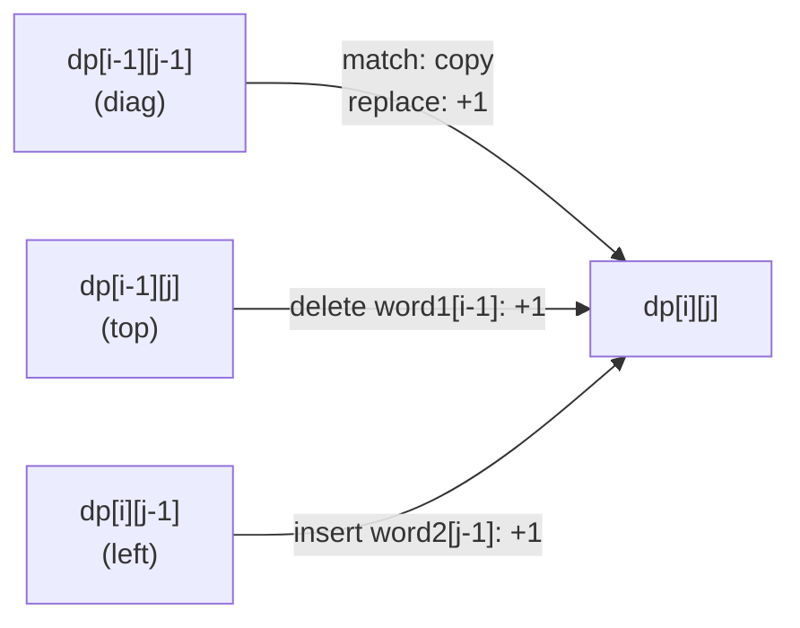
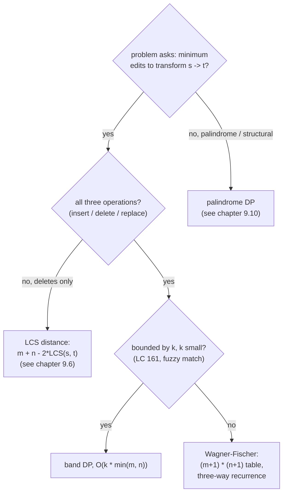

# Edit distance

Greedy fails on the LeetCode 72 example `intention` and `execution`. Walk left to right, edit on the first mismatch, count as you go: the answer you get is wrong. The right answer is 5, and a human who finds it by hand has done a thing the greedy walk cannot: looked ahead, considered three different last moves at once, and committed to the cheapest of them.

That look-ahead is the chapter. Wagner and Fischer published it in 1974 as the canonical example of how a 2D table absorbs a problem that resists local thinking, and the algorithm sits at the heart of every diff tool, spell checker, fuzzy matcher, and DNA aligner you have ever used.[^1] On the LC 72 surface it asks one question: given two strings `word1` and `word2`, what is the smallest number of single-character edits (insert, delete, or replace) that transforms one into the other?[^2] The answer for `horse` and `ros` is 3. The answer for `intention` and `execution` is 5. The answer for any pair fits in an `(m+1) × (n+1)` table, fills row by row in `O(mn)` time, and follows the same three-way recurrence at every interior cell.[^3]

## Why greedy burns

The honest first attempt walks both strings left to right, editing on the first mismatch and counting the edit. It is the algorithm a human reaches for under interview pressure. On `horse` and `ros`, it works:

```text
horse vs ros
 h vs r   mismatch.  replace h -> r.  count = 1.  rest: orse vs os
 o vs o   match.                       count = 1.  rest: rse vs s
 r vs s   mismatch.  replace r -> s.  count = 2.  rest:  se vs (empty)
 s, e     extra characters.  delete each.  count = 4.

reported = 4.
```

Two replaces and two deletes. The optimal answer is 3: replace the `h`, keep the `o`, keep the `s`, delete the `r` and the `e`. The greedy walk replaced the `r` instead of keeping it, because it could not look two characters ahead to see that `s` would arrive on its own.

`intention` and `execution` is worse, because greedy's first move is wrong in a way that compounds:

```text
intention vs execution
 i vs e   mismatch.  replace.  count = 1.
 n vs x   mismatch.  replace.  count = 2.
 t vs e   mismatch.  replace.  count = 3.
 e vs c   mismatch.  replace.  count = 4.
 n vs u   mismatch.  replace.  count = 5.
 t vs t   match.
 i vs i   match.
 o vs o   match.
 n vs n   match.

reported = 5.
```

This time greedy lands on the right number. But the *path* is wrong. The optimal alignment delays the first edit, inserts an `e` at position 0, then replaces three characters in the middle of `intention`. Greedy got the count right by accident; on inputs where the cheapest alignment is harder to spot, the count is wrong too.

The shape of the failure is the chapter's signal. At every position, greedy commits to one of three local moves (match, replace, advance) without considering what the other two moves would cost over the rest of the input. The optimal answer requires looking at all three predecessors of every position simultaneously and taking the cheapest. That is exactly what the table does.

## The reduction

State `dp[i][j]` as the minimum number of edits to turn `word1[:i]` into `word2[:j]`. The answer to the original problem is `dp[m][n]`. Two strings, two prefix lengths, one number. That is the entire state.

The recurrence rests on one observation: **the answer is the minimum over the three ways the last position can be handled.** Either the last characters already match and you copy the answer for the shorter pair, or you pay one edit to reach the current pair from one of three smaller pairs. There are no other options. Every alignment of two strings ends in exactly one of these four moves, and the cheapest alignment ends in the cheapest move.

That sentence is the chapter. Everything below is bookkeeping.

## The pattern

```python
# Brute force: O(3^max(m,n)) without memoization
def min_distance_brute(word1, word2):
    def edit(i, j):
        if i == 0: return j        # j inserts to build word2[:j]
        if j == 0: return i        # i deletes to drain word1[:i]
        if word1[i-1] == word2[j-1]:
            return edit(i-1, j-1)  # match: free diagonal
        return 1 + min(
            edit(i-1, j-1),        # replace
            edit(i-1, j),          # delete from word1
            edit(i, j-1),          # insert into word1
        )
    return edit(len(word1), len(word2))
```

Correct on every input. Exponential, because the recursion explores the same `(i, j)` pair from three parents and re-derives its answer each time. On `intention` and `execution` the call tree has roughly `3^9 = 20,000` calls when the actual `(i, j)` space has only `100` distinct cells. Memoize the function and you have an `O(mn)` algorithm; tabulate it bottom-up and you have the same algorithm in less code.

```python
def min_distance(word1, word2):
    m, n = len(word1), len(word2)
    dp = [[0] * (n + 1) for _ in range(m + 1)]
    for i in range(m + 1):
        dp[i][0] = i  # i deletes turn word1[:i] into ""
    for j in range(n + 1):
        dp[0][j] = j  # j inserts turn "" into word2[:j]
    for i in range(1, m + 1):
        for j in range(1, n + 1):
            if word1[i-1] == word2[j-1]:
                dp[i][j] = dp[i-1][j-1]              # match: free diagonal
            else:
                dp[i][j] = 1 + min(
                    dp[i-1][j-1],                    # replace
                    dp[i-1][j],                      # delete from word1
                    dp[i][j-1],                      # insert into word1
                )
    return dp[m][n]
```

**Solution** — Python ([Java](./07-edit-distance/lc-72/sol.java) · [C++](./07-edit-distance/lc-72/sol.cpp) · [Go](./07-edit-distance/lc-72/sol.go))

```python
# LC 72. Edit Distance

def min_distance(word1: str, word2: str) -> int:
    """LC 72: minimum number of operations to convert word1 to word2."""
    m, n = len(word1), len(word2)
    # dp[i][j] = edit distance between word1[:i] and word2[:j]
    dp = [[0] * (n + 1) for _ in range(m + 1)]
    for i in range(m + 1):
        dp[i][0] = i  # i deletes turn word1[:i] into ""
    for j in range(n + 1):
        dp[0][j] = j  # j inserts turn "" into word2[:j]
    for i in range(1, m + 1):
        for j in range(1, n + 1):
            if word1[i - 1] == word2[j - 1]:
                dp[i][j] = dp[i - 1][j - 1]               # match: free diagonal
            else:
                dp[i][j] = 1 + min(
                    dp[i - 1][j - 1],                     # replace
                    dp[i - 1][j],                         # delete from word1
                    dp[i][j - 1],                         # insert into word1
                )
    return dp[m][n]


def min_distance_rolling(word1: str, word2: str) -> int:
    """O(min(m, n)) space variant using two rolling rows."""
    if len(word1) < len(word2):
        word1, word2 = word2, word1
    m, n = len(word1), len(word2)
    prev = list(range(n + 1))
    curr = [0] * (n + 1)
    for i in range(1, m + 1):
        curr[0] = i
        for j in range(1, n + 1):
            if word1[i - 1] == word2[j - 1]:
                curr[j] = prev[j - 1]
            else:
                curr[j] = 1 + min(prev[j - 1], prev[j], curr[j - 1])
        prev, curr = curr, prev
    return prev[n]
```

The three operations each name one of the three predecessors. The convention is fixed across this chapter and the four reference implementations:

- **`dp[i-1][j-1] + 1` is replace.** Both prefixes shrink by one. The current characters disagree; you spend an edit to swap one for the other.
- **`dp[i-1][j] + 1` is delete.** `word1`'s prefix shrinks by one, `word2`'s does not. You drop the trailing character of `word1` for one edit.
- **`dp[i][j-1] + 1` is insert.** `word2`'s prefix shrinks by one, `word1`'s does not. You add the trailing character of `word2` for one edit.

When the trailing characters already match, no edit is needed: `dp[i][j] = dp[i-1][j-1]`. The diagonal is free.

> [!IMPORTANT]
> The `+ 1` lives outside the match check. Match returns `dp[i-1][j-1]` with no addition; mismatch returns `1 + min(...)`. Mixing them up, by adding 1 in the match case or forgetting to add 1 in the mismatch case, produces an algorithm that is right on identical strings and wrong on everything else.[^4]

The base cases close the table. `dp[0][0] = 0` because the empty string transforms to itself in zero edits. `dp[i][0] = i` because `i` deletes drain `word1[:i]` to empty. `dp[0][j] = j` because `j` inserts build `word2[:j]` from empty. Drop these and the inner loop reads cells that were never written; the result is silent garbage.

## What the recurrence looks like at one cell



*Three predecessors feed every interior cell. The diagonal is free on a match and costs one on a replace; top is always a delete; left is always an insert.*

## Worked example: `horse` to `ros`

The grid is `(m+1) × (n+1) = 6 × 4`. Rows index `i = 0..5` (the prefix length of `horse`); columns index `j = 0..3` (the prefix length of `ros`). Row 0 fills with `0, 1, 2, 3` (inserts). Column 0 fills with `0, 1, 2, 3, 4, 5` (deletes). The interior fills row by row.

The decisive moment is `dp[2][2]`. The trailing characters are `o` and `o`. They match, the diagonal is free, and `dp[2][2] = dp[1][1] = 1`. That single cell is what greedy could not see: by holding the `o` instead of replacing it, the algorithm reaches `(2, 2)` for half the cost of the surrounding cells. Every later cell that walks back through `(2, 2)` inherits that savings.

The widget animates every cell write, with the chosen predecessor arrow drawn into each new cell. Step 13 is the `o`-equals-`o` match. Step 23 is the final fill at `(5, 3)`, where the cheapest predecessor is the cell directly above and the operation is a delete of the trailing `e`.

> **Interactive widget:** [DP table fill](../widgets/w-31-dp-table-fill.yml) (panel `panel-d`) — rendered on the website; the YAML spec describes the keyframes.

*Static fallback: the answer cell `dp[5][3] = 3` sits at the bottom-right corner of the 6 × 4 table. Three of the 15 interior cells are matches (where `o`, `r`, or `s` appear in both strings); the rest are filled by `1 + min(diag, top, left)`. The cheapest path from `(0, 0)` to `(5, 3)` includes one replace and two deletes, in some order. The cost is unique; the alignment is not.*

## Where this pattern fits



*The decision tree to run when a string-transformation problem lands. LCS distance and bounded edit distance are the two specializations of Wagner-Fischer the reader will reach for most often; chapter 9.6 holds the LCS family.*

[Longest common subsequence](./06-lcs.md) is the closest sibling in this part. Both algorithms fill the same `(m+1) × (n+1)` table by row. The cell update differs:

| Pattern | Match | Mismatch | Combiner |
|---|---|---|---|
| LCS | `dp[i-1][j-1] + 1` | `max(dp[i-1][j], dp[i][j-1])` | `max` |
| Edit distance | `dp[i-1][j-1]` (free) | `1 + min(diag, top, left)` | `min` |

LCS counts matches; edit distance counts mismatches and gaps. Both are 2D string DPs on the same chassis. The three operations of edit distance correspond, in LCS-language, to the three ways a character at the end of a prefix can fail to be in the common subsequence. They are the same algorithm with different cost functions, which is why the four-way panel widget shares one rendering surface across both chapters.

The reduction goes one level deeper. If you delete the replace branch from edit distance, keeping only delete and insert, the answer becomes `m + n - 2 * LCS(s, t)`, because every character outside the LCS must be deleted from one side or the other.[^5] LC 583 is the canonical instance and lives with [Longest common subsequence](./06-lcs.md) as a CORE problem, not here.

## What it actually costs

| Variant | Time | Space | Notes |
|---|---|---|---|
| Wagner-Fischer (full table) | `O(mn)` | `O(mn)` | the canonical algorithm; recovers cost only |
| Two-row rolling DP | `O(mn)` | `O(min(m, n))` | row `i` depends only on row `i - 1`; rolling preserves correctness |
| Hirschberg's algorithm | `O(mn)` | `O(m + n)` | also recovers the alignment, not just the cost[^6] |
| Bounded distance, cost ≤ k | `O(k · min(m, n))` | `O(k)` | Ukkonen's diagonal stripe of width `2k + 1` |

The `(m+1) × (n+1)` table has `Θ(mn)` cells, each filled in `O(1)` work given its three predecessors, so the total work is `Θ(mn)`. The two-row variant exploits the fact that filling row `i` only consults row `i - 1`; two rows of length `n + 1` suffice and the rolling discipline preserves correctness because the recurrence is row-local.

The matching lower bound is sharper than it sounds. Backurs and Indyk proved in 2015 that edit distance cannot be computed in strongly subquadratic time unless the Strong Exponential Time Hypothesis is false.[^7] In plain language: barring a major breakthrough in complexity theory, you cannot do meaningfully better than `O(mn)` time on the general problem. The rolling and Hirschberg variants buy you space, not time. For LC 72's bound of `m, n ≤ 500`, `mn = 250,000` cells and the algorithm runs in microseconds.

## Recovering the operations

The cost table tells you `dp[m][n] = 3`. It does not tell you whether the three operations were `replace, delete, delete` or `delete, replace, delete` or some other permutation. If an interviewer asks for the alignment, not just the count, you walk back from `(m, n)` to `(0, 0)` and read the chosen predecessor at each cell.

```python
def recover_ops(word1, word2, dp):
    i, j = len(word1), len(word2)
    ops = []
    while i > 0 or j > 0:
        if i > 0 and j > 0 and word1[i-1] == word2[j-1]:
            ops.append(('match', word1[i-1]))
            i, j = i-1, j-1
        elif i > 0 and j > 0 and dp[i][j] == dp[i-1][j-1] + 1:
            ops.append(('replace', word1[i-1], word2[j-1]))
            i, j = i-1, j-1
        elif i > 0 and dp[i][j] == dp[i-1][j] + 1:
            ops.append(('delete', word1[i-1]))
            i -= 1
        else:
            ops.append(('insert', word2[j-1]))
            j -= 1
    return list(reversed(ops))
```

The walk runs in `O(m + n)` because each step decreases `i + j` by one or two. The cost is unique. Every backtrack reaches the same `dp[m][n]`. But the alignment is not. When two predecessors tie, the recovered sequence depends on which one you check first. The chapter's reference implementations break ties in the order `diag > top > left`, matching the evaluation order of `min({diag, top, left})`. Different tie-break orders produce different alignments and the same cost.

For full alignments on long inputs, Hirschberg's 1975 algorithm recovers the operation sequence in `O(m + n)` space using a divide-and-conquer trick that finds the midpoint of the optimal path and recurses on the two halves.[^6] Production diff tools (`git diff`, `diff`, the textual layer of every IDE merge view) use Hirschberg or one of its descendants for exactly this reason.

## Two pitfalls that bite

> [!WARNING]
> **The empty-string base cases are not optional.** `dp[0][j] = j` and `dp[i][0] = i` carry the cost of building from or draining to an empty prefix. Allocate the table as `m × n` instead of `(m+1) × (n+1)` and the loop runs over an array with no base row or column; the algorithm reads uninitialised zeros and returns `0` on inputs where one string is empty. The bug is silent: the table fills, the algorithm terminates, the answer is wrong on the test case `("", "abc")`.

> [!WARNING]
> **The character comparison is `word1[i-1] == word2[j-1]`, not `word1[i] == word2[j]`.** The table is sized `(m+1) × (n+1)` so that prefix lengths are `0, 1, ..., m`. When `i = m`, indexing `word1[i]` overflows. The standard convention (`dp[i][j]` is the cost over the first `i` characters of `word1` and the first `j` characters of `word2`) forces the off-by-one in the lookup. Lock it in once and write it the same way in every comparison.[^8]

## Problem ladder

### CORE (solve to claim chapter mastery)

- [LC 72 — Edit Distance](https://leetcode.com/problems/edit-distance/) [Medium] • dp-2d-edit-distance ★

### STRETCH (optional)

- [LC 161 — One Edit Distance](https://leetcode.com/problems/one-edit-distance/) [Medium] • dp-2d-edit-distance-bounded *(reference: Python only; LC Premium. Solve via LC 72 with `dp[m][n] <= 1` early-exit.)*
- [LC 1771 — Maximize Palindrome Length From Subsequences](https://leetcode.com/problems/maximize-palindrome-length-from-subsequences/) [Hard] • dp-2d-edit-distance-cousin *(reference: Python only)*

LC 72 is the chapter's signature problem and the canonical Wagner-Fischer instance. The pattern admits no canonical Easy LC variant; the simplest LC variant is LC 161, itself Medium, and the chapter records that with the `no-easy-canonical` curation flag. LC 1771 closes the family with the `LCS on s + reverse(t)` reduction, which is edit-distance-shaped DP with a different cost function and a constraint on which palindrome characters come from which substring.

LC 1035 (Uncrossed Lines) and LC 583 (Delete Operation for Two Strings) belong to [Longest common subsequence](./06-lcs.md). Both are LCS in disguise: LC 1035 directly, LC 583 via the `m + n - 2 * LCS` reduction. The LCS chapter is the natural home for either.

## Where this leads

The next move in this part is [Longest increasing subsequence (the O(n²) DP)](./08-lis-quadratic.md), which uses a 1D `dp[]` indexed by the position of the last element kept. The shape changes from a 2D table over two prefixes to a 1D array over one position with an inner scan over earlier positions; the recurrence still composes a small number of predecessor cells into the current one, but the structure is a single string, not two.

The follow-up that uses the 2D string DP table without modification is [Palindrome DP](./10-palindrome-dp.md), where `dp[i][j]` becomes a boolean over substrings rather than a cost over prefixes, and the iteration order shifts from row-major to interval-length-major to keep the dependencies pointing the right way.

When the operations carry weights (the cost of replacing `A` with `T` differs from the cost of replacing `A` with `C`, as in DNA sequence alignment) the recurrence's `+ 1` becomes `+ cost(op)` and the algorithm is otherwise unchanged. Smith-Waterman (local alignment) and Needleman-Wunsch (global alignment) are the two named instances; both are Wagner-Fischer with a different cost function, the same way edit distance is LCS with a different cost function. The chassis is durable.

## References

[^1]: Wagner, Robert A. and Fischer, Michael J., "The String-to-String Correction Problem," *Journal of the ACM*, 21(1):168-173, January 1974, doi:10.1145/321796.321811.
[^2]: LeetCode 72 Edit Distance, problem statement and examples mirrored at leetcode.ca, <https://leetcode.ca/all/72.html>. Examples 1 (`horse -> ros = 3`) and 2 (`intention -> execution = 5`) verbatim.
[^3]: Cormen, Leiserson, Rivest, Stein (CLRS), *Introduction to Algorithms*, 4th ed., MIT Press, 2022, Chapter 14 (Dynamic Programming), §14.4 problem 14-5 (Edit Distance).
[^4]: Levenshtein, Vladimir I., "Binary codes capable of correcting deletions, insertions, and reversals," *Soviet Physics Doklady*, 10(8):707-710, February 1966 (originally in Russian, *Doklady Akademii Nauk SSSR*, 163(4):845-848, 1965).
[^5]: Wikipedia, "Levenshtein distance," <https://en.wikipedia.org/wiki/Levenshtein_distance>
[^6]: Hirschberg, D. S., "A linear space algorithm for computing maximal common subsequences," *Communications of the ACM*, 18(6):341-343, 1975, doi:10.1145/360825.360861.
[^7]: Backurs, Arturs and Indyk, Piotr, "Edit Distance Cannot Be Computed in Strongly Subquadratic Time (unless SETH is false)," STOC 2015, arXiv:1412.0348.
[^8]: LeetCode Discuss, "Good strategies to avoid off by one errors?", <https://leetcode.com/discuss/post/1479718/good-strategies-to-avoid-off-by-one-erro-se2e/>.
