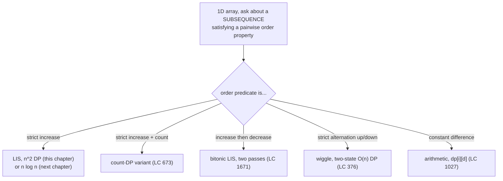
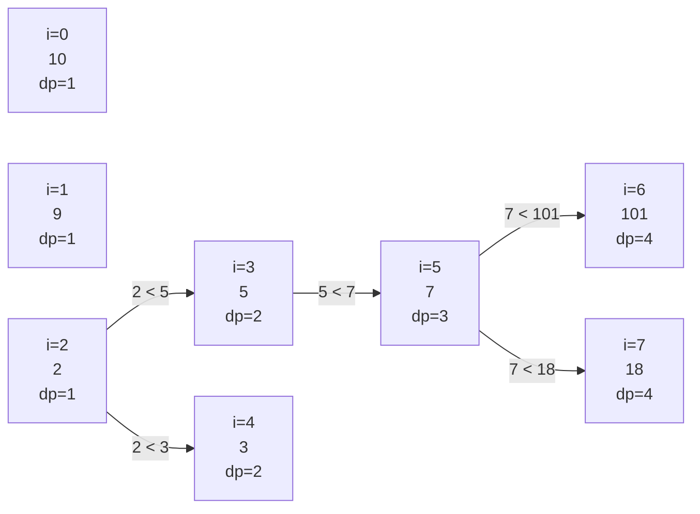

# Longest Increasing Subsequence: the quadratic DP

A random permutation of 2,500 distinct integers has a longest strictly increasing subsequence of about 100 elements on average. Not 50. Not 1,250. About `2 * sqrt(n)`. That number is buried in a 1935 combinatorics paper by Erdős and Szekeres, and it's a useful sanity check the next time someone asks how long the LIS of a shuffled list "should" be. The number is also the reason this problem is harder than it looks: a length-2,500 input has a length-100 answer, and the obvious algorithm to find it tries `2^2500` candidate subsequences.

The canonical statement is *Longest Increasing Subsequence* (LeetCode 300). Given `nums = [10, 9, 2, 5, 3, 7, 101, 18]`, return the length of the longest strictly increasing subsequence. The answer is 4: the subsequence `[2, 3, 7, 101]`, or `[2, 3, 7, 18]`, or `[2, 5, 7, 101]`, all four entries, all valid. The problem asks only for the length. This chapter teaches the textbook `O(n^2)` dynamic-programming solution, derives the predecessor-pointer trick that lets you reconstruct one such subsequence, and points at a smaller bound that the next chapter delivers.

## Where this pattern fits



*Five problems in the LIS family, one decision tree. The strict-increase branch is this chapter's home; the other four are variants the same recurrence absorbs with small surgery.*

The signal is structural, not surface-level. When the input is a one-dimensional array and the question asks for the longest, the count of, or some optimum over a *subsequence* whose elements satisfy a pairwise order property, the recurrence below is the one to reach for. *Subsequence* matters: the chosen elements keep their original order but need not be adjacent. Contiguous-subarray problems take a different family entirely (sliding window or prefix sum).

## Why brute force is hopeless

The honest first attempt enumerates every subsequence. For each of the `2^n` subsets of indices, check whether the picked values form a strictly increasing chain; track the maximum length seen.

```python
# Brute force: O(2^n * n) — what we're replacing
def length_of_lis_brute(nums):
    n = len(nums)
    best = 0
    for mask in range(1 << n):
        picked = [nums[i] for i in range(n) if mask & (1 << i)]
        if all(picked[k] < picked[k + 1] for k in range(len(picked) - 1)):
            best = max(best, len(picked))
    return best
```

Correct on every input. At LeetCode 300's stated bound `n <= 2500`, the worst case does roughly `2^2500` mask iterations, a number with 753 digits. The algorithm runs out of universe before it runs out of time. Even at `n = 30`, the loop is already past a billion iterations. The whole approach is a non-starter.

The fix is the standard dynamic-programming move: stop enumerating; start memoizing what every subproblem's answer is.

## The state that makes the recurrence work

Define `dp[i]` as **the length of the longest strictly increasing subsequence that ends exactly at index `i`, with `nums[i]` as its last element.** The "ends exactly at `i`" framing is the load-bearing definition. Phrased the other obvious way, "the longest LIS using only `nums[0..i]` regardless of where it ends," the recurrence breaks: every transition has to consider both extending and ignoring the new element, the dependencies tangle, and the inner loop loses its shape.

With the right state, the recurrence reads in one sentence. Any LIS ending at `i` is some LIS ending at an earlier index `j` (with `nums[j] < nums[i]`) with `nums[i]` appended. Take the best `j`. If no `j` qualifies, the chain has length 1 (just `nums[i]` on its own).

```text
dp[i] = 1 + max(dp[j] for j < i if nums[j] < nums[i])    # default 0 in the max
```

The final answer is `max(dp[0..n-1])`, because the LIS can end anywhere in the array, not necessarily at the last index.

This is the formulation in CLRS 4th ed. §14.4 Problem 14-1 and Erickson's *Algorithms* §3.6.[^1][^2] Both present it as the canonical look-back DP exemplar. The same "ends-exactly-at" shape powers the edit-distance and longest-common-subsequence recurrences in the previous two chapters.

## The pattern

```python
def length_of_lis(nums):
    n = len(nums)
    if n == 0:
        return 0
    dp = [1] * n                       # every singleton is its own LIS of length 1
    for i in range(1, n):
        for j in range(i):
            if nums[j] < nums[i] and dp[j] + 1 > dp[i]:
                dp[i] = dp[j] + 1
    return max(dp)
```

**Solution** — Python ([Java](./08-lis-quadratic/lc-300/sol.java) · [C++](./08-lis-quadratic/lc-300/sol.cpp) · [Go](./08-lis-quadratic/lc-300/sol.go))

```python
# LC 300. Longest Increasing Subsequence
from typing import List


def length_of_lis(nums: List[int]) -> int:
    """LC 300 Longest Increasing Subsequence: O(n^2) DP.

    dp[i] = length of the longest STRICTLY increasing subsequence
    ending exactly at index i (and including nums[i]).
    """
    n = len(nums)
    if n == 0:
        return 0
    dp = [1] * n
    for i in range(1, n):
        for j in range(i):
            if nums[j] < nums[i] and dp[j] + 1 > dp[i]:
                dp[i] = dp[j] + 1
    return max(dp)
```

Three lines deserve attention.

The initialisation `dp = [1] * n` is the base case in disguise. Every position is its own length-1 LIS regardless of context, and the inner loop only ever revises `dp[i]` upward. Initialising to 0 is the most common new-reader bug: it returns 0 on a singleton input like `[5]`, where the right answer is 1.

The predicate `nums[j] < nums[i]` is **strict**, not `<=`. The problem says "strictly increasing." A `<=` slip silently passes most tests and fails on `[7, 7, 7, 7, 7]`, where the correct answer is 1 but `<=` returns 5. The all-equal case is a one-line edge case that catches the bug immediately; run it before submitting.

The comparison `dp[j] + 1 > dp[i]` is intentional. `>` keeps the loop assigning only on a strict improvement, which matters once you start tracking predecessor pointers (next section): `>=` would let a different `j` overwrite an existing predecessor that already produces the same length, complicating reconstruction without buying any speed.

## Worked example: nums = [10, 9, 2, 5, 3, 7, 101, 18]

Walk the algorithm one index at a time. At each `i`, the inner loop scans every earlier `j`, takes the largest `dp[j] + 1` among `j` with `nums[j] < nums[i]`, and writes that into `dp[i]`. The trace:

| i | nums[i] | candidate j with nums[j] < nums[i] | dp[i] |
|---|---|---|---|
| 0 | 10 | none | 1 |
| 1 | 9 | none | 1 |
| 2 | 2 | none | 1 |
| 3 | 5 | j=2 (nums=2, dp=1) | 2 |
| 4 | 3 | j=2 (nums=2, dp=1) | 2 |
| 5 | 7 | j=2,3,4; best is j=3 with dp=2 | 3 |
| 6 | 101 | j=0..5; best is j=5 with dp=3 | 4 |
| 7 | 18 | j=2,3,4,5; best is j=5 with dp=3 | 4 |

The final answer is `max(dp) = 4`. Two LIS chains tie at length 4: one ending at i=6 (`[2, 3, 7, 101]`), one ending at i=7 (`[2, 3, 7, 18]`). The problem asks only for the length, so the tie doesn't matter.



*Each arrow is the winning predecessor link for `dp[i]`. Indices 0 and 1 have no incoming arrow (`dp` stays at 1). Two length-4 chains share the prefix `2 -> 3 -> 7`, then diverge to `101` or `18`.*

## Reconstructing one such subsequence

LeetCode 300 asks only for the length. Interviewers commonly follow up: "now print one such subsequence." The augmentation is small. Alongside `dp[]`, maintain `prev[i]`, the index `j` that produced `dp[i]`'s current value, or `-1` if `dp[i]` stayed at the base case of 1.

```python
def lis_with_reconstruction(nums):
    n = len(nums)
    if n == 0:
        return 0, []
    dp = [1] * n
    prev = [-1] * n
    end = 0                                 # index where the global max lives
    for i in range(1, n):
        for j in range(i):
            if nums[j] < nums[i] and dp[j] + 1 > dp[i]:
                dp[i] = dp[j] + 1
                prev[i] = j
        if dp[i] > dp[end]:
            end = i
    chain = []
    cur = end
    while cur != -1:
        chain.append(nums[cur])
        cur = prev[cur]
    chain.reverse()
    return dp[end], chain
```

Running this on the canonical input produces `(4, [2, 3, 7, 101])`. The predecessor walk costs `O(L)` where `L` is the chain length, dominated by the `O(n^2)` table fill. Same asymptotic, one extra integer per cell.

This is the same predecessor-trace pattern that drives reconstruction in edit distance and longest common subsequence. Once the "ends exactly at `i`" state is fixed, the parent-pointer augmentation is mechanical.

## What it actually costs

| Variant | Time | Space | Notes |
|---|---|---|---|
| Length only | O(n^2) | O(n) | two nested loops; one length-`n` table |
| With reconstruction | O(n^2) | O(n) | same time; one extra `prev[]` array |
| Brute force | O(2^n * n) | O(n) | the wrong answer; what we replaced |

The two nested loops contribute `n * (n - 1) / 2` constant-work comparisons. Each pair runs one `<` test and one max-update, both `O(1)` on machine integers. At LeetCode 300's bound `n <= 2500`, that's roughly `3.1 * 10^6` operations: comfortable under a second in every language we ship.

The `O(n^2)` bound is **not optimal**. Schensted (1961) showed how to compute the LIS length in `O(n log n)` time using a sorted "tails" array and binary search; Fredman (1975) proved that bound is tight for comparison-based algorithms up to a low-order term.[^3][^4] [The `O(n log n)` patience-sort algorithm](./09-lis-patience-sort.md) is the next chapter. The reason this chapter teaches the slower algorithm first is that the `O(n^2)` recurrence generalises immediately to the variants below; the patience-sort framing does not.

## When the pattern bends

The look-back state shape extends to four interview-grade variants. Each keeps the outer-`i` / inner-`j` structure; what changes is the per-pair update rule. Two variants worth naming explicitly are the count and the bidirectional sweep.

### Counting LIS chains: from "how long" to "how many" (LC 673)

LeetCode 673 asks for the number of distinct longest increasing subsequences. The skeleton stays the same; the table grows a second column. Maintain `length[i]` (same as `dp[i]` above) and `count[i]` (number of distinct LIS chains ending at `i`). For each `(j, i)` with `nums[j] < nums[i]`, branch on whether `j` extends the current best or ties it:

```python
def find_number_of_lis(nums):
    n = len(nums)
    if n == 0:
        return 0
    length = [1] * n
    count = [1] * n
    for i in range(1, n):
        for j in range(i):
            if nums[j] < nums[i]:
                if length[j] + 1 > length[i]:
                    length[i] = length[j] + 1
                    count[i] = count[j]               # strictly longer; replace
                elif length[j] + 1 == length[i]:
                    count[i] += count[j]              # ties; accumulate
    longest = max(length)
    return sum(c for l, c in zip(length, count) if l == longest)
```

The "ties; accumulate" branch is the highest-value teaching moment in count-DP. Readers who copy-paste the LC 300 inner loop and forget the `elif` pass the singleton tests and fail on any input with multiple distinct chains of equal length.[^5]

### Two passes for a mountain: bitonic LIS (LC 1671)

LeetCode 1671 asks for the minimum number of removals to make an array a mountain (strictly up to a peak, then strictly down). The bitonic LIS reduction is the lesson: run the LIS DP twice. `left[i]` is the standard forward sweep; `right[i]` is the LIS DP on the reversed predicate (`nums[j] > nums[i] for j > i`), or equivalently, the LIS of the reversed array reversed back. The longest bitonic subsequence with peak at index `i` has length `left[i] + right[i] - 1` (the `-1` un-double-counts the peak), valid only when both halves are non-trivial.

```python
def minimum_mountain_removals(nums):
    n = len(nums)
    left = [1] * n
    for i in range(1, n):
        for j in range(i):
            if nums[j] < nums[i] and left[j] + 1 > left[i]:
                left[i] = left[j] + 1
    right = [1] * n
    for i in range(n - 2, -1, -1):
        for j in range(i + 1, n):
            if nums[j] < nums[i] and right[j] + 1 > right[i]:
                right[i] = right[j] + 1
    best_mountain = max(
        left[i] + right[i] - 1
        for i in range(n)
        if left[i] > 1 and right[i] > 1                 # both halves non-trivial
    )
    return n - best_mountain
```

The `left[i] > 1 and right[i] > 1` gate is the easy-to-miss line. A "mountain" requires strict ascent *and* strict descent; an `i` with no element below it on the left, or no element below it on the right, can't be a peak. Drop the gate and the algorithm reports impossible mountains and undercounts the removals.

The other variants follow the same shape with smaller surgery. *Wiggle Subsequence* (LC 376) collapses the inner loop because the order predicate is local: state depends only on `i - 1`, so two parallel one-cell sweeps suffice and the bound drops to `O(n)`. *Longest Arithmetic Subsequence* (LC 1027) extends the state to two dimensions, indexing `dp[i][d]` by the common difference; a per-`i` hash map keeps the space tractable when `d` ranges widely.

## Two pitfalls that bite

> [!WARNING]
> **State definition: "ends exactly at i" beats "best in prefix nums[0..i]".** Define `dp[i]` as the longest LIS that ends exactly at index `i` with `nums[i]` as its last element. The other obvious choice, "best LIS in the prefix `nums[0..i]` regardless of where it ends," looks equivalent and isn't. Under that definition, every transition has to consider extending *and* skipping `nums[i]`, the recurrence picks up an extra branch, and the answer-extraction step changes shape. Get the state right and the inner loop's max-over-valid-`j` collapses into one line.

> [!WARNING]
> **Strict vs. non-strict comparison.** LC 300 says *strictly* increasing. The predicate inside the inner loop is `nums[j] < nums[i]`, not `nums[j] <= nums[i]`. Using `<=` silently passes most tests and fails on the all-equal input `[7, 7, 7, 7, 7]`, where the correct answer is 1 and `<=` returns 5. Read the predicate twice. Test the all-equal case before submitting.

A third bug worth flagging in passing: omitting `prev[]` when reconstruction is asked for. The augmentation is one extra array and one upward walk; if the interviewer's follow-up is "now print one such LIS," you'll wish you'd kept the predecessors as the table filled rather than try to recover them from `dp[]` alone.

## Problem ladder

### CORE (solve all three to claim chapter mastery)

- [LC 300 — Longest Increasing Subsequence](https://leetcode.com/problems/longest-increasing-subsequence/) [Medium] • lis-quadratic-dp ★
- [LC 673 — Number of Longest Increasing Subsequence](https://leetcode.com/problems/number-of-longest-increasing-subsequence/) [Medium] • lis-with-count
- [LC 1671 — Minimum Number of Removals to Make Mountain Array](https://leetcode.com/problems/minimum-number-of-removals-to-make-mountain-array/) [Hard] • bitonic-lis

### STRETCH (optional)

- [LC 376 — Wiggle Subsequence](https://leetcode.com/problems/wiggle-subsequence/) [Medium] • wiggle-two-state-dp
- [LC 1027 — Longest Arithmetic Subsequence](https://leetcode.com/problems/longest-arithmetic-subsequence/) [Medium] • lis-keyed-by-difference

The LIS family on LeetCode has no canonical Easy variant at the subsequence-DP level; LC 674 (*Longest Continuous Increasing Subsequence*) is contiguous, not subsequence, and uses a linear scan rather than the look-back recurrence. The CORE three exercise the recurrence at the difficulty bands the pattern naturally admits: identity (LC 300), augmentation with a tie-accumulating count (LC 673), and the bidirectional sweep with the both-halves gate (LC 1671). The STRETCH pair shows what happens when the framework simplifies (LC 376 collapses to `O(n)`) and what happens when the state extends (LC 1027 keys the table by difference).

## Where this leads

The inner loop of this algorithm is doing more work than it needs. At index `i`, the algorithm scans every earlier `j` to find the longest chain it can extend, but most of those `j` are dominated: a `j` with both a smaller value *and* a shorter chain than some other `j'` is never the right predecessor. [LIS in O(n log n) with patience sorting](./09-lis-patience-sort.md) replaces the inner linear scan with a binary search over a maintained tails array, dropping the bound from `O(n^2)` to `O(n log n)`. Schensted's 1961 patience-sort construction is the original.[^3] Fredman's 1975 result establishes the matching lower bound for comparison-based LIS, so `O(n log n)` is the best you can do without exploiting structure in the values themselves.[^4]

What you're trading: the `O(n log n)` algorithm gives up the clean predecessor-pointer reconstruction that this chapter's `prev[]` array delivers in one extra line. Reconstructing a witness LIS from the patience-sort tails array takes more bookkeeping. For interviews where the follow-up is "and now print the subsequence," the quadratic DP is often the cleaner answer; for length-only on large inputs, the next chapter wins.

## References

[^1]: Cormen, Leiserson, Rivest, Stein, *Introduction to Algorithms*, 4th ed., MIT Press, 2022, Chapter 14, §14.4 Problem 14-2 "Longest monotonically increasing subsequence." Parts (a) and (b) ask for the `O(n^2)` algorithm explicitly. <https://mitpress.mit.edu/9780262046305/introduction-to-algorithms/>.

[^2]: Jeff Erickson, *Algorithms*, jeffe.cs.illinois.edu, Chapter 3 (Dynamic Programming), §3.6 "Longest Increasing Subsequence." <https://jeffe.cs.illinois.edu/teaching/algorithms/>.

[^3]: Schensted, C. (1961), "Longest increasing and decreasing subsequences," *Canadian Journal of Mathematics*, vol.

[^4]: Fredman, Michael L. (1975), "On computing the length of longest increasing subsequences," *Discrete Mathematics*, vol.

[^5]: walkccc, *LeetCode Solutions*, problem 673 (Number of Longest Increasing Subsequence). The two-branch update with the explicit `elif length[j] + 1 == length[i]` accumulator is documented as the most common LC 673 bug. <https://walkccc.me/LeetCode/problems/0673/>.
