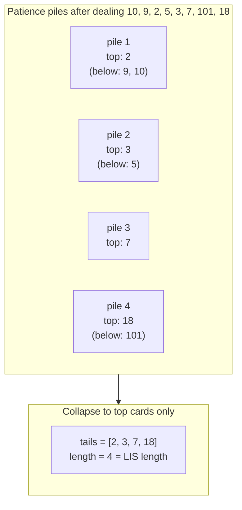

# LIS: patience sort

Hammersley noticed something in 1972 that should not have worked. Take a deck of cards, shuffle it, and deal them out left to right onto piles by one rule: each card goes on the leftmost pile whose top card is greater than or equal to it, or starts a fresh pile to the right when no existing pile qualifies. Count the piles when the deck runs out. That count is the length of the longest increasing subsequence in the dealing order. Not an approximation. The exact answer.

The previous chapter, [LIS: quadratic DP](./08-lis-quadratic.md), solved the same problem with an `O(n^2)` table fill. A clean recurrence, easy to reason about, the reason most engineers can write LIS from memory. The card-game observation collapses that to `O(n log n)` without changing the answer. The collapse is what this chapter is about.

## Patience, the card game

Patience is the British name for what Americans call solitaire.[^2] The variant Mallows wrote up in 1973 deals one card at a time from a shuffled deck onto a row of piles, with the same leftmost-pile-that-tops-out-higher rule above.[^3] The connection to longest increasing subsequences was made formal by Hammersley in 1972[^4] and elevated to a theorem by Aldous and Diaconis in 1999, who frame the algorithm as a "simple one-person card game" and prove the correspondence directly.[^5] Schensted's 1961 paper on Young tableaux is the algorithmic ancestor: the same `O(n log n)` machinery, written in the language of combinatorics rather than card games.[^6]

That is the entire historical detour. The card game earns one paragraph because it makes the algorithm concrete; the rest of the chapter is the algorithm itself.

## From piles of cards to a tails array

Run the rule on `[10, 9, 2, 5, 3, 7, 101, 18]`. Eight cards, four piles.

```text
pile 1: 10 -> 9 -> 2     (each new card buried the previous top)
pile 2: 5 -> 3
pile 3: 7
pile 4: 101 -> 18
```

Four piles. The longest increasing subsequence is length 4. (One witness: `2, 3, 7, 101`. There are others.) Confirm against the quadratic DP from [LIS: quadratic DP](./08-lis-quadratic.md) and the answer matches.

The algorithm only ever needs the *top card of each pile*. When a new card arrives, the question is which pile to land on, and that decision depends entirely on the visible top cards in left-to-right order. The buried cards never come back. So collapse each pile to its top card and keep them in an array. Call that array `tails`.

```text
tails after every step on [10, 9, 2, 5, 3, 7, 101, 18]:

step 1, x = 10:   tails = [10]
step 2, x = 9:    tails = [9]                # 9 buries 10 in pile 1
step 3, x = 2:    tails = [2]                # 2 buries 9 in pile 1
step 4, x = 5:    tails = [2, 5]             # 5 starts pile 2
step 5, x = 3:    tails = [2, 3]             # 3 buries 5 in pile 2
step 6, x = 7:    tails = [2, 3, 7]          # 7 starts pile 3
step 7, x = 101:  tails = [2, 3, 7, 101]     # 101 starts pile 4
step 8, x = 18:   tails = [2, 3, 7, 18]      # 18 buries 101 in pile 4
```

`tails` stays sorted at every step. That is the property the binary search exploits. Sortedness is not an assumption; it is a consequence of the dealing rule, and it survives every step.

The invariant the algorithm maintains, the one sentence to commit to memory:

> `tails[i]` is the smallest possible tail of any increasing subsequence of length `i + 1` discovered so far.[^1]

Three words deserve emphasis. *Smallest possible*: across every length-`(i+1)` subsequence the scan has seen, the smallest end value. *Discovered so far*: the array updates as the scan walks, and the value at index `i` can shrink. *Tail*: the last element of the subsequence, not the entire subsequence. The visible array `tails = [2, 3, 7, 18]` after step 8 is not the LIS itself. One actual LIS of length 4 in this input is `[2, 3, 7, 101]`; another is `[2, 5, 7, 101]`. The tails array stores something subtler than the answer subsequence: it stores the best tail at every length, and that suffices to count the length even when no single subsequence in the input has those exact values in that order.[^1]

### Binary search by tail value

The placement rule, restated for the tails-array form: when card `x` arrives, find the leftmost index `pos` where `tails[pos] >= x`. If no such index exists (every tail is strictly less than `x`), append `x`. Otherwise overwrite `tails[pos]` with `x`.

`tails` is sorted, so finding `pos` is binary search. Python's standard library calls this `bisect_left`; C++ calls it `std::lower_bound`; Go calls it `sort.SearchInts`; Java does not ship a primitive-array equivalent of the right shape, so the reference implementation hand-rolls it. All four return the same value: the leftmost index at which `x` could be inserted while keeping the array sorted, which is exactly the leftmost index where the existing element is greater than or equal to `x`.

Why the leftmost index, not the rightmost? Because a strictly-increasing subsequence cannot include two equal values. When `x` equals the value at some index `pos`, treating `pos` as the landing slot (replace, not extend) preserves the strict-LIS contract. Using the rightmost-fit (`bisect_right`) instead would let an equal value extend the chain, which counts a non-strict subsequence: a different problem, addressed below.

Each step costs `O(log |tails|) <= O(log n)` for the binary search plus `O(1)` for the replace or amortised-`O(1)` for the append. Sum over `n` cards: `O(n log n)`. The space is `O(n)` for the tails array; on a strictly-increasing input the array grows to length `n` and the bound is tight.[^1]

The replacement is the step that hides the work. Watch step 8 again. After step 7, `tails = [2, 3, 7, 101]`, length 4. Card 18 arrives. `bisect_left(tails, 18) = 3`, because `tails[3] = 101 >= 18` and `tails[2] = 7 < 18`. Overwrite `tails[3]` with 18. The length stays 4. The visible tails array is now `[2, 3, 7, 18]`, but no actual LIS in the input ends with 18 at position 3. The algorithm has frozen a *better* tail at length 4 in case a future card extends it. The benefit shows up the moment a card between 18 and 101 arrives: it would extend the tails array to length 5 against the new tail of 18, where it could not have extended against 101.

That asymmetry is why the algorithm works. Replace shrinks the bar for future extensions without ever forgetting the length already reached.

## The pattern

```python
from bisect import bisect_left

def length_of_lis(nums):
    tails = []
    for x in nums:
        i = bisect_left(tails, x)         # leftmost index where tails[i] >= x
        if i == len(tails):
            tails.append(x)               # x exceeds every tail; extend
        else:
            tails[i] = x                  # x replaces a >= tail; freeze a smaller bar
    return len(tails)
```

That is the entire algorithm for the strict-LIS case. Three lines of body, one return. The LC 354 wrapper, which uses this helper unchanged, sits in the worked example below.

## Worked example: LC 354, Russian Doll Envelopes

The problem, paraphrased: given a list of envelopes where each envelope is `[width, height]`, an envelope `(w1, h1)` fits inside another `(w2, h2)` only when `w1 < w2` and `h1 < h2` strictly in both dimensions. Find the longest chain of envelopes that nest. Sample input `[[5, 4], [6, 4], [6, 7], [2, 3]]`, expected output 3 (one chain: `[2, 3]` inside `[5, 4]` inside `[6, 7]`).

The first instinct most readers have is to sort by width and run LIS on heights. That instinct is half right, and the broken half is the most-missed part of LC 354 in interviews.

Try it on the sample. Sort by `(width ASC, height ASC)` and the array becomes `[[2, 3], [5, 4], [6, 4], [6, 7]]`. Heights only: `[3, 4, 4, 7]`. Strict-LIS on `[3, 4, 4, 7]`. The strict-LIS is 3 (one witness: `3, 4, 7`), and the answer happens to come out right.

Now try `[[1, 1], [1, 1], [1, 1]]`. Sort the same way: `[[1, 1], [1, 1], [1, 1]]`. Heights: `[1, 1, 1]`. Strict-LIS is 1. Correct, by luck. Try `[[5, 1], [5, 2], [5, 3]]`. Sort: `[[5, 1], [5, 2], [5, 3]]`. Heights: `[1, 2, 3]`. Strict-LIS is 3. *Wrong*. These three envelopes share a width, so none nests inside any other; the right answer is 1.

The fix is the tie-break. Sort by `(width ASC, height DESC on width tie)`. Heights for the broken case become `[3, 2, 1]`, and the strict-LIS over them is 1, correct. Heights for the original sample become `[3, 4, 7, 4]` (the same-width pair `[6, 4], [6, 7]` flips to `[6, 7], [6, 4]` because `7 > 4`), and the strict-LIS is still 3, also correct.

The argument behind the tie-break is direct. Among envelopes with the same width, at most one can appear in any nesting chain, because no two of them are strictly wider than each other. Sorting their heights *descending* surfaces them in a sequence where a strict-LIS can pick at most one. The strictness of the LIS does the filtering work the dimensional check would have done.[^7]

```python
from bisect import bisect_left

def max_envelopes(envelopes):
    if not envelopes:
        return 0
    envelopes.sort(key=lambda e: (e[0], -e[1]))   # width ASC, height DESC on tie
    return length_of_lis([e[1] for e in envelopes])
```

**Solution** — Python ([Java](./09-lis-patience-sort/lc-354/sol.java) · [C++](./09-lis-patience-sort/lc-354/sol.cpp) · [Go](./09-lis-patience-sort/lc-354/sol.go))

```python
# LC 354. Russian Doll Envelopes
from bisect import bisect_left
from typing import List


def length_of_lis(nums: List[int]) -> int:
    """LC 300 helper. Length of the longest strictly increasing subsequence."""
    tails: List[int] = []
    for x in nums:
        i = bisect_left(tails, x)
        if i == len(tails):
            tails.append(x)
        else:
            tails[i] = x
    return len(tails)


def max_envelopes(envelopes: List[List[int]]) -> int:
    """LC 354. Sort by (width ASC, height DESC on tie), then LIS on heights."""
    if not envelopes:
        return 0
    envelopes.sort(key=lambda e: (e[0], -e[1]))
    return length_of_lis([e[1] for e in envelopes])
```

The LIS phase animates the same way regardless of the input source, so the chapter widget runs against the canonical LC 300 input `[10, 9, 2, 5, 3, 7, 101, 18]` rather than the heights of a sorted envelope list. Both traces end with `tails = [2, 3, 7, 18]` and length 4. The build-up of the array is the lesson, not the specific values.

> **Interactive widget:** [LIS via patience sort](../widgets/w-33-lis-patience.yml) — rendered on the website; the YAML spec describes the keyframes.

*Static fallback: input `[10, 9, 2, 5, 3, 7, 101, 18]` runs through the eight steps. Tails grows `[10] -> [9] -> [2] -> [2, 5] -> [2, 3] -> [2, 3, 7] -> [2, 3, 7, 101] -> [2, 3, 7, 18]`. Length lands at 4. The replacement at step 8, same length but smaller tail, is the moment to pause on; it is the algorithm's central trick.*



*Same algorithm in two views: the patience piles on the left match the tails array on the right card-for-card. The buried cards never re-enter the placement decision, so collapsing each pile to its top is loss-free.*

## What it actually costs

| Variant | Time | Space | Notes |
|---|---|---|---|
| LC 300 patience-sort (this chapter) | `O(n log n)` | `O(n)` | tight on strictly increasing inputs |
| LC 300 quadratic DP (chapter 9.8) | `O(n^2)` | `O(n)` | times out at `n = 2,500` on hidden tests |
| LC 354 sort + patience LIS | `O(n log n)` | `O(n)` | sort and LIS both `O(n log n)`; they compose |
| LC 1964 non-strict streaming | `O(n log n)` | `O(n)` | `bisect_right` swap, emits length per index |
| Average piles count (random permutation) | n/a | `O(sqrt(n))` for tails | Vershik-Kerov-Logan-Shepp gives ~2 sqrt(n) piles[^5] |

The space bound is `O(n)` worst-case but `O(sqrt(n))` on average for a random permutation, by a result that Aldous and Diaconis attribute to the Vershik-Kerov-Logan-Shepp limit theorem.[^5] Interview-scale inputs (`n <= 10^5`) sit well under any practical concern; the algorithm comfortably clears LC time limits where 9.8's quadratic DP times out on the same constraints.

## When the pattern bends: strict versus non-strict

LC 1964 asks for the longest valid obstacle course at every position, where "valid" means each obstacle is taller than *or the same height as* the one before it. The "or the same height as" turns the strict-LIS into a non-strict-LIS: equal values are now allowed to extend the chain.

The change to the algorithm is one line. Replace `bisect_left` with `bisect_right` in Python; replace `lower_bound` with `upper_bound` in C++; replace `sort.SearchInts` with a `sort.Search` call that returns the leftmost index strictly greater than `x` in Go; flip the `<` to `<=` in Java's hand-rolled binary search. `bisect_right` returns the leftmost index strictly greater than `x`, so an equal value at the matching position is preserved (extended past) instead of overwritten.

```python
from bisect import bisect_right

def length_of_non_decreasing_lis(nums):
    tails = []
    for x in nums:
        i = bisect_right(tails, x)
        if i == len(tails):
            tails.append(x)
        else:
            tails[i] = x
    return len(tails)
```

LC 1964 also asks for the answer at *every* position, not just the end. The patience-sort skeleton supports that with no structural change: emit `i + 1` (the index `bisect_right` returned, plus one) at every iteration before performing the update. The streaming output is the running length at every step.

The strict-versus-non-strict choice is a one-word read of the problem statement: "strictly increasing" picks `bisect_left`, "non-decreasing" or "taller than or equal to" picks `bisect_right`. Getting it wrong is silent on inputs without duplicates and loud the moment one duplicate appears.[^8]

## Reconstructing the actual subsequence

The algorithm as written returns the LIS length, not an LIS. The visible tails array is not the answer; step 8 of the worked example froze tails to `[2, 3, 7, 18]`, while one true LIS of length 4 in the same input is `[2, 3, 7, 101]`. Reconstructing the actual subsequence requires extra bookkeeping.

The standard construction tracks two things alongside the main loop: (1) the index in `nums` of the card that landed on each tail position, and (2) for each `nums[i]`, a parent pointer to the card that ended the previous tail position at the moment `nums[i]` was placed. Walk the parent chain backward from the last extended position and you get one valid LIS in reverse. The trick is due to Bespamyatnikh and Segal 2000 and adds no asymptotic cost: `O(n log n)` time, `O(n)` space, the same bounds as the length-only version.[^9]

This is the load-bearing reason the quadratic DP from [LIS: quadratic DP](./08-lis-quadratic.md) is still worth knowing. There, parent pointers fall out naturally: the standard `dp[i]` recurrence already iterates over candidate predecessors, so recording which `j` minimised `dp[i]` reconstructs the LIS in one extra line of code. Patience sort's reconstruction works but takes a few more pieces of state, none of which the chapter's headline algorithm shows; if the interviewer asks for the actual subsequence and the back-pointer construction is not at your fingertips, the quadratic DP is the safer fallback.

## Two pitfalls that bite

> [!WARNING]
> **Wrong tie-break direction on LC 354.** Sorting by `(width ASC, height ASC)` instead of `(width ASC, height DESC)` returns a wrong answer the moment two envelopes share a width. The submission scores 3 instead of 1 on `[[1, 1], [1, 1], [1, 1]]`. The fix is the descending tie-break: same-width envelopes surface as decreasing heights, and a strict-LIS over heights skips the duplicates by construction. The argument is one sentence: among envelopes with the same width, at most one can appear in any nesting chain. The sort encodes that.

> [!WARNING]
> **Reading `tails` as the actual LIS.** The final tails array stores the best tail at every length, not the answer subsequence. Reporting `[2, 3, 7, 18]` as *the* LIS for input `[10, 9, 2, 5, 3, 7, 101, 18]` is wrong; one true LIS is `[2, 3, 7, 101]`. The two are not the same, and conflating them is the most common bug after a shaky reconstruction attempt. If the problem asks for the subsequence (not the length), reach for back-pointers per the section above, or fall back to the quadratic DP from [LIS: quadratic DP](./08-lis-quadratic.md), where reconstruction is one extra line.

## 9.8 versus 9.9: when to pick each

The two chapters solve the same problem. The choice between them is not always speed.

| Concern | 9.8 (`O(n^2)` DP) | 9.9 (`O(n log n)` patience) |
|---|---|---|
| Asymptotic time | `O(n^2)` | `O(n log n)` |
| Fits LC limits at `n = 10^5` | no (timeouts) | yes |
| Mental model effort | moderate (one recurrence) | high (the invariant takes a beat) |
| Path reconstruction | one extra line in the existing loop | needs back-pointer bookkeeping per Bespamyatnikh-Segal[^9] |
| Extends to "count distinct LIS" | direct (a parallel `count[i]` table) | non-trivial |
| Extends to "weighted LIS" or "LIS with constraints" | direct (modify the recurrence) | sometimes requires a Fenwick tree instead |
| Extends to per-prefix LIS lengths | one extra `max` per index | natural; tails length at every step |
| 2D nesting (LC 354 family) | sort + 9.8 = `O(n^2)` after sort | sort + 9.9 = `O(n log n)` after sort |
| Whiteboard from memory | most readers can | a few readers can |

The asymmetry to remember: 9.8 is the chapter that *extends*, 9.9 is the chapter that *scales*. When the problem is "find an LIS, fast, on a long input", 9.9 wins outright. When the problem is "find an LIS *and* report which elements participate", or "count how many distinct LIS exist", or "the weight of an LIS where each element carries a weight", 9.8's recurrence absorbs the change with one or two extra lines while 9.9's tails array needs auxiliary structures bolted on. Mature engineers carry both. The LC interview slate selects for both: LC 300 admits either; LC 354 demands 9.9 (the `n^2` fill times out at the stated bounds); LC 1964 demands 9.9 (the per-prefix output is `O(1)` per step in 9.9 and `O(n)` per step in 9.8).

The honest closing on the comparison: pick 9.8 first when teaching yourself the problem, pick 9.9 first when an interview clock is ticking and the constraints rule 9.8 out. The two algorithms are not rivals; they are the same problem viewed through different lenses, and the lens that fits the question is the one to reach for.

## Problem ladder

### CORE (solve all three to claim chapter mastery)

- [LC 354 — Russian Doll Envelopes](https://leetcode.com/problems/russian-doll-envelopes/) [Hard] • sort-then-lis-patience ★
- [LC 1964 — Find the Longest Valid Obstacle Course at Each Position](https://leetcode.com/problems/find-the-longest-valid-obstacle-course-at-each-position/) [Hard] • non-strict-lis-patience *(reference: Python only)*
- [LC 646 — Maximum Length of Pair Chain](https://leetcode.com/problems/maximum-length-of-pair-chain/) [Medium] • sort-then-lis-patience *(reference: Python only)*

### STRETCH (optional)

- [LC 406 — Queue Reconstruction by Height](https://leetcode.com/problems/queue-reconstruction-by-height/) [Medium] • sort-by-compound-key-then-greedy *(reference: Python only)*

LC 300, *Longest Increasing Subsequence*, is the sibling problem owned by [LIS: quadratic DP](./08-lis-quadratic.md) and intentionally absent from this ladder. The two chapters cite each other for the same problem solved through different lenses; the registry holds LC 300's primary at 9.8 to keep the cross-reference clean.

LC 406 sits in the STRETCH slot as a deliberate trap. It shares the (descending primary, ascending secondary) sort trick that makes LC 354 work, but the body of the algorithm is greedy positional insertion, not LIS at all. Solve LC 354 first; come to LC 406 with the lesson that sort-shape alone is too coarse a pattern signal.

## Where this leads

The patience-sort framing turns one specific problem (LIS) from an `O(n^2)` table fill into an `O(n log n)` array build. The same general move, replace a quadratic DP table with a logarithmic data structure, generalises beyond LIS. The natural follow-up is a Fenwick tree (or binary indexed tree) over compressed values, which solves LIS in the same `O(n log n)` bound and extends to weighted variants the tails array does not absorb cleanly. That structure earns its chapter in Part 11.

The other branch leads inside the DP family. [LIS: quadratic DP](./08-lis-quadratic.md) is the sibling chapter for path reconstruction, count-of-LIS variants, and any problem that asks for state about the LIS rather than just its length. Two algorithms, one problem family, different teaching surfaces; the comparison table above is the map.

## References

[^1]: Wikipedia, "Patience sorting." Sections "Pseudocode," "Analysis," and "Algorithm for finding a longest increasing subsequence." Retrieved 2026-05-20. <https://en.wikipedia.org/wiki/Patience_sorting>.

[^2]: "Patience" is the British and Commonwealth name for the family of single-player card games called "solitaire" in American English.

[^3]: Mallows, C. L., "Patience sorting." *Bulletin of the Institute of Mathematics and Its Applications*, vol. 9 (1973).

[^4]: Hammersley, John, "A few seedlings of research." *Proceedings of the Sixth Berkeley Symposium on Mathematical Statistics and Probability*, vol. 1, University of California Press, 1972, pp.

[^5]: Aldous, David and Diaconis, Persi, "Longest increasing subsequences: from patience sorting to the Baik-Deift-Johansson theorem." *Bulletin of the American Mathematical Society*, vol. 36, no. 4 (1999), pp. 413-432. <https://doi.org/10.1090/S0273-0979-99-00796-X>.

[^6]: Schensted, C., "Longest increasing and decreasing subsequences." *Canadian Journal of Mathematics*, vol. 13 (1961), pp.

[^7]: doocs/leetcode mirror, "354. Russian Doll Envelopes." English README. Retrieved 2026-05-20. <https://raw.githubusercontent.com/doocs/leetcode/main/solution/0300-0399/0354.Russian%20Doll%20Envelopes/README_EN.md>.

[^8]: doocs/leetcode mirror, "1964. Find the Longest Valid Obstacle Course at Each Position." English README. Retrieved 2026-05-20. <https://raw.githubusercontent.com/doocs/leetcode/main/solution/1900-1999/1964.Find%20the%20Longest%20Valid%20Obstacle%20Course%20at%20Each%20Position/README_EN.md>.

[^9]: Bespamyatnikh, Sergei and Segal, Michael, "Enumerating longest increasing subsequences and patience sorting." *Information Processing Letters*, vol. 76, no. 1-2 (2000), pp. 7-11. <https://doi.org/10.1016/S0020-0190(00)00124-1>.
