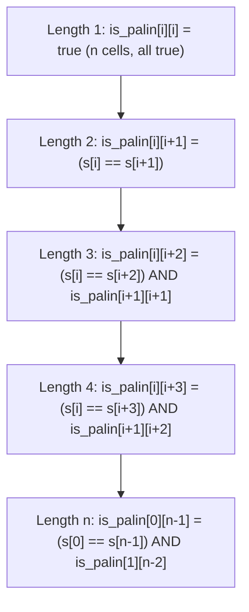
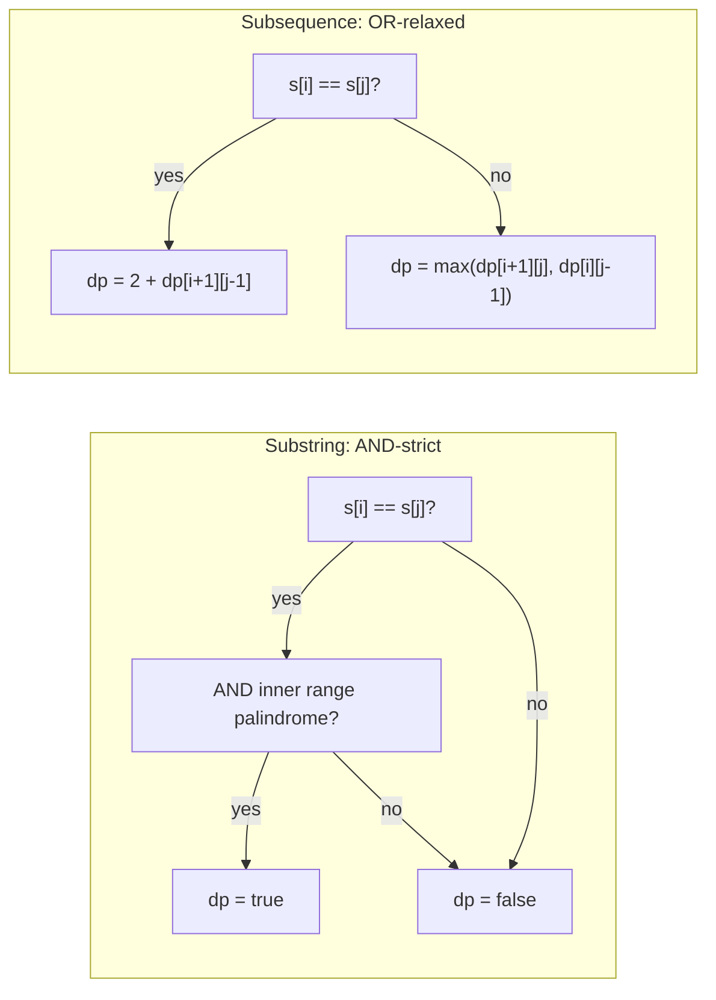

# Palindrome DP

LeetCode 5 ships with `s = "babad"`. The expected output is `"bab"` or `"aba"`; either is accepted. Five characters, two valid answers, and an O(n²) algorithm that fits in twenty lines. The problem looks small. The reason it has been on every DP list since 2011 is that the natural way to fill the table is wrong, and recognising that is the chapter.

Every other 2D-DP problem you have seen so far in this part fills the table row by row. [Longest Common Subsequence](./06-lcs.md) reads `dp[i-1][j-1]`, `dp[i-1][j]`, `dp[i][j-1]`: three cells, all in the row above or the column to the left. Top to bottom, left to right, done. Palindrome-DP reads `dp[i+1][j-1]`. That is a row *below* the current cell. Iterate top-to-bottom and the algorithm reads cells it has not filled yet, returns silent `false` for almost everything, and prints the first character of the input as its answer. The fix is to fill the table by *length*, not by *row*.[^1]

## Why brute force burns

The honest first attempt enumerates every substring of `s` and checks each one for the palindrome property. Three nested operations: pick a left index, pick a right index, run a two-pointer check.

```python
# Brute force: O(n^3) — what we're replacing
def longest_palindrome_brute(s):
    n = len(s)
    if n == 0:
        return ""
    best = s[0]
    for i in range(n):
        for j in range(i, n):
            # is s[i..j] a palindrome?
            l, r = i, j
            ok = True
            while l < r:
                if s[l] != s[r]:
                    ok = False
                    break
                l += 1
                r -= 1
            if ok and j - i + 1 > len(best):
                best = s[i:j + 1]
    return best
```

There are roughly `n²/2` substrings, and the palindrome check costs O(n) per substring, so the total is O(n³). At LC 5's stated bound `n <= 1000`, the worst case does about `5 × 10⁸` operations, well past a one-second time limit in Python or Java.[^2]

The wasted work has a name. Inside the brute force, the algorithm asks "is `s[2..7]` a palindrome?" by comparing `s[2]` against `s[7]`, then `s[3]` against `s[6]`, then `s[4]` against `s[5]`. To answer "is `s[1..8]` a palindrome?" it compares `s[1]` against `s[8]`, then `s[2]` against `s[7]`, then `s[3]` against `s[6]`, then `s[4]` against `s[5]`. The last three comparisons are exactly the work the algorithm did for the smaller substring one iteration ago. Every range of length `L` redoes the inner comparisons that a range of length `L-2` already settled.

The trick is to remember the answer for every range, not recompute it. That is what the table is for.

## The reduction

A range `s[i..j]` is a palindrome when two facts hold at once. The endpoints match: `s[i] == s[j]`. And the strictly inner range `s[i+1..j-1]` is itself a palindrome. The recurrence falls out:

```text
is_palin[i][j] = (s[i] == s[j]) AND (j - i < 2 OR is_palin[i+1][j-1])
```

The `j - i < 2` short-circuit handles the two base cases. A length-1 range (`i == j`) is trivially a palindrome. A length-2 range (`j == i + 1`) is a palindrome whenever the two characters match; there is no inner range to check, so the inner-table lookup is bypassed.

Read the recurrence carefully. The cell at `is_palin[i][j]` of length `L = j - i + 1` depends on the cell at `is_palin[i+1][j-1]` of length `L - 2`. The dependency is on a strictly *shorter* range, sitting strictly *inside* the current range. Inner first, outer last. Shorter first, longer last. That is the only fill order that works.

A row-major fill computes `is_palin[0][j]` (a long range starting at 0) before `is_palin[1][j-1]` (a shorter range starting at 1, sitting one diagonal in). The dependency runs the wrong direction: the algorithm needs the inner cell, but the inner cell has not been filled yet. Read it anyway and the array's default `false` comes back, the AND fails, the cell is marked `false`, and the bug is silent.

The right iteration order is by increasing length. Length 1 first, then length 2, then length 3, all the way up to length `n`. Inside each length pass, walk the starting index `i` from 0 to `n - L`, and derive `j = i + L - 1`. By the time the algorithm computes a length-`L` cell, every length-`(L-2)` cell already has its value.



*Each length-L pass depends only on cells from the length-(L-2) pass; row-major fill would compute the cell before its dependency exists.*

## The pattern

```python
def longest_palindrome(s):
    n = len(s)
    if n == 0:
        return ""
    # is_palin[i][j] = True iff s[i..j] is a palindrome.
    is_palin = [[False] * n for _ in range(n)]
    start, max_len = 0, 1

    # Length 1.
    for i in range(n):
        is_palin[i][i] = True

    # Length 2.
    for i in range(n - 1):
        if s[i] == s[i + 1]:
            is_palin[i][i + 1] = True
            start, max_len = i, 2

    # Length L from 3 to n.
    for L in range(3, n + 1):
        for i in range(n - L + 1):
            j = i + L - 1
            if s[i] == s[j] and is_palin[i + 1][j - 1]:
                is_palin[i][j] = True
                if L > max_len:
                    start, max_len = i, L

    return s[start:start + max_len]
```

**Solution** — Python ([Java](./10-palindrome-dp/lc-5/sol.java) · [C++](./10-palindrome-dp/lc-5/sol.cpp) · [Go](./10-palindrome-dp/lc-5/sol.go))

```python
# LC 5. Longest Palindromic Substring
def longest_palindrome(s: str) -> str:
    """LC 5: 2D by-length DP. O(n^2) time, O(n^2) space."""
    n = len(s)
    if n == 0:
        return ""
    # is_palin[i][j] = True iff s[i..j] is a palindrome.
    is_palin = [[False] * n for _ in range(n)]
    start, max_len = 0, 1

    # Base: every length-1 substring is a palindrome.
    for i in range(n):
        is_palin[i][i] = True

    # Length 2.
    for i in range(n - 1):
        if s[i] == s[i + 1]:
            is_palin[i][i + 1] = True
            start, max_len = i, 2

    # Length L from 3 to n, by-length fill.
    for L in range(3, n + 1):
        for i in range(n - L + 1):
            j = i + L - 1
            if s[i] == s[j] and is_palin[i + 1][j - 1]:
                is_palin[i][j] = True
                if L > max_len:
                    start, max_len = i, L

    return s[start:start + max_len]


def longest_palindrome_centers(s: str) -> str:
    """Same problem, expand-around-centers. O(n^2) time, O(1) space."""
    if not s:
        return ""

    def expand(left: int, right: int) -> tuple[int, int]:
        while left >= 0 and right < len(s) and s[left] == s[right]:
            left -= 1
            right += 1
        # After the loop, [left+1, right-1] is the maximal palindrome.
        return left + 1, right - 1

    best_l, best_r = 0, 0
    for i in range(len(s)):
        # Odd-length palindrome centered at i.
        l1, r1 = expand(i, i)
        # Even-length palindrome centered between i and i+1.
        l2, r2 = expand(i, i + 1)
        if r1 - l1 > best_r - best_l:
            best_l, best_r = l1, r1
        if r2 - l2 > best_r - best_l:
            best_l, best_r = l2, r2
    return s[best_l:best_r + 1]
```

Three things are worth pointing at before the trace.

The base cases are filled outside the main loop. Length 1 is unconditional; every single character is a palindrome by definition. Length 2 fires only when the two adjacent characters match. Filling these explicitly makes the by-length structure unmissable, and it removes the awkward `j - i < 2` short-circuit from the inner loop. The recurrence inside the `L >= 3` block is now the clean form: `s[i] == s[j] AND is_palin[i+1][j-1]`, no special cases.

The outer loop iterates over `L`, and the inner loop iterates over `i`. That ordering is the entire chapter. Swap them, write `for i in range(n): for L in range(...)`, and the dependency breaks: at `i = 0`, you would compute `is_palin[0][L-1]` for every `L`, but `is_palin[1][L-2]` has not been touched yet. Length-major outside, index-major inside; the algorithm reads only cells from earlier length passes.

The witness, meaning the actual substring rather than just its length, is tracked as `(start, max_len)`. The textbook DP recurrence stores a boolean in each cell; the LC 5 problem asks for a string. Whenever a length-`L` palindrome is discovered with `L > max_len`, both `start` and `max_len` update together, and `s[start:start + max_len]` returns the slice at the end. Tracking only `max_len` answers a different question.

> [!IMPORTANT]
> The fill order is the spine of the algorithm. Iterate over length first, starting index second; never row-major. Every cell of length `L` depends on a cell of length `L-2` that sits strictly inside it, so by the time you reach a length-`L` cell, the inner one has already been computed. Reverse the loop nesting and the table fills with `false` everywhere length 3 or longer should be `true`, and the algorithm returns a single character on most inputs.[^3]

## Worked example: LC 5 on `s = "babad"`

Empty table after allocation: `is_palin` is 5 by 5, all `false`. State: `start = 0`, `max_len = 1`.

**Length 1.** Every diagonal cell is set to `true`. `is_palin[0][0] = is_palin[1][1] = is_palin[2][2] = is_palin[3][3] = is_palin[4][4] = true`. The algorithm has discovered five length-1 palindromes; max length stays at 1.

**Length 2.** Walk the four adjacent pairs.

- `i = 0, j = 1`: `s[0] = 'b'`, `s[1] = 'a'`. Mismatch. Cell stays `false`.
- `i = 1, j = 2`: `s[1] = 'a'`, `s[2] = 'b'`. Mismatch. Cell stays `false`.
- `i = 2, j = 3`: `s[2] = 'b'`, `s[3] = 'a'`. Mismatch. Cell stays `false`.
- `i = 3, j = 4`: `s[3] = 'a'`, `s[4] = 'd'`. Mismatch. Cell stays `false`.

No length-2 palindrome in `"babad"`. State unchanged.

**Length 3.** Three candidates: starts at `i = 0, 1, 2`.

- `i = 0, j = 2`: `s[0] = 'b'`, `s[2] = 'b'`. Endpoints match. Inner range is `is_palin[1][1] = true`. *Hit.* Set `is_palin[0][2] = true`. `L = 3 > max_len = 1`, so update `start = 0, max_len = 3`. The substring `s[0..2] = "bab"` is the current best.
- `i = 1, j = 3`: `s[1] = 'a'`, `s[3] = 'a'`. Endpoints match. Inner range is `is_palin[2][2] = true`. *Hit.* Set `is_palin[1][3] = true`. `L = 3` is not greater than `max_len = 3`, so no update. `"aba"` exists in the table; `"bab"` was found first and stays as the witness.
- `i = 2, j = 4`: `s[2] = 'b'`, `s[4] = 'd'`. Mismatch. Cell stays `false`.

**Length 4.** Two candidates.

- `i = 0, j = 3`: `s[0] = 'b'`, `s[3] = 'a'`. Mismatch.
- `i = 1, j = 4`: `s[1] = 'a'`, `s[4] = 'd'`. Mismatch.

**Length 5.** One candidate.

- `i = 0, j = 4`: `s[0] = 'b'`, `s[4] = 'd'`. Mismatch.

End of loop. Return `s[0:0 + 3] = "bab"`.

The trace shows the asymmetry the problem statement allows. Both `"bab"` and `"aba"` are length-3 palindromes inside `"babad"`, and the algorithm registers both in the table, but only the *first* one discovered at each length wins the witness. Either answer is accepted by LC 5. Replace the strict `>` with `>=` in the witness update and the algorithm returns `"aba"` instead, also correct.

*Static fallback: the by-length fill paints the table's main diagonal at length 1, finds nothing at length 2, hits twice at length 3 (cells `(0,2)` and `(1,3)` both flip to true), then misses every cell at lengths 4 and 5. The first hit at length 3 anchors the witness; the answer is `"bab"`.*

## Expand around centers: from O(n²) space to O(1)

The 2D table records, for every pair `(i, j)`, whether `s[i..j]` is a palindrome. After the fill is done, only one of those facts is consulted: the `(start, max_len)` pair updated in flight. The remaining `n²/2 - 1` cells are written, never read.

There is a way to compute the same answer without materialising the table at all.

Walk every possible *center* of a palindrome and expand outwards while the characters on each side match. A palindrome of odd length has a single character at its middle: `"racecar"` is centered on the `'e'`. A palindrome of even length is centered between two characters: `"bb"` is centered between index 0 and index 1. There are `n` odd-length centers (one per character) and `n - 1` even-length centers (one per adjacent pair), totalling `2n - 1` candidates. For each center, expand outwards until the two ends disagree or one falls off the string, and record the longest palindrome found anywhere.

```python
def longest_palindrome_centers(s):
    if not s:
        return ""

    def expand(left, right):
        while left >= 0 and right < len(s) and s[left] == s[right]:
            left -= 1
            right += 1
        return left + 1, right - 1

    best_l, best_r = 0, 0
    for i in range(len(s)):
        l1, r1 = expand(i, i)        # odd-length, centered at i
        l2, r2 = expand(i, i + 1)    # even-length, between i and i+1
        if r1 - l1 > best_r - best_l:
            best_l, best_r = l1, r1
        if r2 - l2 > best_r - best_l:
            best_l, best_r = l2, r2
    return s[best_l:best_r + 1]
```

The two algorithms are isomorphic. The 2D table writes down the answer to "is `s[i..j]` a palindrome?" for every pair; the centers method computes the same answer on the fly and discards it. Both are O(n²) time. There are `2n - 1` centers, each expanding at most `n/2` steps, summing to `n²/2` by the same arithmetic-series argument that counts the cells of the upper triangle.[^4] The space cost is what differs: O(n²) for the table, O(1) for the centers.

The centers method is two-thirds the typed code and the answer most interviewers want to see. The table is the better teaching frame because the by-length structure is visible in the loop nesting; the centers method hides it inside the recursion of two pointers walking outwards from each candidate.[^4]

> [!WARNING]
> **Forgetting to check both odd-length and even-length centers.** Running `expand(i, i)` for each `i` finds every odd-length palindrome and misses every even-length one. The bug shows up immediately on `s = "cbbd"`: the algorithm returns a single character (`"c"`, `"b"`, or `"d"`) instead of the correct `"bb"`. Even-length palindromes are anchored *between* two characters, not on a single character; the dual call `expand(i, i)` and `expand(i, i+1)` per index is the standard fix, and Wikipedia's "Slower algorithm" exposition spells out exactly this case.[^4]

## Substring is not subsequence

The chapter's recurrence has a sibling that looks similar at first glance and is a different algorithm.

LC 516 asks for the longest palindromic *subsequence*, where characters can be skipped. On input `"bbbab"`, LC 5 (substring) returns `"bbb"` (length 3, the contiguous run). LC 516 (subsequence) returns 4: skip the `'a'` at index 3, and the remaining `"bbbb"` reads the same forward and backward. Same input, different problem, different recurrence.

The substring recurrence is a strict AND. Endpoints must match *and* the inner range must be a palindrome. If either fails, the cell is `false`. The subsequence recurrence relaxes that: when endpoints disagree, take the better of "skip the left endpoint" and "skip the right endpoint", which is exactly the LCS shape from [Longest Common Subsequence](./06-lcs.md).



*Substring requires endpoint match AND inner palindrome, a strict conjunction that propagates "no" up the chain. Subsequence relaxes the unequal-endpoints branch to a max over two strictly smaller subproblems, mirroring the LCS recurrence.[^5]*

The diagnostic test: ask whether the problem allows skipping characters. If `"aabb"` should yield `"abba"` or `"ab"` as a valid palindromic answer, it is a subsequence problem and the recurrence relaxes. If `"aabb"` requires `"aa"` or `"bb"`, it is a substring problem and the recurrence stays strict. Reach for LCS-style logic on a substring problem and the algorithm returns wrong answers like `"bbb"` for `"abcbcba"` instead of the correct `"abcbcba"` (the entire string is a palindromic substring of itself).

## What it actually costs

| Variant | Time | Space | Notes |
|---|---|---|---|
| 2D DP table fill (LC 5, LC 647) | O(n²) | O(n²) | one bool per substring; `n*(n+1)/2` cells filled in length order |
| Expand around centers (LC 5, LC 647) | O(n²) | O(1) | same work as the table, never materialised |
| LP-Subsequence DP (LC 516, LC 1312) | O(n²) | O(n²) | CLRS Problem 14-2 / 15-2 textbook recurrence[^5] |
| Min-cut palindrome partition (LC 132) | O(n²) | O(n²) | 1D `dp[i] = min cuts` layered on the boolean palindrome table |
| Manacher's algorithm | O(n) | O(n) | linear-time, taught in the strings part (see below) |

The O(n²) bound is tight for the chapter's algorithms because the algorithm answers a question about every contiguous substring of `s`, and there are exactly `n*(n+1)/2` such substrings. Each cell of the table costs O(1) work; the centers method does the same work without writing it down. The `n²/2` lower bound holds for any algorithm that is forced to consider every range.

The O(n) breakthrough is Manacher's algorithm, published by Glenn Manacher in 1975 in the *Journal of the ACM*.[^6] It exploits palindrome mirroring: when the algorithm has already discovered a long palindrome centered at position `c` with right boundary `r`, any position `i < r` inherits at least `min(r - i, p[mirror])` of its palindrome radius for free, by the symmetry of the enclosing palindrome. The total work amortises to O(n) by a "center never decreases, right boundary only increases" potential argument.[^4] The algorithm fits in roughly thirty lines but is genuinely subtle; reading the code without watching it run is hard. The strings part of the curriculum owns Manacher in full. For interview purposes, O(n²) is the realistic ceiling. LC 5's `n <= 1000` constraint means about `10⁶` operations in the table version, which passes in any language without tuning.[^2]

## When the pattern bends

The boolean predicate `is_palin[i][j]` is the spine. Three other interview problems read out of the same table, or out of a recurrence with the same shape, in different ways.

### Counting hits instead of finding the longest (LC 647)

LC 647 asks how many distinct contiguous substrings of `s` are palindromes. Run the same fill order, the same recurrence, the same length-major iteration; replace the `(start, max_len)` witness with a counter that increments every time `is_palin[i][j]` flips to `true`. The expand-around-centers form is even cleaner: at each center, every successful expansion step counts as one new palindrome, so the answer is the sum of expansion lengths across all `2n - 1` centers. Same time complexity, same code skeleton, different read-out.[^4]

### Reduction: insertions to make a palindrome equals `n - LPS` (LC 1312)

LC 1312 asks for the minimum number of single-character insertions needed to turn `s` into a palindrome. The reduction is the chapter's quiet reveal:

```text
min_insertions(s) = len(s) - LPS(s)
```

`LPS` is the length of the longest palindromic *subsequence* of `s`. The intuition is that the LPS is the longest skeleton already in palindrome shape; every character outside that skeleton must be matched by an inserted twin to fix the asymmetry, costing one insertion per outsider. On `s = "leetcode"`, the longest palindromic subsequence is `"eee"` (length 3), so the answer is `8 - 3 = 5`.[^7]

The algorithm is the LP-Subsequence DP from §"Substring is not subsequence": same `dp[i][j]` over the closed range `s[i..j]`, same by-length fill, AND-relaxed-to-max recurrence. The insertion count is read off as `n - dp[0][n-1]`.

### Layered DP: minimum cuts (LC 132)

LC 132 asks for the minimum number of cuts that partition `s` into palindromic substrings. Two DPs stacked. The chapter's `is_palin[i][j]` table is filled first as an oracle. A 1D table `cuts[i] = min cuts to partition s[0..i]` is filled second:

```text
cuts[i] = 0                                        if is_palin[0][i]
cuts[i] = min over j < i of cuts[j] + 1            otherwise, where is_palin[j+1][i]
```

The outer loop runs over `i` from 0 to `n - 1`; the inner loop runs over candidate cut points `j`. Both loops are O(n), so the total cost is O(n²) on top of the O(n²) palindrome-table fill, still O(n²) overall. LC 132 cross-lists with [Interval DP](./11-interval-dp.md), which owns the cut-counting recurrence shape; this chapter owns the palindrome predicate it relies on.[^7]

## Pitfalls

> [!WARNING]
> **Off-by-one in the inner-table lookup at length 2.** Writing the recurrence as `is_palin[i][j] = (s[i] == s[j]) AND is_palin[i+1][j-1]` without the `j - i < 2` short-circuit reads `is_palin[i+1][i]` for length-2 cells. That cell sits below the diagonal, in the unused half of the table, and defaults to `false` from zero-initialisation. Result: every length-2 palindrome (`"aa"`, `"bb"`, `"oo"`) is silently missed. Fix it by either keeping the `j - i < 2 OR is_palin[i+1][j-1]` short-circuit in a single recurrence or by filling length 1 and length 2 explicitly as base cases before the length-3 loop, as the reference implementation does.

> [!WARNING]
> **Confusing substring with subsequence.** "Longest palindromic substring" (LC 5) and "longest palindromic subsequence" (LC 516) sound nearly identical and have similar 2D recurrences, but they are different problems. On `"abcbcba"`, LC 5 returns the entire string (length 7, contiguous palindrome). LC 516 also returns 7 here, but on `"bbbab"` the two diverge: LC 5 returns `"bbb"` (length 3), LC 516 returns 4 (the subsequence `"bbbb"`). Restate the problem in your own words before writing the recurrence. If characters can be skipped, the recurrence is the LCS-shaped max over two smaller subproblems; if they cannot, the recurrence is the strict AND from this chapter.[^5]

## Problem ladder

### CORE (solve all three to claim chapter mastery)

- [LC 5 — Longest Palindromic Substring](https://leetcode.com/problems/longest-palindromic-substring/) [Medium] • palindrome-dp-by-length ★
- [LC 647 — Palindromic Substrings](https://leetcode.com/problems/palindromic-substrings/) [Medium] • palindrome-dp-by-length
- [LC 1312 — Minimum Insertion Steps to Make a String Palindrome](https://leetcode.com/problems/minimum-insertion-steps-to-make-a-string-palindrome/) [Hard] • palindrome-dp-subseq-reduction

### STRETCH (optional)

- [LC 516 — Longest Palindromic Subsequence](https://leetcode.com/problems/longest-palindromic-subsequence/) [Medium] • palindrome-dp-subseq
- [LC 132 — Palindrome Partitioning II](https://leetcode.com/problems/palindrome-partitioning-ii/) [Hard] • interval-dp-with-palindrome-table

LC 5 is the chapter's signature problem (★) and the cleanest demonstration of the by-length fill. The CORE three exercise the three load-bearing read-outs of the palindrome predicate: longest substring (LC 5), count of palindromic substrings (LC 647), and the `n - LPS` reduction for minimum insertions (LC 1312). No canonical Easy palindrome-DP problem exists in interview rotation. LC 9 (Palindrome Number) is integer math and LC 125 (Valid Palindrome) is a two-pointer check; neither uses the table, so the ladder spans Medium and Hard only.

## Where this leads

The chapter that follows, [Interval DP](./11-interval-dp.md), generalises the cut-counting layer used by LC 132 into a family that includes matrix-chain multiplication (LC 1039), burst balloons (LC 312), and the stone-game variants. The shape is the same: a 2D table indexed by closed ranges `[i, j]`, filled by increasing length, with the inner cell aggregating over a partition point inside the range.

Manacher's O(n) algorithm, the linear-time replacement for the centers method, lives in the strings part of the curriculum alongside KMP and Aho-Corasick. The interview ceiling for LC 5 is comfortably O(n²), so a working palindrome-DP is enough for almost every loop you will actually run. If you ever need linear time on a million-character input, the strings part is the next stop.

## References

[^1]: LeetCode, "5. Longest Palindromic Substring." <https://leetcode.com/problems/longest-palindromic-substring/>.

[^2]: walkccc/LeetCode, "5. Longest Palindromic Substring." <https://walkccc.me/LeetCode/problems/5/>.

[^3]: GeeksforGeeks, "Longest Palindromic Substring using Dynamic Programming." <https://www.geeksforgeeks.org/dsa/longest-palindromic-substring-using-dynamic-programming-2/>.

[^4]: Wikipedia, "Longest palindromic substring." <https://en.wikipedia.org/wiki/Longest_palindromic_substring>.

[^5]: walkccc/CLRS, "15-2 Longest palindrome subsequence" (CLRS 3rd ed. Problem 15-2; 4th ed. Problem 14-2). <https://walkccc.me/CLRS/Chap15/Problems/15-2/>.

[^6]: Glenn Manacher, "A new linear-time 'on-line' algorithm for finding the smallest initial palindrome of a string," *Journal of the ACM*, 22(3):346–351, 1975.

[^7]: walkccc/LeetCode, "132. Palindrome Partitioning II." <https://walkccc.me/LeetCode/problems/132/>.
