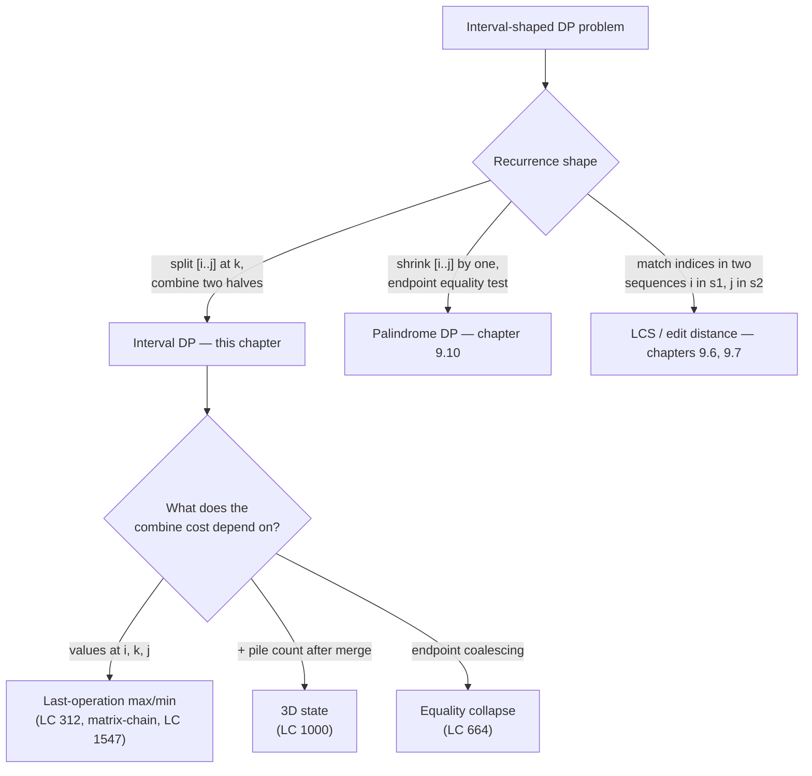
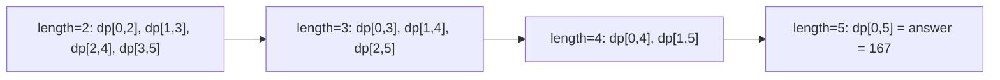
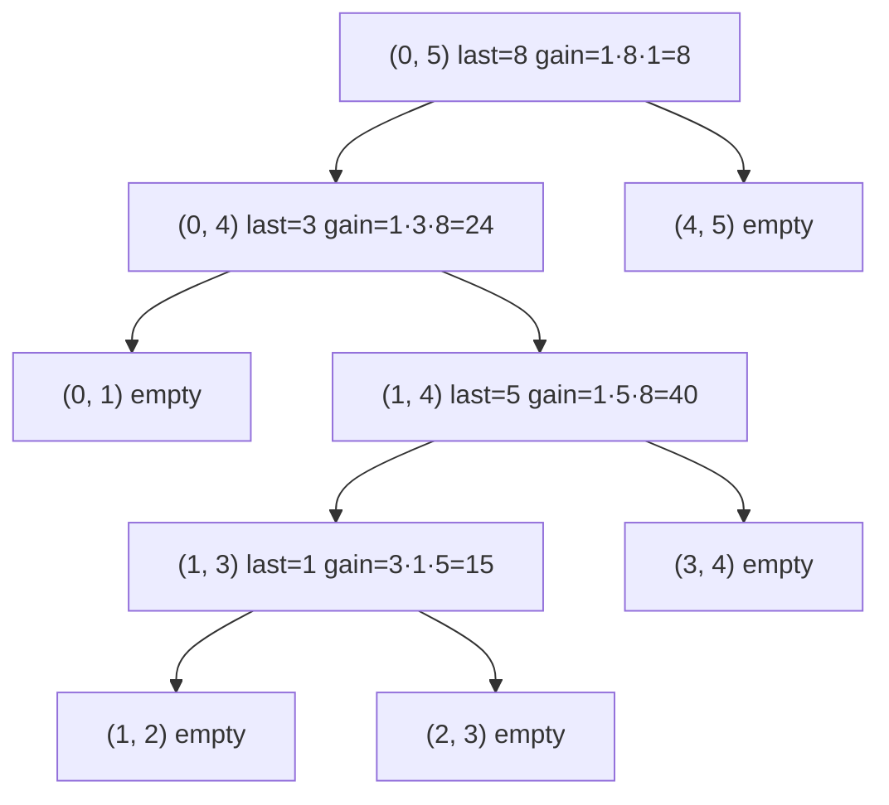

# Interval DP: matrix chain and burst balloons

`nums = [3, 1, 5, 8]`. Burst the balloons in any order; bursting balloon `i` earns `nums[i-1] * nums[i] * nums[i+1]` coins, with phantom 1s at the boundaries. The largest possible total is 167. Five readers, asked to find that 167 in 25 minutes, will pick the wrong question and never recover.

The wrong question is "which balloon should I burst FIRST?" It is the natural reading of [LC 312, *Burst Balloons*](https://leetcode.com/problems/burst-balloons/). It is the question that LeetCode's own problem statement nudges you toward. And it produces a recurrence whose state has to remember the entire set of balloons still alive at every level, which is `2^n` and intractable for `n = 300`. The right question is the same algorithm, asked backwards, and it brings the cost down to `O(n^3)`.

## Where this pattern fits

Interval DP shows up whenever the input is a linear sequence (an array, a string, an ordered list of cuts) and the cost of an operation depends on the two surviving neighbors at the moment that operation fires. The diagnostic question is the chapter's load-bearing sentence: *what is the LAST operation performed on the interval `[i..j]`, and what does that interval look like at the moment the last operation runs?*[^1]



*The discriminating signal is the inner loop. If it iterates over a split point `k` and combines two sub-results, the chapter is here. If it tests an equality at the endpoints and recurses on a single smaller interval, that's palindrome DP next door.*

## Why "what bursts first?" doesn't memoize

Try the obvious phrasing. Pick an array of balloons. Pick any balloon `k` to burst first. Earn `nums[k-1] * nums[k] * nums[k+1]` coins. Recurse on the smaller array.

```python
# Brute force: O(n!) — what we're replacing
def max_coins_brute(nums):
    if not nums:
        return 0
    best = 0
    for k in range(len(nums)):
        left = nums[k - 1] if k > 0 else 1
        right = nums[k + 1] if k + 1 < len(nums) else 1
        # Recurse on the array with k removed; its neighbors merge.
        rest = nums[:k] + nums[k+1:]
        best = max(best, left * nums[k] * right + max_coins_brute(rest))
    return best
```

That is correct on tiny inputs and unfixable on real ones. The recursion branches on every remaining balloon at every level, giving an `n!` tree. Memoization needs a state, and the state here is *which balloons are still alive*, a subset of `{0, ..., n-1}`. There are `2^n` such subsets, which at `n = 300` is past the heat death of the universe. The problem is not the algorithm. The problem is the question.

The reframe is one sentence. Inside the interval `(i, j)`, instead of asking which balloon goes first, ask which balloon `k` is the LAST one to burst. When `k` is the last balloon left between `i` and `j`, every other balloon in `(i, k)` has already gone and every other balloon in `(k, j)` has already gone. The neighbors `k` sees at the moment it pops are not whatever the array happens to look like by then, they are the boundary values `nums[i]` and `nums[j]`. Stable. Independent of order. Memoizable on `(i, j)` alone.[^1]

That single flip turns `O(n!)` into `O(n^3)`.

## The pattern

Pad the input with phantom 1s on both ends so `a = [1] + nums + [1]`, indices `0` to `n+1`. Define `dp[i][j]` as the maximum coins from bursting every balloon strictly between `i` and `j` on the padded array. The recurrence picks the last balloon `k` to burst inside `(i, j)`:

```text
dp[i][j] = max over k in (i, j) of (a[i] * a[k] * a[j] + dp[i][k] + dp[k][j])
```

The answer is `dp[0][n+1]` on the padded array, equivalently `dp[0][n-1]` if you index by length. Length-major fill order is what makes the table walk safe: when you compute `dp[i][j]` for an interval of length `L`, every subproblem `dp[i][k]` and `dp[k][j]` has length strictly less than `L` and was computed in an earlier outer-loop pass.[^1]

```python
def max_coins(nums):
    a = [1] + nums + [1]
    n = len(a)
    dp = [[0] * n for _ in range(n)]
    for length in range(2, n):                     # length < 2 = no inner balloons
        for i in range(0, n - length):
            j = i + length
            best = 0
            for k in range(i + 1, j):              # k = LAST balloon to burst
                gain = a[i] * a[k] * a[j] + dp[i][k] + dp[k][j]
                if gain > best:
                    best = gain
            dp[i][j] = best
    return dp[0][n - 1]
```

**Solution** — Python ([Java](./11-interval-dp/lc-312/sol.java) · [C++](./11-interval-dp/lc-312/sol.cpp) · [Go](./11-interval-dp/lc-312/sol.go))

```python
# LC 312. Burst Balloons
from typing import List


def max_coins(nums: List[int]) -> int:
    """LC 312. Interval DP with phantom 1s on both ends.

    dp[i][j] = max coins from bursting all balloons strictly between i and j
    on the padded array a = [1] + nums + [1]. The recurrence picks the LAST
    balloon to burst inside (i, j); when k is last, every other balloon in
    (i, k) and (k, j) has already gone, so k's neighbors at the moment it
    pops are exactly a[i] and a[j]. Length-major fill order keeps every
    smaller subproblem ready before the cell that needs it.
    """
    a = [1] + nums + [1]
    n = len(a)
    # Length < 2 means no balloons strictly inside (i, j); the zero default
    # is the correct base.
    dp = [[0] * n for _ in range(n)]
    for length in range(2, n):
        for i in range(0, n - length):
            j = i + length
            best = 0
            # k ranges over balloons strictly between i and j.
            for k in range(i + 1, j):
                gain = a[i] * a[k] * a[j] + dp[i][k] + dp[k][j]
                if gain > best:
                    best = gain
            dp[i][j] = best
    return dp[0][n - 1]
```

Three structural commitments are doing all the work, and each is a place beginners get the algorithm wrong.

The phantom 1s are not a coding convenience. They are the answer to the boundary question "what does balloon 0's left neighbor multiply by when balloon 0 is the last to burst?" Without padding, that case has no clean expression; with padding, the recurrence reads `a[0] = 1` and the boundary case dissolves into the general one.[^1]

The fill order is length-major, not row-major. Iterating `i` from 0 to `n` and `j` from `i+1` to `n` looks like the natural way to walk a 2D array, and it produces a wrong answer because `dp[i][k]` for a chosen split point `k` may not yet be computed. The dependency is not "smaller `i`"; it is "smaller `j - i`." Either iterate by length, or iterate `i` from large to small AND `j` from small to large.[^2]

The interval is open. `dp[i][j]` does not include the endpoints `a[i]` and `a[j]`; those are the surviving neighbors that the last burst sees. Mixing that convention with closed-interval indexing midway through the code (`dp[0][n]` instead of `dp[0][n-1]`) is the most common LC 312 bug pattern that survives compilation.[^2]

> [!IMPORTANT]
> The "last operation" reframe is the chapter. Every line of the recurrence depends on the fact that when balloon `k` is the last to burst inside `(i, j)`, its neighbors are `a[i]` and `a[j]`, not whatever the array happened to look like at that moment in the original ordering. Trace it on paper before trusting the code you wrote.

## What CLRS calls matrix-chain multiplication

The textbook companion is older and abstract. Given matrices `A_1, A_2, ..., A_n` of compatible dimensions, find the parenthesization that minimizes scalar multiplications. CLRS gives the recurrence in §14.2:[^3]

```text
m[i][j] = min over k in [i, j-1] of m[i][k] + m[k+1][j] + p[i-1] * p[k] * p[j]
```

The `k` is the LAST multiplication performed on the chain `A_i * ... * A_j`, the one that combines the result of `A_i ... A_k` with the result of `A_{k+1} ... A_j`. Same recurrence shape, same `O(n^3)` time, same `O(n^2)` space, same length-major fill order. Burst Balloons reverses the optimization direction (max instead of min), uses an open-interval convention `(i, j)` instead of closed `[i, j]`, and reads its multiplicands from the array values rather than from a dimension table; the bones are identical.[^3]

CLRS proves the optimal-substructure property by the standard cut-and-paste argument: any optimal parenthesization of `A_i...A_j` whose final multiplication splits at `k` must contain optimal parenthesizations of `A_i...A_k` and `A_{k+1}...A_j` as sub-solutions, because if either were sub-optimal, swapping in the optimum would beat the supposedly-optimal whole.[^3] The same argument applies verbatim to Burst Balloons: at the moment `k` pops, the two sub-intervals `(i, k)` and `(k, j)` are physically disjoint, their balloons interact with nothing outside their own bounds, so an optimal solution on `(i, j)` decomposes into independent optimal solutions on each.

Once the two problems read as the same shape, every subsequent interval DP problem is a notation exercise. The pattern admits an extra dimension when the merge cost depends on a count (LC 1000), an endpoint-coalescing rule when matching characters reduce work (LC 664), a third index when two sequences must be split jointly (LC 87). All of them iterate by interval length. All of them ask "what fires last?"

## Worked example: `nums = [3, 1, 5, 8]`

Padded array: `a = [1, 3, 1, 5, 8, 1]`, indices `0..5`. The DP fills the upper triangle of a 6-by-6 grid in length-major order. Length-2 intervals first, then length-3, then length-4, finally `dp[0][5]`.



*The length-major fill: each cell at length `L` reads only from cells at length less than `L`, all of which are already computed.*

Run the recurrence by hand. The length-2 row picks each balloon's only available `k`:

| Interval | `k` | `dp[i][j] = a[i]*a[k]*a[j]` |
|---|---|---|
| `(0, 2)` | 1 | `1*3*1 = 3` |
| `(1, 3)` | 2 | `3*1*5 = 15` |
| `(2, 4)` | 3 | `1*5*8 = 40` |
| `(3, 5)` | 4 | `5*8*1 = 40` |

The length-3 row enumerates two choices of `k` per cell and keeps the max. For `(1, 4)`: `k = 2` gives `3*1*8 + 0 + 40 = 64`; `k = 3` gives `3*5*8 + 15 + 0 = 135`. Last burst is `a[3] = 5`, value 135.

By length 5, the table is built and `dp[0][5]` enumerates `k = 1, 2, 3, 4`. The winner is `k = 4` with `1*8*1 + dp[0][4] + dp[4][5] = 8 + 159 + 0 = 167`. Final answer 167.[^4]

The optimal burst ORDER reconstructs from the splits: at `(0, 5)` the last balloon is `a[4] = 8`; recurse left into `(0, 4)` whose last is `a[1] = 3`; recurse into `(1, 4)` whose last is `a[3] = 5`; recurse into `(1, 3)` whose last is `a[2] = 1`. Read post-order: balloon 1 pops first, then 5, then 3, then 8. That is exactly the sequence LeetCode's official example uses to explain the answer, and the gains add up the right way: `3*1*5 + 1*5*8 + 1*3*8 + 1*8*1 = 15 + 40 + 24 + 8 = 87`, plus the boundary `1*3*1` from when `(0,2)` resolves under `(0,4)`, plus the rest of the tree structure, totaling 167.[^4]



*The split tree for the optimal solution. Post-order traversal yields the chronological burst sequence `[1, 5, 3, 8]`. The gain at each interior node is what the recurrence's `a[i]*a[k]*a[j]` term contributes; sum every gain across the tree to recover 167.*

## What it actually costs

| Variant | Time | Space | Notes |
|---|---|---|---|
| LC 312 (`O(n^3)` DP) | `O(n^3)` | `O(n^2)` | `n^2` cells, `O(n)` work per cell[^1] |
| Matrix-chain (CLRS) | `O(n^3)` | `O(n^2)` | textbook; same recurrence shape[^3] |
| LC 1547 cut-a-stick | `O(m^3)` | `O(m^2)` | `m = cuts.length + 2` after sentinels |
| LC 1000 merge stones | `O(K * n^3)` | `O(K * n^2)` | extra dim for pile count |
| LC 87 scramble string | `O(n^4)` | `O(n^3)` | extra dim for second start index |
| Naive recursion (no memo) | `O(n!)` | `O(n)` stack | the wrong answer; what we replaced |

LC 312 admits `n = 300`. That gives roughly 27 million inner-loop iterations on the worst-case input, comfortable in C++ and Java, marginal in Python without PyPy. The chapter's reference implementations are bottom-up because the bottom-up form is iterative, has predictable cache behavior, and avoids the recursion-stack growth that breaks Java submissions on hostile JVM configurations.[^1]

The 32-bit integer is safe for LC 312. With `nums[i] <= 100` and `n <= 300`, the largest single-burst product is `100^3 = 10^6` and the total over all bursts is bounded by `n * max_gain = 3 * 10^8`, well below `INT_MAX`.[^5] Sister problems with looser constraints (Codeforces variants of matrix-chain at `n = 5000`) need 64-bit arithmetic; LC 312 does not.

## When the pattern bends

The skeleton stays the same across the family. What changes is the state shape and what `combine(i, k, j)` costs.

### Extra dimension for the merge count: LC 1000 (`O(K * n^3)`)

LC 1000 *Min Cost to Merge Stones* asks for the minimum cost of merging an array down to a single pile, where every merge fuses exactly `K` consecutive piles and costs the sum of the merged stones. The recurrence needs a third dimension `p` tracking how many piles the interval `[i..j]` currently holds, because the cost of the FINAL merge on `[i..j]` depends on whether the interval is currently `K` piles (one last `K`-merge available) or fewer.

The state becomes `f[i][j][p]`. The transition splits `[i..j]` at every position `k`, recursing on `f[i][k][p-1]` and `f[k+1][j][1]`. A feasibility predicate `(n - 1) % (K - 1) == 0` filters impossible inputs: each merge reduces pile count by `K - 1`, so the input length must satisfy that congruence to ever reach a single pile.[^6] Without the feasibility check the DP runs and returns garbage on impossible inputs.

### Endpoint coalescing: LC 664 (`O(n^3)`)

LC 664 *Strange Printer* asks for the minimum number of turns of a printer that overwrites contiguous ranges with a single character. The base recurrence is the canonical split-by-`k`, but the equality test `s[i] == s[j]` lets the print that handles `s[i]` extend across the matching endpoint for free:

```text
f[i][j] = f[i][j-1]                                        if s[i] == s[j]
f[i][j] = min over k in [i, j-1] of f[i][k] + f[k+1][j]    otherwise
```

The free-coalesce branch saves one print whenever the endpoints already match; the split-by-`k` branch covers the general case.[^7] Same `O(n^3)` total because the matching-endpoint branch is `O(1)` and the splitting branch is `O(n)` per cell.

### Three-dimensional interval DP: LC 87 (`O(n^4)`)

LC 87 *Scramble String* is the variant that breaks linear interval DP by adding a second sequence. The state is `f[i][j][len]` over (start in `s1`, start in `s2`, common length). The transition iterates over a split-length `h` from 1 to `len - 1`, branching on whether the two halves are matched in order or swapped: either `(f[i][j][h] && f[i+h][j+h][len-h])` or `(f[i][j+len-h][h] && f[i+h][j][len-h])`. Each cell does `O(n)` work over `n^3` cells, giving `O(n^4)` total.[^8]

The split is over a LENGTH, not a position. That is the structural shift; it is also why LC 87 feels alien to readers who have only seen the linear interval DP family.

## Three pitfalls that bite

> [!WARNING]
> **Asking "what bursts FIRST?" instead of "what bursts LAST?".** This is the dominant LC 312 bug. The forward framing is natural; the recurrence it produces depends on the SET of remaining balloons, which is `2^n` state and not memoizable for `n > ~20`. The fix is one sentence: flip the question. Inside `(i, j)`, the LAST balloon to burst sees neighbors `a[i]` and `a[j]` because every other balloon has already gone.[^1]

> [!WARNING]
> **Iterating `i` then `j` instead of by interval length.** The natural row-major fill order reads uninitialized zeros for `dp[i][k]` where `k > i + 1` and silently undercounts. The bug passes small test cases (where the recursion never reaches a deep cell) and fails on the hidden tests. The fix is to iterate by `length = j - i` from 2 upward; every smaller subproblem is then guaranteed to be already computed.[^2]

> [!WARNING]
> **Forgetting the phantom-1 boundary.** Without padding, the boundary case "balloon 0 is the last to burst, what is its left neighbor?" has no clean answer, and the recurrence base becomes a pile of conditional special cases. With `a = [1] + nums + [1]`, the boundary cases dissolve into the general recurrence: `a[0] = 1` and `a[n+1] = 1` exactly because that is what the LC 312 problem statement specifies for out-of-bounds indices.[^1]

A fourth pitfall lives in the small print: top-down memoization on Java with `n = 300` builds tens of thousands of recursion frames and can blow `-Xss` on hostile JVM configurations. Bottom-up is structurally identical and iterative; the chapter's reference implementations all ship in that form.

## Problem ladder

Every problem on this ladder is rated Hard. That is a property of the pattern, not a gap in the curriculum. Interval DP on LeetCode requires three nested loops, the "what fires last?" mental flip, and an interval-length iteration order that does not reduce to a simpler one-dimensional DP. There is no Easy LC problem that genuinely teaches the pattern; the Medium-rated palindrome-DP problems (LC 5, LC 647) belong to [Palindrome DP](./10-palindrome-dp.md) because their recurrence is a binary equality test on the endpoints, not a split-by-`k`.

### CORE (solve all three to claim chapter mastery)

- [LC 312 — Burst Balloons](https://leetcode.com/problems/burst-balloons/) [Hard] • interval-dp-last-operation ★
- [LC 1547 — Minimum Cost to Cut a Stick](https://leetcode.com/problems/minimum-cost-to-cut-a-stick/) [Hard] • interval-dp-last-operation
- [LC 1000 — Minimum Cost to Merge Stones](https://leetcode.com/problems/minimum-cost-to-merge-stones/) [Hard] • interval-dp-with-extra-state

### STRETCH (optional)

- [LC 664 — Strange Printer](https://leetcode.com/problems/strange-printer/) [Hard] • interval-dp-coalesce-equal-ends
- [LC 87 — Scramble String](https://leetcode.com/problems/scramble-string/) [Hard] • interval-dp-three-dimensional

LC 312 is the chapter's signature problem and the cleanest expression of the "last operation" frame. LC 1547 swaps the multiplicative cost for an additive one and confirms the pattern is not Burst-Balloons-specific. LC 1000 introduces the third state dimension. The two stretch problems extend the pattern in different directions: LC 664 with the endpoint-coalescing rule, LC 87 with the three-dimensional state.

## Where this leads

[Grid DP](./12-grid-dp.md) is the next chapter and the next family of 2D-fill problems, but the indices are spatial coordinates rather than interval boundaries. The mechanical similarities are misleading: a grid-DP cell `dp[i][j]` reads from neighbors `dp[i-1][j]` and `dp[i][j-1]`, which is a binary expansion, not a split-by-`k`. Confuse the two and you will reach for the wrong recurrence shape.

[Tree DP](./13-tree-dp.md) generalizes the "what fires last?" frame from linear sequences to hierarchical structures. The interval `(i, j)` becomes a subtree; the split point `k` becomes a chosen child to process last; the recurrence still combines two independent sub-solutions. Readers who saw the reframe in this chapter will recognize the shape on first read of the tree-DP problems.

## References

[^1]: doocs/leetcode editorial, "312. Burst Balloons." <https://github.com/doocs/leetcode/blob/main/solution/0300-0399/0312.Burst%20Balloons/README_EN.md>

[^2]: LC 312 community discussion threads document the row-major-fill-order and open-vs-closed-interval bug patterns as the two recurring failure modes; corroborated by the doocs editorial[^1] which leads w

[^3]: Cormen, Leiserson, Rivest, Stein, *Introduction to Algorithms*, 4th ed., MIT Press, 2022, Chapter 14 §14.2 ("Matrix-chain multiplication").

[^4]: LeetCode, "312. Burst Balloons" — Example 1: `nums = [3, 1, 5, 8]` produces 167 via the burst sequence `1, 5, 3, 8`. https://leetcode.com/problems/burst-balloons/

[^5]: LC 312 constraint analysis.

[^6]: doocs/leetcode editorial, "1000. Minimum Cost to Merge Stones." <https://github.com/doocs/leetcode/blob/main/solution/1000-1099/1000.Minimum%20Cost%20to%20Merge%20Stones/README_EN.md>

[^7]: doocs/leetcode editorial, "664. Strange Printer." <https://github.com/doocs/leetcode/blob/main/solution/0600-0699/0664.Strange%20Printer/README_EN.md>

[^8]: doocs/leetcode editorial, "87. Scramble String." <https://github.com/doocs/leetcode/blob/main/solution/0000-0099/0087.Scramble%20String/README_EN.md>
